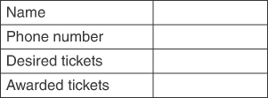

# 概述
在这一章当中

- 什么是数据结构和算法？
- 数据结构概述
- 算法概述
- 一些定义
- 用 Python 编程
- 面向对象编程

你已经编写了一些程序并且学到了足够的知识来认为编程很有趣，或者至少很有趣。 有些部分很容易，有些部分很难。 你想了解更多关于如何简化流程、克服困难并克服更复杂任务的信息。 你开始研究计算机科学的核心，这带来了很多问题。 本章为学习如何使程序正确快速地运行奠定了基础。 它解释了一堆新术语，并补充了我们在示例中使用的编程语言的背景知识。

## 什么是数据结构和算法？
数据组织是使用计算机的各种存储介质（例如随机存取存储器或 RAM 和磁盘）在计算机中排列数据的方式，以及如何解释数据以表示某些东西。算法是用于操作这些结构中的数据的过程。数据的排列方式可以简化算法，使算法运行得更快或更慢。数据组织和算法共同构成了数据结构。数据结构就像构建块一样，具有更复杂的数据结构，使用其他数据结构作为具有适当算法的组件。
数据的排列方式和用于处理数据的算法是否有所不同？答案是肯定的。从非程序员的角度来看，计算机似乎可以做任何事情并且做得非常快。这不是真的。要了解原因，让我们看一个非编程示例。
当你做饭时，需要以特定方式组合和操作一系列食材。你可以通过多种方式来完成完成这顿饭所需的各个步骤。其中一些方法将比其他方法更有效。假设你有一份书面食谱，但正在一个陌生的厨房工作，也许是在拜访朋友时。制作这顿饭的一种方法是方法 A：

1. 通读完整的食谱，注意它提到的所有成分、它们的数量以及加工它们所需的任何设备。
2. 找到原料，量出所需的数量，然后储存起来。
3. 拿出完成食谱中的步骤所需的所有设备。
4. 按照指定的顺序完成食谱的步骤。

让我们将其与方法 B 进行比较：

1. 阅读配方，直到你确定完成第一步所需的第一组成分或设备。
2. 找到已识别的成分或设备。
3. 测量发现的任何成分。
4. 使用已经找到的设备和成分执行第一步。

返回此方法的开头并重复将单词 ```first``` 替换为 ```next``` 的说明。如果没有下一步，则退出。
这两种方法都是完整的，如果所有的成分和设备都可用，它们应该完成完整的配方。对于简单的食谱，它们也应该花费大约相同的时间。随着食谱变得越来越复杂，方法也有所不同。例如，如果你找不到第五种成分怎么办？在方法 A 中，在组合任何其他成分之前，在开始时就确定了该问题。虽然这两种方法都没有真正解释如何处理缺失成分等异常，但你仍然可以在以相同方式处理异常的假设下比较它们。
可以通过多种方式处理缺少的成分：找到替代成分，扩大对成分的搜索范围（查看其他房间，询问邻居，去市场）或忽略成分（可选装饰）。这些补救措施中的每一个都需要一些时间。如果缺少一种成分，并且使用不同方法的两个厨师以相同的方式处理它，则两者都会延迟相同的时间。但是，如果有多种缺失的成分，方法 A 应该更早地识别出那些缺失的成分，并考虑在一次访问邻居或市场时获得所有缺失成分的可能性。结合替换缺失成分的任务可以节省大量时间（想象一下市场很远，或者邻居每次访问都想聊几个小时）。
执行操作的顺序可能会对完成用餐所需的时间产生重大影响。另一个区别可能是餐点的质量。例如，在方法 B 中，厨师将执行第一个"步骤"，然后继续下一步。让我们假设这些步骤使用两组不同的成分或设备。如果查找或测量成分，或为后续步骤获取设备需要大量时间，那么第一步的结果会持续很长时间。这会对饭菜的质量产生不良影响。在某些情况下，厨师可能能够克服这种影响，例如，将第一步的结果放入冰箱或冰箱，然后再将它们恢复到室温。厨师会以牺牲准备食物所需的时间为代价来保持食物的质量。
如果方法 B 需要更长的时间或有降低食品质量的风险，那么它会是可取的吗？也许。想象一下，厨师正在一个家庭亲戚陌生的厨房里准备这顿饭。厨房里挤满了家人，每个人都在努力做一顿饭。在这种拥挤的情况下，每个厨师都很难一次拿出所有的食材和设备。例如，可能没有足够的柜台空间、搅拌碗或刀具，让每位厨师一开始就将所有物品组装好。在等待设备、空间或配料可用时，厨师可能会被限制在单独的步骤上工作。在这种情况下，方法 B 比使用方法 A 要求所有厨师一次工作一个更有优势。
回到编程，算法指定要执行的操作顺序，很像配方中的步骤。数据组织有点类似于食材的存储方式、在厨房中的布置方式以及它们与其他食材和设备的接近程度。例如，与需要从邻居或市场取回食材相比，将食材放在厨房中会使过程更快。你可以将通过在各个位置分散成分所占用的空间量视为算法所需的空间量。即使所有食材都在厨师所在的厨房里，也有一些方法可以设置食材以加快烹饪任务。将它们按需要的顺序紧凑排列，可以最大限度地减少厨师必须做的移动量。如果在准备过程中必须由另一位厨师代替厨师，则配料的组织也会有所帮助；如果布局井井有条，则可以更快地了解每种成分适合配方的位置。这是良好的数据组织很重要的另一个原因。它还强化了算法和数据组织共同构成数据结构的概念。
数据结构不仅对速度很重要，而且对正确建模数据的含义也很重要。假设有一个很多人想参加的活动，他们需要提交他们的电话号码才有机会获得门票。每个人可以申请多张票。如果门票数量少于想要获得门票的人数，则需要应用某种方法来决定首先联系哪些电话号码并确定他们将收到的门票数量。一种方法是一次检查一个电话号码，然后将票的数量加起来，直到所有票都发完，然后再检查剩余的号码，让他们知道票已经用完了。如果将号码放入以潜在接收者理解的方式定义的有序列表中，这可能是一种公平的方法——例如，对门票感兴趣的人提交的电话号码按时间顺序排列的列表。如果要将彩票作为一种彩票来授予，那么按顺序通过它们意味着遵循列表顺序中隐含的任何偏差。从列表中随机选择一个号码，联系买家，然后删除号码在彩票系统中会更公平。
数据结构通过为每个部分分配特定含义以及它们如何交互来对系统进行建模。 "系统"是现实世界的事物，例如先到先得的门票销售，或彩票赠品，或道路如何连接城市。对于带有票务请求的电话号码列表，先到先得的系统需要按时间顺序排列的列表、指向下一个应该使用的号码的指针，以及指向应该添加任何新到达号码的位置的指针（在所有以前的列表条目之后）。彩票系统需要一个不同的组织，而道路和城市地图的建模需要另一个组织。在本书中，我们研究了许多不同的数据结构。每个都有其优点和缺点，适用于不同类型的现实问题。重要的是要了解每个人是如何运作的，它是否正确地模拟了特定问题区域所需的行为，它是否能有效地执行操作，以及它是否可以很好地"扩展"。我们说，如果数据结构或算法随着数据量的增长而尽可能高效地执行，那么它就可以很好地扩展。

## 数据结构概述
正如我们所讨论的，并非每个数据结构都可以模拟每种类型的问题。或者也许更好的说法是结构笨拙或低效地模拟问题。你可以通过查看你可能对所有数据结构执行的常见操作来概括数据结构。例如，要管理票证请求，你需要

- 添加新电话号码（适用于想要一张或多张门票的人）
- 删除电话号码（适用于后来决定不想要门票的人）
- 找到一个特定的电话号码（下一个通过某种方法获得票，或根据其特征查找一个）
- 列出所有电话号码（仅显示一次所有电话号码，即不重复，除非可能出现多个相同条目）

几乎每个管理大量类似对象的数据结构都需要这四个操作。我们称它们为插入、删除、搜索和遍历。
以下是本书涵盖的数据结构列表，以及它们在四种操作方面的一些优缺点。表 1-1 显示了结构的高级视图；我们将在接下来的章节中更详细地讨论它们。该表中提到的一个方面是数据结构的复杂性。在这种情况下，我们指的是结构易于被程序员理解的能力，而不是计算机操作它的速度。

表 1-1 不同数据类型的比较

| 数据结构 |                             优点                             |                             缺点                             |
| :------: | :----------------------------------------------------------: | :----------------------------------------------------------: |
|   数组   |        简单。只要索引已知，就可以快速插入。快速遍历。        |             搜索慢，一开始就知道大小。生长缓慢。             |
| 有序数组 |    与数组相同，但如果按排序键查找，则可以更快地搜索对象。    |                         与数组相同。                         |
|    栈    |       简单。后进先出 (LIFO) 插入和删除快速。快速遍历。       |                 缓慢搜索后进先出以外的对象。                 |
|   队列   |    中度复杂。快速的先进先出 (FIFO) 插入和删除。快速遍历。    |                缓慢搜索除先进先出以外的对象。                |
|   链表   | 中度复杂。快速插入和删除列表中的已知位置。易于生长和缩小。快速遍历。 |                          搜索缓慢。                          |
|  二叉树  | 中度复杂。树平衡时快速搜索、插入和删除。易于生长和缩小。快速遍历。 |               删除算法很复杂，平衡可能很耗时。               |
|  红黑树  |        快速搜索、插入和删除。树总是平衡的。快速遍历。        |                             复杂                             |
| 2-3-4 树 | 快速搜索、插入和删除。树总是平衡的。类似的树适合磁盘存储。易于生长和缩小。快速遍历。 |                             复杂                             |
|  四叉树  | 通过二维坐标快速搜索、插入和删除。易于生长和缩小。快速遍历。 |                             复杂                             |
|  哈希表  |          快速搜索。大多数情况下快速插入和快速删除。          | 复杂。可以比其他数据结构占用更多空间。遍历可能比其他的稍慢。 |
|    堆    |    中度复杂。按排序顺序快速插入和快速删除对象。快速遍历。    |             缓慢搜索除最小值或最大值之外的对象。             |
|    图    |                 节点和边的快速插入和无序遍历                 | 复杂。缓慢搜索（按标签）和删除。根据路径限制，遍历可能会很慢。可以比其他数据结构占用更多空间。 |

## 算法概述
算法是使用数据结构或结构组实现操作的方法。有时可以将单个算法应用于多个数据结构，每个数据结构都需要算法的一些变化。例如，深度优先搜索算法适用于所有树数据结构，可能是图，甚至可能是堆栈和队列（将堆栈视为分支因子为 1 的树）。然而，在大多数情况下，算法与特定的数据结构密切相关，并且不容易推广到其他数据结构。例如，插入新对象或搜索对象是否存在的方式对于每个数据结构都是非常特定的。我们检查所有数据结构的插入、搜索、删除和遍历算法。这说明了它们因数据结构和这些结构所涉及的复杂性而有多大差异。
另一个核心算法是排序，其中一组对象按特定顺序放置。订购商品可以更快地搜索商品。执行排序操作的方法有很多种，我们将[第 3 章](./03-简单排序.md)"简单排序"专门讨论这个主题，并在[第 7 章](./07-高级排序.md)"高级排序"中重新讨论这个问题。
算法通常是递归定义的，其中算法的一部分是指在数据的某个子集上再次执行算法。这个非常重要的概念可以简化算法的定义，并且很容易证明实现的正确性。我们将在[第 6 章](./06-递归.md)"递归"中更详细地研究该主题。

## 一些定义
本节提供了一些关键术语的定义。

### 数据库

我们使用术语数据库来指代在特定情况下正在处理的数据的完整集合。使用对门票感兴趣的人的示例，数据库可以包含电话号码、姓名、所需的门票数量和奖励的门票。这是比关系数据库或面向对象数据库更广泛的定义。

### 记录

记录对相关数据进行分组，是划分数据库的单元。它们提供了一种存储信息的格式。在票证分发示例中，一条记录可以包含一个人的姓名、一个人的电话号码、所需的票数和奖励票数。在存在许多此类实体的情况下，记录通常包括有关某个实体的所有信息。一条记录可能对应于银行应用程序的用户、汽车用品库存中的汽车部件或视频集合中存储的视频。

### 字段

记录通常分为几个字段。每个字段都包含一种特定类型的数据。在票证分发示例中，字段可能如图 1-1 所示。



这些字段已命名并具有值。图 1-1 显示了一个空框，表示该值的存储空间。在许多系统中，值的类型仅限于单一或小范围的数据类型，就像许多编程语言中的变量一样。例如，可以将所需的票数限制为仅整数或仅非负整数。在面向对象的系统中，对象通常代表记录，每个对象的属性就是该记录的字段。各种编程语言中的术语可能不同。对象属性可以称为成员、字段或变量。

### 键

搜索记录或对其进行排序时，其中一个字段称为键（或搜索键或排序键）。搜索算法寻找键值与某个目标值的精确匹配，并返回包含它的记录。然后调用搜索例程的程序可以访问记录中的所有字段。例如，在票证分发系统中，你可能会通过特定电话号码搜索记录，然后查看该记录中所需票证的数量。另一种搜索可以使用不同的键。例如，你可以使用所需票证作为搜索关键字来搜索记录，并查找想要三张票证的人。请注意，在这种情况下，你可以定义搜索以返回它找到的第一个此类记录或所需票证数量为三的所有记录的集合。

### 数据库与数据结构

表示数据库的记录集合将需要一个数据结构来实现它。数据库中的每条记录也可以被视为具有自己的数据组织和算法的数据结构。这种将数据分解成越来越小的单元的过程一直持续到你得到原始数据结构，如整数、浮点数、字符和布尔值。并非所有数据结构都可以视为数据库；它们必须支持插入、搜索、删除和遍历记录以实现数据库。

## 用 Python 编程
Python 是一种编程语言，于 1991 年首次亮相。它包含面向对象的编程并引入了语法，使许多常见的操作变得非常简洁和优雅。刚接触 Python 的程序员首先注意到的一件事是，某些空格对程序的含义很重要。这意味着，当你编辑 Python 程序时，你应该使用能够识别其语法并帮助你按照预期工作的程序创建程序的编辑器。许多编辑器都会这样做，甚至无法通过文件扩展名或前几行文本识别语法的编辑器通常可以配置为对特定文件使用 Python 语法。

### 解释器

Python 是一种解释型语言，这意味着即使有编译器，你也可以通过将文本传递给解释器程序来执行程序和单独的表达式和语句。编译器的工作原理是将程序的源代码翻译成机器更容易读取且处理效率更高的字节码。许多 Python 程序员永远不必考虑编译器，因为 Python 解释器会在适当的时候自动运行它。
解释型语言的巨大好处是允许你使用交互式命令行解释器来尝试部分代码。通常有多种方法可以启动 Python 解释器，具体取决于 Python 在计算机上的安装方式。如果你使用大多数 Python 发行版附带的 IDLE 等集成开发环境 (```IDE```)，则会有一个运行命令行解释器的窗口。启动解释器的方法因 ```IDE``` 而异。当 IDLE 启动时，它会自动启动命令行解释器并将其称为 Shell。
在没有安装 Python ```IDE``` 的计算机上，你仍然可以从命令行界面（有时称为终端窗口、shell 或控制台）启动 Python 解释器。在该命令行界面中，键入 python，然后按 Return 或 Enter 键。它应该显示你正在使用的 Python 版本以及其他一些信息，然后等待你在 Python 中键入一些表达式。读取表达式后，解释器决定它是否完整，如果是，则计算表达式的值并打印它。清单 1-1 中的示例展示了使用 Python 解释器计算一些数学结果。
清单 1-1 使用 Python 解释器进行数学运算

```python
$ python
Python 3.6.0 (default, Dec 23 2016, 13:19:00)
Type "help", "copyright", "credits" or "license" for more information.
>>> 2019 - 1991
28
>>> 2**32 - 1
4294967295
>>> 10**27 + 1
1000000000000000000000000001
>>> 10**27 + 1.001
1e+27
>>>
```

在示例 1-1 中，我们将你键入的文本用蓝色斜体着色。第一个美元符号 (\$) 是命令行解释器的提示符。 Python 解释器打印出其余的文本。我们在本书中使用的 Python 是版本 3。如果你在第一行看到 Python 2……，那么你使用的是旧版本的 Python 解释器。尝试在命令行界面中运行 python3 以查看计算机上是否已安装 Python 版本 3。如果没有，要么升级 Python 的版本，要么找到另一台装有 python3 的计算机。对于新程序员来说，Python 2 和 3 之间的差异可能很微妙且难以理解，因此获得正确的版本很重要。 Python 的每个次要版本之间也存在差异，例如 3.8 和 3.9 版本之间。检查 https://docs.python.org 上的在线文档以查找更改。
解释器继续提示输入 Python 表达式、评估它们并打印它们的值，直到你要求它停止。 Python 解释器使用 >>> 提示输入表达式。如果你想终止解释器并且你正在使用 ```IDE```，你通常会退出 ```IDE``` 应用程序。对于在命令行界面中启动的解释器，你可以按 ```Ctrl-D``` 或有时按 ```Ctrl-C``` 退出 Python 解释器。在本书中，我们展示了所有从命令行启动的 Python 示例，命令以 ```\$ python3``` 开头。
在清单 1-1 中，你可以看到简单的算术表达式产生的结果与其他编程语言一样。可能不太明显的是，可以像较小的整数一样计算和使用小整数和非常大的整数（大于适合 32 或 64 位数据的整数）。例如，查看表达式 ```10\*\*27 + 1``` 的结果。请注意，这些大整数与浮点数不同。将整数和浮点数相加时，如 ```10\*\*27 + 1.0001```，大整数将转换为浮点表示。因为浮点数仅对固定的小数位数具有足够的精度，所以结果被四舍五入为 ```1e+27``` 或 ```1 × 10 ^27^```。
即使以交互方式使用 Python 解释器，空格语法也很重要。嵌套表达式使用缩进而不是可见字符来包含有条件计算的表达式。例如，Python ```if``` 语句通过缩进区分 ```then``` 表达式和 ```else``` 表达式。在 C++ 和 JavaScript 中，你可以编写

```c++
if (x / 2 == 1) {do_two(x)}
else {do_other(x)}
```

花括号将这两个表达式括起来。在 Python 中，你会写

```python
if x / 2 == 1:
    do_two(x)
else:
    do_other(x)
```

你必须缩进两个过程调用行，以便解释器识别它们与之前行的关系。你必须在缩进中保持一致，在每个缩进行上使用相同的制表符或空格，以便解释器知道嵌套表达式处于同一级别。将缩进更改视为开放花括号和闭合花括号的替换。当缩进增加时，它是一个左大括号。当它减少时，它是一个右括号。
当你以交互方式输入前面的表达式时，Python 解释器会使用省略号提示 (...) 提示输入其他行。这些提示一直持续到你输入一个空行来表示顶级表达式的结束。脚本如下所示，假设 x 为 3 并且 ```do_other()``` 过程打印一条消息：

```python
>>> if x / 2 == 1:
...    do_two(x)
... else:
...    do_other(x)
...
Processing other value
>>>
```

请注意，如果你之前只使用过 Python 2，前面的结果可能会让你感到惊讶，你应该在 https://docs.python.org 阅读两个版本之间差异的详细信息。要在 Python 3 中获得整数除法，请使用双斜杠 (//) 运算符。
如果逻辑行处于同一嵌套级别，Python 要求它们的缩进相同。逻辑行是完整的语句或表达式。一个逻辑行可能跨越多行文本，例如前面的 ```if``` 语句。在 ```if``` 语句的 ```then``` 或 ```else``` 子句之后要执行的下一个逻辑行应该以与 ```if``` 语句相同的缩进开始。更深的缩进表示稍后执行的语句（如在函数定义中）、有条件的（如在 ```else``` 子句中）、重复执行（如在循环中）或作为较大构造的一部分（如在类定义中）。如果你有较长的表达式，你希望将其拆分为多行，则它们要么

- 需要在括号内或其他括号表达式类型之一（列表、元组、集合或字典），或
- 需要以反斜杠字符 (\) 结束，表达式的最后一行除外

在括号/括号内，缩进可以是任何你喜欢的，因为右括号/括号决定了表达式的结束位置。当包含表达式的逻辑行结束时，下一个逻辑行应该与刚刚结束的逻辑行处于同一缩进级别。下面的例子显示了一些不寻常的缩进来说明这个想法：

```python
>>> x = 9
>>> if (x % 2 == 0):
...    if (x % 3 == 0):
...       'Divisible by 6'
...    else:
...       'Divisible by 2'
... else:
...    if (x % 3 == 0):
...       'Divisible by 3'
...    else:
...       'Not divisble by 2 or 3'
...
'Divisible by 3'
```

示例中的可分性测试出现在括号内，并以任意方式跨行拆分。因为括号是平衡的，Python 解释器知道 ```if``` 测试表达式在哪里结束，并且不会抱怨奇怪的缩进。但是，嵌套的 ```if``` 语句必须具有相同的缩进，才能在条件测试中被识别为处于相同的级别。 ```else``` 子句必须与相应的 ```if``` 语句处于相同的缩进位置，以便解释器识别它们的关系。如果第一个 ```else``` 子句被省略，如下例所示，

```python
>>> if (x % 2 == 0):
...    if (x % 3 == 0):
...       'Divisible by 6'
... else:
...    if (x % 3 == 0):
...       'Divisible by 3'
...    else:
...       'Not divisble by 2 or 3'
...
'Divisible by 3'
```

然后缩进清楚地表明第一个 ```else``` 子句现在属于 ```if (x % 2 == 0)``` 而不是嵌套的 ```if (x % 3 == 0)```。如果 x 为 4，则该语句将评估为 ```None```，因为省略了 ```else``` 子句。强制缩进让结构更清晰，混入非常规缩进让程序非常难读！
字符串内部的空格很重要并且被保留。简单字符串用单引号 (') 或双引号 (") 字符括起来。它们不能跨行，但可能包含转义的空格，例如换行符 ```(\n)``` 或制表符 ```(\t)``` 字符，例如，

```python
>>> "Planck's constant:\n quantum of action:\t6.6e-34"
"Planck's constant:\n quantum of action:\t6.6e-34"
>>> print("Planck's constant:\n quantum of action:\t6.6e-34")
Planck's constant:
 quantum of action:	6.6e-34
```

解释器从输入中读取双引号字符串并以打印表示形式显示它，与在源代码中输入它的方式基本相同，反斜杠用于转义特殊空格。如果将相同的双引号字符串提供给 print 函数，它将以输出形式打印嵌入的空格。要创建具有许多嵌入换行符的长字符串，你可以将字符串括在三引号字符（单引号或双引号）中。

```python
>>> """Python
... enforces readability
... using structured
... indentation.
... """
'Python\nenforces readability\nusing structured\nindentation.\n'
```

长的多行字符串作为函数定义中的文档字符串特别有用。
你可以通过以井号 (#) 开头并继续到行尾来向代码添加注释。多行注释的左侧必须各有自己的井号。例如：

```python
def within(x, lo, hi):   # Check if x is within the [lo, hi] range
    return lo <= x and x <= hi  # Include hi in the range
```

我们为 Python 使用的注释和保留字添加了一些颜色突出显示，例如 ```def```、```return``` 和 ```and```, 以提高可读性。我们将很快讨论这些术语的含义。请注意，注释在源代码文件中可见，但在运行时环境中不可用。前面提到的文档字符串附加到代码中的对象，如函数定义，并且在运行时可用。
### 动态类型

Python 和其他一些语言之间的下一个最显着的区别是它使用动态类型。这意味着变量的数据类型是在运行时确定的，而不是在编译时声明的。事实上，Python 根本不需要任何变量声明。只需为变量标识符赋值即可创建变量。你可以更改值并在以后的分配中键入。例如，

```python
>>> x = 2
>>> x
2
>>> x = 2.71828
>>> x
2.71828
>>> x = 'two'
>>> x
'two'
```

赋值语句本身不返回值，因此在每个赋值语句之后不会打印任何内容（更准确地说，返回 Python 的 ```None``` 值，并且当类型化表达式的计算结果为 ```None``` 时，解释器不打印任何内容）。在 Python 3.8 中，引入了一个新的运算符 ```:=```，它允许在返回值的表达式中进行赋值。例如，评估

```python
(x := 2) ** 2 + (y := 3) ** 2
```

将 x 设置为 2 并将 y 设置为 3 并返回 13 作为值。
变量值的类型可以由 ```type()``` 函数确定或使用 ```isinstance()``` 函数进行测试。

### 列表

Python 中的数组与其他语言中的数组不同。 "看起来像"数组的内置数据类型称为列表。 Python 的列表类型是其他语言中的数组和链表的混合体。与变量一样，Python 列表的元素是动态类型的，因此它们不必都是相同的类型。创建列表时不需要声明最大元素数，并且列表可以在运行时增长和收缩。 Python 列表和其他链表结构的不同之处在于，它们可以像数组一样被索引以检索任何位置的任何元素。 Python 的核心中没有称为数组的数据类型，但是有一个可以导入的数组模块。 ```array``` 模块允许构造固定类型元素的数组。
在本书中，我们广泛使用了内置列表数据类型，就好像它是一个数组一样。这是为了语法方便，并且因为列表的底层实现在对元素的索引访问方面就像数组一样。但是请注意，我们并未使用 Python 列表类型提供的所有功能。原因是我们想展示固定类型、固定长度的数组在所有计算机语言中的行为方式。对于新程序员来说，最好使用内置列表附带的更简单的语法来构造数组，同时学习如何在算法中操作它们的内容。
Python 的内置列表使用 0 相对索引进行索引。例如：

```python
>>> a = [1, 'a', False]
>>> a
[1, 'a', False]
>>> len(a)
3
>>> a[2]
False
>>> a[2] = True
>>> a
[1, 'a', True]
>>>
```

示例中的三元素列表包含一个整数、一个字符串和一个布尔值。方括号用于创建一个新列表（如对 ```a``` 的第一次赋值）或包含现有列表的索引（如在 ```a[2]``` 中）。内置 ```len()``` 函数用于确定其参数的当前大小。可以使用赋值语句更改列表中的各个值。字符串可以被视为列表或字符数组，除了与列表不同的是，字符串是不可变的，这意味着在创建字符串之后，字符串的字符不能更改。在 Python 3 中，字符串总是包含 Unicode 字符，这意味着每个字符可以有多个字节。

```python
>>> s = 'π = 3.14159'
>>> s
'π = 3.14159'
>>> len(s)
11
>>> π = 3.14159
>>> π
3.14159
```

在前面的示例中，字符串 s 包含希腊字母 ```π```，它被 ```len()``` 函数计为一个字符，而 Unicode 字符占用两个字节的空间。 Unicode 字符也可用于 Python 3 中的变量名，如使用 ```π``` 作为变量名所示。
Python 将所有可索引的数据类型（如列表、数组和字符串）视为序列数据类型。可以对序列数据类型进行切片以形成新序列。切片意味着创建数据的子序列，相当于获取字符串的子串。切片由开始和结束索引指定，以冒号 (:) 字符分隔。从开始索引到结束索引的每个元素都被复制到新序列中，但不包括结束索引。开始索引默认为0，即序列的开始，结束索引默认为序列的长度。你可以对数组和切片索引使用负数。负索引从序列末尾倒数； -1 表示最后一个元素，-2 表示倒数第二个元素，依此类推。以下是一些带有字符串的示例：

```python
>>> digits = '0123456789'
>>> digits[3]
'3'
>>> digits[-1]
'9'
>>> digits[-2]
'8'
>>> digits[3:6]
'345'
>>> digits[:-2]
'01234567'
```

序列数据类型可以连接、相乘、搜索和枚举。这些操作有时需要更多其他语言的函数调用，但 Python 提供了简单的语法来执行它们。例如：

```python
>>> [1, 2, 3] + ['a', 'b']
[1, 2, 3, 'a', 'b']
>>> '011' * 7
'011011011011011011011'
>>> '011' * 0
''
>>> 3 in [1, 2, 3]
True
>>> 'elm' in ['Elm', 'Asp', 'Oak']
False
```

前面的示例显示了两个列表，它们用加号 (+) 运算符连接以形成一个更长的列表。将一个字符串乘以一个整数会产生该字符串的多个副本，并连接在一起。 in 运算符是在序列中搜索元素的布尔测试。它使用 == 相等测试来确定元素是否匹配。这些操作适用于所有序列数据类型。这种紧凑的语法隐藏了遍历每个序列元素并执行某些操作（例如相等性测试或将值复制到新序列）的一些复杂性。
### 循环和迭代

我们经常希望实现按顺序处理序列中每个元素的算法。为此，Python 有几种方法来迭代和枚举序列。例如：

```python
>>> total = 0
>>> for x in [5, 4, 3, 2, 1]:
...     total += x
...
>>> total
15
```

序列语法中的 ```for``` 变量是 Python 中的基本循环构造（或迭代）。嵌套表达式对序列中的每个值进行一次评估，变量绑定到该值。无需显式操作指向序列当前元素的索引变量；这是由 Python 解释器处理的。尝试在交互式解释器中输入此表达式时的一个常见错误是忘记嵌套表达式后的空行。

```python
>>> total = 0
>>> for x in [5, 4, 3, 2, 1]:
...     total += x
... total
  File "<stdin>", line 3
    total
        ^
SyntaxError: invalid syntax
```

这很常见的原因是只有交互式解释器才需要空行。写入文件中的相同 Python 表达式不会将此报告为错误。然而，交互式解释器等待空行表示 ```for``` 循环结束并开始评估该完整表达式。当解释器发现一个新的表达式以与 ```for``` 循环相同的缩进级别开始时，它正在处理两个连续的表达式并且不允许它。在开始确定下一个表达式的开始和结束位置之前，解释器希望读取一个表达式，对其求值并打印该值。
在某些情况下，具有显式索引变量很重要。在这些情况下，有几种方便的方法来执行工作。例如：

```python
>>> height = [5, 4, 7, 2, 3]
>>> weightedsum = 0
>>> for i in range(len(height)):
...     weightedsum += i * height[i]
...
>>> weightedsum
36
>>> for i, h in enumerate(height):
...     weightedsum += i * h
...
>>> weightedsum
72
```

该示例计算了一个加权和，我们将高度列表中的每个值乘以该值的索引。 ```range()``` 函数可以被认为是一个函数，它产生一个整数列表，从 0 开始，一直到但不等于它的参数。通过将 ```len(height)``` 作为参数传递，```range()``` 生成列表 ```[0, 1, 2, 3, 4]```。在第一个 for 循环的主体中，```weightedsum``` 变量由索引 ```i``` 和 ```i``` 在高度列表中索引的值的乘积递增。第二个 for 循环使用称为枚举的更简洁的形式重复相同的计算。 ```enumerate()``` 函数可以被认为是将一个序列作为输入并产生一个对序列。每对的第一个元素是一个索引，第二个是其序列参数的对应值。第二个 ```for``` 循环有两个用逗号分隔的变量 ```i``` 和 ```h```，而不是像前面的循环中只有一个。在枚举循环的每次迭代中，```i``` 绑定到索引，```h``` 绑定到来自 ```height``` 的相应值。 Python 使循环序列的常见模式非常容易编写，无论有无索引变量。
```range()``` 和 ```enumerate()``` 函数实际上创建了迭代器，它们是在每次循环迭代中被调用以获取序列的下一个值的复杂数据类型。它实际上并没有在内存中为完整序列生成一个列表。我们将在[第 5 章](./05-链表.md)"链表"中讨论如何使用迭代器来表示非常长的序列而不占用太多内存。

### 多值赋值

逗号分隔的变量列表也可用于赋值语句中，以使用单个等号 (```=```) 运算符执行多个赋值。当分配的所有值都密切相关时，这最有意义，例如向量的坐标。为了显示：

```python
>>> x, y, z = 3, 4, 5
>>> y
4
>>> (x, y, z) = [7, 8, 9]
>>> y
8
```

赋值运算符两边的序列必须具有相同的长度；否则，会发生错误。序列可以是不同的类型。这里的第二个赋值使用左侧的元组和右侧的列表。 Python的元组数据类型也是一种序列数据类型，与列表非常相似，区别在于它的元素不能被修改。在这种情况下，左边的元组必须是变量名的元组。逗号是创建 x、y 和 z 变量的元组的运算符。它们中的每一个都绑定到右侧列表中的相应值。回顾前面示例中的枚举循环，循环的迭代执行相当于

```python
>>> i, h = (0, 5)
>>> weightedsum += i * h
>>> i, h = (1, 4)
>>> weightedsum += i * h
>>> i, h = (2, 7)
>>> weightedsum += i * h
>>> i, h = (3, 2)
>>> weightedsum += i * h
>>> i, h = (4, 3)
>>> weightedsum += i * h
```

Python 的多值赋值可用于交换或旋转值。这对于必须使用显式临时变量来保存一个或多个值的其他语言的程序员来说可能是一个惊喜。例如：

```python
>>> left, middle, right = 'Elm', 'Asp', 'Oak'
>>> left, middle, right
('Elm', 'Asp', 'Oak')
>>> left, middle, right = middle, right, left
>>> left, middle, right
('Asp', 'Oak', 'Elm')
```

Python 解释器计算等号右侧的所有表达式，将结果放入一个元组中，然后从该元组对左侧的变量进行赋值。保存结果的元组类似于隐藏的临时变量。等号运算符两边的元组周围的括号是可选的。
还有另一种赋值语句，看起来像多值赋值，但又有所不同。你可以使用它为多个变量分配相同的值。例如：

```python
>>> left = middle = right = 'Gum'
>>> left, middle, right
('Gum', 'Gum', 'Gum')
```

几个变量都被赋予了相同的值。然而，整个赋值语句仍然评估为无。
### 导入模块

函数也可以以元组的形式返回多个值。你可以决定是将所有这些值存储为单个元组，还是存储在多个变量中，每个元组的元素一个，就像多值赋值一样。一个很好的例子是拆分路径名组件。 ```os``` 模块位于 Python 的标准库中，并提供了许多工具来在运行 Python 的底层操作系统上进行操作。要访问一个模块，你需要导入它。导入后，你可以通过模块名称引用其内容，后跟一个句点，然后是其中一个函数的名称或其他定义。例如：

```python
>>> import math
>>> math.pi
3.141592653589793
>>> import os
>>> os.path.splitext('myfile.ext')
('myfile', '.ext')
>>> filename, extension = os.path.splitext('myfile.ext')
>>> extension
'.ext'
```

```import``` 语句为它定义的所有对象创建一个命名空间。这对于避免你定义的变量或函数与模块中的变量或函数之间的冲突非常重要。在前面的示例中，```pi``` 的值存储在数学命名空间中。如果你有一个单独的定义，比如 ```pi = 3.1``` 这样的近似值，你的程序可以毫无混淆地引用每个定义。 ```os``` 模块有子模块，其中之一是路径模块。嵌套子模块创建嵌套命名空间，对应的名称用句点分隔。 ```os.path.splitext()``` 函数在最后一个句点拆分文件名，并将两部分作为元组返回。前面的示例显示了将结果绑定到两个变量（文件名和扩展名），然后显示了扩展名的值。有时，你可能会调用一个返回多个值而不需要保留所有值的函数。一些 Python 程序员喜欢使用最简单的变量名，即单个下划线 (```_```) 作为一次性变量。例如，如果只需要文件扩展名，你可以写

```python
_, extension = os.path.splitext('myfile.ext')
```

### 函数和子例程

当然，所有编程语言的核心是定义函数和子程序的能力。在 Python 中，它们是用 ```def``` 语句定义的。函数接受的参数在变量列表中提供。参数可以是强制的或可选的；可选的必须有一个默认值，以便在它们丢失时使用。 ```def``` 语句包含函数名、括号中的参数列表、冒号，后跟作为例程主体的嵌套表达式。如果它是一个函数，则主体应包含一个或多个返回语句以返回要返回的值。其他编程语言中的子例程不返回值。在 Python 中，所有函数和子例程都会返回一些东西，但是如果 ```def``` 语句的主体中没有提供明确的返回值，那么返回的值就是 ```None```。
这是一个加权求和函数的实现。它需要一系列权重和一系列值。如果权重序列比值的序列短，则使用缺失值作为默认权重。

```python
>>> def weightedsum(values, weights, missing=0):
...     sum = 0
...     for i, val in enumerate(values):
...         sum += val * (weights[i] if i < len(weights) else missing)
...     return sum
...
>>> weightedsum([4, 9, 16, 25], [2, 2])
26
>>> weightedsum([4, 9, 16, 25], [2, 2], 1)
67
```

前面的示例还说明了 Python 的条件表达式，其形式如下：

```python
expression if test_expression else expression
```

首先评估 ```test_expression```。如果为真，则计算并返回最左边的表达式。否则，计算并返回最右边的表达式。
我们将函数 def 语句中的变量称为它的参数。参数是调用者提交给函数的值。大多数时候，参数通过它们在参数列表中的位置来匹配它们的参数。相反，关键字参数可以按任何顺序排列，但必须跟在调用中的任何位置参数之后。函数调用可以通过在参数名称前加上等号 (=) 来指定参数的值。函数定义也可以将一系列参数视为一个列表。这些在函数定义中在参数名称前使用星号 (*) 进行标记。例如，Python 的 ```print``` 函数接受任意数量的要打印的对象以及多个关键字参数，这些参数控制它在打印中使用的分隔符以及它在何处以及如何产生输出。它的定义如下所示：

```python
def print(*objects, sep=' ', end='\n', file=sys.stdout, flush=False):
```

在 ```print``` 子例程的主体中，```objects``` 参数保存要打印的内容列表。默认情况下，打印输出是每个对象值的字符串表示形式，由空格字符分隔并以换行符终止。通常，输出字符串被发送到标准输出流并且可以被缓冲。相反，如果你想将输出发送到由制表符分隔的标准错误流，你可以编写

```python
>>> import sys
>>> print(print,  'is a', type(print),  file=sys.stderr,  sep='\t')
<built-in function print>     is a  <class 'builtin_function_or_method'>
```

在此示例中，对 ```print``` 的调用具有三个位置参数，它们都绑定到对象列表。请注意，```file``` 和 ```sep``` 参数与其对应参数的位置不同。
### 列表推导

对列表的每个元素应用计算或函数以生成新列表是一个非常有用的概念，Python 为其提供了特殊的语法。这个概念被称为列表推导，它在用于创建列表的括号内写成一个小循环：

```python
[expression for variable in sequence]
```

序列部分的 ```for``` 变量与过程循环的语法相同。开头的表达式与循环体相同（除了它不能包含多个语句；只允许一个表达式）。 Python 解释器遍历获取每个元素并将变量绑定到该元素的序列。它在绑定变量的上下文中计算表达式以计算一个值。该计算值被放入输出序列中与输入序列中的元素相同的位置。这里有两种等效的方法来生成另一个列表中值的平方列表：

```python
>>> values = [7, 11, 13, 17, 19]
>>> squares = []
>>> for val in values:
...     squares.append(val * val)
...
>>> squares
[49, 121, 169, 289, 361]
>>> [ x * x for x in values ]
[49, 121, 169, 289, 361]
```

示例中的前几行显示了一个简单的循环，它将方块附加到一个最初为空的列表中。示例中的最后一行将所有这些行（定义值除外）折叠成一个表达式。方括号内的空格是可选的，但许多程序员将其放入是为了更清楚地表明这是一个列表推导，而不是通过评估一系列逗号分隔的表达式创建的列表。
列表推导式是一种非常紧凑的语法，用于描述非常有用的映射概念。它隐藏了索引和循环退出条件的所有实现细节，同时仍然使操作的本质非常清晰。映射在编程中无处不在。在许多应用程序中，需要对大量数据应用相同的操作，并将其收集到与输入类似的结构中。
让我们再看几个理解来理解这个想法。要获得 10 到 20 之间所有整数的立方，你可以编写

```python
>>> [ x ** 3 for x in range(10, 21) ]
[1000, 1331, 1728, 2197, 2744, 3375, 4096, 4913, 5832, 6859, 8000]
```

要拆分连字符的单词，你可以写

```python
>>> [ w.split('-') for w in ['ape', 'ape-man', 'hand-me-down'] ]
[['ape'], ['ape', 'man'], ['hand', 'me', 'down']]
```

循环也可以有一个过滤条件。只有满足条件的元素才会被放入输出序列中。过滤器表达式放在最后，即

```python
[expression for variable in sequence if filter_expression]
```

对于你希望保留在输出中的那些序列元素，过滤器表达式的计算结果应为 ```True```。例如，让我们得到 10 到 20 之间所有不是 3 倍数的整数的立方：

```python
>>> [ x ** 3 for x in range(10, 21) if x % 3 != 0 ]
[1000, 1331, 2197, 2744, 4096, 4913, 6859, 8000]
```

并找到字符串中的所有字母字符：

```python
>>> [ c for c in 'We, the People...' if c.isalpha() ]
['W', 'e', 't', 'h', 'e', 'P', 'e', 'o', 'p', 'l', 'e']
```

这些紧凑的形式使描述核心操作变得容易，同时隐藏了实现基本操作所需的许多循环细节。

### 异常

Python 允许程序定义发生特定异常情况时会发生什么。这些异常不仅仅针对错误。 Python 使用异常来处理诸如循环迭代结束、键盘中断和计时器到期之类的事情，这些都是预期的事件。你的程序可以定义新类型的异常以及在它们发生时处理它们的方法。异常处理可以在 ```try except``` 语句中定义。基本形式是

```python
try:
    <statements>
except:
    <statements>
```

```try```: 之后的语句集从上到下执行，当且仅当在该执行过程中发生异常时，才会执行 ```except```: 之后的语句。如果没有发生异常，则执行 ```try except``` 语句之后的下一个逻辑行。
程序可以为不同类型的异常定义不同的处理程序。例如：

```python
try:
    long_running_function()
except KeyboardInterrupt:
    print('Keyboard interrupted long running function')
except IndexError:
    print('Index out of range during long running function')
```

每个 ```except``` 子句都可以指定异常的类型（类）。该类型（或声明的类的子类）的异常会触发相应的语句来执行。当在 ```except``` 子句中没有指定异常类时，如在基本形式示例中，任何类型的异常都会触发子句的执行。
当程序没有为发生的异常类型指定异常处理程序时，Python 的默认异常处理程序会打印出有关异常及其发生位置的信息。 ```try except``` 语句也有可选的 ```else``` 和 ```finally``` 子句，但我们在本书中不使用它们。
你可以使用 raise 语句在程序中指定异常，该语句需要一个参数，一个异常对象来描述条件。该声明

```python
raise Exception('No more tickets')
```

引发一个带有简短描述的一般异常。如果程序在引发此异常时为通用 ```Exception``` 类定义了异常处理程序，则使用它来代替 Python 的默认处理程序。否则，如果你没有在交互式解释器中运行，Python 会打印堆栈跟踪并退出程序。我们将在下一节中详细了解异常对象。

## 面向对象编程
面向对象的编程是作为一种组织数据结构代码的方式而开发的。结构中管理的数据保存在对象中。该对象也称为一类对象的实例。例如，在分发活动门票时，你可能希望一个对象保存想要门票的人的电话号码列表。对象的类可以是一个队列，它可以更容易地实现先到先服务的分发系统（如第 4 章"堆栈和队列"中所述）。对象类定义了在对象实例上实现操作的特定方法。对于票务系统，需要有一种方法来为想要票的人添加新的电话号码。还需要一些方法来获取下一个要拨打的电话号码并记录分配给每个人的票数（可能存储在相同或不同的对象中）。这些方法对类中的所有对象都是通用的，并且对特定于每个实例的数据进行操作。如果有多个事件正在分发门票，则每个事件都需要自己的队列实例。添加电话号码的方法对它们中的每一个都是通用的，并且是从对象类继承的。
Python 使用 ```class``` 语句定义对象的类。它们按层次结构组织，以便类可以继承其他类中的定义。该层次结构的顶部是 Python 的基类 ```object```。类语句中的嵌套语句定义了类； ```def``` 语句定义方法，赋值语句定义类属性。每个定义方法的第一个参数应该是```self```。 ```self``` 参数保存对象实例，允许方法调用其他实例方法和引用实例属性。你可以通过将方法或属性名称附加到保存对象的变量来引用对象实例的方法或属性，并用句点分隔，如 ```object.method()```。
要为对象实例定义构造函数，类定义中应该有一个 ```def __init__()``` 语句。与其他方法一样，```__init__()``` 应该接受 ```self``` 作为其第一个参数。 ```__init__()``` 方法接受空实例并执行任何需要的初始化，例如创建实例变量和设置它们的值（并且不需要像其他语言中的构造函数那样返回 self）。 ```__init__()``` 方法的不同寻常之处在于你很少会看到它在程序中显式调用（即，以 ```variable.__init()``` 的形式）。 Python 有几个特殊的方法和其他结构，它们的名称都以双下划线开头和结尾。我们在文中的示例中使用它们时会指出其中的一些。
清单 1-2 中的简短示例说明了 Python 中面向对象编程的基本元素，以及它处理花哨的数学概念的一些能力。
清单 1-2 面向对象的程序示例，```Object_Oriented_Client.py```

```python
class Power(object):
    """A class that computes a specific power of other numbers.
    In other words, it raises numbers by a constant exponent.
    """

    default_exponent = 2

    def __init__(self, exponent=default_exponent):
        self.exponent = exponent

    def of(self, x):
        return x**self.exponent


class RealPower(Power):  # A subclass of Power for real numbers
    def of(self, x):
        if isinstance(self.exponent, int) or x >= 0:
            return x**self.exponent
        raise ValueError("Fractional powers of negative numbers are imaginary")


print("Power:", Power)
print("Power.default_exponent:", Power.default_exponent)
square = Power()
root = Power(0.5)
print("square: ", square)
print("square.of(3) =", square.of(3))
print("root.of(3) =", root.of(3))
print("root.of(-3) =", root.of(-3))
real_root = RealPower(0.5)
print("real_root.of(3) =", real_root.of(3))
print("real_root.of(-3) =", real_root.of(-3))
print("Done.")
```

清单 1-2 显示了一个包含两个类定义、三个对象实例和一些打印语句的文件，以显示对象的行为方式。第一类 ```Power``` 的目的是制作可用于将数字提高到各种指数的对象。这在类定义后面的可选文档字符串中进行了解释。请注意，这不是 Python 注释，它必须以左侧的井号 (#) 开头。
每个对象实例都使用自己的指数创建，因此你可以创建 ```Power``` 对象来执行不同的幂函数。 ```Power``` 类有一个类属性 ```default_exponent```。如果在创建实例时未提供任何指数，则类的构造函数使用它来定义要使用的指数。
```Power``` 类的构造函数只是将所需的指数存储为实例属性。这有点微妙，因为存在三种不同的存储类型：类属性、实例属性和方法中的局部变量。 ```default_exponent``` 属性是由 ```class``` 语句顶层的赋值定义的，所以它是一个类属性，在所有实例之间共享。 Power 的 ```__init__()``` 方法中的指数参数是一个局部变量，仅在构造函数的求值期间可用。它有一个从类属性提供的默认值。当 ```__init__()``` 为 ```self.exponent``` 赋值时，它会为 ```self``` 创建一个实例属性。 ```instance``` 属性对于正在创建的对象实例是唯一的，并且不与该类的其他对象共享。
```Power``` 类有一个称为 ```of``` 的方法，该方法返回将一个数字提升到实例创建时定义的指数的结果。我们在创建两个实例之后使用它，```square``` 和 ```root```，例如可以使用 ```square.of(3)``` 调用。为了创建第一个实例，程序调用 ```Power(2)``` 并将结果绑定到变量 ```square```。这种行为可能有点出乎意料，因为没有提到 ```__init__()```。这是 Python 使用 ```__init__()``` 等保留名称来填充对象构造函数等特殊角色的示例。当使用函数调用语法（名称后跟带括号的参数列表）引用 ```Power``` 之类的类时，Python 会构建该类的新实例，然后在其上调用 ```__init__()``` 方法。清单 1-2 中的程序对 ```Power()``` 进行了两次调用，以创建一个生成平方的对象和一个生成平方根的对象。
Python 名称中的下划线意味着被定义的对象要么对解释器是特殊的，要么被视为私有的，仅在定义它的块中可见。 Python 使用几个特殊的名称，如 ```__init__``` 来自定义对象和程序的行为。特殊名称以双下划线开头和结尾，并允许使用诸如使用类名作为构造函数调用之类的工具。
在示例 1-2 的示例中，```default_exponent``` 类属性和 ```exponent``` 实例属性都是公共的，因为它们的名称不以下划线开头。如果将名称更改为以下划线开头，则预计它们只能由类及其方法访问，而不能在类或对象之外访问。然而，对访问的限制只是一种惯例； Python 解释器不强制任何属性的隐私，无论其名称如何，它也不提供其他机制来强制隐私。 Python 确实有一种机制来破坏以双下划线开头并以最多一个下划线结尾的类和对象属性的名称。名称重整旨在使特定于类的属性不与子类共享，但它们仍然可以通过重整名称公开访问。
你可以通过将文件名作为参数提供给 Python 解释器程序来运行程序，如下所示（蓝色斜体的彩色文本是你键入的文本）：

```python
$ python3 Object_Oriented_Client.py
Power: <class '__main__.Power'>
Power.default_exponent: 2
square:  <__main__.Power object at 0x10715ad50>
square.of(3) = 9
root.of(3) = 1.7320508075688772
root.of(-3) = (1.0605752387249068e-16+1.7320508075688772j)
real_root.of(3) = 1.7320508075688772
Traceback (most recent call last):
  File "01_code/Object_Oriented_Client.py", line 32, in <module>
    print('real_root.of(-3) =', real_root.of(-3))
  File "01_code/Object_Oriented_Client.py", line 20, in of
    'Fractional powers of negative numbers are imaginary')
ValueError: Fractional powers of negative numbers are imaginary
```

成绩单显示了打印语句的输出。 ```Power``` 是一个类，而 ```square``` 是该类的一个对象实例。 ```square``` 实例是通过调用 ```Power()``` 创建的，没有提供任何参数，因此指数默认为 2。为了创建类似的计算平方根的方法，将 ```Power(0.5)``` 创建的对象分配给 ```root```。程序打印的 3 的平方是预期的 9，3 的平方根是预期的 1.732。
下一个打印语句是 ```-3``` 的平方根，这可能是一个不太预期的结果。它返回一个复数，其中 ```j``` 代表 ```-1``` 的平方根。虽然这对于某些工程应用程序可能很有趣，但你可能希望其他程序具有不同的行为。 ```RealPower``` 类是 ```Power``` 类的子类，当将负数提高到分数幂时会引发异常。
在 ```RealPower``` 的类语句中，它被定义为继承自 ```Power``` 类。这意味着 ```RealPower``` 将具有与 ```Power``` 相同的 ```default_exponent``` 属性和 ```__init__``` 构造函数。在 ```RealPower``` 的类定义中，它用一个新方法替换了 ```of``` 方法，该方法测试指数和数值参数的值。如果它们属于产生虚数的类别，则会引发 ```ValueError``` 异常。
脚本显示了 Python 解释器如何处理异常。它打印一个回溯，显示发生异常时正在评估的函数和方法调用。回溯包括输入文件中的行号和行的副本。遇到异常后，解释器打印回溯，退出，并且不评估文件中的最终打印语句。

## 概括
- 数据可以以不同的方式和使用各种存储介质在计算机中排列。数据被组织和解释以代表某些东西。
- 算法是用于操作数据的过程。
- 通过将良好的数据组织与适当的算法相结合，数据结构提供了所有程序的基本构建块。
- 数据结构的示例是堆栈、列表、队列、树和图。
- 数据结构通常通过它们执行常见操作的效率来进行比较。
- 数据库是许多相似记录的集合，每条记录都描述了一些实体。
- 数据库的记录由字段组成，每个字段都有一个名称和一个值。
- 关键字段用于搜索和排序记录。
- 类似于数据库的数据结构支持四种核心操作：插入、搜索、删除和遍历。
- 数据结构使用面向对象编程实现为类。
- Python 对使用类实现数据结构的面向对象编程提供了丰富的支持。

## 问题
这些问题旨在作为读者的自我测试。答案可以在附录 C 中找到。
1. 允许程序______一条记录，_______一条记录，_______一条记录，并且_______所有记录的数据结构在本书中被认为是数据库。
2. 数据结构是
   1. 由名称和值组成。
   2. 使用附加了方法的字段构建。
   3. 用对象类实现。
   4. 数据库中不变的记录。

3. 如何判断 Python 中的 ```def``` 语句是定义函数还是类方法？
4. 哪些算法可以帮助提高搜索效率？
5. 构造函数是做什么用的？ Python 为它们使用什么特殊名称？
6. 选择一种数据结构而不是另一种的一些原因是什么？
7. 关键字段是做什么用的？
8. 良好的数据组织有助于提高算法的速度，但它还有什么其他好处？
9. 面向对象编程的开发目的是什么？
10. 以下哪些是编程中使用的数据结构？
    1. 回溯
    2. 堆
    3. 列表推导
    4. 哈希表
    5. 食谱
    6. 切片
    7. 二叉树


## 实验
尝试以下实验：

1. 编写一个 Python 列表推导式，它返回字符串中不是空白字符的单个字符。将其应用于字符串"4 and 20 blackbirds."
2. 拿一副扑克牌，抽出 13 张黑桃牌，把剩下的放在一边，然后洗牌。设计一个算法在约束下按数字对它们进行排序：
   1. 所有的牌都必须用一只手拿着。这是"第一手"。
   2. 最初，洗好的牌都堆放在一个方向上，因此只有一张牌是可见的。
   3. 最初，所有的牌都夹在第一只手的拇指和食指之间。
   4. 可以用另一只手拉出堆叠中的可见卡片，并将其放在第一只手的任何手指之间。它只能放在这些手指之间的一叠卡片的正面或背面。
   5. 另一只手一次只能拿着一张牌，并且必须先将它放在第一手牌的某个位置，然后再从其中一张牌中取出另一张可见的牌。
   6. 当手中的所有卡片按排序顺序排列时，算法完成。

将你的算法的效率与同学或朋友的效率进行比较。
