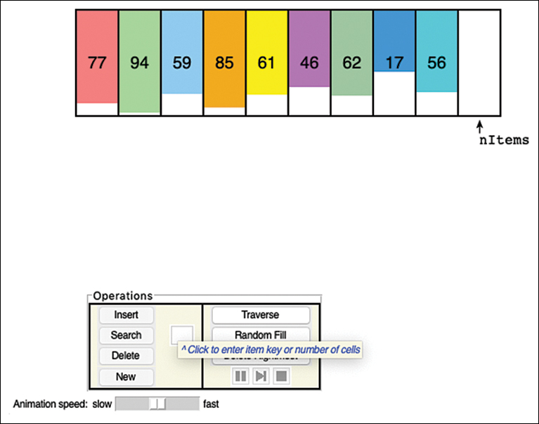
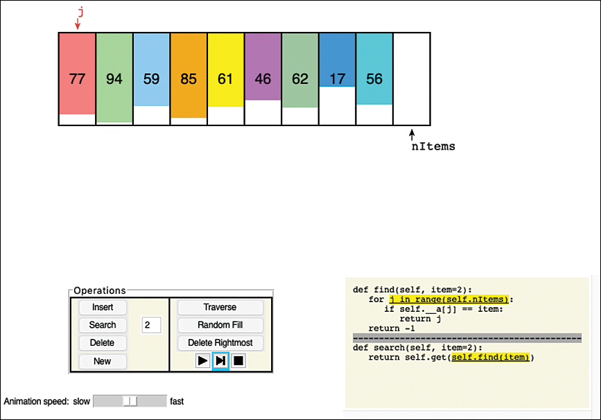
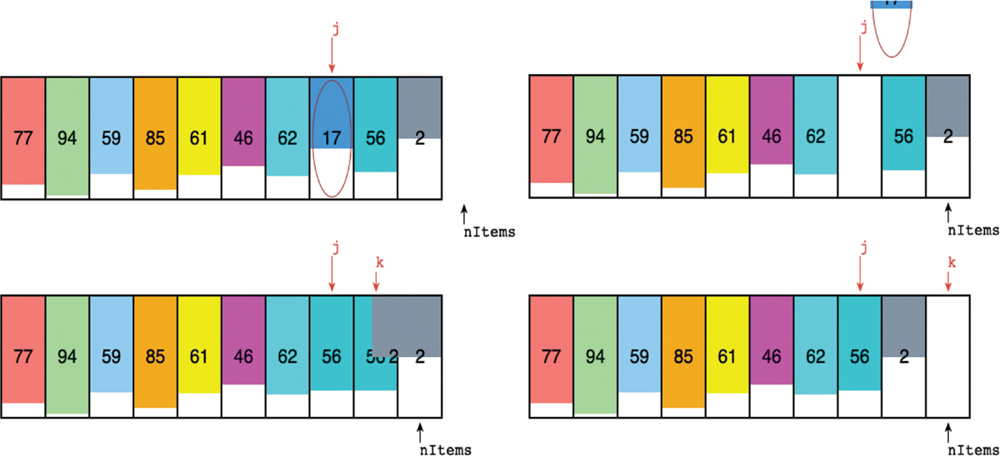
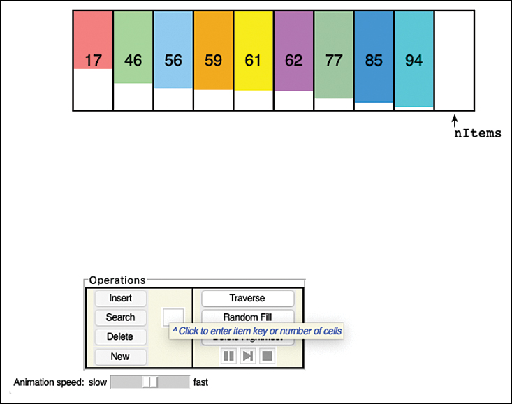
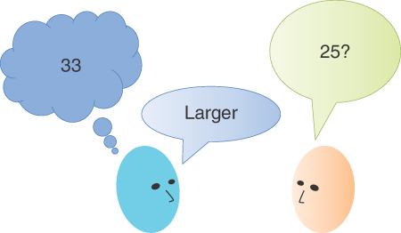
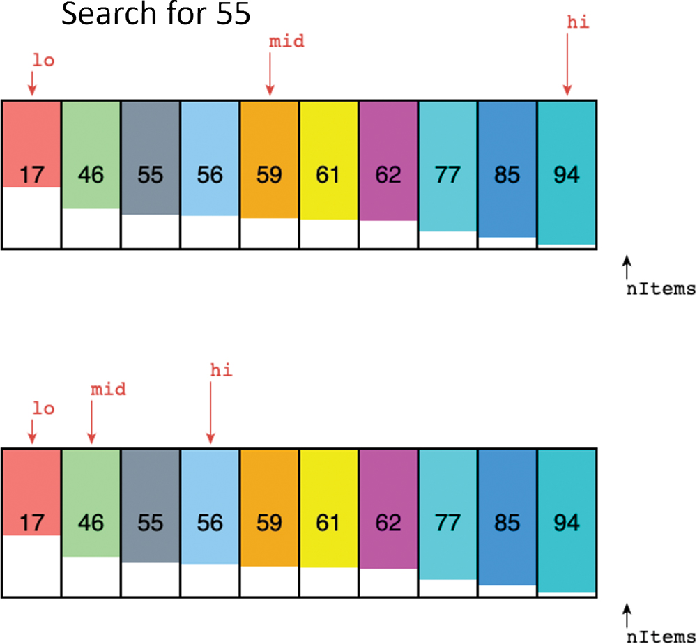
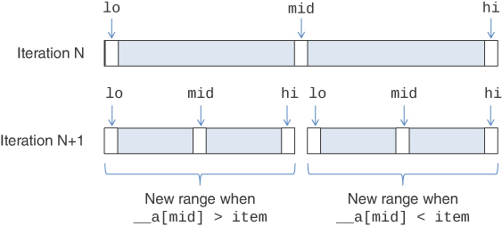
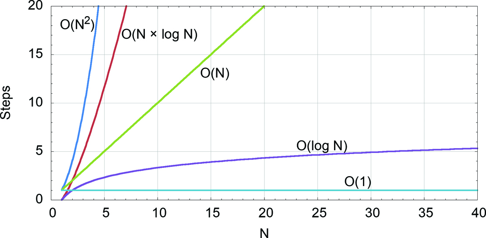

# 数组
在这一章当中

- 数组可视化工具
- 使用 Python 列表实现数组类```OrderedArray``` 可视化工具
- 二进制搜索
- 有序数组类的 Python 代码
- 对数
- 存储对象
- 大 O 符号
- 为什么不对所有东西都使用数组？

由于许多原因，数组是最常用的数据结构。它们易于理解并紧密匹配底层计算机硬件。几乎所有 CPU 都可以非常快速地访问从基地址开始的已知偏移量的数据。几乎每种编程语言都支持它们作为核心数据结构的一部分。我们首先研究它们是因为它们的简单性，并且因为许多更复杂的数据结构都是使用它们构建的。
首先，我们了解如何从数组中插入、搜索和删除数据的基础知识。然后，我们看看如何通过检查一种特殊的数组来改进它，```orderedarray```，其中数据以升序（或降序）键顺序存储。这种安排使得搜索数据项的快速方法成为可能：二分查找。
为了提高数据结构的性能，需要一种衡量性能的方法，而不仅仅是在样本数据上运行它。查看它如何处理特定类型数据的示例可以更容易地理解操作。我们还迈出了第一步，通过查看线性和二进制搜索来概括性能度量，并引入 大 O 表示法，这是最广泛使用的算法效率度量。
假设你正在执教儿童足球联赛，并且你想跟踪练习场上有哪些球员。你需要的是一个用于你的计算机的出勤监控程序——一个维护已出现练习的球员的数据库的程序。你可以使用简单的数据结构来保存这些数据。你希望能够执行几个操作：

- 当球员到达场地时，将球员插入数据结构。
- 通过在结构中搜索玩家的号码来检查是否存在特定玩家。
- 当玩家离开时，从数据结构中删除该玩家。
- 列出所有在场的球员。

这四种操作——插入、搜索、删除和枚举（遍历）——是本书描述的大多数数据存储结构中的基本操作。

## 数组可视化工具
我们通常通过使用可视化工具（一种使操作动画化的程序）来演示特定数据结构来开始讨论它。 在我们开始详细解释和演示示例代码之前，这种方法让你了解结构及其算法的作用。 名为 ```Array``` 的可视化工具展示了如何使用数组来实现插入、搜索和删除。
现在启动数组可视化工具，如[附录 A](./Appendixe A.md)"运行可视化"中所述。 有几种方法可以做到这一点，如附录中所述。 你可以单独启动它，也可以与所有可视化一起启动它。 如果你已将 Python 和源代码下载到你的计算机上，你可以使用以下命令从命令行启动它

```sh
python3 Array.py
```

图 2-1 显示了包含 10 个元素的初始数组，其中 9 个元素中有数据项。你可以将这些对象视为代表你的玩家。想象一下，每个球员都得到了一件背面印有球员号码的球队球衣。这真的很有帮助，因为你刚刚认识了这些人中的大多数，还没有知道他们所有的名字。为了让事物在视觉上更有趣，衬衫有多种颜色可供选择。你可以在数组中看到每个球员的号码和球衣颜色。彩色矩形的高度与数字成正比。



此可视化演示了前面提到的四个基本操作：

- 插入按钮插入一个新的数据项。
- 搜索按钮搜索指定的数据项。
- 删除按钮删除指定的数据项。
- 遍历按钮列出了数组中的所有对象。

前三个操作的按钮位于左侧，灰显并禁用。原因是你没有在他们右边的小框中输入数字。框下方的提示表明，当有要搜索、插入或删除的数字时，按钮将被启用。
遍历按钮位于右侧并已启用。那是因为它不需要参数来开始遍历。我们很快就会探索该按钮和右侧的其他按钮。
在左侧，还有一个标有"新建"的按钮。它用于创建给定大小的新数组。与其他参数一样，大小取自文本输入框。 （图 2-1 所示的初始提示还提到，你可以在此处输入单元的数量。）数组必须以已知大小创建，因为它们将内容放置在相邻的内存单元中，并且必须分配内存以供独占使用由数组。我们依次查看这些操作中的每一个。



### 搜索

想象一下，你刚到比赛场地开始执教，你的助手递给你一台记录出勤率的电脑，一名球员的父母询问守门员是否可以开始他们的特殊训练。你知道球员 2、5 和 17 是守门员，但他们都在这里吗？虽然回答这个问题对于一个真正的用纸和铅笔的教练来说是微不足道的，但让我们看看用电脑做这件事所需的细节。
你想搜索以查看是否所有玩家都在场。数组操作让你一次搜索一项。在可视化工具中，你可以选择搜索按钮附近的文本输入框，提示消失，你输入数字 2。按钮变为启用状态，你可以选择它开始搜索。该工具动画搜索过程，开始看起来像图 2-2。

可视化工具现在显示了几个新事物。右下角的方框显示正在执行的程序。在数组图旁边，标有 ```j``` 的箭头指向第一个单元格。 j 依次前进到每个单元格，检查它是否包含数字 2。当它到达右侧 ```nItems``` 箭头所指的位置时，已搜索所有单元格。 ```j``` 箭头消失，底部出现一条消息：未找到值 2。
这个过程模仿了人类会做的事情——扫描列表，也许用手指在数字上拖动，确认其中是否有任何与正在寻找的数字相匹配。可视化工具显示了计算机如何表示这些相同的活动。如果你想查看详细信息，该工具允许你暂停过程的动画。操作区右下角的三个按钮，控制动画。最左边的播放或暂停动画。中间的按钮会一直播放到下一个代码步骤，右侧的方形会停止操作。在底部，你可以向左或向右滑动动画速度控件以减慢或加快动画速度。
尝试搜索值 17（或数组中存在的其他数字）。可视化工具从指向最左侧数组单元格的 j 箭头开始。检查那里的值后，它移动到右侧的下一个单元格。该过程在图 2-2 所示的数组中重复七次，然后将值圈起来。在代码框中进行了几次更改后，底部出现消息 ```Value 17 found``` （我们稍后返回代码）。
这里需要注意的重要一点是，在找到值之前，搜索经历了七个步骤。当你搜索 2 时，它在停止之前遍历了所有九个对象。让我们称对象数为 N（这只是可视化中显示的 ```nItems``` 的较短版本）。当你搜索数组中的对象时，可能需要 1 到 N 步才能找到它。如果要求搜索每个对象的机会均等，则平均搜索步骤数为 ```(1 + 2 + 3 + ... + N−1 + N) / N``` 等于``` (N + 1) / 2```。不成功的搜索每次需要 N 步。
还有一件简单但仍然很重要的事情需要注意。如果数组中有重复值怎么办？当然，这不应该发生在团队中。每个玩家都应该有一个不同的号码。然而，如果一名球员将自己的一件球衣借给忘记了自己球衣的队友，那么两次看到相同的号码也就不足为奇了。
搜索策略必须知道是否期望一个数字存在多个副本。可视化工具在找到第一个匹配数字时停止。如果允许多个副本，并且找到所有副本很重要，那么在找到第一个之后搜索就无法停止。它必须遍历所有 N 个对象并确定有多少匹配。在这种情况下，成功和不成功的搜索都需要 N 步。

### 插入
之前询问时我们没有找到玩家 2，但现在该玩家刚刚到达。你需要记录球员 2 正在练习，所以是时候将他们插入数组中了。在文本输入框中键入 2，然后选择插入。一个带有 2 的新彩色矩形出现在底部，并移动到由 ```nItems``` 指针指示的空单元格的位置。当它就位时，```nItems``` 指针向右移动 1。它现在可能指向数组的最后一个单元格之外。
新对象到达的动画需要一点时间，但就计算机要做的事情而言，只需要两个步骤：将新值写入数组中 ```nItems``` 指示的位置，然后将 ```nItems``` 加 1 . 数组中已经有两个、三个或一百个对象都没有关系；插入值总是需要两个步骤。这使得插入操作与搜索操作完全不同，而且几乎总是更快。
更准确地说，插入的步骤数不取决于数组中有多少项，只要它不完整。如果所有单元格都已填充，则将值放在数组之外是错误的。如果你尝试，可视化工具不会让这种情况发生，并且会产生错误消息。 （然而，在编程历史上，相当多的程序员没有在代码中进行检查，导致缓冲区溢出和安全问题。）
可视化工具允许你插入重复值（如果有可用的单元格）。如果你不想允许，你可以使用搜索操作来避免它们。

### 删除
玩家 17 必须离开（他想开始做明天到期的家庭作业）。要删除数组中的一项，你必须先找到它。输入要删除的对象编号后，在可视化工具中开始搜索操作等过程。一个 ```j``` 箭头从最左边的单元格开始出现，并在检查单元格中的值时向右移动。然而，当它找到并圈出如图 2-3 左上角所示的值时，它会做一些不同的事情。



可视化工具首先将 ```nItems``` 减 1，将其移动到指向数组中的最后一项。这种行为一开始可能看起来很奇怪，但是当我们查看代码时，原因就会变得很清楚。接下来它会将删除的值移出数组，如图 2-3 的右上角所示。这实际上并没有在计算机中发生，但空白有助于在接下来发生的事情中从视觉上区分该单元格。
一个标记为 ```k``` 的新箭头出现，指向与 ```j``` 相同的单元格。已删除对象右侧的每个对象都被复制到其左侧的单元格中，并且 ```k``` 前进。因此，例如，将对象 56 复制到单元格 ```j``` 中，然后将对象 2 复制到 56 所在的位置，如图左下角所示。当它们全部移动时，```nItems``` 箭头（和 ```k```）指向最后一个填充单元格之后的空单元格，如右下角所示。这使得数组准备好接受下一个要插入的对象，只需两步。 （可视化工具在将其内容复制到其左侧的单元格后清除最后一个单元格。此行为不是绝对必要的，但有助于可视化。）
删除算法中隐含的假设是数组中不允许出现空洞。一个洞是一个或多个空单元格，其上方已填充单元格（在更高的索引号处）。如果允许空洞，则所有操作的算法都会变得更加复杂，因为它们必须在对其内容进行操作之前检查单元格是否为空。此外，算法变得不那么有效，因为它们浪费时间查看未占用的单元格。由于这些原因，占用的单元必须连续排列：不允许有洞。
尝试删除另一个对象，同时仔细观察不同箭头的变化。你可以放慢并暂停动画以查看详细信息。
每次删除需要多少步骤？嗯，```j``` 箭头必须移动一定次数才能找到被删除的对象；我们称它为 ```J```。然后你必须将对象移到 ```j``` 的右侧。这些对象中有 ```N - J``` 个。总共有 ```J + N - J``` 个步骤，或者只是 ```N``` 个步骤。这些步骤在性质上有所不同：检查值与复制值（我们稍后会考虑进行值比较和移动内存中的对象之间的区别）。

### 遍历

数组很容易遍历。数据已经按照数组元素的索引指定的线性顺序排列。索引设置为 0，如果它小于数组中的当前项数，则处理索引 0 处的数组项。在 ```Array``` 可视化工具中，对象被复制到一个输出框中，这类似于打印它。索引会递增，直到它等于数组中的当前项数，此时遍历完成。索引小于 ```nItems``` 的每个对象只处理一次。通过减少索引也很容易以相反的顺序遍历数组。

### 重复问题

在设计数据存储结构时，你需要决定是否允许具有重复键的项。如果你正在使用人事档案，并且密钥是员工编号，那么重复就没有多大意义；将相同的号码分配给两名员工是没有意义的。另一方面，联系人列表可能包含多个具有相同姓氏的人的条目。两个条目甚至可能具有相同的名字和姓氏。假设姓名是查找联系人的键，那么在简单的联系人列表中应该允许重复键。另一个例子是设计用于跟踪食品储藏室中食品的数据结构。可能有几个相同的物品，例如豆罐头或牛奶瓶。关键可以是物品名称或包装上的标签代码。在这种情况下，程序可能不仅要搜索商品的存在，还要计算商店中有多少相同的商品。
如果你正在编写一个不允许重复的数据存储程序，你可能需要通过检查数组中的所有数据项来防止插入过程中的人为错误，以确保其中没有一个已经具有与正在插入的对象。但是，此检查通过将插入所需的步骤数从 1 增加到 N 来降低效率。因此，可视化工具不执行此检查。

### 搜索重复项

正如我们所指出的，允许重复会使搜索算法复杂化。即使搜索找到匹配项，它也必须继续寻找可能的其他匹配项，直到最后一个占用的单元格。至少，这是一种方法；你也可以在第一次匹配后停止并在此之后执行后续搜索。如何进行取决于问题是"找到姓氏为 Smith 的每个人"、"找到姓氏为 Smith 的人"，还是类似的问题"找出姓氏为 Smith 的条目有多少"。
查找与搜索键匹配的所有对象是一个详尽的搜索。详尽的搜索需要 N 步，因为算法必须一直到最后一个被占用的单元格，而不管正在寻找什么。

### 带重复插入

插入与允许重复与不允许重复时相同：只需一步即可插入新对象。但是请记住，如果禁止重复，并且用户可能会尝试输入相同的密钥两次，则算法必须在插入之前检查每个现有对象。

### 带重复删除

当允许重复时，删除可能会更复杂，具体取决于"删除"的确切定义方式。如果这意味着只删除具有指定值的第一项，则平均而言，只需要 N/2 次比较和 N/2 次移动。这与不允许重复时相同。这将是处理使用时从厨房储藏室中删除诸如豆罐头之类的物品的理想方法。任何带有重复键的物品都保留在储藏室中。
但是，如果删除意味着删除具有指定键值的每个对象，则相同的操作可能需要多次删除。这样的操作需要检查 N 个单元并（可能）移动超过 N/2 个单元。平均值取决于重复项在整个数组中的分布方式

### 带重复遍历

遍历意味着对每个存储的对象只处理一次。 如果有重复项，则对每个重复项进行一次处理。 这意味着如果存在重复，算法不会改变。 只处理一次数据存储中的所有唯一键是不同的操作。
表 2-1 显示了四个操作的平均比较和移动次数，首先是不允许重复的位置，然后是允许重复的位置。 N 是数组中的对象数。 插入一个新对象算作一次移动。

表 2-1 重复正常与无重复

|      | 没有重复               | 有重复                    |
| ---- | ---------------------- | ------------------------- |
| 搜索 | N/2 次比较             | N 次比较                  |
| 插入 | 没有比较，一步到位     | 没有比较，一步到位        |
| 删除 | N/2 次比较，N/2 次移动 | N 次比较，超过 N/2 次移动 |
| 遍历 | N个处理步骤            | N个处理步骤               |

N 和 N/2 之间的差异通常不被认为是非常显着的，除非你正在微调程序。更重要的是，正如我们在本章末尾讨论的那样，一个操作是执行一步、N 步还是 $N^2$ 步，如果你想枚举存储在列表中的所有对象对，情况就是这样。当只有少数对象时，差异很小，但随着 N 变大，差异会变得很大。

### 不太快

使用 Array Visualization 工具时要注意的重要事项之一是算法的缓慢而有条理的性质。除了插入之外，这些算法还涉及遍历数组中的一些或所有单元，执行比较、移动或其他操作。不同的数据结构提供更快但稍微复杂的算法。我们将在本章后面讨论一个有序数组的搜索，以及贯穿本书的其他内容。

### 删除最右边的对象

删除是数组中四个核心操作中最慢的。但是，如果你不关心删除了哪些对象，则可以轻松删除数组中的最后一个（最右边的）对象。该任务所需要的只是将对象数 ```lnItems``` 减少一。是否允许重复并不重要；删除最后一项不会影响是否存在重复项。数组可视化工具提供了一个删除最右边的操作来查看这个快速的效果——一次"移动"或赋值不比较——操作。

## 使用 Python 列表实现数组类
上一节展示了用于数组的主要算法。现在让我们看看如何编写一个名为 ```Array``` 的 Python 类来实现数组抽象及其算法。但首先我们要介绍 Python 中数组的一些基础知识。
如第 1 章"概述"所述，Python 有一个称为列表的内置数据结构，它具有其他语言中数组的许多特征。在本书的前几章中，我们坚持使用简单的 Python 内置列表结构并将它们当作数组来使用，同时避免使用 Python 列表的更高级功能，这些功能可能会掩盖真正的细节。发生在代码中。在第 5 章"链表"中，我们介绍了链表并描述了它们的区别。对于那些从 Python 列表开始的程序员来说，一开始就初始化数组列表的大小可能看起来很奇怪，但这是所有编程语言中真正数组的必要步骤。保存所有数组元素的内存必须在开始时分配，以便元素序列可以存储在连续的内存范围中，并且可以以任何顺序访问任何数组元素。

### 创建数组

正如我们在[第 1 章](./01-概述.md)中提到的，Python 列表是通过将值列表括起来或使用方括号中的列表推导（循环）来构造的。 列表推导式确实基于现有列表或序列构建了一个新列表。 要分配具有大量值的列表，你可以在列表推导式中使用类似 ```range()``` 的迭代器或乘法运算符。 这里有些例子：

```python
integerArray = [1, 1, 2, 3, 5]          # A list of 5 integers
charArray = ['a' for j in range(1000)]  # 1,000 letter 'a' characters
booleArray = [False] * 32768            # 32,768 binary False values
```

这些赋值语句中的每一个都创建一个具有特定初始值的列表。 Python 是动态类型的，列表中的对象不必都是相同的类型。这是 Python 列表和静态类型语言中的数组之间的核心区别之一，其中所有对象必须是相同的类型。知道对象的类型意味着表示每个对象所需的内存量是已知的，并且可以分配整个数组的内存。在前面示例中的 ```charArray``` 的情况下，Python 运行一个小循环 1,000 次来创建列表。尽管所有三个示例列表都以相同类型的对象开头，但它们以后可以更改为保存任何类型的值，并且它们的名称将不再是对其内容的准确描述。
数据结构通常创建为空，然后稍后的插入、更新和删除确定确切的内容。原始数组分配给给定的最大大小，但它们的内容最初可以是任何内容。当你使用数组时，其他一些变量必须跟踪哪些数组元素已正确初始化。这通常由一个整数管理，该整数存储当前初始化元素的数量。
在本书中，我们将数组中的存储位置称为元素或单元格，将存储在其中的值称为项。在 Python 中，你可以像这样编写数组的初始化：

```python
maxSize = 10000
myArray = [None] * maxSize
myArraySize = 0
```

此代码分配一个包含 10,000 个元素的列表，每个元素都初始化为特殊的 ```None``` 值。 ```myArraySize``` 变量用于保存当前插入项的数量，最初为 0。 你可能认为 Python 的内置 ```len()``` 函数对于确定当前大小很有用，但这是使用 Python 列表实现数组的地方出现问题。 ```len()``` 函数返回分配的大小，而不是在 ```myArray``` 中插入了多少值。 换句话说， ```len(myArray)``` 将始终为 10,000（如果你只更改单个元素值）。 我们将使用其他变量（例如 ```nItems``` 或 ```myArraySize```）跟踪数据结构中的对象数，其方式与其他编程语言必须完成的方式相同。

### 访问列表元素

使用方括号中的整数索引访问列表的元素。 这类似于其他语言的工作方式：

```python
temp = myArray[3]   # get contents of fourth element of array
myArray[7] = 66     # insert 66 into the eighth cell
```

请记住，在 Python 中（如在 Java、C 和 C++ 中）第一个元素编号为 0，因此 10 个元素的数组中的索引从 0 到 9。Python 的不同之处在于你可以使用负索引来指定从列表末尾开始计数。你可以将其视为将数组的当前大小添加到负索引。在前面的示例中，你可以通过编写 ```myArray[maxSize − 1]``` 或更简单的 ```myArray[−1]``` 来获取最后一项。
Python 还支持对列表进行切片，但这个看似简单的操作隐藏了许多对理解 ```Array``` 类的行为很重要的细节。因此，我们在展示如何使用列表实现 ```Array``` 类时不使用切片。

### 初始化

我们探索过的所有在 Python 中创建列表的方法都涉及指定元素的初始值。在其他语言中，无需指定任何初始值即可轻松创建或分配数组。只要数组元素的大小已知且数量已知，就可以分配保存整个数组所需的内存。因为计算机及其操作系统会重用其他程序释放的内存，所以新分配的数组中的元素值可以是任何值。程序员必须注意不要在将数组值设置为某个所需值之前编写使用数组值的程序，因为未初始化的值可能会导致错误和其他不良行为。将 Python 列表值初始化为 ```None``` 或其他一些已知常量可以避免该问题。

### 数组类示例
让我们看一些展示如何使用列表的示例程序。 我们从一个基本的、面向对象的 ```Array``` 类实现开始，该类使用 Python 列表作为其底层存储。 在我们对其进行试验时，我们将进行更改以提高其性能并添加功能。 清单 2-1 显示了类定义，称为 ```Array```。 它存储在一个名为 ```BadArray.py``` 的文件中。
清单 2-1 ```BadArray.py``` 模块

```python
# Implement an Array data structure as a simplified type of list.


class Array(object):
    def __init__(self, initialSize):  # Constructor
        self.__a = [None] * initialSize  # The array stored as a list
        self.nItems = 0  # No items in array initially

    def insert(self, item):  # Insert item at end
        self.__a[self.__nItems] = item  # Item goes at current end
        self.__nItems += 1  # Increment number of items

    def search(self, item):
        return next((self.__a[j] for j in range(self.nItems) if self.__a[j] == item), None)

    def delete(self, item):  # Delete first occurrence
        for j in range(self.nItems):  # of an item
            if self.__a[j] == item:  # Found item
                for k in range(j, self.nItems):  # Move items from
                    self.__a[k] = self.__a[k + 1]  # right over 1
                self.nItems -= 1  # One fewer in array now
                return True  # Return success flag

        return False  # Made it here, so couldn't find the item

    def traverse(self, function=print):  # Traverse all items
        for j in range(self.nItems):  # and apply a function
            function(self.__a[j])
```

```Array``` 类有一个构造函数，它初始化一个固定长度的列表来保存对象数组。 数组项存储在私有实例属性 ```__a``` 中，存储在数组中的项数保存在公共实例属性 ```nItems``` 中。 这四种方法定义了四种核心操作。
在我们查看实现细节之前，让我们使用一个程序来测试每个操作。 清单 2-2 中显示的一个单独文件 ```BadArrayClient.py``` 使用 ```BadArray.py``` 模块中的 ```Array``` 类。 该程序导入类定义，创建一个名为 ```arr``` 的数组，其 ```maxSize``` 为 10，在其中插入 10 个数据项（整数、字符串和浮点数），通过遍历数组显示内容，搜索几个项 在其中，尝试删除值为 0 和 17 的对象，然后显示剩余的对象。
清单 2-2 ```BadArrayClient.py``` 程序

```python
import BadArray
maxSize = 10                                  # Max size of the Array
arr = BadArray.Array(maxSize)                 # Create an Array object
 
arr.insert(77)                                # Insert 10 items
arr.insert(99)
arr.insert("foo")
arr.insert("bar")
arr.insert(44)
arr.insert(55)
arr.insert(12.34)
arr.insert(0)
arr.insert("baz")
arr.insert(-17)
 
print("Array containing", arr.nItems, "items")
arr.traverse()
 
print("Search for 12 returns", arr.search(12))
 
print("Search for 12.34 returns", arr.search(12.34))
 
print("Deleting 0 returns", arr.delete(0))
print("Deleting 17 returns", arr.delete(17))
 
print("Array after deletions has", arr.nItems, "items")
arr.traverse()
```

要运行该程序，你可以使用命令行解释器导航到两个文件都存在的文件夹并运行以下命令：

```sh
$ python3 BadArrayClient.py
Array containing 10 items
77
99
foo
bar
44
55
12.34
0
baz
-17
Search for 12 returns None
Search for 12.34 returns 12.34
Traceback (most recent call last):
  File "BadArrayClient.py", line 23, in <module>
    print("Deleting 0 returns", arr.delete(0))
  File "/Users/canning/chapters/02 code/BadArray.py", line 24, in delete
    self.__a[k] = self.__a[k+1]   # right over 1
IndexError: list index out of range
```

结果表明，大多数方法都能正常工作；此示例说明如何使用公共实例属性 ```nItems``` 来提供 ```Array``` 中的对象数。 Python 回溯显示 ```delete()``` 方法存在问题。错误是列表索引超出范围。这意味着 ```k``` 或 ```k+1``` 在回溯中显示的行中超出了范围。回到 ```BadArray.py``` 中的代码，你可以看到 ```k``` 位于 ```j``` 到但不包括 ```self.nItems``` 的范围内。索引 ```j``` 不能越界，因为该方法已经访问了 ```__a[j]``` 并发现它与 ```k``` 循环之前的行中的对象匹配。当 ```k``` 成为 ```self.nItems - 1``` 时，```k + 1``` 就是 ```self.nItems```，这超出了最初分配的列表的最大大小的范围。因此，我们需要调整 ```k``` 在循环中移动数组项的范围。在修复它之前，让我们更多地了解所有使用的算法的细节。

### 插入

将对象插入数组很容易；我们已经知道插入应该去的位置，因为我们有存储的当前对象的数量。清单 2-1 显示该对象被放置在 ```self.nItems``` 位置的内部列表中。之后，增加 ```items``` 属性的数量，以便后续操作知道该元素现在已填充。请注意，该方法不检查为列表分配的空间是否足以容纳新对象。

### 搜索

```item``` 变量保存正在寻找的值。 ```search()``` 方法仅遍历当前对象数内的内部列表的那些索引，将对象参数与每个数组对象进行比较。如果循环变量 ```j``` 传递了最后一个占用的元素，但没有找到匹配项，则该值不在数组中。 ```BadArrayClient.py``` 程序会显示相应的消息：搜索 12 返回 ```None``` 或搜索 12.34 返回 12.34。

### 删除

删除从搜索指定对象开始。如果找到，则将所有具有较高索引值的对象下移一个元素，以填补列表中被删除对象留下的空洞。该方法减少了实例的 ```nItems``` 属性，但你已经看到在那之前发生了错误。另一种需要考虑的可能性是如果找不到该对象会发生什么。在示例 2-1 的实现中，它返回 ```False```。另一种方法是在这种情况下引发异常。

### 遍历

遍历所有项很简单：我们逐步遍历数组，通过私有实例变量 ```__a[j]``` 访问每个项，并对其应用 (```print```) 函数。

### 观察
除了发现的错误之外，```BadArray.py``` 模块不提供访问或更改数组中任意项的方法。 这是数组的基本操作，所以我们需要包含它。 我们将保持代码简单，并将注意力集中在许多数据结构中常见的操作上。
```Array``` 类通过提供四种方法并将存储在 ```__a``` 列表中的底层数据保持为私有来演示封装（面向对象编程的另一个方面）。 使用 ```Array``` 对象的程序只能通过这些方法访问数据。 ```nItems``` 属性是公开的，方便 ```Array``` 用户访问。 但是，公开后，该属性会被 ```Array``` 用户操纵，这可能会导致错误发生。 我们将在该程序的下一版本中解决这些问题。

### 更好的数组类实现

下一个示例程序显示了数组存储结构类的改进接口。 该类仍称为 ```Array```，它位于一个名为 ```Array.py``` 的文件中，如清单 2-3 所示。
构造函数几乎相同，只是将保存 ```Array``` 中对象数的变量重命名为 ```__nItems```。 双下划线前缀将此实例属性标记为私有。 为了方便获取 ```Array``` 实例中的当前项数，此示例引入了一个名为 ```__len__``` 的新方法。 这是 Python 的一个特殊名称，因为实现 ```__len__``` 方法的对象可以作为参数传递给内置的 Python ```len()``` 函数，就像所有其他序列类型一样。 通过调用此函数，使用 ```Array``` 类的程序可以获取存储在 ```__nItems``` 中的值，但不允许设置其值。
清单 2-3 ```Array.py``` 模块

```python
# Implement an Array data structure as a simplified type of list.


class Array(object):
    def __init__(self, initialSize):  # Constructor
        self.__a = [None] * initialSize  # The array stored as a list
        self.__nItems = 0  # No items in array initially

    def __len__(self):  # Special def for len() func
        return self.__nItems  # Return number of items

    def get(self, n):  # Return the value at index n
        if 0 <= n < self.__nItems:  # Check if n is in bounds, and
            return self.__a[n]  # only return item if in bounds

    def set(self, n, value):  # Set the value at index n
        if 0 <= n < self.__nItems:  # Check if n is in bounds, and
            self.__a[n] = value  # only set item if in bounds

    def insert(self, item):  # Insert item at end
        self.__a[self.__nItems] = item  # Item goes at current end
        self.__nItems += 1  # Increment number of items

    def find(self, item):  # Find index for item
        return next((j for j in range(self.__nItems) if self.__a[j] == item), -1)

    def search(self, item):  # Search for item
        return self.get(self.find(item))  # and return item if found

    def delete(self, item):  # Delete first occurrence
        for j in range(self.__nItems):  # of an item
            if self.__a[j] == item:  # Found item
                self.__nItems -= 1  # One fewer at end
                for k in range(j, self.__nItems):  # Move items from
                    self.__a[k] = self.__a[k + 1]  # right over 1
                return True  # Return success flag

        return False  # Made it here, so couldn't find the item

    def traverse(self, function=print):  # Traverse all items
        for j in range(self.__nItems):  # and apply a function
            function(self.__a[j])
```

了解 Python 管理"私有"属性的机制很重要。名称中的下划线前缀表示该属性应被视为私有属性，但不保证它是私有的。在像 ```__nItems``` 这样的属性中使用双下划线前缀会导致 Python 使用名称修饰，这使得访问该属性变得更加困难但并非不可能。它还使得在子类中访问该属性更加复杂。要使私有属性可以在子类中通过相同名称轻松访问，请使用单个下划线前缀。对于本例，我们选择保留双下划线名称来说明如何控制公共访问，例如使用 ```__len__``` 方法。
清单 2-3 中的示例还引入了 ```get()``` 和 ```set()``` 方法，允许 ```Array``` 用户根据索引读取和写入单个元素的值。这是所有语言中数组的基本功能。 ```get()``` 方法检查所需的索引是否在当前范围内，如果是则返回该值。请注意，如果索引超出范围，则没有明确的返回值。如果执行到达函数体的末尾，Python 函数和方法将返回 ```None```。 ```set()``` 方法检查索引是否在边界内，如果是，则设置该单元格的值，返回 ```None```。
```insert()``` 方法保持不变，但我们通过将 ```search()``` 方法拆分为两个方法来更改它。我们定义了一个新的 ```find()``` 方法来查找正在查找的对象的索引。此方法循环遍历当前项，如果找到则返回该项的索引，否则返回 -1。我们选择 -1 作为返回值，因为它不可能与列表中的有效索引值混淆，并保证 ```find()``` 的输出始终是整数（不是无）。 ```find()``` 方法的输出因此可以传递给 ```get()``` 方法以在找到它的索引后获取对象。如果没有找到该对象，```find()``` 返回 -1，```get()``` 和 ```search()``` 仍然返回 ```None```。
我们改变 ```delete()``` 方法来修复 BadArray.py 中的索引越界错误，方法是将 ```__nItems``` 的减量移动到将对象移动到列表左侧的循环之前（参见清单 2-3）。 ```traverse()``` 方法保持不变。
清单 2-4 ```ArrayClient.py``` 程序

```python
import Array
maxSize = 10                    # Max size of the array
arr = Array.Array(maxSize)      # Create an array object
 
arr.insert(77)                  # Insert 10 items
arr.insert(99)
arr.insert("foo")
arr.insert("bar")
arr.insert(44)
arr.insert(55)
arr.insert(12.34)
arr.insert(0)
arr.insert("baz")
arr.insert(-17)
 
print("Array containing", len(arr), "items")
arr.traverse()
 
print("Search for 12 returns", arr.search(12))
 
print("Search for 12.34 returns", arr.search(12.34))
 
print("Deleting 0 returns", arr.delete(0))
print("Deleting 17 returns", arr.delete(17))
 
print("Setting item at index 3 to 33")
arr.set(3, 33)
 
print("Array after deletions has", len(arr), "items")
arr.traverse()
```

一个新的客户端程序 ```ArrayClient.py``` 运行 ```Array``` 类，如清单 2-4 所示。 该程序与 ```BadArrayClient.py``` 几乎相同，但使用了新的模块名称 ```Array```，并通过调用 ```Array``` 上的 ```len()``` 函数和 ```set()``` 方法来测试接口的新功能。 调用 ```search()``` 的测试也在测试新的 ```find()``` 和 ```get()``` 方法。
你可以通过运行 ```ArrayClient.py``` 来确认错误已修复并且没有出现新错误，以查看以下内容：

```sh
$ python3 ArrayClient.py
Array containing 10 items
77
99
foo
bar
44
55
12.34
0
baz
-17
Search for 12 returns None
Search for 12.34 returns 12.34
Deleting 0 returns True
Deleting 17 returns False
Setting item at index 3 to 33
Array after deletions has 9 items
77
99
foo
33
44
55
12.34
baz
-17
```

我们现在有一个功能性 ```Array``` 类，它实现了数据存储对象的四个核心方法。 ```Array``` 可视化工具中显示的代码是清单 2-3 中 ```Array``` 类的代码。尝试使用可视化工具搜索对象并按照代码中的高亮显示。你将看到它调用了 ```search()``` 方法，该方法调用了 ```find()``` 方法。两者都显示为由一条灰线隔开。当 ```find()``` 方法完成时，它的局部变量被删除，它的源代码消失，让 ```search()``` 方法使用它的结果并尝试获取对象。可视化不显示 ```get()``` 方法的执行，但显示一条消息，指示是否找到该对象。
你也可以尝试分配一个新的数组。 "新增"操作分配你提供的大小的数组（如果单元格适合屏幕）。如果你要求大量单元格，它会使它们变小，并且数字可能会被隐藏。为 新增操作显示的代码是 ```Array``` 类的 ```__init__``` 构造函数的代码。随机填充操作用随机键填充当前数组的任何空单元格。 Delete Rightmost 删除数组中的最后一项。这些不是基本 ```Array``` 类中的方法，但它们有助于可视化。

## ```OrderedArray``` 可视化工具

想象一个数组，其中数据项按值升序排列——也就是说，最小值在索引 0 处，并且每个单元格的值都大于下面的单元格。这样的数组称为有序数组。
当你将对象插入此数组时，必须找到插入的正确位置：在较小值的上方和较大值的下方。然后必须向上移动所有较大的值以腾出空间。
为什么要按顺序排列数据？一个优点是你可以使用二分搜索显着加快搜索时间。同时，你使插入操作更加复杂，因为它必须为每个新对象找到正确的位置。
要了解这些变化带来了什么，请使用附录 A 中描述的过程启动 ```OrderedArray``` 可视化工具。你会看到一个数组；它与数组可视化工具中的类似，但数据是有序的。图 2-4 显示了这个工具启动时的样子。



### 线性搜索

在我们描述排序数组的帮助之前，我们需要详细说明我们正在讨论的搜索类型。 （无序）数组可视化工具中使用的搜索算法称为线性搜索。 线性搜索的操作就像有人用手指在对象列表上查找匹配项一样。 在可视化中，一个棕色的箭头会一直移动，直到找到匹配项或达到 ```nItems``` 限制。

## 二分查找
当你使用二分查找时，使用有序数组的好处就来了。 你将其用于搜索操作，因为它比线性搜索快得多，尤其是对于大型数组。

### 猜数字游戏

二分查找是猜谜游戏的经典方法。 在猜数字游戏中，一个朋友让你猜一个 1 到 100 之间的数字（图 2-5）。 当你猜一个数字时，她会告诉你以下三件事之一：

- 你的猜测比她想的要大，或
- 它更小，或
- 你猜对了。



要找到猜测次数最少的数字，你应该始终从猜测 50 开始。如果你的朋友说你的猜测太低，你推断该数字在 51 和 100 之间，因此你的下一个猜测应该是 75（介于 51 和 100 之间） ）。 如果她说它太高，你推断这个数字在 1 到 49 之间，所以你的下一个猜测应该是 25。
每个猜测都允许你将可能值的范围分成两半。 最后，如果你还没有在早期猜测中找到它，那么该范围只有一个数字长，这就是答案。
请注意要找到这个数字需要多少猜测。 如果你使用线性搜索，先猜 1，然后猜 2，然后猜 3，以此类推，找到数字平均需要 50 次猜测。 在二分查找中，每次猜测都会将可能值的范围分成两半，因此所需的猜测次数要少得多。 表 2-2 显示了待猜数字为 33 时的游戏会话。
表 2-2 猜数字

| 步数 | 猜数字 | 结果 | 可能值的范围 |
| ---- | ------ | ---- | ------------ |
| 0    |        |      | 1−100        |
| 1    | 50     | 太高 | 1−49         |
| 2    | 25     | 太低 | 26-49        |
| 3    | 37     | 太高 | 26-36        |
| 4    | 31     | 太低 | 32-36        |
| 5    | 34     | 太高 | 32-33        |
| 6    | 32     | 太低 | 33-33        |
| 7    | 33     | 正确 |              |

正确的数字仅在 7 次猜测中确定。这是猜测的最大次数，无论你的朋友选择了多少。你可能会很幸运，在你一直努力到一个范围之前就猜到了这个数字。例如，如果要猜测的数字是 50 或 34，就会发生这种情况。要记住的最重要的一点是，你总是会在 7 次或更少的猜测中找到该数字，这与最多 100 次猜测和平均50个猜测如果你线性搜索，忽略太高和太低的线索。

### ```OrderedArray``` 可视化工具中的二分查找

如果将猜数字游戏改为 Where-is-a-Number 游戏，则可以使用相同的策略来搜索有序数组。这是一个微妙的转变，但现在的问题是，"持有数字 X 的单元格的索引是多少？"索引范围从 0 到 N-1，因此要搜索的范围相同。你可以从中间的数组单元格开始，然后根据你在那里找到的内容缩小范围。
让我们看看这个过程在一个 10 元素数组上的作用。首先通过在文本输入框中键入 55 并选择插入来将另一个值（例如 55）插入到有序数组中。然后尝试通过再次键入并选择搜索来搜索新插入的值。 ```OrderedArray``` 可视化工具显示数组并添加三个标记为 ```lo```、```mid``` 和 ```hi``` 的箭头。 ```lo``` 和 ```hi``` 箭头分别指向数组的第一个和最后一个单元格。中间箭头位于它们之间的中点，如图 2-6 顶部所示。



当 ```lo``` 到 ```hi``` 的范围跨越奇数个单元格时，中点与两端的单元格数相同，但当它是偶数时，它必须更靠近一端或另一端。可视化工具总是选择 ```mid``` 来接近 ```lo```，看代码你就会明白为什么。
在将 ```mid (59)``` 处的值与你要查找的值进行比较后，算法确定 55 必须位于 ```mid``` 左侧的范围内。它将 ```hi``` 箭头移动到比 ```mid``` 少 1 以缩小范围并保持 ```lo``` 不变。然后将 ```mid``` 更新为缩小范围的中点。图 2-6 的底部显示了该过程的第二步。
每一步将范围缩小大约一半。对于最初的 10 元素数组，范围从 10 到 5，到 2，最多到 1（在图 2-6 中，它从 10 到 4 到 2，然后在索引 2 处找到 55）。如果 ```mid``` 恰好指向目标对象，则搜索可以停止。否则，它将继续，直到范围彻底为空。
尝试一些搜索以查看可视化工具找到值的速度。尝试搜索不在数组中的值，看看会发生什么。对于 10 元素数组，```mid``` 最多需要四个值来确定该值是否存在于数组中。
更大的数组呢？使用 New 操作找出答案。选择文本输入框，输入 35，然后选择新建。如果工具窗口中有足够的空间，它将绘制一个新数组的 35 个空单元格。通过选择随机填充，用随机值填充它们。单元格显示彩色矩形，但当单元格太瘦时，数字会消失。你可以在这里尝试猜数游戏的变体，方法是输入一个值，选择搜索，然后查看它是否最终出现在数组中。如果你成功，该工具将在单元格中添加一个椭圆形，并在最后提供一条成功消息。你还可以使用指针选择一个彩色矩形，它将在文本输入区域中填充其值。
你能计算出二进制搜索算法根据你正在搜索的数组的大小来查找一个数字需要多少步吗？我们在本章的最后一节回到这个问题。

### 有序数组中的重复项

我们看到重复值的存在会影响无序数组的搜索和删除所需的比较和移位次数。有序数组会改变吗？是有点。
我们先看搜索，因为它影响插入和删除。如果只找到一个匹配项就足够了，那么数组是否有重复项没有区别。当你找到第一个时，你就完成了。如果搜索必须返回所有匹配项，则二分搜索算法只会找到其中的第一个。之后，你需要在通过二分搜索发现的左侧或右侧找到任何重复项。这可以通过线性搜索来完成，并且只需要搜索二进制搜索探索的最后一个 ```lo``` 到 ```hi``` 范围。这会增加额外的步骤，可能会访问所有 N 个对象，因为整个数组可能是相同值的副本。然而，平均而言，它会少得多。
请注意，成功的二分搜索并不能保证在具有重复键的对象中找到索引最低或最高的对象。它保证找到其中一个，但找到该对象与其他对象的相对位置需要额外的线性搜索。
当允许重复时，有序数组的插入保持不变。如果存在重复键，则二进制搜索将找到其中一个重复项并将新项插入到它旁边。如果新对象有一个唯一的键，它将像以前一样按顺序放置。你仍然需要移动值以正确插入任何新值。如果要插入的对象与两个或多个现有对象的值匹配，则重复项的存在可能意味着移动更少的值。然而，一些重复的存在并没有显着改变所需的平均比较次数和移位次数，仍然保持在 N/2 左右。
对于删除，重复的效果也有点复杂。如果只删除一个匹配项就足够了，你可以使用二分查找找到该项并将项移到它的右侧以填补删除它造成的空洞。如果有许多重复项，你可以通过仅移动最右边的副本来填充孔来节省一些班次，但找到最右边的时间几乎与转移所有副本之间的时间一样多。
如果删除需要删除所有匹配项，那么我们讨论的搜索操作的复杂性也适用于删除过程。找到所有重复项后所需的移位会更少，因为你可以在 D 个单元格上移动值，就像在 1 个单元格上移动一样快，其中 D 是匹配的重复项的数量。然而，总的来说，与无重复的情况相比没有太大的区别，因为操作的数量仍然与 N 成正比。

### 有序数组中的重复项
我们看到重复值的存在会影响无序数组的搜索和删除所需的比较和移位次数。有序数组会改变吗？是有点。
我们先看搜索，因为它影响插入和删除。如果只找到一个匹配项就足够了，那么数组是否有重复项没有区别。当你找到第一个时，你就完成了。如果搜索必须返回所有匹配项，则二分搜索算法只会找到其中的第一个。之后，你需要在通过二分搜索发现的左侧或右侧找到任何重复项。这可以通过线性搜索来完成，并且只需要搜索二进制搜索探索的最后一个 ```lo``` 到 ```hi``` 范围。这会增加额外的步骤，可能会访问所有 N 个对象，因为整个数组可能是相同值的副本。然而，平均而言，它会少得多。
请注意，成功的二分搜索并不能保证在具有重复键的对象中找到索引最低或最高的对象。它保证找到其中一个，但找到该对象与其他对象的相对位置需要额外的线性搜索。
当允许重复时，有序数组的插入保持不变。如果存在重复键，则二进制搜索将找到其中一个重复项并将新项插入到它旁边。如果新对象有一个唯一的键，它将像以前一样按顺序放置。你仍然需要移动值以正确插入任何新值。如果要插入的对象与两个或多个现有对象的值匹配，则重复项的存在可能意味着移动更少的值。然而，一些重复的存在并没有显着改变所需的平均比较次数和移位次数，仍然保持在 N/2 左右。
对于删除，重复的效果也有点复杂。如果只删除一个匹配项就足够了，你可以使用二分查找找到该项并将项移到它的右侧以填补删除它造成的空洞。如果有许多重复项，你可以通过仅移动最右边的副本来填充孔来节省一些班次，但找到最右边的时间几乎与转移所有副本之间的时间一样多。
如果删除需要删除所有匹配项，那么我们讨论的搜索操作的复杂性也适用于删除过程。找到所有重复项后所需的移位会更少，因为你可以在 D 个单元格上移动值，就像在 1 个单元格上移动一样快，其中 D 是匹配的重复项的数量。然而，总的来说，与无重复的情况相比没有太大的区别，因为操作的数量仍然与 N 成正比。

## ```OrderedArray``` 类的 Python 代码
让我们检查一些实现有序数组的 Python 代码。 此示例使用 ```OrderedArray``` 类来封装底层列表及其算法。 这个类的核心是 ```find()``` 方法，它使用二进制搜索来定位指定的数据项。 在展示完整程序之前，我们会详细检查此方法。

### 使用 ```find()``` 方法进行二分查找

```find()``` 方法通过重复划分要考虑的列表项范围的一半来搜索指定项的索引。 该方法如下所示：

```python
def find(self, item):  # Find index at or just below
    lo = 0  # item in ordered list
    hi = self.__nItems - 1  # Look between lo and hi

    while lo <= hi:
        mid = (lo + hi) // 2  # Select the midpoint
        if self.__a[mid] == item:  # Did we find it at midpoint?
            return mid  # Return location of item
        elif self.__a[mid] < item:  # Is item in upper half?
            lo = mid + 1  # Yes, raise the lo boundary
        else:
            hi = mid - 1  # No, but could be in lower half

    return lo  # Item not found, return insertion point instead
```

该方法首先将 ```lo``` 和 ```hi``` 变量设置为数组中的第一个和最后一个索引。设置这些变量指定了可以找到对象的范围。然后，在 ```while``` 循环中，索引 ```mid``` 设置为该范围的中间。
如果幸运的话，```mid``` 可能已经指向所需的对象，所以你首先检查 ```self.__a[mid] == item``` 是否为真。如果是，则你已找到该对象，并返回其索引 ```mid```。
如果 ```mid``` 不指向正在查找的对象，那么你需要确定它落在范围的哪一半。你通过测试 ```self.__a[mid] < item```.如果对象较大，则可以通过将 ```lo``` 边界设置为中点右方 1 来缩小搜索范围。请注意，将 ```lo``` 设置为与 ```mid``` 相同意味着在剩余的搜索中包含该中点项。你不想包含它，因为与中间对象的比较已经表明它的值太低了。最后，如果中点项既不等于也不小于要查找的项，则它必须更大。在这种情况下，你可以通过将 ```hi``` 设置为低于中点 1 来缩小搜索范围。图 2-7 显示了在这两种情况下范围是如何改变的。



每次通过循环时，你将范围分成两半。最终，范围变得如此之小，以至于无法再分割。你在循环条件中检查这一点：如果 ```lo``` 大于 ```hi```，则范围不再存在。 （当 ```lo``` 等于 ```hi``` 时，范围为 1，你需要再循环一次。）如果没有有效范围，你将无法继续搜索，但你还没有找到所需的对象，因此你返回 ```lo```，最后一个搜索范围的下限。这可能看起来很奇怪，因为你返回的索引并不指向正在寻找的对象。但是，它仍然很有用，因为它指定了具有该值的对象将放置在有序数组中的什么位置。

### ```OrderedArray``` 类

一般来说，```OrderedArray.py``` 程序类似于 ```Array.py```（参见清单 2-3）。主要区别在于 ```find()``` 方法被更改为进行二分查找，正如我们所讨论的。在这里，我们分两部分展示这个类。清单 2-5 显示了基本的类基础结构，包括构造函数、实用方法和遍历操作。清单 2-6 显示了其他三个核心操作，包括 ```find()``` 方法。
```OrderedArray``` 构造函数与 Array 类的构造函数相同；它分配指定的 ```initialSize``` 列表并将对象计数设置为 0。 ```__len__``` 和 ```traverse()``` 方法也相同。在 ```get()``` 方法中，添加了一个更改：如果在活动单元格范围之外的索引上调用它会引发异常。 ```IndexError``` 是用于这种情况的标准 Python 异常类型。自定义字符串消息解释了问题。
```OrderedArray``` 类在清单 2-5 中包含一个新的 ```__str__``` 方法，它构建了当前数组中数据项的字符串表示。这不仅仅是这些测试的方便实用程序； Python 对象的 ```__str__``` 方法由内置的 ```str()``` 函数调用，以在需要的上下文中创建一个字符串，例如当对象传递给 ```print()``` 函数时。它使用与 Python 用于字符串版本列表的相同语法：方括号中的逗号分隔值列表。
清单 2-5 基本 ```OrderedArray``` 类定义

```python
# Implement an Ordered Array data structure


class OrderedArray(object):
    def __init__(self, initialSize):  # Constructor
        self.__a = [None] * initialSize  # The array stored as a list
        self.__nItems = 0  # No items in array initially

    def __len__(self):  # Special def for len() func
        return self.__nItems  # Return number of items

    def get(self, n):  # Return the value at index n
        if 0 <= n < self.__nItems:  # Check if n is in bounds, and
            return self.__a[n]  # only return item if in bounds
        raise IndexError(f"Index {str(n)} is out of range")

    def traverse(self, function=print):  # Traverse all items
        for j in range(self.__nItems):  # and apply a function
            function(self.__a[j])

    def __str__(self):  # Special def for str() func
        ans = "["  # Surround with square brackets
        for i in range(self.__nItems):  # Loop through items
            if len(ans) > 1:  # Except next to left bracket,
                ans += ", "  # separate items with comma
            ans += str(self.__a[i])  # Add string form of item
        ans += "]"  # Close with right bracket
        return ans
```

请注意，我们有意省略了 ```set()``` 方法，因为这将允许调用者以可能无法保持对象有序的方式更改值。
清单 2-6 从实现二分查找算法的 ```find()``` 方法开始。 ```search()``` 方法与 ```Array``` 的方法略有不同。 它首先调用 ```find()``` 并验证返回的索引是否在界限内。 如果不是，或者索引项与搜索项不匹配，则返回 ```None```。 这意味着搜索不在数组中的对象将返回 ```None``` 而不会引发异常。
```insert()``` 方法开头的检查确定数组是否已满。 这是通过将 Python 列表的长度 ```__a``` 与当前数组中的对象数 ```__nItems``` 进行比较来完成的。 如果 ```__nItems``` 等于（或以某种方式大于）列表的大小，则插入另一个对象会使它溢出，因此该方法会引发异常。
清单 2-6 ```OrderedArray``` 类的核心操作

```python
class OrderedArray(object):
…
    def find(self, item):  # Find index at or just below
        lo = 0  # item in ordered list
        hi = self.__nItems - 1  # Look between lo and hi

        while lo <= hi:
            mid = (lo + hi) // 2  # Select the midpoint
            if self.__a[mid] == item:  # Did we find it at midpoint?
                return mid  # Return location of item
            elif self.__a[mid] < item:  # Is item in upper half?
                lo = mid + 1  # Yes, raise the lo boundary
            else:
                hi = mid - 1  # No, but could be in lower half

        return lo  # Item not found, return insertion point instead

    def search(self, item):
        index = self.find(item)  # Search for item
        if index < self.__nItems and self.__a[index] == item:
            return self.__a[index]  # and return item if found

    def insert(self, item):  # Insert item into correct position
        if self.__nItems >= len(self.__a):  # If array is full,
            raise Exception("Array overflow")  # raise exception

        index = self.find(item)  # Find index where item should go
        for j in range(self.__nItems, index, -1):  # Move bigger items
            self.__a[j] = self.__a[j - 1]  # to the right

        self.__a[index] = item  # Insert the item
        self.__nItems += 1  # Increment the number of items

    def delete(self, item):  # Delete any occurrence
        j = self.find(item)  # Try to find the item
        if j < self.__nItems and self.__a[j] == item:  # If found,
            self.__nItems -= 1  # One fewer at end
            for k in range(j, self.__nItems):  # Move bigger items left
                self.__a[k] = self.__a[k + 1]
            return True  # Return success flag

        return False  # Made it here; item not found
```

否则，```insert()``` 方法调用 ```find()``` 来定位新对象的位置。 然后它在插入索引右侧的索引上使用循环将这些对象向右移动一个单元格。 循环使用 ```range(self.__nItems, index, -1)``` 向后遍历从 ```__nItems``` 到 ```index + 1``` 的索引。如果新对象最小，则要移动的对象数可能是所有 N 个。 平均而言，它将移动当前对象的一半。
```delete()``` 方法调用 ```find()``` 来确定要删除的对象的位置以及它是否在数组中。 如果它确实找到了该对象，它还必须平均将一半的当前对象向左移动。 如果没有，它可以在不移动任何内容的情况下返回 ```False```。
和以前一样，我们使用单独的客户端程序来测试类和实用方法的操作。 ```OrderedArrayClient.py``` 程序如清单 2-7 所示。
清单 2-7 ```OrderedArrayClient.py``` 程序

```python
from OrderedArray import *

maxSize = 1000                # Max size of the array
arr = OrderedArray(maxSize)   # Create the array object
 
arr.insert(77)                # Insert 11 items
arr.insert(99)
arr.insert(44)                # Inserts not in order
arr.insert(55)
arr.insert(0)
arr.insert(12)
arr.insert(44)
arr.insert(99)
arr.insert(77)
arr.insert(0)
arr.insert(3)
 
print("Array containing", len(arr), "items:", arr)
 
arr.delete(0)                 # Delete a few items
arr.delete(99)
arr.delete(0)                 # Duplicate deletes
arr.delete(0)
arr.delete(3)
 
print("Array after deletions has", len(arr), "items:", arr)
 
print("find(44) returns", arr.find(44))
print("find(46) returns", arr.find(46))
print("find(77) returns", arr.find(77))
```

请注意，由于 ```__str__``` 方法，你可以直接将 ```arr``` 变量传递给 ```print``` 并期望得到合理的输出。 我们还在 ```OrderedArrayClient.py``` 中使用了不同形式的 ```import``` 语句。 通过使用```from module import *```语法导入模块，它包含的定义将添加到与客户端程序相同的命名空间中，而不是添加到模块的新命名空间中。 这意味着你可以使用表达式 ```OrderedArray(maxSize)``` 而不是 ```OrderedArray.OrderedArray(maxSize)``` 创建对象。 程序的输出如下所示：

```sh
$ python3 OrderedArrayClient.py
Array containing 11 items: [0, 0, 3, 12, 44, 44, 55, 77, 77, 99, 99]
Array after deletions has 7 items: [12, 44, 44, 55, 77, 77, 99]
find(44) returns 1
find(46) returns 3
find(77) returns 5
```

最后三个打印语句说明了带有重复条目的二进制搜索的一些特殊情况。 ```find(46)``` 的结果表明，即使 46 不在 ```arr``` 中，也应该将其插入到前三项之后以保持顺序。 ```find(44)``` 在位置 1 找到第一次出现的 44。如果此时调用 ```delete(44)```，它将删除当前在数组中的 44 中的第一个。相比之下，```find(77)``` 指向数组中两个 77 中的第二个。二进制搜索在找到第一个匹配项后停止，该项可能是多次出现的项的任何实例。

### 有序数组的优点

我们通过使用有序数组获得了什么？主要优点是搜索时间比无序数组快得多。缺点是插入需要更长的时间，因为所有具有较高键值的数据项都必须向上移动以腾出空间。即使它使用二分查找来查找键所属的位置，它仍然必须移动数组中的大部分项。
在有序和无序数组中删除都很慢，因为必须向下移动对象以填充已删除对象留下的洞。删除不在数组中的对象的请求有一点加速。通过使用 ```find()```，你可以快速发现数组中是否需要移动任何对象。但是，当请求的对象在数组中时，这种好处就会减少。使用二分查找对象取代了对数组左侧的线性搜索。线性搜索和二分查找都需要将对象移到已删除对象的右侧。
再回到插入问题，跳过 ```find()``` 的二分查找并向右移动对象，直到找到比插入的对象更小的对象会更简单吗？这节省了对 ```find()``` 的函数调用，但需要更多比较。二分查找算法使用少于 N 次比较来查找插入点，如果它不调用 ```find()```，则插入代码必须比较所有 N 个要移位的项的值。
因此，有序数组在搜索频繁但插入和删除不频繁的情况下很有用。例如，有序数组可能适用于跟踪其车辆位置的运输公司的数据库。与需要更新其位置的事件相比，添加和删除车队名称的需要发生的频率要低得多，因此快速搜索为每次位置更新找到合适的车辆非常重要，并且值得增加添加所需的时间每辆新车。另一方面，如果运输公司记录分配给每辆车的任务或他们在提货和交付货物时的行为，日志中会经常添加内容，但可能几乎不需要找到特定的日志条目。任务日志可以受益于具有快速插入时间的数据结构，但代价是更长的搜索。

## 对数

在本节中，我们将解释如何使用对数来计算二分查找所需的步数。如果你是数学爱好者，你可以跳过本节。如果思考数学让你感到紧张，请尝试一下，并确保仔细查看表 2-3。
表 2-3 二分查找所需的比较

| 范围          | 需要比较 |
| ------------- | -------- |
| 10            | 4        |
| 100           | 7        |
| 1,000         | 10       |
| 10,000        | 14       |
| 100,000       | 17       |
| 1,000,000     | 20       |
| 10,000,000    | 24       |
| 100,000,000   | 27       |
| 1,000,000,000 | 30       |

与线性搜索相比，二分搜索提供了显着的速度提升。在猜数游戏中，范围从 1 到 100，最多需要七次猜测才能使用二进制搜索识别任何数字；就像在一个 100 条记录的数组中一样，最多需要 7 次比较才能找到具有指定键值的记录。其他范围呢？表 2-3 显示了一些代表性范围和二分查找所需的比较次数。
请注意二进制搜索时间和线性搜索时间之间的差异。对于非常少量的对象，差异并不显着。使用线性搜索 $(N/2)$ 搜索 10 个对象平均需要 5 次比较，而使用二分搜索最多需要 4 次比较。但是物品越多，差异就越大。对于 100 个对象，线性搜索中有 50 个比较，而二分搜索只有 7 个。对于 1,000 个对象，数字是 500 对 10，对于 1,000,000 个对象，它们是 500,000 对 20。你可以得出结论，对于除非常小的数组之外的所有数组，二分搜索都非常优越。

### 方程

你可以通过重复将一个范围（从第一列开始）分成两半，直到它太小而无法进一步划分来验证表 2-3 的结果。此过程所需的除法数是第二列中显示的比较数。
将范围反复除以 2 是一种查找比较次数的算法方法。你可能想知道是否也可以使用简单的方程式找到数字。当然有这样一个方程，这里值得探讨一下，因为它在数据结构的研究中不时冒出来。这个公式涉及对数。 （不要惊慌。）
你可能已经体验过对数，但尚未识别它们。你有没有听过有人说"六位数的薪水"或读过"一笔价值八位数的交易"？这些简化的表达式通过告诉你写数字需要多少位数来告诉你薪水或交易的大致金额。将数字反复除以 10 即可求出位数。小于 1 时，除数即为位数。
表 2-3 中的数字遗漏了一些有趣的数据。他们没有回答诸如"可以分五步搜索的最大范围的确切大小是多少？"之类的问题。要解决此问题，你可以创建一个类似的表，但它从开头开始，范围为 1，然后通过每次将范围乘以 2 从那里开始工作。表 2-4 显示了前七个步骤的外观。
表 2-4 2 的幂

| 步骤 s，同 log~2~(r) | 范围 r | 范围表示为 2 (2^s^) 的幂 |
| -------------------- | ------ | ------------------------ |
| 0                    | 1      | 2 ^0^                    |
| 1                    | 2      | 2 ^1^                    |
| 2                    | 4      | 2 ^2^                    |
| 3                    | 8      | 2 ^3^                    |
| 4                    | 16     | 2 ^4^                    |
| 5                    | 32     | 2 ^5^                    |
| 6                    | 64     | 2 ^6^                    |
| 7                    | 128    | 2 ^7^                    |
| 8                    | 256    | 2 ^8^                    |
| 9                    | 512    | 2 ^9^                    |
| 10                   | 1024   | 2 ^10^                   |

对于范围为 100 的原始问题，你可以看到 6 步不能产生足够大的范围（64），而 7 步可以轻松覆盖它（128）。 因此，表 2-3 中为 100 个对象显示的 7 个步骤是正确的，对于 1,000 个范围的 10 个步骤也是正确的。
每次将范围加倍创建一个与将 2 提高到一个幂相同的级数，如表 2-4 的第三列所示。 我们可以用公式来表达这种力量。 如果 s 代表步数（乘以 2 的次数，即 2 的次幂），r 代表范围，则等式为
$$
r = 2^s
$$
如果你知道 s（步数），这会告诉你 r（范围）。 例如，如果 s 为 6，则范围为 $$2^6$$ 或 64。

### 将 2 提升为幂的反义词

最初的问题与刚刚描述的问题相反：给定范围，你想知道完成搜索需要多少次比较。 也就是说，给定 r，你想要一个给你 s 的方程。
将某物乘以幂的倒数称为对数。 这是你想要的公式，用对数表示：
$$
s = log_{2}(r)
$$
这个等式表示步数（比较）等于范围以 2 为底的对数。什么是对数？以 2 为底的对数 r 是必须乘以 2 才能得到 r 的次数。在表 2-4 中，第一列中的步数 s 等于 $log_{2}(r)$。
你如何在不进行大量除法的情况下找到数字的对数？大多数计算器和计算机语言都有日志功能。对于那些不这样做的人，有时可以将其作为选项添加，例如使用 Python 的数学模块。它可能只提供一个以 10 为底的对数函数，但你可以通过乘以 3.322 轻松转换为以 2 为底。例如，$log_{10}(100) = 2$，所以 $log_{2}(100) = 2$ 乘以 3.322，即 6.644。四舍五入到整数 7，这就是表 2-3 中 100 右侧的列中显示的内容。
无论如何，这里的重点不是计算对数。理解数字与其对数之间的关系更为重要。再次查看表 2-3，它比较了对象的数量和查找特定对象所需的步骤数。每次将对象数（范围）乘以 10 时，你只需将三到四步（实际上是 3.322，在四舍五入为整数之前）添加到查找特定对象所需的数字。这是真的，因为随着数字的增长，它的对数增长速度几乎没有那么快。当我们在本章后面讨论大 O 表示法时，我们会将这个对数增长率与其他数学函数的对数增长率进行比较。

### 存储对象

在到目前为止我们展示的示例中，我们将单个值存储在数组数据结构中，例如整数、浮点数和字符串。存储如此简单的值可以简化程序示例，但这并不代表你在现实世界中如何使用数据存储结构。通常，你要存储的数据包含许多值或字段，通常称为记录。对于人事记录，你可以存储姓氏、名字、出生日期、第一个工作日期、身份证号等。对于车队，你可以存储车辆的类型、名称、进入服务的日期、许可证标签等。在面向对象的程序中，你希望将对象本身存储在数据结构中。对象可以表示记录。
在有序数据结构（如 ```OrderedArray``` 类）中存储对象或记录时，你需要通过指定可用于所有记录的键来定义记录的排序方式。让我们看看它是如何改变实现的。

### ```OrderedRecordArray``` 类

如前面的示例所示，你可以将任何数据类型插入 Python 数组。允许在数组中插入、删除和管理复杂的数据类型非常方便，还有按顺序存储的好处，这使得搜索更快。要区分它们（并对其进行排序），你需要为每条记录设置一个键。最好的方法是定义一个从记录中提取键的函数，然后在比较键时使用该函数。通过使用函数，数组数据结构不需要知道有关记录的格式或组织的任何信息。它所要做的就是传递一条记录，比如记录 R，作为函数 F 的参数，以获取该记录的键 $F(R)$。
键的功能可以通过多种方式提供给数组数据结构。需要该数组的程序可以定义一个具有已知名称（如 ```array_key```）的函数来获取密钥。这种方法的可移植性不是很好，并且不可能有不同的数组使用不同的键功能。 ```key``` 函数也可以作为参数传递给数组的方法，如 ```find``` 和 ```insert```。这将允许不同的数组使用不同的键功能，但它有一个潜在的问题。如果使用数组的程序不小心将错误的键函数传递给按不同键对其记录进行排序的数组，那么使用新键的记录可能会乱序。相反，最好在创建数组时定义 ```key``` 函数，并且不允许它更改。这就是我们实现 ```OrderedRecordArray``` 类的方式，如清单 2-8 所示。
清单 2-8 基本 ```OrderedRecordArray``` 类

```python
# Implement an Ordered Array of Records structure


def identity(x):  # The identity function
    return x


class OrderedRecordArray(object):
    def __init__(self, initialSize, key=identity):  # Constructor
        self.__a = [None] * initialSize  # The array stored as a list
        self.__nItems = 0  # No items in array initially
        self.__key = key  # Key function gets record key

    def __len__(self):  # Special def for len() func
        return self.__nItems  # Return number of items

    def get(self, n):  # Return the value at index n
        if n >= 0 and n < self.__nItems:  # Check if n is in bounds, and
            return self.__a[n]  # only return item if in bounds
        raise IndexError(f"Index {str(n)} is out of range")

    def traverse(self, function=print):  # Traverse all items
        for j in range(self.__nItems):  # and apply a function
            function(self.__a[j])

    def __str__(self):  # Special def for str() func
        ans = "["  # Surround with square brackets
        for i in range(self.__nItems):  # Loop through items
            if len(ans) > 1:  # Except next to left bracket,
                ans += ", "  # separate items with comma
            ans += str(self.__a[i])  # Add string form of item
        ans += "]"  # Close with right bracket
        return ans
```

```OrderedRecordArray``` 的构造函数接受一个新参数 ```key```，它是 ```key``` 函数。该函数默认为标识函数，该函数在模块中定义并简单地返回第一个参数作为结果。这使得默认行为与清单 2-5 和 2-6 中所示的 ```OrderedArray``` 类相同。 ```key``` 函数存储在私有实例变量 ```__key``` 中，因此客户端不应使用 ```OrderedRecordArrays``` 对其进行修改。
清单 2-9 显示 ```find()``` 和 ```search()``` 方法更改为将键作为参数，而不是 ```OrderedArray``` 类中使用的对象或记录。该键是一个值，而不是函数，用于与从数组中的记录中提取的键进行比较。 ```find``` 和 ```search``` 方法使用记录上的内部 ```__key()``` 函数来获取正确的值以与正在查找的键进行比较。 ```insert()``` 和 ```delete()``` 方法签名没有改变——它们仍然对对象记录进行操作——但在内部它们改变了将适当的键传递给 ```find()``` 的方式。
清单 2-9 ```OrderedRecordArray``` 类的对象操作

```python
class OrderedRecordArray(object):
…

    def find(self, key):  # Find index at or just below key
        lo = 0  # in ordered list
        hi = self.__nItems - 1  # Look between lo and hi

        while lo <= hi:
            mid = (lo + hi) // 2  # Select the midpoint
            if self.__key(self.__a[mid]) == key:  # Did we find it?
                return mid  # Return location of item
            elif self.__key(self.__a[mid]) < key:  # Is key in upper half?
                lo = mid + 1  # Yes, raise the lo boundary
            else:
                hi = mid - 1  # No, but could be in lower half
        return lo  # Item not found, return insertion point instead

    def search(self, key):
        idx = self.find(key)  # Search for a record by its key
        if idx < self.__nItems and self.__key(self.__a[idx]) == key:
            return self.__a[idx]  # and return item if found

    def insert(self, item):  # Insert item into the correct position
        if self.__nItems >= len(self.__a):  # If array is full,
            raise Exception("Array overflow")  # raise exception

        j = self.find(self.__key(item))  # Find where item should go

        for k in range(self.__nItems, j, -1):  # Move bigger items right
            self.__a[k] = self.__a[k - 1]

        self.__a[j] = item  # Insert the item
        self.__nItems += 1  # Increment the number of items

    def delete(self, item):  # Delete any occurrence
        j = self.find(self.__key(item))  # Try to find the item
        if j < self.__nItems and self.__a[j] == item:  # If found,
            self.__nItems -= 1  # One fewer at end
            for k in range(j, self.__nItems):  # Move bigger items left
                self.__a[k] = self.__a[k + 1]
            return True  # Return success flag

        return False  # Made it here; item not found
```

这个新类的测试程序 ```OrderedRecordArrayClient.py``` 如清单 2-10 所示，使用具有两个元素或字段的记录。 记录的键被设置为每条记录的第二个元素。 此版本中的循环执行插入、删除和搜索。
清单 2-10 ```OrderedRecordArrayClient.py``` 程序

```python
from OrderedRecordArray import *


def second(x):  # Key on second element of record
    return x[1]


maxSize = 1000  # Max size of the array
arr = OrderedRecordArray(maxSize, second)  # Create the array object

# Insert 10 items
for rec in [
    ("a", 3.1),
    ("b", 7.5),
    ("c", 6.0),
    ("d", 3.1),
    ("e", 1.4),
    ("f", -1.2),
    ("g", 0.0),
    ("h", 7.5),
    ("i", 7.5),
    ("j", 6.0),
]:
    arr.insert(rec)

print("Array containing", len(arr), "items:\n", arr)

# Delete a few items, including some duplicates
for rec in [("c", 6.0), ("g", 0.0), ("g", 0.0), ("b", 7.5), ("i", 7.5)]:
    print("Deleting", rec, "returns", arr.delete(rec))

print("Array after deletions has", len(arr), "items:\n", arr)

for key in [4.4, 6.0, 7.5]:
    print(
        "find(", key, ") returns", arr.find(key), "and get(",
        arr.find(key), ") returns", arr.get(arr.find(key)),
    )
```

在将 10 条记录放入数组中后，包括一些具有重复键的记录，测试程序删除了一些记录，显示了删除的结果。 然后它尝试在缩减的数组中找到一些键。 运行程序的结果是

```sh
$ python3 OrderedRecordArrayClient.py
Array containing 10 items:
 [('f', -1.2), ('g', 0.0), ('e', 1.4), ('d', 3.1), ('a', 3.1), ('j', 6.0), ('c', 6.0), ('i', 7.5), ('h', 7.5), ('b', 7.5)]
Deleting ('c', 6.0) returns False
Deleting ('g', 0.0) returns True
Deleting ('g', 0.0) returns False
Deleting ('b', 7.5) returns False
Deleting ('i', 7.5) returns True
Array after deletions has 8 items:
 [('f', -1.2), ('e', 1.4), ('d', 3.1), ('a', 3.1), ('j', 6.0), ('c', 6.0), ('h', 7.5), ('b', 7.5)]
find( 4.4 ) returns 4 and get( 4 ) returns ('j', 6.0)
find( 6.0 ) returns 5 and get( 5 ) returns ('c', 6.0)
find( 7.5 ) returns 6 and get( 6 ) returns ('h', 7.5)
```

程序输出显示删除记录```('c', 6.0)``` 失败。为什么？接下来的两次删除显示第一次删除 ```('g', 0.0)``` 成功，但第二次失败，因为只有一条记录具有该键 0.0。这是意料之中的，但接下来的删除是出乎意料的。删除记录 ```('b', 7.5)``` 失败，但删除 ```('i', 7.5)``` 成功。到底是怎么回事？
由于重复的键，问题出现了。该程序插入三个具有键 7.5 的记录。当 ```find()``` 方法运行时，它使用二进制搜索来获取这些记录之一的索引。它找到的确切值取决于中间变量的值序列。你可以在 ```find``` 测试的输出中看到它找到了哪一个。请注意，```find(4.4)``` 返回一个有效索引 4，它指向具有该键的记录应该去的位置。索引 4 处的记录具有下一个更高的键值，即 6.0。当你在最终 ```Array``` 上调用 ```find(7.5)``` 时，它返回 6，它指向 ('h', 7.5) 记录。这不等于使用 Python 的 == 测试的 ```('b', 7.5)``` 记录。 ```delete()``` 方法仅删除通过 ```==``` 测试的对象。你还可以推断 ```find(7.5)``` 确实在之前的删除操作中找到了 ```('i', 7.5)``` 记录。此示例说明了在 ```OrderedRecordArray``` 等排序数据结构中允许重复键时的一个重要问题。章末编程对象之一要求你更改此类的行为以正确删除具有重复键的记录。

## 大 O 表示法

哪些算法比其他算法更快？每个人都希望尽快获得结果，因此你需要能够比较不同的方法。你当然可以在特定计算机上对每个程序进行实验，并使用一组特定数据来查看哪个最快。该功能很有用，但是当计算机更改或数据更改时，你可能会得到不同的结果。随着更好的技术的发明，计算机通常会变得更快，这使得所有算法运行得更快。然而，数据的变化更难预测。你已经看到，二分搜索比线性搜索需要的步骤少得多，因为要搜索的对象数量增加了。我们希望能够扩展这种推理，以帮助预测其他算法会发生什么。
人们喜欢对事物进行分类，尤其是根据他们的能力。如果你考虑割草，则有推式割草机、动力割草机、骑乘式割草机和牵引式割草机。它们中的每一个都适用于不同大小的割草工作。对于冷藏，同样有个人冰箱、家用冰箱、餐厅厨房冰箱、步入式冰箱和冷藏仓库，用于存放不同数量的易腐烂物品。在每种情况下，为工作选择太大或太小的东西都会耗费时间或金钱。
在计算机科学中，一种称为大 O 表示法的粗略性能度量用于描述算法。它主要用于描述算法的速度，但也用于描述它们需要多少存储空间。具有相同 Big O 速度的算法属于同一类别。该类别粗略地了解了他们可以处理的数据量（或他们需要的存储量）。例如，示例 2-3 中的线性搜索 ```Array``` 类对于小型工作（例如在个人计算机、电话或手表中保存联系人列表）应该足够快。对于拥有数万名员工的大公司的联系人列表来说，这可能是不可接受的，对于一个拥有数千万人口的国家来说，管理所有的联系人信息肯定会太慢。通过使用清单 2-8 中的 ```OrderedRecordArray``` 类，你可以获得二分搜索的好处，并通过使其与对象数的对数成比例来大大减少搜索时间。有更好的算法吗？大 O 符号有助于回答这个问题。

### 插入无序数组：常量

插入无序数组是我们讨论过的唯一一种不依赖于数组中有多少项的算法。新对象总是放置在下一个可用位置，在 ```__a[self.__nItems]```，然后 ```self.__nItems``` 递增。 大O 表示法不使用特定程序中的变量名称，而是使用 N 来表示所管理的对象数。无论 N 有多大，插入无序数组都需要相同的时间。你可以说将一个对象插入未排序数组的时间 T 是一个常数 K：
$$
T = K
$$

在实际情况下，插入所需的实际时间与处理器的速度、编译器生成程序代码的效率、被复制到数组的项中有多少数据以及其他因素有关。 前面等式中的常数 K 用于解释所有这些因素。 要找出真实情况下的 K 是多少，你需要测量插入花费了多长时间。 （为此目的而存在软件。）K 将等于那个时间。

### 线性搜索：与 N 成正比

你已经看到，在对数组中的对象进行线性搜索时，为找到指定对象而必须进行的比较次数平均为对象总数的一半。 因此，如果 N 是对象的总数，则搜索时间 T 与 N 的一半成正比：
$$
T = K × N / 2
$$

与插入一样，在这个等式中发现 K 的值需要定时搜索 N 的一些（可能很大）值，然后使用 T 的结果值来计算 K。可能需要一些时间来启动程序并清理 这样做会给总时间增加一个小的常数因子。 通过测量多次搜索所花费的时间，你可以考虑对象在数组中的位置的变化以及测量添加的额外常数因素。 当你知道 K 和任何其他常数时，你可以计算任何其他 N 值的 T。
对于更方便的公式，你可以将 2 合并到 K 中。新的 K 等于旧的 K 除以 2。现在你有
$$
T = K × N
$$

这个等式表明平均线性搜索时间与数组的大小成正比。 如果一个数组是两倍大，那么搜索它需要两倍的时间。 在这种情况下，我们不太关心准确估计所需的时间，因为我们知道随着 N 变大它会以多快的速度增长。

### 二分查找：与 $log(N)$ 成正比

类似地，你可以为二分搜索设计一个与 T 和 N 相关的公式：
$$
T = K × log_2(N)
$$

正如你之前看到的，搜索时间与 N 的以 2 为底的对数成正比。实际上，因为任何对数都通过常数与任何其他对数相关（例如，从 2 到 10 乘以 3.322），所以你 也可以将这个常数集中到 K 中。 然后你不需要指定基数：
$$
T = K × log(N)
$$

### 不需要常数

大 O 表示法看起来像刚刚描述的公式，但它省去了常数 K。在比较算法时，你并不真正关心特定的处理器或编译器；你要比较的只是 T 对于不同的 N 值如何变化，而不是实际数字是多少。虽然 K 对于获得 N 的小值的精确估计可能很重要，但当 N 真的很大时，它"主导"时间计算。因此，我们删除了 大 O 表示法中的常数。
大 O 表示法使用大写字母 O，你可以将其视为"顺序"的意思。在大 O 表示法中，你会说线性搜索需要 $O(N)$ 或"N 阶"或简称"N 阶"时间，而二进制搜索需要 $O(log(N))$ 时间。符号的进一步简化去掉了 log 函数的括号，你只需写 $O(log N)$。插入无序数组需要 $O(1)$ 或常数时间。 （这是括号中的数字 1。）
表 2-5 总结了我们目前讨论过的算法的运行时间。
表 2-5 大 O 表示法的运行时间

| 算法     | 无序数组 | 有序数组 |
| -------- | -------- | -------- |
| 线性搜索 | O(N)     |          |
| 二分搜索 | 不可能   | O(log N) |
| 插入     | O(1)     | O(N)     |
| 删除     | O(N)     | O(N)     |

你可能会问为什么有序数组中的删除不显示为 $O(log N) + O(N)$ 或者 $O(log N + N)$，因为它使用二分查找来查找要删除的对象的位置。 原因是移动数组项所需的 $O(N)$ 部分比 $O(log N)$ 部分大得多，以至于当 N 变大时，这并不重要。 大 O 表示法旨在描述算法如何处理大量对象。
图 2-8 显示了时间（步数）和对象数 N 之间的一些大 O 关系。根据该图，你可以像这样（非常主观地）评价各种大 O 值：

- $O(1)$ 非常好
- $O(log N)$ 很好
- $O(N)$ 是公平的
- $O(N × log N)$ 很差，并且
- $O(N^{2})$ 不好。



$O(N × log N)$ 出现在多种排序中。 $O(N^{2})$ 出现在简单的排序和某些图算法中，我们将在本书后面讨论所有这些。
大 O 表示法的想法不是给出运行时间的实际数字，而是传达运行时间如何随着对象数量的增加而增长。这是比较算法最有意义的方式，无需在实际安装中实际测量运行时间。这通常被称为算法的计算复杂度，或表征运行时间的函数顺序（这就是"O"的来源）。计算机处理更复杂的算法具有更高的阶数，通常会被避免。

## 为什么不对所有东西都使用数组？

数组似乎可以完成工作，那么为什么不将它们用于所有数据存储呢？你已经看到了他们的一些缺点。在无序数组中，你可以在 $O(1)$ 时间内快速插入对象，但搜索需要很慢的 $O(N)$ 时间。在有序数组中，你可以在 $O(log N)$ 时间内快速搜索，但插入需要 $O(N)$ 时间。对于这两种数组，删除都需要 $O(N)$ 时间，因为必须移动一半的对象（平均而言）以填充空缺。
如果有可以快速完成所有事情的数据结构——插入、删除和搜索——会很好，理想情况下在 $O(1)$ 时间内，但如果不是这样，那么在 $O(log N)$ 时间内。根据定义，遍历需要 $O(N)$ 时间，但在更复杂的数据结构中，它可能会更大。在接下来的章节中，我们将探讨如何接近这些理想以及在复杂性中必须付出的代价。
数组的另一个问题是它们的大小在首次创建时是固定的。原因是编译器需要知道为整个数组留出多少空间并将其与所有其他数据分开。通常，当程序第一次启动时，你并不确切知道稍后将在数组中放置多少项，因此你猜测它应该有多大。如果猜测太大，你会因为数组中的单元格从未被填充而浪费内存。如果猜测太小，你的数组将溢出，最好的情况也会导致程序用户收到消息，最坏的情况是程序崩溃。
其他数据结构更灵活，可以扩展以容纳插入其中的对象数。第 5 章讨论的链表就是这样一种结构。本章中的一个编程对象要求你制作扩展数组数据结构。

## 概括
- 数组是数据元素的顺序分组。每个元素都可以存储一个称为对象的值。
-  可以通过知道数组的开头和元素的整数索引来访问数组的每个元素。
- 面向对象的程序用于实现数据结构以封装操作数据的算法。
- 数据结构使用私有实例变量来限制对结构的重要值的访问，如果调用程序更改这些值可能会导致错误。
- 无序数组提供快速插入但缓慢搜索和删除。
- 二进制搜索可以应用于有序数组。
- 数字 A 的底数 B 的对数（大致）是在结果小于 1 之前你可以将 A 除以 B 的次数。
- 线性搜索需要的时间与数组中的对象数成正比。
- 二进制搜索所需的时间与对象数的对数成正比。
- 数据结构通常存储复杂的数据类型，如记录。
- 必须定义一个键来对复杂数据类型进行排序。
- 如果数据结构中允许重复项或键，则算法应该对它们的管理方式具有可预测的行为。
- 大 O 表示法提供了一种比较算法速度的便捷方法。
- 在 $O(1)$ 时间内运行的算法是最好的，$O(log N)$ 是好的，$O(N)$ 是线性的，$O(N^{2})$ 是相对最耗时的。

## 问题
这些问题旨在作为读者的自我测试。答案可以在附录 C 中找到。
1. 除了所有"数据库"数据结构共有的插入、删除、搜索和遍历方法外，数组数据结构应该有___________ 方法。
2. 在构造一个新的 ```Array``` 实例时（示例 2-3）：
   1. 必须设置至少一个数组单元的初始值。
   2. 必须设置所有数组单元的数据类型。
   3. 必须设置每个数据项的键。
   4. 必须设置数组可以容纳的最大单元数。
   5. 以上都不是。

3. 为什么在数组数据结构的定义中使用像```__nItems```这样的私有实例属性很重要？

4. 将对象插入无序数组
   1. 花费的时间与数组的大小成正比。
   2. 需要多次比较。
   3. 需要移动其他物品以腾出空间。
   4. 无论有多少对象，都需要相同的时间。


5. 判断对错：当你从无序数组中删除一个对象时，大多数情况下你会移动其他对象来填补空白。
6. 在无序数组中，允许重复
   1. 增加所有操作的时间。
   2. 在某些情况下会增加搜索时间。
   3. 总是增加插入时间。
   4. 有时会减少插入时间。


7. 判断对错：在无序数组中，找出某项不在数组中通常比找出它在数组中要快。
8. 有序数组与无序数组相比，是
   1. 删除速度更快。
   2. 插入速度更快。
   3. 更快地创建。
   4. 搜索速度更快。


9. 键与数组一起使用
   1. 为可用于对对象进行排序的每个数组对象提供单个值。
   2. 解密存储在数组单元格中的值。
   3. 减少无序数组中的插入时间。
   4. 允许将复杂数据类型存储为数组中的单个键值。


10. ```OrderedArray.py```（清单 2-6）和 ```OrderedRecordArray.py```（清单 2-9）模块具有 ```find()``` 和 ```search()``` 方法。这两种方法有何相同之处，又有何不同？
11. 对数是_____________的倒数。
12. 1,000 的以 10 为底的对数是 _____。
13. 在 200 个对象的数组中完成二分查找必须检查的最大对象数是
    1. 200
    2. 8
    3. 1
    4. 13


14. 64 的以 2 为底的对数是______。
15. 判断对错：100 的以 2 为底的对数是 2。
16. 大 O 符号表示
    1. 算法的速度如何与对象数相关。
    2. 对于给定大小的数据结构，算法的运行时间。
    3. 对于给定数量的对象，算法的运行时间。
    4. 数据结构的大小如何与其一种算法的速度相关。


17. $O(1)$ 表示进程在 _________ 时间内运行。
18. 使用数组的优点包括
    1. 数组单元的可变大小。
    2. 数组在数据结构生命周期内的可变长度。
    3. 读取或写入数组单元的 $O(1)$ 访问时间。
    4. 遍历数组中所有对象的 $O(1)$ 时间。
    5. 上述所有的。


19. 一位同事询问你对使用无重复数组和二分查找的无序数组的数据结构的意见。以下哪些评论有意义？
    1. 因为数组可以存储任何数据类型，所以二分查找效率不高。
    2. 因为数组是无序的，所以二分查找不能保证找到要查找的对象。
    3. 因为二分查找需要 $O(N)$ 时间，所以最好使用有序数组。
    4. 因为数组没有重复，二分查找实际上并没有比简单的线性查找有优势。


20. 你被要求修改一些代码，该代码在我们这样的太阳系中保存有关每个行星及其卫星的记录，并将其转换为一个系统，该系统将存储有关每个已知星系中的每个行星和卫星的记录。每个行星的记录结构会稍大一些，以保存一些新的属性。随着望远镜和其他传感器随着时间的推移指向宇宙的不同部分，记录可能会被"随机"添加和更新，填充记录的一些初始属性，然后在频繁观测期间更新其他属性。当前代码对记录使用无序数组。你会推荐任何改变吗？如果是这样，为什么？

## 实验
进行这些实验将有助于深入了解本章所涵盖的主题。不涉及编程。
**2-A** 使用数组可视化工具插入、搜索和删除对象。确保你可以预测它会做什么。在存在和不存在重复值的情况下执行此操作。

**2-B** 当你搜索数组中的最低值、次低值、高于中间值和最高值时，请确保你可以提前预测 ```OrderedArray``` 可视化工具将在每个步骤中为 ```lo```、```mid``` 和 ```hi``` 选择哪些索引。

**2-C** 在 ```OrderedArray``` 可视化工具中，创建一个包含 12 个单元格的数组，然后使用随机填充按钮为它们填充值。使用 Delete Rightmost 按钮删除五个最高值。然后在数组中间的某处插入五个相同的值。请注意分配给插入值的颜色及其插入顺序。你能预测他们将被删除的顺序吗？尝试多次删除你选择的值，看看你的预测是否正确。

## 编程项目
编写程序来解决编程项目有助于巩固你对材料的理解，并演示如何应用本章的概念。 （如引言中所述，合格的讲师可以在出版商的网站上获得编程对象的完整解决方案。）
**2.1** 在 ```Array.py``` 程序（清单 2-3）中的 ```Array``` 类中，添加一个名为 ```getMaxNum()``` 的方法，该方法返回数组中最大数字的值，如果数组没有数字，则返回 ```None```。你可以使用表达式 ```isinstance(x, (int, float))``` 来测试数字。在 ```ArrayClient.py```（清单 2-4）中添加一些代码来练习这个方法。你应该在包含各种数据类型的数组上尝试它，其中一些包含零，一些不包含数字。

**2.2** 修改Programming Project 2.1中的方法，使数值最大的项不仅由方法返回，而且从数组中删除。调用方法 ```deleteMaxNum()```。

**2.3** Programming Project 2.2 中的 ```deleteMaxNum()``` 方法提出了一种创建按数值排序的数字数组的方法。实现一个排序方案，不需要修改 Project 2.2 中的 ```Array``` 类，只需要修改 ```ArrayClient.py``` 中的代码（清单 2-4）。

**2.4** 为 Array.py 程序（清单 2-3）编写一个 ```removeDupes()``` 方法，用于删除数组中的所有重复条目。也就是说，如果数组中出现三个值为"bar"的对象，```removeDupes()``` 应该删除其中两个。不要担心维护对象的顺序。一种方法是创建一个新的空列表，在首先检查它们是否不在新列表中之后，一次将一个对象移动到其中，然后将数组设置为新列表。当然，如果存在任何重复条目，则数组大小将减小。编写一些测试来证明它适用于有和没有重复值的数组。

**2.5** 向 ```OrderedRecordArray``` 类（清单 2-8 和清单 2-9）添加一个 ```merge()``` 方法，以便你可以将一个有序源数组合并到该对象的现有 ```OrderedArray``` 中。仅当两个对象的关键功能相同时才应进行合并。你的解决方案应该创建一个足够大的新列表来保存当前（自身）列表和合并数组列表的内容。为你的类实现编写测试，创建两个数组，向其中插入一些随机数，调用 ```merge()``` 将一个的内容添加到另一个，并显示结果数组的内容。源数组可能包含不同数量的数据项。你的算法需要比较源数组的键，选择最小的一个复制到目标。你还需要处理一个源数组在另一个源数组之前耗尽其内容的情况。请注意，在 Python 中，你可以使用类似于使用 s```elf.properties``` 的方式访问参数的私有属性。如果参数 ```arr``` 是 ```OrderedRecordArray``` 对象，你可以通过 ```arr.__nItems``` 访问其对象数。

**2.6** 修改 ```OrderedRecordArray``` 类（清单 2-8 和清单 2-9），以便删除具有重复键的记录的请求正确找到目标记录并在存在时删除它们。确保彻底测试程序，以便无论有多少具有重复键的记录或其在内部列表中的顺序如何，修改后的版本都会找到匹配的记录（如果存在），如果不存在则保持列表不变。

**2.7** 修改 ```OrderedRecordArray``` 类（清单 2-8 和清单 2-9），使其存储数组的最大大小。当插入超出当前最大大小时，创建一个能够容纳更多数据的新列表并将现有列表内容复制到其中。新大小可以是固定增量或当前大小的倍数。通过插入数据来测试你的新类，以强制对象多次扩展列表并确定最佳策略 - 通过在每次填满时添加固定数量的存储空间来增加列表，或将列表的存储空间乘以每次填满时固定倍数。