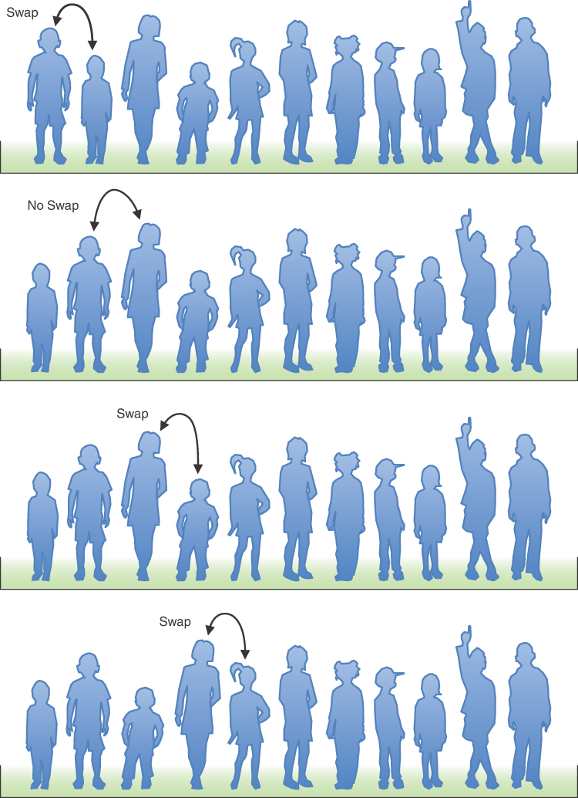
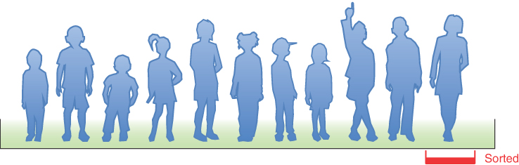
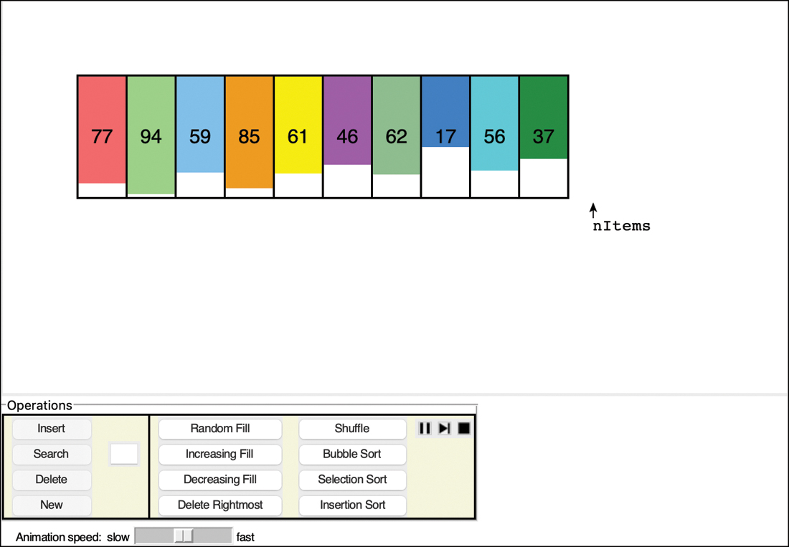
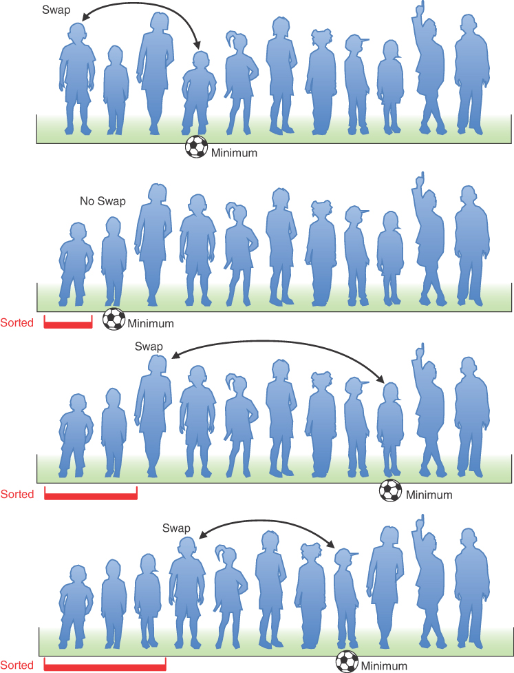
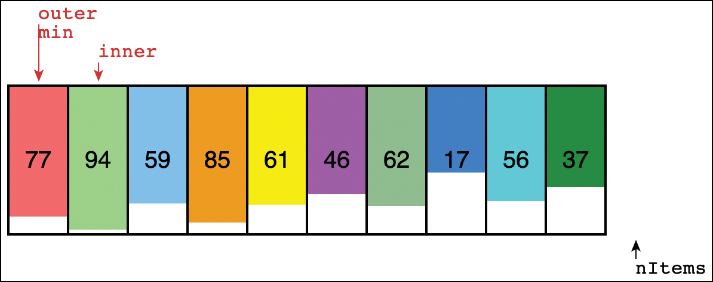
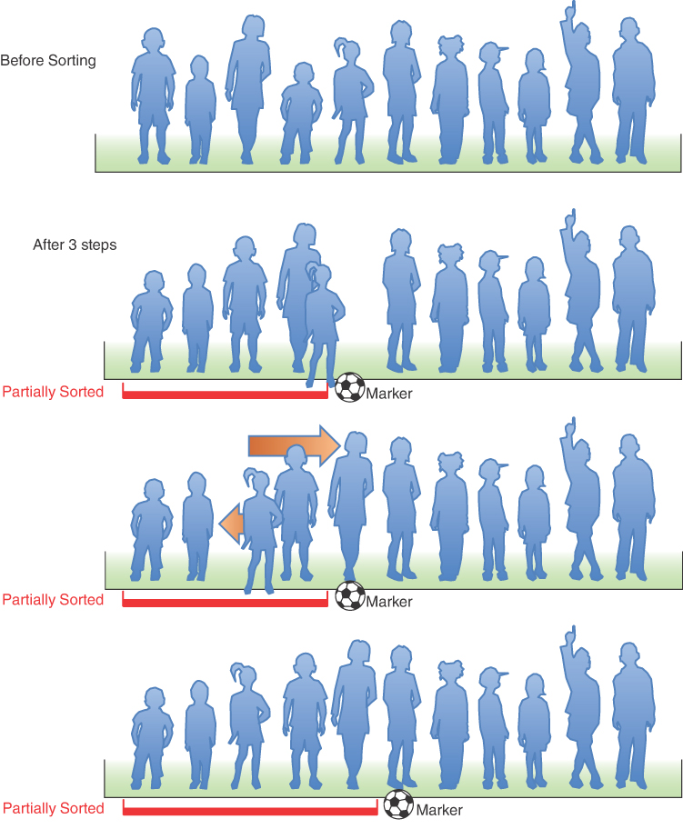
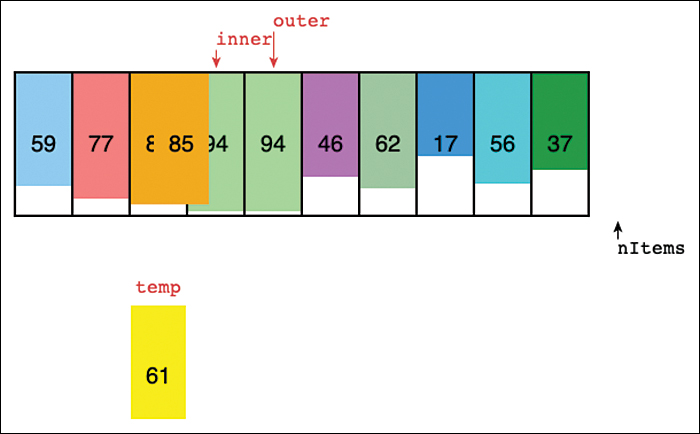

# 简单排序
这一章的主要内容

- 你会怎么做？
- 冒泡排序
- 选择排序
- 插入排序
- 比较简单排序

一旦你创建了一个重要的数据库，你可能会想到以各种方式对记录进行排序的原因。你需要按字母顺序排列名称，按年级排列学生，按邮政编码排列客户，按价格排列房屋销售量，按人口排列城市，按土地面积排列国家，按数量排列星星，等等。
对数据进行排序也可能是搜索数据的初步步骤。正如你在[第 2 章](./02-数组.md)"数组"中看到的，二分查找只能应用于已排序的数据，它比线性搜索快得多。
由于排序非常重要且可能非常耗时，因此它一直是计算机科学广泛研究的主题，并且已经开发了一些非常复杂的方法。在本章中，我们将了解三种更简单的算法：冒泡排序、选择排序和插入排序。每个都在可视化工具中进行了演示。在[第 6 章](./06-递归.md)"递归"和[第 7 章](./07-高级排序.md)"高级排序"中，我们将返回查看更复杂的方法，包括 壳排序 和 快速排序。
本章中描述的技术虽然简单且相对较慢，但仍然值得研究。除了更容易理解之外，它们在某些情况下实际上比更复杂的算法更好。例如，对于小数组和几乎排序的数组，插入排序比快速排序更可取。事实上，插入排序通常用于快速排序实现的最后阶段。
本章中的示例程序建立在前一章开发的数组类之上。排序算法被实现为 ```Array``` 类的方法。
请务必尝试本章提供的算法可视化。它们非常有效地解释了排序算法如何与文本中的描述和静态图片结合使用。
你会怎么做？
假设有一支儿童足球队在球场上排成一排，如图 3-1 所示。你想按身高增加的顺序排列球员（最矮的球员在左边），以制作球队照片。你会如何处理这个排序过程？

## 你会怎么做？
假设有一支儿童足球队在球场上排成一排，如图 3-1 所示。你想按身高增加的顺序排列球员（最矮的球员在左边），以制作球队照片。你会如何处理这个排序过程？


作为一个人，你比计算机程序更有优势。你可以一次查看所有玩家，并且几乎可以立即挑选出最高的玩家。你无需费力地衡量和比较每个人。球员也很聪明，可以很好地自我排序。此外，玩家不需要占据特定的位置。他们可以互相推挤，互相推挤以腾出空间，并站在彼此的后面或前面。经过一些特别的重新排列后，你就可以毫不费力地将所有玩家排成一列，如图 3-2 所示。


计算机程序无法以这种方式浏览数据。它一次只能比较两个玩家，因为这就是比较运算符的工作方式。这些运营商希望玩家处于准确的位置，一次只能移动一两个玩家。算法的这种隧道视野是一个反复出现的主题。事情对我们人类来说似乎很简单，但计算机无法看到全局，因此必须专注于细节并遵循严格的规则。
本章中的三个算法都涉及两个操作，一遍又一遍地执行，直到数据排序：

- 比较两个对象。
- 交换两个对象，或复制一个对象。

当然，每种算法都以不同的方式处理细节。

## 冒泡排序

冒泡排序是出了名的慢，但它在概念上是排序算法中最简单的，因此是我们探索排序技术的良好开端。

### 对足球运动员进行冒泡排序

想象一下，如果你戴着眼罩或近视，那么你只能同时看到两名足球运动员，如果他们彼此相邻并且你站得离他们很近。给定这些约束（如计算机算法所面临的），你将如何对它们进行排序？假设有 ```N``` 个玩家，他们所在的位置从左边的 0 到右边的 ```N-1``` 编号。
冒泡排序例程是这样工作的：从行的左端开始，比较位置 0 和位置 1 的两个玩家。如果左边的一个（在 0 中）更高，则交换他们。如果右边的那个更高，你什么都不做。然后你移动一个位置并比较位置 1 和位置 2 的球员。同样，如果左边的球员更高，你交换他们。这个排序过程如图 3-3 所示。



以下是你要遵守的规则：

1. 比较两个玩家。
2. 如果左边的那个更高，交换它们。
3. 右移一位。

你继续沿着这条线走，直到你到达右端。你还没有完成对球员的分类，但你知道现在最高的球员在右边。这一定是真的，因为一旦你遇到最高的玩家，每次比较两个玩家时，你最终都会交换他们，直到最终最高的玩家到达队伍的右端。这就是为什么它被称为冒泡排序：随着算法的进展，最大的对象"冒泡"到数组的顶端。图 3-4 显示了第一次传球结束时的球员。



在第一次通过所有玩家之后，你已经进行了 ```N-1``` 次比较，并且根据玩家的初始安排进行了 0 和 ```N-1``` 次交换。行尾的玩家已排序，不会再次移动。
现在你返回并从该行的左端开始另一次传球。同样，你向右走，在适当的时候进行比较和交换。但是，这一次，你可以在距离线末端的位置 ```N-2``` 处阻止一名玩家，因为你知道最后一个位置 ```N-1``` 处已经包含了最高的玩家。这条规则可以表述为：
当你到达第一个排序的玩家时，从该行的左端重新开始。

你继续此过程，直到所有玩家都按顺序排列。描述这个过程比演示它要困难得多，所以让我们在 SimpleSorting Visualization 工具中观察它的工作。

### SimpleSorting 可视化工具

启动 SimpleSorting Visualization 工具（如附录 A 中所述运行 python3 SimpleSorting.py）。这个程序显示了一个值数组，并提供了多种排序和操作它的方法。图 3-5 显示了初始显示。



插入、搜索、删除、新建、随机填充和删除最右边按钮的功能与我们在[第 2 章](./02-数组.md)中使用的数组可视化工具中看到的功能类似。右侧有与排序相关的新按钮。选择冒泡排序按钮开始对对象进行排序。与其他可视化工具一样，你可以使用底部的滑块减慢或加快动画速度。你可以使用播放、暂停和跳过按钮（、、、）暂停和继续播放动画。
当冒泡排序开始时，它会在数组旁边添加两个标记为"内部"和"最后"的箭头。这些指向算法在哪里工作。内部箭头从最左边的单元格走到右边，当它在一个较短的单元格的左边找到一个较高的单元格时交换对象对，就像团队中的球员一样。它在到达最后一个箭头时停止，该箭头标记了最终排序顺序中的第一个对象。
随着每个最大对象"冒泡"到最右边，最后一个箭头向左移动一个单元格，以跟踪哪些对象已排序。当最后一个箭头一直移动到左侧的第一个单元格时，数组已完全排序。要运行新的排序操作，请选择随机排序，然后再次选择冒泡排序。
尝试使用 (前进) 或播放/暂停 (/) 按钮完成冒泡排序过程。在每一步，想想接下来会发生什么。会发生互换吗？两个箭头将如何变化？
尝试制作一个包含许多单元格（30+）的新数组并用随机对象填充它。单元格将变得太窄而无法显示每个对象的编号。彩色矩形的高度表示它们的数量，但是当它们的高度几乎相等时，很难看出哪个更高。你还能预测每一步会发生什么吗？
可视化工具还具有按钮，可按升序和降序使用键填充空单元格。有趣的是，当排序算法遇到已经排序或反向排序的数据时会发生什么。你还可以使用随机播放按钮对数据进行打乱，以尝试运行新的排序。

> 笔记
> Stop () 按钮停止动画并允许你开始其他操作。但是，数组内容可能与动画开始时的内容不同。根据操作中断的时间，可能会缺少对象或对象的额外副本。通过这种方式，可视化模拟了计算机内存中发生的事情，如果某事停止执行。

### 冒泡排序的 Python 代码

冒泡排序算法很容易解释，但我们需要看看如何编写程序。 清单 3-1 显示了 ```Array``` 类的 ```bubbleSort()``` 方法。 它与[第 2 章](./02-数组.md)介绍的 ```Array``` 类几乎相同，完整的 ```SortArray``` 模块将在本章后面的清单 3-4 中显示。
清单 3-1 ```Array``` 类的 ```bubbleSort()``` 方法

```python
def bubbleSort(self):                          # Sort comparing adjacent vals
    for last in range(self.__nItems-1, 0, -1):  # and bubble up
        for inner in range(last):                # inner loop goes up to last
            if self.__a[inner] > self.__a[inner+1]:  # If item less
                self.swap(inner, inner+1)          # than adjacent item, swap
```

在 ```Array``` 类中，数组的每个元素都被假定为一个简单的值，可以将其与任何其他值进行比较以便对它们进行排序。我们重新引入一个关键函数来稍后处理订购记录。
```bubbleSort()``` 方法有两个循环。内部循环处理遍历数组和交换无序的元素。外部循环处理数组中未排序部分的递减长度。外部循环将最后一个变量设置为最初指向数组的最后一个元素。这是通过使用 Python 的 ```range``` 函数从 ```__nItems-1``` 开始并以 -1 为增量逐步下降到 1 来完成的。每次内部循环都以内部变量设置为 0 开始，并以 1 为增量达到 ```last - 1```。索引大于 ```last``` 的元素总是完全排序的。在每次通过内部循环之后，最后一个变量可以减少 1，因为 0 和 ```last``` 之间的最大元素冒泡到最后一个位置。
内部循环体执行测试以比较内部和内部+1 索引处的元素。如果 ```inner``` 的值大于其右侧的值，则必须交换两个数组元素（当我们在后面的部分中查看所有 ```SortArray``` 代码时，我们将了解 ```swap()``` 的工作原理）。

### 不变量

在许多算法中，随着算法的进行，有些条件保持不变。这些条件称为不变量。识别不变量有助于理解算法。在某些情况下，它们可能有助于调试；你可以反复检查不变量是否为真，如果不是，则发出错误信号。
在```bubbleSort()``` 方法中，不变式是对last 右边的数组元素进行排序。在算法的整个运行过程中，这仍然是正确的。在第一遍中，还没有对任何内容进行排序，并且 ```last``` 右侧没有任何对象，因为它从最右边的元素开始。

### 冒泡排序的效率

如果你对具有 11 个单元格的数组使用冒泡排序，则内部箭头在第一遍进行 10 次比较，第二次进行 9 次比较，依此类推，直到最后一次进行一次比较。对于 11 个对象，这是
$$
10 + 9 + 8 + 7 + 6 + 5 + 4 + 3 + 2 + 1 = 55
$$
通常，其中 N 是数组中的对象数，第一次比较有 ```N-1``` 次，第二次有 ```N-2``` 次比较，依此类推。 此类数列之和的公式为
$$
(N−1) + (N−2) + (N−3) + ... + 1 = N×(N−1)/2
$$
当 N 为 11 时，```N×(N−1)/2``` 为 ```55 (11×10/2)```。

因此，该算法进行了大约 $N^{2}/2$ 次比较（忽略 -1，这没有太大区别，尤其是在 N 很大的情况下）。
交换次数少于比较次数，因为只有在需要时才交换两个柱。如果数据是随机的，大约一半的时间需要交换，因此大约有 $N^{2}/4$ 交换。 （在最坏的情况下，初始数据反向排序，每次比较都需要交换。）
互换和比较都与 $N^{2}$ 成正比。因为常量不计入大 O 表示法，你可以忽略除数中的 2 和 4，并说冒泡排序在 $O(N^{2})$ 时间内运行。这很慢，因为你可以通过在 SimpleSorting Visualization 工具中运行包含 20 多个单元格的数组的冒泡排序来验证。
每当你看到一个循环嵌套在另一个循环中时，例如冒泡排序和本章中的其他排序算法中的循环，你可能会怀疑算法运行时间为 $O(N^{2})$。外循环执行 N 次，内循环执行 N（或者可能 N 除以某个常数）次外循环的每个循环。这意味着它正在做大约 N×N 或 $N^{2}$ 次的事情。

## 选择排序

如何提高分拣作业的效率？你知道 $O(N^{2})$ 非常糟糕。你能达到 $O(N)$ 甚至 $O(log N)$ 吗？我们接下来看看一种称为选择排序的方法，它减少了交换的次数。在按键对大型记录进行排序时，这可能很重要。复制整个记录而不仅仅是整数可能比比较两个键花费更多的时间。在 Python 中和在其他语言中一样，计算机可能只是复制指向记录对象的指针或引用而不是整个记录，但了解哪些操作发生的次数最多很重要。
### 足球运动员的选择排序

让我们再考虑一下足球运动员。在选择排序中，你不会比较站在彼此旁边的球员，但你仍然可以只看两名球员并比较他们的身高。在这个算法中，你需要记住某个球员的身高——也许通过使用量尺并将数字写在笔记本上。球也可以作为标记派上用场。

### 简要说明

选择排序涉及的是通过所有玩家并选择（或选择，因此是排序的名称）最短的一个。然后，这个最短的玩家与该行左端的玩家交换位置 0。现在最左边的玩家已排序，不需要再次移动。请注意，在此算法中，排序后的玩家累积在左侧（较低的索引），而在冒泡排序中，他们累积在右侧。
下一次你传递这排玩家时，你从位置 1 开始，找到最小值，与位置 1 交换。这个过程一直持续到所有玩家都被排序。

### 更详细的描述

让我们从玩家队伍的左端开始。在你的笔记本上记录最左边球员的身高，然后在这个人面前的地上放一个球。然后将右边下一位玩家的身高与笔记本中的身高进行比较。如果这个球员比较矮，把第一个球员的身高划掉，然后记录第二个球员的身高。同时移动球，将其放在这个新的"最矮"（暂时）球员面前。继续往下走，将每个玩家与最小值进行比较。更改笔记本中的最小值并在找到更矮的球员时移动球。当你到达线的尽头时，球将在最短的球员面前。例如，图 3-6 的顶部显示了将球放在左数第四个球员的前面。



将这个最短的玩家与线路左端的玩家交换。你现在已经对一名玩家进行了排序。你进行了 ```N−1``` 次比较，但只有一次交换。
在下一次通过时，你将执行完全相同的操作，只是你可以跳过左侧的玩家，因为该玩家已经排序。因此，算法从位置 1 而不是 0 开始第二次传球。在图 3-6 的情况下，第二次传球在位置 1 找到最短的玩家，因此不需要交换。每次连续传球时，都会多一名球员被排序并放置在左侧，并且在找到新的最小值时需要考虑少一名球员。图 3-6 的底部显示了这种排序在前三遍之后的样子。

### SimpleSorting 可视化工具中的选择排序

要查看选择排序的实际效果，请尝试 SimpleSorting Visualization 工具中的选择排序按钮。使用 New 和 Random Fill 按钮创建一个由 11 个随机排列的对象组成的新数组。当你选择"选择排序"按钮时，它会在显示中添加箭头，如图 3-7 所示。标有"外部"的箭头从左侧开始，还有一个标有"最小"的箭头。 "内部"箭头从右侧开始一个单元格，并标记第一次比较发生的位置。



当 ```inner``` 向右移动时，它指向的每个单元格都会与 ```min``` 处的单元格进行比较。如果 ```min``` 的值较低，则 ```min``` 箭头将移动到 ```inner``` 所在的位置，就像你将球移动到最短的球员面前一样。
当内部到达右端时，外部和最小箭头处的对象被交换。这意味着已经对另一个单元格进行了排序，因此可以将外部单元格向右移动一个单元格。下一轮以 ```min``` 开始，指向其右侧外部和内部一个单元格的新位置。
外部箭头标记第一个未排序项的位置。从外部到右端的所有对象都未排序。外部左侧的单元格已完全排序。排序继续进行，直到外部到达右侧的最后一个单元格。此时，下一个可能的比较必须经过最后一个单元格，因此必须停止排序。

### 用于选择排序的 Python 代码

与冒泡排序一样，实现选择排序需要两个嵌套循环。 Python 方法如清单 3-2 所示。
清单 3-2 ```Array``` 类的 ```selectionSort()``` 方法

```python
def selectionSort(self):  # Sort by selecting min and
    for outer in range(self.__nItems - 1):  # swapping min to leftmost
        min = outer  # Assume min is leftmost
        for inner in range(outer + 1, self.__nItems):  # Hunt to right
            if self.__a[inner] < self.__a[min]:  # If we find new min,
                min = inner  # update the min index

        # __a[min] is smallest among __a[outer]...__a[__nItems-1]
        self.swap(outer, min)  # Swap leftmost and min
```

外部循环首先将外部变量设置为指向数组的开头（索引 0），然后向右前进到更高的索引。通过将 ```min``` 设置为与 ```outer``` 相同，假定最小值对象是第一个对象。带有循环变量```inner``` 的内循环从```outer+1``` 开始，同样向右进行。
在 ```inner``` 的每个新位置，比较元素 ```__a[inner]``` 和 ```__a[min]```。如果 ```__a[inner]``` 更小，则 ```min``` 被赋予 ```inner``` 的值。在内循环结束时，```min```指向最小值，```outer```和```min```指向的数组元素互换。

### 不变量

在 ```selectionSort()``` 方法中，总是对索引小于 ```outer``` 的数组元素进行排序。当 ```outer``` 达到 ```__nItems - 1``` 时，此条件成立，这意味着除了一个对象之外的所有对象都已排序。此时，你可以尝试再运行一次内部循环，但它无法更改外部的最小索引，因为未排序的范围内只剩下一项。在内部循环中什么都不做之后，它会将外部的对象与它自己交换——另一个什么都不做操作——然后外部将递增到 ```__nItems```。因为整个最后一次传递什么都不做，所以你可以在外部到达 ```__nItems - 1``` 时结束。

### 选择排序的效率

选择排序执行的比较是 $N×(N-1)/2$，与冒泡排序相同。对于 11 个数据项，这是 55 次比较。该过程恰好需要 10 次交换。交换次数始终为 N-1，因为外部循环每次迭代执行一次。这与冒泡排序中所需的大约 $N^{2}/4$ 交换相比是有利的，对于 11 个对象，大约需要 30 个交换。对于 100 个对象，选择排序进行 4,950 次比较和 99 次交换。对于较大的 N 值，比较时间占主导地位，因此你不得不说选择排序在 $O(N^{2})$ 时间内运行，就像冒泡排序一样。然而，毫无疑问，它更快，因为有 $O(N)$ 而不是 $O(N^{2})$ 交换。请注意，冒泡排序中的交换次数取决于数组元素的初始排序，因此在某些特殊情况下，它们的数量可能比选择排序所产生的数量少。

## 插入排序
在大多数情况下，插入排序是本章描述的基本排序中最好的。它仍然在 $O(N^{2})$时间内执行，但它的速度大约是冒泡排序的两倍，并且在正常情况下比选择排序快一些。它也不是太复杂，尽管它比冒泡和选择排序稍微复杂一些。它通常用作更复杂排序的最后阶段，例如快速排序。

### 足球运动员的插入排序

要开始插入排序，请从以随机顺序排列的足球运动员开始。 （他们想玩一个游戏，但显然他们必须等到可以拍照。）如果你从过程的中间开始，当团队的一部分被排序时，更容易考虑插入排序。

### 部分排序

你可以使用方便的球标记在线中间的一个位置。此标记左侧的玩家已部分排序。这意味着它们是相互排序的；每个人都比他们左边的人高。然而，球员不一定处于他们的最终位置，因为当之前未排序的球员插入他们之间时，他们可能仍需要移动。
请注意，冒泡排序和选择排序中没有进行部分排序。在这些算法中，一组数据项在任何给定时间都被完全排序到它们的最终位置；在插入排序中，一组对象仅部分排序。

### 被标记的玩家

标记球所在的球员，我们称之为"标记"球员，右边的所有球员都还没有排序。图 3-8 显示了该过程。在顶部，玩家未排序。图中的下一行显示了三个步骤后的情况。标记球放在向前走的球员面前。



你要做的是将标记的播放器插入（部分）排序组中的适当位置。为此，你需要将一些已排序的玩家向右移动以腾出空间。为了给这种转变提供空间，被标记的玩家被带出线。 （在程序中，这个数据项存储在一个临时变量中。）这一步如图 3-8 的第二行所示。
现在你移动排序的玩家以腾出空间。排序最高的玩家进入标记玩家的位置，次高的玩家进入最高玩家的位置，依此类推，如图第三行中的箭头所示。
这种转变过程何时停止？想象一下，你和被标记的玩家正在沿着这条线向左走。在每个位置，你将另一名球员向右移动，但你还将标记的球员与即将被移动的球员进行比较。当你移动最后一个比标记的玩家高的玩家时，移动过程停止。最后一个班次打开了被标记的玩家在插入时将按排序顺序排列的空间。此步骤如图 3-8 的底行所示。
现在部分排序的组大了一位玩家，未排序的组小了一位玩家。标记球向右移动一格，所以它再次出现在最左边的未排序球员的前面。重复此过程，直到所有未排序的玩家都已插入（因此称为插入排序）到部分排序组中的适当位置。

### SimpleSorting 可视化工具中的插入排序

返回到 SimpleSorting Visualization 工具并创建另一个 11 单元格的随机值数组。然后选择插入排序按钮开始排序过程。与其他排序操作一样，该算法设置了两个箭头：一个用于外部循环，一个用于内部循环。标记为"外"的箭头相当于对球员进行分类的标记球。
在图 3-9 所示的示例中，外部箭头指向数组中的第五个单元格。它已经将第 61 项复制到数组下方的临时变量中。它还将对象 94 复制到第五个单元格，并开始将对象 85 复制到第四个单元格。外箭头左侧的四个单元格是部分排序的；其右侧的单元格未排序。即使它决定了被标记的玩家应该去哪里并且其中一个有额外的副本，左侧的单元格仍然部分排序。这与将数组项复制到临时变量时计算机内存中发生的情况相匹配。



内箭头从与外箭头相同的单元格开始向左移动，将比标记的临时对象高的对象向右移动。在图 3-9 中，由于 ```item``` 85 比 ```item``` 61 大，正在将 ```item``` 85 复制到 ```inner``` 点。复制完成后，```inner``` 向左移动一个单元格，发现 ```item``` 77 也需要移动。在内部的下一步中，它在其左侧找到对象 59。该对象小于 61，并且标记的对象从 ```temp``` 复制回内部单元格，对象 77 曾经所在的位置。
尝试创建一个填充随机值的更大数组。运行插入排序并观察箭头和对象的更新。外部箭头左侧的所有内容仍按高度排序。内部箭头向左移动，移动对象，直到找到正确的单元格来放置标记的对象（从外部单元格复制）。
最终，外部箭头到达数组的右端。内箭头从该右边缘向左移动，并在适合插入最后一项的位置停止。它可能在数组中的任何位置完成。这与外部和内部循环变量一起完成的气泡和选择排序有点不同。
请注意，有时，从 ```external``` 复制到 ```temp``` 的对象会直接复制回它开始的位置。当外部碰巧指向一个大于其左侧每个对象的对象时，就会发生这种情况。当外部箭头指向的对象小于其右侧的每个对象时，选择排序中也会发生类似的事情。它最终与自己进行交换。进行这些额外的数据移动可能看起来效率低下，但为这些条件添加测试可能会增加其自身的低效率。本章末尾的一个实验要求你探索什么时候这样做是有意义的。

### 用于插入排序的 Python 代码

现在让我们看看 ```Array``` 类的 ```insertSort()``` 方法，如清单 3-3 所示。你仍然需要两个循环，但这次内部循环使用 ```while``` 循环寻找插入点。
清单 3-3 ```Array``` 类的 ```insertSort()``` 方法

```python
def insertionSort(self):                     # Sort by repeated inserts
    for outer in range(1, self.__nItems):     # Mark one element
        temp = self.__a[outer]                 # Store marked elem in temp
        inner = outer                          # Inner loop starts at mark
        while inner > 0 and temp < self.__a[inner-1]: # If marked
            self.__a[inner] = self.__a[inner-1] # elem smaller, then
            inner -= 1                          # shift elem to right
        self.__a[inner] = temp                 # Move marked elem to 'hole'
```

在外层 ```for``` 循环中，外层从 1 开始向右移动。它标记了最左边的未排序数组元素。在内部的 ```while ``` 循环中，```inner```从```outer```开始向左移动到```inner-1```，直到```temp```小于那里的数组元素，或者不能再向左移动。每次通过 ```while``` 循环都会将另一个已排序的对象向右移动一个空格。

### 不变量

索引小于外部的数据项被部分排序。即使在开始时 ```outer``` 为 1 时也是如此，因为单元格 0 中的单个对象形成一个始终排序的单元素序列。随着对象的移动，其中一个有多个副本，但它们都保持部分排序的顺序。

### 插入排序的效率

这个算法需要多少次比较和复制？在第一次通过时，它最多比较一个对象。在第二遍中，最多有两个对象，依此类推，在最后一遍中最多进行 N-1 次比较。 （我们忽略对内部 > 0 的检查，只计算元素内比较。）这加起来是

$$
1 + 2 + 3 + … + N−1 = N×(N−1)/2
$$

然而，在每次遍历中，在找到插入点之前实际比较的对象数平均为部分排序对象的一半，因此你可以除以 2，得到

$$
N×(N−1)/4
$$
副本的数量与比较的数量大致相同，因为它为每次比较制作一个副本，但最后一个比较。复制一项比交换两项耗时更少，因此对于随机数据，该算法的平均运行速度是冒泡排序的两倍，并且比选择排序快。
在任何情况下，就像本章中的其他排序例程一样，对于随机数据，插入排序在 $O(N^{2})$ 时间内运行。
对于已经排序或几乎排序的数据，插入排序的效果要好得多。当数据有序时，```while```循环中的条件永远不会为真，所以它变成了外循环中的一条简单语句，执行N-1次。在这种情况下，算法在 $O(N)$ 时间内运行。如果数据几乎排好序，则插入排序几乎在 $O(N)$ 时间内运行，这使得它成为一种简单而有效的方法来对仅稍微乱序的数组进行排序。
但是，对于按逆序排列的数据，会执行所有可能的比较和移位，因此插入排序的运行速度不会比冒泡排序快。尝试使用 SimpleSorting Visualization 工具进行一些实验。使用选择排序对 8+ 元素数组进行排序，然后再次尝试使用选择排序对结果进行排序。即使第二次尝试没有进行任何"真正的"交换，它也需要相同数量的步骤来完成整个过程。然后打乱数组并使用插入排序对其进行两次排序。插入排序的第二次尝试明显更短，因为内部循环在一次比较后结束。

### 用于排序数组的 Python 代码

现在让我们将三种排序算法组合成一个对象类来比较它们。 从[第 2 章](./02-数组.md)介绍的 ```Array``` 类开始，我们添加了用于交换和排序的新方法以及用于将数组内容显示为字符串的 ```__str__()``` 方法，并将它们放入名为 ```SortArray.py``` 的模块中，如清单 3 所示 -4。
清单 3-4 ```SortArray.py``` 模块

```python
# Implement a sortable Array data structure


class Array(object):
    def __init__(self, initialSize):  # Constructor
        self.__a = [None] * initialSize  # The array stored as a list
        self.__nItems = 0  # No items in array initially

    def __len__(self):  # Special def for len() func
        return self.__nItems  # Return number of items

    def get(self, n):  # Return the value at index n
        if 0 <= n < self.__nItems:  # Check if n is in bounds, and
            return self.__a[n]  # only return item if in bounds

    def set(self, n, value):  # Set the value at index n
        if 0 <= n < self.__nItems:  # Check if n is in bounds, and
            self.__a[n] = value  # only set item if in bounds

    def swap(self, j, k):  # Swap the values at 2 indices
        if j >= 0 and j < self.__nItems and k >= 0 and k < self.__nItems:  # bounds, before processing
            self.__a[j], self.__a[k] = self.__a[k], self.__a[j]

    def insert(self, item):  # Insert item at end
        if self.__nItems >= len(self.__a):  # If array is full,
            raise Exception("Array overflow")  # raise exception
        self.__a[self.__nItems] = item  # Item goes at current end
        self.__nItems += 1  # Increment number of items

    def find(self, item):  # Find index for item
        return next((j for j in range(self.__nItems) if self.__a[j] == item), -1)

    def search(self, item):  # Search for item
        return self.get(self.find(item))  # and return item if found

    def delete(self, item):  # Delete first occurrence
        for j in range(self.__nItems):  # of an item
            if self.__a[j] == item:  # Found item
                self.__nItems -= 1  # One fewer at end
                for k in range(j, self.__nItems):  # Move items from
                    self.__a[k] = self.__a[k + 1]  # right over 1
                return True  # Return success flag

        return False  # Made it here, so couldn't find the item

    def traverse(self, function=print):  # Traverse all items
        for j in range(self.__nItems):  # and apply a function
            function(self.__a[j])

    def __str__(self):  # Special def for str() func
        ans = "["  # Surround with square brackets
        for i in range(self.__nItems):  # Loop through items
            if len(ans) > 1:  # Except next to left bracket,
                ans += ", "  # separate items with comma
            ans += str(self.__a[i])  # Add string form of item
        ans += "]"  # Close with right bracket
        return ans

    def bubbleSort(self):  # Sort comparing adjacent vals
        for last in range(self.__nItems - 1, 0, -1):  # and bubble up
            for inner in range(last):  # inner loop goes up to last
                if self.__a[inner] > self.__a[inner + 1]:  # If elem less
                    self.swap(inner, inner + 1)  # than adjacent value, swap

    def selectionSort(self):  # Sort by selecting min and
        for outer in range(self.__nItems - 1):  # swapping min to leftmost
            min = outer  # Assume min is leftmost
            for inner in range(outer + 1, self.__nItems):  # Hunt to right
                if self.__a[inner] < self.__a[min]:  # If we find new min,
                    min = inner  # update the min index

            # __a[min] is smallest among __a[outer]...__a[__nItems-1]
            self.swap(outer, min)  # Swap leftmost and min

    def insertionSort(self):  # Sort by repeated inserts
        for outer in range(1, self.__nItems):  # Mark one element
            temp = self.__a[outer]  # Store marked elem in temp
            inner = outer  # Inner loop starts at mark
            while inner > 0 and temp < self.__a[inner - 1]:  # If marked
                self.__a[inner] = self.__a[inner - 1]  # elem smaller, then
                inner -= 1  # shift elem to right
            self.__a[inner] = temp  # Move marked elem to 'hole'
```

```swap()``` 方法交换数组的两个单元格中的值。 它确保交换仅发生在已插入数组中的对象上，而不是已分配但未初始化的单元格上。 对于本模块中已经确保正确索引的排序方法，这些测试可能不是必需的，但它们对于通用例程来说是一个好主意。
我们使用单独的客户端程序 ```SortArrayClient.py``` 来测试这个新模块并比较不同排序方法的性能。 这个程序使用了一些其他的 Python 模块和特性来帮助完成这个过程，如清单 3-5 所示。
清单 3-5 ```SortArrayClient.py``` 程序

```python
from SortArray import *
import random
import timeit


def initArray(size=100, maxValue=100, seed=3.14159):
    """Create an Array of the specified size with a fixed sequence of
    'random' elements"""
    arr = Array(size)  # Create the Array object
    random.seed(seed)  # Set random number generator
    for i in range(size):  # to known state, then loop
        arr.insert(random.randrange(maxValue))  # Insert random numbers
    return arr  # Return the filled Array


arr = initArray()
print("Array containing", len(arr), "items:\n", arr)

for test in [
    "initArray().bubbleSort()",
    "initArray().selectionSort()",
    "initArray().insertionSort()",
]:
    elapsed = timeit.timeit(test, number=100, globals=globals())
    print(test, "took", elapsed, "seconds", flush=True)

arr.insertionSort()
print("Sorted array contains:\n", arr)
```

```SortArrayClient.py``` 程序首先导入 ```SortArray``` 模块来测试排序方法，并导入 ```random``` 和 ```timeit``` 模块来协助。 ```random``` 模块提供了可用于制作测试数据的伪随机数生成器。 ```timeit``` 模块提供了一种方便的方法来测量 Python 代码的执行时间。
测试程序首先定义了一个函数 ```initArray()```，它生成一个未排序的数组进行测试。在参数列表之后，它有一个文档字符串，可以帮助解释其用途，创建一个固定大小的数组，其中填充了一系列随机数。因为我们想在完全相同的元素序列上测试不同的排序操作，所以我们希望 ```initArray()``` 在每次运行时返回相同数组的新副本，但要符合给定的参数。该函数首先创建一个所需大小的数组。接下来，它通过设置种子值将随机模块初始化为已知状态。这意味着伪随机函数在以相同顺序调用时会产生相同的数字序列。
在下面的 ```for``` 循环中，```random.randrange(maxValue)``` 函数生成范围为 ```[0, maxValue)``` 的整数，这些整数被插入到数组中```*```（数学符号 ```[a, b)``` 表示包含 a 但不包括 b 的数字范围）```*```。然后返回填充的数组。
测试程序使用 ```initArray()``` 函数生成存储在 ```arr``` 变量中的数组。在打印 ```arr``` 的初始内容后，使用一个 ```for``` 循环来逐步执行要计时的三个排序操作。循环变量 ```test``` 在每次循环时都绑定到一个字符串。该字符串具有要测量其执行时间的 Python 表达式。在循环体内，```timeit.timeit()``` 函数调用测量运行测试表达式的经过时间。它运行表达式指定的次数并以秒为单位返回总运行时间。多次运行它有助于处理由于执行 Python 解释器的计算机上发生的其他操作而导致的运行时间变化。 ```timeit.timeit()``` 的最后一个参数是 ```globals```，它是必需的，以便解释器拥有迄今为止已加载的所有定义，包括 ```SortArray``` 和 ```initArray```。解释器在评估测试变量中的 Python 表达式时使用这些定义。
```timeit.timeit()``` 的结果存储在 ```elapsed``` 变量中，然后使用 ```flush=True``` 打印出来，这样它就不会等到输出缓冲区已满或需要在打印之前读取输入。打印完所有三个测试时间后，它对原始 ```arr``` 数组再执行一次排序并打印其内容。结果如下所示：

```bash
$ python3 SortArrayClient.py
Array containing 100 items:
 [77, 94, 59, 85, 61, 46, 62, 17, 56, 37, 18, 45, 76, 21, 91, 7, 96, 50, 31, 69, 80,
69, 56, 60, 26, 25, 1, 2, 67, 46, 99, 57, 32, 26, 98, 51, 77, 34, 20, 81, 22, 40,
28, 23, 69, 39, 23, 6, 46, 1, 96, 51, 71, 61, 2, 34, 1, 55, 78, 91, 69, 23, 2, 8,
3, 78, 31, 25, 26, 73, 28, 88, 88, 38, 22, 97, 9, 18, 18, 66, 47, 16, 82, 9, 56, 45,
15, 76, 85, 52, 86, 5, 28, 67, 34, 20, 6, 33, 83, 68]
initArray().bubbleSort() took 0.25465869531035423 seconds
initArray().selectionSort() took 0.11350362841039896 seconds
initArray().insertionSort() took 0.12348053976893425 seconds
Sorted array contains:
 [1, 1, 1, 2, 2, 2, 3, 5, 6, 6, 7, 8, 9, 9, 15, 16, 17, 18, 18, 18, 20, 20, 21, 22,
22, 23, 23, 23, 25, 25, 26, 26, 26, 28, 28, 28, 31, 31, 32, 33, 34, 34, 34, 37, 38,
39, 40, 45, 45, 46, 46, 46, 47, 50, 51, 51, 52, 55, 56, 56, 56, 57, 59, 60, 61, 61,
62, 66, 67, 67, 68, 69, 69, 69, 69, 71, 73, 76, 76, 77, 77, 78, 78, 80, 81, 82, 83,
85, 85, 86, 88, 88, 91, 91, 94, 96, 96, 97, 98, 99]
```

查看输出，你可以看到 ```randrange()``` 函数以随机顺序为数组提供了多种值。排序测试的计时结果表明，冒泡排序所用的时间至少是选择排序和插入排序的两倍。数组的最终排序版本确认排序有效，并显示数组中有许多重复元素。

### 稳定性

有时，排序时具有相同键的数据项会发生什么很重要。 ```SortArrayClient.py``` 测试只在数组中存储整数，相等的整数几乎无法区分。但是，如果数组包含复杂的记录，那么如何对具有相同键的记录进行排序可能非常重要。例如，你可能将员工记录按姓氏字母顺序排列。 （也就是说，姓氏在排序中用作键值。）假设你也想按邮政编码对数据进行排序，但你希望所有具有相同邮政编码的对象继续按姓氏排序。这称为辅助排序键。你希望排序算法仅移动需要按当前键排序的内容，并在使用其他键进行先前排序之后保留其他所有内容。一些排序算法保留了这种二级排序；据说它们很稳定。稳定的排序方法还可以最大限度地减少交换或复制操作的次数。
本章中的一些算法是稳定的。我们在本章末尾包含了一个练习，供你决定哪些是。从他们的测试程序的输出中，答案并不明显，尤其是在简单整数上。你需要查看算法以查看交换和复制仅发生在需要移动到最终订单正确位置的对象上。他们还应该将具有相同键的对象移动到所需的最小数组单元数，以便它们在最终排列中保持相同的相对顺序。

## 比较简单排序

使用冒泡排序可能没有意义，除非你手边没有算法书。冒泡排序非常简单，你可以从内存中编写它。即便如此，只有在数据量很小的情况下才实用。 （有关"小"的含义以及此类决策需要权衡取舍的讨论，请参见[第 16 章](./16应用与分析.md)，"使用什么以及为什么使用。"）
表 3-1 总结了每种排序方法的时间效率。我们研究了算法在呈现键是随机顺序的元素时会做什么，以确定它们在平均情况下会做什么。我们还考虑了在最坏情况下会发生什么，即当键的顺序可以最大化操作数量时。该表包括大 O 符号，后跟方括号 [ ] 中的详细值。大 O 符号是最重要的；它给出了算法的广泛分类，并告诉了非常大的 N 会发生什么。通常，我们对平均情况的行为最感兴趣，因为我们无法预测它们会遇到什么数据，但有时最坏的情况是驱动因素。例如，如果对于特定大小的数据，排序必须能够在特定时间内完成，我们可以使用最坏情况中的最佳值来选择能够保证完成时间的算法。
表 3-1 排序方法的时间顺序

|   算法   |         比较         |                      |      交换或副本      |                      |
| :------: | :------------------: | :------------------: | :------------------: | :------------------: |
|          |       平均情况       |       最坏情况       |       平均情况       |       最坏情况       |
| 冒泡排序 | $O(N^{2}) [N^{2}/2]$ | $O(N^{2}) [N^{2}/2]$ | $O(N^{2}) [N^{2}/4]$ | $O(N^{2}) [N^{2}/2]$ |
| 选择排序 | $O(N^{2}) [N^{2}/2]$ | $O(N^{2}) [N^{2}/2]$ |     $O(N) [N−1]$     |     $O(N) [N−1]$     |
| 插入排序 | $O(N^{2}) [N^{2}/4]$ | $O(N^{2}) [N^{2}/2]$ | $O(N^{2}) [N^{2}/4]$ | $O(N^{2}) [N^{2}/2]$ |

表中显示的详细值在狭窄的情况下可能有些用处。例如，冒泡排序和插入排序在平均情况下的相对比较次数与测试程序中的相对时间测量值很好地对应。这也可以预测选择排序的平均情况应该更接近冒泡排序，但上面的一个测量不同意这一点。也许这意味着交换或副本是运行时间的一个更大因素，测试平台上的 N 约为 100。
总体而言，选择排序最大限度地减少了交换次数，但比较次数仍然很高。当数据量很小并且交换数据项相对于比较它们非常耗时时，这种排序可能很有用。在现实世界的场景中，可能存在将交换保持在最低限度比比较次数更重要的情况。例如，在医院病房之间转移患者（以应对其他灾难）时，尽可能少地转移患者可能至关重要。
插入排序是三种排序方法中最通用的一种，在大多数情况下是最好的选择，假设数据量很小，或者数据几乎排序。对于大量数据，快速排序和 Timsort 一般被认为是最快的方法；我们将在第 7 章中对其进行研究。
我们在速度方面比较了排序算法。任何算法的另一个考虑因素是它需要多少内存空间。本章中的所有三种算法都执行它们的排序，这意味着它们使用输入数组作为输出数组，并且只需要很少的额外内存。所有种类都需要一个额外的变量来临时存储一个对象，而它正在被交换或标记。因为该对象可能非常大，你需要考虑它，但通常会忽略数组索引的局部变量。

## 概括
- 本章中的排序算法都假设数组作为数据存储结构。
- 排序涉及比较数组中数据项的键并移动对象（通常是对对象的引用），直到它们处于排序顺序。
- 本章中的所有算法都在 $O(N^{2})$ 时间内执行。然而，有些可能比其他的要快得多。
- 不变量是在算法运行时保持不变的条件。
- 冒泡排序是效率最低但最简单的排序。
- 插入排序是本章描述的$O(N^{2})$) 排序中最常用的一种。
- 选择排序执行 $O(N^{2})$次比较，并且仅执行 O(N) 次交换，这在交换时间比比较时间重要得多时可能很重要。
- 如果保留具有相同键的元素的顺序，则排序是稳定的。
- 除了原始数组之外，本章中的所有排序都不需要一个以上的临时记录变量。

## 问题
这些问题旨在作为读者的自我测试。答案可以在附录 C 中找到。
1. 计算机排序算法在这方面比人类更受限制
   1. 计算机可以分类的数据量远远少于人类可以分类的数据量。
   2. 人类可以发明新的排序算法，而计算机却不能。
   3. 人类知道要分类什么，而计算机需要被告知。
   4. 计算机一次只能比较两件事，而人类可以比较小组。


2. 简单排序中的两个基本操作是 ________ 项和 ______ 项（或有时 _________ 项）。
3. 判断对错：冒泡排序总是会比较初始数组中每对可能的对象。
4. 冒泡排序算法在
   1. 比较和交换。
   2. 移动和复制。
   3. 移动和比较。
   4. 复制和比较。


5. 判断对错：如果有 N 个对象，冒泡排序恰好进行 N×N 比较。
6. 在选择排序中，
   1. 最大的键累积在左侧（低索引）。
   2. 重复发现最小密钥。
   3. 必须移动许多对象以将每个对象插入其正确排序的位置。
   4. 排序的对象在右侧累积。


7. 判断对错：如果在特定的计算平台上，交换比比较花费的时间长得多，那么对于所有 N 值，选择排序的速度大约是冒泡排序的两倍。
8. 忽略计算机存储每条数据的详细信息，关于复制操作与交换操作所用时间的比率的合理假设是什么？
9. 选择排序中的不变量是什么？
10. 在插入排序中，文中描述的"被标记的玩家"对应```insertionSort()```方法中的哪个变量？
    1. ```in```
    2. ```out```
    3. ```temp```
    4. ```__a[outer]```

11. 在插入排序中，"部分排序"的组成员是
    1. 已经排序但仍需要作为一个块移动的对象。
    2. 处于最终块位置但可能仍需要排序的对象。
    3. 仅按其键的顺序部分排序。
    4. 相互排序的对象，但组外的对象可能需要插入组中。


12. 向左或向右移动一组对象需要重复_________。
13. 在插入排序中，一个对象被插入到部分排序的组中后，它
    1. 永远不会再被移动。
    2. 永远不会向左移动。
    3. 经常被移出这个组。
    4. 发现它的群体正在稳步缩小。


14. 插入排序的不变量是________。
15. 稳定性可能指
    1. 具有辅助键的对象被排除在排序之外。
    2. 保持城市按每个州内增加的人口进行排序，按州排序。
    3. 保持相同的名字与相同的姓氏相匹配。
    4. 与主键无关的对象保持相同的辅助键顺序。


## 实验
进行这些实验将有助于深入了解本章所涵盖的主题。不涉及编程。
**3-A** "稳定性"部分解释说，稳定排序算法不会改变具有等值键的对象数组中的相对位置。例如，当你按元组的第一个元素对包含元组的数组进行排序时，例如
```(elm, 1), (asp, 1), (elm, 2), (oak, 1)```
该算法总是产生
```(asp, 1), (elm, 1), (elm, 2), (oak, 1)```
永不
```(asp, 1), (elm, 2), (elm, 1), (oak, 1)```
回顾本章中的每个简单排序算法，并确定它们是否总是稳定的。
确定排序算法是否稳定可能很困难。尝试浏览一些包含一些等值键的示例输入，以查看这些对象何时移动。如果你甚至可以想到一个示例，其中具有相同键的两个对象从其原始相对顺序重新排序，那么你已经证明该算法是不稳定的。如果你想不出一个等值键被乱序移动的例子，那么算法可能是稳定的。可以肯定的是，你需要提供更多证据。这通常是通过在算法进行时找到关于部分对象序列的不变条件来完成的。例如，如果你可以证明索引 i 之后的输出数组仅包含稳定顺序的对象，如果该条件在迭代 ```j - 1``` 中成立，则该条件在迭代 j 时保持有效，并且 i 始终在索引 0 处结束，那么算法必须保持稳定。
请注意，如果你遇到困难，我们会在附录 C 中提供此练习的答案。
**3-B** 有时，数组中的对象可能只有几个不同的键和许多副本。这会产生一种情况，即同一密钥有许多重复项。使用 SimpleSorting Visualization 工具创建一个包含 15 个单元格并仅填充两个不同值（例如 10 和 90）的数组。尝试使用三种排序算法对这种数组进行混洗和排序。对于此类数据，它们中的任何一个是否显示出优于其他数据的优势或劣势？
**3-C** 在清单 3-2 所示的 selectionSort() 方法中，内部循环在每次传递时进行交换。如果最小和外部索引的值相同，则不需要交换它们。添加这些指数的额外比较并仅在它们不同时执行交换是否有意义？如果是这样，在什么条件下会提高性能？如果不是，为什么不呢？

## 编程对象
编写程序来解决编程对象有助于巩固你对材料的理解，并演示如何应用本章的概念。 （如引言中所述，合格的讲师可以在出版商的网站上获得编程对象的完整解决方案。）
**3.1** 在 ```bubbleSort()``` 方法（清单 3-1）和可视化工具中，内部索引总是从左到右，找到最大的项并在右侧执行。修改 ```bubbleSort()```方法，使其具有双向性。这意味着内部索引将像以前一样从左到右首先携带最大的对象，但是当它到达最后一个时，它将反转并从右到左携带最小的对象。你需要两个外部索引，一个在右侧（旧的最后一个），另一个在左侧。

**3.2** 在 SortArray.py 模块的 Array 类中添加一个名为 ```median()``` 的方法（清单 3-4）。此方法应返回数组中的中值。 （回想一下，在一组数字中，一半大于中位数，一半小于中位数。）用简单的方法来做。

**3.3** 在 SortArray.py 模块（清单 3-4）的 Array 类中添加一个名为 ```deduplicate()``` 的方法，该方法可以在不破坏顺序的情况下从先前排序的数组中删除重复项。你可以使用测试程序中的任何排序方法对数据进行排序。你可以想象这样的方案，其中从发现重复项的位置到数组末尾的所有对象将在每次发现重复项时向下移动一个空格，但这会导致 $O(N^{2})$ 时间变慢，至少当有很多重复时。在你的算法中，无论有多少重复项，请确保没有任何对象被移动超过一次。这将为你提供 O(N) 时间的算法。

**3.4** 另一种简单的排序是奇偶排序。这个想法是重复两次通过数组。在第一遍中，你查看所有对象对 ```a[j]``` 和 ```a[j + 1]```，其中 j 是奇数（```j = 1, 3, 5, ...```）。如果它们的键值乱序，则交换它们。在第二遍中，你对所有偶数值（```j = 0、2、4，...```）执行相同的操作。你重复执行这两次传递，直到对数组进行排序。向 SortArray.py 模块中的 Array 类添加一个 ```oddEvenSort()``` 方法（清单 3-4）。执行外循环，直到没有交换发生，看看需要多少遍；一次通过包括奇数对和偶数对交换。确保它适用于不同数量的数据以及好的和坏的初始排序。在测试在不再发生交换之前需要多少遍之后，根据输入数组的长度确定外循环的最大遍数。

奇偶排序实际上在多处理环境中很有用，其中一个单独的处理器可以同时对每个奇数对进行操作，然后对每个偶数对进行操作。因为奇数对是相互独立的，所以每一对都可以被不同的处理器检查——并在必要时交换。这使得排序非常快。

**3.5** 修改SortArray.py 中的```insertionSort()``` 方法（清单3-4），使其计算排序期间的副本数和对象比较数并显示总数。你需要查看内部 while 循环中的循环条件并仔细计算对象比较。使用这个程序来测量不同数量的反向排序数据的副本数量和比较。结果是否验证了 $O(N^{2})$ 效率？对几乎排序的数据做同样的事情（只有几个对象不合适）。对于几乎排序的数据，你能推断出这个算法的效率是什么？

**3.6** 这是一种从数组中删除具有重复键的项的有趣方法。插入排序使用循环中的循环算法，该算法将数组中的每个对象与迄今为止部分排序的对象进行比较。删除具有重复键的项的一种方法是修改 SortArray.py 模块（清单 3-4）中 Array 类中的算法，以便在排序时删除重复项。这是一种方法：当找到重复键时，不要将重复项复制回数组单元格的排序位置，而是将标记项的键更改为一个特殊值，该值被视为低于任何其他可能的键。使用该低键值，它会自动移动到数组开头的位置。通过跟踪找到了多少重复项，你可以知道重复项的结尾和数组中剩余元素的开头。当外循环结束时，算法将不得不再通过一次以将唯一键转移到重复项占用的单元格中。编写一个```insertionSortAndDedupe()``` 方法来执行这个操作。确保测试它是否适用于所有不同类型的输入数组数据。