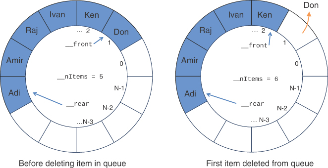

# 栈和队列
在这一章当中

- 不同用例的不同结构
- 栈
- 队列
- 优先队列
- 解析算术表达式

本章考察了在各种应用程序中广泛使用的三种数据存储结构：栈、队列和优先级队列。我们描述了这些结构与数组有何不同，依次检查了每一个。在上一节中，我们将了解栈在其中扮演重要角色的操作：解析算术表达式。
## 不同用例的不同结构
你可以根据数据结构对特定任务的适用性来选择要在程序中使用的数据结构。本章中的结构在几个方面与你在前几章中看到的有所不同。这些差异决定了何时将它们应用于新任务。

### 存储和检索模式

数组——到目前为止研究的数据存储结构——以及你在本书后面遇到的许多其他结构（链表、树等）适用于所有类型的数据存储。它们有时被称为低级数据结构，因为它们用于实现许多其他数据结构。数据的组织决定了如何检索存储在其中的特定记录或对象。数组特别适用于对象可以由整数索引的应用程序，因为检索速度快且与存储的对象数无关。如果索引未知，仍然可以搜索数组以找到对象。如你所见，对对象进行排序以牺牲其他操作为代价提高了搜索速度。插入和删除操作可以是常数时间的，也可以具有与搜索操作相同的大 O 表示。
另一方面，我们在本章中研究的结构和算法用于你不太可能需要搜索存储的特定对象或对象但希望以特定顺序处理这些对象的情况。

### 受限进入

在数组中，可以访问任何对象，可以立即访问（如果其索引号已知），也可以通过搜索一系列单元格直到找到为止。然而，在本章的数据结构中，访问是受限制的：一次只能读取或删除一个对象。
这些结构的接口旨在强制实施这种受限访问。访问其他对象（理论上）是不允许的。

### 更抽象

栈、队列和优先级队列是比数组和许多其他数据存储结构更抽象的结构。它们主要由它们的接口定义——可以对它们执行的允许操作。用于实现它们的底层机制通常对其用户不可见。
例如，栈的底层机制可以是数组，如本章所示，也可以是链表。优先级队列的底层机制可以是一个数组或一种称为堆的特殊树。当一个数据结构被用来实现一个更抽象的数据结构时，我们经常说它是一个较低级别的数据结构，通过描绘更抽象的结构分层在它之上。当我们在第 5 章"链表"中讨论抽象数据类型 (ADT) 时，我们回到了一个数据结构被另一个数据结构实现的主题。

## 栈
**栈**只允许访问集合中的一个数据项：插入的最后一对象。如果删除此对象，则可以访问插入的倒数第二个对象，依此类推。尽管该约束似乎非常有限，但在许多编程情况下都会出现这种行为。在本节中，我们将展示如何使用栈来检查计算机程序源文件中的圆括号、大括号和方括号是否平衡。在本章的最后，栈在解析（分析）诸如 3×(4+5) 等算术表达式中起着至关重要的作用。
对于应用于某些复杂数据结构的算法，栈也是一个方便的辅助工具。在第 8 章"二叉树"中，你将看到它用于帮助遍历树的节点。在第 14 章"图"中，你将应用它来搜索图的顶点（一种可以用来走出迷宫的技术）。
几乎所有的计算机都使用基于栈的体系结构。调用函数或方法时，恢复执行位置的返回地址和函数参数将按特定顺序压入（插入）栈。当函数返回时，它们被弹出。栈操作通常由计算机硬件加速。
将所有函数参数压入栈的想法非常清楚特定函数或运算符的操作数是什么。该方案用于一些较旧的袖珍计算器和形式语言，例如 PostScript 和 PDF 内容流。不是使用括号输入算术表达式来对操作数进行分组，而是将这些值插入（或压入）到栈中。运算符位于操作数之后并将它们弹出，将（中间）结果留在栈中。当我们在本章的最后一节讨论解析算术表达式时，你将了解有关此方法的更多信息。

### 邮政类比

要理解栈的概念，请考虑邮政提供的类比，并在较小程度上考虑一些电子邮件和消息传递系统，尤其是那些你一次只能看到一条消息的系统。许多人在收到邮件后，会把它扔到桌子上。如果他们离开了一段时间，栈可能会很大。如果他们不打开邮件，第二天，他们可能会在栈顶部添加更多邮件。在消息传递系统中，自人们上次查看以来可能会累积大量消息。然后，当他们有空闲时间时，他们开始从上到下处理累积的邮件或消息，一次一个。首先，他们打开最上面的信并采取适当的行动——支付账单、阅读节日通讯、考虑广告、将其扔掉，或其他任何事情。在处理完第一条消息后，他们检查下一条消息，现在是栈的顶部，然后处理它。这个想法是首先从最近发送的信件或消息开始。最终，他们按照自己的方式向下处理栈底部的消息（现在是最顶层的消息）。图 4-1 显示了一堆邮件。


图 4-1 栈字母
只要人们可以在合理的时间内轻松处理所有对象，这种"先做最重要的"方法就可以正常工作。如果他们做不到，那么栈底部的消息可能几个月都不会被检查，并且账单或其他重要的行动请求也不会得到足够快的处理。然而，通过首先查看最近的，他们至少可以保证找到在较早交付之后发生的账单或消息的任何更新。
当然，很多人并不严格遵循这种自上而下的方法。例如，他们可能会从栈底部取出邮件，首先处理最旧的信件。这样，他们就可以按到达时间顺序查看消息。或者他们可能会在开始处理消息之前对消息进行洗牌，并将优先级更高的消息放在首位。在这些情况下，他们的处理系统不再是计算机科学意义上的栈。如果他们从底部取走邮件，那就是队列；如果他们优先考虑它，它就是一个优先队列。我们稍后会研究这些可能性。
你每天执行的任务可以看作是一个栈。你通常有一组目标，通常具有不同的优先级。它们可能包括以下内容：快乐、与家人在一起或长寿。这些目标中的每一个都可以有子目标。例如，为了快乐，你可能有一个子目标：财务稳定。其中的一个子目标可能是：找到一份薪水足够的工作。你每天执行的任务都是围绕这些目标组织的。所以，如果"和我的家人在一起"是一个主要目标，那么你去工作是为了实现财务稳定的另一个目标。工作完成后，你返回家中以回到你的主要目标。在工作时，你可能会从一个长期项开始新的一天。当经理要求你处理一些刚刚弹出的新任务时，你将对象搁置一旁并处理弹出任务。如果出现更严重的问题，你可以搁置弹出任务并解决问题。当每个优先级较高的活动完成后，你将返回任务栈中的下一个优先级较低的活动。
在数据结构中，将数据对象放在栈顶称为入栈。从栈顶移除它称为弹出它。查看最上面的对象而不弹出它称为偷看。这些是主要的栈操作。栈被称为后进先出 (**LIFO**) 存储机制，因为最后插入的对象是第一个被删除的对象。

### 栈可视化工具

让我们使用栈可视化工具来了解栈的工作原理。当你按照附录 A"运行可视化"中的指南启动此工具时，你会看到一个空栈，其中包含 Push、New、Pop、Peek 操作以及图 4-2 中所示的动画控件。


图 4-2 栈可视化工具
Stack Visualization 工具基于数组，因此你会看到一组数据项，这次排列在一列中。尽管它基于数组，但栈会限制访问，因此你无法使用索引访问元素（即使它们出现在可视化中的单元格旁边）。事实上，栈的概念和用于实现它的底层数据结构是完全不同的。正如我们之前提到的，栈也可以通过其他类型的存储结构来实现，例如链表。

### Push 按钮

要在栈中插入数据对象，请使用标记为 Push 的按钮。该对象可以是任何文本字符串，你只需在 Push 旁边的文本输入框中键入它即可。该工具限制了字符串中的字符数，因此它们适合数组单元格。
栈的左侧是标记为"\_\_top"的红棕色箭头。这是数据结构的一部分，一个跟踪最后插入的对象的属性。最初，没有插入任何内容，因此它指向第一个数组单元格的下方，即标有小 0 的单元格。当你按下一个对象时，它向上移动到单元格 0，并且该对象被插入到该单元格中。请注意，在插入对象之前，顶部箭头会递增。这很重要，因为在递增之前复制数据可能会导致错误，因为在数组边界之外写入或在有多个对象时覆盖数组中的最后一个元素。
尝试将多个对象压入栈。该工具会记录你在键入参数时选择的最后一个操作，因此如果你在键入下一个参数时按 Return 或 Enter，它将再次运行推送操作。如果栈已满并且你尝试压入另一个对象，你将收到错误！栈已满消息。 （理论上，ADT 栈不会变满，但任何实际实现都会变满。）

### 新建按钮

与所有数据结构一样，你可以根据算法的需要创建（和删除）栈。因为这个实现是基于数组的，所以它需要知道数组应该有多大。 Stack Visualization 工具开始时分配了八个单元格，但没有一个单元格被填充。要创建一个新的空栈，请在文本输入框中键入它应该具有的单元格数，然后选择新建。该工具会调整单元格的高度以使其适合显示窗口。如果你要求的大小不合适，你会收到一条错误消息。

### Pop按钮

要从栈顶部删除数据项，请使用 Pop 按钮。弹出的值在复制到名为 top 的变量时向右移动。当 pop() 方法完成其工作时，它会暂时存储在那里。
再次注意所涉及的步骤。首先，对象从 \_\_top 指向的单元格中复制。然后清空cell，然后递减\_\_top指向占用最高的cell。复制和更改索引指针的顺序与推送操作中使用的顺序相反。
该工具的 Pop 操作显示实际从数组中删除的对象和单元格变空。这不是绝对必要的，因为该值可以留在数组中并被忽略。然而，在像 Python 这样的编程语言中，像这样引用留在数组中的对象会消耗内存。删除这些引用很重要，这样才能回收和重用内存。我们在查看代码时会详细说明这一点。请注意，你仍然在 top 变量中引用了该对象，这样它就不会丢失。
删除最上面的对象后，\_\_top 索引递减到下一个较低的单元格。从栈中弹出最后一项后，它指向最低单元格下方的 −1。这个位置表示栈是空的。如果栈是空的并且你试图弹出一个对象，你会得到错误！栈为空消息。

### Peek按钮

压入和弹出是两个主要的栈操作。然而，有时能够从栈顶部读取值而不删除它是很有用的。 peek 操作就是这样做的。通过多次选择 Peek 按钮，你会看到 \_\_top 索引处的对象的值已复制到右侧的输出框中，但该对象并未从栈中移除，栈保持不变。
请注意，你只能查看顶部对象。按照设计，所有其他对象对栈用户都是不可见的。如果选择 Peek 时可视化工具中的栈为空，则不会创建输出框。我们稍后将在代码中展示如何实现空测试。

### 栈大小

栈有各种大小，并且通常有大小上限，以便可以将它们分配到单个内存块中。应用程序根据预期堆叠的最大对象数分配一些初始大小。如果应用程序试图将对象压入栈所能容纳的范围之外，那么要么栈需要增加大小，要么必须发生异常。可视化工具将大小限制为适合屏幕的大小，但许多应用程序中的栈可能有数千或数百万个单元格。

### 栈的 Python 代码

Python 列表类型是实现栈的自然选择。 正如你在第 2 章"数组"中看到的，列表类型可以像数组一样工作（与链表相反，如第 5 章"链表"中所示）。 我们没有使用 Python 切片来获取列表中的最后一个元素，而是继续将列表用作基本数组，并为最顶层的对象保留一个单独的 \_\_top 指针，如清单 4-1 所示。
清单 4-1 SimpleStack.py 模块

```python
# Implement a Stack data structure using a Python list

class Stack(object):
    def __init__(self, max):  # Constructor
        self.__stackList = [None] * max  # The stack stored as a list
        self.__top = -1  # No items initially

    def push(self, item):  # Insert item at top of stack
        self.__top += 1  # Advance the pointer
        self.__stackList[self.__top] = item  # Store item

    def pop(self):  # Remove top item from stack
        top = self.__stackList[self.__top]  # Top item
        self.__stackList[self.__top] = None  # Remove item reference
        self.__top -= 1  # Decrease the pointer
        return top  # Return top item

    def peek(self):  # Return top item
        if not self.isEmpty():  # If stack is not empty
            return self.__stackList[self.__top]  # Return the top item

    def isEmpty(self):  # Check if stack is empty
        return self.__top < 0

    def isFull(self):  # Check if stack is full
        return self.__top >= len(self.__stackList) - 1

    def __len__(self):  # Return # of items on stack
        return self.__top + 1

    def __str__(self):  # Convert stack to string
        ans = "["  # Start with left bracket
        for i in range(self.__top + 1):  # Loop through current items
            if len(ans) > 1:  # Except next to left bracket,
                ans += ", "  # separate items with comma
            ans += str(self.__stackList[i])  # Add string form of item
        ans += "]"  # Close with right bracket
        return ans
```

SimpleStack.py 实现仅具有栈所需的基本功能。与你在第 2 章中看到的 Array 类一样，构造函数分配一个已知大小的数组，称为 \_\_stackList，以保存具有 \_\_top 指针的对象作为栈中最顶层对象的索引。与 Array 类不同，\_\_top 指向最顶层的对象而不是下一个要填充的数组单元格。代替 insert()，它有一个 push() 方法，将新对象放在栈的顶部。 pop() 方法返回栈顶部的对象，清除保存它的数组单元格，并减小栈大小。 peek() 方法返回顶部对象而不减少栈大小。
在这个简单的实现中，几乎没有错误检查。它确实包括 isEmpty() 和 isFull() 方法，这些方法返回布尔值，指示栈是否没有对象或已满。 peek() 方法检查是否有空栈，只有在有空栈时才返回顶部值。为避免错误，客户端程序需要在调用 pop() 之前使用 isEmpty()。该类还包括测量栈深度的方法和字符串转换方法，以便于显示栈内容。
要练习这个类，你可以使用清单 4-2 中所示的 SimpleStackClient.py 程序。
清单 4-2 SimpleStackClient.py 程序

```python
from SimpleStack import *


stack = Stack(10)

for word in ['May', 'the', 'force', 'be', 'with', 'you']:
    stack.push(word)

print('After pushing', len(stack), 'words on the stack, it contains:\n', stack)
print('Is stack full?', stack.isFull())
print('Popping items off the stack:')
while not stack.isEmpty():
    print(stack.pop(), end=' ')
print()
```

客户端创建一个小栈，将一些字符串压入栈，显示内容，然后弹出它们，从左到右以空格分隔打印它们。运行程序的记录显示如下：

```sh
$ python3 SimpleStackClient.py
After pushing 6 words on the stack, it contains:
[May, the, force, be, with, you]
Is stack full? False
Popping items off the stack:
you with be force the May
```

注意程序如何颠倒数据对象的顺序。因为最后一个被压入的对象是第一个被弹出的，所以你首先出现在输出中。图 4-3 显示了数据如何放置在栈的数组单元中，然后返回以进行压入和弹出操作。图中显示为空的数组单元格中仍然有值None，但是因为只有自下而上到\_\_top指针的值被占用，所以\_\_top之外的可以认为是未填充的。可视化工具使用与清单 4-1 中相同的 pop() 方法，将弹出的单元格设置为 None。


图 4-3 Stack 类 push() 和 pop() 方法的操作
### 错误处理
关于如何处理栈错误有不同的理念。如果你尝试将一个对象推入已满的栈或从空的栈中弹出一个对象，会发生什么情况？
在此实现中，避免或处理此类错误的责任已留给使用该类的程序。该程序应始终检查以确保在插入对象之前栈未满，如

```python
if not stack.isFull():
    stack.push(item)
else:
    print("Can't insert, stack is full")
```

清单 4-2 中的客户端程序在调用 pop() 之前检查是否有空栈。但是，它不会在调用 push() 之前检查完整栈。或者，许多栈类在 push() 和 pop() 方法中内部检查这些条件。通常，发现此类情况的栈类要么抛出异常，然后可以由使用该类的程序捕获和处理，要么采取一些预定义的操作，例如返回 None。通过为用户提供查询内部状态的能力和在违反约束时引发异常的可能性，数据结构支持主动和被动方法。

### 栈示例 1：反转单词

对于使用栈的第一个示例，我们考察一个简单的任务：反转单词。当你运行这个程序时，你输入一个单词或短语，程序就会显示反转的单词或短语。
栈用于反转字母。首先，字符从输入字符串中一个一个地提取出来，压入栈中。然后它们从栈中弹出并显示。由于其后进先出的特性，栈颠倒了字符的顺序。清单 4-3 显示了 ReverseWord.py 程序的代码。
清单 4-3 ReverseWord.py 程序

```python
from SimpleStack import *
 
stack = Stack(100)          # Create a stack to hold letters
 
word = input("Word to reverse: ")
 
for letter in word:         # Loop over letters in word
    if not stack.isFull():   # Push letters on stack if not full
        stack.push(letter)
 
reverse = ''                # Build the reversed version
while not stack.isEmpty():  # by popping the stack until empty
    reverse += stack.pop()
 
print('The reverse of', word, 'is', reverse)
```

该程序使用 Python 的 input() 函数，该函数打印提示字符串，然后等待用户键入响应字符串。程序构造一个栈实例，从用户那里获取要反转的单词，循环遍历单词中的字母，并将它们压入栈。如果栈已满，程序将避免压入字母。在将所有字母压入栈后，程序创建反向版本，从一个空字符串开始并附加从栈弹出的每个字符。结果如下所示：

```sh
$ python3 ReverseWord.py
Word to reverse: draw
The reverse of draw is ward
$ python3 ReverseWord.py
Word to reverse: racecar
The reverse of racecar is racecar
$ python3 ReverseWord.py
Word to reverse: bolton
The reverse of bolton is notlob
$ python3 ReverseWord.py
Word to reverse: A man a plan a canal Panama
The reverse of A man a plan a canal Panama is amanaP lanac a nalp a nam A
```

结果表明单字回文与输入相同。如果输入的"单词"有空格，如上例所示，则空格将被视为字符串中的任何其他字母。

### 栈示例 2：定界符匹配

栈的一种常见用途是解析某些类型的文本字符串。通常，字符串是计算机语言中的代码行，解析它们的程序是编译器或解释器。
为了说明所涉及的内容，让我们看一个检查表达式中定界符的程序。文本表达式不需要是一行真实的代码（尽管它可能是），但它应该像大多数编程语言一样使用定界符。定界符是花括号 { 和 }、方括号 [ 和 ] 以及圆括号 ( 和 )。每个开始或左定界符都应与结束或右定界符匹配；也就是说，每个 { 后面都应该跟一个匹配的 } 等等。此外，字符串中较晚出现的开始定界符应在较早出现的开始定界符之前关闭。这里有些例子：

```sh
c[d]        # correct
a{b[c]d}e   # correct
a{b(c]d}e   # not correct; ] doesn't match (
a[b{c}d]e}  # not correct; nothing matches final }
a{b(c)      # not correct; nothing matches opening {
```

### 在栈上打开定界符
这个定界符匹配程序的工作原理是一次从字符串中读取一个字符，并在找到起始定界符时将其放入栈中。当它从输入中读取结束定界符时，它会从栈顶部弹出开始定界符，并尝试将其与结束定界符相匹配。如果它们不是同一类型（例如，有一个左括号但有一个右括号），则会发生错误。此外，如果栈上没有开始定界符来匹配结束定界符，或者没有匹配定界符，则会发生错误。它会发现不匹配的定界符，因为在读取字符串中的所有字符后它们仍保留在栈中。
让我们看看对于一个典型的正确字符串，栈上会发生什么：

```python
a{b(c[d]e)f}
```

表 4-1 显示了从该字符串中读取每个字符时栈的外观。第二列中的条目显示栈内容，从左侧的栈底部到右侧的顶部读取。
表 4-1 与表达式 a{b(c[d]e)f} 匹配的定界符中的栈内容

| 字符读取 | 栈内容 |
| :------: | :----: |
|    a     |        |
|    {     |   {    |
|    b     |   {    |
|    (     |   {(   |
|    c     |   {(   |
|    [     |  {([   |
|    d     |  {([   |
|    ]     |   {(   |
|    e     |   {(   |
|    )     |   {    |
|    f     |   {    |
|    }     |        |

读取字符串时，每个开始的定界符都放在栈上。从输入中读取的每个结束定界符都与从栈顶部弹出的开始定界符相匹配。如果他们组成一对，一切都很好。非定界符字符不会插入到栈中；他们被忽略了。
这种方法之所以有效，是因为最后打开的定界符对应该首先关闭。这与栈的后进先出属性相匹配。

### DelimiterChecker.py 的 Python 代码

清单 4-4 显示了解析程序 DelimiterChecker.py 的代码。与 ReverseWord.py 一样，该程序在使用 input() 提示用户后接受一个表达式，并打印出发现的任何错误或一条消息，说明定界符是平衡的。
清单 4-4 DelimiterChecker.py 程序

```python
# A program to check that delimiters are balanced in an expression

from SimpleStack import *

stack = Stack(100)  # Create a stack to hold delimiter tokens

expr = input("Expression to check: ")

errors = 0  # Assume no errors in expression

for pos, letter in enumerate(expr):  # Loop over letters in expression
    if letter in "{[(":  # Look for starting delimiter
        if stack.isFull():  # A full stack means we can't continue
            raise Exception("Stack overflow on expression")
        else:
            stack.push(letter)  # Put left delimiter on stack

    elif letter in "}])":  # Look for closing delimiter
        if stack.isEmpty():  # If stack is empty, no left delimiter
            print(
                "Error:", letter, "at position", pos, "has no matching left delimiter"
            )
            errors += 1
        else:
            left = stack.pop()  # Get left delimiter from stack
            if not (
                left == "{"
                and letter == "}"
                or left == "["  # Do delimiters
                and letter == "]"
                or left == "("  # match?
                and letter == ")"
            ):
                print(
                    "Error:",
                    letter,
                    "at position",
                    pos,
                    "does not match left delimiter",
                    left,
                )
                errors += 1

# After going through entire expression, check if stack empty
if stack.isEmpty() and errors == 0:
    print("Delimiters balance in expression", expr)

elif not stack.isEmpty():  # Any delimiters on stack weren't matched
    print("Expression missing right delimiters for", stack)
```

该程序没有定义任何功能；它处理来自用户的一个表达式并退出。它创建一个 Stack 对象来保存找到的定界符。 errors 变量用于跟踪在解析表达式时发现的错误数。它使用 Python 的 enumerate() 定序器循环遍历表达式中的字符，该定序器获取索引和该索引处字符串的值。当它找到起始（或左侧）定界符时，它将它们压入栈，避免栈溢出。当它找到结束（或关闭或右）定界符时，它会检查栈顶部是否有匹配的定界符。如果不是，它会打印错误并继续。一些示例输出是

```sh
$ python3 DelimiterChecker.py
Expression to check: a()
Delimiters balance in expression a()
$ python3 DelimiterChecker.py
Expression to check: a( b[4]d )
Delimiters balance in expression a( b[4]d )
$ python3 DelimiterChecker.py
Expression to check: a( b]4[d )
Error: ] at position 4 does not match left delimiter (
Error: ) at position 9 does not match left delimiter [
$ python3 DelimiterChecker.py
Expression to check: {{a( b]4[d )
Error: ] at position 6 does not match left delimiter (
Error: ) at position 11 does not match left delimiter [
Expression missing right delimiters for [{, {]
```

DelimiterChecker.py 打印的消息显示表达式中重要字符（定界符）的位置和值。处理完所有字符后，栈中任何剩余的定界符都不匹配。该程序使用 Stack 的字符串转换方法打印错误，该方法将列表括在方括号中，可能导致与输入字符串定界符的一些混淆。

### 作为概念辅助的栈

请注意栈在 DelimiterChecker.py 程序中的便利程度。你可以设置一个数组来执行栈的操作，但你不得不担心跟踪最近添加的字符的索引，以及其他标记任务。栈在概念上更易于使用。通过使用 push() 和 pop() 方法提供对其内容的有限访问，栈使定界符检查程序更易于理解且不易出错。 （正如木匠会告诉你的那样，使用正确的工具来完成工作更安全、更快捷。）

### 栈的效率

可以在恒定的 O(1) 时间内从 Stack 类中实现的栈中推送和弹出对象。也就是说，时间不依赖于栈中有多少项，因此非常快。不需要在栈中进行比较或移动。

## 队列
在计算机科学中，队列是一种有点像栈的数据结构，除了在队列中第一个插入的对象最先被删除（先进先出或 FIFO）。如你所见，在栈中，最后插入的对象最先被删除 (LIFO)。队列模拟了人们等待某事的方式，例如在窗口出售的门票或在盛大婚礼上迎接新娘和新郎的机会。第一个到达的人先到，下一个到的第二个，依此类推。美国人称之为waiting line，而英国人称之为queue。关键是最先到达的对象最先被处理。
队列就像栈一样被用作程序员的工具。它们在计算机系统中随处可见：等待运行的作业、通过网络传递的消息、等待在终端上打印的字符序列。它们用于模拟现实世界的情况，例如排队等候购票的人、等待起飞的飞机或等待查看他们是否进入特定课程的学生。这种排序有时称为到达排序，因为到达队列的时间决定了顺序。
各种队列在你的计算机（或网络）操作系统中悄悄地完成它们的工作。有一个打印机队列，打印作业等待打印机可用。队列还存储用户输入事件，如击键、鼠标点击、触摸屏触摸和麦克风输入。它们在多处理系统中非常重要，这样即使事件发生时处理器正忙于做其他事情，每个事件也能以正确的顺序处理。
队列上的两个基本操作称为插入和删除。插入对应于一个人将自己插入到售票线的后面。当那个人进行购买时，他们会把自己从队伍的前面移开。
栈中插入和移除的术语是相当标准的；每个人都说 push 和 pop。队列的术语并不那么标准化。 Insert 也称为 put 或 add 或 enqueue，而 remove 可以称为 delete 或 get 或 dequeue。插入对象的队列尾部也称为尾部或尾部。去除对象的前部也可称为头部。在本书中，我们使用术语插入、移除、前端和后端。

### 一个狡猾的问题

在考虑如何使用数组实现队列时，第一个选择是像压栈一样处理插入。第一项位于数组的最后位置（第一个空单元格）。然后，当需要从队列中删除一个对象时，你将获取数组的第一个填充单元格。为避免搜索这些单元格的位置，你可以保留前后两个索引来跟踪填充单元格的开始和结束位置，如图 4-4 所示。当 Ken 到达时，他被安置在由 rear 索引的单元格中。当你删除队列中的第一项时，你会从 front 索引的单元格中获取 Raj。


图 4-4 线性数组中的队列操作
此操作效果很好，因为插入和删除都只是复制一个对象并更新索引指针。它与栈的压入和弹出操作一样快，只需要多管理一个变量。
当你到达数组的末尾时会发生什么？如果后索引到达数组末尾，则没有空间插入新项。这可能是可以接受的，因为它并不比栈空间不足时更糟。但是，如果前面的索引已移过数组的开头，则可用单元格可用于对象存储。不利用它们似乎很浪费。
回收未使用的存储空间的一种方法是在插入结束时移动数组中的所有对象。换档类似于人们排队/排队时发生的情况；当人们离开队列的前面时，他们都向前走。在数组中，你可以将 front 索引的对象移动到单元格 0，并将所有对象向上移动到相同数量的单元格；那么你可以将 front 设置为 0，将 rear 设置为 rear - front。然而，移动对象需要时间，这样做会使一些插入操作花费 O(N) 时间而不是 O(1)。有没有办法避免移动？

### 循环队列

为了避免在队列未满时无法向队列中插入更多项的问题，你让前后指针环绕到数组的开头。结果是一个循环队列（有时称为环形缓冲区）。如果将一排单元格弯曲成圆形，使最后一个单元格和第一个单元格相邻，这很容易想象，如图 4-5 所示。该数组中有 N 个单元格，编号为 0、1、2、...、N-2、N-1。当其中一个指针位于 N-1 并且需要递增时，你只需将其设置为 0。你仍然需要注意不要让环绕走得太远并开始写入其中包含有效项的单元格。要了解如何实现，让我们首先查看队列可视化工具，然后查看实现它的代码。


图 4-5 Queue.insert() 方法在空队列上的操作

### 队列可视化工具

让我们使用队列可视化工具来了解队列和循环数组的工作原理。 当你启动队列工具时，你会看到一个可以容纳 10 个对象的空队列，如图 4-6 所示。 阵列单元从右边缘开始编号为 0 到 9。 （索引沿逆时针方向增加以匹配三角学中的惯例，其中角度从水平 X 轴增加。）


图 4-6 队列可视化工具
\_front 和 \_rear 索引显示在中心（带有下划线前缀有点像代码中命名的属性）。左上角还有一个 \_nItems 计数器。 front 指向 1 和 rear 指向 0 似乎有点奇怪，但原因很快就会变得清楚。

### 插入按钮

在文本输入框中键入一些文本后，点击"插入"按钮。该工具通过增加 \_rear 索引并将值复制到单元格 1 来响应。与栈一样，你可以插入有限长度的字符串值。键入另一个字符串，然后按 Return 将 \_rear 前进到单元格 2 并将值复制到其中。

### 删除按钮

当队列中有一个或多个对象时，选择"删除"按钮会将 \_front 单元格中的对象复制到名为 front 的变量。 \_front 单元格被清除，索引前进一个。前面的变量保存操作返回的值。
请注意，\_front 和 \_rear 索引可以以任何顺序出现。在最初的空队列中，\_rear 比 \_front 少 1。当插入第一项时，\_rear 和\_front 都指向同一个单元格。额外的插入推进 \_rear 超过 \_front。删除操作推进 \_front 超过 \_rear。
继续插入值，直到填满所有单元格。请注意 \_rear 索引如何从 9 循环到 0。当所有单元格都被填充时，\_rear 比 \_front 少一个。这与队列为空时的关系相同，但现在 \_nItems 计数器为 10，而不是 0。

### Peek按钮

peek 操作返回队列前面的对象的值而不删除该对象。 （与插入和删除一样，当应用于队列时，peek 也被称为各种其他名称。）如果选择 Peek 按钮，你会看到 _front 处的值复制到输出框。队列保持不变。
一些队列实现有一个 rearPeek() 和一个 frontPeek() 方法，但通常你想知道要删除什么，而不是刚插入什么。

### 新建按钮

如果你想从一个空队列开始，你可以使用"新建"按钮创建一个。因为它基于数组，所以数组的大小就是所需的参数。 Queue Visualization 工具允许你选择一系列队列大小，最大为允许显示值的限制。动画显示了调用对象构造函数的步骤。

### 空与满

如果你在队列中没有对象时尝试删除对象，你将得到 Queue is empty！信息。你还会看到代码以不同的颜色突出显示，因为此操作引发了异常。同样，如果你尝试在所有单元格都已被占用时插入一个对象，你将得到队列已满！来自队列溢出异常的消息。这些操作将在下一节中详细介绍。

### 队列的 Python 代码

让我们看看如何使用循环数组在 Python 中实现队列。清单 4-5 显示了 Queue 类的代码。构造函数比栈的构造函数稍微复杂一点，因为它必须管理队列前端和后端的两个索引指针。我们选择维护对象数量的显式计数，如下所述。
清单 4-5 Queue.py 模块

```python
# Implement a Queue data structure using a Python list


class Queue(object):
    def __init__(self, size):  # Constructor
        self.__maxSize = size  # Size of [circular] array
        self.__que = [None] * size  # Queue stored as a list
        self.__front = 1  # Empty Queue has front 1
        self.__rear = 0  # after rear and
        self.__nItems = 0  # No items in queue

    def insert(self, item):  # Insert item at rear of queue
        if self.isFull():  # if not full
            raise Exception("Queue overflow")
        self.__rear += 1  # Rear moves one to the right
        if self.__rear == self.__maxSize:  # Wrap around circular array
            self.__rear = 0
        self.__que[self.__rear] = item  # Store item at rear
        self.__nItems += 1
        return True

    def remove(self):  # Remove front item of queue
        if self.isEmpty():  # and return it, if not empty
            raise Exception("Queue underflow")
        front = self.__que[self.__front]  # get the value at front
        self.__que[self.__front] = None  # Remove item reference
        self.__front += 1  # front moves one to the right
        if self.__front == self.__maxSize:  # Wrap around circular arr.
            self.__front = 0
        self.__nItems -= 1
        return front

    def peek(self):  # Return frontmost item
        return None if self.isEmpty() else self.__que[self.__front]

    def isEmpty(self):
        return self.__nItems == 0

    def isFull(self):
        return self.__nItems == self.__maxSize

    def __len__(self):
        return self.__nItems

    def __str__(self):  # Convert queue to string
        ans = "["  # Start with left bracket
        for i in range(self.__nItems):  # Loop through current items
            if len(ans) > 1:  # Except next to left bracket,
                ans += ", "  # separate items with comma
            j = i + self.__front  # Offset from front
            if j >= self.__maxSize:  # Wrap around circular array
                j -= self.__maxSize
            ans += str(self.__que[j])  # Add string form of item
        ans += "]"  # Close with right bracket
        return ans
```

\_\_front 和 \_\_rear 指针分别指向队列中的第一个和最后一个对象。这些和其他属性以双下划线前缀命名，以表明它们是私有的。它们不应由对象用户直接更改。
当队列为空时，\_\_front和\_\_rear应该指向哪里呢？我们通常将其中之一设置为 0，我们选择为 \_\_rear 这样做。如果我们也将 \_\_front 设置为 0，我们将无法插入第一个元素。我们最初将 \_\_front 设置为 1，如图 4-5 的空队列所示，这样当第一个元素被插入并且 \_\_rear 递增时，它们都是 1。这是可取的，因为队列中的第一个和最后一个元素是一个和相同的。所以 \_\_rear 和 \_\_front 对于第一个对象是 1，并且 \_\_rear 对于后面的插入增加。这意味着队列中最前面的对象索引较低，最后面的索引通常较高。
insert() 方法将一个新对象添加到队列的尾部。它首先检查队列是否已满。如果是，则 insert() 引发异常。这是实现数据结构的首选方式：提供测试以便调用者可以提前检查状态，但如果他们不这样做，则为无效操作引发异常。此处使用了 Python 最通用的 Exception 类和自定义原因字符串"Queue overflow"。许多数据结构都定义了自己的异常类，以便可以轻松地将它们与 ValueError 和 IndexError 等异常情况区分开来。
你可以避免在插入期间移动数组中的对象，方法是在递增 \_\_rear 指针并将新对象放置在数组的空单元格之前验证空间是否可用。当指针将通过将 \_\_rear 设置回 0 超出数组的最大大小时，增量采取额外的步骤来处理循环数组逻辑。最后，insert() 增加对象计数以反映在后面插入的对象。
remove() 方法在操作上类似，但作用于队列的\_\_front。首先，它检查队列是否为空，如果是，则引发"下溢"异常。然后它复制第一项，清除数组单元格，并递增 \_\_front 指针以指向下一个单元格。 \_\_front 指针必须回绕，就像 \_\_rear 所做的那样，在到达数组末尾时返回 0。对象计数减少，因为前面的对象已从数组中删除，并返回对象的副本。
peek() 方法查看队列的最前面的对象。你可以创建 peekfront() 和 peekrear() 方法来查看队列的任一端，但在实践中很少需要这两种方法。 peek() 方法在队列为空时返回 None，尽管使用 remove() 产生的相同下溢异常可能更一致。
isEmpty() 和 isFull() 方法是对队列中对象数量的简单测试。请注意，此处使用的 Python 语法略有不同。该方法的整个主体是一个单一的返回语句。在这种情况下，Python 允许将语句放在结束方法签名的冒号之后。 \_\_len\_\_() 方法也使用缩短的语法。另请注意，这些测试查看属性的 \_\_nItems 值，而不是 \_\_front 和 \_\_rear 索引。这是区分空队列和满队列所必需的。在图 4-9 中，我们将查看环绕索引如何使选择变得更加困难。


图 4-9 \_\_rear 指针环绕
Queue 的最后一个方法是 \_\_str\_\_()，它创建一个字符串，显示用括号括起来并以逗号分隔的队列内容以供显示。此方法说明了循环数组索引的工作原理。字符串的开头有队列的前面，字符串的结尾是最后面的对象。 for 循环使用变量 i 来索引队列中的所有当前项。一个单独的变量 j 从 \_\_front 开始，如果它超过数组的最大大小，则向 \_\_rear 递增。
Queue 类的一些简单测试如清单 4-6 所示，并演示了基本操作。该程序创建一个队列并在其中插入一些名称。初始队列是空的，图 4-5 显示了如何插入名字"Don"。在第一次插入之后，\_\_front 和 \_\_rear 都指向数组单元格 1，并且对象数为 1。
清单 4-6 QueueClient.py 程序

```python
from Queue import *

queue = Queue(10)
 
for person in ['Don', 'Ken', 'Ivan', 'Raj', 'Amir', 'Adi']:
    queue.insert(person)
 
print('After inserting', len(queue), 'persons on the queue, it contains:\n', queue)
print('Is queue full?', queue.isFull())
 
print('Removing items from the queue:')
while not queue.isEmpty():
    print(queue.remove(), end=' ')
print()
```

插入队列的人名不断推进\_\_rear 指针并增加\_\_nItems 计数，如图4-7 所示。插入所有名称后，QueueClient.py 程序使用 \_\_str\_\_() 方法（隐式）并打印队列的内容以及队列是否已满的状态。完成后，程序一次从队列中删除一个对象，直到队列为空。这些对象以空格分隔打印（这与 \_\_str\_\_() 方法显示它们的方式不同）。结果如下所示：

```sh
$ python3 QueueClient.py
After inserting 6 persons on the queue, it contains:
 [Don, Ken, Ivan, Raj, Amir, Adi]
Is queue full? False
Removing items from the queue:
Don Ken Ivan Raj Amir Adi
```


图 4-7 将对象插入部分满的队列
打印的结果显示对象从队列中删除的顺序与它们插入队列的顺序相同。删除过程的第一步如图 4-8 所示。当第一个对象"Don"从队列的前端删除时，\_\_front 指针前进到 2，对象数减少到 5。\_\_rear 指针保持不变。



图 4-8 从队列中删除对象
让我们看看当队列环绕圆形数组时会发生什么。如果只删除一个名字，然后将更多名字插入队列，最终会出现图 4-9 所示的情况。 \_\_rear 指针随着每次插入而不断增加。在达到 \_\_maxSize − 1 后，下一次插入会强制 \_\_rear 指向单元格 0。
最后插入的对象"Tim"确实位于底层数组的开头。这种行为可能有点违反直觉，因为队列中的对象序列不再在一个连续的数组序列 [\_\_front, \_\_rear] 中。队列的前面从索引 2 开始，一直上升到最大值，后面是单个单元格序列 [0, 0]。我们说这些对象处于断开的序列或不连续的序列中。 \_\_rear 现在小于 \_\_front 似乎是落后的，但这就是圆形数组的工作方式。设计总是从 \_\_front 开始，递增直到到达 \_\_rear，当你超过最大尺寸时环绕到 0。
现在考虑在图 4-9 的队列中插入一个对象时会发生什么。该对象将位于单元格 1，并且 \_\_rear 将指向小于 \_\_front（即 2）的索引 1。这几乎与你启动空队列时的情况相同，只是你将 \_\_rear 和 \_\_front 都增加了 1。要将该情况与空队列区分开来，你需要知道它包含的对象数。如果 \_\_rear 总是大于 \_\_front，你可以从 \_\_rear - \_\_front + 1 中得到对象的数量。在断链的情况下，你可以简单地添加两个断链的长度，但你仍然需要一些信息来区分一个当 \_\_rear + 1 == \_\_front 时从满队列中清空。这就是为什么在数据结构中对队列中的对象进行显式计数可以简化实现。

### 队列效率

与栈一样，对象可以在 O(1) 时间内从队列中插入和删除。这是基于使用圆形阵列避免移位。

### Deques

你可能会发现有用的基本队列的多种变体。Deques是双端队列。你可以在任一端插入对象并从任一端删除它们。这些方法可能称为 insertLeft() 和 insertRight()，以及 removeLeft() 和 removeRight()。你可能还会发现这种称为出队的结构，但这可能是个问题，因为某些实现喜欢将 insert() 称为 enqueue() 并将 remove() 称为 dequeue()。较短的 deque 是首选，发音为"deck"以帮助将其与"dee cue"区分开来。
如果你限制自己使用 insertLeft() 和 removeLeft()（或右侧的等效项），则双端队列就像栈一样。如果你限制自己使用 insertLeft() 和 removeRight() （或相反的一对），它就像一个队列。
双端队列提供了比栈或队列更通用的数据结构，有时在容器类库中用于同时满足这两个目的。但是，它不像栈和队列那样经常使用，因此我们不会在这里进一步探讨。

## 优先队列
优先级队列是比栈或队列更专业的数据结构。尽管更加专业，但在数量惊人的情况下它是一个有用的工具。和普通队列一样，优先队列也有前部和后部，从前面取出项。然而，在优先级队列中，对象按优先级值排序，因此具有最高优先级的对象（在许多实现中是键的最低值）始终位于最前面。当多个对象具有相同的优先级时，它们遵循队列顺序 FIFO，以便最早插入的对象排在第一位。与栈和队列一样，不提供对优先级队列中间任意项的访问。
优先级队列对于处理邮件或消息很有用。面对一个大收件箱，读者可能会选择根据优先级将邮件放入一堆。所有需要立即采取行动的消息都排在第一位。即时响应、近期响应、长期响应和无响应可能有一堆堆。按照它们到达的顺序处理一些或所有这些堆可能是有意义的。如果消息是来自朋友的信件，按时间顺序浏览通信将最有意义，尤其是当它们涉及朋友在之前消息中所说的话时。如果消息是购买门票或其他稀缺物品的请求，通常第一个请求会在后面的请求之前被处理，可能有一些不同的优先级堆（例如，季票持有者比其他人获得季后赛门票更高的优先级）。
与栈和队列一样，优先级队列经常被用作程序员的工具。在几乎每个计算机操作系统中，程序都被放置在优先队列中以供运行。许多低级操作系统任务获得最高优先级，尤其是那些需要确定接下来需要运行什么作业以及如何响应重要输入事件的任务。然后，操作系统从优先级队列中取出最前面的作业，在接下来的一段时间内运行。当时间到期时，系统将该对象放回优先级队列中，等待具有相同优先级的其他作业。它还可能会在延迟一段时间后将作业放回优先级队列中，以便为其他低优先级作业的运行留出时间。正常完成的作业——不是因为它们的时间片到期——不会被放回队列中。当我们在第 15 章"加权图"中描述如何为图构建称为最小生成树的结构时，我们展示了另一个在编程技术中使用优先级队列的示例。
优先队列共享与其他数据结构相关的方面。它们具有队列的 FIFO 排序行为，以及不同优先级所需的排序行为。正如你在第 3 章"简单排序"中看到的那样，你可以以各种方式实现排序算法，从而导致不同的时间性能。你看到的栈和队列的插入和删除时间性能为 O(1)。当我们添加优先行为时，我们将看到是否可以保留它。

### PriorityQueue 可视化工具

PriorityQueue 可视化工具使用数组实现优先级队列，其中的对象按排序顺序保存。它是一个升序优先级队列，其中具有最小键的项具有最高优先级，并使用 remove() 进行访问。 （如果最高键项具有最高优先级，则删除期间键的顺序递减，这将是一个降序优先级队列。）
最小键项始终位于数组的右侧（索引最高），最大项始终位于索引 0 处。图 4-10 显示了工具启动时的排列。最初，12 元素队列中没有对象，如指向单元格 0 的 nItems 索引所示。


图 4-10 PriorityQueue 可视化工具

### 插入按钮

尝试通过在文本输入框中键入数字并选择插入来插入对象。你使用数字作为对象，因为优先级通常是数字，并且这种方法可以很容易地绘制与键成比例的对象高度。第一项插入到最左边的单元格中，nItems 索引前进到 1。
现在尝试插入另一个对象。因为优先级队列必须保持对象有序，所以它的行为类似于你在第 2 章中看到的 OrderedArray。如果你插入的对象具有比第一个低的键，它将向右移动。如果你插入更高的键，具有较低键的对象将向右移动以为新对象腾出空间。新对象的键与优先级队列中的每个对象进行比较，从右边的开始。对象向右移动，直到一个单元格可用，可以在其中插入新对象同时保留键顺序。
请注意，在优先级队列的这个实现中没有回绕。插入很慢，因为必须找到正确的顺序位置，但删除很快。环绕式实施不会改善这种情况。因为没有环绕，所以所有对象都位于数组的最左边、较低索引的单元格中。不需要两个索引；所需要的只是一个 nItems 索引。
尝试多次插入相同的密钥并观察行为。可视化工具为新对象赋予不同的颜色，以便更容易区分它们。你可以将颜色视为与数字键关联的不同数据。它在哪里插入新密钥？它总是位于其他等值键的左侧。将其放在左侧可保留这些对象的 FIFO 队列顺序。

### 删除按钮

当你使用 Remove 按钮时，要删除的项始终位于数组的右侧，在 nItems 索引左侧的单元格中，因此删除既快速又容易。该对象被复制到前面的变量，并且 nItems 索引递减，就像在栈中一样。无需移动或比较。

### Peek按钮

你可以使用 Peek 按钮查看最小对象（找到它的值而不删除它）。该值被复制到输出框，如栈和队列。

### 新建按钮

你可以使用新建按钮创建一个新的空优先级队列。与其他数据结构一样，底层数组的大小是必需的参数，并且受限于易于显示的大小。可视化工具动画化了记录大小、分配数组和将 nItems 索引设置为 0 的步骤。还有一个 \_\_pri 属性，我们稍后将在代码中讨论。

### 实施可能性

可视化程序使用优先级队列的特定实现，该队列对所有排队的对象使用单个数组。还有其他的可能性，例如为每个优先级使用单独的队列或使用堆而不是数组（如第 13 章"堆"中讨论的）。这些选择中的每一个都有不同的优势。
单个阵列实现具有简单的优点，但代价是减慢了插入或移除时间。如果你保持对象数组按优先级和到达顺序排序，则需要时间在插入期间移动数组中的对象以保持该顺序。如果你不对对象数组进行排序（但保持到达顺序），那么插入仍然可以很快，但是当你搜索要删除的最高优先级对象时，删除速度很慢。从未排序的列表中删除一个对象后，你必须在数组中移动对象以弥补删除造成的差距。平均而言，数组中对象的移动预计会移动一半的对象。插入或删除都会发生这种情况，具体取决于你是否保持数组内容排序。知道移动次数意味着插入或删除将是一个 O(N) 操作。我们检查一个特定的实现，看看它是如何工作的。

### 优先队列的 Python 代码

清单 4-7 显示了 PriorityQueue 类在 Python 中的实现，它使用单个排序数组（Python 列表）。选择保持内部数组排序意味着它不需要为 Queue 管理循环数组的前指针和后指针，如图 4-5 所示。相反，它保留一个数组，其中队列的前面是最后一个元素，以便快速删除它。这意味着队列的尾部始终位于索引 0 处，并且它只管理一个有点像 Stack 类的 \_\_nItems 属性。
清单 4-7 PriorityQueue.py 程序

```python
# Implement a Priority Queue data structure using a Python list


def identity(x):
    return x  # Identity function


class PriorityQueue(object):
    def __init__(self, size, pri=identity):  # Constructor
        self.__maxSize = size  # Size of array
        self.__que = [None] * size  # Queue stored as a list
        self.__pri = pri  # Func. to get item priority
        self.__nItems = 0  # no items in queue

    def insert(self, item):  # Insert item at rear of
        if self.isFull():  # priority queue if not full
            raise Exception("Queue overflow")
        j = self.__nItems - 1  # Start at front
        while j >= 0 and (  # Look for place by priority
            self.__pri(item) >= self.__pri(self.__que[j])
        ):
            self.__que[j + 1] = self.__que[j]  # Shift items to front
            j -= 1  # Step towards rear
        self.__que[j + 1] = item  # Insert new item at rear
        self.__nItems += 1
        return True

    def remove(self):  # Return front item of priority
        if self.isEmpty():  # queue, if not empty, & remove
            raise Exception("Queue underflow")
        self.__nItems -= 1  # One fewer item in queue
        front = self.__que[self.__nItems]  # Store frontmost item
        self.__que[self.__nItems] = None  # Remove item reference
        return front

    def peek(self):  # Return frontmost item
        return None if self.isEmpty() else self.__que[self.__nItems - 1]

    def isEmpty(self):
        return self.__nItems == 0

    def isFull(self):
        return self.__nItems == self.__maxSize

    def __len__(self):
        return self.__nItems

    def __str__(self):  # Convert pri. queue to string
        ans = "["  # Start with left bracket
        for i in range(self.__nItems - 1, -1, -1):  # Loop from front
            if len(ans) > 1:  # Except next to left bracket,
                ans += ", "  # separate items with comma
            ans += str(self.__que[i])  # Add string form of item
        ans += "]"  # Close with right bracket
        return ans
```

此类保留另一个属性 \_\_pri，它存储一个函数，可以对队列中的任何对象调用该函数以确定其优先级。在默认情况下，\_\_pri 是 identity() 函数，它仅返回记录元素本身。这类似于用于获取存储在第 2 章的 OrderedRecordArray 结构中的记录键的键函数。通常，客户端使用特定字段或一组字段来确定记录结构之间的优先级，如第 2 章中所述。
PriorityQueue 的 insert() 方法验证队列是否已满，然后根据其优先级搜索新对象在队列中的位置。它从队列的前面开始并向后面工作，方法是将索引 j 设置为指向最后一个填充的单元格并递减它。该循环将新对象的优先级与对象 j 的优先级进行比较。如果对象 j 的优先级高于或等于新对象的优先级（较低的值），它会将对象 j 向右移动一个单元格，就像第 3 章中的 InsertionSort 算法一样。在它找到优先级较低的对象（较高的值）后key) 或队列的末尾，它可以将新对象放置在班次产生的间隙中。
你可能想知道为什么 PriorityQueue 不使用二分查找，特别是在第 2 章中看到它在有序数组中查找对象的速度有多大之后。我们选择不在此处进行优化，因为它仍然需要在同等优先级对象之间进行线性搜索在优先级队列中以保留 FIFO 顺序。二分搜索可以在任何同等优先级的对象上结束。 insert() 的结果代码更短，但必须进行更多的键比较。
remove() 方法验证队列不为空，减少队列中对象的数量，存储最前面的对象，清除数组中的单元格，然后返回标记的对象。 peek() 方法更简单，因为它不必在返回对象之前删除它。
空和完整测试以及长度方法基于 \_\_nItems 属性（就像 Queue 类一样）。用于将队列内容转换为字符串的 \_\_str\_\_() 方法也从前面（索引 \_\_nItems - 1）到后面（索引 0）遍历数组，以与用于 Queue 类的顺序相同的顺序显示对象，它有左边队列的前面。
清单 4-8 中的 PriorityQueueClient.py 程序对优先队列实现进行了一些基本测试。它将形式为 (priority, name) 的元组插入到 PriorityQueue 对象中，将这些元组的第一个元素定义为优先级。
清单 4-8 PriorityQueueClient.py 程序

```python
from PriorityQueue import *


def first(x):
    return x[0]  # Use first element of item as priority


queue = PriorityQueue(10, first)

for record in [
    (0, "Ada"),
    (1, "Don"),
    (2, "Tim"),
    (0, "Joe"),
    (1, "Len"),
    (2, "Sam"),
    (0, "Meg"),
    (0, "Eva"),
    (1, "Kai"),
]:
    queue.insert(record)

print("After inserting", len(queue), "persons on the queue, it contains:\n", queue)
print("Is queue full?", queue.isFull())

print("Removing items from the queue:")
while not queue.isEmpty():
    print(queue.remove(), end=" ")
print()
```

与队列的客户端程序一样，插入对象后，它会显示队列内容，然后一次删除一个对象，并打印以空格分隔的结果。输出如下：

```python
$ python3 PriorityQueueClient.py
After inserting 9 persons on the queue, it contains:
 [(0, 'Ada'), (0, 'Joe'), (0, 'Meg'), (0, 'Eva'), (1, 'Don'),
  (1, 'Len'), (1, 'Kai'), (2, 'Tim'), (2, 'Sam')]
Is queue full? False
Removing items from the queue:
(0, 'Ada') (0, 'Joe') (0, 'Meg') (0, 'Eva') (1, 'Don') (1, 'Len')
(1, 'Kai') (2, 'Tim') (2, 'Sam')
```

请注意，PriorityQueueClient.py 程序插入对象的顺序与它们出现的顺序不同。所有优先级为 0 的对象首先出现，然后是优先级 1 和优先级 2 的对象。在每个优先级中，对象按它们的插入/到达顺序排序（例如，"Joe"在队列中排在"Don"和"Tim"之前，因为与 1 和 2 相比，它的优先级为 0，但保持在队列之后'Ada' 因为 'Joe' 来得晚）。

### 优先队列的效率

在我们在这里展示的优先级队列实现中，插入运行时间为 O(N)，而删除运行时间为 O(1)。这是一个很大的性能差异。你能想出只需要 O(log N) 或 O(1) 时间的方法来实现它吗？我们将在第 13 章中展示如何使用堆来缩短插入时间。在预先知道优先级值集的特殊情况下，可以为每个队列构建单独的队列。那么整个优先级队列的复杂性将仅取决于决定在哪个队列上应用插入或删除方法所花费的时间。

### 搜索和遍历呢？

我们已经讨论了如何插入、删除和查看栈、队列和优先级队列中的一项。对于数组和稍后描述的许多数据结构，主要关注的是它们如何执行搜索操作。难道我们不应该研究搜索和遍历如何在栈、队列和优先级队列上工作吗？
答案是：这些结构是专门为插入和移除而设计的。如果应用程序需要在结构中搜索对象，那么其他数据结构可能是更好的选择。栈和（优先级）队列用于使对象的特定排序成为可能。如果需要搜索和遍历操作，至少可以使用数组或有序数组。当你确实使用栈或队列并删除对象直到它为空时，该算法会有效地执行破坏性遍历，并且这些对象的顺序通常符合程序的某些要求。我们将在下一节中研究此类算法。

## 解析算术表达式
我们介绍了三种不同的数据存储结构并研究了它们的特性。现在让我们换档，专注于使用它们的重要应用程序。该应用程序正在解析（即分析）算术表达式，例如 2+3 或 2×(3+4) 或 (2+4)×7+3×(9−5)。你使用的主要存储结构是栈。 DelimiterChecker.py 程序（清单 4-4）显示了如何使用栈来检查定界符的格式是否正确。栈以类似但更复杂的方式用于解析算术表达式。
从某种意义上说，这部分应该被认为是可选的。这不是本书其余部分的先决条件，并且编写代码来解析算术表达式可能不是你每天都需要做的事情，除非你是编译器编写者或正在设计特定领域的语言。此外，编码细节比你目前所见的都复杂。然而，看到栈的这种重要用途是有教育意义的，并引发了有趣的问题。
至少对于计算机算法而言，一次性计算字符串中的算术表达式是相当困难的。该算法使用两步过程更容易：

1. 将算术表达式转换为不同的格式，称为后缀表示法。
2. 计算后缀表达式。

第 1 步有点复杂，但第 2 步很简单。无论如何，这种两步法产生的算法比直接解析算术表达式更简单。当然，对于大多数人来说，解析普通的算术表达式更容易。我们稍后会回到人类和计算机方法之间的区别。
在我们深入研究步骤 1 和步骤 2 的细节之前，我们先介绍一下新的符号。

### 后缀表示法

日常算术表达式是在两个操作数（数字或代表数字的符号）之间使用运算符（+、-、× 或 /）编写的。这称为中缀表示法，因为运算符写在操作数之间。典型的算术表达式是 2+2 和 4/7，或者用字母代表数字，A+B 和 A/B。
在后缀表示法（也称为反向波兰表示法，或 RPN，因为它是由一位波兰数学家发明的）中，运算符跟在两个操作数之后。因此，A+B 变为 AB+，A/B 变为 AB/。更复杂的中缀表达式同样可以转换为后缀表示法，如表 4-2 所示。在这些翻译中可能突出的一件事是后缀表达式中没有括号。我们稍后会解释后缀表达式是如何生成的。
表 4-2 中缀和后缀表达式

|      中缀       |    后缀     |
| :-------------: | :---------: |
|      A+B-C      |    AB+C−    |
|      A×B/C      |    AB×C/    |
|      A+B×C      |    ABC×+    |
|      A×B+C      |    AB×C+    |
|     A×(B+C)     |    ABC+×    |
|     A×B+C×D     |   AB×CD×+   |
|   (A+B)×(C−D)   |   AB+CD−×   |
|   ((A+B)×C)−D   |   AB+C×D−   |
| A+B×(C−D/(E+F)) | ABCDEF+/−×+ |

除了中缀和后缀之外，还有一种前缀表示法，其中运算符写在操作数之前：+AB 而不是 AB+。也称为波兰表示法，它在功能上类似于后缀，但很少使用。 lambda 演算（λ 演算）和 Lisp 编程语言使用前缀表示法，在历史上非常重要。对于函数式编程语言，前缀表示法非常方便。 lambda 演算也是 Python 中用于匿名函数的 lambda 关键字的起源。

### 将中缀翻译成后缀

接下来的几页专门解释如何将表达式从中缀表示法转换为后缀表示法。这个算法相当复杂，所以如果一开始每个细节都不清楚，请不要担心。如果你陷入困境，你可能想向前跳到"The InfixCalculator Tool"和"Evaluating Postfix Expressions"部分
要了解如何创建后缀表达式，你可能会发现了解后缀表达式的计算方式很有帮助；例如，如何从表达式 234+× 计算值 14，它是 2×(3+4) 的后缀等价物。请注意，在本次讨论中，为了便于编写，我们将自己限制为具有单位数字（有时是变量名称）的表达式作为输入。稍后，我们将查看处理具有多位数字和多字符变量名的表达式的代码。

### 人类如何计算中缀

你如何将中缀翻译成后缀？让我们先研究一个稍微简单一点的问题：人类如何计算一个正常的中缀表达式？虽然，正如我们之前所说，这样的计算对于计算机来说是困难的，但我们人类却相当容易做到这一点，因为我们在数学课上花了无数时间来研究类似的表达式。不难找到 3+ 4+5 或 3×(4+5) 的答案。通过分析你如何计算此表达式，你可以深入了解将此类表达式转换为后缀。
粗略地说，当你"解决"一个算术表达式时，你遵循这样的规则：

1. 你从左到右阅读。 （至少，我们假设这是真的。有时人们会跳过，但为了讨论的目的，你应该假设你必须有条不紊地阅读，从左边开始。）
2. 当你阅读足够多的内容来计算两个操作数和一个运算符时，你可以进行计算并将答案替换为这两个操作数和运算符。 （你可能还需要解决左侧的其他未决操作，我们稍后会看到。）
3. 你继续这个过程——从左到右并在可能的情况下进行计算——直到表达式结束。

表 4-3、表 4-4 和表 4-5 显示了如何计算简单中缀表达式的三个示例。随后，表 4-6、4-7 和 4-8 显示了这些计算与将中缀转换为后缀的过程有多接近。
表 4-3 计算 3+4−5

| Item Read | 目前解析的表达式 |                   注释                   |
| :-------: | :--------------: | :--------------------------------------: |
|     3     |        3         |                                          |
|     +     |        3+        |                                          |
|     4     |       3+4        |                                          |
|     -     |        7         |     当你看到 - 时，你可以计算 3+4。      |
|           |        7-        |                                          |
|     5     |       7-5        |                                          |
|    End    |        2         | 当你到达表达式的末尾时，你可以计算 7−5。 |

表 4-4 计算 3+4×5

| Item Read | 目前解析的表达式 |                             注释                             |
| :-------: | :--------------: | :----------------------------------------------------------: |
|     3     |        3         |                                                              |
|     +     |        3+        |                                                              |
|     4     |       3+4        |                                                              |
|     ×     |       3+4×       |           你无法计算 3+4，因为 × 的优先级高于 +。            |
|     5     |      3+4×5       | 因为你不知道后面是否有更高优先级的表达式，所以你只需将 5 放在末尾 |
|    End    |       3+20       |         当你看到没有更多的表达式时，你可以计算 4×5。         |
|           |        23        |           因为仍然有运算符，所以你现在计算 3+20。            |

表 4-5 计算 3×(4+5)

| Item Read | 目前解析的表达式 |                             注释                             |
| :-------: | :--------------: | :----------------------------------------------------------: |
|     3     |        3         |                                                              |
|     ×     |        3×        |                                                              |
|     (     |       3×(        |                                                              |
|     4     |       3×(4       |                  由于括号，你无法计算 3×4。                  |
|     +     |      3×(4+       |                                                              |
|     5     |      3×(4+5      |                      你还不能计算 4+5。                      |
|     )     |     3×(4+5)      |               当你看到 ) 时，你可以计算 4+5。                |
|           |       3×9        | 替换括号内的表达式后，你需要知道是否还有更高优先级的表达式。 |
|    End    |        27        |                        现在计算 3×9。                        |

表 4-6 将 A+B−C 翻译成后缀

| 从中缀表达式中读取字符 | 已解析的中缀表达式 | 编写的后缀表达式 |                     注释                     |
| :--------------------: | :----------------: | :--------------: | :------------------------------------------: |
|           A            |         A          |        A         |                                              |
|           +            |         A+         |        A         |                                              |
|           B            |        A+B         |        AB        |                                              |
|           -            |        A+B-        |       AB+        | 当你看到 - 时，你可以将 + 复制到后缀字符串。 |
|           C            |       A+B−C        |       AB+C       |                                              |
|          End           |       A+B−C        |      AB+C−       |   当你到达表达式的末尾时，你可以复制 - 。    |

表 4-7 将 A+B×C 翻译成后缀

| 从中缀表达式中读取字符 | 已解析的中缀表达式 | 编写的后缀表达式 |                  注释                  |
| :--------------------: | :----------------: | :--------------: | :------------------------------------: |
|           A            |         A          |        A         |                                        |
|           +            |         A+         |        A         |                                        |
|           B            |        A+B         |        AB        |                                        |
|           C            |       A+B×C        |       ABC        |     当你看到 C 时，你可以复制 ×。      |
|                        |       A+B×C        |       ABC×       |                                        |
|          End           |       A+B×C        |      ABC×+       | 当你看到表达式的结尾时，你可以复制 +。 |

表 4-8 将 A×(B+C) 翻译成后缀

| 从中缀表达式中读取字符 | 已解析的中缀表达式 | 编写的后缀表达式 |             注释              |
| :--------------------: | :----------------: | :--------------: | :---------------------------: |
|           A            |         A          |        A         |                               |
|           ×            |         A×         |        A         |                               |
|           (            |        A×(         |        A         |                               |
|           B            |        A×(B        |        AB        |   由于括号，你不能复制 ×。    |
|           +            |       A×(B+        |        AB        |                               |
|           C            |       A×(B+C       |       ABC        |       你还不能复制 +。        |
|           )            |      A×(B+C)       |       ABC+       | 当你看到 ) 时，你可以复制 +。 |
|                        |      A×(B+C)       |      ABC+×       |     复制+后，你可以复制×      |
|          End           |      A×(B+C)       |      ABC+×       |     没有什么可以复制的了      |

要计算 3+4−5，你将执行表 4-3 中所示的步骤。
在查看 4 之后是否有运算符以及它是什么运算符之前，你无法计算 3+4。如果是 × 或 /，你需要等到计算完 × 或 / 后再应用 + 号。然而，在这个例子中，4 后面的运算符是 - ，它与 + 具有相同的**优先级**（运算符中的优先级），所以当你看到 - 时，你知道你可以计算 3+4，即 7。 7 然后取代 3+4。你可以在到达表达式末尾时计算 7−5，因为你知道没有更多运算符了。
由于先后关系，3+4×5的计算稍微复杂一些，如表4-4所示。
在这里，在知道 4×5 的结果之前不能添加 3。为什么不？因为乘法的优先级高于加法。事实上，× 和 / 都比 + 和 − 具有更高的优先级，因此所有乘法和除法都必须在任何加法或减法之前执行（除非括号另有说明；请参见下一个示例）。
通常，你可以从左到右进行计算，如上例所示。但是，当遇到操作数-运算符-操作数组合（例如 A+B）时，你需要确定 B 右侧的运算符的优先级不高于 +。如果它确实有更高的优先级，就像这个例子一样，你还不能做加法。然而，当你读完 5 之后什么也没有发现时，你就知道可以执行乘法了。请注意，由于乘法在该示例语言的四个运算符中具有最高优先级，因此 5 后面是否有 × 或 / 并不重要，并且乘法可以在不查看下一个输入的情况下继续进行。但是，在找出 5 之外的内容之前，你不能执行加法。当你发现没有更多内容可读时，你可以继续执行任何剩余的操作，因为最高优先级的运算符在右边。
括号用于覆盖运算符的正常优先级。表 4-5 显示了如何计算 3×(4+5)。没有括号，你会先做乘法；和他们一起，你先做加法。
在这里，在到达右括号之前，你无法计算任何内容。与其他运算符相比，乘法具有更高或相等的优先级，因此通常你可以在看到 4 时立即执行 3×4。然而，括号的优先级甚至高于 × 和 /。因此，在将结果用作任何其他计算中的操作数之前，你必须计算括号中的任何内容。右括号告诉你可以继续进行加法运算。你发现 4+5 是 9 并代入它。发现后面没有更高优先级的算子，可以对3×9求27。
正如你在计算中缀算术表达式时所见，你可以向前和向后遍历表达式。你向前（从左到右）阅读操作数和运算符。当你有足够的信息来应用一个运算符时，你会倒退，调用两个操作数和一个运算符并执行算术运算。
有时，如果运算符后跟优先级更高的运算符或括号，则必须推迟应用运算符。发生这种情况时，你必须首先应用较晚的、更高优先级的运算符；然后向后（向左）并应用较早的运算符。
你可以编写一个算法来直接执行此类计算。然而，正如我们所指出的，首先转换为后缀表示法更容易。

### 人类如何将中缀翻译成后缀
要将中缀转换为后缀表示法，你需要遵循一组类似于计算中缀的规则。但是，有一些小的变化。你不做任何算术。这个想法不是计算中缀表达式，而是将运算符和操作数重新排列为不同的格式：后缀表示法。生成的后缀表达式将在稍后计算。
和以前一样，你从左到右阅读中缀，依次查看每个字符。在进行过程中，你将这些操作数和运算符复制到后缀输出字符串。诀窍是知道什么时候复制什么。
如果中缀字符串中的字符是一个操作数，则立即将其复制到后缀字符串中。也就是说，如果你在中缀中看到 A，则将 A 写入后缀。永远不会有任何延迟：无论你必须等待多长时间才能复制其关联的运算符，都可以在到达操作数时复制它们。
知道何时复制运算符更复杂，但这与计算中缀表达式的规则相同。每当你可以使用运算符来计算中缀表达式的一部分时（如果你正在计算而不是转换为后缀），你可以将其复制到后缀字符串。
表 4-6 显示了 A+B−C 如何转换为后缀表示法。
请注意此表与表 4-3 的相似性，表 4-3 显示了中缀表达式 3+4−5 的计算。在每个你会在前面的表中进行计算的地方，你只需将一个运算符写入后缀输出即可。
表 4-7 显示了 A+B×C 到后缀的翻译。此翻译与表 4-4 的翻译相似，其中涵盖了 3+4×5 的计算。
作为最后一个示例，表 4-8 显示了 A×(B+C) 如何转换为后缀。此过程类似于表 4-5 中计算 3×(4+5)。在输入中看到右括号之前，你不能编写任何后缀运算符。
与数值计算过程一样，你通过中缀表达式向前和向后移动以完成到后缀的翻译。如果运算符后跟更高优先级运算符或左括号，则不能将运算符写入输出（后缀）字符串。如果是，则必须将优先级较高的运算符或括号中的运算符写入后缀，然后再写入优先级较低的运算符。

### 在栈上保存运算符

你会注意到在表 4-7 和表 4-8 中运算符的顺序是相反的，从中缀到后缀。因为在复制第二个运算符之前第一个运算符无法复制到输出，所以运算符以与从中缀字符串中读取的顺序相反的顺序输出到后缀字符串。这表明栈可能对处理运算符很有用。一个更长的例子有助于说明它是如何工作的。表 4-9 显示了中缀表达式 A+B×(C−D) 到后缀的翻译。
表 4-9 将 A+B×(C−D) 翻译成后缀

| 从中缀表达式中读取字符 | 已解析的中缀表达式 | 编写的后缀表达式 | 栈内容 |
| :--------------------: | :----------------: | :--------------: | :----: |
|           A            |         A          |        A         |        |
|           +            |         A+         |        A         |   +    |
|           B            |        A+B         |        AB        |   +    |
|           ×            |        A+B×        |        AB        |   +×   |
|           (            |       A+B×(        |        AB        |  +×(   |
|           C            |       A+B×(C       |       ABC        |  +×(   |
|           −            |      A+B×(C−       |       ABC        |  +×(−  |
|           D            |      A+B×(C−D      |       ABCD       |  +×(−  |
|           )            |     A+B×(C−D)      |      ABCD-       |  +×(   |
|                        |     A+B×(C−D)      |      ABCD-       |  +×(   |
|                        |     A+B×(C−D)      |      ABCD−       |   +×   |
|                        |     A+B×(C−D)      |      ABCD−×      |   +    |
|                        |     A+B×(C−D)      |     ABCD−×+      |        |

在这里，你可以看到操作数的顺序在原始中缀表达式中是 +×−，但在最终后缀表达式中是相反的顺序 −×+。发生这种情况是因为 × 的优先级高于 +，而 −，因为它在括号中，所以优先级高于 ×。我们需要跟踪栈中优先级较低的运算符，以便以后能够处理它们。表 4-9 中的最后一列显示了翻译过程中各个阶段的栈内容。
在某种意义上，从栈中弹出对象允许你向后（从右到左）遍历输入字符串。你并没有真正检查整个输入字符串，只是检查运算符和括号。它们在读取输入时被压入栈，因此现在你可以通过将它们从栈中弹出来以相反的顺序调用它们。
操作数（A、B 等）以相同的顺序出现在中缀和后缀中，因此你可以在遇到每个操作数时立即将其写入输出；它们不需要存储在栈中或反转。改变它们的顺序也会导致缺乏减法和除法等交换属性的运算符出现问题； A − B ≠ B − A。

### 转换规则

让我们使中缀到后缀转换的规则更加明确。你从中缀输入字符串中读取对象并执行表 4-10 中所示的操作。这些操作以伪代码描述，伪代码是编程语法和英语的混合体。
表 4-10 Infix to Postfix 转换规则

| 从输入中读取的内容 | 操作(中缀)                                                   |
| :----------------: | :----------------------------------------------------------- |
|       操作数       | 将操作数写入后缀输出字符串                                   |
|      左括号 (      | 将括号压入栈                                                 |
|      右括号 )      | 当栈不为空时：<br/>     top = 从栈中弹出对象<br/>     如果 top 是 (，则跳出循环<br/>     否则将 top 写入后缀输出 |
| 运算符（输入操作） | 当栈不为空时：<br/>     top = 从栈中弹出对象<br/>     如果 top 是 (，则将 ( 推回栈并 break<br/>否则如果 top 是一个运算符：<br/>     如果 prec(top) >= prec(inputOp)，则输出 top<br/>     否则推顶并打破循环<br/>将 inputOp 压入栈 |
|      输入结束      | 当栈不为空时：<br/>     弹出栈和输出项                       |

在此表中，< 和 >= 符号应用于运算符优先级，而不是数值。 inputOp 运算符刚刚从中缀输入中读取，而顶部运算符从栈中弹出。 我们使用 prec(inputOp) 和 prec(top) 分别表示 inputOp 和 top 的运算符优先级。
说服自己这些规则有效可能需要一些努力。 表 4-11、4-12 和 4-13 显示了规则如何应用于三个示例中缀表达式，类似于表 4-6、4-7 和 4-8，不同之处在于每个步骤的相关规则有 已添加。 尝试通过从其他简单的中缀表达式开始并使用规则将其中一些转换为后缀来创建类似的表。
表 4-11 适用于 A+B−C 的翻译规则

| 从中缀读取的字符 | 解析的中缀 | 编写的后缀 | 栈内容 | 规则                                                        |
| :--------------: | :--------: | :--------: | :----: | :---------------------------------------------------------- |
|        A         |     A      |     A      |        | 将操作数写入输出                                            |
|        +         |     A+     |     A      |   +    | 当栈不为空时: (空循环)<br/>     将 inputOp 压入栈           |
|        B         |    A+B     |     AB     |   +    | 将操作数写入输出                                            |
|        −         |    A+B−    |     AB     |        | Stack 不为空，所以 pop item +                               |
|                  |    A+B−    |    AB+     |        | inputOp为-，top为+，prec(top) >= prec(inputOp)，所以输出top |
|                  |    A+B−    |    AB+     |   -    | 然后压入 inputOp                                            |
|        C         |   A+B−C    |    AB+C    |   -    | 将操作数写入输出                                            |
|       End        |   A+B-C    |   AB+C−    |        | 弹出剩余对象，输出它                                        |

表 4-12 适用于 A+B×C 的翻译规则

| 从中缀读取的字符 | 解析的中缀 | 编写的后缀 | 栈内容 | 规则                                                         |
| :--------------: | :--------: | :--------: | :----: | :----------------------------------------------------------- |
|        A         |     A      |     A      |        | 将操作数写入输出                                             |
|        +         |     A+     |     A      |   +    | 当栈不为空时: (空循环)<br/>     将 inputOp 压入栈            |
|        B         |    A+B     |     AB     |   +    | 将操作数写入输出                                             |
|        ×         |    A+B×    |     AB     |        | 栈不为空，所以pop top +                                      |
|                  |    A+B×    |     AB     |   +    | inputOp为×，top为+，prec(top) < prec(inputOp)，所以push top。 |
|                  |    A+B×    |     AB     |   +×   | 然后压入 inputOp。                                           |
|        C         |   A+B×C    |    ABC     |   +×   |                                                              |
|       End        |   A+B×C    |    ABC×    |   +    | 弹出剩余对象，并输出                                         |
|                  |   A+B×C    |   ABC×+    |        | 弹出剩余对象，并输出                                         |

表 4-13 适用于 A×(B+C) 的转换规则

| 从中缀读取的字符 | 解析的中缀 | 编写的后缀 | 栈内容 |              规则              |
| :--------------: | :--------: | :--------: | :----: | :----------------------------: |
|        A         |     A      |     A      |        |        将操作数写入输出        |
|        ×         |     A×     |     A      |   ×    |   如果栈为空，则压入 inputOp   |
|        (         |    A×(     |     A      |   ×(   |          将 ( 推入栈           |
|        B         |    A×(B    |     AB     |   ×(   |        将操作数写入后缀        |
|        +         |   A×(B+    |     AB     |   ×    |      栈不为空，所以弹出(       |
|                  |   A×(B+    |     AB     |   ×(   | top is (, so push it and break |
|                  |   A×(B+    |     AB     |  ×(+   |        然后压入 inputOp        |
|        C         |   A×(B+C   |    ABC     |  ×(+   |        将操作数写入后缀        |
|        )         |  A×(B+C)   |    ABC+    |   ×(   |       弹出对象，写入输出       |
|                  |  A×(B+C)   |    ABC+    |   ×    |             如果 (             |
|       END        |  A×(B+C)   |   ABC+×    |        |      弹出剩余对象，并输出      |

### InfixCalculator 工具

在我们看代码之前，让我们把这些话付诸行动，看看使用可视化工具将中缀表达式转换为后缀的过程。 按照附录 A 中的说明启动 InfixCalculator 工具。 界面很简单：选择操作区域中的文本输入框，使用中缀键入数值表达式，然后选择计算按钮。 解析表达式的动画开始，如图 4-11 所示。


图 4-11 InfixCalculator 工具
图中正在解析的表达式 2 * (3 + 4) 被复制到工具顶部的框中，然后随着字符的处理而减少。 （完整的表达式仍然出现在下面的文本输入框中。）该图显示第一个操作数 2、乘法运算符 * 和左括号已从表达式中拉出并放入栈或队列中。这些字符串中的每一个都称为令牌。当检查 B 操作数时，查看"3"标记对应于表 4-13 中详述的第四步。
因为当前标记"3"是一个数字，所以它不是运算符或定界符，如右上角的运算符优先级表中所示。当该工具查看该表时，它发现数字没有优先级，并写入 prec = None 和 delim = False 以指示其作为操作数的状态。表达式中的下一个（非空白）字符是加号 (+)。它在表中的优先级为 4，这意味着它是一个运算符。
随着动画的运行，栈内容会在左侧的栈中累积。可以作为后缀表达式输出的标记在其右侧的队列中。该队列的内容用于稍后在动画中制作后缀字符串。当每个运算符从表达式的前面取出时，观察栈的增长。暂停中缀计算器，看看你是否能预测接下来会发生什么。
InfixCalculator 显示到 posftfix 的翻译，然后是后缀的计算。在我们了解计算如何工作之前，让我们先看看解析和翻译的代码。可视化工具在处理过程中显示此代码。
### 将中缀转换为后缀的 Python 代码

清单 4-9 显示了 PostfixTranslate.py 程序的开头，它使用表 4-10 中的规则将中缀表达式转换为后缀表达式。这是一个很长的程序文件，所以我们分两部分来展示它。第一部分提供输入字符串的处理，查找表达式中的各个标记并确定运算符的优先级。
清单 4-9 在 PostfixTranslate.py 中处理标记

```python
from SimpleStack import Stack
from Queue import Queue

# Define operators and their precedence
# We group single character operators of equal precedence in strings
# Lowest precedence is on the left; highest on the right
# Parentheses are treated as high precedence operators
operators = ["|", "&", "+-", "*/%", "^", "()"]


def precedence(operator):  # Get the precedence of an operator
    for p, ops in enumerate(operators):  # Loop through operators
        if operator in ops:  # If found,
            return p + 1  # return precedence (low = 1)
        # else not an operator, return None


def delimiter(character):  # Determine if character is delimiter
    return precedence(character) == len(operators)


def nextToken(s):  # Parse next token from input string
    token = ""  # Token is operator or operand
    s = s.strip()  # Remove any leading & trailing space
    if len(s) > 0:  # If not end of input
        if precedence(s[0]):  # Check if first char. is operator
            token = s[0]  # Token is a single char. operator
            s = s[1:]
        else:  # its an operand, so take characters up
            while len(s) > 0 and not (  # to next operator or space
                precedence(s[0]) or s[0].isspace()
            ):
                token += s[0]
                s = s[1:]
    return token, s  # Return the token, and remaining input string
```

导入前面的栈和队列的定义后，PostfixTranslate.py的第一条语句定义了程序可以处理的运算符。我们扩大了可以使用的运算符的数量。到目前为止，我们只展示了使用四个最常见的运算符 +−×/ 的示例。该程序添加了 Python 中可用的其他几个。通过将这些运算符字符放入一个字符串数组中，我们将具有相同优先级的运算符组合在一起并对这些组进行排序。每个数组单元对应一个优先级别。你可以通过遍历数组直到找到字符串中的字符并返回字符串在数组中的位置来查找运算符的优先级。请注意，我们使用星号 * 表示乘法符号 ×，以与 Python 和其他编程语言保持一致。
precedence() 函数进行查找，返回优先级的数字，如果字符不是运算符则返回 None 。运算符是 Python 允许的所有单字符运算符。为方便起见，括号包含在运算符数组中。在将表达式分解为标记时，它们的作用类似于运算符。一个单独的 delimiter() 函数测试它的参数是否是这些优先级最高的字符之一。
函数将输入字符串分解为标记。标记是一个子字符串，它恰好对应于输入表达式中的一个运算符、操作数或定界符。
nextToken() 函数遍历输入字符串，跳过任何空格，并在字符串的开头找到第一个标记。它返回该标记以及标记后的其余字符串，用于后续调用 nextToken()。该函数通过检查优先级函数是否为它返回一个数字（或为操作数返回 None）来检查一个字符是运算符还是定界符。此示例中的所有运算符和定界符都是单个字符。
对于操作数，该程序允许使用多字符（多位）标记。 while 循环遍历输入字符串 s，检查第一个字符是运算符还是空格。如果不是，则将第一个字符添加到输出标记并从输入字符串中删除。在循环找到运算符、定界符、空格或输入字符串的末尾后，令牌就完成了。
PostfixTranslate() 函数出现在清单 4-10 中，它通过分配一个栈来保存运算符（和左括号）和一个队列来保存后缀输出来完成主要工作。正如你在 InfixCalculator 可视化工具中看到的那样，运算符在栈中累积，然后弹出并移动到队列中。队列保存输出后缀字符串，每个操作数或运算符都在其自己的单元格中。这使程序能够在输出中的元素之间添加一些空格，以使其更易读，尤其是对于具有多个数字或字符的操作数。
PostfixTranslate() 使用 fencepost 循环遍历输入表达式/公式——该循环在进入主循环体以对所有剩余循环项执行工作之前对初始项执行一些工作。在这种情况下，它提取第一个标记然后循环直到输入表达式/公式中没有更多标记。
在确定当前标记是操作数、运算符还是定界符后，PostfixTranslate() 函数应用表 4-10 中的规则。 if delim ... elif prec ... else 语句将三种类型的处理分开。 Python 语句非常接近用于描述规则的伪代码。这是算法的核心，因此请仔细研究它。 if delim: … 块处理括号，将开括号压入栈，然后在找到开括号和闭括号之间的运算符后将其弹出。
清单 4-10 PostfixTranslate() 函数

```python
def PostfixTranslate(formula):  # Translate infix to Postfix
    postfix = Queue(100)  # Store postfix in queue temporarily
    s = Stack(100)  # Parser stack for operators

    # For each token in the formula  (fencepost loop)
    token, formula = nextToken(formula)
    while token:
        prec = precedence(token)  # Is it an operator?
        delim = delimiter(token)  # Is it a delimiter?
        if delim:
            if token == "(":  # Open parenthesis
                s.push(token)  # Push parenthesis on stack
            else:  # Closing parenthesis
                while not s.isEmpty():  # Pop items off stack
                    top = s.pop()
                    if top == "(":  # Until open paren found
                        break
                    else:  # and put rest in output
                        postfix.insert(top)

        elif prec:  # Input token is an operator
            while not s.isEmpty():  # Check top of stack
                top = s.pop()
                if (
                    top == "("
                    or precedence(top) < prec  # If open parenthesis, or a lower
                ):  # precedence operator
                    s.push(top)  # push it back on stack and
                    break  # stop loop
                else:  # Else top is higher precedence
                    postfix.insert(top)  # operator, so output it
            s.push(token)  # Push input token (op) on stack

        else:  # Input token is an operand
            postfix.insert(token)  # and goes straight to output

        token, formula = nextToken(formula)  # Fencepost loop

    while not s.isEmpty():  # At end of input, pop stack
        postfix.insert(s.pop())  # operators and move to output

    ans = ""
    while not postfix.isEmpty():  # Move postfix items to string
        if len(ans) > 0:
            ans += " "  # Separate tokens with space
        ans += postfix.remove()
    return ans


if __name__ == "__main__":
    infix_expr = input("Infix expression to translate: ")
    print(
        "The postfix representation of", infix_expr, "is:", PostfixTranslate(infix_expr)
    )
```

在 elif prec: … 块中，处理来自输入字符串的新运算符。它使用一个循环来遍历栈以查找左括号或优先级较低的运算符。该代码显示了循环伪代码对新运算符的一些优化：
当栈不为空时：

```
While stack is not empty:
    top = pop item from stack
    If top is (, then push ( back on stack and break
    Else if top is an operator:
        If prec(top) >= prec(inputOp), output top
        Else push top and break loop
```

伪代码中突出显示的两个短语执行相同的操作，因为左括号存储在顶部变量中。程序中在if (top == '(' or precedence(top) < prec): … 语句中检查这两个条件。当top不满足那个条件时，它必须是优先级大于or的运算符等于令牌中输入运算符的那个。这是通过将其插入后缀队列来输出顶部运算符的唯一条件。
在第一个 while 循环中处理完所有标记后，栈中剩余的所有运算符都会被弹出并输出到后缀队列，颠倒它们的顺序。这项工作发生在 final while not s.isEmpty() 循环中。
最后，while not postfix.isEmpty() 循环创建 ans 字符串，方法是将后缀输出队列中的操作数和运算符连接起来，以空格分隔。空格不会改变表达式的值，但会提高字符串的可读性。
在定义了 PostfixTranslate() 的函数体之后，程序的最后一部分是一个 if 语句，用于检测该文件是作为程序使用还是作为更大程序中的模块使用。通过测试特殊变量 \_\_name\_\_ 是否设置为字符串"\_\_main\_\_"，Python 解释器可以确定该文件是作为要执行的主文件加载还是作为另一个文件中 import 语句的一部分加载。当 \_\_name\_\_ 为‘\_\_main\_\_’时，它是要执行的主文件，该程序提示输入一个中缀表达式进行翻译。然后打印该表达式及其后缀翻译。输出如下所示：

```python
$ python3 PostfixTranslate.py
Infix expression to translate: A+B-C
The postfix representation of A+B-C is: A B + C -
$ python3 PostfixTranslate.py
Infix expression to translate: A+B*C
The postfix representation of A+B*C is: A B C * +
$ python3 PostfixTranslate.py
Infix expression to translate: A*(B+C)
The postfix representation of A*(B+C) is: A B C + *
$ python3 PostfixTranslate.py
Infix expression to translate: A | B*C^D % E - F/G + H & J
The postfix representation of A | B*C^D % E - F/G + H & J is: A B C D ^ * E % F G /
- H + J & |
```

最后一个示例使用了程序已知的所有运算符，并展示了它如何解释它们的优先级并忽略空格。 PostfixTranslate.py 程序不检查输入是否有错误。如果键入不正确的中缀表达式，例如带有连续运算符或不平衡括号的表达式，程序将提供错误的输出。
试验这个程序。从一些简单的中缀表达式开始，看看你是否可以预测后缀是什么。然后运行程序来验证你的答案。很快，"你将成为后缀绝地武士。"请注意，你也可以使用 InfixCalculator 工具来练习这些转换，但你将无法使用字母作为变量名。

### 计算后缀表达式

如你所见，将中缀表达式转换为后缀表达式并非易事。所有这些麻烦真的是必要的吗？是的，当你计算后缀表达式时，回报就来了。在我们展示该算法有多么简单之前，让我们先看看人类如何进行这样的计算。
### 人们如何评价 Postfix
图 4-12 显示了人类如何使用视觉检查以及铅笔和纸来计算后缀表达式。后缀表达式 345+×612+/- 显示在灰色矩形中。在这个简化的例子中，操作数只能是个位数的整数。


图 4-12 后缀计算 345+×612+/- 的视觉方法
从左边的第一个运算符开始，围绕它画一个椭圆加上紧靠左边的两个操作数。这在图中标记为步骤➊。然后将运算符应用于这两个操作数——执行实际的算术运算——并将结果写在椭圆内。在图中，计算 4+5 得到 9，将在步骤 ➋ 中使用。
现在转到右边的下一个运算符并在它周围画一个椭圆，你已经画过的椭圆，以及它左边的操作数。将运算符应用于先前的椭圆和新的操作数，并将结果写入新的椭圆中，标记为 ➋。这里 3×9 给出 27。继续这个过程，直到应用了所有运算符：1+2 在步骤 ➌ 中计算为 3，在步骤 ➍ 中 6/3 为 2。答案是第 ➎ 步最大椭圆的结果：27−2 是 25。

### 后缀计算规则
你如何编写一个程序来重现这个计算过程？如你所见，每次遇到运算符时，都会将其应用于你看到的最后两个操作数。记住 PostfixTranslate.py 程序的作用（清单 4-10）表明将操作数存储在栈中可能是合适的。然而，后缀计算的方法不同于中缀到后缀的转换算法，后者的运算符存储在栈中。你可以使用表 4-14 中显示的规则来计算后缀表达式。
表 4-14 计算后缀表达式

| 从 Postfix 读取的对象 |                         操作表达式                          |
| :-------------------: | :---------------------------------------------------------: |
|        操作数         |                        将其推入堆栈                         |
|         操作          | 从堆栈中弹出顶部的两个操作数并将运算符应用于它们。 推出结果 |

完成后，弹出栈以获得答案。这里的所有都是它的。这个过程在计算机上相当于图 4-12 中人类画椭圆的方法。
### 用于计算后缀表达式的 Python 代码
在中缀到后缀的转换中，允许符号（A、B 等）代表数字。这种方法之所以有效，是因为你没有对操作数执行算术运算，而只是以不同的格式重写它们。现在假设你要计算后缀表达式，这意味着执行算术并获得答案。输入必须包含与运算符混合的实际数字。
如清单 4-11 所示，PostfixEvaluate.py 程序导入了 PostfixTranslate 模块，并使用其函数在计算中缀表达式之前将其转换为后缀。它使用该模块中相同的 nextToken() 函数，但这次它应用于已翻译的后缀字符串。 fencepost 循环遍历后缀字符串中的每个标记。对于运算符，将左右操作数弹出栈，执行操作，并将结果推回栈。对于操作数，操作数的字符串版本被转换为整数并压入栈。
清单 4-11 PostfixEvaluate.py 程序

```python
from PostfixTranslate import *
from SimpleStack import *


def PostfixEvaluate(formula):  # Translate infix to Postfix and
    # evaluate the result

    postfix = PostfixTranslate(formula)  # Postfix string
    s = Stack(100)  # Operand stack

    token, postfix = nextToken(postfix)
    while token:
        prec = precedence(token)  # Is it an operator?

        if prec:  # If input token is an operator
            right = s.pop()  # Get left and right operands
            left = s.pop()  # from stack
            if token == "|":  # Perform operation and push
                s.push(left | right)
            elif token == "&":
                s.push(left & right)
            elif token == "+":
                s.push(left + right)
            elif token == "-":
                s.push(left - right)
            elif token == "*":
                s.push(left * right)
            elif token == "/":
                s.push(left / right)
            elif token == "%":
                s.push(left % right)
            elif token == "^":
                s.push(left ^ right)

        else:  # Else token is operand
            s.push(int(token))  # Convert to integer and push

        print("After processing", token, "stack holds:", s)

        token, postfix = nextToken(postfix)  # Fencepost loop

    print("Final result =", s.pop())  # At end of input, print result


if __name__ == "__main__":
    infix_expr = input("Infix expression to evaluate: ")
    print(
        "The postfix representation of", infix_expr, "is", PostfixTranslate(infix_expr)
    )
    PostfixEvaluate(infix_expr)
```

PostfixEvaluate() 方法包括一个显示处理每个标记后栈内容的打印语句，以及一个显示答案的最终打印语句。 程序的"主要"部分（当 \_\_name\_\_ == '\_\_main\_\_' 时）提示用户输入中缀表达式，打印其后缀表示，然后对其求值。 运行该程序会产生如下结果：

```python
$ python3 PostfixEvaluate.py
Infix expression to evaluate: 3*(4+5)-6/(1+2)
The postfix representation of 3*(4+5)-6/(1+2) is 3 4 5 + * 6 1 2 + / -
After processing 3 stack holds: [3]
After processing 4 stack holds: [3, 4]
After processing 5 stack holds: [3, 4, 5]
After processing + stack holds: [3, 9]
After processing * stack holds: [27]
After processing 6 stack holds: [27, 6]
After processing 1 stack holds: [27, 6, 1]
After processing 2 stack holds: [27, 6, 1, 2]
After processing + stack holds: [27, 6, 3]
After processing / stack holds: [27, 2.0]
After processing - stack holds: [25.0]
Final result = 25.0
```

请注意，这与图 4-12 中所示的计算相同，尽管 Python 解释器在执行除法运算时生成了一个浮点数。 PostfixEvaluate.py 程序没有在输入上添加任何错误检查，所以如果你给它无效的表达式或包含名称而不是数字的表达式，结果将是错误的。
使用该程序和 InfixCalculator 工具进行试验。尝试不同的表达式并检查它们是否按照你的预期转换为后缀，并验证计算过程。使用动画控件减慢或暂停计算器，以查看这些步骤是如何执行的。尝试不同的实验可以让你比阅读它更快地理解这个过程。代码与 InfixCalculator 工具之间的一个区别是，该工具在使用除法时创建浮点数并将其压入栈。但是，如果该浮点数产生错误，该工具会将其转换为整数并重试。
## 概括

- 栈、队列和优先级队列是通常用于简化常见编程操作的数据结构。
- 在这些数据结构中，只能访问一个数据项。它们旨在按照访问对象的顺序为特定模式工作。
- 栈允许访问最后插入的对象：后进先出 (LIFO)。
- 重要的栈操作是将一个对象推入（插入）到栈的顶部，然后弹出（移除）顶部的对象。
- 队列允许访问插入的第一个（最旧的）对象：先进先出 (FIFO)。
- 重要的队列操作是在队列的尾部插入一个对象，并从队列的前面删除对象。
- 栈和队列通常没有搜索或遍历操作，因为它们不是数据库。
- 栈和队列通常支持 peek 操作来检查下一个要删除的对象。
- 队列可以使用循环数组来实现，循环数组基于线性数组，其中索引从数组的末尾环绕到开头。
- 双端队列是一个双端队列，允许在两端进行插入和删除操作。
- 优先级队列中最前面的对象始终具有最高优先级，并且是该优先级队列中最旧的。
- 重要的优先级队列操作是根据优先级按排序顺序插入对象，并删除最高优先级对象中最旧的对象。
- 这些数据结构可以用数组或链表等其他机制来实现。
- 普通算术表达式以中缀表示法书写，之所以这样称呼是因为运算符写在两个操作数之间。
- 在后缀表示法中，运算符跟在两个操作数之后。
- 可以通过将算术表达式转换为后缀表示法然后计算后缀表达式来计算算术表达式。
- 栈是将中缀转换为后缀表达式和计算后缀表达式的有用工具。

## 问题
这些问题旨在作为读者的自测。答案可以在附录 C 中找到。
1. 假设你按顺序将数字 10、20、30 和 40 压入栈。然后弹出三个对象。哪一个留在栈中？
2. 以下哪项是正确的？
   1. 栈上的 Pop 操作比队列上的 Remove 操作简单得多。
   2. 队列的内容可以循环，而栈的内容不能。
   3. 栈的顶部对应于队列的尾部。
   4. 在栈和队列中，按顺序删除的对象是从数组中越来越高的索引单元格中取出的。


3. LIFO和FIFO是什么意思？
4. 判断对错：栈或队列通常用作数组数据类型所基于的底层机制。
5. 当其他对象被插入和删除时，队列中的特定对象是沿着数组从低索引向高索引移动，还是从高索引向低索引移动？
6. 假设将 15、25、35 和 45 插入队列。然后删除三个对象。还剩哪一个？
7. 判断对错：在栈中压入和弹出对象以及在队列中插入和移除对象都需要 O(N) 时间。
8. 可以适当地使用一个队列来保存
   1. 要在插入排序中排序的对象。
   2. 关于星舰企业号即将发生的各种袭击的报道。
   3. 计算机用户在写消息时进行的击键。
   4. 匹配的代数表达式中的定界符。

9. 将一个对象插入优先级队列平均需要多少 Big O 时间？
10. 优先级队列中的术语优先级意味着
    1. 首先插入最高优先级的对象。
    2. 程序员必须优先访问底层数组。
    3. 底层数组按对象的优先级排序。
    4. 优先级最低的对象首先被删除。


11. 判断对错：清单 4-7 中的 PriorityQueue.py 程序中至少有一个方法使用了线性搜索。
12. 优先队列和有序数组之间的一个区别是
    1. 从数组中删除键值最低的项不能像从优先级队列中删除优先级最低的项那样容易。
    2. 数组必须排序，而优先级队列不需要。
    3. 最高优先级的对象可以很容易地从优先级队列中删除，但是数组中键位最高的对象需要做更多的工作才能删除。
    4. 以上全部。


13. 假设优先级队列类基于第 2 章中的 OrderedRecordArray 类。这允许将优先级视为键并提供二进制搜索功能。你是否需要修改 OrderedRecordArray 类以将删除保持为 O(1) 操作？
14. 可以适当地使用优先级队列来保存
    1. 救护车从城市的不同地方接走病人。
    2. 在计算机键盘上进行的击键。
    3. 游戏程序中棋盘上的方块。
    4. 太阳系模拟中的行星。


15. 解析算术表达式时，使用方便
    1. 运算符的栈和操作数的队列，并使用另一个栈计算后缀。
    2. 运算符和操作数的优先级队列，并使用栈计算后缀。
    3. 一个栈，用于将中缀表达式转换为前缀表达式，然后使用队列对其进行计算。
    4. 将运算符转换为后缀然后使用优先级队列计算它们的队列。

## 实验
进行这些实验将有助于深入了解本章所涵盖的主题。不涉及编程。
4-A 从队列可视化工具的初始配置开始。交替插入和删除对象。注意前后索引如何在队列中轮换。插入的对象是否曾经两次存储在同一个单元格中？

4-B 想想你是如何记住生活中的事件的。是否有时它们似乎像一堆东西一样存储在你的大脑中？比如排队？比如优先队列？

4-C 考虑各种处理活动并决定本章讨论的哪种数据结构最能代表该过程。有些活动是

 处理电子商务网站上的订单请求

 处理你正在处理的任务的中断（比如这个家庭作业）

 折叠并收起下周要穿的衣服

 折叠抹布用于清洁

 对在灾难期间到达医院或诊所且治疗室和医生数量有限的患者进行分诊

 在每个决策点走迷宫中的不同路径

4-D 使用 InfixCalculator 可视化工具，尝试输入一些有效的数字表达式和一些有错误的数字表达式。尝试放入不平衡的括号和缺少操作数的运算符。该工具不会尝试查找你的错误，但如果你打算将其更改为报告错误，你会怎么做？在处理的什么时候可以发现错误？

## 编程对象
编写程序来解决编程对象有助于巩固你对材料的理解并演示如何应用本章的概念。 （如简介中所述，合格的讲师可以在出版商的网站上获得编程对象的完整解决方案。）
**4.1** 修改如清单 4-1 所示的 SimpleStack.py 中的 Stack 类，以便在将某些内容推入满栈或从空栈中弹出时抛出异常。编写一个测试程序，证明修改后的类正确地接受了原始栈大小的对象，然后在压入另一个对象时抛出异常。

**4.2** 创建一个程序，判断输入字符串是否为回文，忽略空格、数字、标点符号和字母大小写。回文是向前和向后具有相同字母顺序的单词或短语。在"A man, a plan, a canal, Panama"上显示程序的输出。你应该使用 Stack 作为实现的一部分，如清单 4-3 中的 ReverseWord.py 程序所示。

**4.3** 根据本章对deques（双端队列）的讨论，创建一个Deque类。它应该包括 insertLeft()、insertRight()、removeLeft()、removeRight()、peekLeft()、peekRight()、isEmpty() 和 isFull() 方法。它需要像队列一样支持数组末尾的回绕。

**4.4** 编写一个实现栈类的程序，该栈类基于编程对象 4.3 中的 Deque 类。这个栈类应该具有与 SimpleStack.py 模块中的 Stack 类相同的方法和功能（清单 4-1）。

**4.5** 清单 4-7 所示的优先级队列具有快速移除最高优先级对象但缓慢插入新对象的特点。使用修改后的 PriorityQueue 类编写一个程序，该类具有快速的 O(1) 插入时间，但删除最高优先级对象的速度较慢。编写一个测试程序，测试 PriorityQueue 类的所有方法。包括将 PriorityQueue 内容显示为字符串的方法，并使用它来显示一些测试示例的内容，其中包括插入未按优先顺序发生的情况。

**4.6** 队列常用来模拟人流、车流、飞机流、交易流等。使用 Queue 类（清单 4-5）编写一个程序，对商店的结帐行/队列进行建模。系统应该模拟四个最初为空的结帐行，标记为 A、B、C 和 D。使用字符串对到达和结帐完成事件建模，方法是使用小写字母表示新客户到达其中一行，和一个大写字母，表示客户从指定行完成结帐。例如，字符串"aababbAbA"显示三个人进入 A 结账线，其中两个正在处理，而四个人进入 B 结账线，但没有人被处理。添加客户时，通过将"C1"之类的字符串添加到队列中，每个新人的数量都会增加，从而将"人"放入队列中。字符串中的任何非字母字符（如空格或逗号）表示应打印每个队列的当前内容。使用第 2 章中的 OrderedRecordArray 来存储队列及其标签。打印上溢或下溢队列的错误消息。在这些字符串上显示程序的输出：

```
aaaa,AAbcd,
abababcabc,Adb,Adb,Ca,
dcbadcbaDCBA-dddAcccBbbbCaaaD-
```

**4.7** 扩展清单 4-9 中的 PostfixTranslate.py 和清单 4-11 中的 PostfixEvaluate.py 的功能以包括中缀赋值运算符 A = B。执行数值运算。赋值运算符在所有其他运算符中具有最低的优先级。与 Python 不同，赋值运算符本身应该返回右侧的值作为其结果。换句话说，A=3*2 应该返回值 6（在 Python 中，它返回 None），副作用是将 A 绑定到 6。在这个扩展的计算器中，对变量的引用必须在它们被设置之后发生（在引用左侧的一些更高优先级的表达式）。如果表达式引用未设置的变量，你的程序应该打印一条错误消息。当运算符试图使用值进行计算时（而不是将它们压入栈时），应检索变量值。你的程序应该在处理每个标记时显示栈的内容。例如：

```sh
$ python3 project_4_7_solution.py
Infix expression to evaluate: (A = 3 * 2) * A
The postfix representation of (A = 3 * 2) * A is: A 3 2 * = A *
After processing A stack holds: [A]
After processing 3 stack holds: [A, 3]
After processing 2 stack holds: [A, 3, 2]
After processing * stack holds: [A, 6]
After processing = stack holds: [6]
After processing A stack holds: [6, A]
After processing * stack holds: [36]
Final result = 36
```

A 的第一次出现将 A 的值定义为 6，第二次出现引用该值。 使用第 2 章中的 OrderedRecordArray 类来存储和检索包含变量名称和值的记录来实现这一点。 显示在```(A = 3 + 4 * 5) + (B = 7 * 6) + B/A```上运行程序的结果。