# 链表
在这一章当中

- 链表
- 链表可视化工具
- 简单链表
- 双端链表效率
- 抽象数据类型和对象
- 有序链表
- 双向链表
- 循环链表
- 迭代器

在第 2 章"数组"中，你看到数组作为数据存储结构有一些缺点。在无序数组中，搜索很慢，而在有序数组中，插入很慢。在这两种数组中，删除都很慢。此外，数组的大小在创建后无法更改。如果需要更大或更小的数组，可以创建一个新数组，但它包含的所有项目都需要复制到新结构中，这会减慢速度。
在本章中，我们将研究解决其中一些问题的数据存储结构：链表。链表可能是仅次于数组的第二大最常用的通用存储结构。
通用的链表机制适用于多种通用数据库。它还可以代替数组作为其他存储结构（如堆栈和队列）的基础。事实上，在许多使用数组的情况下，你可以使用链表，除非你需要使用索引频繁随机访问单个项目。
链表并不是所有数据存储问题的解决方案，但它们出人意料地有用，而且在概念上比其他一些流行的结构（如树）更简单。我们会在进行过程中调查他们的优点和缺点。
在本章中，我们将学习简单链表、双端链表、有序链表、双向链表和循环链表。我们还研究了抽象数据类型 (ADT) 的概念，了解如何将堆栈和队列视为 ADT，讨论如何将它们实现为链表而不是数组，并引入迭代器作为遍历其他数据结构的数据结构。

## Linked

在链表中，每个数据项都嵌入在一个Linked中。Linked代表整个链表的一个元素。每个Linked都包含一些数据和到达链表中下一个Linked的方法。这可以通过几种方式完成。图 5-1 显示了两种最常见的方法和成分链表示例（可能用作购物清单）。在这两种情况下，每个Linked的数据都是一条记录。该示例包含包含可命名字段的记录：成分类型、子类型、数量和单位。两种链表样式的区别在于如何存储下一个Linked的路径。在这两种情况下，路径都存储为引用——指向另一条记录的指针。该引用可以保存在数据记录本身的字段中，也可以保存在设计为通用链表的双字段结构中的字段中。

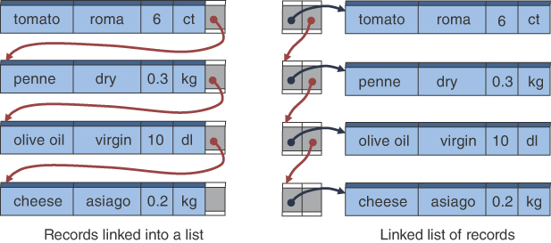

图 5-1 在链表中表示Linked的不同方法
在第一种方法中，记录被Linked到一个链表中，如图 5-1 左侧所示，每个记录在右侧都有一个名为 next 的字段。链表中的最后一条记录没有下一个Linked，因此该字段必须获得一些特殊值，不能与对另一条记录的引用混淆。该图将其显示为一个空框。在 Python 中，你通常使用 None 来表示没有Linked。在 Java 中，你使用 null。对于除最后一条记录之外的所有记录，下一个字段都引用了另一条Linked记录，在图中用弯曲的箭头表示。
第二种方法使用单独的双字段记录来表示每个Linked。每个Linked记录的第一个字段是对成分记录的引用，第二个字段是对下一个Linked记录的引用。这些不同类型的引用在图 5-1 中显示为不同颜色的箭头。这种方法的一个优点是链表中使用的记录不需要有自己的下一个Linked；该信息存储在两字段Linked记录中。也有缺点：你必须按照Linked记录的引用才能到达成分（数据）记录，并且此方法使用更多内存来存储完整链表。这些缺点通常并不显着。右侧显示的记录Linked链表的另一个优点是单个记录可以是多个链表的一部分；在Linked到链表方法的记录中（图中左侧），它们在任何时间点只能是一个链表的一部分。
无论使用哪种表示Linked的方法，最好为链表本身创建一个单独的对象类。这样做允许创建空链表——一种可以修改以扩展和收缩为空的数据结构——并使 Python 中的 len() 和 str() 等实用函数能够应用于对象实例。我们选择使用 LinkedList 类来表示整个链表。唯一要存储在 LinkedList 对象中的是对第一个 Link 对象的引用。我们还可以存储整个链表的其他属性，比如它的长度，我们稍后会检查该主题。
让我们看一下实现记录链表的类 Link 和 LinkedList 的 Python 定义。每个Linked都有两个字段：一个用于数据，一个用于下一个Linked。 LinkedList 只需要一个属性，我们将其命名为 \_\_first 因为它指向链表的第一个 Link 对象（如果有的话）。像往常一样，我们使用双下划线前缀来表示这些是私有字段。清单 5-1 显示了定义的构造函数部分以及基本测试，以查看它们是空的还是链表中的最后一个Linked。
清单 5-1 链表类的构造函数和测试

```python
class Link(object):  # One datum in a linked list
    def __init__(self, data, next=None):  # Constructor
        self.__data = data  # The datum for this link
        self.__next = next  # Reference to next Link

    def isLast():  # Test if link is last in the chain
        return self.__next is None  # True if & only if no next Link


class LinkedList(object):  # A linked list of data elements
    def __init__(self):  # Constructor
        self.__first = None  # Reference to first Link

    def isEmpty():  # Test for empty list
        return self.__first is None  # True if & only if no 1st Link
```

isLast() 和 isEmpty() 的测试几乎相同。不同之处在于它们在它们所代表的事物的上下文中的含义——分别是链中的一个环节或整个链。
因为它们是在 Python 中定义的，所以你不必在类中指定属性的数据类型，但它们很重要。在像 Java 这样的静态类型语言中，每个属性都需要声明其类型。这对于 LinkedList 类的 \_\_first 属性来说很简单，因为它是一个 Link 对象或 None。在 Link 类中，用于 \_\_next 属性的类型更为复杂。在这里你需要引用你正在定义的类。这种类定义有时称为自引用，因为它包含与自身类型相同的属性。
更准确地说，你不想在 Link 类的 \_\_next 属性中存储另一个完整的 Link 对象。如果你这样做了，那么自指定义真的会变成一个无穷无尽的嵌套娃娃。我们将在下一章"递归"中重新讨论该概念，但在此之前，我们需要检查引用是如何存储和管理的。
指定数据类型的原因之一是可以计算对象的总内存大小。类型信息告诉编译器在创建对象的新实例时分配多少字节。如果自引用类定义要包含它们自己，它们似乎需要无限量的内存。相反，它们存储对对象的引用。引用通常是通过将对象的地址存储在内存中来实现的。这样，属性所需的内存量是固定大小，因为存在最大内存地址。
引用就像图 5-1 中的箭头一样，是一条查找引用对象的路径。在某些语言中，这些被称为指针，在引用或指针之后被称为解引用。内存地址、指针和引用之间存在一些区别，但我们不在这里讨论这些细微之处。重要的概念是Linked记录通过引用连接成一个链，必须遵循这些引用才能遍历整个结构。将其与数组的所有元素在内存中彼此相邻放置的数组进行比较，以便你可以使用整数索引找到它们中的任何一个。

### 引用和基本类型

你很容易对链表上下文中的引用感到困惑。 Python 中的动态类型会加剧混淆，这意味着你直到运行时才知道变量引用的值的类型。让我们回顾一下引用是如何工作的。
每种编程语言都有一组基本数据类型，有时称为原始数据类型或原语。这些数据类型都有已知的、固定的大小，通常最多占用一两个"机器字"。整数和布尔值是几乎所有编程语言中的基本数据类型。当然，布尔值只有两个可能的值，整数的范围取决于机器字中的位数（有些语言提供了指定比标准机器字更小或更大范围的方法）。根据机器字的大小，浮点数通常也以固定位数存储。
更复杂的数据类型，如数组、字符串、记录和用户定义的类，通常需要超过一两个机器字的存储空间。对于这些结构，编程语言通常会在为此类项目预留的内存部分中为结构的大小分配内存。当结构在函数之间传递时，不是复制整个结构，而是只传递对结构的引用。即使对象不会被传递给其他函数，编程语言仍然可以使用引用和单独的数据存储位置来实现对象。作为引用在函数之间传递的数据类型通常称为引用数据类型。它们不同于基本数据类型。
在 Python 中，哪些数据存储为原始类型，哪些数据存储为引用类型并不明显。在其他语言中，程序员必须明确声明变量应该存储为原始数据类型还是存储为对其他数据类型的引用。这就是 Python 作为第一门编程语言和易于使用的语言而广受欢迎的原因之一。程序员不需要显式管理引用。当你编写实现数据结构的代码时，引用和取消引用就成为一个更重要的问题，因为你关心的是执行操作需要多长时间、需要多少空间以及有时数据存储在哪里。
要查看数据是否作为引用而不是通过复制其值来传递，一种快速测试是将其传递给修改值的函数。例如，考虑这个小的 Python 程序：

```python
def increment(a, b):
    a += 1
    b[0] += 1

x = 1
y = [1]
increment(x, y)
print(x, y)
```

程序会打印什么？变量 x 的值被初始化为 1，变量 y 的值是一个包含 1 的单元素链表/数组。当调用 increment() 时，它会递增 a 的值和 b 的第一个元素。这会改变变量 x 和 y 的值吗？你认为它会打印 1 [1] 吗？或者也许 2 [2]？答案并不明显。
对于 x，答案是否定的；它的值没有改变。 print() 函数将为 x 打印值 1，因为在运行 increment() 时，a 变量存储了 1 的副本，而不是存储在 x 中的完全相同的 1。当将 1 加到 a 的值时，得到的 2 被存储回 a 并且没有改变存储在 x 中的副本。
然而，在 y 的情况下，答案是不同的。 y 的值是一个 Python 链表。 increment() 运行后，y 的打印值为 [2]。 Python 将链表作为引用传递。 increment() 函数对链表的任何更改都会影响调用者环境中的值，因为函数和调用环境共享被引用的对象。
这种解释过度简化了 Python 在幕后真正做的事情。事实上，所有 Python 变量都是对内存片段的引用，Python 通过引用传递所有参数。它创建新的引用以分配给普通参数目标，例如 increment() 的变量，而不更改旧引用。结果是，你可以将此机制视为好像参数已收到它们自己的简单不可变类型（如 int、float 和 bool）值的副本。
为什么传递参数如此复杂？简短的回答是，在不同的情况下，你需要不同的行为。当数据很小时，对数据副本的操作很快。它允许你在不同的功能中拥有不同的上下文，而不会相互干扰。它使理解函数中会发生什么变得更容易，因为除了函数本身中的指令之外，没有任何东西可以更改其变量的值。在其他情况下，直接覆盖现有数据会更快，尤其是当它非常大并且复制它会花费很多时间时。然而，当程序员忘记某些函数可以通过引用修改数据时，共享数据结构确实会导致许多错误（错误）。作为一般规则，你希望避免更改（或变异）引用共享的数据中的值的设计。当你设计代码以更改值时，请确保对可能发生的更改进行了详细记录。
回到链表，我们需要使用引用将元素Linked在一起。这种方法解决了自引用数据结构悖论，并允许使用随着程序运行而增长和收缩的数据结构。你可以根据需要添加 Link 对象，而不是在程序开始时尝试估计需要多少个，然后在数组或其他结构中为所有对象分配空间。
使用引用时，你可以将它们视为自己的数据类型。它们不是整数，尽管大多数语言在内部将它们实现为一种数字。你不能对它们进行操作，例如将两个引用加在一起或检查哪个更大。通常，它们没有预定义值（例如布尔类型的 False 和 True）。有一些特殊情况，如 Java 中的常量 null，表示没有引用。你可以执行的一项操作是检查两个引用是否指向完全相同的对象。在 Python 中，你可以使用 is 运算符比较引用。让我们看一些例子：

```python
$ python3
>>> x = 10
>>> lx = [10]
>>> ly = [5 + 5]
>>> print(x, lx, ly)
10 [10] [10]
>>> x is lx
False
>>> lx is lx
True
>>> lx is ly
False
>>> lx == ly
True
>>> lx[0] is ly[0]
True
>>>
```

前面的记录显示将整数 10 存储在变量 x 和两个不同的单元素链表 lx 和 ly 中。在 ly 的例子中，10 是 5 和 5 相加的结果。print 函数确认了这些值。然后程序尝试使用 is 运算符比较变量。如你所料，x 和 lx 不引用同一个对象；一个是整数，另一个是链表。毫不奇怪，lx 和 lx 指的是同一个对象，因为它们是同一个对象。更有趣的是 lx 和 ly 显示为不同的对象，因为 lx ly 的计算结果为 False。当你使用相等运算符比较它们时，你会发现 lx == ly 为 True。 Python 的相等运算符跟随引用并比较它们引用的值。因为它找到一个单元素链表存储在两者中，并且两个链表中的元素相等（均为 10），所以结果为 True。相比之下，is 运算符不遵循引用；它只是检查引用是否相同。
如果你查看数据是如何使用引用存储在内存中的，is 和 == 的行为就会变得更加清晰。图 5-2 显示了赋值语句完成后 Python 解释器内存的简化表示。三个变量中的每一个都带有一个箭头，指向其存储在计算机内存中的值。图中似乎有值 10 的三个副本——尽管正如我们在下面解释的那样，实际上只有一个 10 的副本。链表结构有两个副本。 is 运算符比较箭头指向的位置，当且仅当它们相同时才返回 True。 == 运算符沿着箭头移动并比较每对元素，在第一对不相等时返回 False，否则返回 True。

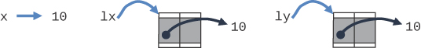

图 5-2 比较引用数据类型中的值
前面记录的最后一行使用 is 运算符比较 lx 和 ly 链表的第一个元素。 它们都是 10，因此运算符说它们是同一个对象似乎并不奇怪。 使用 is 运算符将具有相同值的两个原始数据类型比较为相同似乎是合理的。 但是要小心，因为这是 Python 中的特例。 小整数在 Python 中使用完全相同的引用存储，但大整数可能不会。 例如：

```python
>>> A = 650
>>> A == A
True
>>> A is A
True
>>> 2 ** A == 2 ** A
True
>>> 2**A is 2**A
False
>>>
```

为安全起见，应使用相等运算符 == 比较所有大小的整数的数值相等性。但是，当使用 is 运算符时，比较是在为表示那些大整数而创建的对象上进行的，Python 可能会根据需要单独创建这些大整数对象。大整数不适合一两个机器字。这意味着使用箭头指向整数或其他类型是很棘手的，如图 5-2 所示。看似简单的原语可能是更复杂的结构。

### 关系，而非位置

让我们检查一下链表与数组不同的主要方式之一。在一个数组中，每个项目占据一个特定的位置。可以使用索引号直接访问该位置。这就像一排有连续地址的房子：你可以使用它的数字地址找到一个特定的房子。如果房屋之间的间距相等，并且编号序列之间的间距也相等，则你可以确切地知道从该行中的第一座房屋到特定编号的房屋要走多远。
在链表中，找到特定元素的唯一方法是沿着元素链进行查找。你必须访问每个第一个元素才能找到你想要的元素。有两种方法可以让你知道你想要哪个元素：通过它的位置或通过一些键。知道它的位置的一个例子就像说，"这是左边的第五宫。"你不知道这条街到底有多远，但你可以边走边数房子，数到五后左转。通过钥匙了解一所房子的一个例子是给出一个区别于其他房子的描述，例如，有绿色门的石屋。
另一个通过关键了解事物的例子是通过他们的面孔或名字来描述某人。想象一下，你正在参加一个有数百人的大型聚会。 Zev，你正在寻找你认为正在参加的熟人。也许你问 Raj Zev 在哪里。 Raj 不知道，但他认为 Anna 可能知道，所以你去问 Anna。安娜看到泽夫和迪米特里一起出去了。你碰巧有 Dimitri 的电话号码，所以你给他打电话。他回答说 Zev 几分钟前回到里面，说他正在寻找 Aoife。所以，你开始寻找，……你明白了。当你沿着链条开始时，你甚至不知道你要找的东西是否会在那里。
这些类型的链也发生在计算机应用程序中。如果你试图追踪一条消息通过网络的路径，你可以从消息结束（或开始）的节点开始，并找到一条指示消息来自（或去往）何处的记录。然后你访问该节点并查找显示消息来源（目的地）的下一条记录。你必须点击所有单独的链接以重建消息的完整路径。这些类型的系统都有一个共同点，那就是你不能直接访问数据项；你必须使用项目之间的关系来定位特定项目。你从第一项开始，转到第二项，然后是第三项，直到找到你要找的东西，或者关系结束。

## 链表可视化工具
让我们更详细地了解如何在链表数据结构中建立链接。 链表可视化工具展示了所有的基本操作。 你可以按照附录 A"运行可视化"中的说明使用命令 python3 LinkedList.py 启动它。 图 5-3 显示了 LinkedList Visualization 工具启动时的外观。 最初，链表是空的，只有一个小的红色圆圈保留用于第一个链接引用的位置。 该框表示具有一个属性的 LinkedList 对象的一个实例，如清单 5-1 中所述。

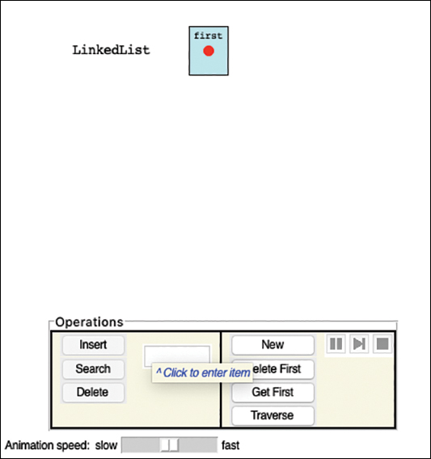

图 5-3 具有空链表的 LinkedList 可视化工具
要创建第一个链接对象，你可以在文本输入区域中键入一个词并选择"插入"按钮。该操作创建了一个包含单词的彩色矩形，该单词表示 Link 对象及其数据。该链接是链表中的唯一链接，因此它的指针为 None，用红点表示。 LinkedList 对象现在具有对存储在其第一个属性中的 Link 的引用。
使用 Insert 按钮插入几个单词可以创建如图 5-4 所示的购物清单。除最后一个链接外，每个链接都引用下一个链接。 （顶部的小链接箭头是刚刚完成的插入操作遗留下来的。）

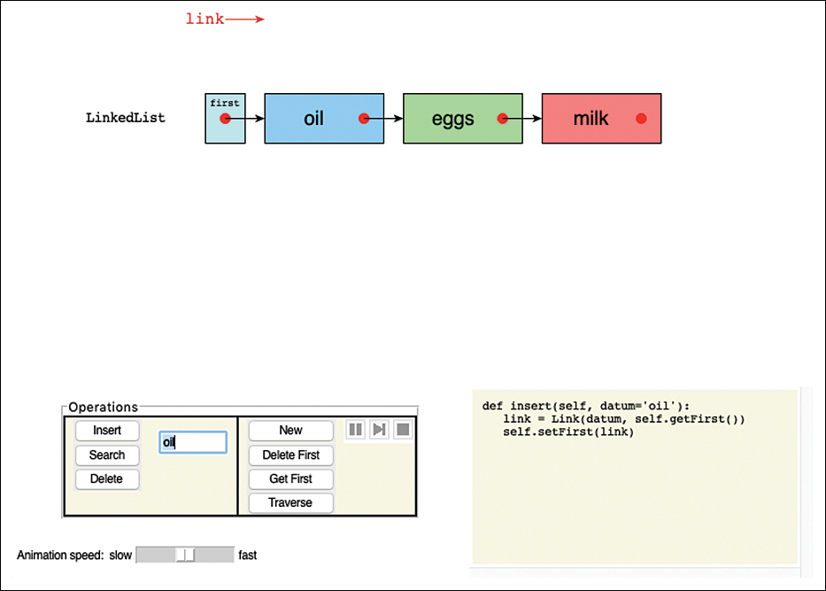

图 5-4 插入一些项目后的链表
插入项目时，请仔细观看动画。新链接开始于链表之外。它的 next 指针指向链表中的第一项（或者当 LinkedList 为空时什么也没有）。通过将 LinkedList 的第一个指针更改为指向新的 Link 来进行插入。可视化工具然后重新排列链接的项目以形成熟悉的链状结构。当工具重新排列项目时，内存中的数据结构没有发生变化；这只会让结构更容易在可视化中看到。
在这个版本的链表中，新链接总是插入到链表的开头。这是最简单的方法，尽管有时有些操作需要将项目放置在基本链表的其他地方，如我们稍后所示。

### 搜索按钮

"搜索"按钮允许你查找具有指定键值的链接。键入现有链接的值（或单击它）并选择搜索。该操作首先在第一个链接处放置一个链接指针。链接指针向下移动链接，直到它指向一个链接，该链接的键与你输入的目标键匹配。对象被突出显示，数据被复制到输出框。如果你搜索不在链表中的键，链接指针会前进到链表中的最后一个链接并最终指向任何内容（无）。底部的消息通知你是否找到了密钥。

### 删除按钮

你还可以删除具有指定键的链接。输入现有链接的值，然后选择删除。这一次，两个箭头出现并沿着链表移动，有点像尺蠖，寻找目标链接。当链接箭头到达带有目标键的链接时，前进停止，前一个链接的指针重新连接到目标链接的后继链接。更新前一个指针后，目标链接不再在链表中并被移走。如果未找到目标链接，则动画会异常停止。
可视化工具在显示屏上四处移动链接，有时会拉伸和弯曲指针的箭头。可视化箭头的长度和形状与程序中的任何内容都不对应。它们仅用于显示哪些对象引用了其他对象。

### 新建按钮

与其他数据结构一样，你可以通过选择"新建"按钮来创建一个新的空链表。与其他结构不同，你不需要为结构指定大小。链表不是基于数组；根据需要分配和丢弃链接。

### 其他按钮

Delete First 按钮删除链表中的第一个链接，而不考虑其键。这有点像你在数组中看到的 Delete Rightmost 操作。 Get First 按钮获取存储在第一个链接中的数据值，Traverse 按钮遍历链表中的所有链接，将它们的值复制到输出框中。

## 简单链表
让我们看看在 Python 的 Link 和 LinkedList 类中实现基本操作所需的方法。
我们扩展了清单 5-1 中所示的构造函数和简单测试，添加了访问组件的方法，并添加了一个辅助方法以将 Link 显示为清单 5-2 中的字符串。此清单介绍了 getData() 和 setData() 方法来访问存储在 Link 中的数据。另一种选择是使 \_\_data 属性（或字段）成为调用程序可以设置的 Link 类的公共属性。这将允许直接访问实例属性，这在某些情况下可能是不希望的，例如对可以添加的数据类型强制执行某些约束。 setNext() 方法通过强制将 \_\_next 属性设置为仅对 Link 对象的引用或特殊的"无下一个"值 None 来说明约束的概念。此清单保留了 isLast() 方法，该方法定义了约定，即 \_\_next 字段中的值为 None 意味着没有后续链接。最后，清单定义了一个 \_\_str\_\_() 方法，用于将链接显示为字符串。它只是将字符串转换过程应用于链接中存储的任何数据。
清单 5-2 链接对象的基本方法

```python
class Link(object):  # One datum in a linked list
    def __init__(self, datum, next=None):  # Constructor
        self.__data = datum  # The datum for this link
        self.__next = next  # Reference to next Link

    def getData(self):  # Return the datum stored in this link
        return self.__data

    def setData(self, datum):  # Change the datum in this Link
        self.__data = datum

    def getNext(self):
        return self.__next  # Return the next link

    def setNext(self, link):  # Change the next link to a new Link
        if link is None or isinstance(link, Link):  # Must be Link or None
            self.__next = link
        else:
            raise Exception("Next link must be Link or None")

    def isLast(self):  # Test if link is last in the chain
        return self.getNext() is None  # True if & only if no next Link

    def __str__(self):  # Make a string representation of link
        return str(self.getData())
```

### 基本链表方法

在清单 5-3 中，LinkedList 类使用相同类型的访问器方法更新了它的一个属性 \_\_first。除了第一个链接的 get 和 set 方法外，它还将 getNext() 和 setNext() 方法定义为同义词，它们的实用性稍后会出现。新方法 first() 返回链表中的第一项。它类似于队列的 peek() 方法。如果链表为空，它会引发异常。请注意，为了获取数据，它取消引用 \_\_next 属性以获取链接，然后使用它来获取该链接的数据。这是对链表的常见操作。
清单 5-3 LinkedList 对象的基本方法

```python
class LinkedList(object):  # A linked list of data elements
    def __init__(self):  # Constructor
        self.__first = None  # Reference to first Link

    def getFirst(self):
        return self.__first  # Return the first link

    def setFirst(self, link):  # Change the first link to a new Link
        if link is None or isinstance(link, Link):  # It must be None or
            self.__first = link  # a Link object
        else:
            raise Exception("First link must be Link or None")

    def getNext(self):
        return self.getFirst()  # First link is next

    def setNext(self, link):
        self.setFirst(link)  # First link is next

    def isEmpty(self):  # Test for empty list
        return self.getFirst() is None  # True iff no first Link

    def first(self):  # Return the first item in the list
        if self.isEmpty():  # as long as it is not empty
            raise Exception("No first item in empty list")
        return self.getFirst().getData()  # Return data item (not Link)
```

### 遍历链表

要使链表有用，你需要能够插入、删除、搜索和遍历它所持有的元素。遍历可能是最简单的并且是辅助方法的本质，例如获取链表的长度或创建其内容的字符串表示。清单 5-4 显示了遍历方法。
清单 5-4 LinkedList 的遍历方法

```python
class LinkedList(object):  # A linked list of data elements
… (basic definitions shown before) …

    def traverse(
        self, func=print
    ):  # Apply a function to all items in list with the default being to print
        link = self.getFirst()  # Start with first link
        while link is not None:  # Keep going until no more links
            func(link.getData())  # Apply the function to the item
            link = link.getNext()  # Move on to next link

    def __len__(self):  # Get length of list
        l = 0
        link = self.getFirst()  # Start with first link
        while link is not None:  # Keep going until no more links
            l += 1  # Count Link in chain
            link = link.getNext()  # Move on to next link
        return l

    def __str__(self):  # Build a string representation
        result = "["  # Enclose list in square brackets
        link = self.getFirst()  # Start with first link
        while link is not None:  # Keep going until no more links
            if len(result) > 1:  # After first link,
                result += " > "  # separate links with right arrowhead
            result += str(link)  # Append string version of link
            link = link.getNext()  # Move on to next link
        return result + "]"  # Close with square bracket
```

traverse() 方法对链表的每个元素应用一个函数。它首先设置一个链接变量以指向 LinkedList 中的第一个链接。这是对对象的引用。只要下一个链接不是 None，while 循环就会遍历链表，这表示链表的末尾。如果有一个 Link 对象，它会将所需的功能（默认为打印）应用于其中的数据，然后转到该 Link 的下一个引用。请注意，循环可以使用 isLast() 方法来检测链表的末尾。因为该方法仍然需要将函数应用到最后一个链接，所以通过测试链接变量来编写循环会更短。
\_\_len\_\_() 方法（它使 Python 的 len() 函数能够处理 LinkedList 对象）遵循与遍历相同的大纲。它将链表的长度保存在变量 l 中，并在 while 循环体中递增该值。当它设置到每个后续 Link 对象的链接时，对象数量的计数增加 1。当没有更多的 Link 对象时，它返回存储在 l 中的计数。
类似地，\_\_str\_\_() 方法用左括号初始化一个名为 result 的字符串变量。 while 循环是一样的。在每次通过循环体时，如果 Link 对象不是第一个，则会添加一个分隔符字符串">"。然后将 Link 的字符串表示形式添加到结果中。在链表的末尾，最后一个右括号被添加到结果中，并被返回。

### 在链接链表中插入和搜索

在链表中查找具有匹配键的项目时，插入和搜索方法使用类似的循环，如清单 5-5 所示。要处理链表中的复杂数据，使用函数从每个链接的数据项中提取键会很方便。该代码使用 identity() 作为默认函数来获取链表中每个元素的键。
清单 5-5 LinkedList 的插入和搜索方法

```python
def identity(x):
    return x  # Identity function


class LinkedList(object):  # A linked list of data elements
… (other definitions shown before) …

    def insert(self, datum):  # Insert a new datum at start of list
        link = Link(
            datum, self.getFirst()  # Make a new Link for the datum
        )  # What follows is the current list
        self.setFirst(link)  # Update list to include new Link

    def find(self, goal, key=identity):  # Find the 1st Link whose key matches the goal
        link = self.getFirst()  # Start at first link
        while link is not None:  # Search until the end of the list
            if key(link.getData()) == goal:  # Does this Link match?
                return link  # If so, return the Link itself
            link = link.getNext()  # Else, continue on along list

    def search(self, goal, key=identity):  # Find 1st item whose key matches goal
        link = self.find(goal, key)  # Look for Link object that matches
        if link is not None:  # If found,
            return link.getData()  # return its datum

    def insertAfter(
        self, goal, newDatum, key=identity
    ):  # Insert a new datum after the first. Link with a matching key
        link = self.find(goal, key)  # Find matching Link object
        if link is None:  # If not found,
            return False  # return failure
        newLink = Link(  # Else build a new Link node with
            newDatum, link.getNext()
        )  # new datum and remainder of list
        link.setNext(newLink)  # and insert after matching link
        return True
```

要在链表中插入值，最简单的做法是将它们插入链表的前面。 就像将值压入堆栈一样，该值将成为链表的第一项（在第一个链接中）。 insert() 方法通过创建一个新的 Link 对象来做到这一点，该对象的数据设置为要插入的数据。 有趣但可能令人困惑的步骤是初始化新 Link 对象的 \_\_next 指针。 它被设置为 LinkedList 的第一个指针的值。 原因是原始 LinkedList 具有所有将在新创建的 Link 之后出现的元素。 最后一步是覆盖 LinkedList 的 \_\_first 指针，使其指向新创建的 Link。 处理步骤如图 5-5 所示。

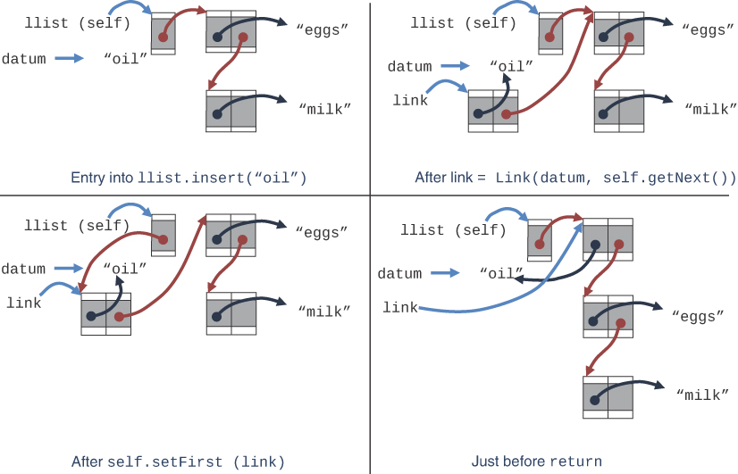

图 5-5 insert() 的执行
图 5-5 中的示例显示了将成分"油"添加到已经包含"鸡蛋"和"牛奶"的链表中。第一个面板显示了进入 insert("oil") 时方法参数的状态。 self 变量是要修改的 LinkedList，在本例中为 llist。 LinkedList 对象有一个字段 \_\_first，它指向链表中的第一个 Link。第一个链接是"鸡蛋"链接，然后是"牛奶"链接。第二个面板显示了存储在链接变量中的新链接对象的创建。数据设置为输入数据，\_\_next 指针设置为原始 LinkedList 的 \_\_first 值。第三个面板显示了原始 LinkedList 的 \_\_first 指针如何设置为新创建的 Link。最后一个面板显示了从调用 insert() 返回之前的状态，"oil"的链接清楚地位于链表的前面，这是第三个面板中链接结构的简单重新排列。
图 5-5 中的示例也可以在 LinkedList 可视化工具中进行动画处理。该图比可视化更详细地说明了所有变量的状态。该图还显示了通过每个链接的指针引用的字符串数据项。字符串引用在计算机中使用，但在代码中很难看到。尝试在链表中插入相同的项目，并使用步进按钮逐步执行其中一个插入代码的每一行。
如果对链表的插入和删除只能发生在链表的第一个位置，那么数据结构的行为就像一个堆栈，最后放入的元素总是第一个取出的元素。为了能够执行诸如在有序链表中的特定位置插入元素之类的操作，你需要能够在链表中指定和查找应进行更改的位置。为此，你需要找到具有特定键的元素，这就是 find() 方法所做的。
就像遍历操作一样，find() 方法遍历链表的链接。对于每个链接，清单 5-5 中所示的 find() 方法将 key() 函数应用于存储在那里的数据。如果提取的键的值与目标键匹配，则返回包含该键的链接。如果 while 循环结束，则没有一个 Links 有匹配的键，结果为 None（因为当函数体结束时 Python 返回一个隐式的 None）。重要的是要注意 find() 总是返回一个 Link（实际上是对 Link 的引用）或 None。它不会像数组的 find() 方法那样返回链表中链接所在位置的整数索引。为什么不？如果是这样，那么在该位置插入或删除链接的后续操作将不得不重复遍历链接以找到正确的位置。返回引用可以节省很多步骤。
要获取存储在具有特定键的链接处的数据，你可以使用 search() 方法。此方法采用与 find() 方法相同的参数，但返回链接中的数据而不是对链接的引用。这种细微的差别非常重要。有些操作需要一个位置，有些需要位置上的数据。 search() 方法简单地调用 find() 方法，如果它返回一个指向 Link 的指针，它会取消引用该指针以获取值。否则，它也返回 None。
清单 5-5 中的下一个方法 insertAfter() 提供了一种方法，可以在链表中具有与特定目标键匹配的键的第一个 Link 之后立即插入一个新数据。它使用 find() 方法来发现是否存在具有匹配键的链接。如果未找到，则返回 False 以表明这一点。否则，它会在具有匹配键的链接之后创建一个新链接以拼接到链表中。
就像 insert() 方法一样，insertAfter() 的新链接包含提供的数据，并且它的 \_\_next 指针设置为应该跟随的内容。 在这种情况下，链接链表跟在具有匹配键的 Link 之后，如图 5-6 所示。 该图显示了相同的数据"oil"被插入到链表中，但这次它被插入在"eggs"之后。 链接变量存储 find() 调用的输出。 newLink 是在第三个面板中创建的，其数据为"oil"，"eggs"链接之后的链表如下所示。 在插入链接的 \_\_next 指针更新为指向 newLink 之后，链接链表将更改为第四个面板中显示的最终形式。 该例程返回 True 以指示它找到了目标键并插入了新链接。 请注意，图中右下角的链接已重新排列，以更好地显示新的链表结构。

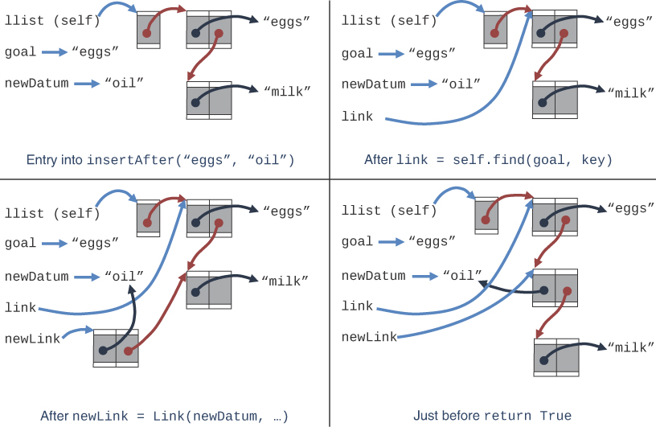

图 5-6 在链表中的"eggs"之后插入"oil"
链表中的删除

基本 LinkedList 结构所需的最后一个方法是用于删除的方法。删除第一项是另一个快速操作，只需更改几个指针。从中间删除意味着通过它的键找到一个项目。
清单 5-6 中所示的 deleteFirst() 方法在检查链表不为空后删除链表中的第一个链接。代码中的步骤几乎与 insert() 方法的步骤一样简单。它在第一个变量中存储指向第一个链接的指针。在从链表中删除该链接后，这对于保留对存储在那里的数据的访问是必要的。第二步通过更改 LinkedList 的 \_\_first 属性以指向第一个链接之后的链接来执行实际删除。第一个链接现在断开连接，即使它的 \_\_next 指针指向链表的其余部分。最后一步是从第一个链接返回数据。
当你需要从链表中的其他地方删除时， delete() 方法会删除具有匹配目标键的项目。与 insertAfter() 和 search() 方法一样，你首先确定应该进行删除的链接，然后更改指针。虽然你可以使用 find() 方法来识别要删除的链接，但清单 5-6 中显示的代码不会这样做。你认为这是为什么？
清单 5-6 LinkedLists 的 deleteFirst() 和 delete() 方法

```python
class LinkedList(object):  # A linked list of data elements
… (other definitions shown before) …

    def deleteFirst(self):  # Delete first Link
        if self.isEmpty():  # Empty list? Raise an exception
            raise Exception("Cannot delete first of empty list")

        first = self.getFirst()  # Store first Link
        self.setFirst(first.getNext())  # Remove first link from list
        return first.getData()  # Return first Link's data

    def delete(
        self, goal, key=identity  # Delete the first Link from the
    ):  # list whose key matches the goal
        if self.isEmpty():  # Empty list? Raise an exception
            raise Exception("Cannot delete from empty linked list")

        previous = self  # Link or LinkedList before Link
        while previous.getNext() is not None:  # to be deleted
            link = previous.getNext()  # Next link after previous
            if goal == key(link.getData()):  # If next Link matches,
                previous.setNext(  # change the previous' next
                    link.getNext()
                )  # to be Link's next and return
                return link.getData()  # data since match was found
            previous = link  # Advance previous to next Link

        # Since loop ended without finding item, raise exception
        raise Exception("No item with matching key found in list")

```

不使用 find() 方法的原因是 delete() 必须识别要删除的链接之前的链接，而不是具有匹配键的链接本身。通过找到前面的链接，它可以修改该链接的 \_\_next 指针以缩短链表并删除所需的链接。这意味着该方法使用一种不同类型的 while 循环，它更新一个名为 previous 的指针，该指针指向目标键之前的链接（如果存在）。在检查空链表条件并在发现异常时引发异常后，delete() 方法将 previous 设置为指向输入 LinkedList (self)，而不是链中的第一个 Link。如果要删除的链接是链表中的第一个链接，则这是必需的。让我们从具体的案例开始。
前面的变量初始指向self，也就是要修改的LinkedList。在调用 delete() 方法时，目标键与链表中的第一个 Link 匹配，while 循环通过首先检查 previous 之后的下一个 Link 是否存在来进入。它通过调用 getNext() 进行检查。这就解释了为什么 getNext() 被定义为 getFirst() 的同义词；你想像对待后面的链接中的所有其他下一个指针一样对待 LinkedList 的第一个指针。
delete() 方法的循环将链接变量设置为指向前面的链接，这是链表的第一个链接。当循环体检查第一个 Link 的键时，它在第一种情况下匹配目标，所以现在该方法可以执行删除。之前的变量仍然指向 self，即要修改的 LinkedList。通过使用 setNext() 设置上一个链接的下一个链接，delete() 方法修改输入 LinkedList 的 \_\_first 链接。这是清单 5-3 中定义的另一个同义词方法，因此你可以应用 setNext() 来根据需要修改 \_\_first 属性或 \_\_next 属性。它将 \_\_first 设置为键与目标匹配的链接之后的链接。这意味着具有匹配键的链接已从链表中删除。然后该方法可以返回链接的数据，因为它找到了要删除的链接。
要检查的第二种情况是当链表中的第一个链接与要删除的目标键不匹配时会发生什么。图 5-7 说明了这两种情况，显示了在调用 previous.setNext() 之前 previous 指向的位置。 previous 和 link 变量在第二种情况下开始时相同，但这次，第一个 Link 的键与目标不匹配。它跳过内部 if 语句的主体并将 previous 设置为 link 的值，即链表中的下一个 Link。现在 previous 是链表中的第一个 Link，while 循环检查它之后是否还有其他 Links。如果有更多，则将链接变量分配给下一个，并根据目标检查其键。当 link 的键匹配时，previous 变量将指向紧接在 link 之前的 Link。 if 语句的主体以与链表中的第一个链接相同的方式删除目标链接，这要归功于 setNext() 方法适用于 LinkedLists 和 Links。

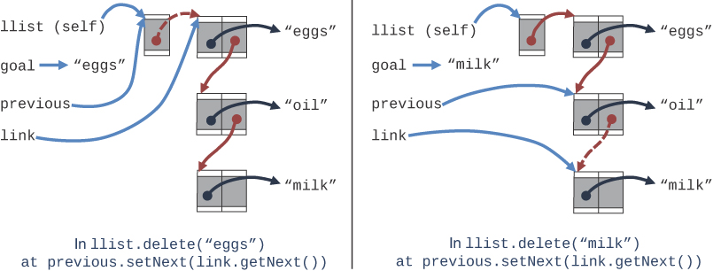

图 5-7 从 LinkedList 中删除一个 Link 的两个例子
在我们讨论的第一种情况下，previous 指向一个 LinkedList 类型的对象，在第二种情况下它指向一个 Link 对象。 我们将这两个类都设计为具有 getNext() 和 setNext() 方法，以使 delete() 中的这种 while 循环更易于编写。 这是面向对象编程中多态性的一个例子——相同的操作可以在不同的对象类型上执行，每种类型（类）都有自己的实现。 这个想法是在两个类中以相同的方式处理 \_\_first 和 \_\_next 指针。 即将设置的参考如图 5-7 中的虚线箭头所示。
## 双端链表
双端链表类似于普通链表，但它有一个附加功能：对 \_\_last 链接和第一个链接的引用。 图 5-8 显示了这样一个链表。

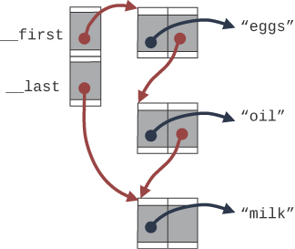

对 \_\_last 链接的引用允许在链表的末尾和开头直接插入新链接。 当然，你可以通过遍历整个链表直到到达末尾，在普通单端链表的末尾插入一个新链接。 然而，当链表很长时，这种方法变得非常低效。
快速访问链表的末尾和开头使得双端链表适用于单端链表无法有效处理的某些情况。 一种这样的情况是实现队列； 我们将在下一节展示这项技术的工作原理。 这个好处有一个很小的代价——保持指向另一端的指针——如清单 5-7 所示。
清单 5-7 DoubleEndedList 类

```python
from LinkedList import *


class DoubleEndedList(LinkedList):  # A linked list with access to both
    def __init__(self):  # ends of the list
        self.__first = None  # Reference to first Link, if any
        self.__last = None  # Reference to last link, if any

    def getFirst(self):
        return self.__first  # Return the first link

    def setFirst(self, link):  # Change the first link to a new Link
        if link is None or isinstance(link, Link):  # Must be Link or None
            self.__first = link  # Update first link
            if (
                link is None
                or self.getLast() is None  # When removing the first Link or
            ):  # the last Link is not set,
                self.__last = link  # then update the last link, too.
        else:
            raise Exception("First link must be Link or None")

    def getLast(self):
        return self.__last  # Return the last link

    def last(self):  # Return the last item in the list
        if self.isEmpty():  # as long as it is not empty
            raise Exception("No last element in empty list")
        return self.__last.getData()

    def insertLast(self, datum):  # Insert a new datum at end of list
        if self.isEmpty():  # For empty lists, end is the front,
            return self.insert(datum)  # so insert there
        link = Link(datum, None)  # Else make a new end Link with datum
        self.__last.setNext(link)  # Add new Link after current last
        self.__last = link  # Change last to new end Link

    def insertAfter(  # Insert a new datum after the 1st
        self, goal, newDatum, key=identity  # Link with a matching key
    ):
        link = self.find(goal, key)  # Find matching Link object
        if link is None:  # If not found,
            return False  # return failure
        newLink = Link(  # Else build a new Link node with
            newDatum, link.getNext()
        )  # new datum and remainder of list
        link.setNext(newLink)  # and insert after matching link
        if link is self.__last:  # If the update was after the last,
            self.__last = newLink  # then update reference to last
        return True

    def delete(
        self, goal, key=identity  # Delete the first Link from the
    ):  # list whose key matches the goal
        if self.isEmpty():  # Empty list? Raise an exception
            raise Exception("Cannot delete from empty linked list")

        previous = self  # Link or LinkedList before Link
        while previous.getNext() is not None:  # to be deleted
            link = previous.getNext()  # Next link after previous
            if goal == key(link.getData()):  # If next Link matches,
                if link is self.__last:  # and if it was the last Link,
                    self.__last = previous  # then move last back 1
                previous.setNext(  # Change the previous' next
                    link.getNext()
                )  # to be Link's next and return
                return link.getData()  # data since match was found
            previous = link  # Advance previous to next Link

        # Since loop ended without finding item exception
        raise Exception("No item with matching key found in list")
```

我们选择通过创建我们一直在研究的 LinkedList 的子类来实现双端链表。这是在类语句中完成的，它显示了 DoubleEndedList 继承了 LinkedList 的定义。这意味着我们只需要重新定义与父类或"超"类中使用的方法不同的方法。构造函数 \_\_init\_\_() 的不同之处仅在于它将 \_\_last 指针设置为最初为空，就像 \_\_first 指针一样。
清单 5-7 中的下一个定义是链表第一个链接的访问器方法。如果仔细观察，你会注意到 getFirst() 方法与父类 LinkedList 中的定义相同。这看起来很奇怪，因为子类只需要重新定义已从其超类中的定义更改的方法。重新定义它的原因是 Python 有一种特殊的方式来处理像 \_\_first 和 \_\_last 这样的私有类字段。 Python 将这些变量视为对定义它们的类完全私有。如果子类使用具有相同名称的私有字段，则它们是与父类的字段不同的字段。因此，getFirst() 方法的定义实际上是为清单 5-7 中的 DoubleEndedList 类的 \_\_first 属性创建一个访问器，这与 LinkedList.\_\_first 属性不同。新定义取代了超类的定义，以便所有对 getFirst() 的调用都将获得 DoubleEndedList \_\_first 属性值。
DoubleEndedList 类与其父类之间的差异开始显示在 setFirst() 方法中。与超类中的定义一样，它验证新值是 Link 类的实例还是 None。设置 \_\_first 字段后，它继续查看是否需要更新 \_\_last 字段。当第一个链接添加到空链表时，或者当最后一个链接从链表中删除时，需要更新最后一个链接。 if 语句通过测试新链接是否为 None 来检查是否删除了最后一个链接。它通过检查 \_\_last 字段是否为 None 来检查是否添加了潜在的新链接。请注意，它使用稍后定义的访问器方法 getLast() 检查 \_\_last 字段的状态。避免对私有属性的引用使该类的未来子类化成为可能。
DoubleEndedList 类定义了 getLast() 方法，但没有定义 setLast() 方法。这是有意为之的，因为允许调用者以可能将该字段指向链表最后一个 Link 以外的其他地方的方式更改内部私有字段是不明智的。所有更改都应由类定义中的代码管理。 （为了进一步保护 DoubleEndedList 类免受损坏，需要重写 setFirst() 方法以确保 \_\_first 和 \_\_last 属性始终指向同一链表的开头和结尾。）
该定义还包括一个 last() 方法，它与 first() 方法一样，获取指示的数据而不是对保存数据的 Link 对象的引用。 first() 方法继承自 LinkedList 类，getNext() 和 setNext() 的同义词定义也是如此。
继续查看清单 5-7，你会发现新的 insertLast() 方法，它利用 \_\_last 字段的存在非常高效地在链表末尾添加一个 Link 。如果链表为空，则在末尾插入与在链表前面插入相同。否则，将创建一个新的终端链接对象。插入它的逻辑与 insert() 中使用的逻辑相同，除了更新最后一个 Link 的 \_\_next 字段而不是 DoubleEndedList 的 \_\_first 字段。因为添加了新链接，所以 \_\_last 字段也必须更新。
DoubleEndedList 类的最后两个方法是对 LinkedList 中相同方法的轻微重写。 \_\_last 字段必须在插入和删除后适当更新。在 insertAfter() 方法中，在末尾添加了一个新的 if 语句，用于检查它修改的链接是否是链表的最后一个 Link。如果是最后一个，那么\_\_last字段必须提前指向新添加的Link。在 delete() 方法中，在修改前一个 Link 的 \_\_next（或 LinkedList 的 \_\_first）指针之前添加了另一个新的 if 语句。如果要删除的链接与上一个链接相同，则必须更新 \_\_last 字段以指向上一个链接。
在删除过程中需要考虑一种特殊情况：当 previous 指向 DoubleEndedList 而不是 Link 对象时，最终链接将被删除。 delete() 方法最初将 \_\_last 设置为 doubleEndedList 对象的 previous ，但是随后， setNext() / setFirst() 中的测试将发现 \_\_first 的新值是 None 并将 DoubleEndedList 的 \_\_first 和 \_\_last 都设置为没有任何。
有趣的是，DoubleEndedList不需要重新定义继承自LinkedList的deleteFirst()方法。当删除第一个Link时，deleteFirst()方法会调用setFirst()，DoubleEndedList中已经自定义了setFirst()来更新其私有的\_\_last指针。
你可以使用清单 5-8 中所示的程序来练习 DoubleEndedList 类的功能。客户端程序通过使用项目记录而不是字符串来更高级一些。它构建一个空的双端链表 dlist，然后将带有名称的数字对插入到链表中。它使用每对的第二个元素，名称，作为数据的键。记录帮助中​​的数字表示插入它们的顺序。它将几个人放入链表中，在开头插入第一个，为第一个数据中的人设置一个名为 after 的变量，然后在第一个之后插入所有其他对。
清单 5-8 DoubleEndedListClient.py 程序

```python
from DoubleEndedList import *


def second(x):
    return x[1]


dlist = DoubleEndedList()

print("Initial list has", len(dlist), "element(s) and empty =", dlist.isEmpty())
after = None
people = ["Raj", "Amir", "Adi", "Don", "Ken", "Ivan"]
for i, person in enumerate(people):
    if after:
        dlist.insertAfter(after, (i * i, person), key=second)
    else:
        dlist.insert((i * i, person))
        after = person

print(
    "After inserting",
    len(dlist) - 1,
    "persons into the linked list after",
    after,
    "it contains:",
)
dlist.traverse()
print("First:", dlist.first(), "and Last:", dlist.last())

next = (404, "Tim")
dlist.insertLast(next)
print(
    "After inserting", next, "at the end, the double-ended list", "contains:\n", dlist
)

dlist.insert(next)
print(
    "After inserting", next, "at the front, the double-ended list", "contains:\n", dlist
)
print(
    "Deleting the first item returns",
    dlist.deleteFirst(),
    "and leaves the double-ended list containing:\n",
    dlist,
    "with first:",
    dlist.first(),
    "and Last:",
    dlist.last(),
)
print(
    "Deleting the last item returns",
    dlist.delete(second(dlist.last()), key=second),
    "and leaves the double-ended list containing:\n",
    dlist,
    "with first:",
    dlist.first(),
    "and Last:",
    dlist.last(),
)

print("Removing some items from the linked list by key:")
for person in people[0:5:2]:
    dlist.delete(person, key=second)
    print("After deleting", person, "the list is", dlist)
    if not dlist.isEmpty():
        print("The last item is", dlist.last())

print("Removing remaining items from the front of the linked list:")
while not dlist.isEmpty():
    print("After deleting", dlist.deleteFirst(), "the list is", dlist)
    if not dlist.isEmpty():
        print("The last item is", dlist.last())

```

插入初始数据后，它使用 traverse() 方法显示链表的内容。 还打印了特定的第一个和最后一个数据。 该程序在链表的末尾和开头添加另一对 next，在每次插入后使用字符串转换功能打印链表的内容。 下一个测试删除第一个和最后一个项目，执行 deleteFirst() 和 delete() 方法。
最后，它根据键删除了一些项目，使用了一些人名。 然后它通过删除链表中的第一项来删除其余部分。 每次删除后，它显示链表的内容和最后一个数据项。 该程序的输出是

```python
$ python3 DoubleEndedListClient.py
Initial list has 0 element(s) and empty = True
After inserting 5 persons into the linked list after Raj it contains:
(0, 'Raj')
(25, 'Ivan')
(16, 'Ken')
(9, 'Don')
(4, 'Adi')
(1, 'Amir')
First: (0, 'Raj') and Last: (1, 'Amir')
After inserting (404, 'Tim') at the end, the double-ended list contains:
 [(0, 'Raj') > (25, 'Ivan') > (16, 'Ken') > (9, 'Don') > (4, 'Adi') > (1, 'Amir') >
(404, 'Tim')]
After inserting (404, 'Tim') at the front, the double-ended list contains:
 [(404, 'Tim') > (0, 'Raj') > (25, 'Ivan') > (16, 'Ken') > (9, 'Don') > (4, 'Adi') >
(1, 'Amir') > (404, 'Tim')]
Deleting the first item returns (404, 'Tim') and leaves the double-ended list
containing:
 [(0, 'Raj') > (25, 'Ivan') > (16, 'Ken') > (9, 'Don') > (4, 'Adi') > (1, 'Amir') >
(404, 'Tim')] with first: (0, 'Raj') and Last: (404, 'Tim')
Deleting the last item returns (404, 'Tim') and leaves the double-ended list
containing:
 [(0, 'Raj') > (25, 'Ivan') > (16, 'Ken') > (9, 'Don') > (4, 'Adi') > (1, 'Amir')]
with first: (0, 'Raj') and Last: (1, 'Amir')
Removing some items from the linked list by key:
After deleting Raj the list is [(25, 'Ivan') > (16, 'Ken') > (9, 'Don') > (4, 'Adi') >
(1, 'Amir')]
The last item is (1, 'Amir')
After deleting Adi the list is [(25, 'Ivan') > (16, 'Ken') > (9, 'Don') > (1,
'Amir')]
The last item is (1, 'Amir')
After deleting Ken the list is [(25, 'Ivan') > (9, 'Don') > (1, 'Amir')]
The last item is (1, 'Amir')
Removing remaining items from the front of the linked list:
After deleting (25, 'Ivan') the list is [(9, 'Don') > (1, 'Amir')]
The last item is (1, 'Amir')
After deleting (9, 'Don') the list is [(1, 'Amir')]
The last item is (1, 'Amir')
After deleting (1, 'Amir') the list is []
```

初始对 (0, 'Raj') 位于链表的开头，而其他对则插入在它之后。它们的数值减小，这表明它们在完成链表中的顺序与它们插入的顺序相反。这不是有序链表。插入位置由传递给 insertAfter() 的目标键定义。 (404, 'Tim') 的插入是通过 insertLast() 和 insert() 完成的，因此它甚至不查看链表项的键。当项目被删除时，程序打印链表和最后一个元素，只是为了验证 \_\_last 指针是否被正确更新。
DoubleEndedList 使得在链表的前端和末尾以及具有特定键的链接之后插入变得容易。 delete() 方法总是寻找一个特定的键，使用 first() 和 last() 方法很容易删除第一个和最后一个键。不幸的是，删除最后一个链接仍然很耗时，因为程序仍然必须遍历链接才能找到最后一个密钥。为了加快速度，你可以添加对倒数第二个链接的引用，当最后一个链接被删除时，其 \_\_next 字段需要更改为 None。你已经了解了如何将 LinkedList 修改为 DoubleEndedList。添加越来越多的字段，如 second_to_last、third_to_last 等，将需要大量工作，而且不清楚效率会提高多少，因为你可以拥有任意长度的链表。为了方便地删除最后一个链接，更好的方法是双向链表，我们很快就会看到。

## 链表效率

链表开头的插入和删除非常快。它们涉及仅更改一个或两个引用，这需要 O(1) 时间。
在特定项目旁边查找、删除或插入，平均需要搜索链表中一半的项目。此操作需要 O(N) 次比较。数组对于这些操作具有相同的复杂性，O(N)，但链表更快，因为在插入或删除项目时不需要复制任何内容。效率的提高可能非常重要，尤其是当复制比比较花费更长的时间时。
当然，链表相对于数组的另一个重要优势是链表使用的内存与它需要的内存完全一样，并且可以扩展以填满所有可用内存。数组的大小在创建时是固定的；当初始数组大小太大时，这可能会导致效率低下，或者由于数组太小而导致空间不足。可扩展数组可能会在一定程度上解决这个问题，但它们通常以固定大小的增量进行扩展（例如在数组即将溢出时将其大小加倍）。通常，数据在扩展时必须从较小的数组复制到较大的数组。这种自适应解决方案在内存使用方面仍然不如链表有效。

## 抽象数据类型和对象
在本节中，我们换档讨论一个比链表更通用的主题：抽象数据类型 (ADT)。什么是 ADT？它和一个物体一样吗？粗略地说，ADT 是一种查看数据结构的方式——关注它做什么，而忽略它是如何工作的。对象是一种具体实现 ADT 的方法。
堆栈和队列是 ADT 的示例。你已经看到堆栈和队列都可以使用数组来实现。在我们回到 ADT 的讨论之前，让我们看看如何使用链表来实现堆栈和队列。此讨论展示了堆栈和队列的"抽象"性质——如何将它们与其实现分开考虑。

### 链表实现的栈

第 4 章"栈和队列"中栈的实现使用了一个普通数组来保存栈的数据。堆栈的 push() 和 pop() 操作由数组操作执行，例如

```python
a[top] = item
```

和

```python
top = a[j]
```

它将数据放入数组并从数组返回。
你还可以使用链表来保存堆栈的数据。在这种情况下， push() 和 pop() 操作可以通过像这样的操作来执行

```python
theList.insert(data)
```

和

```python
data = theList.deleteFirst()
```

stack 类的用户调用 push() 和 pop() 来插入和删除项目，而不知道或不需要知道堆栈是作为数组还是链表实现的。清单 5-9 显示了如何使用 LinkedList 类而不是数组来实现堆栈类的两种方法。
清单 5-9 LinkStack.py 模块

```python
from LinkedList import *


class LinkStack(object):
    def __init__(self):  # Constructor for a
        self.__sList = LinkedList()  # stack stored as a linked list

    def push(self, item):  # Insert item at top of stack
        self.__sList.insert(item)  # Store item

    def pop(self):  # Remove top item from stack
        return self.__sList.deleteFirst()  # Return first and delete it

    def peek(self):  # Return top item
        if not self.__sList.isEmpty():  # If stack is not empty
            return self.__sList.first()  # Return the top item

    def isEmpty(self):  # Check if stack is empty
        return self.__sList.isEmpty()

    def __len__(self):  # Return # of items on stack
        return len(self.__sList)

    def __str__(self):  # Convert stack to string
        return str(self.__sList)


class Stack(LinkedList):  # Define stack by renaming
    push = LinkedList.insert  # Push is done by insert
    pop = LinkedList.deleteFirst  # Pop is done by deleteFirst
    peek = LinkedList.first  # Peek is done by first
```

关于 LinkStack 和 Stack 类定义，首先要注意的是它们有多短。使用链表实现栈很简单，因为它们有很多共同的特征。在LinkStack中，构造函数分配了一个空链表\_\_sList，其他方法基本都是普通链表方法的翻译。在堆栈的情况下，LinkedList 查找、搜索和删除函数的键函数从不使用，因为堆栈不需要对元素进行键访问。另一个区别是构造函数不像 SimpleStack 类那样需要最大尺寸参数（第 4 章）。原因是实现没有使用需要初始大小的数组。
Stack 类定义在 Python 中只有四行。不是将 LinkedList 对象创建为内部属性，而是将其定义为 LinkedList 的子类，继承其所有属性和方法。所需要的只是为那些在堆栈和链表之间不同的方法名称提供翻译。
Stack 类的简写定义对于新的 Python 程序员来说可能看起来不完整。通常，它的方法会有一些 def 语句。在这里，你只需定义一些类属性：push、pop 和 peek。这种方法利用了 Python 将类方法表示为绑定到函数而不是某些其他数据类型的类属性的方式。语句 push = LinkedList.insert 获取 LinkedList 类的插入属性（方法）并将其分配给 Stack 类的 push 属性。因为该属性是可执行的（Python 将其视为可调用的），所以该属性成为一种方法。三个赋值语句处理所有更改的方法名称。其余方法如 isEmpty() 和构造函数都是从 LinkedList 继承的。
要了解这两个堆栈实现如何工作，最好使用类似于清单 5-10 中所示的 LinkStackClient.py 程序来测试它们。外层循环创建两个空栈，每种一个，然后依次为每个栈设置栈变量。循环体中的第一条语句打印数据类型，显示堆栈的字符串表示形式，并测试其 isEmpty() 方法。内部的 for 循环将一些方块压入堆栈。接下来是打印完整的堆栈内容和 len() 和 peek() 方法的测试。最后的 while 循环然后逐个弹出项目，显示每次操作后的堆栈内容和长度。
清单 5-10 LinkStackClient.py 程序

```python
from LinkStack import *

for stack in (LinkStack(), Stack()):
    print(
        "\nInitial stack of type",
        type(stack),
        "holds:",
        stack,
        "is empty =",
        stack.isEmpty(),
    )

    for i in range(5):
        stack.push(i**2)

    print("After pushing", len(stack), "squares on to the stack, it contains", stack)
    print("The top of the stack is", stack.peek())

    while not stack.isEmpty():
        print(
            "Popping",
            stack.pop(),
            "off of the stack leaves",
            len(stack),
            "item(s):",
            stack,
        )
```

运行 LinkStackClient.py 的结果是

```sh
$ python3 LinkStackClient.py
 
Initial stack of type <class 'LinkStack.LinkStack'> holds: [] is empty = True
After pushing 5 squares on to the stack, it contains [16 > 9 > 4 > 1 > 0]
The top of the stack is 16
Popping 16 off of the stack leaves 4 item(s): [9 > 4 > 1 > 0]
Popping 9 off of the stack leaves 3 item(s): [4 > 1 > 0]
Popping 4 off of the stack leaves 2 item(s): [1 > 0]
Popping 1 off of the stack leaves 1 item(s): [0]
Popping 0 off of the stack leaves 0 item(s): []

Initial stack of type <class 'LinkStack.Stack'> holds: [] is empty = True
After pushing 5 squares on to the stack, it contains [16 > 9 > 4 > 1 > 0]
The top of the stack is 16
Popping 16 off of the stack leaves 4 item(s): [9 > 4 > 1 > 0]
Popping 9 off of the stack leaves 3 item(s): [4 > 1 > 0]
Popping 4 off of the stack leaves 2 item(s): [1 > 0]
Popping 1 off of the stack leaves 1 item(s): [0]
Popping 0 off of the stack leaves 0 item(s): []
```

请注意，LinkStackClient.py 程序不需要知道 LinkStack 或 Stack 类是如何实现的。 如果你还导入了第 4 章的 SimpleStack 模块并将对 SimpleStack.Stack(10) 类构造函数（其中需要最大堆栈大小）的调用添加到外循环中堆栈的值，则 LinkStackClient.py 的其余部分 程序将在该结构上以相同的方式工作。 对于编写 LinkStackClient.py 的程序员来说，使用基于链表的 LinkStack 类和使用来自第 4 章的 SimpleStack 模块的基于数组的 Stack 类没有区别，除了提供最大堆栈大小和看到不同的字符串格式 堆栈内容。

### 链表实现的队列

这是一个使用链表实现的 ADT 的类似示例。 清单 5-11 显示了一个实现为双端链表的队列。
清单 5-11 LinkQueue.py 模块

```python
from DoubleEndedList import *
 
class Queue(DoubleEndedList):            # Define queue by renaming
    enqueue = DoubleEndedList.insertLast  # Enqueue/insert at end
    dequeue = DoubleEndedList.deleteFirst # Dequeue/remove at first
    peek = DoubleEndedList.first          # Front of queue is first
```

与堆栈类似，队列 ADT 不需要根据键访问队列的元素，只需根据它们的位置。它使用 DoubleEndedList 的对应方法定义队列所需的方法名称。非常短的 3 行定义看起来非常简单，但它多少隐藏了一个基本的名称冲突。
你在第 4 章中看到的 Queue 类使用 insert() 和 remove() 方法进行插入和删除。如果这些相同的方法名称用于基于清单 5-11 中所示的 DoubleEndedList 的 Queue 类，则会出现问题，尽管很难看到。如果查看清单 5-7 中 insertLast() 的定义，它会在链表为空时调用 insert() 以调用 LinkedList.insert() 方法。但是，如果新的 Queue 类定义重新定义了 insert() 方法，那么这些调用将被重定向到 DoubleEndedList.insertLast() 方法。该方法将为空链表再次调用 insert() 方法，从而导致无限循环。避免该问题的一种简单方法是对队列的主要操作使用 enqueue() 和 dequeue() 方法名称。
你可以使用类似的客户端程序来测试队列的新实现及其 enqueue() 和 dequeue() 方法，如清单 5-12 所示。
清单 5-12 LinkQueueClient.py 程序

```python
from LinkQueue import *
 
queue = Queue()
 
print('Initial queue:', queue, 'is empty =', queue.isEmpty())
 
for i in range(5):
    queue.enqueue(i ** 2)
 
print('After inserting', len(queue), 'squares on to the queue, it contains', queue)
print('The front of the queue is', queue.peek())
 
while not queue.isEmpty():
    print('Removing', queue.dequeue(), 'off of the queue leaves', len(queue), 'item(s):', queue)
```

该程序使用 Queue() 构造函数创建一个队列；显示它的初始状态，它是空的；插入五个正方形；显示队列内容；偷看前面，然后从队列中删除项目，每次删除后显示内容。这是输出：

```sh
$ python3 LinkQueueClient.py
Initial queue: [] is empty = True
After inserting 5 squares on to the queue, it contains [0 > 1 > 4 > 9 > 16]
The front of the queue is 0
Removing 0 off of the queue leaves 4 item(s): [1 > 4 > 9 > 16]
Removing 1 off of the queue leaves 3 item(s): [4 > 9 > 16]
Removing 4 off of the queue leaves 2 item(s): [9 > 16]
Removing 9 off of the queue leaves 1 item(s): [16]
Removing 16 off of the queue leaves 0 item(s): []
```

这里，Queue类中的enqueue()和dequeue()方法是由DoubleEndedList类的insertLast()和deleteFirst()方法实现的。将其与第 4 章 Queue.py 模块中用于实现队列的数组进行比较，看看定义要短多少。
LinkStack.py 和 LinkQueue.py 模块强调堆栈和队列是概念实体，与其实现分开。堆栈可以用数组或链表同样好地实现。堆栈的重要之处在于它的 push()、pop() 和 peek() 操作以及它们的使用方式，而不是用于实现它们的底层机制。
你什么时候会使用链表而不是数组作为堆栈或队列的实现？一个考虑因素是你可以多准确地预测堆栈或队列需要保存的数据量。如果不清楚，链表比数组更灵活。两者都很快，所以速度可能不是主要考虑因素。

### 数据类型和抽象

术语抽象数据类型从何而来？我们先看它的数据类型部分，再回到抽象。

#### 数据类型

术语数据类型可以以多种方式使用。它通常用于描述内置类型，例如 Python 中的 int、float 和 str 或其他编程语言中的等效类型。这可能是你听到这个词时首先想到的。
当你谈论原始类型时，你实际上指的是两件事：一个数据项，表示为具有某些特征的位集合，以及对该数据的允许操作。例如，Python 中的布尔类型变量可以有两个值——True 或 False——运算符 not、and、and or 可以应用于它们。 int 变量具有整数值，可以对它们应用 +、-、* 和 / 等运算符。数据类型的允许操作是其身份不可分割的一部分；了解类型意味着了解可以对其执行哪些操作。
面向对象编程允许程序员使用类创建新的数据类型。其中一些数据类型表示以类似于原始类型的方式使用的数值量。例如，你可以为持续时间定义一个类（包含小时、分钟、秒字段）和分数类（包含分子和分母字段）。所有这些类都可以像 int 和 float 一样进行加减乘除。通常，新的对象方法是用函数符号定义的，如 add()、sub()、mul() 和 div()。这导致像 a.sub(b).mul(c) 这样的表达式看起来不像我们教授和使用的数学表达式，但它们仍然会产生有效的结果。 Python 和其他一些语言有一些方法可以让程序员定义方法，以便 + 和 - 等内置运算符可以使用它们。例如，如果你在 Python 中为一个类定义了一个名为 \_\_add\_\_(a, b) 的方法，则该类可以与内置的 + 运算符一起使用。这些机制使程序员能够控制定义数据类型的所有允许操作。
短语数据类型似乎很自然地适合面向数量的类。但是，它可以应用于不具有这种定量方面的类。事实上，任何类都代表一种数据类型，因为类是由数据（字段）和对该数据的允许操作（方法）组成的。然而，它们并不是一回事。类不仅仅是定义一种或多种数据类型以及可以对它们执行的允许操作，因为它还提供了实现细节。
当像堆栈或队列这样的数据存储结构由类表示时，它也可以称为"数据类型"。对于刚刚学习数据存储结构的人来说，这乍一听可能很奇怪。堆栈在许多方面与 int 不同，但它们都被定义为特定的数据排列和对该数据的一组操作。当这种新结构不是语言或其标准库的一部分时，它通常不被称为"原始"或"内置"数据类型。相反，它可能被称为"用户定义"或"程序定义"数据类型，但它仍然是一种数据类型。

#### 抽象
抽象一词的意思是"在详细规范或实施之外考虑"。抽象是事物的本质或重要特征。例如，制冷是一种抽象概念。它的重要特征是让某物或某个地方比平时更冷。它不同于冰箱，冰箱是一种使物品变冷的设备。州或国家的立法机关是另一个例子。立法机关可以与碰巧履行该职责的个别立法者分开考虑。随着时间的推移，办公室的权力和责任大致保持不变，而个别官员的来去更频繁。
在面向对象编程中，抽象数据类型是一个不考虑其实现的类。它是类中数据（字段或属性）的描述、字段之间的关系、可以对该数据执行的操作（方法）链表，以及如何使用这些操作的说明。特别排除的是方法如何执行任务的细节。作为类用户，你会被告知这些字段的含义、它们可以采用的值、要调用的方法、如何调用它们以及你可以期望的结果，但不知道它们是如何工作的。
当抽象数据类型应用于栈、队列等数据结构时，其含义进一步扩展。与任何类一样，它意味着可以对其执行的数据和操作，但在这种情况下，即使是数据存储方式的基础知识对用户来说也是不可见的。用户不仅不知道这些方法是如何工作的；他们也不知道用什么结构存储数据。虽然不知道确切的机制，但用户通常知道这些方法的复杂性，即它们是否为 O(1)、O(log N)、O(N) 等。当插入堆栈或队列的时间复杂度为 O(1) 时，你希望所有实现都保持这种效率，而不管它们的实现如何。
对于堆栈，用户（程序员）知道 push()、pop() 和 peek()（也许还有一些其他方法，如 isEmpty()）存在以及它们应该做什么。用户不需要（至少通常不需要）知道 push() 和 pop() 是如何工作的，或者数据是否存储在数组、链表或其他一些数据结构（如树）中。在本书中，我们通常指的是抽象数据类型，如数组，没有大写或特殊字体。对于像 LinkStack 这样的类、它的方法或该类的特定实例或对象，我们使用大写和字体来将其与抽象数据类型区分开来。

#### 接口

ADT 规范通常称为接口。这是类用户看到的——通常是它的公共方法和字段。在堆栈类中，push() 和 pop() 以及类似的方法构成了接口。 nItems 等公共属性也是接口的一部分。

### ADT链表

现在你知道什么是抽象数据类型，这是另一种数据类型：链表。链表（有时称为线性链表）是一组按线性顺序排列的项目。也就是说，它们以某种方式排列，就像串珠或链环一样。链表支持某些基本操作。你可以插入一个项目、删除一个项目，并且通常从指定位置（第一个、最后一个，可能还有一个由键或索引指定的中间项目）读取一个项目。可以准确选择哪些操作是 ADT 定义的一部分。
不要将 ADT 链表与本章讨论的链表类 LinkedList 和 DoubleEndedList 或 Python 的链表数据类型混淆。 ADT 链表由其接口定义——用于与其交互的特定方法和属性。该接口可以通过各种结构实现，包括数组和链表。链表是此类数据结构的抽象。类是对象，而对象是实现抽象数据类型的一种方式。当添加有关存储和算法的详细信息时，它就成为一种具体的数据类型。

#### ADT 作为设计工具

ADT 概念对软件设计过程很有帮助。如果你需要存储数据，请首先考虑需要对该数据执行的操作。你需要访问最后插入的项目吗？第一个？具有指定键的项目？某个位置的项目？你希望每种访问发生的频率如何？回答此类问题会导致选择合适的 ADT 或定义新的 ADT。只有在完全定义了 ADT 之后，你才应该担心如何表示数据以及如何编写访问数据的方法的代码的细节。
通过将 ADT 的规范与实现细节分离，你可以简化设计过程。你还可以更轻松地在未来某个时间更改实现。如果一个程序员只使用 ADT 接口编写设计甚至开发一些代码，第二个程序员应该能够在不"破坏"第一个程序员的代码的情况下更改 ADT 的实现。
当然，在设计好ADT之后，必须仔细选择底层数据结构和算法实现，使指定的操作尽可能高效。例如，如果你需要随机访问第 N 个元素，链表表示就不是很好，因为随机访问对于链表来说不是一种有效的操作。你最好使用数组。如果很少需要随机访问，并且查找项目所需的额外时间与增长（并且可能收缩）可扩展数组时多次复制数组内容所花费的时间相比很小，那么链表可能代表性更好。

> 笔记
> 请记住，ADT 概念只是一个概念工具。数据存储结构并没有清楚地分为一些是 ADT 和一些用于实现 ADT。例如，链表不需要包装在链表接口中即可使用；它可以单独充当 ADT，也可以用于实现另一种数据类型，例如队列。链表可以用数组来实现，数组类型的结构可以用链表来实现。事实上，Python 的链表数据类型是使用数组实现的，并且既像数组又像链表。这个实现对大多数程序员来说是"不可见的"，尽管重要的是要知道将元素添加到 Python 链表的末尾通常是一个 O(1) 操作，而不是 O(N)。

## 有序链表
到目前为止，在你看到的链表中，没有要求按顺序存储数据。然而，对于许多应用程序而言，在链表中以特定顺序维护数据很有用。具有这种特性的链表称为有序链表。
在有序链表中，项目始终按键值顺序排列。删除通常限于链表中最小（或最大）的项目，它位于链表的开头，尽管有时也会使用 find() 和 delete() 方法，它们在链表中搜索指定的链接.
通常，在大多数使用有序数组的情况下，你都可以使用有序链表。有序链表优于有序数组的优点是插入速度快（因为不需要移动元素）以及链表可以扩展以满足所需的最小内存，而数组的大小限制为固定大小必须在使用前声明。然而，有序链表可能比有序数组更难实现。
稍后我们会看一个有序链表的应用：排序数据。有序链表也可用于实现优先级队列，尽管堆（参见第 13 章，"堆"）是更常见的实现。请注意，从无序链表开始并对其内容进行排序的情况非常少见。有效地这样做需要额外的工作。我们使用术语有序链表而不是排序链表来强调数据始终保持有序，而不是混淆并在以后重新排列。
本章开头介绍的 LinkedList Visualization 工具演示了无序链表。要查看有序链表的工作原理，请使用 OrderedList 可视化工具，该工具使用 python3 OrderedList.py 等命令启动。两个链表上的操作具有相同的名称但具有不同的行为，当然是为了保持顺序。图 5-9 显示了该工具，其中包含已输入的成分链表，并按字母顺序排列。

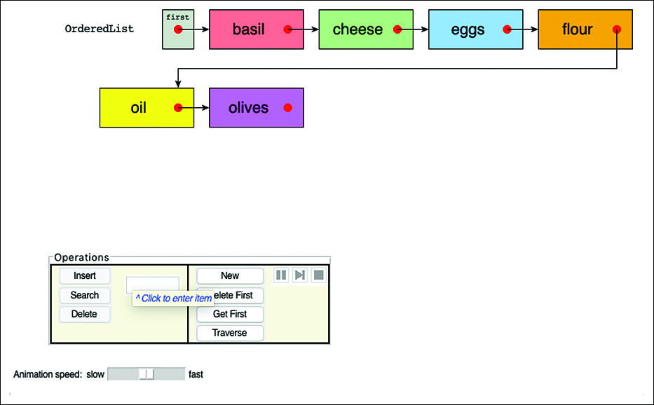

图 5-9 OrderedList 可视化工具
输入一些单词并使用文本输入框和插入按钮插入它们。第一个项目总是排在第一个位置，但后续项目按字母顺序放置在链表中任何已经存在的项目之后。在链表中找到正确位置后观看插入动画。它与无序链表几乎相同。
如果链表中有多个项目，请尝试搜索一个项目。搜索现有密钥和不在链表中的密钥。一旦找到一个键大于目标键的项，搜索就会停止。接下来，尝试删除链表前面的键。当键在链表中时，删除过程与无序删除过程相同，但查找缺失键的过程在找到更高值的键后结束。

### 有序链表的 Python 代码

有序链表是一种特殊的链表，因此如清单 5-13 所示的 OrderedList.py 模块将 OrderedList 类定义为 LinkedList 的子类。它有一个额外的属性，__key，这是一个从链表中的项目中提取排序键的函数。排序键在创建链表时存储并且不能更改，因为这将允许现有项目的链表相对于键变得无序。
因为 OrderedList 是 LinkedList 的子类，所以它继承了清单 5-3 和清单 5-4 中定义的所有方法。出于我们在 DoubleEndedList 子类中提到的相同原因，必须在此处重新定义 getFirst() 和 setFirst() 方法：Python 对以双下划线开头的属性的名称重整会阻止共享父类的属性。其他方法如 getNext() 和 isEmpty() 无需重写即可工作。请注意，使 OrderedList 成为 LinkedList 的子类会使 setFirst() 成为公共方法，这是不可取的，因为调用者可以使用它来乱序放置链表中的项目。
清单 5-13 OrderedList.py 模块的开头

```python
from LinkedList import *


class OrderedList(LinkedList):  # An ordered linked list where items
    def __init__(
        self, key=identity  # are in increasing order by key, which
    ):  # is retrieved by a func. on each item
        self.__first = None  # Reference to first Link, if any
        self.__key = key  # Function to retrieve key

    def getFirst(self):
        return self.__first  # Return the first link

    def setFirst(self, link):  # Change the first link to a new Link
        if link is None or isinstance(link, Link):  # Must be Link or None
            self.__first = link
        else:
            raise Exception("First link must be Link or None")

    def find(self, goal):  # Find the 1st Link whose key matches or is after the goal
        link = self.getFirst()  # Start at first link, and search
        while (
            link is not None
            and self.__key(link.getData()) < goal  # while not end of the list
        ):  # and before goal
            link = link.getNext()  # Advance to next in list
        return link  # Return Link at or just after goal or None for end

    def search(self, goal):  # Find 1st datum whose key matches goal
        link = self.find(goal)  # Look for Link object that matches
        if (
            link is not None
            and self.__key(link.getData()) == goal  # If Link found, and its key
        ):  # matches the goal
            return link.getData()  # return its datum
```

find() 方法类似于用于 LinkedList 的方法，但有重要的变化。因为链表项是有序的，所以遍历链表查找特定键的方法利用了升序。该方法在 while 循环条件中有一个测试，检查当前链接的键是否小于目标的键。这意味着循环可以在它结束时结束

- 找到带有目标键的链接
- 在带有目标键的链接所在的位置之后立即找到下一个链接或
- 到达链表末尾

因为循环可以以指向所需链接或具有下一个更高键值的链接结束，所以当找不到目标时返回什么值是一个问题。此实现返回任一类型的链接，因为查找紧跟在特定键之后的链接的功能可用于某些操作（例如，拆分链表）。这类似于第 4 章中有序记录数组的 find() 方法的行为，它返回应插入新项的索引。换句话说，find() 方法返回一个指针，该指针指向应在链表中插入具有目标键的链接的位置。如果它位于链表中的第一项之前，则返回指向第一个 Link 的指针。如果它到达其他项目之前或其他项目之一的某处，则返回指向该项目的指针。仅当它在最后一项之后才返回 None 。
search() 方法调用 find() 并向其 if 语句添加一个测试，检查从 find() 返回的链接是否有效，并且仅当其键匹配时才返回存储在该链接中的项目。
清单 5-14 中所示的 OrderedList.py 模块的 insert() 方法做了类似的事情。理想情况下，它只使用 find() 来定位插入点并在那里修改链表。然而，在这种情况下，它需要修改 find() 返回的链接之前的链接的 __next 指针。所以，它和LinkedList的delete()方法一样，都是用循环的方式去寻找上一个Link到插入点。更准确地说，它查找插入点之前的 OrderedList 或 Link。 while 循环条件更改为还验证下一个 Link 的键是否小于目标键；否则，循环可以结束。
清单 5-14 OrderedList 的 insert() 和 delete() 方法

```python
class OrderedList(LinkedList):
...

    def insert(self, newDatum):  # Insert a new datum based on key order
        goal = self.__key(newDatum)  # Get target key
        previous = self  # Link or OrderedList before goal Link
        while (
            previous.getNext() is not None
            and self.__key(previous.getNext().getData()) < goal  # Has next link and
        ):  # next link's key is before the goal
            previous = previous.getNext()  # Advance to next link
        newLink = Link(  # Build a new Link node with new
            newDatum, previous.getNext()
        )  # datum and remainder of list
        previous.setNext(newLink)  # Update previous' first/next pointer

    def delete(self, goal):  # Delete first Link with matching key
        if self.isEmpty():  # Empty list? Raise an exception
            raise Exception("Cannot delete from empty linked list")

        previous = self  # Link or OrderedList before Link
        while (
            previous.getNext() is not None
            and self.__key(previous.getNext().getData()) < goal  # Has next link and
        ):  # next link's key is before the goal
            previous = previous.getNext()  # Advance to next link
        if previous.getNext() is None or goal != self.__key(  # If goal key not in next
            previous.getNext().getData()
        ):  # Link after previous
            raise Exception("No datum with matching key found in list")

        toDelete = previous.getNext()  # Store Link to delete
        previous.setNext(toDelete.getNext())  # Remove it from list

        return toDelete.getData()  # Return data in deleted Link
```

循环结束后，insert() 使用提供的 newDatum 和前一个指针之后的链表的其余部分构造新的 Link。 previous 的 \_\_next 指针的更新类似于其他链表类。通过继承 setNext() 的定义作为 setFirst() 方法的同义词，OrderedList.insert() 方法根据 previous 的数据类型更新 \_\_first 指针或 \_\_next 指针。
delete() 方法使用与 insert() 方法类似的结构，首先检查空链表并在找到空链表时引发异常。它使用相同样式的 while 循环来获取 previous 以指向目标键所在或应该位于的链接之前的链接。为了避免循环结束时 previous 指向目标键所在位置之后的位置，循环条件向前看下一个链接的键（如果有的话）。循环完成后，它会检查紧接在 previous 之后的 Link 是否具有目标键，如果没有则引发异常。验证找到目标键后，它可以记录要删除的链接，并通过在上一个链接上调用 setNext() 修改适当的 \_\_next 或 \_\_first 字段来删除它。它通过在要删除的链接上调用 getNext() 来替换旧值。返回存储在 toDelete 链接中的数据。
上一个指针的移动和下一个链接的添加/删除在有序链表可视化工具的插入/删除操作中进行动画处理。查看各个步骤以详细了解操作。
清单 5-15 显示了一个用于测试 OrderedList 类的客户端程序。它以使用默认排序键函数 identity() 的空有序链表开始。它插入交替的正整数和负整数序列。它显示有序链表，然后在其中搜索某些值以查看 find() 和 search() 方法返回的内容。最后，它按照插入的顺序删除数字，这意味着它首先删除链表中间的项目，最后删除末端的项目。
清单 5-15 OrderedListClient.py 程序

```python
from OrderedList import *

olist = OrderedList()
print("Initial list has", len(olist), "element(s) and empty =", olist.isEmpty())

for i in range(5):
    olist.insert((-1 - i) ** i)
print(
    "After inserting",
    len(olist),
    "numbers into the ordered list, it contains:\n",
    olist,
    "and empty =",
    olist.isEmpty(),
)

for value in [9, 999]:
    for sign in [-1, 1]:
        val = sign * value
        print(
            "Trying to find",
            val,
            "in ordered list returns",
            olist.find(val),
            ", search returns",
            olist.search(val),
        )

print("Deleting items from the ordered list:")
for i in range(5):
    number = (-1 - i) ** i
    print("After deleting", olist.delete(number), "the list is", olist)

```

运行这个程序的结果是

```sh
$ python3 OrderedListClient.py
Initial list has 0 element(s) and empty = True
After inserting 5 numbers into the ordered list, it contains:
 [-64 > -2 > 1 > 9 > 625] and empty = False
Trying to find -9 in ordered list returns -2 , search returns None
Trying to find 9 in ordered list returns 9 , search returns 9
Trying to find -999 in ordered list returns -64 , search returns None
Trying to find 999 in ordered list returns None , search returns None
Deleting items from the ordered list:
After deleting 1 the list is [-64 > -2 > 9 > 625]
After deleting -2 the list is [-64 > 9 > 625]
After deleting 9 the list is [-64 > 625]
After deleting -64 the list is [625]
After deleting 625 the list is []
```

注意调用 find(−9) 的结果。它返回一个指向持有 −2 的链接的指针。这可能看起来很奇怪，但 −9 介于 −64 和 −2 之间。 find() 方法在应该插入给定键的位置之后立即返回指向链接的指针。对 find(9) 的调用确实找到了包含 9 的链接，这是对 search() 方法的唯一调用，它返回的不是 None。调用 find −999 和 999 分别显示目标键落在所有链表项之前或之后的结果。

### 有序链表的效率

在有序链表中插入和删除任意项需要 O(N) 次比较（平均 N/2），因为必须通过遍历链表找到合适的位置。但是，可以在 O(1) 时间内找到或删除最小值，因为它位于链表的开头。如果应用程序频繁访问最小项，并且快速插入并不重要，那么有序链表是一个有效的选择。类似地，如果需要最大项的频率远高于最小项，并且可以接受相同的 O(N) 平均插入时间，则可以按降序对项进行排序。如果同时需要最小值和最大值，则双端有序链表会很好。例如，优先级队列可以通过双端有序链表来实现。

### 链表插入排序

有序链表可用作数组中数据的相当有效的排序机制。假设你有一组无序数据项。如果你从数组中取出项目并将它们一一插入到有序链表中，它们将自动按顺序排列。如果你随后将它们从链表中删除，始终从前面删除并通过增加索引将它们放回数组中，则数组将被排序。
这种类型的排序比第 3 章"简单排序"中描述的数组中更常见的插入排序要有效得多，因为需要的副本更少。它仍然是一个 O(N^2^) 过程，因为将每个项目插入有序链表涉及将新项目与链表中已有项目的平均一半进行比较。有 N 项要插入，这导致大约 N^2^/4 次比较。然而，每个项目只被复制两次——一次从数组到链表，一次从链表到数组。 2×N 的副本与数组中的插入排序相比有优势，后者有大约 N^2^ 个副本。
与基于数组的插入排序相比，链表插入排序的缺点是它占用的内存多于两倍：数组和链表必须同时在内存中。但是，如果手边有一个有序链表类，链表插入排序是一种对不太大的数组进行排序的便捷方法。

## 双向链表

让我们检查一下链表的另一种变体：双向链表（不要与双端链表混淆）。双向链表有什么好处？普通链表的一个潜在问题是很难沿着链表向后遍历。像这样的声明

```python
current = current.getNext()
```

可以方便的跳到下一个链接，但是没有相应的方法可以返回到上一个链接。根据应用程序的不同，此限制可能会带来问题。
例如，想象一个文本编辑器，其中使用链表存储文本。屏幕上的每个文本行都存储为从链接引用的 String 对象。当用户在屏幕上向下移动光标时，程序会进入下一个链接以操作或显示新行。如果用户向上移动光标会发生什么？在普通的链表中，你需要将 current（或其等价物）返回到链表的开头，然后再次向下移动到新的 current 链接。这不是很有效。你想向上迈出一步。
双向链表提供了这种能力。它允许程序在链表中向前和向后遍历。秘诀在于每个链接都保留两个对其他链接的引用，而不是一个。第一个是下一个链接，就像在普通链表中一样。第二个是上一个链接。图 5-10 显示了这种链表的双端版本。

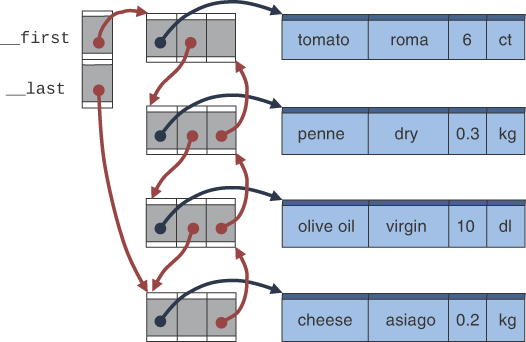

图 5-10 双向链接（和双端）链表
对于前向链和反向链，链接链都以空指针（图中的空框和 Python 中的 None 值）结尾。双链表的缺点是每次插入或删除一个链接时，你必须处理四个链接而不是两个——前一个链接的两个附件和后一个链接的两个附件。当我们稍后查看实现时，这一点会变得更加清楚。由于反向链接需要额外的引用，因此每个链接记录稍微大一点也就不足为奇了。
让我们看看如何管理额外的链接。双向链表（作为单链表的子类）中 Link 类的规范如清单 5-16 所示。
清单 5-16 DoublyLinkedList.py 模块的链接类

```python
import LinkedList
 
class Link(LinkedList.Link):            # One datum in a linked list
    def __init__(self, datum,            # Constructor with datum
                 next=None,              # and optional next and
                 previous=None):         # previous pointers
        self.__data = datum
        self.__next = next                # reference to next item in list
        self.__previous = previous        # reference to previous item
 
    def getData(self): return self.__data   # Accessors
    def getNext(self): return self.__next
    def getPrevious(self): return self.__previous
    def setData(self, d): self.__data = d
    def setNext(self, link):             # Accessor that enforces type
        if link is None or isinstance(link, Link):
            self.__next = link
        else:
            raise Exception("Next link must be Link or None")
    def setPrevious(self, link):         # Accessor that enforces type
        if link is None or isinstance(link, Link):
            self.__previous = link
        else:
            raise Exception("Previous link must be Link or None")
 
    def isFirst(self): return self.__previous is None
```

这个 Link 类的定义只比清单 5-2 中所示的单向链表的定义复杂一点。类定义使双向链接版本成为单链接版本的子类，并添加了一个私有的 \_\_previous 字段，这意味着需要定义新的访问器方法来获取和设置它的值。就像 \_\_next 指针一样，setPrevious() 方法强制执行有关存储在该字段中的引用类型的约束。大多数方法需要在子类中重写才能正确访问Python中的私有字段。只有 isLast() 和 \_\_str\_\_() 方法在两个 Link 类中保持不变。一种用于测试这是否是链表中第一个链接的新方法 isFirst() 现在通过添加 \_\_previous 字段变得很容易。
双向链表不一定是双端链表（保留对链表最后一个元素的引用），但以这种方式创建它很有用。清单 5-17 中所示的 DoublyLinkedList 的实现同时使用了 \_\_first 和 \_\_last 指针，以便于以相反的顺序遍历链表。它具有用于获取和设置字段的常用访问器方法。设置指针的方法在这些字段上强制执行类型约束，并在添加第一个或删除最后一个链接时执行特殊检查以更新链表的两端。
清单 5-17 DoublyLinkedList 类构造函数和访问器

```python
class DoublyLinkedList(LinkedList.LinkedList):
    def __init__(self):  # Constructor
        self.__first, self.__last = None, None

    def getFirst(self):
        return self.__first  # Accessors

    def getLast(self):
        return self.__last

    def setFirst(self, link):  # Set first link
        if link is None or isinstance(link, Link):  # Check type
            self.__first = link
            if (
                self.__last is None or link is None  # If list was empty or
            ):  # list is being truncated
                self.__last = link  # update both ends
        else:
            raise Exception("First link must be Link or None")

    def setLast(self, link):  # Set last link
        if link is None or isinstance(link, Link):  # Check type
            self.__last = link
            if (
                self.__first is None or link is None  # If list was empty or
            ):  # list is being truncated
                self.__first = link  # update both ends
        else:
            raise Exception("Last link must be Link or None")

    def traverseBackwards(  # Apply a function to all Links in list
        self, func=print
    ):  # backwards from last to first
        link = self.getLast()  # Start with last link
        while link is not None:  # Keep going until no more links
            func(link)  # Apply the function to the link
            link = link.getPrevious()  # Move on to previous link

```

DoublyLinkedList 类继承了为LinkedList 类定义的方法，以正向遍历链表。更具体地说，LinkedList 的 isEmpty()、first()、traverse()、\_\_len\_\_() 和 \_str() 方法无需修改即可工作。新的 traverseBackwards() 方法将一个函数应用到反向的每个链表项。

### 末端插入和删除

接下来要看的方法是在双向链表的开头和结尾插入和删除链接的方法。 insertFirst() 方法在链表的开头插入，而 insertLast() 方法在结尾插入。同样， deleteFirst() 和 deleteLast() 方法删除链表中的第一个和最后一个链接。它们如清单 5-18 所示。稍后我们将查看在中间插入和删除链接的方法。
清单 5-18 插入和删除 DoublyLinkedLists 末尾的方法

```python
class DoublyLinkedList(LinkedList.LinkedList):
… (other definitions shown before) …

    def insertFirst(self, datum):  # Insert a new datum at start of list
        link = Link(
            datum, next=self.getFirst()  # New link has datum
        )  # and precedes current first
        if self.isEmpty():  # If list is empty,
            self.setLast(link)  # insert link as last (and first)
        else:  # Otherwise, first Link in list
            self.getFirst().setPrevious(link)  # now has new Link before
            self.setFirst(link)  # Update first link

    insert = insertFirst  # Override parent class insert

    def insertLast(self, datum):  # Insert a new datum at end of list
        link = Link(
            datum, previous=self.getLast()  # New link has datum
        )  # and follows current last
        if self.isEmpty():  # If list is empty,
            self.setFirst(link)  # insert link as first (and last)
        else:  # Otherwise, last Link in list
            self.getLast().setNext(link)  # now has new Link after
            self.setLast(link)  # Update last link

    def deleteFirst(self):  # Delete and return first link's data
        if self.isEmpty():  # If list is empty, raise exception
            raise Exception("Cannot delete first of empty list")
        first = self.getFirst()  # Store the first link
        self.setFirst(first.getNext())  # Remove first, advance to next
        if self.getFirst():  # If that leaves a link in the list,
            self.getFirst().setPrevious(None)  # Update its predecessor
        return first.getData()  # Return data from first link

    def deleteLast(self):  # Delete and return last link's data
        if self.isEmpty():  # If list is empty, raise exception
            raise Exception("Cannot delete last of empty list")
        last = self.getLast()  # Store the last link
        self.setLast(last.getPrevious())  # Remove last, advance to prev
        if self.getLast():  # If that leaves a link in the list,
            self.getLast().setNext(None)  # Update its successor
        return last.getData()  # Return data from last link

```

insertFirst() 方法首先创建包含新数据的新链接。链表的当前第一个链接作为下一个链接传递以跟随新链接。新链接的 \_\_previous 字段留空，因为这将是链表的第一个链接。下一步是将 \_\_first（可能还有 \_\_last 字段）更新为新链接。有两种情况：

- 如果链表为空，则该方法通过一次调用 setLast() 来更新两者。
- 如果已经有一些链接，则它必须将反向指针从当前第一个链接更改为指向新链接。然后它将第一个链接替换为新创建的链接。

将字符串"a"插入包含["A","B"]的双向链表的过程如图5-11所示。

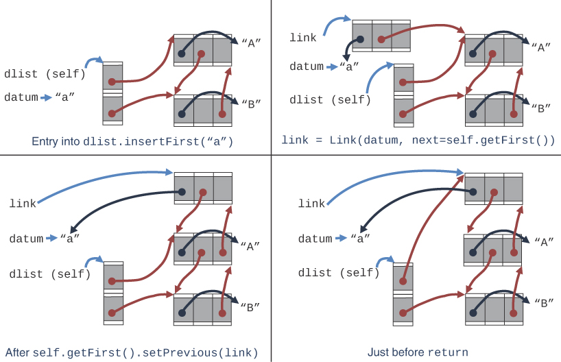

图 5-11 在双向链表的开头插入
在定义了 insertFirst() 方法之后，清单 5-18 还重新定义了 insert() 使其成为同义词。需要重新定义，以便父类中更简单的名称 LinkedList 引用相同的操作。 insertLast() 遵循相同的结构，但更新了 \_\_last 字段。它有点像 insertFirst() 的镜像，第一个 ⇄ 最后一个，前一个 ⇄ 下一个。
从链表的一端删除链接还涉及仔细更新指针。更新的顺序很重要，这样你就可以避免删除稍后需要的引用。 deleteFirst() 的实现检查链表是否为空，如果是则抛出异常。如果不是，它存储指向第一个 Link 的指针。从链表中删除后，第一个指针用于获取该 Link 中的数据。然后它推进 \_\_first 字段指向第二个链接。指向第二个链接的指针可能是 None。如果是，setFirst() 方法也会将 \_\_last 字段更新为 None。否则，链表中至少还有一个链接，它的__previous字段必须更新为None，因为它刚刚成为第一个链接，如图5-12所示。最后，返回删除的链接中的数据。

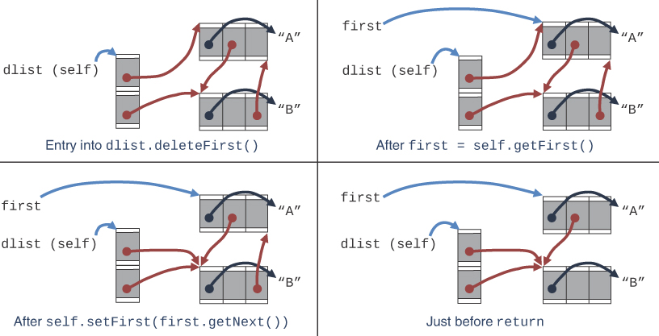

图 5-12 删除双向链表的第一项

### 中间插入和删除

修改双向链表中间的 Links 稍微复杂一些，因为需要考虑所有四个指针（前后的正向-反向指针）。要指定操作应该发生的位置，通常你会标识一个具有匹配键的链接。为此，你需要一个返回链接指针的 find() 方法。因为 DoublyLinkedList 类是 LinkedList 的子类并且有一个 find() 方法，如清单 5-5 所示，所以不需要为 DoublyLinkedList 重写一个。在目标 Links 之后插入和删除的方法如清单 5-19 所示。
清单 5-19 插入和删除 DoublyLinkedLists 中间链接的方法

```python
def identity(x):
    return x  # Identity function

...

class DoublyLinkedList(LinkedList.LinkedList):
… (other definitions shown before) …

    def insertAfter(  # Insert a new datum after the
        self, goal, newDatum, key=identity  # first Link with a matching key
    ):
        link = self.find(goal, key)  # Find matching Link object
        if link is None:  # If not found,
            return False  # return failure
        if link.isLast():  # If matching Link is last,
            self.insertLast(newDatum)  # then insert at end
        else:
            newLink = Link(  # Else build a new Link node with
                newDatum,  # the new datum that comes just
                previous=link,  # after the matching link and
                next=link.getNext(),
            )  # before the remaining list
            link.getNext().setPrevious(  # Splice in reverse link
                newLink
            )  # from link after matching link
            link.setNext(newLink)  # Add newLink to list
        return True

    def delete(
        self, goal, key=identity  # Delete the first Link from the
    ):  # list whose key matches the goal
        link = self.find(goal, key)  # Find matching Link object
        if link is None:  # If not found, raise exception
            raise Exception("Cannot find link to delete in list")
        if link.isLast():  # If matching Link is last,
            return self.deleteLast()  # then delete from end
        elif link.isFirst():  # If matching Link is first,
            return self.deleteFirst()  # then delete from front
        else:  # Otherwise it's a middle link
            link.getNext().setPrevious(  # Set next link's previous
                link.getPrevious()
            )  # to link preceding the match
            link.getPrevious().setNext(  # Set previous link's next
                link.getNext()
            )  # to link following the match
            return link.getData()  # Return deleted data item

```

insertAfter() 方法首先使用 find() 方法查找其键与给定目标匹配的链接。 如果找不到这样的链接，则该方法退出，返回 False 以指示失败。 或者，它可以引发异常或在第一个或最后一个位置插入数据，具体取决于需要什么。 找到带有目标键的链接后，insertAfter() 检查它是否是最后一个链接，如果是，则使用 insertLast() 将其放在最后一个链接之后。
在处理完特殊情况后，insertAfter() 可以处理在链表的两个连续链接之间插入的情况。 它构建一个新的 Link 来保存新数据，前一个指针设置为目标 Link，下一个指针设置为下一个 Link。 这显示在图 5-13 的第三个面板中。 第四个面板显示它如何更改后续链接的 \_\_previous 指针和目标链接的 \_\_next 指针以指向新链接。 这些步骤的顺序非常重要。

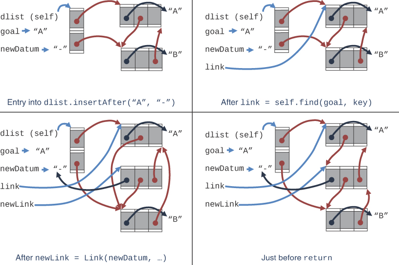

图 5-13 在双向链表中间插入
delete() 方法也首先使用 find() 方法查找其键与给定目标匹配的链接。如果找不到这样的链接，则会引发异常。或者，它可以返回 False 以指示失败。找到要删除的链接后，它会检查它是链表的最后一个还是第一个链接。如果是，它将使用删除方法来结束。否则，它需要通过分别更改其前后链接的 \_\_previous 和 \_\_next 指针来"剪掉"目标链接。修改指针后，它返回存储在目标链接中的数据。
请注意，双向链表避免了在插入和删除时都需要搜索目标前面的链接。与单链表不同，数据结构存储每个 Link 的指针。就实现插入和删除方法的复杂程度而言，你认为这是一种简化吗？对此意见不一，但请记住，这种复杂性与算法的计算复杂性有很大不同。程序员的复杂性与计算机执行操作的效率是完全不同的概念。由于不同的原因，两者都很重要。
要验证双向链表的实现，可以使用如清单 5-20 所示的 DoublyLinkedListClient.py 程序。请注意，像这样的程序会练习数据结构的基本操作，但并不是真正全面的测试程序。
清单 5-20 DoublyLinkedListClient.py 程序

```python
from DoublyLinkedList import *

dlist = DoublyLinkedList()

for data in [(1968, "Richard"), (1967, "Maurice"), (1966, "Alan")]:
    dlist.insertFirst(data)
for data in [
    (2015, "Whitfield"),
    (2015, "Martin"),
    (2016, "Tim"),
    (2017, "David"),
    (2017, "John"),
]:
    dlist.insertLast(data)
print(
    "After inserting",
    len(dlist),
    "entries into the doubly linked list, it contains:\n",
    dlist,
    "and empty =",
    dlist.isEmpty(),
)

print("Traversing backwards through the list:")
dlist.traverseBackwards()

print("Deleting first entry returns:", dlist.deleteFirst())
print("Deleting last entry returns:", dlist.deleteLast())


def year(x):
    return x[0]


for date in [1967, 2015]:
    print("Deleting entry with key", date, "returns", dlist.delete(date, key=year))
print("List after deletions contains:", dlist)

for date in [1968, 2015]:
    data = (date + 1, "?")
    print(
        "Inserting",
        data,
        "after",
        date,
        "returns",
        dlist.insertAfter(date, data, key=year),
    )
print("List after insertions contains:", dlist)

print("Traversing backwards through the list:")
dlist.traverseBackwards()
```

清单 5-20 中的程序构建了一个包含年份和名称对的双向链表。 它以字符串格式显示链表的内容，向前遍历链表，并通过调用 traverseBackwards() 方法以相反的顺序打印每个数据项。 它测试链表两端的删除，然后使用年份作为键删除一些条目（它定义了一个 year() 函数，返回每对的第一个条目）。 这些项目在删除时打印，然后打印剩余链表。 然后它在具有特定日期的项目之后插入一些新的对，并向前和向后打印链表以显示在所有更改之后链接都被保留。 输出是

```sh
$ python3 DoublyLinkedListClient.py
After inserting 8 entries into the doubly linked list, it contains:
 [(1966, 'Alan') > (1967, 'Maurice') > (1968, 'Richard') > (2015, 'Whitfield') >
(2015, 'Martin') > (2016, 'Tim') > (2017, 'David') > (2017, 'John')] and empty =
False
Traversing backwards through the list:
(2017, 'John')
(2017, 'David')
(2016, 'Tim')
(2015, 'Martin')
(2015, 'Whitfield')
(1968, 'Richard')
(1967, 'Maurice')
(1966, 'Alan')
Deleting first entry returns: (1966, 'Alan')
Deleting last entry returns: (2017, 'John')
Deleting entry with key 1967 returns (1967, 'Maurice')
Deleting entry with key 2015 returns (2015, 'Whitfield')
List after deletions contains: [(1968, 'Richard') > (2015, 'Martin') > (2016, 'Tim')
> (2017, 'David')]
Inserting (1969, '?') after 1968 returns True
Inserting (2016, '?') after 2015 returns True
List after insertions contains: [(1968, 'Richard') > (1969, '?') > (2015, 'Martin')
> (2016, '?') > (2016, 'Tim') > (2017, 'David')]
Traversing backwards through the list:
(2017, 'David')
(2016, 'Tim')
(2016, '?')
(2015, 'Martin')
(1969, '?')
(1968, 'Richard')
```

### 双链表作为双端队列的基础

双向链表可以用作上一章中提到的双端队列的基础。在双端队列中，可以在任意一端插入和删除，而双向链表提供了这种能力。本章末尾的一个编程项目让你实现这个 ADT。

## 循环链表

到目前为止我们看过的所有链表都有明确的开始和结束。有时，创建形成圆圈或循环的链接链很有用。例如，链接链可以代表游戏中的玩家，其中轮到从一个玩家到下一个玩家，并在所有玩家都轮到他们时返回到第一个。在某些运动中，运动员轮流组织，轮流发球或击球。在化学中，存在形成环的分子链。在生物学中，有些生物体依赖于其他生物体，这种依赖性有时会形成循环。那么显而易见的问题就变成了"循环链表在哪里结束？"在这些示例中的每一个中，实际上都没有结束，但需要一个标记，有时是多个标记，以出于各种目的指定链表的特定成员。
使用"循环"数组来实现队列是一种方便的方法，可以在数组单元在一端插入并从另一端移除后重新使用数组单元进行存储。如果队列长度小于数组的大小，则不使用数组的某些单元格。使用对象之间的引用实现的循环链表避免了未使用的元素。该设计节省了空间，但引入了复杂性，例如确定链表的大小和遍历链表的每个元素一次。双端链表是一个更好的队列设计，因为它没有未使用的元素并且比循环链表更简单。但是，还可以有其他用途，循环链表可能会有所帮助。
图 5-14 显示了表示循环链表的典型方式。该链表是单链接的，但如果反转遍历方向很重要，则它可以是双链接的。它需要一个元素的标记以将其指定为最后一个（或当前或第一个），就像 LinkedList 指向单个 Link 对象一样。该图未显示链接中存储的任何数据。任何数据都将使用引用存储，就像我们讨论过的其他链表一样。

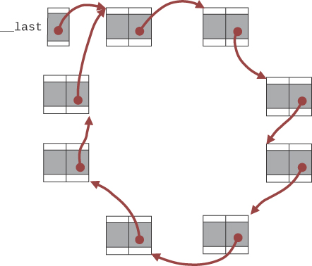

图 5-14 循环链表（无数据）
如果为标记存储的唯一内容是指向链接之一的指针，则遍历需要跟随指针，直到循环重新访问标记的链接。这并不比跟随指针直到找到 None 更复杂。通过选择标记链中的最后一个 Link，你可以分两步找到第一个 Link，使 insert()（或 insertFirst）和 insertLast() 方法都是常量时间操作。
循环链表的最大问题是确保它们保持循环。各个 Link 对象通常会提供一个 setNext() 方法，CircularList 类将使用该方法在结构中插入和删除链接。如果该 setNext() 方法是公共的并且可由使用 CircularList 类的代码调用，则调用者可以将链接指针设置为某个其他链接，或者可能将其设置为 None，以形成非循环或线性链表。它们可以采用不寻常的形状，如图 5-15 所示。

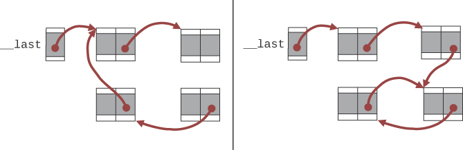

图 5-15 断开的循环链表（没有数据）
处理循环链表中的异常情况可能很困难。如果允许 None 作为下一个指针的值，则遍历循环条件除了在确定遍历循环结束时查找第一个访问的链接外，还必须查找该值。然而，即便如此，当 \_\_last 指针未指向循环中的 Link 时也无济于事，如图 5-15 右侧所示，其中 __last 字段指向循环外的"支线"。遍历将从支线开始，然后前进到圆形部分。这意味着循环条件不仅必须将当前指针与第一个指针进行比较，而且还必须将当前指针与迄今为止访问过的所有链接进行比较。对于一个小的循环链表来说，这不是什么大问题，但是随着链接数量的增加，它会变得非常耗时。遍历中的 N 个步骤中的每个步骤都必须将当前链接与最多 N 个其他链接进行比较，因此比较的总数看起来是 O(N^2^)。
为避免此类问题，循环链表实现必须避免公开 setNext() 方法，并提供其他方法来更改链表，以保证它保持单个循环，没有毛刺或中断。同样，所有类型的链表（单链、双链、双端）都不允许使用公共 setNext() 方法来创建本质上是循环链表的内容。如果他们这样做了，那么在找不到 None 时终止的遍历方法将永远找不到它。

## 迭代器
你研究过的所有链表和数组结构都包含一个 traverse() 方法。该方法以已知顺序对存储在数据结构中的每个项目应用一个函数。访问每一项都非常有用，例如，当你需要更新所有人员记录以便为每一项分配新的识别代码或为每项记录打印邮寄标签时。传递给 traverse() 的函数接受一个参数，一个存储在链表中的项目，并执行一些操作。
当要对每个项目执行的操作独立于对所有其他项目执行的操作时，对每个项目调用函数效果很好。另一方面，在项目之间组合或具有某种交互的操作并不像在一个项目上使用单个函数那样容易处理。例如，如果你需要每条记录中某些数字字段的平均值，则该函数需要在某处收集总和，然后在末尾将其除以项目数。另一个困难的例子是收集成对的记录，其中每对中的某些字段彼此不匹配。
为了组合数据结构中所有项目的数据，在调用程序内以某种方式遍历循环中的项目会更方便。这允许调用者跟踪总和、最小值、最大值、最后处理的值等。需要的是一种在另一个程序的上下文中迭代项目的方法。对于项目由整数索引并且任何项目都可以在恒定时间内获取的数组，以这种方式迭代很简单。像链表这样的数据结构和我们稍后研究的一些更复杂的数据结构没有办法在恒定时间内访问任意项目，但可以按照定义的顺序逐步遍历所有项目，每一步都具有恒定时间访问。
迭代器是一种数据结构，它提供了逐步遍历另一个数据结构中包含的所有项目的方法，只访问每个项目一次。物品的顺序是固定的；只要对象的内容不变，特定对象的每个迭代器都会以相同的顺序遍历项目序列。迭代器必须提供至少一个方法，通常称为 next()、getNext() 或类似的东西，用于获取序列中的下一项。它提供的其他方法在某种程度上取决于它逐步执行的数据结构和用于实现它的语言。
迭代器遍历的对象有时称为集合、容器、序列或可迭代对象。选择使用哪个术语在某种程度上取决于所排序的数据结构的类型。 Python 有序列数据类型，例如 list 和 str。这些结构中的项目有一个自然顺序，因此它们被适当地命名。哈希表（字典）、树和集合等其他数据结构的顺序不太明显。但是，它们包含的项目仍然可以放入迭代器逐步执行的序列中。
迭代器还有另一个好处：它们可以表示无限序列和不确定长度的序列。对于交互式程序，各种输入，如点击、击键、触摸、声音、相机图像和网络数据包，都可以由迭代器处理。通常不清楚这些输入中有多少会发生。使用它们的程序只需要知道它们是按顺序出现的，并且它应该继续处理它们直到收到一些终止代码。在数学中，存在无限序列，例如所有整数或所有质数。制作一个包含无限数量事物的数据结构是不切实际的，但在许多情况下，你可以制作一个以特定顺序遍历无限序列的数据结构。
Python 使用术语 iterable 来表示任何可以生成迭代器的类。我们在本书中使用该术语来描述任何被排序的对象，尽管该术语在 Python 中具有更具体的含义。让我们检查一下一般情况下如何构造迭代器，然后看看如何在 Python 中实现它们的细节。

### 基本迭代器方法

迭代器本身就是一种数据结构，它引用另一个数据结构。 然而，迭代器强烈依赖于可迭代对象，因此它们经常在同一源代码中一起实现。 因为迭代器是一种数据结构，它和其他对象一样是一个对象，需要一个构造函数。 你通常不会像 LinkedListIterator 那样定义公共类，而是将迭代器的构造函数定义为可迭代数据结构的方法。 该构造函数方法可以称为 iterator()。 例如，你可以构造一个链表，用一些数据填充它，然后通过执行

```python
llist = LinkedList()
llist.insert(<some data>)
   …

it = llist.iterator()
```

如果你为 LinkedListIterator 创建一个公共类，那么迭代器将使用类似

```python
it = LinkedListIterator(llist)
```

选择主要是风格。在可迭代类中使用方法的优点是它可以是每个可迭代类的相同方法名称。使用数据结构的程序员不需要寻找迭代器类名是什么；他们可以调用 iterator()。
构造完成后，调用者通过调用迭代器的 next() 方法获取项目。调用者通常在循环中执行此操作，直到处理完所有项目。有时迭代器接口也有像 current() 这样的方法。这有点像队列中使用的 peek() 方法，用于查看队列前端的值而不将其从队列中移除。调用 next() 就像从堆栈中调用 pop() 一样；它更改迭代器以移动到下一个项目并返回一个项目。如果迭代器有一个 current() 方法，那么它必须在构造迭代器时（在对 next 的任何调用之前）返回第一个项目。
### 完成迭代：使用标记或标记值
因为迭代器很可能在循环中使用，所以它需要一个良好的接口来处理循环的开始和结束。如果可迭代对象为空，则根本不应进入循环。如果有一些项目，那么循环必须在迭代器到达最后一个项目后结束。如果有一个已知值永远不可能是存储在可迭代对象中的项目，则循环条件可以对其进行测试。例如：

```python
while it.current() is not None:
    <loop body>
    it.next()
```

此循环查看当前值，如果它不是迭代结束的标记（本例中为 None），则执行循环体并前进到下一项。那么问题就变成了如何处理一个序列的结尾，在这个序列中，current 可以取任何值，包括 None。

### 完成迭代：使用终止测试

循环终止的另一种策略是定义一个像 hasMore() 这样的方法，它提供一个布尔值来说明对 next() 的另一次调用是否会产生一个值。这意味着循环看起来像这样：

```python
while it.hasMore():
    current = it.next()
    <loop body>
```

这种终止测试策略消除了对已知值作为序列末端标记的需要。这允许将 None 或任何其他值存储为链表中的一项。

### 完成迭代：使用异常处理

另一种策略是使用异常处理。如果迭代器有一个 current() 方法，那么在可迭代对象为空时调用它或 next() 可能会导致异常。如果没有 current() 方法，那么调用 next() 方法将在到达序列末尾时引发异常。我们还没有讨论文件数据结构，但这是处理文件结尾或用户输入的常用方法。在这些情况下，你需要围绕迭代循环进行一些异常处理以检测序列的结束。例如，如果序列的末尾导致抛出 StopIteration 异常，则迭代循环采用以下形式：

```python
try:
    while True:
       current = it.next()
       <loop body>

except StopIteration:
    pass
```

就代码行数而言，这种替代方案肯定更长。遵循流程也有点困难，因为循环体现在有两层深并且末尾有一个异常处理程序。然而，在基于此取消它之前，请注意它还有一个优点，即序列末尾没有特殊的已知值，并且它不需要 hasMore() 方法来检查更多项目。该程序可以尝试从 iterable 中获取另一个项目，也许在等待新输入被添加到 iterable 时暂停执行，然后返回新项目或抛出异常以表明无法找到更多。
通常，next() 返回存储在它排序的对象中的项目，而不是对保存项目引用的内部结构的引用。例如，在链表中，next() 将返回存储在 Link 对象的 \_\_data 字段中的项目，而不是对 Link 对象本身的引用。这对于保持链接之间引用的完整性很重要。
清单 5-21 显示了一个迭代器的简单实现，该迭代器处理其中两种终止选择。它遍历单向链表（其其他定义出现在清单 5-3、5-4、5-5 和 5-6 中）。迭代器是它自己的一个类。在这种情况下，我们选择使它成为一个名为 \_\_ListIterator 的私有类，它在 LinkedList 类中定义。保持其私有的基本原理是不需要在迭代器类上创建子类或执行其他操作。
清单 5-21 LinkedList 的简单迭代器

```python
class LinkedList(object):

… (other definitions shown before) …

class __ListIterator(object):  # Private iterator class
    def __init__(self, llist):  # Construct an iterator over a
        self._llist = llist  # linked list
        self._next = llist.getNext()  # Start at first Link

    def next(self):  # Iterator's next() method
        if self._next is None:  # Check for end of list
            raise StopIteration  # At end, raise exception
        item = self._next.getData()  # Store next data item
        self._next = self._next.getNext()  # Advance to following
        return item

    def hasMore(self):  # Is there more to iterate?
        return self._next is not None  # Check for end of list

    def iterator(self):
        return LinkedList.__ListIterator(self)
```

\_\_ListIterator 类的实现有一个构造函数，该构造函数将可迭代的链表记录在名为\_llist 的字段中。它初始化名为 \_next 的第二个字段以指向链表的第一个 Link。如果链表为空，则 \_next 将为 None。清单 5-21 末尾的 LinkedList 的 iterator() 方法使用构造函数来创建迭代器对象。这有点不寻常，因为它将 self 变量显式传递给构造函数；需要这种方法来区分 LinkedList 对象和 \_\_ListIterator 对象。
迭代器类的 next() 方法遍历链表并在最后抛出异常。 next() 方法使用存储在迭代器对象中的信息遍历链表中的每一项。它首先检查内部\_next 指针是否为 None。如果是这样，则迭代器从一个空链表开始，或者过去对 next() 的调用已经前进到链表的末尾，并且它会抛出 StopIteration 异常。这是 Python 中预定义的异常，但它也可以很容易地成为用户定义的异常类。如果你选择这个特定的异常，它的运行方式类似于 Python 的迭代器实现，如后面的"Python 中的迭代器"部分所述。
当 \_next 指向链接对象时， next() 方法存储来自该链接的项目；前进到下一个链接，可以是 None；并返回存储的项目。要使用此迭代器，调用程序将使用如下循环：

```python
it = llist.iterator()
print('Created an iterator', it)
try:
    while True:
        print('The next item is:', it.next())
except StopIteration:
    print('End of iterator')
```

在方块链表上执行该程序会产生如下结果：

```python
Created an iterator <LinkedList.__ListIterator object at 0x1100d5668>
The next item is: 16
The next item is: 9
The next item is: 4
The next item is: 1
The next item is: 0
End of iterator
```

清单 5-21 中 __ListIterator 的实现也定义了 hasMore() 方法。因此，可以通过编写类似的东西来使用终止测试策略

```python
it = llist.iterator()
print('Created an iterator', it)
while it.hasMore():
    print('The next item is:', it.next())
print('End of iterator')
```

这种多策略迭代器支持不同的编程风格。

### 其他迭代器方法

迭代器的基本功能是遍历存储在另一个数据结构中的项目序列，但有时添加更多功能会很方便。如前所述，检查下一项而不调用 next()（它将迭代器推进到下一项）可能很有用，例如合并两个有序链表时。你可以为两个链表构建迭代器，检查每个链表的第一个元素，然后推进下一项在排序顺序中排在第一位的迭代器。名为 getCurrent() 或 current() 或 peek() 的方法通常用于此目的。
另一个有用的功能是将迭代器指向序列的开头。这可能在识别应按某些优先顺序获得标签的项目时使用。想象一下，向比赛的前五名选手分发一些美味的食物。一个迭代器可以循环遍历零食，而另一个迭代器可以按照他们完成的顺序循环遍历赛车手。每个赛车手都会被问及他们是否想要目前提供的款待。如果他们接受，则 treat 迭代器前进到下一个 treat，并且 racer 迭代器重置回开头。这样，任何完成得更快的赛车手都可以获得下一次奖励的优先权。 （当然，已经选择了零食的赛车手无法再次选择。）
为了使这种重置操作起作用，迭代器必须维护对原始可迭代数据结构的引用。在链表示例中，该引用存储在 _llist 字段中，因此定义如下

```python
def reset(self):            # Reset iterator to first link
    self._next = self._llist.getNext()
```

可以用来回到起点。

### 在迭代期间改变结构
一些迭代器提供了改变可迭代数据结构的方法。此操作非常棘手，因为更改数据结构可能会更改它包含的项目和/或应访问这些项目的顺序。例如，如果要删除链表中的最后一个项目，迭代器可能会在迭代到倒数第二个项目后跳过该项目。在为赛车手分配零食的示例中，在赛车手选择了零食后将其从迭代器中删除会很方便。然而，将它们从那些后续迭代中移除是很难做到的。
通过将此类删除限制为仅由迭代器完成，以便可以适当更新对可迭代数据结构的任何引用，可以更容易地计划此类删除。但是，如果对可迭代对象的修改发生在代码的其他地方，迭代器就不可能正确处理所有可能出现的情况。例如，如果在清单 5-21 中使用 iterator() 方法在链表上创建迭代器后，代码的其他部分删除了链表中的第一项，应该发生什么？迭代器的内部 _next 指针指向不再是可迭代 _llist 一部分的链接，随后对 next() 的调用将返回不在链表中的项目。目前尚不清楚 next() 会将 _next 指针前进到何处，因为已删除的链接可能已被外部代码更改其指针。
如果在遍历可迭代序列时允许更改数据结构，则最好通过迭代器执行对项目序列的所有更改。可以定义 insertAfter()、insertBefore() 和 deleteNext() 等方法来更改下一项附近的链表，同时仍允许遍历序列的其余部分。如果链表是双向链接的，或者迭代器维护对先前访问过的链接的引用，则可以有效地实现 insertBefore() 方法。 insertAfter() 方法可以用单向链表来实现。有两种方法可以在插入后处理 _next 指针：包括新插入的项目或在迭代器的剩余序列中跳过新插入的项目。如果 _next 指针未提前，则多次插入可以添加多个项目，然后以与插入相反的顺序访问这些项目。如果 _next 指针提前，则可以插入多个项目并将保留插入顺序（并被迭代器序列跳过）。 deleteNext() 方法将从可迭代对象和迭代器序列中删除一个项目。
如你所见，将对可迭代序列的迭代与对可迭代对象的更改混合使用会导致可怕的问题。最好在迭代时防止更改。

### Python 中的迭代器

Python 通过对迭代器的特殊支持使遍历数据结构变得非常容易。事实上，你一直使用的所有 for x in [a, b, c]: 样式循环都是使用迭代器实现的。前面描述的用于实现迭代器的许多细节都是由 Python 执行的，没有任何可见的（用户）源代码。当你使用具有不同语法的其他语言实现数据结构时，了解它是如何工作的很重要。
如你所料，内置链表类型是可迭代的。字符串和元组也是可迭代的。使用迭代器的循环的一般语法是

```python
for var in <iterable>:
    <body>
```

从本质上看，Python 以这种形式执行循环的方式是在进入循环时评估 *<iterable>* 表达式。 *<iterable>* 表达式生成一个迭代器对象，该对象不能直接供程序使用，但由 Python 解释器维护。然后解释器创建一个新的局部变量 var，并通过调用迭代器的 next() 方法为其赋值。更准确地说，迭代器是通过调用 *<iterable>* 表达式返回的对象的 \_\_iter\_\_() 方法创建的。
创建迭代器后，解释器随后调用其 \_\_next\_\_() 方法来获取序列中的下一项。分配变量后，它会评估循环体。当主体完成时，解释器调用 \_\_next\_\_() 方法来获取序列中的下一项。当迭代器经过数据结构中的最后一项时，\_\_next\_\_() 方法会引发 StopIteration 异常。该异常可能会在第一次尝试调用 \_\_next\_\_() 方法时发生，在这种情况下，不会分配变量，并且根本不会评估循环体。
更具体一点，让我们看一个例子，其中 var 是 v 而 *<iterable>* 表达式是 expr。 Python 解释器主要执行以下操作：

```python
it = expr.__iter__()
try:
    while True:
        v = it.next()
        <body>
except StopIteration:
    pass
```

这不完全是 for var in *<iterable>*: loop 的翻译； it 变量是隐藏的，v 变量只能在循环 *<body>* 中访问，就像局部变量只能在函数定义中访问一样。然而，重写的版本显示了解释器执行的基本步骤。 \_\_iter\_\_() 方法创建迭代器对象，它和它的 \_\_next\_\_() 方法在每次循环中被调用。该循环为 StopIteration 创建一个隐藏的异常处理程序。当该异常发生时，"无限"while 循环停止，并继续执行循环之后的任何内容。
如果循环体中发生任何其他异常，它们将被隐藏的异常处理程序忽略并传递到程序的下一个包含级别。如果 <body> 中有嵌套循环，它们会创建自己的异常处理程序，以捕获每个循环的迭代结束而不影响此外部循环的结束。因为迭代器和捕获其终止的异常处理程序不能在源代码中直接访问，所以简单的 Python 循环提供了一个隐式迭代器，而不是像清单 5-21 中那样的显式迭代器。

### 生成器
任何实现 \_\_iter\_\_() 方法的 Python 对象类都成为可迭代对象。它返回的迭代器对象必须同时实现 \_\_next\_\_() 和 \_\_iter\_\_() 方法。这些方法可以使用如清单 5-21 所示的隐藏类来编写，但还有一种更简单的方法：生成器。生成器是创建迭代器的函数。 Python 有一个特殊的语句，即 yield 语句，它负责创建迭代器类及其所需的方法。让我们看一个使用数学序列的例子。
最著名的无限序列之一是斐波那契数列。它存在于自然界中的菠萝果芽、朝鲜蓟花和松果的苞片（花瓣）中。它以数字 1 开头，重复两次。序列中的每个后续数字都是前两个数字的总和。序列开始

```
1, 1, 2, 3, 5, 8, 13, 21, …
```

你可以编写一个打印出所有斐波那契数列的函数，如下所示：

```python
def Fibonacci():
    previous = 0
    current = 1
    while True:
        print(current)
        next = previous + current
        previous = current
        current = next
```

这个函数永远不会结束，因为它打印出序列中的每个数字（所以执行它时要小心）。你可以通过简单的更改将此函数转换为生成器，将 print 语句替换为 yield 语句，如清单 5-22 所示。
清单 5-22 斐波那契数列的 Python 生成器

```python
def Fibonacci():
    previous = 0
    current = 1
    while True:
        yield current
        next = previous + current
        previous = current
        current = next
```

yield 语句有点像函数的 return 语句。它导致函数的执行停止并将表达式的值返回给它的调用者。与 return 语句非常不同的是，Python 解释器会保留函数的执行状态，以便下次调用它时，执行会在 yield 语句之后恢复并继续处理。继续处理会使 yield 语句更像它所替换的 print 语句。你可能会认为 yield 是在不忘记接下来会发生什么的情况下将消息发送回调用者。
当 Python 解释器在示例 5-22 中的 Fibonacci() 定义中找到 yield 语句时，它会将定义的函数更改为一种称为生成器函数的特殊形式。 yield 的存在意味着这个函数不应该像大多数函数那样执行。当生成器函数被调用时，它返回一个生成器对象，它是一种迭代器。这意味着你可以使用它来逐步执行使用 \_\_next\_\_() 的序列。你可以使用清单 5-22 中的定义在 Python 解释器中进行尝试：

```python
>>> gen = Fibonacci()
>>> gen
<generator object Fibonacci at 0x1012386d0>
>>> gen.__next__()
1
>>> gen.__next__()
1
>>> gen.__next__()
2
>>> gen.__next__()
3
```

调用 Fibonacci() 会生成一个存储在 gen 变量中的对象。该对象是生成器对象。因为它也是一个迭代器，所以它必须有一个 \_\_next\_\_() 方法。第一次调用 \_\_next\_\_() 产生（产生）序列中的第一个数字 1。在解释器内部，第一次调用开始执行 Fibonacci() 定义的主体，直到第一个 yield 语句。该操作产生 current 的值，最初为 1。第二次调用 \_\_next\_\_() 在主体的执行在 yield 语句之后恢复后再次产生 1。让我们更仔细地看看这是如何发生的。
在产生第一个 1 之后，对 \_\_next\_\_() 的第二次调用导致在 yield 语句之后在 Fibonacci() 中恢复执行。当前变量和先前变量的值与第一次调用时相同，均为 0 和 1，因为它们存储在生成器对象中。执行循环体的下一步在 next 变量中存储一个新值 1。然后它更新先前的值和当前的值，返回到循环的顶部，并再次命中 yield 语句。随着过程的重复，第三次调用 \_\_next\_\_() 会产生 2。生成器对象始终将 next、current 和 previous 的值存储为主体执行状态的一部分，以便它可以在 yield 语句之后立即恢复。
将 Fibonacci() 定义为生成器后，你可以在预期可迭代对象（如循环）的地方使用它。以下示例演示了使用循环和计数器打印斐波那契数列中的前 15 个数字：

```python
class LinkedList(object):
… (other definitions shown before) …

    def __iter__(self):  # Define an iterator for the list
        next = self.getFirst()  # Start with first Link
        while next is not None:  # As long as the link is not None,
            yield next.getData()  # yield data for the link
            next = next.getNext()  # then move on to next link

```

将 \_\_iter\_\_() 方法定义为生成器函数而不是常规函数，负责构建迭代器所需的额外类。迭代器仍然需要从指向第一个 Link 的指针开始，存储在其本地 next 变量中，并遵循引用链直到找到 None 。对于有效链接，迭代器产生数据并移动到下一个链接。当没有更多链接时，循环结束，生成器退出，引发 StopIteration 异常。然后当生成器被循环调用时

```python
for item in myList:
    print(item)
```

Python 使用隐式处理程序捕获 StopIteration 异常，以便在打印每个项目后跳出 for 循环。
在 Python 函数中将 return 语句更改为 yield 语句会对代码的行为产生如此大的影响，这似乎有点令人不安。当你使用生成器时，很多工作都是由编译器完成的，源代码中没有任何显式变量或控制语句。当你阅读别人编写的代码时，在找到特定的 return 或 yield 语句之前，你不会清楚某个东西是子例程、函数还是生成器。如果找到返回值，那么它是一个函数，可能具有要返回的显式值。如果你找到 yield，那么它是一个首先返回迭代器的生成器。
每个迭代器都可以产生一系列值。当迭代器完成序列（假设它有一个结束）时，它会引发 StopIteration 异常。请注意，生成器的源代码没有显式的 raise StopIteration 语句。当执行到达函数体的末尾时，引发的异常有点像隐式返回 None 。事实上，在 Python 3.7 及更高版本中，显式引发 StopIteration 异常的生成器会导致 RuntimeError。相反，你应该使用函数的隐式结束或不带参数的显式 return 来表示序列结束。
使用 yield 语句是定义迭代器的一种紧凑方式，尽管生成器函数的特殊行为最初可能有点难以理解。本章中的编程项目为你提供了练习编写一些项目的机会。

## 概括
- 链表由一个 LinkedList 对象和若干 Link 对象组成。
- LinkedList 对象包含对链表中第一个链接的引用。
- 每个 Link 对象包含两件事：数据和对链表中下一个链接的引用。数据可以是数据本身（如整数、字符或字节）或对另一个可能更大的结构的引用。
- 对第一个或下一个链接的引用中的特殊值（在 Python 中通常为 None）表示链表结束。
- 在链表的开头插入一个项目涉及创建一个新的链接，其数据字段保存或指向该项目，将新链接的下一个字段更改为指向旧的第一个链接，并将 LinkedList 的第一个字段更改为指向新链接。
- 删除非空链表开头的项目涉及将第一个字段设置为指向第一个链接的下一个字段。
- 要遍历链表，你从第一个 Link 开始，然后从一个链接到另一个链接，使用每个链接的 next 字段找到下一个链接。
- 某些实现对 LinkedList 的第一个引用使用与每个链接的下一个引用相同的命名字段或访问器方法。这使得遍历代码更简单。
- 通过遍历链表可以找到具有指定键值的链接。
- 可以在具有指定键值的链接之前或之后插入新链接，然后通过线性搜索找到该链接。
- 双端链表维护指向链表中最后一个链接以及第一个链接的指针。
- 双端链表允许在常数时间内插入链表的末尾，而不是单链表的 O(N) 时间。
- 抽象数据类型 (ADT) 是在不参考其实现的情况下考虑的数据存储类。
- 栈和队列是 ADT。它们可以使用数组或链表来实现。
- 在有序链表中，链接按键值升序（或有时降序）排列。
- 在有序链表中插入需要 O(N) 时间，因为必须找到正确的插入点。删除最小（有时是最大）链接需要 O(1) 时间。
- 在双向链表中，每个链接都包含对上一个链接和下一个链接的引用。
- 双向链表允许向后遍历和从链表末尾删除。
- 循环链表类似于单向链表，但没有最后一项。不是将最后一个项目的下一个指针设置为 None，而是该项目指向第一个链接。
- 循环链表中有一个项目被指定为标记项目。它可以被称为 first、last、head、tail、mark 等等。这是循环链表对象指向的链接。
- 单链循环链表与线性链表具有相同的效率。通过标记最后一项而不是第一项，循环链表上的 insert() 和 insertLast() 方法花费 O(1) 时间而不是 O(N)。
- 必须仔细更新循环链表以保留单循环结构，以避免难以终止遍历所有项目的循环。
- 迭代器是一种引用，封装在它自己的类中，指向另一个数据结构中的一个项目。当数据结构是链表时，迭代器引用该链表中的特定链接。
- 迭代器方法允许调用程序按顺序移动迭代器通过数据结构的所有项。对于链表，这跟在每个链接中的下一个指针之后。
- 由迭代器排序的数据结构称为可迭代对象或容器。
- 迭代器允许访问存储在可迭代对象中的数据，而无需直接访问可迭代对象的结构和引用（链接链表中的链接），以避免调用程序更改内部结构。
- 迭代器可用于遍历链表，对选定的链接（或所有链接）执行某些操作。
- 如果在迭代器单步执行其项时可迭代对象发生变化，则迭代序列可能会改变，有时会导致严重错误。

## 问题
这些问题旨在作为读者的自测。答案可以在附录 C 中找到。
1. 以下哪项不正确？对类对象的引用
   1. 可以存储在单向链表的数据字段中。
   2. 可用于访问对象中的公共方法。
   3. 有一个大小取决于它的类。
   4. 不持有对象本身。

2. 访问链表中的链接通常是通过________链接。
3. 链表与数组的不同之处在于
   1. 链表的每个项目都有固定的大小，而数组则没有。
   2. 项目之间的关系在链表中是明确的，但在数组中不是。
   3. position 仅在数组中显式；链表项的键决定了它的位置。
   4. 要获得链表中的第 N 个项目，程序必须遵循 N 个链接，而在数组中，程序可以根据 N 计算项目的位置。

4. 必须设置或更改多少个引用才能在单向链表的中间插入一个链接？
5. 必须设置或更改多少个引用才能在单链表的末尾插入一个链接？
6. 在 LinkedList.py 程序的 insert() 方法中，清单 5-5，语句 link = Link(datum, self.getNext()) 表示
   1. 数据将被分配给 LinkedList 的第一个链接中的 \_\_data 字段。
   2. 新链接的 \_\_next 字段将引用 LinkedList 的第一个链接。
   3. 链接将设置为数据与给定数据匹配的第一个链接。
   4. 带有数据和下一个链接的新的两项链接链表将存储在链接中。

7. 假设你正在编写 LinkedList 的方法并且变量 x 保存倒数第二个 Link。什么语句将从 LinkedList 中删除最后一个链接？
8. 当一个函数使用变量调用另一个函数时，如 do_something(x) 中，调用函数中 x 的值何时可以被被调用函数更改？
9. 双端链表
   1. 允许在恒定时间内在任一端执行插入。
   2. 它的最后一个链接连接到它的第一个链接。
   3. 是双向链表的另一个名称。
   4. 在链接之间有向前和向后运行的指针。

10. 抽象数据类型
    1. 在不定义任何方法的情况下指定数据类型的字段。
    2. 允许存储对数据的引用而不是数据本身。
    3. 定义表示的数据类型以及可以对它们执行的操作。
    4. 在编写其他模块时用作大型程序中数据收集的占位符。

11. 考虑将无序记录集合存储在数组或链表中。假设复制记录比比较键查找记录花费的时间更长，那么从链表或数组中删除具有特定键的记录是否更快？
12. 你需要遍历多少次无序链表才能删除键值最大的项？
13. 在本章讨论的链表中，哪一个最适合实现队列？
14. 在本章讨论的链表中，哪一个最适合实现优先级队列？
15. 以下哪项是不正确的？如果你愿意，迭代器可能会有用
    1. 对链表进行插入排序。
    2. 删除具有特定键值的所有链接。
    3. 用链表中的键 A 和 B 交换两个项目。
    4. 在链表的开头插入一个新链接。

16. 你认为哪个是实现堆栈的更好选择：单向链表还是数组？
17. 在必须通过键快速定位对象的情况下，你认为实现对象集合的更好选择是：有序双向链表还是有序数组？
18. 循环链表
    1. 可以比双向链表更有效地实现有序链表。
    2. 可以比双向链表更有效地表示类似循环的顺序，例如游戏中的回合。
    3. 可以使查找具有匹配键的项目的效率低于单链表。
    4. 通过消除对指示链表结尾的特殊值的需要来简化链表的表示。

19. 将 Link 对象的 setNext() 方法设为 public 会产生什么后果，假设它仅在参数是对 Link 对象的引用或 None 时执行赋值？
20. Python 生成器
    1. 对于创建迭代器很有用。
    2. 可用于从更简单的类中创建类似于循环链表的类。
    3. 是表示无限序列（如斐波那契数列）的唯一方法。
    4. 需要使用 yield 语句并且不能包含循环。


## 实验
进行这些实验将有助于深入了解本章所涵盖的主题。不涉及编程。
5-A 清单 5-13 中所示的 OrderedList 类有一个 find() 方法，它以递增的顺序遍历链表以找到目标。进行二进制搜索而不是线性搜索会更好吗？为什么或者为什么不？

5-B 想象一下你去年给了朋友一份礼物，比如一根漂亮的蜡烛。今年，一位不同的朋友送给你一根漂亮的蜡烛作为礼物。你想知道退还给你的是不是完全相同的蜡烛，而不仅仅是相似的蜡烛。你会如何确定它是否是同一个？该过程与本章中的概念有何关联？

5-C 想象一下一群人之间的礼物交换。每个人都会给小组中的另一个人一份小礼物，接收者不会知道是谁带来了礼物。为了建立这种交流，你把所有人的名字放在一个盒子里，然后每个人轮流从盒子里抽出一个名字。如果他们抽到的名字是他们自己的，他们就从盒子里抽出另一个名字，然后把自己的名字放回去。这个名字就是接受礼物的人。这个选择过程一直持续到每个人都抽出名字为止。这些有点像链表中的链接。

以下是交易所的运作方式：

- 每天赠送一份礼物。
- 每个人在收到礼物后的第二天就送出一份礼物。
- 第一个画出名字的人会在第一天送出礼物。

如果有 N 个唯一命名的人，送礼需要多长时间？你能想到任何可能影响答案的问题吗？你能想办法消除这些问题吗？

5-D 迭代器非常适合遍历数据结构以查找项目。如果你想删除那个项目，你会使用一个吗？具体来说，如果你使用清单 5-21 或清单 5-23 中所示的其中一个迭代器来查找要删除的项目，那么下一步是什么？该步骤的效率如何？

5-E 链表比可扩展数组更有效地使用内存，但效率是多少？想象一个以 10 个元素的数组开始的应用程序。它将项目插入到数组中，并在每次插入超过当前数组大小的末尾时将数组的大小加倍。当数组的大小加倍时，它会分配一个新的内存段，该内存段的长度是原来的两倍，并将第一个数组的所有内容复制到第二个数组的开始部分。如果插入的项数为 1,000，则可扩展数组会多使用多少内存？ 1,000,000 怎么样？假设较小的数组即使不再使用也仍然占用空间，并且存储 1 个项目占用的内存与存储 1 个引用占用的内存一样多。

## 编程项目
编写程序来解决编程项目有助于巩固你对材料的理解并演示如何应用本章的概念。 （如简介中所述，合格的讲师可以在出版商的网站上获得编程项目的完整解决方案。）
5.1 重写清单 5-4 中所示的 LinkedList 类的 traverse()、\_\_str\_\_() 和 \_\_len\_\_() 方法，以使用清单 5-23 中所示的迭代器（由生成器创建）。

5.2 实现基于有序链表的优先级队列。存储在队列中的项目可以传递给一个函数，该函数提取它们的优先级值（或键），如第 4 章中的 PriorityQueue.py 模块中所示。优先级队列上的删除操作应该删除具有最小键的项目。

5.3 基于双向链表实现双端队列。 （参见前一章的编程项目 4.3。）它应该包括 insertLeft()、insertRight()、removeLeft()、removeRight()、peekLeft()、peekRight() 和 isEmpty() 方法。

5.4 创建一个无尾无头的单向循环链表类，如图 5-14 所示。对链表的唯一访问是单个引用 \_\_last，它可以指向链表中的任何链接。该引用可以根据需要在链表中移动。你的数据结构应该有方法来检查链表是否为空并检查第一项。它应该为 insertFirst()、insertLast()、deleteFirst() 和 search()（但不包括 deleteLast()）提供方法，确保链表始终保持循环。你应该提供一个 \_\_str\_\_() 方法来从头到尾显示链表（并且你需要在重复任何项目之前打破循环）。将 __last 移动到下一个链接的 step() 方法和将其推进到与特定目标键匹配的下一个链接的 seek() 方法也可能派上用场。

5.5 根据编程项目5.4 的循环链表实现堆栈和队列类。 Stack 类必须具有 push()、pop() 和 peek() 方法。 Queue 类必须具有 insert()、remove() 和 peek() 方法。这个练习并不太难，但你应该小心维护 LIFO 和 FIFO 顺序。 （实现双端队列可能更难，除非你使循环链表双向链接或允许从一端删除为 O(N)。）

5.6 将另一个优先级队列类实现为两级结构。顶层链表是一个队列链表，一个队列对应目前存储的每个不同优先级值。二级队列以一种易于执行队列的先进先出顺序的方式保存所有具有相同优先级的项目。这一次，项目的优先级是 insert() 方法的一个单独参数，而不是由被插入项目的函数计算的东西。这允许重新排列项目的优先级并将其放置在新优先级队列的末尾。 insert() 方法应该搜索顶级链表以找到具有匹配优先级的队列，或者如果它们都不匹配则创建一个新队列。 remove() 方法应采用可选参数 priority，它选择一个优先级队列，从中删除下一个项目。如果 priority 为 None，则 remove() 应该找到具有至少一项的最高优先级队列。该类应该有一个迭代器来遍历所有队列中的所有项目，以及第二个迭代器 priorities() 来迭代队列中至少有一个项目的优先级键。在你定义的类的 \_\_len\_\_() 方法中使用完整迭代器获取所有优先级的项目计数。

5.7 使用 next() 和 previous() 方法创建一个迭代器，以向前和向后遍历斐波那契数列。因为序列在两个方向上都不是无限的，所以 previous() 方法应该引发 StopIteration 而不是返回 0 或负数。在 next() 之后立即调用 previous() 应该重复序列中的相同数字，因为迭代器已经传递了该数字。同样，在 previous() 之后立即调用 next() 应该会产生一个重复的数字。提示：你不能用 Python 生成器实现这个项目，因为它只创建一个定向迭代器。