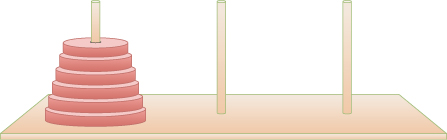
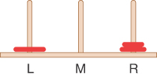
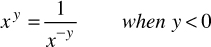

# 递归

在这一章当中

- 三角数
- 阶乘
- 字谜
- 递归二分查找
- 汉诺塔
- 使用归并排序
- 消除递归
- 一些有趣的递归应用

递归是一种函数调用自身的编程技术。这种行为可能听起来很奇怪，甚至是灾难性的。然而，递归是编程中最有趣、最有效的技术之一。有人说，"精神错乱的定义是一遍又一遍地做同样的事情，但期望得到不同的结果"，那么一个函数调用自己怎么可能得到更好的结果呢？它不仅有效，而且还提供了一个独特的概念框架解决很多问题。
递归的概念出现在自然界和艺术中，如图 6-1 所示的 20 世纪初 Droste Cacao 锡罐上使用的标签。罐子的图像出现在护士端着的托盘上。据推测，那个较小的图像将包含罐头的整个图像，而那个罐头的标签将包含罐头的整个图像，依此类推。这个插图是艺术中递归的一个流行例子，导致了 Droste 效应这个名字。面对面放置并平行对齐的镜子会产生无限递归图像。自然界中的许多模式在其结构中以较小的尺度重复出现。


图 6-1 德罗斯特效应——艺术中的递归
在本章中，我们将通过大量示例来展示递归在编程中可以应用的各种情况。我们向你展示如何计算三角数和阶乘、生成变位词、执行递归二分搜索、解决汉诺塔难题，以及研究称为归并排序的排序技术。提供了可视化工具来演示汉诺塔和归并排序。
我们还讨论了递归的优点和缺点，并展示了如何将递归方法转换为基于堆栈的方法。

## 三角数

据说毕达哥拉斯学派是古希腊的一群数学家，他们在毕达哥拉斯（以毕达哥拉斯定理而闻名）的指导下工作，他们与数字系列 1、3、6、10、15、21、28 ……（其中… 意味着该系列无限期地继续）。你能找到这个数列的下一项吗？
数列中的第 n 项是通过将 n 添加到前一项获得的。例如，第二项是通过将 2 添加到第一项（即 1），得出 3。第三项是将 3 添加到第二项（即 3），得出 6，依此类推。你还可以将第 0 项视为 0，因为向其添加 1 得到第一项。这个数列中的数字被称为三角数，因为它们可以被形象化为三角形排列的对象，如图 6-2 中的蓝色方块所示。较短（等边）边的长度为 n，即项数。


图 6-2 三角数

### 使用循环查找第 n 项

假设你想要找到数列中某个任意第 n 项的值——比如第四项（其值为 10）。你会怎么计算呢？查看图 6-3，你可能决定通过将垂直列中的方块数相加来确定任何一项的值。


图 6-3 三角数作为列
第四列有四个方块。第四项的值是 4 加上第三项的值。第三项将其列中的三个正方形添加到第二项，依此类推，直到第 1 列有一个正方形。将 ```4+3+2+1``` 相加得到 10。
下面的 triangular_loop() 函数使用这种基于列的技术来查找第 n 个三角数。它对所有列求和，从高度 n 到高度 1：

```python
def triangular_loop(nth):       # Get the nth triangular number using a loop
    total = 0                    # Keep a total of all the columns
    for n in range(nth, 0, -1):  # Start at nth and go back to 1
        total += n                # add n (column height) to total
    return total                 # Return the total of all the columns
```

当然，这些值可以按任何顺序相加，例如 1+2+3+4，这会将范围迭代器更改为 range(1, nth + 1)。

```python
def triangular(nth):        # Get the nth triangular number (incomplete)
    return (nth + sum_before(nth)) # Add this column to the preceding column sum
```

### 使用递归查找第 n 项

循环方法很简单，但还有另一种方法来看待这个问题。第 n 项的值可以被认为是两个项的总和，而不是整个数列。他们是

1. 第 n 个（最高）列，其值为 n
2. 所有剩余列的总和

这个概念如图 6-4 所示。


图 6-4 三角形数作为列加三角形

### 查找剩余的列

如果我们知道找到所有前面列的总和的方法，我们可以编写一个 triangular() 方法，它返回第 n 个三角数的值，如下所示：

```python
def triangular(nth):        # Get the nth triangular number (incomplete)
    return (nth + sum_before(nth)) # Add this column to the preceding column sum
```

但是我们在这里得到了什么？看起来编写 sum_before() 方法与编写 triangular() 方法一样困难。
但是请注意，在图 6-4 中，项 n 之前的所有列的总和与项 n–1 的所有列的总和相同。因此，如果我们知道一种方法可以将所有列加起来直到项 n，我们可以使用参数 n-1 调用它来找到项 n 的所有剩余列的总和：

```python
def triangular(nth):           # Get the nth triangular number (incomplete)
    return (nth + sum_up_to(nth - 1)) # Add this column to the preceding column sum
```

仔细想想，sum_up_to() 方法做的事情与 triangular() 方法做的完全一样：对作为参数传递的某个数字 n 的所有列求和。那么为什么不使用 triangular() 方法本身，而不是其他方法呢？那看起来像这样：

```python
def triangular(nth):            # Get the nth triangular number (incomplete)
    return (nth + triangular(nth - 1)) # Otherwise add this column to the preceding triangular number
```

函数可以调用自身这一事实可能看起来很奇怪，但为什么它不能呢？函数调用是将控制权转移到函数的开头。这种控制转移可以发生在程序内部，也可以发生在外部。当然，对象方法也是如此。

### 踢皮球

所有这些方法看起来都像是在踢皮球。有人要你找出第 9 个三角数。你知道这是 9 加上第 8 个三角形数，所以你打电话给哈利，让他找出第 8 个三角形数。当你收到他的回复时，你可以在他告诉你的任何内容上加 9，这就是答案。
哈里知道第 8 个三角数是 8 加上第 7 个三角数，于是他打电话给莎莉，让她找出第 7 个三角数。这个过程继续下去，每个人都将责任推给另一个人。
这种踢皮球在哪里结束？某人在某个时候必须能够找出不涉及寻求他人帮助的答案。如果这没有发生，就会有无数的人向其他人提问——一种永远不会结束的算术庞氏骗局。在 triangular() 的情况下，这意味着该函数在无限系列中一遍又一遍地调用自身，最终会使程序崩溃。

### 皮球到此为止

为防止无穷递推，当 n 为 1（或 0）时，被要求找出该系列的第一个三角数的人必须知道答案是 1（或 0），而无需询问其他任何人。没有更小的数字可以问任何人，没有什么可以添加到其他任何东西，所以"皮球"到此为止。事实上，我们当然不希望任何人犯错并询问负数，这可能会影响总数。我们可以通过向 triangular() 方法添加条件来限制这一点，如清单 6-1 所示。
清单 6-1 递归 triangular() 函数

```python
def triangular(nth):            # Get the nth triangular number recursively
    if nth < 1: return 0         # For anything less than 1, it's 0
    return (nth + triangular(nth - 1)) # Otherwise add this column to the preceding triangular number
```

导致递归方法返回而不进行另一个递归调用的条件称为基本情况。 至关重要的是，每个递归方法都有一个基本情况，以防止无限递归和随之而来的程序消亡。
使用前面描述的递归定义，你可以像这样请求大的三角数：

```python
>>> triangular(100)
5050
>>> triangular(200)
20100
>>> triangular(500)
125250
```

### 到底发生了什么？

让我们修改 triangular() 函数以深入了解它执行时发生的情况。 我们将插入一些打印语句来跟踪参数和返回值：

```python
def show_triangular(nth):  # Print the recursive  execution steps of
    print("Computing triangular number #", nth)  # computing the nth
    if nth < 1:  # triangular  number. Base case
        print("Base case. Returning 0")  # Print the return information
        return 0
    value = nth + show_triangular(nth - 1)  # Non-base case, get value
    print("Returning", value, "for #", nth)  # Print the return info
    return value
```

打印语句显示每次调用 show_triangular() 的进入和退出信息。 这是调用 show_triangular(5) 的结果：

```python
>>> show_triangular(5)
Computing triangular number # 5
Computing triangular number # 4
Computing triangular number # 3
Computing triangular number # 2
Computing triangular number # 1
Computing triangular number # 0
Base case. Returning 0
Returning 1 for # 1
Returning 3 for # 2
Returning 6 for # 3
Returning 10 for # 4
Returning 15 for # 5
15
```

每次 show_triangular() 函数调用自身时，它的参数减 1。该函数一次又一次地向下调用自身，直到它的参数减为 0。然后它返回。这个过程触发了整个系列的回报。控件从等待值的所有版本传回。每次函数返回时，调用者都会将它的值 nth 添加到它调用的函数的返回值中。
返回值重建三角数系列，直到答案返回给 Python 解释器。图 6-5 显示了如何将 triangular() 函数的每次调用想象为在前一次调用"内部"。


图 6-5 递归 triangular(4) 函数的执行
请注意，就在最内层版本返回 0 之前，实际上同时存在五个不同的 triangular() 化身。外层传递参数 4；内部的传递了参数 0。每次调用的顶部和底部边缘对应于 show_triangular() 中的打印语句。

### 递归程序的特征

虽然它很短，但 triangular() 函数拥有所有递归例程共有的关键特征：

- 调用自身
- 当它调用自身是为了解决同一问题的较小版本，也称为**子问题**。
- 问题的某些版本非常简单，程序可以解决它并返回，而无需调用自身。

在对自身递归方法的每次连续调用中，参数变小（或者可能由多个参数描述的范围变小），反映了问题变得"更小"或更容易的事实。在这里，我们探讨了包含较少数据元素的数据结构如何成为较小的问题。当参数或范围达到某个最小大小时，条件将触发并且该方法返回而不调用自身。

### 递归高效吗？

调用函数或方法涉及一定的开销。控制必须从调用位置转移到函数的开头。此外，函数的参数和函数应该返回的地址必须被压入内部堆栈，以便函数可以访问参数值并知道返回到哪里。
在 triangular() 函数的情况下，由于这种开销，while 循环方法可能比递归方法执行得更快。延时可能并不显着，但如果递归函数导致大量函数调用，则可能需要消除递归。我们将在本章末尾详细讨论这个问题。
另一个低效率是内存用于存储系统内部堆栈上的所有中间参数和返回值。如果有大量数据，此行为可能会导致问题，导致堆栈溢出。
这些效率问题与三角数和其他数值计算尤其相关。通常有可以避免循环或递归的数学简化。正如你可能已经猜到的那样，三角形中小正方形的数量大约等于三角形的面积，它是将两个三角形放在一起并共享最长边所形成的正方形面积的一半。对于宽度为 n 的正方形，其面积为 n^2^，因此三角形的面积为 n^2^/2。从 0 到正整数 n 的所有整数之和的精确公式是
$$
\frac{n(n+1)}{2} 
$$
这个公式在数据结构的研究中反复出现。 计算它的最有效方法是实现此公式的计算，因为加法、乘法和除法都是 O(1) 运算。
通常使用递归是因为它在概念上简化了问题，而不是因为它本质上更高效。

### 数学归纳法

对于那些对数学感兴趣的程序员，了解递归和归纳之间的关系很重要。 数学归纳法是一种根据自身定义事物的方法。 （该术语还用于描述证明定理的相关方法，这也是一种证明程序正确性的技术。）使用归纳法，你可以通过以下方式在数学上定义三角数
$$
\left\{\begin{matrix} 
  tri(n) = 0              if n <= 0 \\  
  tri(n) = n + tri(n–1)   if n >= 1
\end{matrix}\right. 
$$
根据自身定义某物似乎是循环的，但实际上它是完全有效的（前提是有一个基本案例）。

## 阶乘
阶乘在概念上类似于三角数，只是使用乘法而不是加法。 n 对应的三角数是将n 加到n-1 的三角数上，而n 的阶乘是将n 乘以n-1 的阶乘。 也就是说，第五个三角数是```5+4+3+2+1```，而5的阶乘是```5×4×3×2×1```，等于120。
阶乘对于查找可能的排序或事物组合的数量很有用。 想想三个人之间的比赛。 假设没有平局，比赛可以有多少种不同的结束方式？ 第一个人可以排名第一、第二或第三。 第二个人可以完成第一个人以外的任何位置，所以两个位置。 第三个人占据最后位置。 所以，有 3×2×1，等于 6，排序。 同样的逻辑也适用于更高的数字。 表 6-1 显示了前 10 个数字的阶乘。
表 6-1 表因子

| 数字 |    计算    |  阶乘   |
| :--: | :--------: | :-----: |
|  0   |  根据定义  |    1    |
|  1   |   1 × 1    |    1    |
|  2   |   2 × 1    |    2    |
|  3   |   3 × 2    |    6    |
|  4   |   4 × 6    |   24    |
|  5   |   5 × 24   |   120   |
|  6   |  6 × 120   |   720   |
|  7   |  7 × 720   |  5,040  |
|  8   | 8 × 5,040  | 40,320  |
|  9   | 9 × 40,320 | 362,880 |

0 的阶乘定义为 1。如果你考虑一组赛车手的排序示例，则空的赛车手组正好有 1 个排序。 如你所见，阶乘数增长得非常快。 在数学中，5 的阶乘用感叹号 5! 表示，也许是为了提醒我们它们有多大。
可以使用类似于 triangular() 的递归方法来计算阶乘。 它看起来像这样：

```python
def factorial(n):  # Get factorial of n
    return 1 if n < 1 else n * factorial(n - 1)
```

factorial() 和 triangular() 之间只有一些区别。 首先，我们将变量从 nth 更改为 n，因为 factorial 被视为函数而不是序列。 其次，factorial() 在表达式中使用 * 而不是 +

```python
n * factorial(n - 1)
```

第三，循环结束返回 1，而不是 0。可以通过为 n = 1、n = 2 等添加更多基本情况来消除一个或多个递归调用，但这样做只会节省一点工作。同样，递归的目的是其概念上的简单性。
以下是该函数产生的一些示例。图 6-6 显示了递归如何创建一组类似的函数调用以产生最后一个值。


图 6-6 递归 factorial(4) 函数的执行

```python
>>> factorial(9)
362880
>>> factorial(40)
815915283247897734345611269596115894272000000000
 >>> factorial(4)
24
```

其他各种数字实体也适用于以类似方式使用递归进行计算，例如找到两个数字的最大公分母（用于将分数减少到最低项）、将数字提高到幂等。阶乘函数更有趣一些，因为它不能很容易地简化为使用其他可以在常数时间内计算的数学原语的公式。尽管这种计算对于演示递归很有趣，但它可能不会在实践中使用，因为基于循环的方法更有效。递归可用于对算法进行原型设计，然后将其转换为更高效的实现。

## 字谜

这是一种不同的情况，其中递归为问题提供了一个巧妙的解决方案。排列是按一定顺序排列事物（有时称为排序）。假设你想列出一个特定单词的所有变位词——也就是说，可以从原始单词的字母中做出的所有可能的排列（无论它们是否构成一个真正的单词）。我们称此为字谜。例如，字谜cat会产生

```
cat
cta
atc
act
tca
tac
```

尝试自己拼写一些单词。因为这个过程类似于赛车手的排序，所以可能性的数量是字母数量的阶乘。对于 3 个字母，有 6 个可能的单词（排列）； 4 个字母有 24 个单词； 5 个字母，120；等等。这些数字假定所有字母都是不同的；如果同一个字母有多个实例，那么不同的单词就会更少。
你将如何编写程序来查找单词的所有字谜？用递归这种新技术来思考它。这就是简化概念的帮助所在。假设你已经有一个函数可以对 n 个字母的字符串进行变位。现在你所需要的只是一种处理添加另一个字母的方法。如果原始单词中有 n+1 个字母，那么在每个长度为 n 的短变位词中，多出来的字母应该放在哪里？好吧，它可以放在任何其他字母之间，也可以放在开头或结尾。这就是所有带有 n+1 个字母的字谜吗？
想想cat的例子。 at 的两个变位词是 at 和 ta。如果将 c 放在两个字符之间，则会得到 act 和 tca。如果在开头添加 c，则会得到 cat 和 cta。将 c 添加到末尾会产生 atc 和 tac。总而言之你有

```
act, tca, cat, cta, atc, tac
```

你已经找到所有六个排序并且没有引入任何重复项（只要开头的字谜列表中没有重复项）。 因此，在将单个字符添加到一组不同的变位词时，这对于生成所有可能的变位词来说看起来是正确的。 剩下要做的就是定义基本案例（或案例）。
如果一个字符串中只有一个字符，那么只有一种顺序，即字符串本身。 空字符串呢？ 好吧，你仍然应该返回它的唯一顺序，即空字符串本身。 如前所述，这对应于 factorial(0) 返回 1。 因此，你可以按如下方式设置递归 anagrams() 函数：

```python
def anagrams(word):  # Return a list of anagrams for word
    if len(word) <= 1:  # Empty words and single letters
        return [word]  # have a single anagram, themselves
    result = []  # Start with an empty list
    for part in anagrams(word[1:]):  # Loop over smaller anagrams
        # the smaller word up to the index
        result.extend(part[:i] + word[0] + part[i:] for i in range(len(part) + 1))

    return result  # Return the list of bigger anagrams
```

该函数从基本情况开始。 0 或 1 个字符的短单词是唯一可能的变位词，因此该函数会立即返回单词本身的列表。如果单词长于 1 个字符，它会使用 Python 切片运算符 (word[1:]) 获取单词最后部分（除第一个字符外的所有字符）的所有变位词。然后它遍历每个较短的字谜，将其存储在 part 变量中。在进入循环之前，它将结果列表初始化为空列表。
在每个部分中，有 n 个或 ```len(part)``` 个字符。要进行变位的单词的第一个字符可以位于它们中的任何一个之间，也可以位于开头或结尾。这与在 part 的任何字符之前插入第一个字符并在位置 n 处插入相同。该函数使用另一个循环将 i 设置为每个插入索引，从 0 到 n，包括在内。内部循环的主体将一个新的 n+1 字符变位词附加到结果列表。 （在这种情况下，Python 的列表类型被视为链表而不是数组。）较长的变位词从较短的变位词的（可能为空）切片开始，部分，直到 i，然后是单词的第一个字母，然后是从 i 开始的较短的字谜的剩余切片（可能为空）。
测试这个实现，你得到

```python
>>> anagrams('')
['']
>>> anagrams('c')
['c']
>>> anagrams('cat')
['cat', 'act', 'atc', 'cta', 'tca', 'tac']
```

对"cat"的 anagram 函数的调用如图 6-7 所示。最里面的调用是基本情况，它返回一个字符串的列表，即最后一个字母"t"。围绕最内层的调用将"a"插入到"t"字符串的两个可能位置，即开头和结尾，以生成 ["at"，"ta"]。最外层的调用将"c"插入三个可能位置之一的两个字符串中的每一个。两个字符串和三个可能位置的组合产生六个字谜。


图 6-7 字谜转换
字谜短词很好。例如：

```python
>>> anagrams('tire')
['tire', 'itre', 'irte', 'iret', 'trie', 'rtie', 'rite', 'riet', 'trei', 'rtei',
'reti', 'reit', 'tier', 'iter', 'ietr', 'iert', 'teir', 'etir', 'eitr', 'eirt',
'teri', 'etri', 'erti', 'erit']
```

然而，对较长的单词进行字谜拼写可能会变得更麻烦。 6 的阶乘是 720，生成如此长的序列可能会产生比你想知道的更多的单词。

## 递归二分查找

还记得我们在第 2 章"数组"中讨论的二分查找吗？搜索使用最少的比较次数在有序数组中找到具有匹配键的单元格的索引。该解决方案不断将数组分成两半，查看哪一半包含所需的单元格，然后将另一半再次分成两半，依此类推。这是 OrderedRecordArray.find() 方法：

```python
def find(self, key):  # Find index at or just below key
    lo = 0  # in ordered list
    hi = self.__nItems - 1  # Look between lo and hi
    while lo <= hi:
        mid = (lo + hi) // 2  # Select the midpoint

        if self.__key(self.__a[mid]) == key:  # Did we find it?
            return mid  # Return location of item

        elif self.__key(self.__a[mid]) < key:  # Is key in upper half?
            lo = mid + 1  # Yes, raise the lo boundary

        else:
            hi = mid - 1  # No, but could be in lower half

    return lo  # Item not found, return insertion point instead
```

你可能想重新阅读第 2 章中有关有序数组中的二进制搜索的部分，该部分描述了此方法的工作原理，或者查看算法可视化。
你可以很容易地将这种基于循环的方法转换为递归方法。 基于循环的方法更改 lo 或 hi 以指定每次迭代的新范围。 每次通过循环时，它将范围（大致）分成两半。

### 递归取代循环

在递归方法中，不是在循环内更改 lo 或 hi，而是使用 lo 或 hi 的新值作为参数再次调用 find()。 循环消失并被递归调用所取代。 这是它的样子：

```python
class OrderedRecordArray(object):
    … # other definitions as shown in Chapter 2 …
    def find(
        self,
        key,  # Find index at or just below key
        lo=0,  # in ordered list between lo
        hi=None,
    ):  # and hi using recursion
        if hi is None:  # If hi was not provided,
            hi = self.__nItems - 1  # use upper bound of array
        if lo > hi:  # If range is empty,
            return lo  # return lo for base case
        mid = (lo + hi) // 2  # Select the midpoint
        if self.__key(self.__a[mid]) == key:  # Did we find it?
            return mid  # Return location of item

        if self.__key(self.__a[mid]) < key:  # Is key in upper half?
            return self.find(  # then recursively search
                key, mid + 1, hi
            )  # in upper half
        else:  # Otherwise, it must be in
            return self.find(  # lower half so recursively
                key, lo, mid - 1
            )  # search below mid
```

这个递归版本为 find() 的 lo 和 hi 参数定义了默认值。这允许调用者在不指定要搜索的索引范围的情况下调用该方法。如果调用者未提供值（或将 None 作为参数传递），则第一个 if 语句将 hi 的值填充为最后一个有效索引。 lo 的默认值是常量 0，因此可以在参数定义中指定。
与其他递归方法一样，下一个测试是针对基本情况的。第二个 if 语句查找一个空的索引范围，其中 lo > hi。对于空数组或在数组的项中找不到键时会发生这种情况。在这种情况下，find() 返回 lo，因为将在 lo 处插入具有该键的对象以保持顺序。为什么不检查 lo == hi 是否作为基本情况？如果你这样做了，那么你仍然需要将正在寻找的密钥与 lo 中的对象的密钥进行比较。根据它们之间的关系，返回的值可能是 lo、lo – 1 或 lo + 1。跳过这些检查并让递归继续进行直到 lo > hi 会更容易。我们在例行程序的其余部分检查每个案例。
下一条语句将 mid 设置为 lo 和 hi 之间范围的中点。第三个 if 语句将数组索引处的键与正在查找的键进行比较。如果它们相等，则该方法可以返回 mid 作为结果；不再需要递归。如果之前有递归调用到达这一点，它们都会将中间值作为结果返回给它们的调用者。
在第三个 if 语句将搜索关键字与 mid 处的关键字进行比较但未找到匹配项之后，唯一剩下要尝试的就是搜索上部或下部搜索范围。通过检查搜索键是在中间键的上方还是下方，该方法可以确定适当的范围并使用对 self.find() 的递归调用进行搜索。这两个调用处理与 lo == hi == mid 相关的其他两个条件。如果 mid 处的键小于搜索键，则递归调用转到 lo + 1。否则，它搜索 lo 到 mid – 1 范围，该范围是空的，因为 lo == mid，并返回 lo。
这是对递归 find() 方法的一个小测试。在此示例中，程序将一小组整数放入一个数组中，并尝试找出一些存在的和一些不存在的。

```python
arr = OrderedRecordArray(10)
for item in [3, 27, 14, 10, 88, 41, 67, 51, 95]:
    arr.insert(item)
 
print("Array containing", len(arr), "items:\n", arr)
 
for goal in [0, 10, 11, 99]:
    print("find(", goal, ") returns", arr.find(goal))
```

这个测试的输出是

```python
Array containing 9 items:
[3, 10, 14, 27, 41, 51, 67, 88, 95]
find( 0 ) returns 0
find( 10 ) returns 1
find( 11 ) returns 2
find( 99 ) returns 9
```

搜索 0 返回 0，因为如果插入该值将进入数组的第一个单元格，因此它将在 3 之前。调用 find(10) 返回 1，这是包含 10 的单元格的索引。对 find(11) 的下一次调用显示它返回数组中下一个更大整数之前的索引 1，最后一个超出数组的当前末尾，因为它比所有对象都大。
图 6-8 显示了在前面的数组中查找 11 的索引所需的递归调用。在初始调用中，未指定 lo 和 hi，因此使用它们的默认值（在括号内以绿色显示）。内部递归调用不使用默认值。


图 6-8 执行递归二分搜索
要搜索的索引范围最初都是 9。在第一次递归调用中，范围缩小到 4，索引从 0 到 3。第二次递归调用将范围缩小到 2，索引从 2 到 3。最后一个递归调用缩小了范围在发现索引 2 处的键 14 高于目标键 11 后变为 0。由于范围为空，基本情况导致 2 在递归调用链中向上返回。
递归二分搜索具有与非递归版本相同的大 O 效率：O(log N)。它更优雅但可能稍微慢一些，因为函数调用和返回可能比更新循环变量花费更多时间。

### 分而治之算法

递归二分查找是分治法的一个例子。你把大问题分成小问题，然后分别解决每一个问题。每个较小问题的解决方案都是相同的：将其分成更小的问题并解决它们。这个过程一直持续到你到达基本情况，它可以很容易地解决，没有进一步的划分。
分而治之的方法通常与递归一起使用，尽管正如你在第 2 章的二分查找中看到的那样，你也可以使用非递归方法。它通常涉及一种方法，该方法包含对其自身的两次递归调用，每半个问题各调用一次。在二分查找中，有两次这样的调用，但实际执行的只有一次。 （哪一个取决于键的值。）本章稍后描述的合并排序实际上执行两个递归调用（对数组的两半进行排序）。

## 汉诺塔

汉诺塔是一个具有历史意义的拼图，由放置在三个轴或柱上的几个圆盘组成，如图 6-9 所示。该拼图也被称为梵天之塔或卢卡斯之塔，因其发明者爱德华·卢卡斯 (Édouard Lucas) 而得名。卢卡斯是一位研究斐波那契数列和其他递归定义数列的数学家。谜题的目标是按照一组特定规则将所有磁盘从一个主轴移动到另一个主轴。



磁盘都具有不同的直径。每个中间都有一个孔，可以套在主轴上。所有圆盘都从一个主轴开始，按直径顺序堆叠，呈现出塔的外观。谜题的目的是将所有磁盘从起始主轴（例如左侧的那个）转移到另一个主轴（例如右侧的主轴）。一次只能移动一个磁盘，并且不能将任何磁盘放在比其自身小的磁盘上。
与谜题相伴的传说是，在一座遥远的寺庙中，一群僧侣夜以继日地工作，将 64 个金盘从三座镶嵌钻石的塔楼中的一座转移到另一座。当他们完成时，世界将结束。如果这让你警觉，请等到你看到用 64 个圆盘解决这个难题需要多长时间。

### TowerofHanoi 可视化工具

启动 TowerOfHanoi 可视化工具。通过在文本输入框中键入 3 并选择新建来创建一个新的三盘拼图。你可以尝试自己解决难题，方法是使用鼠标将最上面的圆盘拖到另一个塔上。右侧纺锤旁的星星表示球门塔。图 6-10 显示了塔经过几次移动后的样子。


图 6-10 TowerOfHanoi 可视化工具
有两种使用可视化工具的方法：

- 你可以通过将磁盘从一个塔拖到另一个塔来尝试手动解决难题。
- 你可以选择"解决"按钮并观看算法解决难题，而无需你进行任何干预。磁盘在柱子之间来回移动。使用暂停/播放按钮，你可以停止和恢复动画以检查每一步发生的情况。

要重新启动拼图，请输入你要使用的磁盘数量，从 1 到 6，然后选择新建。指定数量的磁盘将排列在左侧主轴上。你可以将顶部磁盘拖到其他两个主轴中的任何一个。如果你拿起下一个更大的圆盘，该工具将只允许你将其放置在最上面的圆盘具有更大直径的主轴上。如果你将它从可以接受它的主轴上松开，磁盘会返回到你拾起它的位置。当所有的圆盘在最左边的轴上形成一个塔时，求解按钮被启用。如果你停止自动解算器，你可以继续手动解题。
尝试用少量的圆盘（比如三到四个）手动解决难题。努力达到更高的数字。该工具使你有机会直观地了解问题是如何解决的。

### 移动金字塔

我们将圆盘在主轴上的排列称为"金字塔"，因为它们是按直径排序的。你可以称它们为"堆栈"，但这会与你研究过的堆栈数据结构有些混淆（尽管该数据结构对磁盘建模很有用）。使用这个术语，拼图的目标是将金字塔从左边的主轴移动到右边。为方便起见，主轴可以标记为 L、M 和 R，分别代表左、中和右。
你如何解决这个难题？让我们从简单的案例开始。如果只有一个磁盘，解决方案就很简单了。将一个磁盘从主轴 L 移动到主轴 R。实际上，更简单，如果没有磁盘，那么就没有什么可移动的，难题就解决了。那么两个磁盘呢？这也很容易。将磁盘 1 从 L 移动到 M，将磁盘 2 从 L 移动到 R，然后将磁盘 1 从 M 移动到 R。这些移动如图 6-11 的四个面板所示。


你如何解决更多磁盘的问题？你已经看到了基本情况；递归可以帮助解决这个问题吗？你可能会惊讶地发现，你已经通过枚举最多两个磁盘的案例来计算出递归算法的所有步骤。
要了解如何获得递归解决方案，请记住你需要对同一问题制作较小的版本。你看到的两种策略是将问题分成两半或将事物的数量减一。把它分成两半似乎不太合适，所以让我们看看将磁盘数量减少一个。特别地，让我们看一下三个磁盘的情况。
如果你执行与解决双圆盘拼图相同的步骤，那么三圆盘拼图的最终结果是磁盘 3 仍在左侧主轴上，而磁盘 1 和 2 仍在右侧主轴上，如图 6- 所示12.从这里开始，很容易将磁盘 3 移到中间的主轴上，但很难将其移到右侧的主轴上。



图 6-12 移动两个圆盘后的汉诺塔和三个圆盘
如果你将第一步更改为交换中间和右侧的主轴，那么磁盘 1 和 2 将最终位于中间的主轴上，而右侧的主轴保持打开状态，如图 6-13 所示。


图 6-13 将两个圆盘移到中间后的汉诺塔
在右侧主轴为空的情况下，你可以轻松地将磁盘 3 从左侧移动到右侧。现在剩下的就是将中间主轴上的两个磁盘移到右侧。这是你已经解决的问题。这个例子提供了解决三圆盘问题的基本轮廓，即：

1. 将顶部的两个磁盘移动到中间的主轴（使用右侧的磁盘作为备用磁盘）。
2. 将磁盘 3 移动到右侧主轴。
3. 将中间主轴上的顶部两个磁盘移动到右侧主轴（使用左侧的磁盘作为备用）。

步骤 1 和步骤 3 是与图 6-11 中所示的三个动作具有相同形式的解决方案。它们是双圆盘问题的解，但起始位置和结束位置不同。现在是时候认识到你已经解决了三磁盘问题，方法是将其减少为对双磁盘解决方案的两次调用加上一个磁盘在两者之间的移动。如果你改写前面的大纲来解决 N 盘问题，它会是

1. 通过将 N-1 磁盘金字塔从起始轴移动到非目标轴（使用目标轴作为备用）来解决 N-1 磁盘问题。
2. 将第 N 个磁盘移动到目标主轴。
3. 通过将 N-1 磁盘金字塔从步骤 1 移动到目标主轴（使用起始主轴作为备用）来解决 N-1 磁盘问题。

步骤 1 和 3 看起来像是对同一解决方案例程的递归调用。该解决方案例程需要知道要移动多少个磁盘以及三个轴中每个轴的作用：启动轴、目标轴和备用轴。在各种递归调用中，主轴的角色发生变化。如果你考虑图 6-12 和图 6-13 之间的区别，它们执行相同的解决方案，但右侧两个轴的角色互换。
是吗？你想好所有的步骤了吗？那么所有其他更大的磁盘呢？他们不会因为妨碍其中一个步骤而阻止解决方案的工作吗？
如果你仔细想想，拼图中有更多的圆盘并不重要，因为它们都比最上面的圆盘大。概述的解决方案仅适用于前 N 个磁盘，并且磁盘 N+1、N+2 等都必须更大。例如，在图 6-14 中有五个磁盘的所有情况下，应用双磁盘解决方案从左轴移动到右轴都同样有效。你在概述的解决方案中依赖于该事实。事实上，你希望在 N = 5 谜题中的某个时刻，情况看起来像图 6-14 中最右边的面板。如果所有五个磁盘都在左侧主轴上启动，则执行 N = 5 和 N = 4 的所有轮廓步骤，然后在 N = 3 时执行步骤 1 和 2 应该将磁盘 3 留在右侧（目标）主轴上，磁盘 4 和 5 在下方它。剩下的就是对剩余的 N-1（两个）磁盘执行步骤 3。


图 6-14 五盘汉诺塔的可能状态
在所有的主轴角色交换之后，算法似乎仍然要求将一个较大的磁盘移动到一个较小的磁盘之上。在图 6-14 所示的最右边的情况下，你怎么知道它不会尝试将磁盘从右边的主轴移动到左边？有两种方法：写程序测试，用数学归纳法证明。接下来我们处理该程序。

### 递归实现

在深入研究代码之前，让我们看看需要哪些基本案例。正如我们提到的，如果没有磁盘，则不需要移动，解决方案就完成了。这绝对是一个基本案例。你需要单个磁盘的基本情况吗？如果将大纲递归解决方案应用于 N 为 1 的情况，你可以通过查看会发生什么来检查。第 1 步是解决 N-1 磁盘移动问题。因为 N-1 为 0，所以你知道不会移动任何东西。然后将第 N 个磁盘移动到目标主轴，这意味着一个磁盘移动到最终位置。然后第 3 步也什么都不做（有时称为"无操作"），因为 N–1 为 0。因此，似乎不需要为 N 为 1 的情况编写任何特殊内容。你只需要0 的基本情况和递归大纲。
清单 6-2 显示了类 TowerOfHanoi 的第一部分，它解决了任意数量的圆盘的难题。拼图的每个实例都将提供给构造函数的特定数量的磁盘。这个难题需要跟踪什么磁盘在什么主轴上。为此，你可以使用第 4 章"堆栈和队列"中实现的 SimpleStack 类。堆栈非常适合为每个主轴建模，因为唯一允许的磁盘运动涉及堆栈/主轴的顶部。你为三个主轴中的每一个创建一个堆栈，并将整数压入其上以表示磁盘的直径。直径可以是从 1 到 N 的数字，即圆盘数。较大的数字是较大直径的磁盘。
清单 6-2 TowerOfHanoi.py 模块——拼图对象

```python
from SimpleStack import *


class TowerOfHanoi(object):  # Model the tower on 3 spindles using
    # 3 stacks
    def __init__(self, nDisks=3):  # Constructor w/ starting number of
        self.__stacks = [None] * 3  # Stacks of disks
        self.__labels = ["L", "M", "R"]  # Labels for stacks/spindles
        self.__nDisks = nDisks  # Total number of disks
        self.reset()

    def reset(self):  # Initialize state of puzzle
        for spindle in range(3):  # Set up each of 3 spindles
            self.__stacks[spindle] = Stack(  # Start w/ empty stack
                self.__nDisks
            )  # that can hold all the disks
            if spindle == 0:  # On the first spindle,
                for disk in range(  # push the disks on the stack
                    self.__nDisks, 0, -1
                ):  # in descending order of size
                    self.__stacks[spindle].push(disk)

    def label(self, spindle):  # Get the label of spindle
        return self.__labels[spindle]

    def height(self, spindle):  # Get the number of disks on a spindle
        return len(self.__stacks[spindle])

    def topDisk(self, spindle):  # Get top disk number on a spindle or
        if not self.__stacks[spindle].isEmpty():  # None if no disks
            return self.__stacks[spindle].peek()  # Peek at top disk

    def __str__(self):  # Show puzzle state as a string
        result = ""  # Start with empty string
        for spindle in range(3):  # Loop over spindles
            if len(result) > 0:  # After first spindle,
                result += "\n"  # separate stacks on new lines
            result += (
                self.label(spindle)
                + ": "
                + str(self.__stacks[spindle])  # Add spindle label
            )  # and spindle contents
        return result
```

TowerOfHanoi 的构造函数初始化私有类属性。对主轴内容进行建模的堆栈位于一个名为 \_\_stacks 的三元素数组中。一个单独的三元素数组 \_\_labels 包含纺锤体的名称——L、M 和 R——如前面的图中所示。磁盘总数存储在 \_\_nDisks 中。为 nDisks 提供了默认值 3。
构造函数使用单独的方法来设置主轴内容。此方法允许调用程序将拼图对象重置回开始状态。 reset() 方法遍历所有三个轴，创建一个堆栈，可以容纳每个磁盘上的所有磁盘（SimpleStack 实现使用需要最大大小的数组）。对于第一个主轴（在索引 0 处），它将磁盘的整数直径推入堆栈，首先从最大的磁盘开始。
接下来的方法是主轴键值的访问函数。 label() 方法采用主轴索引并返回拼图中主轴的标签。三个主轴的主轴索引分别为 0、1 和 2。类似地， height() 方法采用主轴索引并通过返回表示其内容的堆栈长度来返回该主轴上的磁盘数。 topDisk() 方法还采用主轴索引并返回其上最顶部磁盘的直径。如果主轴为空，则返回 None。
\_\_str\_\_() 方法生成一个字符串来显示拼图状态。它将每个主轴放在不同的文本行上，显示主轴标签和磁盘直径堆栈。例如，三盘拼图的起始状态如下所示：

```python
>>> print(TowerOfHanoi(3))
L: [3, 2, 1]
M: []
R: []
```

堆栈/主轴的底部位于每行的左侧。这使用 SimpleStack 对象的 \_\_str\_\_() 方法来显示主轴内容。
清单 6-3 中的 move() 方法处理磁盘的移动。它强制执行拼图规则并在违反规则时抛出异常。参数是源和目标主轴编号（source 和 to）以及指示是否打印移动信息的标志（show）。要检查的第一个规则是源主轴不为空。如果源轴为空，则抛出异常。第二条规则检查目标轴是空的还是有一个比源轴上最上面的磁盘大的磁盘。换句话说，如果目标主轴不为空并且顶部磁盘小于源主轴的顶部磁盘，则会抛出不同的异常。如果满足两个规则检查，它将通过从源中弹出顶部磁盘并将其推入目标堆栈来执行移动。最后，如果设置了显示标志，它会打印显示源和目标主轴标签以及磁盘直径的移动信息。
清单 6-3 TowerOfHanoi.py 模块——拼图运动和解决方案

```python
class TowerOfHanoi(object):
    … (other definitions shown before) …
    def move(
        self, source, to, show=False  # Move a single disk from source
    ):  # spindle to another, possibly printing
        if self.__stacks[source].isEmpty():  # Source spindle must have
            raise Exception(f"Cannot move from empty spindle {self.label(source)}")
        if not self.__stacks[to].isEmpty() and self.topDisk(  # Destination cannot
            source
        ) > self.topDisk(  # have a disk smaller than that of
            to
        ):  # source
            raise Exception(
                f"Cannot move disk {str(self.topDisk(source))}on top of disk {str(self.topDisk(to))}"
            )
        self.__stacks[to].push(  # Push top disk of source spindle
            self.__stacks[source].pop()
        )  # on to the 'to' spindle
        if show:
            print(
                "Move disk",
                self.topDisk(to),
                "from spindle",
                self.label(source),
                "to",
                self.label(to),
            )

    def solve(
        self,  # Solve the puzzle to move
        nDisks=None,  # N disks from
        start=0,  # starting spindle
        goal=2,  # to goal spindle
        spare=1,  # with spare spindle
        show=False,
    ):  # and possibly showing steps

        if nDisks is None:  # Default number of disks to move
            nDisks = self.height(start)  # is all the disks on start
        if nDisks <= 0:  # If no request to move disks
            return  # there's nothing to do
        if self.height(start) < nDisks:  # Check if there are fewer
            raise Exception(
                f"Not enough disks ({str(nDisks)}) on starting spindle {self.label(start)}"
            )

        self.solve(
            nDisks - 1, start, spare, goal, show  # Move n - 1 from start to spare with
        )  # goal as spare
        self.move(start, goal, show)  # Move nth from start to goal
        if show:
            print(self)  # Show puzzle state after move
        self.solve(
            nDisks - 1, spare, goal, start, show  # Then move n - 1 from spare to goal
        )  # with start as spare
        if (
            nDisks == self.__nDisks and show  # Were all disks moved?
        ):  # then puzzle is solved and can show
            print("Puzzle complete")  # conclusion if requested
```

清单 6-3 中的递归 solve() 方法处理难题的所有解决方案。 solve 方法可以采用所有默认参数来解决整个难题，也可以采用解决递归步骤中的"子难题"所需的所有参数。特别是，它需要一个 nDisks 参数来指定金字塔中要移动的磁盘数量。此参数默认为 None，如果调用者未提供任何值，则由第一个 if 语句填充起始主轴上的磁盘数。起始、目标和备用参数是起始、目标和备用主轴的索引。因为 reset() 方法将所有磁盘放在第一个主轴上，索引 0，标签 L，所以它们分别默认为 0、2 和 1。最后一个参数是 show，一个标志，表示是否显示拼图的移动和中间状态。
solve() 方法中的第二个 if 语句检查基本情况。如果要移动的磁盘数为零（或以某种方式为负数），则无需执行任何操作，因此它会简单地返回。第三个 if 语句验证要移动的磁盘数不超过堆叠在起始轴上的磁盘数。
solve() 方法中的其余语句执行前面概述的递归求解算法。第一步是解决将 N-1 个磁盘从起始轴移动到备用（非目标）轴的问题。这是通过降低 nDisks 的值并交换备用和目标轴的角色来完成的。下一条语句调用 move() 方法将现在位于起始轴顶部的第 N 个磁盘移动到目标轴。如果设置了显示标志，它会在移动后打印拼图的状态。下一步是递归解决方案，将 N-1 个磁盘从备用主轴移动到目标主轴，使用原始起始主轴作为备用。最后的 if 语句检查拼图是否已经解决，如果设置了 show 标志则打印一条消息。
你可以通过创建和解决各种大小的谜题来测试解决方案，如下所示：

```python
>>> TowerOfHanoi(3).solve(show=True)
Move disk 1 from spindle L to R
L: [3, 2]
M: []
R: [1]
Move disk 2 from spindle L to M
L: [3]
M: [2]
R: [1]
Move disk 1 from spindle R to M
L: [3]
M: [2, 1]
R: []
Move disk 3 from spindle L to R
L: []
M: [2, 1]
R: [3]
Move disk 1 from spindle M to L
L: [1]
M: [2]
R: [3]
Move disk 2 from spindle M to R
L: [1]
M: []
R: [3, 2]
Move disk 1 from spindle L to R
L: []
M: []
R: [3, 2, 1]
Puzzle complete
```

如果你用更多的磁盘运行这个程序，你会发现它可靠地列举了解决更大问题所需的所有步骤。 你也可以使用可视化工具。 看到几行递归代码可以产生什么，真是太神奇了。
但是要小心，因为解决难题所需的移动次数会随着磁盘数量的增加而快速增长。 多快？
你可以很容易地找到大小为 1 到 10 的拼图所需的移动次数。它们显示在表 6-2 中。
表 6-2 用 N 盘解决汉诺塔所需的着法

|    N     |  1   |  2   |  3   |  4   |  5   |  6   |  7   |  8   |  9   |  10  |
| :------: | :--: | :--: | :--: | :--: | :--: | :--: | :--: | :--: | :--: | :--: |
| 移动次数 |  1   |  3   |  7   |  15  |  31  |  63  | 127  | 255  | 511  | 1023 |

如果你使用过二进制数，应该清楚需要 2N – 1 步才能解决 N 盘难题。这种 O(2N) 的复杂度甚至比你在第 3 章"简单排序"中看到的 O(N2) 的排序算法增长得更快。例如，102 是 100，但 210 是 1,024。所以，如果僧侣们用 64 个圆盘解谜的传说是真的，他们将不得不走 264 – 1 步才能完成。如果平均每 10 秒完成 1 个动作，则需要 5.8 × 1012 年。这不太可能很快导致世界末日。
同样重要的是要注意，为了找到解决难题的 2N – 1 步移动，在计算过程中的任何时候都会有一个只有 N + 1 次递归调用的链。这称为算法的递归深度。它对应于嵌套调用的数量，如图 6-5、6-6、6-7 和 6-8 所示。在其他算法中，此递归深度可能会变得非常大，并在执行堆栈内存不足时导致异常。

## 使用归并排序

我们递归的最后一个例子是归并排序。这是一种比你在第 3 章中看到的排序技术更有效的排序技术，至少在速度方面是这样。归并排序也相当容易实现。它在概念上比下一章中描述的快速排序和 Shellshort 更容易。
mergesort 的缺点是它需要在内存中有一个额外的数组，其大小与被排序的数组相同。如果你的原始数组勉强适合内存，则归并排序将不起作用。但是，如果你有足够的空间，这是一个不错的选择。

### 合并两个排序数组

计算科学的著名先驱之一约翰·冯·诺依曼 (John von Neumann) 通过考虑合并两个已经排序的数组 A 和 B 发明了归并排序算法。合并它们会创建第三个数组 C，其中包含 A 和 B 的所有元素，按排序排列命令。我们首先检查这个合并过程。
两个排序数组的大小不需要相同。假设数组 A 有 4 个元素，数组 B 有 6 个。它们将合并到一个以 10 个空单元格开头的数组 C 中。图 6-15 显示了最后一个值被复制到数组 C 之前的这些数组


图 6-15 合并两个数组
在图中，数组 A 和 B 的值从上到下复制到 C。 选择是从 A 还是 B 复制是基于剩余要复制的最低值。 表 6-3 显示了确定要复制哪个元素所需的比较。 表中的步骤对应图中数组C的单元格。 在每次比较之后，较小的元素被复制到 C。
表 6-3 合并比较和副本

| 步骤 |       比较        |        复制         |
| :--: | :---------------: | :-----------------: |
|  1   | Compare 10 and 11 | Copy 10 from A to C |
|  2   | Compare 17 and 11 | Copy 11 from B to C |
|  3   | Compare 17 and 23 | Copy 17 from A to C |
|  4   | Compare 57 and 23 | Copy 23 from B to C |
|  5   | Compare 57 and 46 | Copy 46 from B to C |
|  6   | Compare 57 and 46 | Copy 46 from B to C |
|  7   | Compare 57 and 87 | Copy 57 from A to C |
|  8   | Compare 85 and 87 | Copy 85 from A to C |
|  9   |                   | Copy 87 from B to C |
|  10  |                   | Copy 91 from B to C |

注意，因为在第 8 步之后 A 是空的，所以不需要更多的比较；所有剩余的元素都简单地从 B 复制到 C。

### 按合并排序

归并排序的思想是将未排序的输入数组分成两半，对每一半进行排序，然后使用刚刚概述的合并算法将两半合并为一个已排序的数组。你如何对每一半进行排序？本章是关于递归的，所以你可能已经知道答案了：你把一半分成两部分，对每一部分进行排序，然后将它们合并成一个排序好的一半。
类似地，每对 8ths 合并为一个排序的四分之一，每对 16ths 合并为一个排序的 8th，依此类推。你一次又一次地划分数组，直到到达只有一个元素的子数组。这是基本情况；具有一个元素的数组已经排序。
你已经看到每次递归方法调用自身时都会减小一些东西的大小，并在每次方法返回时重新构建备份。在 mergesort 中，每次此方法调用自身时，单元格范围被分成两半，每次返回时，它将两个较小的范围合并为一个较大的范围。
当归并排序算法从处理两个各有一个元素的数组返回时，它会将它们合并为一个已排序的有两个元素的数组。然后将每对生成的二元素数组合并为一个四元素数组。这个过程对越来越大的数组继续进行，直到对整个数组进行排序。当原始数组大小为 2 的幂时，这种排序最容易看到，如图 6-16 所示。输入的未排序数组显示在左侧，第一个单元格（索引 0）位于顶部。时间向右移动。递归调用将八元素数组分成四个，然后是四分之一，最后进入对单个元素的基本情况调用。


图 6-16 对八元素数组进行归并排序
每个递归调用都作用于数组单元格的范围。你可以使用 Python 切片表示法来指示每次调用中工作的范围。全数组是[0:8]，第一节是[0:2]。请注意，切片的第二个索引是范围最后一个索引之后的索引。数学家可能更喜欢 [0,8) 表示整数范围 0、1、2、3、4、5、6 和 7，但 Python 使用 [0:8]。我们在本书的不同部分使用这两者。
假设你有一个名为 mergesort() 的递归实现，它适用于数组中的一个范围。第一次调用它是使用完整数组 [0:8]。因为它不是单个单元格的基本情况，所以它对数组的前半部分 [0:4] 进行递归调用 mergesort()。这也不是基本情况，因此它在第一季度 [0:2] 和最后的第一个八分之一 [0:1] 递归调用 mergesort()。那是一个单单元格范围，已经排序，因此调用会立即返回。第二个八分之一的范围 [1:2] 也是如此。
图 6-16 中的第二列（编号为 1）显示了合并步骤，其中前两个八分之一被合并到一个排序的四分之一，范围 [0:2]，将 21 移动到 64 之前。这个四分之一范围被传递回递归在上半场 [0:4] 调用 mergesort()。该调用现在继续到第二季度 [2:4] 的 mergesort()。图 6-16 中的第三列（编号为 2）显示了构成该季度的八分之一的合并步骤。值没有变化，因为它们已经按排序顺序排列。
图 6-16 中的第四列显示了前两个已排序季度的合并。首先以类似拉链的顺序选择最低值，以使已排序的一半。然后重复相同的过程以深入到数组的后半部分，将其分成四分之一，然后是八分之一，然后合并排序结果。在图 6-16 最右边的列中，整个数组是通过合并两个已排序的一半来排序的。
当数组大小不是 2 的幂时，必须合并不同大小的数组。例如，图 6-17 显示了数组大小为 10 时的情况。这里必须将大小为 2 的数组与大小为 1 的数组合并，以形成大小为 3 的数组。


图 6-17 数组大小不是 2 的幂时的归并排序
当 mergesort() 递归调用细分范围时，它首先将 10 个单元格分成两个范围，每个范围 5 个单元格。然后将它们细分为大小为 2 和 3 的数组。双元胞数组按上述方式处理，但对于三元胞数组，必须将其拆分为不相等的子范围。例如，前半部分 [0:5] 被分成子范围 [0:2] 和 [2:5]。 [2:5] 子范围分为 [2:3] 和 [3:5]。 [2:3] 子范围只有一个单元格，因此它被视为不需要进行排序的基本情况。图 6-17 的第四列显示了将一单元格数组和两单元格数组合并到三单元格数组中。
你可能想知道在合并排序期间需要多少内存来容纳所有这些较小的数组。要将两个大小为 M 和 N 的数组合并在一起，该算法需要另一个 M+N 大小的数组来保存结果。回顾基本算法：

1. 对数组的前半部分进行排序
2. 对数组的后半部分进行排序
3. 将两个排序的一半合并在一起

只有第三步需要临时存储。前两个步骤可以通过将结果放回输入数组单元格中来完成。因此，如果你将第 3 步扩展为
将输入数组的两个排序的一半合并到一个临时数组中
将临时数组复制回输入数组
对于所有递归步骤，你将需要输入数组的完整副本，仅此而已。清单 6-4 中所示的实现使用工作数组来保存临时结果。
Mergesort 类的定义只有一个目的——对数组对象进行排序。此示例将第 2 章中定义的 Array 类重新用于输入和输出数组。每个 Mergesort 对象将从单个 Array 对象构造。构造函数方法采用未排序的数组和一个键函数来从数组中的每个对象中获取排序键。默认键函数是返回项本身的标识函数，可用于对原始类型数组（如整数或字符）进行排序。
构造函数为 \_\_arr 数组和 sort \_\_key 函数添加私有属性。它分配一个与输入数组大小相同的 \_\_work 数组。所有递归调用都将能够使用相同的工作数组，因为它们各自将结果复制回输入数组。工作数组填充了 None 值以确保分配所有单元格。最后，构造函数在整个数组范围 [0:n] 上调用 mergesort()。没有 return 语句，因为结果将由 mergesort() 存储在输入/输出数组中。
清单 6-4 Mergesort.py 模块

```python
def identity(x):
    return x  # Identity function


from Array import *


class Mergesort(object):  # An object to mergesort Arrays
    def __init__(
        self,  # Constructor takes the unordered
        unordered,  # array and orders its items by using
        key=identity,
    ):  # mergesort on their keys
        self.__arr = unordered  # Array starts unordered
        self.__key = key  # Key func. returns sort key of item
        n = len(unordered)  # Get number of items
        self.__work = Array(n)  # A work array of the same length
        for _ in range(n):
            self.__work.insert(None)  # Work array is filled with None
        self.mergesort(0, n)  # Call recursive sort on full array

    def mergesort(self, lo, hi):  # Perform mergesort on subrange
        if lo + 1 >= hi:  # If subrange has 1 or fewer items,
            return  # then it is already sorted
        mid = (lo + hi) // 2  # Otherwise, find middle index
        self.mergesort(lo, mid)  # Sort the lower half of subrange,
        self.mergesort(mid, hi)  # Sort the upper half of subrange,
        self.merge(lo, mid, hi)  # Merge the 2 sorted halves
```

递归 mergesort() 方法被定义为在 lo 和 hi 索引之间的数组子范围上工作（hi 是最高索引之后的一个）。与往常一样，第一步是检查基本情况，即 1 元胞数组子范围。它还会查找 0 单元格或空范围，以防输入数组为空。在任何一种情况下，输入子范围都已经排序，并且该方法可以返回而无需任何进一步操作。
对于大于 1 的子范围，mergesort() 计算 lo 和 hi 之间的中点索引，以将子范围分为两个大致相等的两半，[lo:mid] 和 [mid:hi]。递归调用对这些子范围进行排序。最后，两个排序的子范围在对 merge() 的调用中合并在一起。

### 合并子列

mergesort() 方法调用 merge() 合并已排序子范围中的对象，使用 work 数组，如清单 6-5 所示。
merge() 方法使用存储在对象的 \_\_arr 属性中的数组的两个相邻子范围。它遍历子范围，将每个子范围中的最低值复制到构造函数创建的 __work 数组。它使用 n 来计算已复制的数值，并使用 idxLo 和 idxHi 来索引两个子范围。这两个指数从各自范围内的最低指数开始，然后逐渐上升。
清单 6-5 Mergesort.py 模块的 merge() 方法

```python
def merge(self, lo, mid, hi):  # Merge 2 sorted subranges of input
    n = 0  # into work array which starts empty
    idxLo = lo  # Use indices into lo and hi
    idxHi = mid  # subranges to track next items
    while idxLo < mid and idxHi < hi:  # Loop until one of the subranges  # is empty
        itemLo = self.__arr.get(idxLo)  # Get next items from the
        itemHi = self.__arr.get(idxHi)  # two subranges
        if self.__key(itemLo) <= self.__key(itemHi):  # Compare keys of those items
            self.__work.set(n, itemLo)  # Lo subrange is first so
            idxLo += 1  # copy item and advance to next
        else:
            self.__work.set(n, itemHi)  # Hi subrange is first so
            idxHi += 1  # copy item and advance to next
        n += 1  # One more item now in work array

    while idxLo < mid:  # Loop to copy remaining lo
        self.__work.set(n, self.__arr.get(idxLo))  # subrange items to work array
        idxLo += 1
        n += 1

    while n > 0:  # Copy sorted work array contents
        n -= 1  # back to input/output array in
        self.__arr.set(lo + n, self.__work.get(n))  # reverse order
```

merge() 中的第一个 while 循环处理当有两个子范围的值要比较时的情况。它检查两个索引是否仍在其有效范围内，并获取这些索引处的对象，即 itemLo 和 itemHi。它通过对每个排序键函数应用排序键来比较排序键。具有较低排序键的对象将被复制到工作数组。复制对象的计数与相应子范围的索引一起增加。
在其中一个子范围变空后，不再需要进行比较，只需将值复制到适当的位置即可。 merge() 方法在第二个 while 循环中复制低子范围内的任何剩余对象。最后，可以将整个 \_\_work 数组复制回从 lo 开始的 \_\_arr 数组的子范围。最后一个 while 循环将 n 递减回 0，而不是使用另一个索引变量进行此复制。
merge() 中有什么东西看起来很奇怪吗？特别是，如何将高子范围内的任何剩余项复制到 __work 数组？在前面的示例和图 6-15 中，它显示了将所有对象复制到工作数组。为什么在 merge() 中缺少它？
因为输入数组也是输出数组，将范围的最高部分复制到工作数组然后再复制回来没有任何作用。当第一个 while 循环完成时，两个范围之一已完全复制到工作数组。如果它是较低的范围，则第二个 while 循环无关紧要。这会在输入数组中留下部分或全部较高范围，idxHi < hi，但所有这些对象必须具有比已复制的更高的键值。你可以将它们复制到工作数组并递增 n，但它们只会被第三个 while 循环复制回相同的单元格。因此，该方法跳过不需要的复制并保持它们不变。

### 测试代码

清单 6-6 中所示的 MergesortClient() 测试 Mergesort() 的基本操作。
清单 6-6 MergesortClient() 模块

```python
from Mergesort import *
from Array import *

values = [19, 49, 70, 72, 43, 80, 95, 46, 19, 18, 45, 6, 56, 85]
array = Array(len(values))
for value in values:
    array.insert(value)

print("Initial array contains", len(array), "items")
array.traverse()

Mergesort(array)

print("After applying Mergesort, array contains", len(array), "items")
array.traverse()
```

由于第 2 章介绍的 Array 类没有 \_\_str\_\_() 方法，因此测试客户端使用 traverse() 方法来显示其内容。 运行测试显示

```python
$ python3 MergesortClient.py
Initial array contains 14 items
19
49
70
72
43
80
95
46
19
18
45
6
56
85
After applying Mergesort, array contains 14 items
6
18
19
19
43
45
46
49
56
70
72
80
85
95
```

### 归并排序可视化工具

当你亲眼目睹这种分类过程时，你会更容易理解它。 启动合并排序可视化工具。 该工具以一小组随机数开始。 你可以使用现在熟悉的新建按钮创建一个特定大小的新数组，并使用随机填充按钮用更多随机整数填充它。 你可以通过选择合并排序按钮来启动合并排序过程。 它做的第一件事是在底部附近创建工作数组以保存合并的范围。 然后归并排序算法开始将数组分成两半、四分之一等等。 对于每个递归级别，它正在处理的单元格范围都会向下移动。 当它到达合并步骤时，它将对象复制到工作数组中。 图 6-18 显示了合并数组的两个单元格范围的示例。


图 6-18 归并排序可视化工具
单元格范围在由 mergesort() 计算的中间索引处拆分。当它下降一个级别时，从 lo 到 mid 的范围向左移动一点，从 mid 到 hi 的范围向右移动一点。 lo、mid 和 hi 索引在每个级别都会发生变化，并且可视化仅显示中间索引以减少混乱。它以较暗的颜色留下较高级别的中间索引，并在递归返回到该级别时恢复索引。
idxLo 和 idxHi 索引显示 merge() 方法正在检查的单元格。键位较低的对象被复制到工作数组。完全复制其中一个范围后，它会复制低范围内剩余的所有内容，然后将所有 n 项复制回输入数组单元格。当递归调用结束时，单元格向上移动。
在算法运行时，观察代码窗口。对 mergesort() 的递归调用堆叠起来，每个调用都有不同的排序范围。在每次调用 mergesort() 结束时，它会将对 merge() 的调用压入堆栈以合并两个子范围。你可以单步执行或暂停动画以查看调用堆栈的详细信息，了解不同循环的作用。

### 合并排序的效率

尽管第 3 章中描述的冒泡、插入和选择排序需要 O(N2) 时间，但归并排序是 O(N×log N)。第 2 章末尾的图表显示了这有多快。例如，如果 N（要排序的对象数）为 1,048,576（220），则 N2 为 1,099,511,627,776，而 N×log N 仅为 20,971,520。如果对这么多对象进行排序，合并排序需要 1 秒，而插入排序则需要 14 个小时以上。
你怎么知道合并排序需要 O(N×log N) 时间？仅通过查看算法或实现并不容易看出这一点，它是计算机科学中最具挑战性和最有趣的部分之一。要计算出来，你可以计算在算法过程中必须复制数据项的次数以及必须将其与另一个数据项进行比较的次数。我们假设复制和比较是最耗时的操作，递归调用和返回不会增加太多开销。
### 复制数量
考虑图 6-16，它显示了八单元数组的排序。左侧列右侧的每个单元格代表从输入数组复制到工作数组中的一个元素。更准确地说，它们是可以复制到工作数组中的单元格，因为正如我们之前讨论的那样，不需要复制留在高范围内的对象。然而，让我们假设最坏的情况，并将所有单元格都视为被复制。 （我们将很快处理复制回输入/输出数组。）
将图 6-16 中的所有单元格（右边的七列）相加显示有 24 个副本需要对 8 个对象进行排序。 log2(8)为3，所以8×log2(8)等于24。由此可见，对于8项的情况，拷贝数与N×log2N成正比。
另一种看待这个计算的方式是，对 8 个对象进行排序需要 3 个级别，每个级别涉及 8 个副本。级别意味着所有副本都进入数组（或子数组）的相同大小子范围。在最小的子范围层级中，有四个 2-cell 子阵列；在下一个更大的级别中，有两个 4-cell 子阵列；第三层是一个8元子阵。每个级别有 8 个元素，因此同样有 3×8 或 24 个副本。这些级别对应于将范围一分为二的 mergesort() 的递归调用。
你可以使用图 6-16 通过仅考虑数组的前四个单元格来计算四单元格数组所需的副本数。要对这些细胞进行排序，需要八个副本。检查该大小的公式显示 4×log2(4) = 4×2 = 8。向下一级，两个对象需要两个副本。类似的计算提供了更大阵列所需的拷贝数。表 6-4 总结了这些信息。
表 6-4 N 为 2 的幂时的运算次数

|  N   | log~2~N | 复制到字数组中的数量 (IN×log~2~N) | 复制总数 | 比较最大值(最小值) |
| :--: | :-----: | :-------------------------------: | :------: | :----------------: |
|  2   |    1    |                 2                 |    4     |        1(1)        |
|  4   |    2    |                 8                 |    16    |        5(4)        |
|  8   |    3    |                24                 |    48    |       17(12)       |
|  16  |    4    |                64                 |   128    |       49(32)       |
|  32  |    5    |                160                |   320    |      129(80)       |
|  64  |    6    |                384                |   768    |      321(192)      |
| 128  |    7    |                896                |  1,792   |      769(448)      |

这些对象不仅被复制到工作数组中，而且还被复制回原始数组中。在最坏的情况下，此过程会使副本数加倍，如"总副本数"列中所示。表 6-4 的最后一列显示了比较，我们稍后会介绍。
当 N 不是 2 的倍数时，比较难计算复制和比较的次数，但这些数字介于 2 的幂之间。对于 10 项，图 6-17 中有 34 个单元格，这意味着有最多 34×2 = 68 次复制操作。该计数介于 N = 8 和 N = 16 的计数之间，即介于 48 和 128 之间。
### 比较次数
在归并排序算法中，比较次数总是略少于副本数，具体取决于所需的排序量。少多少？假设对象数是 2 的幂，对于每个单独的合并操作，比较的最大次数总是比被合并的对象数少一个，最小值是被合并的对象数的一半。该最小值称为最佳情况，它发生在输入数组已经排序的情况下。合并在进行比较时从数组的下半部分复制所有对象。第二个循环什么都不做，因为所有较低的对象都在工作数组中，然后最后一个循环将下半部分复制回输入数组。最大数量是最坏的情况，当对象的排序键交错时会发生。这些对象像拉链一样复制到工作数组中，只有最后一项不需要比较。在图 6-15 的示例中，需要八次比较才能将最后两项合并到结果中。
这些案例告诉我们可能比较的范围。要获得特定输入数组的特定计数，你必须将所有级别的所有比较相加。参考图 6-16，你可以看到对 8 个对象进行排序需要 7 个合并操作。表 6-5 详细说明了合并的对象数和比较结果数。
表 6-5 排序八项涉及的比较

|    步骤/列号     |  1   |  2   |  3   |  4   |  5   |  6   |  7   | 合计 |
| :--------------: | :--: | :--: | :--: | :--: | :--: | :--: | :--: | :--: |
|    合并数 (N)    |  2   |  2   |  4   |  2   |  2   |  4   |  8   |  24  |
|  最多比较 (N–1)  |  1   |  1   |  3   |  1   |  1   |  3   |  7   |  17  |
|  最少比较 (N/2)  |  1   |  1   |  2   |  1   |  1   |  2   |  4   |  12  |
| 图 6-16 中的示例 |  1   |  1   |  3   |  1   |  1   |  3   |  7   |  13  |

对于每次合并，最大比较次数比对象数少一个。将所有合并的这些数字相加得出总数为 17。最小比较次数始终是合并项数的一半，将所有合并的这些数字相加得到 12 次比较。表 6-4 的比较列中显示的值中的类似算术结果。
对特定数组进行排序的实际比较次数取决于输入项的排列方式，但它将介于最小值和最大值之间。因为最好和最坏的情况都取决于 N，所以平均数也取决于 N。这意味着在每个递归级别，都会有 O(N) 次比较。因为有 O(log N) 级递归，所以总体上会有 O(N×log N) 次比较。
## 消除递归
一些算法适用于递归方法；有些没有。如你所见，使用简单循环可以更有效地实现递归二分搜索和 factorial() 函数。然而，各种分而治之的算法作为递归例程工作得很好。
通常一种算法很容易被概念化为递归方法，但在实践中递归方法被证明是低效的。在这种情况下，将递归方法转换为非递归方法很有用。这种转换通常使用堆栈。

### 递归和堆栈

递归和栈有着密切的关系。事实上，大多数编译器都是通过栈来实现递归的。正如我们所注意到的，当一个方法被调用时，编译器将参数和返回地址（方法返回时控制权所在的地址）压入堆栈，然后将控制权转移给该方法。当方法返回时，它会将这些值从堆栈中弹出。参数消失，控制返回到返回地址。

### 模拟递归函数：三角形

在本节中，我们将演示如何将任何递归解决方案转换为基于堆栈的解决方案。还记得本章第一节中的递归 triangular() 函数吗？这里再次重命名为 triangular_recursive()：

```python
def triangular_recursive(nth): # Get the nth triangular number
    if nth < 1: return 0        # For anything less than 1, it's 0
    return (nth + triangular_recursive(nth - 1)) # Otherwise add this column to the preceding triangular number
```

我们使用这个函数来展示基本思想，尽管我们知道我们真的可以将这个函数转换成不需要递归或循环的函数；例如，

```python
def triangular(nth):          # Get the nth triangular number
    return 0 if nth < 1 else nth * (nth + 1) / 2
```

如果我们不知道那个封闭形式的解决方案，我们可以使用堆栈来模拟递归调用。让我们从一个堆栈开始，其中有一个对象定义了要解决的问题。然后我们可以迭代直到堆栈为空或有一个对象要返回解决方案。这是基本的想法：

```python
def triangular_via_stack(nth):  # Get the nth triangular number using
    todo = LinkStack()  # a stack of problem descriptions
    todo.push([nth, None])  # Description: nth and recursive result
    while not todo.isEmpty():  # Loop until no more problems to solve
        top = todo.peek()  # Look at topmost problem
        if top[1] is None:  # If recursive result is not solved,
            if top[0] < 1:  # check if top is base case
                top[1] = 0  # If so, then no recursion needed
            else:  # Otherwise, solve smaller problem
                todo.push([top[0] - 1, None])
        else:  # Topmost is solved
            top = todo.pop()  # Pop it off the stack
            if todo.isEmpty():
                return top[1]  # then return the solution
            caller = todo.peek()  # caller's nth which is next on stack
            caller[1] = caller[0] + top[1]
    raise Exception("Stack empty without finding solution")
```

todo 变量保存一个堆栈。我们选择第 5 章"链接列表"中定义的 LinkStack 类，它不需要堆栈内容的最大大小。放在堆栈上的问题描述是两项的简单列表：一个数字，它是递归定义中第 n 个值；None，它是要查找的结果的占位符。该算法最终将填充该值。
初始化待办事项堆栈后，循环迭代直到堆栈为空。在循环体中，至少要解决一个问题，并将其复制到 top 变量中。循环体的其余部分执行函数的递归版本中的调用之一。在递归体中，它首先看第n个，但是这里我们要看最顶层问题的结果值是否已经填入。原因是我们需要知道是在递归调用之前还是之后执行这部分代码。这有点像被压入调用堆栈的指令指针，告诉解释器在递归调用完成后从哪里恢复执行。
当最顶层的结果没有被填充时，这是初始化堆栈的方式，循环体执行递归调用之前的递归函数部分。这是它检查问题描述是基本情况还是需要递归的地方。当问题是找到第 0 个或更低的三角数时，就会出现基本情况。根据定义，这是 0，因此它通过设置 top[1] 将结果放在最顶层的问题描述中。如果最上面的问题描述是针对数字 1 或更高的数字，则递归情况会推动一个新的、更小的问题描述来解决。这是通过将 [top[0] - 1, None] 压入待办事项堆栈来完成的。这将有效地执行对 triangular_recursive(nth - 1) 的递归调用。 None 的第二个组件在堆栈上为该调用的结果留下另一个占位符。
当最上面的问题有解决方案时，外部 if 语句的 else 子句会处理。这是对较小问题的递归调用返回后的时间点，因此它会弹出堆栈顶部的较小结果。这是递归版本将值 nth 添加到递归结果并将其返回给其调用者的地方。为了"返回"结果，函数需要在调用者创建的占位符中存储一个值来保存它。首先，它通过查看堆栈是否为空来检查是否有"调用者"。空堆栈意味着它已经从原始问题描述中弹出，并且可以简单地返回为它计算的结果——top[1] 中的值。
当堆栈不为空时，triangular_via_stack() 函数通过将递归调用的结果 top[1] 与调用方的 nth 的值相加来"返回"结果。调用者的问题描述位于堆栈的顶部，因此它通过调用 todo.peek() 将该对分配给调用者变量。调用者的第 n 个变量的值存储在 caller[0] 中。调用者的结果 caller[1] 更新为它的第 n 个（存储在 caller[0] 中）和较小的递归调用结果 top[1] 的总和。
该代码还有一个结尾，用于检查堆栈是否曾经完全清空。三角数永远不会发生这种情况，因此会抛出异常。
总而言之，编写递归函数的基于堆栈的版本涉及

- 创建一个堆栈来保存问题描述
- 将原始问题描述压入堆栈
- 在每个问题描述中包括将传递给递归调用的所有参数
- 包括一个或多个用于递归调用结果的占位符（如果返回的话）
- 循环直到问题描述栈清空
- 查看最顶层的问题描述和处理
  - 当问题还没有解决的时候，也就是递归调用之前处理base cases的部
  - 将任何递归调用添加到堆栈
  - 当递归调用被解决后，将它们的结果与其他问题描述参数结合起来，如果有的话，通过将它们放在堆栈的占位符中来"返回"结果
- 将递归函数中的任何局部变量存储为问题描述中的对象。 （前面的 triangular_recursive() 函数中没有这些，因此你只需要第 n 个函数参数和结果占位符。）

使用堆栈将递归函数转换为非递归版本的整个过程可以自动化。一些编译器会为你做这件事，但了解这个过程是如何发生的很重要。最棘手的部分之一是记住所有数据的存储位置。递归函数的所有参数和任何局部变量都必须保存在堆栈上的问题描述中，以便问题的所有嵌套版本可以分别跟踪它们的数据（见图 6-5、6-6、6- 7，和 6-8 的例子）。每个递归调用的返回值也必须存储在那里。

### 重写递归过程：mergesort

转换递归过程的过程几乎与转换递归函数的过程相同。让我们转换一下清单 6-4 的 mergesort() 方法，看看它们的异同。
mergesort() 方法是 Mergesort 类的唯一递归方法。因为它是类的一部分，所以你可以在创建对象时分配一个堆栈来保存递归子问题的描述。因此，类构造函数负责转换过程的前两个要点。
问题描述需要包含传递给递归方法的所有参数，即 lo 和 hi，它们定义要排序的数组单元格的子范围。还有一个 mid 变量，它是 mergesort() 方法的局部变量。你可以将其包含在问题描述中并将其放在中间，以便每个描述都是 [lo, mid, hi] 形式的列表。循环的每次迭代都会检查堆栈中最顶层的问题描述，以执行部分算法。
每个循环迭代必须处理递归调用之间原始例程的部分处理。清单 6-7 显示了使用不同颜色处理的不同部分。
例程的第一部分包括直到第一次递归调用的处理步骤。该例程检查基本情况并在找到或在初始部分创建局部变量 mid 时返回。第二部分是在递归调用之间完成的处理，这没什么（但仍然很重要，因为子范围已经排序）。第三部分也是最后一部分在第二次递归调用之后，涉及合并数组的两个已排序子范围。
清单 6-7 部分递归 mergesort() 方法

```python
def mergesort(self, lo, hi):  # Perform mergesort on subrange
    if lo + 1 >= hi:  # Initial processing
        return
    mid = (lo + hi) // 2
    self.mergesort(lo, mid)  # Processing after 1st recursive call
    self.mergesort(mid, hi)  # Processing after 2nd recursive call
    self.merge(lo, mid, hi)
```

基于堆栈的处理的每次迭代都执行例程的这三个部分之一。它必须根据问题描述记录来决定执行哪一部分。你可以在记录中放置一个名为 step 或类似名称的字段来跟踪要执行的步骤，但你也可以查看局部变量 mid 的值。 mid 变量开始未定义，然后用一个值填充，该值是 lo 和 hi 变量的平均值。如果你最初创建问题描述时将 mid 设置为 None，然后将其设置为平均值或某个第三值，则可以使用问题描述的这个字段来确定要执行的步骤。一个简单的测试是检查 mid 是否等于 lo。具有该值可能表示第一个递归调用已在 [lo, mid) 范围内完成，而较高的值表示较高的子范围已完成，接下来是处理的最后部分。因此，当 mid 为 None 时，完成初始基本情况处理，当它等于 lo 时，完成第一次递归调用，当它超过 lo 时，完成第二次递归调用。
清单 6-8 中所示的 MergesortViaStack.py 模块的实现使用了这种改变中间值的方法。它以与清单 6-4 相同的方式定义 Mergesort 类。在构造函数内部，它创建一个链表堆栈来保存要处理的问题描述。在调用 mergesort() 方法对无序数组进行排序之前，将整体问题描述压入 __todo 堆栈。最初的问题描述是列表 [0, None, n] 表示它应该对数组的整个范围 [0, n) 进行排序，并且 mid 变量最初是未定义的。
清单 6-8 MergesortViaStack.py 模块

```python
def identity(x):
    return x  # Identity function


from Array import *
from LinkStack import *


class Mergesort(object):  # An object to mergesort Arrays
    def __init__(
        self,  # Constructor, takes the unordered
        unordered,  # array and orders its items by using
        key=identity,
    ):  # mergesort on their keys
        self.__arr = unordered  # Array starts unordered
        self.__key = key  # Key func. returns sort key of item
        n = len(unordered)  # Get number of items
        self.__work = Array(n)  # A work array of the same length
        for _ in range(n):
            self.__work.insert(None)  # Work array is filled with None
        self.__todo = LinkStack()  # Stack to manage subproblems
        self.__todo.push([0, None, n])  # Add overall problem description
        self.mergesort()  # Call mergesort on problem

    def mergesort(self):  # Perform mergesort on subrange
        while not self.__todo.isEmpty():  # Loop until no problems remain
            lo, mid, hi = self.__todo.peek()  # Get [lo, mid, hi] values
            print(
                "Mergesort working on [lo, mid, hi] =",  # Show progress
                self.__todo.peek(),
                "at depth",
                len(self.__todo),
            )
            if lo + 1 >= hi:  # If subrange has 1 or fewer items,
                self.__todo.pop()  # then done, and remove problem
                if self.__todo.isEmpty():  # If that was 1st problem
                    return  # then everything is done
                self.__todo.peek()[1] = lo  # Otherwise, store lo index in
                # caller's problem description for
                # 'mid' to signal completion
            elif mid is None:  # If mid is None, need to compute it
                mid = (lo + hi) // 2  # Find middle index, and add subtask
                self.__todo.push([lo, None, mid])  # for the lower half of subrange
            elif mid == lo:  # If mid is lo, lower half is done
                self.__todo.push(  # Add subtask for upper half of
                    [(lo + hi) // 2, None, hi]
                )  # subrange
            else:  # Both lower half and upper half done
                print("Merging ranges [", lo, ",", mid, ") with [", mid, ",", hi, ")")
                self.merge(lo, mid, hi)  # Merge the 2 sorted halves
                self.__todo.pop()  # Remove completed problem
                if self.__todo.isEmpty():  # If that was the 1st problem,
                    return  # then everything is done
                self.__todo.peek()[1] = lo  # Otherwise, signal caller
        raise Exception("Empty stack in mergesort")
```

与 triangular_via_stack() 函数一样，mergesort() 方法是一个循环，它处理 \_\_todo 堆栈上的问题描述，直到它为空。它采用最顶层的问题描述并将字段复制到递归版本中使用的相同变量名 lo、mid 和 hi。打印描述记录后，它进入递归过程的第一部分，检查基本情况。如果它是一个单元格或更短的子范围，则不需要排序，因此它会从问题描述中弹出。如果堆栈现在为空，则完成此递归调用意味着一切都已完成，基于堆栈的过程可以返回。否则，它必须通过更新调用者问题描述的中间变量来表示它已经完成递归调用。它将调用者问题描述的中间元素（存储在堆栈顶部）设置为刚刚处理的子范围的 lo 值。 "调用者"最初为该字段设置了 None，现在更新为调用者正在处理的子范围内的整数。
将调用者的 mid 值设置为刚刚解决的问题的 lo 值可能看起来好像会由于意外更改而导致调用者出错。但是请记住，基于堆栈的方法将使用该值来确定正在执行的步骤，并且调用者可以轻松地从它的 lo 和 hi 值重建 mid，它们不会改变。另请注意，通过将此字段设置为 lo，调用者将能够判断第一个子范围或第二个子范围是否刚刚被处理。
处理基本情况后的下一步取决于 mid 的值。如果未设置，则这是处理的第一部分，范围大于 1 个单元格。它计算 mid 应该是多少，并将下半部分子范围压入 \_\_todo 堆栈。请注意，mid 必须至少比 lo 大 1，因为当 lo 和 hi 之间的距离小于 2 时处理的是基本情况。
下一个测试查看 mid 是否与 lo 相同。这表明堆栈顶部的问题描述刚刚完成对下半部分的递归调用，因此它将上半部分子范围的描述压入堆栈。请注意，第一次递归调用将 mid 设置为 lo，因此该方法必须重新计算较高的子范围起始索引为 (lo + hi) // 2。
最后的 else 子句处理从第二次递归调用返回后的情况，即对上半部分子范围进行排序的调用。 mid 的值既不是 None 也不是 lo 的值，所以它一定是通过递归调用设置为高于 lo 的值。现在可以使用清单 6-5 中所示的完全相同的 merge() 方法合并两个子范围。当它们合并时，问题描述可以从堆栈中弹出。如果堆栈为空，则一切都已完成。否则，它会更新堆栈顶部的"调用者"问题描述，以标记刚刚完成的范围的开始。如果"调用者"为 lo 共享相同的值，则此循环完成其下半部分。如果 lo 的"caller"值不同于（低于）此遍的值，则此遍将 lo 的上半部分合并排序到 hi 范围。
如果堆栈意外清空，则 mergesort() 方法的最后一行会引发异常。通常，循环体中的 return 语句处理处理的结束。
清单 6-8 中基于堆栈的 mergesort() 实现包括两个打印语句来显示正在发生的事情。这是在 14 元胞数组上执行结束的部分记录。

```python
Mergesort working on [lo, mid, hi] = [0, 0, 14] at depth 1
Mergesort working on [lo, mid, hi] = [7, None, 14] at depth 2
Mergesort working on [lo, mid, hi] = [7, None, 10] at depth 3
Mergesort working on [lo, mid, hi] = [7, None, 8] at depth 4
Mergesort working on [lo, mid, hi] = [7, 7, 10] at depth 3
Mergesort working on [lo, mid, hi] = [8, None, 10] at depth 4
Mergesort working on [lo, mid, hi] = [8, None, 9] at depth 5
Mergesort working on [lo, mid, hi] = [8, 8, 10] at depth 4
Mergesort working on [lo, mid, hi] = [9, None, 10] at depth 5
Mergesort working on [lo, mid, hi] = [8, 9, 10] at depth 4
Merging ranges [ 8 , 9 ) with [ 9 , 10 )
Mergesort working on [lo, mid, hi] = [7, 8, 10] at depth 3
Merging ranges [ 7 , 8 ) with [ 8 , 10 )
Mergesort working on [lo, mid, hi] = [7, 7, 14] at depth 2
Mergesort working on [lo, mid, hi] = [10, None, 14] at depth 3
Mergesort working on [lo, mid, hi] = [10, None, 12] at depth 4
Mergesort working on [lo, mid, hi] = [10, None, 11] at depth 5
Mergesort working on [lo, mid, hi] = [10, 10, 12] at depth 4
Mergesort working on [lo, mid, hi] = [11, None, 12] at depth 5
Mergesort working on [lo, mid, hi] = [10, 11, 12] at depth 4
Merging ranges [ 10 , 11 ) with [ 11 , 12 )
Mergesort working on [lo, mid, hi] = [10, 10, 14] at depth 3
Mergesort working on [lo, mid, hi] = [12, None, 14] at depth 4
Mergesort working on [lo, mid, hi] = [12, None, 13] at depth 5
Mergesort working on [lo, mid, hi] = [12, 12, 14] at depth 4
Mergesort working on [lo, mid, hi] = [13, None, 14] at depth 5
Mergesort working on [lo, mid, hi] = [12, 13, 14] at depth 4
Merging ranges [ 12 , 13 ) with [ 13 , 14 )
Mergesort working on [lo, mid, hi] = [10, 12, 14] at depth 3
Merging ranges [ 10 , 12 ) with [ 12 , 14 )
Mergesort working on [lo, mid, hi] = [7, 10, 14] at depth 2
Merging ranges [ 7 , 10 ) with [ 10 , 14 )
Mergesort working on [lo, mid, hi] = [0, 7, 14] at depth 1
Merging ranges [ 0 , 7 ) with [ 7 , 14 )
After applying Mergesort, array contains 14 items
6
18
19
19
43
45
46
49
56
70
72
80
85
95
```

在数组的下半部分排序后，转录立即开始。堆栈的顶部是 [0, 0, 14]。这表明它应该对范围 [0, 14] 进行排序并且 mid 已设置为 0。这是通过处理下半部分的"递归"子问题来完成的，该子问题未显示但必须处理 [0, 7）范围。它现在推动下一个子问题来解决数组的上半部分 [7, None, 14]。因为该子范围的大小大于 1，所以它会继续推动更小的子范围，直到到达堆栈深度为 4 的 [7, None, 8]。因为这是一个单元格的子范围，所以它由基处理案子。
单细胞基本情况导致 mergesort() 返回深度 3 处的问题，但其调用者的中间值现在设置为 7，因此完整描述为 [7, 7, 10]。这是一个必须像以前一样递归划分的三单元格子范围。在经过多次细分以达到基本情况后，转录本进行了首次合并，[8, 9) 与 [9, 10)。这些都是单细胞子范围。合并后，子范围 [8, 10) 现在已排序。下一次合并将 [7, 8) 与 [8, 10) 组合起来，以完成三单元子范围 [7, 10)。
记录的其余部分继续处理各种子范围并合并它们的结果。倒数第二个合并合并 [7, 10) 和 [10, 14)，整个数组的上半部分。最终合并将上半部分与下半部分（其转录本未显示）结合起来以生成完全排序的数组。
要记住的关键点是，你可以使用递归对新函数、过程或方法进行原型设计，然后将其转换为基于堆栈或简单循环的形式。递归方法在概念上更简单，也更容易编写，而堆栈或循环形式则效率更高。

## 一些有趣的递归应用

让我们简要地看一下递归有用的其他一些情况。从这些示例的多样性中，你会发现递归可能会出现在意想不到的地方。在这里，我们研究了三个问题：提高一个数的幂，将物品装入背包，以及选择团队成员。我们解释概念并将实现留作练习。

### 数的幂

大多数科学计算器、编程语言和数学库都允许你对数字进行任意次幂运算。它们通常具有类似 power(x, y) 的函数或标记为类似 x^y^ 或 x^y 的键。如果你的编程语言没有此功能或数学库，你将如何进行此计算？你可能会假设你需要将 x 乘以自身 y 次。也就是说，如果 x 为 2，y 为 8（2^8^），你将执行 2×2×2×2×2×2×2×2 的算术运算。然而，对于较大的 y 值，这种方法可能会比必要的时间更长。有没有更快的方法？
一种解决方案是重新排列问题，以便尽可能乘以 2 的倍数，而不是乘以数字本身。以3^8^为例。最终，你必须在乘法过程中涉及八个 3。假设你从 3×3=9 开始。你已经用完了 3 个中的两个，但还有六个要用完。你现在有一个新数字可以使用：9。所以你尝试 9×9=81。这使用了四个 3（因为每个 9 都是两个 3 的乘积）。你还需要用完四个 3，但现在你有 81 个可以使用，而 81×81=6,561 恰好用了八个 3（因为每个 81 用了四个 3）。
所以，你只用了 3 次乘法而不是 7 次就找到了 3^8^ 的答案。这是 O(log N) 时间而不是 O(N)。
你能把这个过程做成计算机可以执行的算法吗？该方案基于数学等式 x^y^ = (x^2^)^y/2^。在此示例中，3^8^ = (3^2^)^8/2^，或 3^8^ = (3^2^)^4^。这是真的，因为将一种力量提升到另一种力量与倍增力量是一样的。
然而，请记住假设，计算机不能对一个数进行幂运算，因此它不能直接处理 (3^2^)^4^。让我们看看是否可以将其转换为仅涉及乘法的表达式。诀窍是首先用一个新变量替换 3^2^。
假设 3^2^=a。那么3^8^等于(3^2^)^4^，就是a^4^。然而，根据原来的等式，a^4^可以写成(a^2^)^2^，所以3^8^ = (a^2^)^2^。
同样，你可以用一个新变量替换 a^2^，比如 a^2^=c，那么 (c)^2^ 可以写成 (c^2^)1，如果你应用所有替换，它也等于 3^8^。
现在你有一个可以用简单乘法处理的问题：c 乘以 c。
你可以将此方案嵌入递归方法中——我们称之为 power()——以计算幂。参数是 b 和 p，该方法返回 bp。你无需再担心像 a 和 c 这样的变量，因为每次方法调用自身时 b 和 p 都会获得新值。递归调用参数是 b×b 和 p/2。对于 b=3 和 p=8，参数和返回值的顺序是

```python
b=3, p=8
b=9, p=4
b=81, p=2
b=6561, p=1
Returning 6561, b=6561, p=1
Returning 6561, b=81, p=2
Returning 6561, b=9, p=4
Returning 6561, b=3, p=8
```

当 p 为 1 时，返回 b。 答案 6561 原封不动地传回方法序列。
我们已经展示了一个示例，其中 p 在整个除法序列中都是偶数。 情况并非总是如此。 下面介绍如何修改算法来处理 p 为奇数的情况。 向下使用整数除法，不用担心 p 除以 2 的余数。但是，在返回过程中，每当 p 为奇数时，再乘以 b。 这是 3^18^ 的序列：

```python
b=3, p=18
b=9, p=9
b=81, p=4
b=6561, p=2
b=43046721, p=1
Returning 43046721, b=43046721, p=1
Returning 43046721, b=6561, p=2
Returning 43046721, b=81, p=4
Returning 387420489, b=9, p=9  # p is odd; so multiply by b
Returning 387420489, b=3, p=18
```

### 背包问题

背包问题是计算机科学中的经典问题。在其最简单的形式中，它涉及尝试将不同重量的物品放入背包中，以便背包最终具有指定的总重量。你不需要放入所有对象。这相当于在给定一组特定硬币的情况下为特定值提出精确找零的问题。
例如，假设你希望背包恰好重 20 公斤，并且你有五件物品，重量分别为 11、8、7、6 和 5 公斤。对于少量物品，人类非常擅长通过检查来解决这个问题。因此，你可能会计算出只有 8、7 和 5 项的组合加起来等于 20。
如果你想让电脑来解决这个问题，你需要给它更详细的指令。这是算法：

1. 如果在此过程中的任何时候所选对象的总和加起来等于目标，你就完成了。
2. 从选择第一项开始。剩余物品的总和必须等于背包的目标重量减去第一个物品；这是一个新的目标重量。
3. 逐一尝试剩余对象的每一种可能组合。但是请注意，它实际上并不需要尝试所有组合，因为只要对象的总和超过目标重量，它就可以停止添加对象。
4. 如果所有组合都不起作用，则丢弃第一项，然后使用第二项重新开始整个过程。
5. 对第三个对象继续此过程，依此类推，直到尝试了所有组合，此时它知道没有解决方案。

在前面的示例中，算法从 11 公斤的重量开始。现在你希望剩余的对象加起来为 9（20 减 11）。其中，你从 8 开始，这太小了。现在你希望剩余的对象加起来为 1（9 减 8）。你从 7 开始，但它比 1 大，所以你尝试 6 然后 5，它们也太大了。你已经用完所有对象，所以你知道任何包含 8 的组合加起来都不会等于 9。接下来，你尝试 7，所以现在你正在寻找 2（9 减 7）的目标。你以相同的方式继续，如此处总结：

```python
Items: 11, 8, 7, 6, 5
==========================================
11         // Target = 20, 11 is too small
11, 8      // Target = 9, 8 is too small
11, 8, 7   // Target = 1, 7 is too big
11, 8, 6   // Target = 1, 6 is too big
11, 8, 5   // Target = 1, 5 is too big. No more items
11, 7      // Target = 9, 7 is too small
11, 7, 6   // Target = 2, 6 is too big
11, 7, 5   // Target = 2, 5 is too big. No more items
11, 6      // Target = 9, 6 is too small
11, 6, 5   // Target = 3, 5 is too big. No more items
11, 5      // Target = 9, 5 is too small. No more items
8,         // Target = 20, 8 is too small
8, 7       // Target = 12, 7 is too small
8, 7, 6    // Target = 5, 6 is too big
8, 7, 5    // Target = 5, 5 is just right. Success!
```

正如你可能认识到的那样，递归例程可以选择第一个对象，如果该对象小于目标，则该例程可以使用新目标调用自身来调查所有剩余对象的总和。

### 组合：选择一个团队

在数学中，组合是对事物的选择，它们的顺序无关紧要。例如，假设有一组五名候选宇航员，你希望从中选出一个三人小组，开始穿越太阳系的多年旅程。然而，人们担心团队成员将如何相处并处理所有重要任务，因此你决定列出所有可能的团队；即三个人所有可能的组合。你可以将候选人命名为 A、B、C、D 和 E。你需要一个程序来显示 10 种可能的组合：

$$
ABC, ABD, ABE, ACD, ACE, ADE, BCD, BCE, BDE, CDE
$$
你会如何编写这样的程序？事实证明有一个优雅的递归解决方案。它涉及将这些组合分为两组：以 A 开头的组合和不以 A 开头的组合。假设你将从 5 人一组中选出 3 人的想法缩写为 C(5, 3)。 C() 函数生成一组团队。假设 n 是候选人组的大小，k 是团队的大小，即 C(n, k)。定理说，如果 A 是 n 个候选者中的第一个，则

$$
C(n, k) = A ⊗ C(n – 1, k – 1) + C(n – 1, k)
$$
其中 A ⊗ C(e) 表示将 A 添加（交叉）到 C(e) 产生的所有组合，而 C(n – 1, j) 表示从 A 以外的候选中找到所有大小为 j 的组合，A 是一个n 个候选人中的对于从 5 人一组中选出 3 人的示例，你有

$$
C(5, 3) = A ⊗ C(4, 2) + C(4, 3)
$$
此示例将一个大问题分解为两个较小的问题。你不是从 5 人一组中选择，而是从 4 人一组中选择两次，即 A 以外的候选人。首先，从 4 名候选人中选择 2 人的所有方法，然后是从 4 名候选人中选择 3 人的所有方法.
有 6 种方法可以从 4 人一组中选出 2 人。在 C(4, 2) 项（你可以称之为左项）中，这 6 种组合是
$$
BC, BD, BE, CD, CE, DE
$$
该定理告诉你将（交叉）A 添加到所有这些 2 人组合中：

$$
ABC, ABD, ABE, ACD, ACE, ADE
$$
有四种方法可以从 4 人一组中选出 3 人。在 C(4, 3) 项中——正确的项——你有

$$
BCD, BCE, BDE, CDE
$$
当右边项的这 4 种组合与左边项的 6 种组合相加时，你将得到 C(5, 3) 的 10 种组合。
你可以对每组 4 应用相同的分解过程。例如，C(4, 2) 是 B × C(3, 1) 添加到 C(3, 2)，其中 A 和 B 都已被采用出候选人。如你所见，这是应用递归的自然场所。
你可以直观地把这个问题想成 C(5, 3) 是顶行的单个节点，C(4, 2) 和 (4, 3) 是下一行的节点，依此类推，节点对应递归函数调用。图 6-19 显示了 C(5, 3) 示例的样子。


图 6-19 从 5 人一组中挑选 3 人一组
基本情况是没有意义的组合：团队规模为 0 的组合以及团队规模大于候选人数量的组合。组合 C(1, 1) 是有效的，但没有必要进一步分解它。在图中，灰色框表示递归结束的基本情况。
递归深度对应候选者：顶行的节点代表候选者A及其是否将A包含在团队中的两个选择。下一行的两个节点代表候选 B，依此类推。如果有 5 个候选人，你将有 5 个级别。
当算法降低行时，它需要记住访问的候选人的顺序。以下是如何做到这一点：每当它调用左项时，它都会通过将其字母添加到序列中来记录它要离开的节点。这些左调用和要添加到序列中的字母在图中用较暗和较粗的线表示。序列需要在返回时传回。
为了记录所有组合，算法可以将它们添加到列表中或在找到它们时显示它们。一个完整的团队组装完成后，它要么被添加到列表中，要么被打印出来（或两者都有）。

## 概括
- 递归方法重复调用自身，每次使用不同的参数值。其参数的某些值导致递归方法返回而不调用自身。这称为基本案例。当递归方法的最内层实例返回时，该过程通过完成该方法的挂起实例来"展开"，从最新的返回到原始调用。
- 第n个三角数是从1到n的所有数之和。 （在此上下文中，数字表示整数。）例如，4 的三角数是 10，因为 4+3+2+1 = 10。
- 整数的阶乘是它自己和所有比它小的数的乘积。例如，4 的阶乘为 4×3×2×1 = 24。
- 三角数和阶乘都可以使用递归方法或简单循环来计算。
- 通过将最左边的字母放在最右边的 N-1 个字母的所有变位词中的每个位置，可以递归地找到一个单词的变位词（其 N 个字母的所有可能排列）。
- 可以通过检查搜索关键字位于已排序范围的哪一半，然后在该一半内进行相同类型的搜索来递归地执行二分搜索。
- 汉诺塔拼图由三个轴和任意数量的圆盘组成，这些圆盘堆叠在其中一个轴上的塔中。
- 解决汉诺塔问题涉及在主轴之间一次移动一个磁盘，直到它们全部堆叠在目标主轴上，而无需将较大的磁盘放在较小的磁盘之上。
- 汉诺塔拼图可以通过将金字塔底部圆盘以外的所有圆盘移动到中间塔，将底部圆盘移动到目标塔，最后将剩余的金字塔移动到目标塔来递归解决。
- 解决带有 N 个圆盘的汉诺塔谜题所需的步骤数为 O(2N)。
- O(2^N^) 复杂度明显比 O(N^2^) 差。
- 合并两个已排序的数组意味着创建第三个数组，其中包含按排序顺序排列的两个数组中的所有元素。
- 在合并排序中，较大数组的单元素子数组被合并为二元素子数组，二元素子数组被合并为四元素子数组，依此类推，直到整个数组排序完毕。
- Mergesort 需要 O(N×log N) 时间来进行比较和复制。
- Mergesort 需要一个与原始数组大小相等的工作空间。
- 对于三角数、阶乘、字谜和二分查找，递归方法只包含一次对自身的调用。 （二进制搜索的代码中显示了两个，但在方法代码的任何给定传递中只使用了一个。）
- 对于汉诺塔和合并排序，递归方法包含对自身的两次调用。
- 任何可以用递归执行的操作都可以用堆栈执行。
- 有一个将递归函数和过程转换为基于堆栈的算法的过程。
- 递归方法可能效率低下。如果是这样，它有时可以用简单的循环、基于堆栈的方法代替，并且偶尔不需要迭代。
- 递归形式的原型在概念上更简单，可用于测试算法的准确性和正确性。

## 问题
这些问题旨在作为读者的自测。答案可以在附录 C 中找到。

1. 以下哪项不是递归例程的特征？
   1. 他们自称。
   2. 每个调用都对同一问题的较小版本执行其工作。
   3. 当问题的较小版本过于复杂时，控制权将返回给调用者以尝试不同的方法。
   4. 该问题的某些版本不需要调用递归例程。
2. 如果一个程序使用清单 6-1 中的定义调用 triangular(100)，那么执行中的 triangular() 函数在任意时刻存在的最大"副本"数量是多少？
3. 问题 2 中提到的传递给 triangular() 函数的参数副本存储在哪里？
   1. 在 triangular() 函数的变量中
   2. 在三角类的领域
   3. 在问题描述记录的占位符变量中
   4. 在堆栈上
4. 假设在问题 2 中调用 triangular(100)。在 triangular() 函数首次返回非基本情况值之后，nth 的值是多少？
5. 判断对错：在清单 6-1 的 triangular() 函数中，返回值存储在堆栈中。
6. 在 anagrams() 函数中，在一定的递归深度，假设函数的一个版本正在处理字符串"que"。当此方法调用自身的新版本时，新版本将使用哪些字母？
7. 在"递归二分搜索"一节中，将原始的、基于循环的形式与 find() 方法的递归形式进行了比较。以下哪一项是不正确的？
   1. 搜索范围从整个数组开始，只有递归版本可以在通过参数传递的子范围上工作。
   2. 两种形式的程序将搜索范围重复分成两半。
   3. 如果未找到键，则循环版本在范围边界交叉时返回，但递归版本在递归深度超过初始搜索范围的一半时结束。
   4. 如果找到密钥，则循环版本从整个方法返回，而递归版本从一级递归返回。
8. 与整个问题相比，在 TowerOfHanoi.solve() 方法（清单 6-3）的递归调用中解决了什么样的子问题？
9. TowerOfHanoi.solve()方法中的算法涉及
   1. 将源主轴上的磁盘数分成两半。
   2. 更改哪些主轴是源和目标。
   3. 从所有主轴上卸下小磁盘以移动大磁盘。
   4. 移动一个小圆盘，然后移动一堆大圆盘。
10. 清单 6-5 中的 Mergesort.merge() 方法哪一个是不正确的？
    1. 它的算法可以处理不同大小的数组。
    2. 它必须搜索目标数组以找到放置下一项的位置。
    3. 它不是递归的。
    4. 它连续复制最小的对象，而不管它在什么输入数组中。
11. 归并排序的缺点是
    1. 它不是递归的。
    2. 它使用更多的内存。
    3. 虽然比插入排序快，但比冒泡排序慢得多。
    4. 实施起来很复杂。

12. 使用清单 6-4 中的 mergesort() 的递归版本，在对 1,024 个单元格的数组进行排序的调用中将达到什么递归深度？

13. 除了循环之外，__________ 通常可以用来代替递归。

14. 在将递归函数转换为非递归算法的过程中，递归版本的函数参数和局部变量是如何存储的？

15. 在将递归函数转换为非递归函数的概述过程中，使用什么测试来决定函数何时应该返回？

## 实验
进行这些实验将有助于深入了解本章所涵盖的主题。不涉及编程。
6-A 使用 Python 解释器加载"三角数"部分中显示的 triangular_loop() 和 triangular() 的定义。运行这两个例程以获得第 100 个、第 1,000 个和第 10,000 个三角数的结果。结果有什么不同？一个例行程序是否需要明显更长的时间？

6-B 本章讨论了三角数和阶乘。它展示了生成它们的递归算法和生成变位词的递归算法。字谜如何与这些数字序列中的一个或两个相关？

6-C mergesort 算法是另一种排序算法，就像第 3 章介绍的那样。你认为它稳定吗？换句话说，输入数组中具有相同键的任意两项是否会在结果数组中保持相同的相对顺序？为什么或者为什么不？首先考虑简单的基本情况可能会有所帮助。算法的递归性质决定了其余部分。

6-D 在第 3 章中，你看到在最好的情况下，插入排序将花费 O(N) 时间。你能想到合并排序的最佳情况输入数组是什么吗？对最好情况下的数组进行排序是否会比最坏情况下的时间 O(N×log N) 少？

## 编程对象
编写程序来解决编程对象有助于巩固你对材料的理解并演示如何应用本章的概念。 （如简介中所述，合格的讲师可以在出版商的网站上获得编程对象的完整解决方案。）
6.1 假设你被要求在处理能力非常有限的嵌入式处理器上编写程序。这个特定处理器的 Python 解释器只能做加法和减法，不能做乘法，而这是这个对象所需要的。你可以通过编写递归函数 mult() 来摆脱这种困境，该函数通过将 x 与自身相加 y 次来执行 x 和 y 的乘法。它的参数是整数，它的返回值是 x 和 y 的乘积。编写这样一个方法和一个测试程序来调用它。加法是在函数调用自身时发生还是在函数返回时发生？

6.2 每个正整数都可以分成一组整数因子。最小因子集必须是质数的集合，其中质数是只能被 1 和它本身整除的数。编写一个递归函数 factor()，返回 x 的整数因子列表。如果你以前没有接触过因式分解，那么知道只有 2 和 x 的平方根之间的因数需要测试会很有帮助。不要使用循环来执行这些操作，而是向 factor(x, lowest) 添加第二个可选参数，它是 x 的最低可能整数因子。递归函数应该检查基本情况，并根据 lowest 是否均匀地除 x (x % lowest == 0) 进行递归调用。如果是，则将 lowest 添加到 x 除以 lowest 的因数。如果最低不能均分 x，则寻找具有下一个更高可能因子的因子。理想情况下，下一个更高的因子总是下一个更高的素数。有相应的算法，但对于本练习，尝试下一个更高的整数就足够了。你可以使用 Python 的内置列表结构来组装因子或第 5 章的 LinkedList 结构。请注意，一个因子可以在最终列表中出现多次。对于额外的实用程序，通过返回正版本的因子但将因子 1 替换为 –1 来处理对负整数因子的请求。在一些复合数（非素数）和素数以及 0 和 1 的特殊情况下测试你的函数。

6.3 如本章末尾的"数的幂"部分所述，采用递归方法将数乘幂。编写递归 power() 函数。对于额外的实用程序，使用此转换来处理负整数指数：



在几种组合上测试你的函数，包括正整数和负整数以及指数为 0 和 1 的特殊情况（x^0^ = 1 和 x^1^ = x）。

6.4 编写一个解决背包问题的程序，该问题具有任意背包容量和一系列重量。假设权重存储在数组中。提示：递归 knapsack() 函数的参数是目标重量、数组或权重，以及数组中剩余项开始的索引。 knapsack() 函数应该返回一个重量列表或打印每个重量列表，这些重量加起来等于目标重量。你可以使用 Python 内置的列表结构来组装列表或第 5 章的 LinkedList 结构。

6.5 实施递归方法来显示可以由 n 人组成的所有规模为 k 的团队。在本练习中，用单个字符表示 n 个人，例如 A、B、T、Z。所有可能候选者的列表可以表示为字符串，例如"ABTZ"。递归的 teams() 函数应该将候选字符串和 k 作为参数，并生成一个包含不同团队的字符串列表。通过连接字符串形成团队。