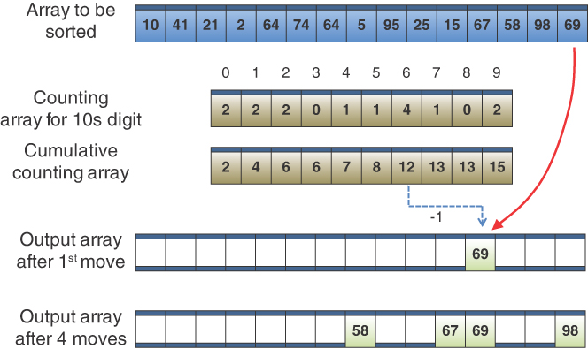

# 高级排序

在这一章当中

- 壳排序
- 分区
- 快速排序
- 基数排序
- Tim排序

我们在标题恰当的第 3 章"简单排序"中开始讨论排序。那里描述的排序——冒泡排序、选择排序和插入排序——很容易实现，但速度很慢。在第 6 章"递归"中，我们描述了归并排序。它比简单排序运行得快得多，但需要的空间是原始数组的两倍；这通常是一个严重的缺点。
本章详细介绍了两种高级排序方法：壳排序 和 quicksort。这些排序都比简单排序快得多：大约 $O(N×(log N)^{2})$ 时间的 壳排序 和 $O(N×log N)$ 时间的快速排序。这些排序都不像合并排序那样需要大量的额外空间。 壳排序 几乎与 $mergesort$ 一样容易实现，尽管快速排序是所有不需要大量内存的通用排序中最快的。
我们首先检查 壳排序。快速排序基于分区的思想，所以我们在检查快速排序本身之前单独检查它。我们以对基数排序和 Timsort 的简短描述来结束本章，它们是快速排序的完全不同的方法。

## 壳排序

壳排序以 1959 年发现它的计算机科学家 Donald L. Shell 的名字命名。它基于插入排序，但添加了一项新功能，可显着提高插入排序的性能。
壳排序适用于中型数组，具体取决于特定的实现。它不像快速排序和其他 $O(N×log N)$ 排序那么快，所以它不是非常大的集合的最佳选择。然而，壳排序比选择排序和插入排序等复杂度为 $O(N^{2})$ 的排序要快得多，而且非常容易实现。代码简短。
壳排序的最坏情况性能并不比其平均性能差很多。 （在本章的后面，我们将研究快速排序的最坏情况，除非采取预防措施，否则情况可能会更糟。）一些专家（参见附录 B 中的 Sedgewick，"进一步阅读"）建议从壳排序开始，几乎所有排序对象并更改为更高级的排序，如快速排序，只有当壳排序在实践中证明太慢时。

### 插入排序：副本过多

因为壳排序是基于插入排序的，所以你可能想回顾一下第 3 章的[插入排序](./03-简单排序.md)部分。回想一下，在插入排序的中途，标记左侧的对象被部分排序（在它们之间排序），并且右边的对象不是。该算法删除标记处的对象并将其存储在临时变量中。然后，从新空出的单元格左侧的对象开始，它一次将已排序的对象右移一个单元格，直到临时变量中的对象可以按排序顺序重新插入。
这是插入排序的问题。假设一个小对象在最右边(大对象应该在的地方)。要将这个小对象移动到左侧的适当位置，所有中间对象（在它所在的位置和它应该在的位置之间）必须向右移动一个空格。这一步需要接近 N 份，仅针对一项。并非所有对象都必须移动完整的 N 个空间，但平均对象必须移动 N/2 个空间，这意味着整个过程需要 N 次 N/2 轮班，总共 $N^{2}/2$ 个副本。因此，插入排序的性能是$O(N^{2})$。
如果你能以某种方式将较小的对象向左移动许多空间而不单独移动所有中间对象，则可以提高此性能。

### N排序

壳排序通过对间隔很宽的元素进行插入排序来实现这些大的移位。 在对它们进行排序后，壳排序会对间距较小的元素进行排序，依此类推。 这些排序的元素之间的间距称为增量，传统上用字母 h 表示。 图 7-1 显示了以 4 为增量对包含 10 个元素的钉板（数组）进行排序的过程的第一步。这里对索引 0、4 和 8 处的元素进行了排序。


图 7-1 在 0、4 和 8 处的 4 排序
在 0、4 和 8 处的钉子排序后，算法移动一个单元格并对位置 1、5 和 9 处的钉子进行排序。这个过程一直持续到所有钉子都被 4 排序，这意味着所有对象 间隔开的四个单元格在它们之间进行排序。 图 7-2 说明了这个过程，不同的面板显示了每个子集排序后的状态。


图 7-2 一个完整的 4 排序
在完整的 4 排序之后，数组可以被认为包含四个高度为 ```[3,6,9]```、```[2,5,6]```、```[4,7]``` 和 ```[6,8]``` 的子数组，每个其中已完全排序。这些子数组分别在 ```[0,4,8]```、```[1,5,9]```、```[2,6]``` 和 ```[3,7]``` 位置交错——如图中钉子的颜色所示——但除此之外独立的。
收获了什么？好吧，```h``` 排序减少了单个组中要排序的对象数量的大小。你已经对 ```N/h``` 个对象排序 ```h``` 次，而不是对 N 个对象进行排序。因为插入排序是一个复杂度为 $O(N^{2})$ 的算法，它使得 h 排序为 $O((N/h)^{2}×h) = O(N^{2}/h)$，所以这是一个改进。如果 ```h``` 很大，比如 ```N/2```，那么整体复杂度将下降到 ```O(N)```。当然，数组还没有完全排序，但请注意，对象更接近它们的最终位置。
在图 7-2 中对 10 个对象进行排序的示例中，在 4 次排序结束时，如果数组完全排序，则没有对象超过三个单元格。这就是数组"几乎"排序的含义，也是 壳排序 的秘密。通过使用"廉价"的 h 排序创建交错的、内部排序的对象集，你可以最大限度地减少完成排序必须完成的工作量。
现在，正如我们在第 3 章中提到的，插入排序在对几乎已排序的数组进行操作时非常有效。事实上，对于一个已经排序的数组，它是 $O(N)$。如果它只需要移动一个或两个单元格的对象来对数组进行排序，它可以在几乎 $O(N)$ 的时间内运行。因此，在对数组进行 4 次排序后，你可以使用普通插入排序对其进行 1 次排序。 4 排序和 1 排序的组合比没有初步 4 排序的简单应用普通插入排序要快得多。

### 缩小差距

我们已经展示了用于对 10 单元阵列进行排序的四个单元的初始间隔（或间隙）。对于较大的阵列，间隔应该大得多。然后重复减小间隔，直到变为 1。
例如，一个包含 1,000 个对象的数组可能是 364 次排序，然后是 121 次排序，然后是 40 次排序，然后是 13 次排序，然后是 4 次排序，最后是 1 次排序。用于生成间隔的数字序列（在本例中为 364、121、40、13、4、1）称为间隔序列或间隙序列。此处显示的特定区间序列归功于 Knuth（见附录 B），是一种流行的序列。相反的形式，从 1 开始，它由表达式生成
$$
h_{i}  = 3×h_{i–1} + 1
$$

其中 $h_{0}$ 的初始值为 1。表 7-1 显示了此公式如何生成序列。
表 7-1 Knuth 区间序列

|  i   | h~i~  | 3×h~i~ + 1 | (h~i~ – 1) / 3 |
| :--: | :---: | :--------: | :------------: |
|  0   |   1   |     4      |                |
|  1   |   4   |     13     |       1        |
|  2   |  13   |     40     |       4        |
|  3   |  40   |    121     |       13       |
|  4   |  121  |    364     |       40       |
|  5   |  364  |   1,093    |      121       |
|  6   | 1,093 |   3,280    |      364       |

还有其他生成间隔序列的方法； 我们稍后再讨论这个问题。 首先，让我们探索壳排序如何使用 Knuth 的序列进行工作。
在排序算法中，首先在一个短循环中使用序列生成公式来计算初始间隙。 h 的第一个值使用 1 值，并应用 $h_{i} = 3×h_{i}-1~ + 1$ 公式生成序列 1、4、13、40、121、364 等。 当间隙大于阵列时，该过程结束。 对于 1,000 个元素的数组，序列中的第七个数字 1,093 太大了。 因此，壳排序以第六大数字开始排序过程，创建 364 排序。 然后，每次通过排序例程的外循环，它都会使用先前给出的公式的倒数来减少间隔
$$
h_{i-1}  = (h_{i}–1) / 3
$$

此序列显示在表 7-1 的最后一列中。 此逆向公式生成反向序列 364、121、40、13、4、1。从 364 开始，这些数字中的每一个都用于对数组进行 h 排序。 当数组被 1-sorted 时，算法就完成了。

### AdvancedSorting 可视化工具

你可以使用 AdvancedSorting 可视化工具来查看 壳排序 的工作原理。 图 7-3 显示了 壳排序 开始时的工具并确定要使用的 h 值。


图 7-3 AdvancedSorting 可视化工具
与第3章介绍的简单排序可视化工具一样，该工具提供了单项的插入、查找、删除等常用操作。它还允许你创建新的空单元格数组，并使用随机键或增加或减少的键填充空单元格。
在观看壳排序时，你会注意到我们在前面的讨论中给出的解释略有简化。 4-sort处理的索引序列实际上并不是```[0, 4, 8]```, ```[1, 5, 9]```, ```[2, 6]```, ```[3, 7]```。相反，第一组三个元素的前两个元素被排序，然后是第二组的前两个元素，依此类推。在所有组的前两个元素排序后，算法返回并排序三元素组的最后一个元素。这就是插入排序中发生的事情；实际序列是 ```[0, 4]```, ```[1, 5]```, ```[2, 6]```, ```[3, 7]```, ```[0, 4, 8]```, ```[1, 5, 9]```。
对于算法来说，首先对每个完整的子数组进行 4 排序似乎更明显，即 ```[0, 4]```, ```[0, 4, 8]```, ```[1, 5]```, ```[1, 5, 9]```, ```[2 , 6]```, ```[3, 7]```，但该算法使用第一种方案更有效地处理数组索引。
壳排序 实际上在只有 10 个对象时效率不高，交换和比较的次数几乎与插入排序一样多。然而，对于更大的阵列，改进变得显着。
图 7-4 显示了 AdvancedSorting Visualization 工具，它以 90 个单元格的反向排序条形数组开始。 （在可视化工具中创建如此大的数组需要在使用"新建"按钮之前使窗口更宽。）"递减填充"按钮用图中顶行的值填充空单元格。第二行显示的是经过 40 次完全排序后的数组。在左侧，外部和内部索引设置为它们在 13 排序开始时的值。 13 排序中要比较的前两个单元格从其正常位置降低，以显示正在检查的单元格。第三行显示 4 排序的开始。


图 7-4 在 90 单元阵列中进行 40 次排序和 13 次排序之后
随着 h 的每个新值，数组变得更接近最终排序。 40 组在图 7-4 的第二行中很清楚。前 10 项是整个数组中最短的。它们来自 40 排序期间初始数组的前 10 项。接下来的 40 个单元格组分别有 30 个和 10 个递减键。 30 次运行来自索引 ```[11, 51]``` 等子数组上的 40 次排序。它们保持键递减的总体趋势，但每个子阵列现在都按递增顺序排列。当你到达图中最后一行开始的 4 排序时，整体趋势现在看起来总体上呈上升趋势。现在每个对象都在其最终位置的 13 个单元格内。在 4 排序之后，每个对象都将在其最终位置的四个单元格内。
为什么壳排序比插入排序快得多？如前所述，当 h 很大时，每次通过的对象数量很少，对象移动的距离很长。这种排序非常有效。随着 h 变小，每遍的对象数增加，但对象已经更接近它们最终排序的位置，这对于插入排序来说更有效。正是这些趋势的结合使壳排序如此有效。
请注意，后面的排序（h 值较小）不会取消前面排序（h 值较大）的工作。例如，经过 40 次排序的数组在 13 次排序后仍保持 40 次排序。如果不是这样，壳排序 就无法工作。

### 壳排序的 Python 代码

壳排序的 Python 代码不比第 3 章中所示的插入排序复杂。当然，关键区别在于添加了 h 区间并确保程序采用 h 个元素而不是 1 个元素。这里，我们将一个 ```ShellSort()``` 方法添加到 ```Array``` 类（在 SortArray.py 模块中定义）并将其放入 ShellSort.py 模块中，如清单 7-1 所示。
第一部分设置初始 h 值。从 1 开始，它按照 Knuth 的序列递增 h，只要它保持在数组大小的三分之一以下。添加了一个变量 ```nShifts``` 来计算排序期间执行的移位操作的次数。这不是真正必要的，但有助于说明和检测特定阵列的实际复杂性。
主循环遍历 h 值，通过 Knuth 序列将其递减，直到低于 1。修改后的插入排序算法出现在主循环内。这次，```outer``` 从 h 开始。那是第一个尚未排序的单元格的索引（记住外部下面的每个单元格——以 h 为增量步进——已经排序）。 ```outer``` 的值作为标记项存储在 ```temp``` 中。内部循环然后将其索引 ```inner``` 设置为从外部开始并向后工作以降低索引，步长为 h。在内部循环发现 ```inner``` 已达到此 ```h-sort``` 的最后一个可能索引或标记项 ```temp``` 大于或等于 ```inner-h``` 单元格中的内容后，就停止。当内部循环向后移动时，它会移动它通过的单元格的内容（其中标记的对象小于内部 - h 的值）。它会相应地增加 ```nShifts``` 计数器，并在内部循环结束时再次这样做，如果有必要将标记的对象从 ```temp``` 移回数组。
清单 7-1 ShellSort.py 模块

```python
import SortArray


class Array(SortArray.Array):  # Base new Array class on SortArray
    def ShellSort(self):  # Sort using Shell's method:
        h = 1  # Choose h to sort every h items
        while 3 * h + 1 < len(self):  # Use Knuth's h sequence, find
            h = 3 * h + 1  # largest h less than array length
        nShifts = 0  # Count number of shifts
        while h > 0:  # Loop over decreasing h values
            for outer in range(h, len(self)):  # Mark one item
                temp = self.get(outer)  # Store marked item in temp
                inner = outer  # Inner loop starts at mark
                while inner >= h and temp < self.get(inner - h):  # If marked
                    self.set(inner, self.get(inner - h))  # item smaller, then
                    inner -= h  # shift item to right
                    nShifts += 1  # Count shift
                if inner < outer:  # If inner loop advanced a step, then
                    self.set(inner, temp)  # Move marked item to 'hole'
                    nShifts += 1  # and count the shift
            h = (h - 1) // 3  # Reduce h to sort smaller intervals
        return nShifts  # Return number of shifts
```

完成第一轮后，外部变量递增 1 以移动到下一个 h 排序组。 就第一个例子而言，这意味着从 ```[0, 4]``` 子序列到 ```[1, 5]``` 子序列。 将 ```outer``` 递增 1 直到数组的长度最终覆盖更长的子序列，如 ```[0, 4, 8]```，```[1, 5, 9]```，等等。 最外面的 ```while``` 循环按照 Knuth 的公式减少 h，以在较小的增量上执行 h 排序。
壳排序算法虽然只用了几行代码就实现了，但并不容易理解。 这是使用一些打印语句运行它的示例输出：

```python
$ python3 ShellSortClient.py
Array containing 100 items:
 [77, 94, 59, 85, 61, 46, 62, 17, 56, 37, 18, 45, 76, 21, 91, 7, 96, 50, 31, 69, 80,
69, 56, 60, 26, 25, 1, 2, 67, 46, 99, 57, 32, 26, 98, 51, 77, 34, 20, 81, 22, 40,
28, 23, 69, 39, 23, 6, 46, 1, 96, 51, 71, 61, 2, 34, 1, 55, 78, 91, 69, 23, 2, 8,
3, 78, 31, 25, 26, 73, 28, 88, 88, 38, 22, 97, 9, 18, 18, 66, 47, 16, 82, 9, 56, 45,
15, 76, 85, 52, 86, 5, 28, 67, 34, 20, 6, 33, 83, 68]
initArray().ShellSort() took 0.1190280788578093 seconds
Sorted array contains:
 [1, 1, 1, 2, 2, 2, 3, 5, 6, 6, 7, 8, 9, 9, 15, 16, 17, 18, 18, 18, 20, 20, 21, 22,
22, 23, 23, 23, 25, 25, 26, 26, 26, 28, 28, 28, 31, 31, 32, 33, 34, 34, 34, 37, 38,
39, 40, 45, 45, 46, 46, 46, 47, 50, 51, 51, 52, 55, 56, 56, 56, 57, 59, 60, 61, 61,
62, 66, 67, 67, 68, 69, 69, 69, 69, 71, 73, 76, 76, 77, 77, 78, 78, 80, 81, 82, 83,
85, 85, 86, 88, 88, 91, 91, 94, 96, 96, 97, 98, 99] and took 565 cell shifts
```

现在你已经查看了代码，回到 AdvancedSorting Visualization 工具并了解其操作的详细信息，逐步完成对 10 项数组进行可排序的过程。可视化使得更容易看到子数组上发生的插入排序。

### 其他间隔序列

选择间隔序列有点像魔法。到目前为止，我们的讨论使用公式 $h_{i+1} = h_{i}×3 + 1$ 来生成区间序列，但其他区间序列已被使用并取得了不同程度的成功。唯一的绝对要求是递减序列以 1 结尾，所以最后一遍是正常的插入排序。
Shell 最初建议初始间隙为 $N/2$，每次通过时将其简单地分成两半。因此，```N=100``` 的递减序列为 ```50, 25, 12, 6, 3, 1```。这种方法的优点是简单，其中初始间隙和后续间隙都可以通过除以 2 来找到。这个序列结果是不是最好的。尽管对于大多数数据它仍然优于插入排序，但它有时会退化为 $O(N^{2})$ 运行时间，这并不比插入排序好。
这种方法的一个变体是将每个间隔除以 2.2 而不是 2，然后截断结果。对于 ```n=100```，这会导致 ```45, 20, 9, 4, 1```。这种方法比除以 2 要好得多，因为它避免了一些导致  行为$O(N^{2})$的最坏情况。需要一些额外的代码来确保序列中的最后一个值为 1，无论 N 是多少。这种变体给出的结果与代码中显示的 Knuth 序列相当。
Bryan Flamig 建议的降序的另一种可能性是

```python
if h < 5:
    h = 1
else:
    h = (5 * h - 1) // 11
```

通常认为区间序列中的数字互质是很重要的；也就是说，它们除了 1 之外没有公约数。这个约束使得每次通过都更有可能混合在前一次通过中排序的所有对象。壳牌最初的 $N/2$ 序列效率低下是因为它没有遵守这条规则。
你可以发明自己的间隙序列，其效果与所示的一样好（甚至可能更好）。不管是什么，都应该快速计算，以免减慢算法速度。

### 壳排序的效率

目前还没有人能够从理论上分析壳排序的平均效率，特殊情况除外。根据实验，有各种估计，范围从 $O(N^{3/2})$ 到 $O(N^{7/6})$。对于 Knuth 的间隙序列，最坏情况下的性能是 $O(N^{3/2})$。
表 7-2 在阴影行中显示了壳排序的一些估计值(与较慢的插入排序和较快的快速排序相比)。显示了对应于各种 N 值的理论时间。请注意，$N^{x/y}$ 表示 $N$ 的 $y$ 次根的 $x$ 次方。因此，如果 N 为 100，则 $N^{3/2}$ 为 $100^{3}$ 的平方根，即 1,000。我们使用 $log_{10}$ 而不是 $log_{2}$，因为它更容易显示它如何应用于 1,000 和 10,000 等值。此外，$(log N)^{2}$ 表示 N 的平方的对数。这通常写为 $log^{2}N$，但这很容易与 $log_{2}N$ 混淆，$log_{2}N$ 是 N 的以 2 为底的对数。
表 7-2 壳排序运行时间的估计

|       O()       |        排序类型        | 10 Items | 100 Items | 1,000 Items | 10,000 Items |
| :-------------: | :--------------------: | :------: | :-------: | :---------: | :----------: |
|     $N^{2}$     |     插入排序, 等.      |   100    |   10000   |  1,000,000  | 100,000,000  |
|    $N^{3/2}$    |         壳排序         |    32    |   1000    |   31,623    |  1,000,000   |
| $N×(log N)^{2}$ |         壳排序         |    10    |    400    |    9,000    |   160,000    |
|    $N^{5/4}$    |         壳排序         |    18    |    316    |    5,623    |   100,000    |
|    $N^{7/6}$    |         壳排序         |    14    |    215    |    3,162    |    46,416    |
|    $N×log N$    | 快速排序, Timsort, 等. |    10    |    200    |    3,000    |    40,000    |

对于大多数应用，规划 $N^{3/2}$ 的最坏情况是最好的方法。
你可能还想知道查找初始间隙值 h 的循环的效率。如果该循环花费很长时间，就会影响 壳排序 的整体复杂性。请注意，循环比 $O(N)$ 更快，因为它必须尝试少于 N 个值才能找到初始 h。因为 $O(N)$ 的复杂度低于 $O(N×(log N)^{2})$、$O(N^{3/2})$ 和 $O(N^{7/6})$，所以它不会影响整体复杂度。因为试验 h 值大约增长 $3^{S}$，其中 S 是初始循环中的步数，总步数约为 $log_{3}S$。初始值也可以从公式 $h_{S} = (3^{S} – 1) / 2$ 和在 $h_{S} <= N/3$ 处求解。

## 分区

分区是快速排序的底层机制，我们接下来会探讨它，但它本身也是一个有用的操作，所以我们在它自己的部分中介绍它。
分区数据就是把它分成几组。在排序的情况下，结果是两组，因此键值大于指定数量的所有对象在一组中，而键值较低的所有对象在另一组中。
你可以很容易地想象要对数据进行分区的情况。也许你想将你的团队成员分为两组：身高超过 1.75 米的组和矮于 1.75 米的组。医学测试可能需要根据如图 7-5 所示的数据，根据细胞集落的大小将其分为两组。菌落的相对数量可以表明是否存在病症或疾病。


图 7-5 按大小划分细胞集落

### 分区过程

AdvancedSorting 可视化工具有一个分区按钮，可将数组项重新排列为两组。 你提供区分这些组的值。
图 7-6 显示了对 10 元素数组进行分区的示例。 顶行显示初始数组内容。 在文本输入框中输入 50 并选择分区后，该工具将动画化对象的分区过程。 输入的键 50 称为主元值。 该工具通过在数组中的矩形上显示一条虚线来说明该值，如图的第二行所示。 枢轴线也标有 ```[0, 9]``` 以指示它正在划分从单元格 0 到单元格 9 的所有单元格。


图 7-6 在 AdvancedSorting 可视化工具中对 10 元素数组进行分区
动画从范围两端的几个索引指针开始。这些索引向中心移动，搜索不按分区顺序排列的数组项——也就是说，一个值低于左边的主元，一个值高于右边的主元。当它找到这样的一对时，它会交换它们。当这两个索引最终相遇时，这个过程就完成了。
在图 7-6 中，两端的对象 77 和 37 首先被交换，因为它们都位于枢轴的错误一侧。然后 ```lo``` 索引前进到第 94 项，```hi``` 索引向左移动，跳过 ```56```，因为它在枢轴上方，并停在 17。第 94 和 17 项交换位置，将 56 留在其原始位置。索引将一个更靠近中间并继续在错误的分区中寻找一对对象。 ```lo``` 索引在对象 59 处停止，而 ```hi``` 索引在 46 处停止。这对被交换并且搜索恢复。
59-46 对结果是最后需要将它们全部分开。现在数组的前三项都在枢轴 (50) 下面，最后七项在它上面。该工具绘制指向对象 85（索引 3）的箭头以显示较高分区的开始位置。
当你查看初始数组时，很难看出分区将落在何处。当然，这取决于选择的支点，并且只有通过交换过程才会变得明显。例如，如果 90 是主元，则只有第 94 项需要在高分区中，并且该过程将在交换 37 和 94 之后完成。事实上，如果你碰巧选择了某些主元值，可能根本就没有任何对象需要交换。但是，即使发生这种情况，你仍然需要找到较高分区的最低索引。这是这个过程的输出。
如果主元是某个极值，如 –10 或 212，则整个数组将位于同一分区中。如果它太低，那么结果索引将为 0；如果它太高，它将以 ```nItems``` 结束。让我们看看如何选择枢轴值，因为它会极大地影响结果。
分区后，数据并没有排序；它被简单地分为两组。然而，它比以前更有序了。你可以使用该改进以不同的分区对其进行完全排序，其方式类似于 壳排序 使用 h 排序的方式。尝试在 AdvancedSorting 可视化工具中使用不同的枢轴运行更多的分区。最终，整个数组将被排序。当数据排序后，分区仍然可以运行，但它不会交换任何对象（除了在我们稍后讨论的极少数情况下）。
请注意，分区并不稳定。也就是说，每个组的顺序与原来的顺序不同。事实上，分区往往会颠倒每组中具有相同值键的某些数据的顺序。尝试将一些具有重复键的对象插入到数组中并打乱它们的位置。你能找到一个在分区后改变它们顺序的枢轴值吗？

### 通用分区算法

分区过程是如何进行的？我们一般讨论它是因为它在快速排序之外很有用。 AdvancedSorting 可视化工具中显示的示例只是其中一种。然而，这个例子有助于说明一些重要的特征。
首先，请注意分区是通过重新排列对象在数组中的位置来完成的。这意味着你不需要为所有数据的另一个副本分配内存，这对于大型集合非常有用。
必须有一些可以对确定它所属的分区的对象执行的测试。在一般情况下，它可以是任何测试，例如对象名称是否包含字母 e。对于排序，你使用一个枢轴值并将键值小于该枢轴的所有内容放在一个分区中，将其他所有内容放在另一个分区中。枢轴不必是数字；它可以是任何值，只要可以比较两个值以确定一个值是否小于另一个值即可。使用对一个分区返回 0 而对另一个分区返回 1 的分区测试函数的一般情况有时很有用。
与插入排序一样，当应用于已排序的数组时变为 ```O(N)```，如果数组已经分区，则将算法设计为快速是有利的。为此，我们可以有一个指向数组的指针，其中已知左侧的所有单元格都位于较低的分区中。它将从索引 0 开始，表示最初不知道该分区中有任何内容。同样，我们设置第二个指针，其中右侧的所有单元格都在较高的分区中。我们将其初始化为数组的最后一个元素，因为也没有已知元素位于该分区中。这个想法是在将对象移动到适当的分区时缩小左右指针之间的范围。
算法核心如下：

- 递增左索引，直到我们找到属于上分区的单元格，或者它满足右索引。
- 递减右索引，直到我们找到属于下分区的单元格，或者它满足左索引。
- 如果左索引在右索引上方，则数组已经分区，因此我们可以将左索引作为下分区的末尾返回。
- 否则，交换左右索引处的对象并划分左右之间的范围。

正如第 6 章中所讨论的，该算法可以设置为递归算法，该算法适用于数组越来越小的子范围。清单 7-2 显示了作为 ```Array``` 类递归方法的实现。与适用于记录的其他排序算法一样，你可以使用键函数从数组中的对象中提取键，并根据该值与枢轴值的关系进行分区。与其他一些算法不同，它允许其键与枢轴完全匹配的对象位于任一分区中。我们在上市后解释该选择的优势。
清单 7-2 Quicksort.py 模块的递归分区方法

```python
import SortArray


def identity(x):
    return x  # Identity function


class Array(SortArray.Array):  # Base new Array class on SortArray
    def partition_rec(  # Recursively partition array moving
        self,  # items whose keys are below or equal
        pivot,  # a pivot value to the left/low side
        lo=0,  # the rest to the right/high side
        hi=None,  # within the [lo, hi] range (inclusive)
        key=identity,
    ):  # Use key function to extract keys
        if hi is None:  # Default hi value is last index
            hi = len(self) - 1  # Everything above hi is in upper part
        while (
            lo <= hi and key(self.get(lo)) < pivot  # Increment lo until it goes past hi
        ):  # or we find a key that's not
            lo += 1  # in the lower partition
        while lo < hi and pivot < key(  # Decrement hi until it matches lo
            self.get(hi)
        ):  # or we find the pivot or
            hi -= 1  # a key not in the upper partition
        if lo >= hi:  # If lo is at or above hi, then the
            return lo  # lower partition ends at lo
        self.swap(lo, hi)  # Otherwise, swap the items at lo & hi
        return self.partition_rec(  # and recursively partition remaining
            pivot, lo + 1, hi - 1, key
        )  # items in the array

```

```partition_rec()``` 方法首先填充 ```hi``` 的默认值，```hi``` 是上分区之前数组的索引。一开始，这是数组的最后一个索引。较低的索引 ```lo``` 从 0 开始，表示未发现数组中的任何单元格都具有低于主元的键。 ```lo``` 和 ```hi``` 之间的单元格需要划分并形成要收缩的范围。
第一个 ```while``` 循环实现了核心算法的第一步。它递增 ```lo``` 直到 ```lo``` > ```hi``` 或 ```lo``` 处的单元格具有大于或等于主元的键，这意味着它属于上分区。第二个 ```while``` 循环实现递减 ```hi``` 的第二步，直到它超过 ```lo``` 或 ```hi``` 处的单元格有一个键指示它应该在较低的分区中。
请注意，两个 ```while``` 循环中的比较略有不同。第一个循环必须使用 ```lo <= hi``` 而不是 ```lo < hi``` 以确保对照主元检查 ```lo``` 处的值，如果范围内只有一个单元格，即 ```lo == hi```，则 ```lo``` 递增。如果整个数组属于较低的分区，则增加 ```lo``` 以指向 ```hi``` 很重要。在第一个循环条件中使用 ```lo < hi``` 将意味着未进入循环体，并且 ```lo``` 可能最终指向一个键位于枢轴下方的单元格。但是，第二个循环在其循环条件中使用 ```lo < hi```，因为当 ```lo == hi``` 时，你知道该索引处的单元格必须属于上分区。
移动 ```lo``` 和 ```hi``` 以缩小未检查单元格的范围后，```if``` 语句检查范围的长度是一个还是更少的单元格。如果是这样，则没有什么可交换的，它可以返回 ```lo``` 作为下分区上方的索引。这是此递归算法的基本情况。如果范围大于 1，则交换 ```lo``` 和 ```hi``` 的值（使用第 3 章的 ```SortArray``` 类中定义的 ```swap()``` 方法）。递归调用划分两个交换值之间的范围。
将分区算法的递归版本转换为循环版本比一般情况更容易。它更简单的原因是

- 除了将递归调用的返回值返回给调用者之外，该程序不对递归调用的返回值执行任何操作，并且
- 参数的值——```pivot```、```lo``` 和 ```hi```——不需要在调用之间保存和恢复。

有了这两个条件，你就不需要一堆问题描述了；随着要检查的单元格范围减少，你只需要更新 ```lo``` 和 ```hi``` 变量。清单 7-3 显示了方法 ```partition()``` 的循环版本。
清单 7-3 Quicksort.py 模块的基于循环的分区方法

```python
import SortArray


def identity(x):
    return x  # Identity function


class Array(SortArray.Array):  # Base new Array class on SortArray
    def partition(  # Loop to partition array, moving
        self,  # items whose keys are below or equal
        pivot,  # a pivot value to the left/low side
        lo=0,  # the rest to the right/high side
        hi=None,  # within the [lo, hi] range (inclusive)
        key=identity,
    ):  # Use key function to extract keys
        if hi is None:  # Default hi value is last index
            hi = len(self) - 1  # Everything above hi is in upper part
        while lo <= hi:  # Loop until no more items to inspect
            while (
                lo <= hi
                and key(self.get(lo)) < pivot  # Increment lo until it goes past hi
            ):  # or we find a key that's
                lo += 1  # not in the lower partition
            while lo < hi and pivot < key(  # Decrement hi until it matches lo
                self.get(hi)
            ):  # or we find the pivot or
                hi -= 1  # a key not in the upper partition
            if lo >= hi:  # If lo is at or above hi, then the
                return lo  # lower partition ends at lo
            self.swap(lo, hi)  # Otherwise, swap the items at lo & hi
            lo, hi = lo + 1, hi - 1  # Continue partitioning in between
        return lo  # Range to partition is now empty
```

在基于循环的方法中，```lo``` 和 ```hi``` 参数成为在开始时初始化的局部变量。 代替递归调用，添加了一个新的外部 ```while``` 循环，该循环迭代直到 ```[lo, hi]``` 范围变空。 在该循环内部，逻辑几乎与递归版本相同。 ```lo``` 和 ```hi``` 指数像以前一样上下移动。 接下来的三行代码——检查剩余范围的大小，如果范围太小则返回 ```lo```，并交换 ```lo``` 和 ```hi``` 的值——与递归版本相同。 区别在于更新 ```lo``` 和 ```hi``` 的末尾（它们在递归调用中的更改方式），如果外部循环以空范围结束，则有一个 ```return lo``` 语句。
在具有两个不同主元的 10 元素数组上测试分区方法显示：

```python
Initialized array contains [77, 94, 59, 85, 61, 46, 62, 17, 56, 37]
Partitioning an array of size 10 around 61 returns 5
                                                V
Partitioned array contains [37, 56, 59, 17, 46, 61, 62, 85, 94, 77]

Initialized array contains [37, 56, 59, 17, 46, 61, 62, 85, 94, 77]
Partitioning an array of size 10 around 46 returns 2
                                    V
Partitioned array contains [37, 17, 59, 56, 46, 61, 62, 85, 94, 77]
```

输出中的```V```指向上分区第一个```cell```的索引，即```partition()```方法返回的索引。可以看到分区成功：返回索引左边的数字分别小于61和46的主元值。请注意，分区的大小取决于枢轴的选择。只有那些必须交换的数组单元受到影响，例如，在第二个例子中只有 17 和 56 的值以 46 为中心。第一个分区已经交换了 77 和 37、94 和 56、85 和 17，并且61 和 46。

### 相等的键

需要注意的是，键与枢轴匹配的项是进入较低分区还是较高分区并不重要。枢轴值是两个分区之间的分界线。具有等于枢轴的键的对象可以被认为属于任何一个。
在清单 7-3 中的 ```partition()``` 方法中，递增 ```lo``` 和递减 ```hi``` 索引的两个循环在找到以枢轴作为其键的对象时停止（除了找到属于相反分区的对象）。如果在经过两个循环后索引不同，则交换它们索引的对象。如果两个对象的键都等于主元，则无需交换它们。那么，如果算法找到相等的键，它不应该跳过交换吗？答案不是那么简单。
添加这样的测试将在循环中放置另一个比较，该循环将在外循环的每次迭代中运行一次。它将节省交换的费用，但前提是数据具有相等值的键，并且两者都等于主元。一般来说，这不太可能发生。此外，只有在交换数组中的两个对象的成本远高于比较键的成本时，它才会节省大量时间。
还有另一个更微妙的理由来交换对象，即使一个或两个对象的键等于枢轴。如果该算法总是将其键与枢轴匹配的对象放在一个分区中，比如较高的分区，那么它可以在寻找要交换的对象时递减这些对象的 ```hi``` 索引。这样做会将最终的分区索引移动到可能的最低值并最大限度地减少交换。正如后面关于快速排序的部分所讨论的，分区索引在数组的中间结束是好的，而在末端结束是非常糟糕的。这个想法有点类似于二进制搜索：将范围分成两半是最有效的，因为它限制了要搜索的剩余范围的最大大小。

### 分区算法的效率

分区算法运行时间为 $O(N)$。在可视化工具中运行分区操作时，很容易看出为什么会这样：两个指针从数组的两端开始并相互移动，移动时停止并交换。当他们相遇时，分区就完成了。数组的每个单元最多被访问一次，要么被 ```lo``` 指针访问，要么被 hi 指针访问。如果要划分的项数是原来的两倍，指针将以相同的速率移动，但要比较和交换的项数将是原来的两倍，因此该过程将花费两倍的时间。因此，运行时间与 N 成正比。
更具体地说，对 N 元胞数组进行分区会在键和主元值之间进行恰好 N 次比较。你可以通过查看调用 ```key()``` 函数的代码及其与基准值的比较来了解这一点。一项测试是针对 ```lo``` 指针的对象，另一项是针对 ```hi``` 指针的对象。因为在这些比较之前检查了 ```lo``` 和 ```hi```，所以你知道要么 ```lo < hi``` 要么与 ```pivot``` 和 ```key``` 在 ```hi``` 的比较不会发生。 ```lo``` 和 ```hi``` 值的范围遍及所有 N 个单元格。
```lo``` 和 ```hi``` 指针相互比较 ```N + 2``` 次，因为每次主元比较都必须成功进行比较，并且当它们找到要交换的对或找到彼此时，它们都必须失败。比较的次数与数据的排列方式无关（过程结束时一两次额外比较之间的不确定性除外）。
然而，交换次数确实取决于输入数据的排列方式。如果它是逆序的，并且主元值将对象分成两半，那么每对值都必须交换，即 $N/2$ 次交换。
对于随机数据，分区中的交换次数少于 $N/2$，即使主元值是这样的，一半的对象较短，一半较高。原因是有些对象已经在正确的位置（可视化中左边的短条，右边的高条）。如果枢轴值高于（或低于）大多数对象，则交换次数会更少，因为只有那些高于（或低于）枢轴的对象需要交换。平均而言，对于具有随机主元的随机数据，大约会发生最大交换次数的一半。
虽然交换比比较少，但它们都与 N 成正比。因此，整个分区过程在 $O(N)$ 时间内运行。

## 快速排序

快速排序是一种流行的排序算法，并且有充分的理由：在大多数情况下，它是最快的，运行时间为 $O(N×log N)$，并且只需要 $O(log N)$ 的额外内存。 C. A. R. (Tony) Hoare 在 1962 年发现了快速排序。
要理解快速排序，你应该熟悉上一节中描述的分区算法。基本上，快速排序算法通过将一个数组划分为两个子数组然后递归地调用自身对每个子数组进行快速排序来运行。但是，要对这个基本方案进行一些修饰。它们与枢轴的选择和小分区的排序有关。在查看主要算法的简单版本后，我们将检查这些改进。
在理解快速排序是如何工作之前，很难理解快速排序在做什么，因此我们颠倒了通常的演示，在展示可视化工具之前展示了快速排序的 Python 代码。

### 基本快速排序算法

基本递归快速排序方法的代码相当简单。清单 7-4 显示了该算法的草图。
清单 7-4 Python 中快速排序算法的草图

```python
def quicksort_sketch(  # Sort items in an array between lo
    self, lo=0, hi=None, key=identity  # and hi indices using Hoare's
):  # quicksort algorithm on the keys
    if hi is None:  # Fill in hi value if not specified
        hi = len(self) - 1
    if lo >= hi:  # If range has 1 or fewer cells,
        return  # then no sorting is needed

    pivot = self.choosePivot(lo, hi)  # Choose a pivot

    hipart = self.partition(  # Partition array around the key
        key(pivot), lo, hi, key  # of the item at the pivot index and
    )  # record where high part starts

    self.quicksort_sketch(lo, hipart - 1, key)  # Sort lower part
    self.quicksort_sketch(hipart, hi, key)  # Sort higher part
```

如你所见，有五个基本步骤：

1. 检查基本情况，如果 ```[sub]``` 数组足够小则返回。
2. 选择一个枢轴。
3. 围绕枢轴将子数组分成较低和较高的部分。
4. 进行递归调用以对下部进行排序。
5. 进行另一个递归调用以对较高部分进行排序。

与其他递归算法相比，第一行应该看起来很熟悉。与清单 7-2 中的 ```partition_rec()``` 方法一样，```lo``` 和 ```hi``` 索引是要排序的数组的最左边和最右边的单元格。如果调用者未提供，则将它们设置为完整数组的第一个和最后一个单元格。对基本情况的测试涉及查看是否有两个或更多单元格需要排序。如果有 1 或 0，则不需要排序，方法立即返回。
该草图显示了对 ```choosePivot()``` 的调用以选择子数组中的枢轴项。我们马上回到那个选择，但现在，假设它随机选择 ```lo``` 和 ```hi``` 单元格之间的一项。分区后，左侧子数组中的所有项，在 ```hipart``` 以下，都小于或等于右侧的所有项。如果你随后对左子数组和右子数组进行排序，则整个数组将被排序。你如何对这些子数组进行排序？通过递归调用这个方法。
当在基本情况以外的情况下调用 ```quicksort_sketch()``` 时，算法会选择一个枢轴值并调用 ```partition()``` 方法（如上一节所述）对其进行分区。此方法返回较高分区中第一个单元格的索引号。该索引存储在 ```hipart``` 变量中，用于确定要递归排序的子数组。这种情况如图 7-7 所示，其中"随机"选择了 38 的主元。


图 7-7 在对 ```quicksort_sketch()``` 的一次调用中进行分区
请注意，枢轴不一定最终会移动到其分区的开头或结尾。它也不总是停留在开始的地方。子数组划分后，```quicksort_sketch()``` 递归调用自身，一次是针对其数组的较低部分，从 ```lo``` 到 ```hipart - 1```，一次是针对较高部分，从 ```hipart``` 到 ```hi```。这些调用将枢轴对象（和所有其他对象）移动到它们的排序位置。

### 选择枢轴值

快速排序算法应该使用什么主元值？以下是一些相关的想法：

- 枢轴值应该是实际数据项的键值；此项也称为枢轴。至少，避免键范围之外的极值可以防止创建空分区，但它也允许进行一些其他优化。
- 你可以任意选择一个数据项作为枢轴。为简单起见，你始终可以选择要分区的子数组右端的对象。
- 分区之后，如果主元插入到下子数组和上子数组之间的边界处，它将处于最终排序的位置。

最后一点听起来不太可能，但请记住，因为枢轴的键值用于对数组进行分区，所以在调用 ```partition()``` 之后，较低的子数组包含键等于或小于枢轴的项，而右边的子数组包含键等于或大于的对象。如果枢轴可以以某种方式放置在这两个子数组之间，那么它就会位于正确的位置，即位于其最终排序的位置。图 7-8 显示了枢轴示例值为 38 时的情况。


图 7-8 在子数组之间移动主元
这个图有点离奇，因为你不能像所示那样实际分割数组，至少在不复制大量单元格的情况下不能。那么如何将枢轴移动到适当的位置呢？
你可以将左侧子数组中的所有对象移动到左侧的一个单元格中，以便为枢轴腾出空间。然而，这种方法效率低下且不必要。你可以选择枢轴作为数组中的任何对象。如果你选择最右边的一个并将所有内容都划分到它的左边，那么你可以简单地将枢轴与 ```hipart``` 索引的对象交换——如图 7-9 所示的较高部分的最左边。事实上，这样做会使数组更接近完全排序。此交换将枢轴置于左右组之间的适当位置。 75 被切换到枢轴所在的位置，并且因为它仍然在右（更高）组中，所以分区没有受到干扰。请注意，在选择子数组最右边的单元格时——```hi``` 索引处的单元格——它必须被排除在 ```partition()``` 方法重新组织的范围之外，因为它不应该被交换为任何其他对象。


图 7-9 从右侧交换枢轴
类似地，枢轴可以被选为最左边的单元格，然后交换到 ```hipart``` 左侧的位置。在任何一种情况下，如果分区分别在较高或较低分区中没有留下任何单元格，则可能不需要交换。因为枢轴可以放在任何一个分区中，所以这些方法可以用来保证在较高或较低的分区中分别至少有一个单元格。
将枢轴与较高分区开始处的值交换可确保枢轴最终位于其最终静止位置。所有后续活动都将在其一侧或另一侧发生，但枢轴本身不会再次移动。事实上，你可以在递归调用中将其从子范围中排除，以对更高的范围进行排序——例如：

```python
self.quicksort_sketch(lo, hipart - 1, key) # Sort lower part
self.quicksort_sketch(hipart + 1, hi, key) # Sort higher part
```

通过从后续处理中删除该单元格，该算法可确保子范围始终递减。要看到这一点，请考虑 ```hipart``` 的范围。它可以有从 ```lo``` 到 ```hi``` 的任何值（但不是 ```hi + 1```，因为你选择的枢轴等于 ```hi``` 处的键）。在这些极值处，其中一个递归子范围将是空的，而另一个将比原始的低到高范围少一个单元格——```[lo, hi – 1]``` 或 ```[lo + 1, hi]```。
我们可以利用总是至少有一个对象属于高分区的约束来优化分区算法。该约束意味着可以简化对第一个循环结束的测试——前进到 ```lo``` 以找到更高分区项的循环。它不再需要检查 ```lo <= hi```，因为当 ```lo == hi``` 时，检查 lo 处的键与主元的测试的第二部分必须失败。虽然这个比较测试可能看起来微不足道，但它发生在可能很长的计算的最内层循环中，因此在这里节省一些操作会产生很大的影响。在以下部分中，完整实施还有一些改进。

### 第一个快速排序实现

为了充实前面显示的草图的修饰，我们在清单 7-5 中提供了一个工作版本，称为 ```qsort()``` 方法。该方法捕获了刚刚描述的算法及其修改后的分区方法。
清单 7-5 改进了分区的 ```qsort()``` 方法

```python
import SortArray


def identity(x):
    return x  # Identity function


class Array(SortArray.Array):  # Base new Array class on SortArray
    def __partition(  # Private function partitions array by
        self,  # items whose keys are below or equal
        pivot,  # a pivot value to the left/low side
        lo,  # the rest to the right/high side
        hi,  # within the [lo, hi] range (inclusive)
        key=identity,
    ):  # knowing at least one key == pivot
        while lo <= hi:  # Loop until no more items to inspect
            while (
                key(self.get(lo)) < pivot  # Increment lo until we find a key
            ):  # that's not in the lower partition
                lo += 1  # Knowing pivot == one key in [lo,hi+1]
            while lo < hi and pivot < key(  # Decrement hi until it matches lo
                self.get(hi)
            ):  # or we find the pivot or
                hi -= 1  # a key not in the upper partition
            if lo >= hi:  # If lo is at or above hi, then the
                return lo  # lower partition ends at lo
            self.swap(lo, hi)  # Otherwise, swap the items at lo & hi
            lo, hi = lo + 1, hi - 1  # Continue partitioning in between
        return lo  # Range to partition is now empty

    def qsort(  # Sort items in an array between lo
        self, lo=0, hi=None, key=identity  # and hi indices using Hoare's
    ):  # quicksort algorithm on the keys
        if hi is None:  # Fill in hi value if not specified
            hi = len(self) - 1
        if lo >= hi:  # If range has 1 or fewer cells,
            return  # then no sorting is needed
        pivot_i = hi  # Choose pivot index to be rightmost
        pivotItem = self.get(pivot_i)  # Get item at pivot index
        hipart = self.__partition(  # Partition array around the key
            key(pivotItem), lo, hi - 1, key  # of the item at the pivot index and
        )  # record where high part starts
        if hipart < pivot_i:  # If pivot index is above high
            self.swap(  # part start, then swap pivot item
                hipart, pivot_i
            )  # with high part start
        self.qsort(lo, hipart - 1, key)  # Sort lower part
        self.qsort(hipart + 1, hi, key)  # Sort higher part
```

因为分区方法现在依赖于始终作为 ```lo``` 和 ```hi``` 之间单元格之一的键的枢轴值，所以我们将其设为私有方法 ```__partition()```，以便该 ```Array``` 类的用户无法调用它其他一些枢轴值。通过取消对 ```lo <= hi``` 的测试，改进出现在 ```__partition()``` 的第二个 ```while``` 循环中。它仍然需要在第三个 ```while``` 循环中测试 ```lo < hi```，因为不能保证它在运行到 ```lo``` 之前会在下分区中找到一个对象。如果枢轴值是整个数组中最低的键并且不同，则所有项都将满足```pivot < key(self.get(hi))``` 测试。因为这是一个仅由 ```qsort()``` 调用的私有方法，我们还可以删除 ```lo``` 和 ```hi``` 参数的默认值，因为 ```qsort()``` 方法始终提供它们。
```qsort()``` 方法仍然是递归的（尽管如你所见，它可以转换为基于循环的算法）。它在不同的变量 ```pivot_i``` 和 ```pivotItem``` 中跟踪枢轴对象的索引和对象本身。它用一个简单的赋值替换了对 ```choosePivot()``` 的调用，以略微提高效率。因为枢轴是最右边的对象，所以它调用范围为 ```[lo, hi – 1]``` 的私有 ```__partition()``` 方法以防止枢轴被交换。分区后，它交换枢轴项和较高分区开头的项。仅当枢轴索引高于该部分的第一个索引 ```hipart``` 时才需要进行该交换。该方法以对较低部分和较高部分的递归调用结束，不包括移动到 ```hipart``` 单元格的数据透视项。
你可以在分区后立即向 ```qsort()``` 方法添加打印语句以查看发生了什么。通过添加行

```python
print('Partitioning', lo, 'to', hi, 'leaves', self)
```

你可以看到被分区的范围和数组值的变化。 在主元的分区和交换完成后放置此打印语句（就在对较低和较高部分进行排序的递归调用之前），以及对数组内容的初始打印，会产生清单 7-6 中的输出。
清单 7-6 带有 ```print``` 语句的 ```qsort()``` 输出

```python
Quicksorting [77, 94, 59, 85, 61, 46, 62, 17, 56, 37] :
Partitioning 0 to 9 leaves [17, 37, 59, 85, 61, 46, 62, 77, 56, 94]
Partitioning 2 to 9 leaves [17, 37, 59, 85, 61, 46, 62, 77, 56, 94]
Partitioning 2 to 8 leaves [17, 37, 46, 56, 61, 59, 62, 77, 85, 94]
Partitioning 4 to 8 leaves [17, 37, 46, 56, 61, 59, 62, 77, 85, 94]
Partitioning 4 to 7 leaves [17, 37, 46, 56, 61, 59, 62, 77, 85, 94]
Partitioning 4 to 6 leaves [17, 37, 46, 56, 61, 59, 62, 77, 85, 94]
Partitioning 4 to 5 leaves [17, 37, 46, 56, 59, 61, 62, 77, 85, 94]
```

对 ```qsort()``` 方法的第一次调用对整个数组（范围 ```[0, 9]```）进行操作。枢轴是最右边的对象，其值为 37。唯一低于该对象的是索引 7 处的对象 17。分区将最左侧单元格中的 77 与 17 交换，然后将枢轴值 37 与索引 1 处的对象交换（划分后的```hipart```的值），即第94项。现在数组在```[0, 0]```范围内有等于和小于37的项，在```[1, 9]```范围内有等于和大于37的项（```hipart```从索引 1 开始并包括主元）。
对较低范围进行排序的递归调用最终成为不需要任何操作的基本情况。对较高范围 ```[2, 9]``` 进行排序的调用是下一个输出行。请注意，第一次调用的基准 37 已从范围中删除，因为已知它位于正确的位置，索引 1。在范围 ```[2, 9]``` 中，基准为 94。因为这是最大值的范围，分区不做任何更改。枢轴保留在右端，接下来对较低的分区进行排序。
第三个 Partitioning 输出行显示对枢轴 94 以下的范围进行排序，该范围跨越 ```[2, 8]```。这次主元是 56。比主元少了一项，即索引 5 处的 46。该值与索引 2 处最左边的值 59 交换。然后主元与最左边的项交换较高的分区，85。这使得较低的分区为 ```[2, 2]```，较高的分区为 ```[3, 8]```。
清单 7-6 中的第四个 Partitioning 输出行显示了对较高范围 ```[4, 8]``` 的排序，忽略了先前调用的主元。索引 8 处的主元是 85；与上一次调用的枢轴交换的值。因为 85 是该范围的最大值，所以没有进行交换，只有较低的分区是非基本情况。
第五分区输出行对较低的分区范围 ```[4, 7]``` 进行排序。该范围的枢轴为 77，这也是最大值，因此不会进行交换。第六行输出排序下一个较低的分区范围 [4, 6]。这里的主元是 62，它也是该范围的最大值，所以要对较低的分区进行排序。
第七次调用在第六次调用的较低分区上工作，范围 ```[4, 5]```。该范围的枢轴是 59，小于唯一的其他项 61。该枢轴与 61 交换，因为这是 ```hipart``` 的起点。因为该范围只有两个单元格，所以递归调用是基本情况，不再进行任何更改。
这种方法有效吗？清单 7-6 中处理的特定数组生成了对 ```__partition()``` 方法的七次调用。与数组中的 10 个元素相比，这是相当多的。这接近于最坏情况的行为，稍后我们将对其进行分析。然而，一般来说，枢轴很可能将长范围拆分为大致相等的子范围，从而使算法非常快。

### 在 AdvancedSorting 可视化工具中运行快速排序

至此，你对快速排序算法有了足够的了解，可以在可视化工具中运行一些示例。可视化工具中的代码运行算法的一个版本，其中包含一些我们尚未讨论的优化。首先要做的是确保未选中快速排序按钮下方标记为"使用 3 的中位数"的复选框。我们稍后会与其他一些人一起进行优化。
在 Median of 3 选项关闭的情况下，对数组运行快速排序。图 7-10 显示了快速排序完成后的最终结果。随着快速排序过程的运行，你会看到分区线在它处理子数组时出现。对快速排序的第一次调用在整个数组范围内运行，即图 7-10 的 10 元素数组中的单元格 0 到 9。如果仔细观察，你会发现它选择了每个子数组中最右边的项作为基准。每个分区的枢轴线在分区期间显示，但随后消失。


图 7-10 AdvancedSorting 可视化工具中快速排序的结果
在每个分区的末尾，一个三角形位于较高分区的第一个单元格下方，类似于分区按钮左侧的箭头。这些三角形在排序完成后保留，以显示每个分区的落点。
在图 7-10 中，初始数组的最后一项 37 是第一个主元值，导致将三角形放在单元格 1 下方。只有第 17 项较低，其他九项放在较高的分区中。快速排序再运行四次分区，放置其他三角形以显示它拆分子数组的位置。你可以通过选中标记为"显示枢轴分区"的复选框来隐藏或显示三角形。
当你观看快速排序过程的动画时，你可以轻松地看到范围是如何在 hipart 索引处拆分的，然后是左右分区的处理。当分区的大小变小时，它会进行一些我们稍后描述的特殊处理。
需要注意的关键事项之一是创建了多少个分区。最后显示的三角形数量提供了计数。你希望创建尽可能少的分区以使排序过程高效。尝试制作一个更大的数组，填充随机值，然后对其进行快速排序（仍然关闭 Median of 3 选项）。图 7-11 显示了一个包含 77 个元素的数组导致 29 个分区的示例。


图 7-11 在 77 个元素的数组上运行快速排序，选择最右边的元素作为主元
当你观看排序动画时，将其与你在 壳排序 中看到的进行比较。 每次分区看起来是否通常"更有条理"？

### 细节

图 7-12 显示了使用 ```qsort()``` 对 12 元素数组进行排序所涉及的所有步骤。 数组下方的水平括号显示在每次递归调用时哪个子数组被分区，以及调用编号。 一些调用针对单个元素或空范围； 这些是立即返回的基本情况，并且没有指示选择了枢轴的箭头。 枢轴在放置在最终位置时会突出显示。


图 7-12 ```qsort``` 过程
有时，如第 6、9 和 12 次调用，枢轴最终位于其原始位置，位于正在排序的子数组的右侧。在这种情况下，对主元左边的子数组排序后，右边的子数组不需要排序，因为它是空的。仍然有对 ```qsort()``` 方法的调用，如图中没有括号范围的调用编号所示 - 调用 8、14 和 15。
图 7-12 中的不同调用发生在不同的递归级别（或深度），如右表所示。第一次调用 ```qsort()``` 是在第一层。它进行两次递归调用以将子数组排序到其主元 56 的左侧和右侧。这些调用处于第 2 层，并且它们对它们创建的较低和较高分区进行调用。对其较低分区进行排序的第 1 级调用是调用 2，涵盖索引 0 到 5。对其较高分区进行排序的调用最终是索引 7 到 11 上的调用 9。中间调用都是更深层次的递归调用，以完成排序下分区。
创建分区的顺序与调用编号相对应，与深度不对应。并不是先做完一级分区，再做二级分区，以此类推。相反，每个级别的左组都在任何右组之前处理。
表中的级别数显示，对于 12 个数据项，机器堆栈需要足够的空间来容纳五组参数和返回值——每个递归级别一个。正如你稍后会看到的，这略大于对象数以 2 为底的对数：$log_{2}N$。机器堆栈的大小限制因系统而异。使用递归过程对大量数据项进行排序可能会导致此堆栈溢出。

### 退化为 $O(N^{2})$ 性能

使用 AdvancedSorting 可视化工具尝试以下示例。制作一个包含 10 到 20 个单元格的空数组，然后使用"增加填充"按钮用一系列增加的键填充它们。然后在 Median of 3 选项关闭的情况下运行快速排序。你会看到它似乎为分区创建了更多的三角形。一个 10 项数组创建 7 个三角形，一个 20 项数组创建 17 个三角形。这里发生了什么？
问题在于枢轴的选择。理想情况下，枢轴应该是正在排序的对象的中位数。也就是说，一半的对象应该比枢轴大，一半小。该选择将导致数组被划分为两个大小相等的子数组。具有两个相等的子数组是快速排序算法的最佳情况。如果对一大一小数组进行排序，则快速排序效率较低，因为较大的子数组必须细分更多次。这也需要更多的递归级别。
当具有 $N$ 个单元的子阵列被分成一个具有 1 个单元的子阵列和另一个具有 $N-1$ 个单元的子阵列时，会出现最坏的情况。在图 7-12 的调用 6、9 和 12 中可以看到这种划分为 1 个单元格和 $N-1$ 个单元格。在可视化工具中，它发生在每个分区中（除了三个单元格没有被分区，我们稍后会解释）。
如果这种 1 和 $N-1$ 划分发生在每个分区中，那么每个单元格都需要一个单独的分区步骤。实际上，这是在输入数据已经排序（或反向排序）时发生的情况。在所有子数组中，主元是最大（或最小）的项。如果它是最大的对象，则分区的大小为$N-1$ 和 1，即主元（假设没有重复键）。如果主元是最小的对象，所有单元格都进入较大的分区，递归调用是在一个空子数组和大小为 $N-1$ 的子数组上进行的，并且主元必须交换到最终位置（导致最大的剩余```item``` 是下一次调用的枢轴）。
正如你在可视化工具中看到的那样，轴心点的三角形彼此相邻，这意味着一个分区最终成为一个单元格。在这种情况下，分区过程所获得的优势就失去了，算法的性能退化为 $O(N^{2})$。
除了速度慢之外，当快速排序在 $O(N^{2})$时间内运行时，还有另一个潜在的问题。当分区数量增加时，递归方法调用的数量也会增加。在理想情况下，方法调用的次数是 $O(log_{2}N)$，但在这种最坏的情况下，它变成了 $O(N)$。每个函数或方法调用都会占用机器堆栈的空间。如果调用过多，可能导致机器栈溢出，导致系统瘫痪。即使将递归过程转换为显式堆栈方法，也会消耗 $O(N)$ 内存来保存正确处理子范围所需的信息。
总结一下：```qsort()``` 方法选择最右边的项的键作为主元。如果数据真的是随机的，这个选择还不错，因为通常主元不会太接近键的任一极值。然而，当输入数据被（反向）排序时，从一端或另一端选择枢轴不是一个好主意。我们如何改进这种选择枢轴的方法？

### 三分区中位数

已经设计了许多方案来选择更好的支点。随机选择对象的方法很简单，但正如你所见，并不总能做出好的选择。选择键位于或接近键范围的最末端的对象会导致分区不平衡。或者，你可以检查所有对象并实际计算它们的哪个键是中位数。这种枢轴选择是理想的，但这样做不切实际，因为它可能比排序本身花费更多的时间。
一个折衷的解决方案是检查子数组的第一个、最后一个和中间的对象，并使用它们的键的中值作为主元。选择第一个、最后一个和中间元素的中值称为三中值方法，如图 7-13 所示。


图 7-13 三的中位数
找到三个对象的中位数显然比找到所有对象的中位数快得多，而且它成功地避免了在输入数据已经排序或反向排序的情况下选择最大或最小的对象。 可能存在一些病态的数据排列，其中三中位数方案效果不佳，但通常它是一种快速有效的寻找枢轴的技术。
除了更有效地选择枢轴之外，三中值方法还有一个额外的好处：你可以在第二个内部 while 循环中省去 ```lo < hi``` 测试，从而略微提高算法的速度。 这怎么可能？
你可以取消此测试，因为你可以使用三中值方法不仅可以选择主元，还可以对选择过程中使用的三个元素进行排序。 图 7-14 显示了这个操作。


图 7-14 对左、中、右元素进行排序
当对这三个元素进行排序，并选择中间项作为基准时，保证子数组左端的元素小于（或等于）基准，右端的元素大于比（或等于）枢轴。这意味着 ```lo``` 和 ```hi``` 索引不能分别超出数组的右端或左端，即使你删除了 ```lo < hi``` 测试（以及先前从第一个内循环中删除的 ```lo <= hi``` 测试） ).
删除该测试似乎不是一个明智的主意，尤其是在分区算法期间发生的交换。然而，仔细观察，这些交换只会将较低的对象移到左侧，将较高的对象移到右侧，因此总会有一个键导致两个循环停止。这些对象被称为哨兵，因为它们防止越界。 ```hi```索引会停止递减，以为需要交换```item```，结果发现可能已经越过```lo```索引，分区完成。
三个中位数分区的另一个小好处是，在对左、中、右元素进行排序，并将中位数与最右边的项交换后，分区过程不需要再次检查最低和中位数元素。分区可以从 ```lo+1``` 和 ```hi-1``` 开始，如图 7-14 最后一行所示，因为 ```lo``` 和 ```hi``` 实际上已经被分区了。你知道 ```lo``` 在正确的分区中，因为它在左侧并且小于或等于主元，而 hi 在正确的位置，因为它在右侧并且是主元。两者都可能不在其最终排序位置，但重要的是此时它们已正确分区。
因此，三分中位数分区不仅避免了已排序数据的 $O(N^{2})$ 性能，而且还允许你加快分区算法的内部循环并略微减少必须分区的对象数。

### 处理小分区

使用三个中位数选择方法，可以得出结论，快速排序算法不适用于少于三个对象的分区。对于恰好三个对象，三个中位数将对对象进行完全排序，然后对中位数和高位对象执行两次不必要的交换。执行这些额外的交换似乎很浪费，因此寻找另一种方法来处理三个或更少的对象似乎是合适的。在这种情况下，数字 3 称为截止点。处理这些小子数组的最佳方法是什么？像我们之前在 ```qsort()``` 中所做的那样应用主元的非中值选择是否明智？是否有其他排序方法可能对小子数组做得更好？
### 对小分区使用插入排序
处理小分区的一种选择是使用插入排序。该方法适用于任何大小的子数组，并且对于已排序的子数组具有 $O(N)$ 的额外好处。事实上，你并不局限于 3 的截止值。你可以将截止值设置为 10、20 或任何其他 3 或更高的数字，以期找到某个最佳值。尝试不同的截止值以查看最佳性能所在的位置是很有趣的。 Knuth（见附录 B）建议截断值为 9。最佳数量通常大于 3，取决于多种因素：频繁发生的输入数据分布的种类、计算机、操作系统、编译器（或解释器） ）， 等等。

### 完整的快速排序实现

将所有这些改进结合到实现中会产生完整的 ```quicksort()``` 方法，如清单 7-7 所示。 它有自己的私有分区方法 ```__part()```，其中包括基于三中值算法的哨兵值的循环条件优化。
清单 7-7 对数组进行排序的完整 ```quicksort()``` 方法

```python
import SortArray


def identity(x):
    return x  # Identity function


class Array(SortArray.Array):  # Base new Array class on SortArray
    def __part(  # Private function partitions array by
        self,  # items whose keys are below or equal
        pivot,  # a pivot value to the left/low side
        lo,  # the rest to the right/high side
        hi,  # within [lo, hi] knowing there is 1
        key=identity,
    ):  # key below pivot & pivot at hi+1
        while lo <= hi:  # Loop until no more items to inspect
            while (
                key(self.get(lo)) < pivot  # Increment lo until we find a key
            ):  # that's not in the lower partition
                lo += 1  # Knowing pivot == one key in [lo,hi+1]
            while pivot < key(  # Decrement hi until it points to key
                self.get(hi)
            ):  # in lower partition
                hi -= 1  # a key not in the upper partition
            if lo >= hi:  # If lo is at or above hi, then the
                return lo  # lower partition ends at lo
            self.swap(lo, hi)  # Otherwise, swap the items at lo & hi
            lo, hi = lo + 1, hi - 1  # Continue partitioning in between
        return lo  # Range to partition is now empty

    def quicksort(  # Sort items in an array between lo
        self,  # and hi indices using Hoare's
        lo=0,  # quicksort algorithm. For short
        hi=None,  # subarrays, use insertion sort.
        short=3,  # Short must be 3 or more to enable
        key=identity,
    ):  # median of three choice of pivot
        if hi is None:  # Fill in hi value if not specified
            hi = len(self) - 1  # as last item in array
        short = max(3, short)  # Enforce short limit >= 3
        if hi - lo + 1 <= short:  # If subarray is short, then use
            return self.insertionSort(lo, hi, key)  # insertion sort
        pivotItem = self.medianOfThree(  # Else find median key of lo,
            lo, hi, key
        )  # mid, hi and place item at hi index
        hipart = self.__part(  # Partition array around the key of
            key(pivotItem), lo + 1, hi - 1, key  # the pivot item and
        )  # record where high part starts
        self.swap(hipart, hi)  # Swap pivot with high part start
        self.quicksort(lo, hipart - 1, short, key)  # Sort lower part
        self.quicksort(hipart + 1, hi, short, key)  # Sort higher part
```

```quicksort()``` 方法有一个新的可选参数 ```short```，它确定在短子数组上使用插入排序的截止值。它默认为 3，但可以设置得更高。 （AdvancedSorting Visualization 工具使用默认值 3。）修改基本案例测试以查找其中包含较短或较少单元格的子数组。它们由清单 7-8 中所示的 ```insertionSort()``` 方法处理。
如果将这两种方法与清单 7-5 中显示的早期实现中的对应方法进行比较，它们是相似的。微小的变化不会降低（或显着增加）程序的复杂性。但是，它们确实会对性能产生重大影响。
清单 7-8 显示了 ```quicksort()``` 使用的辅助方法。 ```medianOfThree()``` 方法在子数组的低、中和高索引处执行三元素排序。因为要排序的对象数量已知且很少，所以最好编写一些 ```if``` 语句来交换值，而不是编写基于循环的排序例程。在计算出中间项的索引 ```mid``` 之后，前两个 ```if``` 语句交换项以将具有最低键的项放在 ```lo``` 位置。通常对于排序，下一步是比较其他两个对象并确保具有最高键的对象被放在 ```hi``` 上。因为这个方法是准备分区的数据，但是中间```key```的```item```放在```hi```。它返回该对象，因为它是三个键的中值。
清单 7-8 ```quicksort()``` 的辅助方法

```python
def medianOfThree(  # Find median of lo, middle, and hi
    self, lo, hi, key=identity  # keys in subarray and put median
):  # in hi position for partition
    mid = (lo + hi) // 2  # Compute middle index
    if key(self.get(lo)) > key(self.get(mid)):  # Compare 1st pair
        self.swap(lo, mid)  # of keys and swap if lo > mid
    if key(self.get(lo)) > key(self.get(hi)):  # Compare 2nd pair
        self.swap(lo, hi)  # of keys and swap if hi is lowest
    # At this point lo has the minimum of the 3 keys
    if key(self.get(hi)) > key(self.get(mid)):  # Compare 3rd pair
        self.swap(hi, mid)  # of keys again and swap if hi > mid
    return self.get(hi)  # Return item with median key (@ hi)


def insertionSort(  # Sort subarray by repeated inserts
    self,  # This insertion sort will be used
    lo=0,  # on small subarrays by quicksort
    hi=None,
    key=identity,
):
    if hi is None:  # Fill in hi value if not specified
        hi = len(self) - 1  # as last item in array
    for outer in range(lo + 1, hi + 1):  # Mark one item
        temp = self.get(outer)  # Store marked item in temp
        temp_key = key(temp)
        inner = outer  # Inner loop starts at mark at right
        while inner > lo and temp_key < key(  # If inner hasn't reached lo and next
            self.get(inner - 1)
        ):  # item's key is
            self.set(inner, self.get(inner - 1))  # smaller, then shift
            inner -= 1  # next item to right & move inner left
        self.set(inner, temp)  # Move marked item to 'hole'
```

对于长于短的子数组，使用三中值算法来选择枢轴项。和以前一样，枢轴值（带有中值键）被放置在数组中的 hi 索引处，以便可以对其下方的子数组进行分区。在 ```quicksort()``` 中对 ```__part()``` 的调用（参见清单 7-7）在从 ```lo + 1``` 到 ```hi – 1``` 的子数组上运行，因为三中位数算法中具有最低键的项存储在 ```lo``` 和```temp```，因此，在分区期间不需要与任何其他对象交换。
分区后，枢轴被交换到其在较高分区的最低索引处的最终位置。递归调用对低分区和高分区进行排序。这些包括两端的单元格 ```lo``` 和 ```hi```，因为它们现在包含位于正确分区中但可能不在最终排序位置的对象。
另一个辅助方法是 ```insertionSort()```。这与第 3 章中介绍的方法相同，但已适用于处理子数组。现在熟悉的 ```lo``` 和 ```hi``` 索引成为新参数并默认为数组的开始和结束单元格。在处理 ```hi``` 限制时有一个小的变化，因为它索引了子数组的最后一个单元格而不是最后一个单元格之后的单元格。

### AdvancedSorting 可视化工具中的快速排序

AdvancedSorting 可视化工具演示了在选中复选框时使用三轴中值选择的快速排序算法。之前，你在不选中该框的情况下运行快速排序，它会选择最右边的键作为主元值。对于三个或更少的单元格，该工具仅使用插入排序对子数组进行排序，而不管是否按三的中位数选择主元。
重复对包含递增键的 10 到 20 元素的新数组进行排序的实验，但这次选中"使用 3 的中位数"框。使用最右边单元格的键导致快速排序为 20 元素数组调用 ```__part()``` 17 次，但是当你使用三的中位数时，它下降到 7。每个子数组不再划分为 1 个单元格和 N– 1个细胞；相反，子阵列被大致分成两半，直到它们达到三个或更少的单元格。
除了对有序数据的这种改进之外，选择主元的不同也会产生类似的结果。对随机数据进行排序时并不快；只有在对有序数据进行排序时，它的优势才会显现出来。

### 删除递归

许多作者推荐的另一个修饰是从快速排序算法中删除递归。此任务涉及重写算法以将延迟的子数组边界（```lo``` 和 ```hi```）存储在堆栈上，并使用循环而不是递归来监督越来越小的子数组的分区。这样做的想法是通过删除方法调用来加速程序。然而，这个想法是随着旧的编译器和计算机体系结构而产生的，它们对每个方法调用都造成了很大的时间损失。目前尚不清楚删除递归是否对现代系统有很大的改进，现代系统可以更有效地处理方法调用。在限制调用堆栈大小的系统上，递归的深度可能是一个问题。这些系统可能允许比调用堆栈更大的数据堆栈，因此管理子数组边界的基于循环的方法可以处理更大的数组而不会耗尽空间。

### 快速排序的效率

我们说过快速排序的运行时间为 $O(N×log N)$。正如你在[第6章](./06-递归.md)对归并排序的讨论中所见，分治算法通常也是如此，在该算法中，递归方法将一系列对象分成两组，然后调用自身来处理每一组。在这种情况下，对数的底数为 2：运行时间与 $N×log_{2}N$ 成正比。
要了解为什么这个运行时间是一个好的模型，让我们看一下 ```quicksort()``` 处理的子数组（或分区）序列，如图 7-15 所示。第一次调用显示为图中最粗的中间线，跨越数组中的所有 ```N``` 项。该中间线在左侧编号为 1，表明它是第一次调用。分区后，该子数组被分成两个分区。分区枢轴的索引由垂直虚线表示。该线连接到两条不同颜色的较细水平线，代表在较低和较高分区上完成的工作。较低的一个在调用 #2 中首先处理（在数组索引和键值方面较低；图中较高）。在处理低分区所需的所有递归调用完成后处理高分区；那是调用#9。对每个递归级别（或深度）重复该过程，将子数组拆分为两个较小的子数组。图中某一深度的隔板颜色都相同，不同深度的隔板颜色不同。


图 7-15 与快速排序中的分区对应的行
对 ```quicksort()``` 的第一次调用可以被认为是递归调用的深度 1。它对完整的 N 项数组进行操作。深度为 2 的两次调用也处理了总共 ```N``` 个对象；在两个单独的子数组中处理它们。从技术上讲，它们只处理 N-1 个对象，因为调用 #1 的主元不包含在深度 2 调用的子数组中。然而，确定主元需要进行三次比较和零到三次交换，这接近于包含主元项时完成的工作量（再进行一次比较，也许进行一次交换）。为了确定在特定深度执行的工作总量，可以简单地说它处理 ```N``` 个对象。
在深度 3 处有四个调用：两个来自深度 2 处的两个子数组中的每一个。同样，来自所有四个调用的组合对象总计 ```N```（技术上 ```N - 3``` 个对象，因为删除了枢轴）。类似地，深度 4 有八个子数组，覆盖所有 ```N``` 项（技术上 ```N - 7```）。模式是在深度 ```D``` 处，```2D - 1``` 调用涵盖 ```N``` 个对象（技术上 ```N - (2D - 1 - 1)```）。
递归有多深？如果枢轴的选择每次都是完美的，它会将每个子数组分成大小相等的分区。这意味着会有 $log_{2}N$ 深度（四舍五入到下一个整数）。正如我们所指出的，三中值算法只是对真正的中间键值的猜测。在最坏的情况下，三中位数最终可能会将 ```N – 2``` 个对象放在一个分区中，而将 1 个对象放在另一个分区中，不包括枢轴对象。如果所有的主元选择都那么糟糕，递归深度将增加到 ```N/2``` 调用，因为每个深度只会排除 ```2``` 个对象。驱动快速排序使用多少内存的是递归深度。它需要在堆栈上记录每次递归调用的子数组范围。这意味着它在最好的情况下需要 $O(log N)$ 空间，在最坏的情况下需要 $O(N)$。
在每个递归深度，处理 ```N``` 个对象，你在分区算法的讨论中看到它执行 $O(N)$ 次比较和较少数量的交换（最多 $N/2$）。将每个深度完成的工作乘以深度总数表明快速排序在最佳情况下为 $O(N×log N)$，在最坏情况下为 $O(N×N) = O(N^{2})$。
为了使快速排序保持快速，接近最优的 $O(N×log N)$ 复杂度，主元的选择和其他优化是必不可少的。回到分区算法，这包括选择如何处理键等于主元的项。通过选择在 ```lo``` 和 ```hi``` 到达一个键等于主元的对象时停止前进，然后交换这些对象，你增加了一些不必要的交换的机会，但提高了平衡两个分区大小的机会。在所有具有相同键的对象数组的特殊情况（也称为退化情况）中，此算法将子数组分成两半。将分区大小保持在接近子阵列一半的最佳大小会降低获得最坏情况 $O(N^{2})$ 性能的机会。

## 基数排序
我们通过简要提及一些其他的排序方法来结束本章。到目前为止，我们所看到的排序将键视为一个简单的值，将其与其他值进行比较以对数据进行排序。比较适用于键的多种数据类型，例如数字和字符串。基数排序将键分解为数字或字符，并根据数字的值对数据项进行排列。令人惊讶的是，没有必要进行比较。所需要的只是每个数字或字符的一组有限的可能值。请注意，基数排序不同于类似但更复杂的基数交换排序。

### 基数排序算法

我们根据数字键的正常 base-10 算法介绍基数排序，这很容易形象化。然而，使用整数键的基数排序的有效实现将使用 base-2 算法来利用计算机在位操作方面的速度。
```radix``` 一词表示数字系统的基础。十是十进制的基数，二是二进制的基数。基数排序涉及分别检查密钥的每个数字，从 1（最低有效）数字开始。

1. 所有数据项根据其```key```的第1位的值分为10组。
2. 然后将这 10 个组重新组合成一个组：所有键以 0 结尾的对象排在第一位，然后是所有键以 1 结尾的对象，依此类推，直到 9。这些重新组合的组称为子排序.
3. 在第二个子排序中，所有数据再次分为10组，但这次是根据其键的第10位的值。这必须在不改变先前排序顺序的情况下完成。也就是说，在 10 个组中的每个组中，对象的顺序与步骤 2 之后的顺序相同。换句话说，子排序必须是稳定的。
4. 再次重新组合 10 个组，首先是 10 位数字为 0 的密钥，然后是 10 位数字为 1 的密钥，依此类推直到 9。
5. 对键的剩余数字重复该过程。如果某些键的位数比其他键少，则它们的高位数字被认为是 0。

下面是一个示例，使用七个数据项，每个数据项具有三位数字。为清楚起见，显示了前导零。

```python
421 240 035 532 305 430 124                 // unsorted array
(240 430) (421) (532) (124) (035 305)       // sorted on 1s digit
(305) (421 124) (430 532 035) (240)         // sorted on 10s digit
(035) (124) (240) (305) (421 430) (532)     // sorted on 100s digit
035 124 240 305 421 430 532                 // sorted array
```

括号描述了组。在每一组中，适当位置的数字是相同的。为了让自己相信这种方法确实有效，请在一张纸上尝试一下，其中包含一些你编造的数字。

### 设计基数排序程序

实际上，原始数据可能从一个普通数组开始。 10组应该去哪里？使用另一个数组或 10 个数组的数组时会出现问题。第一个数字为 0 的对象与第一个数字为 1、第一个数字为 2 的对象的数量不太可能完全相同，依此类推。这使得很难知道为每个基数值制作的数组有多大。蛮力方法是分配 10 个大小为 N 的数组，以便所有对象都适合其中一个。这可能是一个非常大的内存量，所以解决这个问题的另一种方法是使用 10 个链表而不是 10 个数组。链接列表根据需要扩展和收缩。
无论使用什么结构来保存这 10 个组，这些组都可以重复用于每个子排序。复制到其中的数据将在处理完键的每个数字后复制回原始数组。无需为每次传递分配更多内存。
外循环依次查看键的每个数字。有两个内部循环：第一个从数组中取出数据并将其放入列表中；第二个将它从列表复制回数组。选择正确类型的链表将使这变得高效。为了保持子排序稳定，你需要数据按照进入时的相同顺序从每个列表中出来。哪种链表使这很容易？我们将编码细节留作练习。

### 基数排序的效率

乍一看，基数排序的效率好得令人难以置信。你所做的就是将原始数据从数组复制到列表，然后再复制回来。每件物品两份。如果有 10 个数据项，则第一个数字为 20 个副本。你对按键中的每个数字重复此过程一次。如果你假设，比如说，5 位数的密钥，那么你将有 20×5 等于 100 个副本。如果你有 100 个数据项，则 200×5 等于 1,000 个副本。副本数与数据项数成正比，即$O(N)$，这是我们在本书中见过的最高效的排序算法。
不幸的是，通常需要排序的数据项越多，区分它们的键就需要越长。如果你有 10 倍的数据，你可能需要在密钥中添加另一个数字。副本数与数据项数乘以密钥中的位数成正比。位数与键值范围的对数成正比，所以在大多数情况下你会回到 $O(N×log N)$ 效率，与快速排序相同。
没有比较，尽管从数字中提取每个数字需要时间。每两份副本必须执行一次。然而，一台给定的计算机可能比它进行比较更快地进行二进制数字提取。当然，与归并排序一样，基数排序使用 $O(N)$ 内存来保存不同链表中的所有项。将其与快速排序进行比较，后者在输入数组中执行所有交换，并且需要 $O(log N)$ 内存用于调用堆栈（在退化情况下为 $O(N)$）。

### 推广基数排序

如果键是字符串或值序列（例如 Python 中的元组），则在某些情况下仍然可以应用基数排序：

- 键序列中的每个元素都有一个已知的、有限数量的可能值。
- 有一种快速的方法可以将序列中的每个可能值转换为整数。

对于十进制基数排序，顺序为数字，可能取值的个数为10。简称为基数R。对于字符串键中的字符，基数取决于所使用的字符集。对于拉丁字母表，这可以限制为 256 个可能的字符或什至 128 个忽略重音字符（例如，将可能性限制为仅 ASCII 字符）。对于 Unicode 字符集，R 会变得非常大。如果一个键中只能出现完整字符集的一个子集，那么 R 就是那个子集的大小，但是第二个条件就变得很重要了。必须有一种快速的方法将每个字符转换为 0 到 R-1 范围内的整数。这需要能够找到正确的链表，根据键中的字符在其中放置对象。
你可能会猜到，广义基数排序的效率在很大程度上取决于 R 的大小和键的长度。键的每个元素都有很多可能的值意味着在每次通过 N 数组元素时维护大量存储结构来保存对象。有一些技术可以将存储结构的数量减少到仅出现在输入键中的那些，我们将在后面的章节中介绍一些。使用长键会增加很多遍历 N 个数组元素的次数。可以说基数排序仅在少数情况下才真正适用就够了。

### 使用计数排序

实现基数排序的一种变体避免了使用链表结构。计数排序使用整数值数组来计算有多少项键与基数的特定数字匹配。计数数组以其所有 R 元素设置为 0 开始。通过 N 个输入项的循环为排序键的特定数字/元素递增计数数组中的适当单元格。图 7-16 的前两行显示了已按第 1 位排序的 15 元素数组的第 10 位的过程。



图 7-16 对 10 位数应用计数排序
在循环结束时，计数数组保存该特定数字的不同值的匹配键的数量。计数数组的某些元素可能为零，这意味着该数字的值未出现在任何键中。第二次循环遍历计数数组中除第一个元素以外的所有元素，将计数添加到其左侧的计数中。这使得计数数组的第 r 个元素包含匹配 r 或更少的所有键的计数。换句话说，它具有匹配键的累积计数。图 7-16 的第三行显示了添加计数的结果。请注意，数组中的最终值始终是输入中所有键的总数。
计数排序的下一步使用累积计数数组将对象从输入数组移动到输出数组。该过程从右侧（最高索引）单元格开始。在图 7-16 的数据中，最右边的键是 69，它的第 10 位是 6。算法查看索引 6 处的累积计数数组，即 12。这意味着有 12 个键的第 10 位是 6 或较少的。所有这些对象都必须放在输出数组的前 12 个单元格中。它将索引 6 处的累积数组的计数减 1。即 11，并将项从输入数组 69 移到索引 11 处的输出数组中。
对输入数组中的每个剩余对象重复该过程。图 7-16 中的下一个是键为 98 的对象。它在累积计数数组中查找 9，找到存储在那里的 15，将其递减为 14，并将该对象放在输出中的索引 14 处，即最后的位置。第三个要移动的项是key为58的，其十位为5，所以移动到索引7。当移动到第四个要移动的项时，键为67。十位为6，所以它查看累积计数数组中的索引 6。这次它在那里找到了 11，因为它之前被递减过一次，所以它再次递减它并将对象 67 放在输出数组的索引 10 处。图 7-16 的最后一行显示了移动四项后输出数组的状态。
计数排序根据累积计数数组值"知道"将对象放在输出数组中的什么位置。这些对象随着每次移动而更新，以便每个对象都到达一个独特的位置。处理完 10 位数字后，需要在所有键的 100 位数字上重复整个过程。该过程将使用 10 位数字过程的输出数组并将其结果放回输入数组中。当然，在这个特定示例中，没有一个键具有非零的百位数字，因此它只需要按 1 后跟 10 位数字排序。处理完所有键的所有数字后，输出数组将保存已排序的对象。如果键中有奇数位，则需要再进行一次复制操作才能将结果复制回输入数组。
计数排序与基数排序具有相同的复杂性。两者都在 $O(N×log N)$ 时间内运行并占用 $O(N)$ 内存。更准确地说，这两种算法都需要 $O(N + R)$ 内存并在 $O(N × L)$ 中运行，其中 R 是基数，L 是密钥的长度，L 通常必须是 $log N$ 或更大。区别在于中间结果使用何种结构。

## Tim排序
在第 3 章中，你看到简单的排序算法可以使用 $O(1)$ 的内存获得 $O(N^{2})$ 的性能。在第 6 章中，你看到归并排序可以使用 $O(N)$ 内存获得 $O(N×log N)$ 性能。在大多数情况下，快速排序可以使用 $O(log N)$ 内存获得 $O(N×log N)$ 性能，但在某些情况下可能会降级为 $O(N^{2})$。 Timsort 是其中一些极端之间的平衡。
Tim Peters 在 2002 年基于归并排序、插入排序和一些巧妙的想法为 Python ```sort()``` 方法实现了 Timsort，以控制内存使用并保证 $O(N×log N)$ 性能。 Timsort 使用合并排序所需内存的一半，并且具有在 $O(N)$ 时间内对已排序输入数据运行的附带好处，如插入排序。由于这些特性，它在 Python 之外也被广泛使用。
Timsort 基于在原始数组中查找项的运行，其中键要么是非递减的，要么是严格递减的。这个想法是迭代数组中的对象，直到它找到一个低于其前任键的键。这标志着非递减运行的结束和新的递减运行的开始。然后它可以寻找下一个等于或高于其前身的键来找到递减运行的结束。如果它发现两个或多个对象的递减运行，它会像快速排序分区算法一样从末端交换对象对，使其成为非递减运行。
图 7-17 说明了 Timsort 识别的运行。每个矩形的高度代表该对象的键。该数组以四个对象的递增序列开始。该组形成运行 1，这是一个非递减运行。接下来的四项形成运行 2，其中键严格递减。之后，接下来的两项形成运行 3，它是非递减的。具有相同值的相邻键被视为非递减的，这导致接下来的三个运行每次只有两个对象。运行 11 是一个示例，其中相邻的等值键在同一运行中组合在一起。


图 7-17 在 Timsort 中运行
图 7-17 的底部面板显示了 Timsort 如何将所有递减运行反转为非递减运行。现在每次运行都有非递减键值。
创建一个生成器在沿着序列运行时产生这些运行是很简单的，将任何减少的运行转换为非减少的运行，所有这些都在 $O(N)$ 时间内完成。 Timsort 中的循环使用生成器在生成运行时将运行推送到堆栈上。添加新运行后，它会检查堆栈中前三或四次运行的条件。在某些条件下，它开始使用合并排序来组合运行。这些将小跑道折叠成更大的跑道。因为运行具有非递减键，所以它们已经排序。因为它只对相邻的运行运行合并排序，所以排序可以在输入数组中就地完成，在两个较小的运行所在的位置留下一个较大的排序运行。
通过重复对堆栈中的前两个运行进行合并排序，可以将整个运行堆栈排序为单个运行。 Timsort 使用多种技术来减少这些合并排序所需的额外空间量。首先，它可以通过查找第一次运行中第二次运行的开始位置并仅对第一次运行的剩余部分进行合并排序来减少子数组长度。同样，键高于第一次运行的最后一个键的对象可以从第二次运行中排除。当你使用二进制搜索时，查找这些键在排序运行中的位置很快，$O(log N)$。
为了减少内存并最大限度地提高效率，Timsort 需要平衡它合并的运行的大小。合并算法需要临时空间用于较小运行的副本，但不需要用于较大运行。图 7-18 说明了已选择较大输入数组中的游程 ```K``` 和 ```K+1``` 进行合并的情况。首先，Timsort 识别左索引，它是运行 $K+1 (20)$ 中第一个高于最低键的键。类似地，右索引是运行 K (59) 中低于最高键的最后一个键。只有 ```left``` 和 ```right``` 之间的子数组需要合并，因为完整运行中的其他对象已经在它们的排序位置。


图 7-18 在 Timsort 中合并相邻运行
知道左、右和两个运行的边界索引，Timsort 找到需要合并的子运行的长度。在图中所示的情况下，更高的子运行更短，只有四个单元格。必须将这些对象复制到一个临时数组中，如图的下半部分所示。这会"清空"输入数组中的单元格，以允许合并从突出显示的子运行中获取最高键并将该对象移动到最右边的空单元格。如果较低的子运行较短，则合并过程会将最低键控对象移动到左侧（较低）侧的空单元格中。当复制的子运行中的所有对象都被复制回输入数组时，合并过程结束。

### Timsort 的效率

Timsort 算法比快速排序和归并排序要复杂得多（也许更漂亮）。我们省略了一些细节，例如使用插入排序来组合和排序较短的相邻运行和"奔跑模式"。所有这些技术的好处是，总的来说，它已被证明可以在 $O(N×log N)$ 时间内运行，即使在最坏的情况下也是如此。在正向或反向排序数组的最佳情况下，它的运行时间为 $O(N)$。这种额外的速度是以最多需要 $N/2$ 个单元的临时存储加上运行堆栈的 $O(log N)$ 存储为代价的。在某些情况下，例如当输入数据已经排序时，不需要合并运行，因此内存使用在最佳情况下为 $O(1)$。它最终需要大约一半的合并排序内存来限制最坏情况的运行时间，为排序数据提供 $O(N)$ 时间的好处。

## 概括
- 壳排序 将插入排序应用于数组中间距较大的元素，然后是间距较小的元素，依此类推。
- 表达式 ```n-sorting``` 表示对每个第 ```n``` 个数组元素进行排序。
- 一个数字序列，称为区间序列，或间隙序列，用于确定 壳排序 中的排序区间。
- 广泛使用的区间序列由递归表达式 $hi = 3 × h_{i–1} + 1$ 生成，其中初始值 $h_{0}$ 为 1。
- 如果一个包含 1,000 个对象的数组首先进行 364 次排序，然后进行 121 次排序，然后进行 40 次排序，然后进行 13 次排序，然后进行 4 次排序，最后进行 1 次排序，那么它的排序将比简单的 1 排序更有效-排序。
- 壳排序 很难分析，但运行时间大约为 $O(N×(log N)^{2})$。这比 $O(N^{2})$ 算法如插入排序快得多，但比 $O(N×log N)$ 算法如快速排序和 Timsort 慢。
- 划分一个数组就是把它分成两个子数组，根据每一项的键值。
- 枢轴值是在分区时除以其他项的值。键小于枢轴值的对象放在较低的组中；较高组中较大的键控对象。
- 具有等于枢轴的键的对象可以进入任一分区。
- 较低分区中的对象比较高分区的对象具有更低的索引。
- 在分区算法中，两个数组索引，每个索引都在其自己的 ```while``` 循环中，从数组的两端开始并逐步接近对方，寻找需要交换的对象。
- 当数组索引指向需要交换的对象时，它的 ```while``` 循环退出。
- 当两个 ```while``` 循环都退出并且索引彼此相遇或通过时，分区就完成了。
- 当两个 ```while``` 循环都退出并且索引尚未满足时，将交换对象。
- 分区以线性 $O(N)$ 时间运行，进行 $N$ 加 1 或 2 次比较，最多进行 $N/2$ 次交换。
- 分区算法可能需要在其内部 ```while``` 循环中进行额外测试，以防止索引超出数组的末端。
- Quicksort 对一个数组进行分区，然后递归调用自身两次以对两个结果分区（存储在子数组中）进行排序。
- 一个或更少元素的子数组已经排序；这是快速排序的基本情况。
- 快速排序使用子数组中特定项的键值（称为主元）来划分子数组。
- 在快速排序的简单版本中，枢轴可以是子数组右端的对象。
- 在分区过程中，主元放在右边，并且在子数组的其余部分被分区时不会移动。
- 稍后，枢轴被交换到两个分区之间的空间中。这是它的最终排序位置。
- 在快速排序的简单版本中，对于已排序（或反向排序）的数据，性能为 $O(N^{2})$。
- 快速排序的增强版本选择主元作为子数组中第一项、中间项和最后一项的中值。这称为三个分区的中位数。
- 三个分区的中位数有效地消除了已排序数据的 $O(N^{2})$ 性能问题。
- 在三个中位数分区中，第一项、中间项和最后一项在确定中位数的同时进行排序。
- 这种三元素排序消除了在分区算法的内部 ```while``` 循环中进行数组结尾测试的需要。
- 快速排序在 $O(N×log N)$ 时间内运行（退化情况除外，例如将更简单的版本应用于已排序的数据）。
- 小于特定大小（截止值）的子数组可以通过快速排序以外的方法进行排序。
- 插入排序通常用于对小于截止值的子数组进行排序。
- 基数排序与快速排序差不多快，但至少使用 $O(N)$ 内存来存储数据副本。
- 广义基数排序可用于对键为值序列的对象进行排序，例如字符串或元组。
- 基数排序的效率取决于每个序列元素可以取多少个值，即基数值，以及关键序列的最大长度。
- Timsort 是一种混合排序技术，可在输入数据中查找并合并运行。
- Timsort 中的运行是输入数组中具有非递减或递减键值的相邻项。
- Timsort 使用增强版的 mergesort 合并相邻运行。
- Timsort 在最坏情况下的运行时间为 $O(N×log N)$，对于正向或反向排序的输入数据，运行时间为 $O(N)$。
- Timsort 在最坏的情况下使用 $O(N)$ 内存。

## 问题
这些问题旨在作为读者的自测。答案可以在附录 C 中找到。

1. 壳排序 的工作原理
   1. 将数组分成两部分。
   2. 交换相邻的元素。
   3. 处理广泛分离的元素。
   4. 形成越来越大的已经排序的元素壳。
2. 如果一个数组有 100 个元素，那么 Knuth 的区间序列算法将从 ________ 的区间开始。
3. 将插入排序转化为壳排序，下列哪项你不会做？
   1. 将 h 替换为 1。
   2. 插入一个算法来创建宽度递减的间隙。
   3. 将正常的插入排序包含在一个循环中。
   4. 更改内循环中索引的方向。
4. 如果将 壳排序 与通过重复将数组大小分成两半而创建的区间序列一起使用，会发生什么情况？
5. 填写大 O 值： 壳排序 的速度大于 ________ 但小于 ________。
6. 分区是
   1. 将所有大于某个值的元素放在数组的一端。
   2. 将数组分成（几乎）大小相等的两半。
   3. 对数组的部分进行部分排序。
   4. 分别对数组的每一半进行排序。
7. 在分区期间，每个数组元素都与 ______ 进行比较。
8. 在划分时，如果一个数组元素等于第7题的答案，
   1. 它被传递了。
   2. 它是否被传递，取决于另一个数组元素。
   3. 它被放置在右端的数组元素旁边。
   4. 它被交换了。
9. 判断对错：在快速排序中，主元可以是数组的任意元素。
10. 假设右边有较大的键，则```__partition()```方法返回的值为
    1. 左右子数组之间的元素。
    2. 左右子数组之间元素的键值。
    3. 右子数组中最左边元素的索引。
    4. 右子数组中最左边元素的键值。
11. 快速排序涉及对原始输入数组进行分区，然后_________。
12. 在简单版本的快速排序中，分区之后，```pivot```可能是
    1. 用于查找数组的中位数。
    2. 与右子数组的元素交换。
    3. 用作下一个分区的起点。
    4. 丢弃。
13. 三分法中位数是选择 ______ 的一种方法。
14. 在快速排序中，对于 N 个元素的数组，```__partition()``` 方法将检查每个元素大约 ______ 次。
15. 当使用快速排序并总是选择子数组最右边的元素作为 ```__partition()``` 方法的输入时，会发生什么不幸的结果？
16. 判断对错：如果在分区大小为 5 或更小时停止分区并使用不同的排序完成，则可能会加快快速排序。
17. 基数排序
    1. 使用链表来保存其键具有特定数字的元素。
    2. 递归地将每个元素除以 10 以找到其最终排序位置。
    3. 首先将数组分成 10 个部分，然后按键中的数字重新排列每个分区中的元素。
    4. 比快速排序运行得更快，因为它不必比较整个键。
18. 对 N 个元素的数组进行十进制基数排序所需的内存为 O(______)。
19. Timsort 算法开始于
    1. h-排序原始数组。
    2. 找到输入数组的中间键。
    3. 合并数组的前半部分和后半部分，直到键开始下降。
    4. 查找具有非递减键和递减键的元素运行。
20. Timsort 还使用了哪些其他排序方法？
    1. 壳排序
    2. 合并排序
    3. 快速排序
    4. h排序

## 练习

进行这些实验将有助于深入了解本章所涵盖的主题。不涉及编程。
**7-A** 在清单 7-1 的 ```ShellSort()``` 实现中，计算并返回移位数。添加关键比较的数量是否有助于衡量性能？如果是这样，它会显示什么？如果不是，为什么不呢？

**7-B** 通过对数组进行切片并将其重新插入子数组之间来移动快速排序中的主元，如图 7-8 所示，这将需要大量的单元格复制。是否有另一种数据结构可以用来代替数组，从而允许在恒定时间 $O(1)$ 内进行切片和拼接？如果有，是哪一个，为什么？

**7-C** 分区算法可以将键等于主元的项放入任一分区中。这意味着在像快速排序这样的排序算法中使用分区是不稳定的。尝试对具有许多重复键的分区数组进行试验。使用 AdvancedSorting 可视化工具，创建一个包含 10 个单元格的新数组，并用随机值填充它。删除最右边的对象五次以清理空间。然后选择一个介于最小值和最大值之间的值，将其插入五次，然后打乱数组。在使用重复的键值运行分区之前，预测每个副本最终将在哪个分区中。现在运行分区以检查你的预测。重新排列数组并重试。你能否生成一种情况来证明排序将不稳定？能否生成一个排序后重复键值稳定的初始情况？

**7-D** 枢轴值的明智选择加快了快速排序。使用 AdvancedSorting 可视化工具，创建一个包含 10 个单元格的新数组，并用随机值填充它。尝试仅使用你选择枢轴的一系列分区操作对其进行排序。一个非常糟糕的主元选择可能需要 10 个分区来对 10 个对象进行排序。它需要多少个分区？你能打败快速排序吗？当然，初始排序会影响所需的分区数。如果初始顺序恰好是递增顺序，则不需要任何分区。通过重新启动可视化工具，你始终可以获得相同的 10 件商品订单。

**7-E** 考虑使用快速排序算法对锦标赛中的队伍进行排序。随机选择一个团队作为"枢轴"团队。它与其他 N-1 支球队中的每支球队比赛。击败主力球队的球队进入 A 组，输球的球队进入 B 组。与主力球队持平的球队将进入交替的括号（首先是 A，然后是 B，然后是 A，然后是 B）。然后，支点团队将被放入拥有最少团队的括号中。然后每个括号使用相同的算法进行自己的排名排序，除了选择一个括号的支点团队必须是在该括号内先前选择的支点数量最少的团队。括号会随着每次迭代而变小，直到达到大小 1，并且括号放置的顺序将决定团队的总体排名，A-A-A-A 最高，B-B-B-B 最低，A-B-B-B 居中，依此类推。

整个 16 支球队的锦标赛将进行多少场比赛？每支球队要打多少场比赛？与你熟悉的其他锦标赛竞争天梯相比如何？如果游戏的确切数量是可变的或难以确定，请找出最好和最坏情况下的数字。

## 编程对象
编写程序来解决编程对象有助于巩固你对材料的理解并演示如何应用本章的概念。 （如简介中所述，合格的讲师可以在出版商的网站上获得编程对象的完整解决方案。）
**7.1** 扩展清单 7-1 的 ShellSort.py 模块，以包括文本中描述的另外两个区间序列，即区间除以 2.2 和截断，以及 ```Flamig``` 的公式。对于这两种方法，第一个间隔 h 应该被计算为就好像 h 的前一个值是数组元素的数量一样。设置一个程序，创建一个输入数组并将该数组的副本传递给三个 ```Shellsort``` 方法（Knuth 的序列，除以 2.2 和 Flamig 的序列）。比较对 (a) 已排序的数组、(b) 逆向排序的数组和 (c) 随机排序执行的移位次数。使用循环对长度为 95 到 100 个元素的数组执行测试。有没有一种方法可以明显减少班次？

**7.2** 修改清单 7-7 和 7-8 中的 ```quicksort()``` 和 ```helper``` 方法以计算对象副本的数量和它们在排序期间进行的键比较并将计数返回给调用者（使用 Python 返回多个值的能力）。对于副本，一次交换算作 3 个副本。对于比较，只计算键值（不是数组索引）的比较。使用修改后的方法显示排序时进行了多少次复制和比较 (a) 50 项的正向排序数组，(b) 50 项的反向排序数组，(c) 所有 50 项的常量值， (d) 一组 50 个随机对象。对于这些数组样式中的每一种，显示 short 为 3、7 和 11 时的计数，以查看对较短的子数组使用插入排序的效果。对短参数的所有变体使用相同的随机数组以进行公平比较。

**7.3** 在第 3 章的练习 3.2 中，我们建议通过对数据进行排序并选择中间元素来找到一组数据的中位数。你可能认为使用快速排序并选择中间元素是找到中位数的最快方法，但还有一种更快的方法。 ```quickselect``` 算法使用分区来查找中位数，而无需对数据进行完全排序。

要了解这是如何工作的，假设你选择最右边的对象作为主元对数据进行分区，并且偶然地，主元恰好位于中间元素。你完成了！枢轴右侧的所有对象都较大（或等于），而左侧的所有对象都较小（或等于），因此如果枢轴正好落在数组的中心，那么它就是中位数。枢轴不会经常位于中心，但你可以通过解决一个较小的问题来最终获得中位数：重新划分包含中间元素的分区。

假设你的数组有七个元素，编号从 0 到 6。中间是索引 3 处的元素。如果你对这个数组进行分区，并且主元结束于 4，那么你需要再次从 0 到 4 进行分区（包含索引的分区3)，不是5到6。如果下一个主元结束于2，你需要从2到6划分，而不是0到1。你继续递归地划分适当的部分，总是检查主元是否落在原来的中间元素上在索引 3。最终，它会，你就完成了。因为与快速排序相比，你需要的分区更少，所以该算法更快。

```quickselect``` 算法通过让调用者请求子数组中的任何索引来进一步概括目标。因此，例如，如果你想要 100 个数字的数组中的第 90 个对象，你可以使用目标索引 90（或者可能是 89，具体取决于具体需要）调用 ```quickselect()```。如果你选择 90，则 ```quickselect()``` 将返回将被 ```quicksort()``` 排序到该索引处的单元格中的任何对象，同时仅对数组进行部分排序。要获得中位数，100 元素数组的目标索引为 50。将你的解决方案扩展到 Programming Project 7.2 以实现 ```quickselect()``` 方法并创建另一个方法 median() 来获取数组的中间元素。你的实现应该使递归调用有点像快速排序中的调用，但它们只会对每个子数组进行分区，而不是对其进行完全排序。使用子数组最右边的元素作为主元，就像在 ```qsort()``` 中所做的那样。该过程在找到目标索引时停止，而不是在对数组进行排序时停止。作为 Programming Project 7.2 的扩展，你的方法还应该返回复制和比较的数量。使用你的方法显示找到的中位数、副本数和与先前对象相同类型输入的比较次数，即 (a) 50 项的正向排序数组，(b) 反向排序数组50 个对象的排序数组，(c) 所有 50 个对象的常量值，以及 (d) 50 个随机对象的数组。

**7.4** 如"设计基数排序程序"部分所述，为数组实现十进制基数排序。它应该处理可变数量的数据和密钥中可变数量的数字。你也可以将基数作为参数（因此它可以是 10 以外的其他值），但是除非你开发一个例程来打印不同基数的值，否则很难看出发生了什么。计算程序制作的对象副本数。显示最大键为 99 和 999 的 50 项数组的结果，以查看键长度造成的差异。你的程序将需要通过检查输入和基数来确定键中有多少位数字（通常是在完成所有对象的第一次传递时）。

**7.5** 实施"Timsort"部分中描述的 Timsort 算法的简化版本。具体来说，制作一个生成器，在输入数组中查找非递减或递减的运行。生成器应该在生成表示运行的 lo、hi 索引对之前将递减运行反转为递增运行。编写一个 ```mergerun()``` 方法，在输入数组中获取两个相邻的游程，使用二分搜索找到游程中需要合并的位置，将较短的部分复制到临时数组或其他结构，然后合并对象回到输入数组。 ```Timsort()``` 方法应该使用生成器来识别运行，一次一个，将第二个运行合并到第一个运行中，直到对整个数组进行排序。显示程序处理 (a) 50 个对象的正向排序数组，(b) 50 个对象的反向排序数组，(c) 所有 50 个对象的常量值，以及 (d) 50 个随机对象的数组.