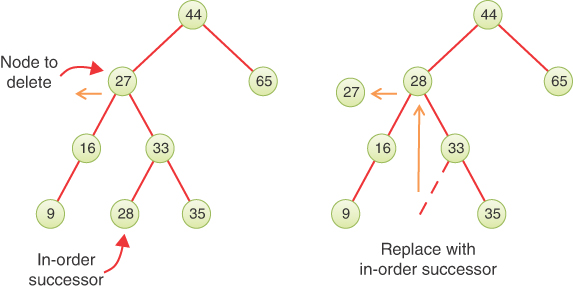
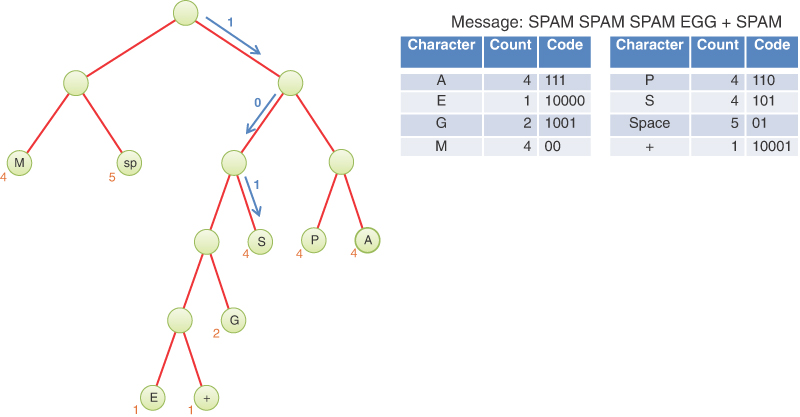

# 二叉树

在这一章当中

- 为什么使用二叉树？
- 树术语
- 类比
- 二叉搜索树如何工作？
- 寻找节点
- 插入节点
- 遍历树
- 查找最小和最大键值
- 删除节点
- 二叉搜索树的效率
- 用数组表示的树
- 打印树
- 重复键
- BinarySearchTreeTester.py 程序
- 霍夫曼密码

在本章中，我们从算法（[第 7 章](./07-高级排序.md)"高级排序"的重点）切换到数据结构。二叉树是编程中使用的基本数据存储结构之一。它们提供了你目前所见的数据结构无法提供的优势。在本章中，你将了解为什么要使用树、它们的工作原理以及如何创建它们。

## 为什么使用二叉树？

为什么要使用树？通常，因为它结合了其他两种结构的优点：有序数组和链表。你可以像搜索有序数组一样快速搜索树，也可以像使用链表一样快速插入和删除对象。在深入研究树的细节之前，让我们稍微探讨一下这些主题。

### 有序数组中的缓慢插入

想象一个数组，其中所有元素都按顺序排列——即有序数组——如你在[第 2 章](./02-数组.md)"数组"中看到的那样。正如你所了解的，你可以使用二进制搜索快速搜索此类数组以获取特定值。你检查阵列的中心；如果你要查找的对象大于你在那里找到的对象，则将搜索范围缩小到数组的上半部分；如果更少，则将搜索范围缩小到下半部分。重复应用此过程可在 $O(log N)$ 时间内找到对象。你还可以快速遍历有序数组，按排序顺序访问每个对象。
另一方面，如果要将新对象插入有序数组中，首先需要找到对象的去向，然后将所有具有更大键的对象在数组中向上移动一个空间为其腾出空间。这些多次移动非常耗时，平均需要移动一半的对象（$N/2$ 次移动）。删除涉及相同的多个动作，因此同样慢。
如果你要进行大量的插入和删除操作，有序数组是一个糟糕的选择。

### 在链列中搜索缓慢

正如你在[第 5 章](./05-链表.md)"链表"中看到的，你可以快速地对链表执行插入和删除操作。你只需更改一些引用即可完成这些操作。这两个操作需要$O(1)$时间（最快的大O时间）。
不幸的是，在链表中查找指定元素并不那么快。你必须从列表的开头开始并访问每个元素，直到找到你要查找的元素。因此，你需要平均访问 $N/2$ 个对象，将每个对象的键与所需值进行比较。这个过程很慢，需要 $O(N)$ 的时间。 （请注意，对于插入、删除和搜索等基本数据结构操作而言，被认为排序快的时间是慢的。）
你可能认为你可以通过使用有序链表来加快速度，其中元素按顺序排列，但这无济于事。你仍然必须从头开始并按顺序访问元素，因为如果不遵循对它的引用链，就无法访问给定元素。在元素应该在的有序序列中找到空缺后，你可以放弃搜索元素，这样可以节省一点时间来识别缺失的对象。使用有序列表仅有助于更快地按顺序遍历节点，而无助于查找任意对象。

### 救援树

如果有一种数据结构可以快速插入和删除链表，以及快速搜索有序数组，那就太好了。树提供了这两个特征，也是最有趣的数据结构之一。

### 什么是树？

一棵树由通过边连接的节点组成。图 8-1 显示了一棵树。在这样的树图中，节点表示为圆圈，边表示为连接圆圈的线。


图 8-1 一般（非二叉）树
树作为抽象的数学实体已被广泛研究，因此有大量关于它们的理论知识。树实际上是称为图的更一般类别的实例。连接节点的边的类型和排列区分了树和图，但你不必担心图存在的额外问题。我们将在[第 14 章](./14-图.md)"图"和[第 15 章](15-加权图.md)"加权图"中讨论图。
在计算机程序中，节点通常表示文件夹、文件、部门、人员等实体，换句话说，是存储在任何数据结构中的典型记录和对象。在面向对象的编程语言中，节点是表示实体的对象，有时是在现实世界中。
节点之间的线（边）表示节点相关的方式。粗略地说，线代表便利：如果一条线连接它们，程序就可以轻松（且快速）地从一个节点到达另一个节点。事实上，从一个节点到另一个节点的唯一方法就是沿着这条线走一条路。这些与你在链表中看到的引用基本相同；每个节点都可以引用其他节点。算法仅限于沿边沿一个方向前进：从具有引用的节点到其他某个节点。双向链接节点有时用于两个方向。
通常，一个节点被指定为树的根。就像链表的头一样，所有其他节点都是通过从根开始的边到达的。根节点通常画在图的顶部，如图 8-1 所示。其他节点显示在其下方，并且在图中越往下，需要遵循越多的边才能到达另一个节点。因此，树形图顶部较小，底部较大。与真树相比，这种配置可能看起来是颠倒的，至少与真树在地面上的部分相比是这样；这些图表在视觉上更像是树根系统。这种安排使它们更像是用来显示家谱的图表，祖先在上，后代在下。通常，程序从树的一小部分（根）开始操作，然后沿着边缘延伸到更宽的边缘。从上到下思考（可以说）更自然，就像阅读文本一样，因此让其他节点位于根下方有助于指示节点的相对顺序。
有不同种类的树，以边的数量和类型来区分。图 8-1 中所示的树每个节点有两个以上的子节点。 （稍后我们会解释"节点"的含义。）在本章中，我们将讨论一种特殊形式的树，称为二叉树。二叉树中的每个节点最多有两个节点。更一般的树，其中节点可以有两个以上的节点，被称为多路树。我们在第 9 章"2-3-4 树和外部存储"中展示了多路树的示例。

## 树术语
许多术语用于描述树木的特定方面。你需要了解它们，以便可以理解此讨论。幸运的是，这些术语中的大多数都与现实世界中的树或家庭关系有关，因此它们并不难记。图 8-2 显示了应用于二叉树的许多这些术语。


图 8-2 树项

### 根

树顶部的节点称为根。一棵树中只有一个根，在图中标记为 A。

### 路径

想象一下有人沿着连接它们的边从一个节点走到另一个节点。生成的节点序列称为路径。对于要定义为树的节点和边的集合，必须有一个（而且只有一个！）从根到任何其他节点的路径。图 8-3 显示了一个非树。你可以看到它违反了这个规则，因为从 A 到节点 E 和 F 有多条路径。这是一个不是树的图的例子。


图 8-3 非树

### 父节点

任何节点（根节点除外）只有一条边将其连接到其上方的节点。它上面的节点称为该节点的父节点。根节点不能有父节点。

### 子节点

任何节点都可能有一条或多条边将其连接到下面的节点。给定节点下方的这些节点称为其子节点，有时称为分支。

### 兄弟节点

除根节点之外的任何节点都可以有兄弟节点。这些节点有一个共同的父节点。

### 叶子节点

没有子节点的节点称为叶节点或简称为叶节点。一棵树可以只有一个根，但可以有很多叶。相反，具有子节点的节点是内部节点。

### 子树

任何节点（除了根）都可以被认为是子树的根，子树还包括它的节点，以及它的节点的节点，等等。如果你从家庭的角度考虑，一个节点的子树包含它的所有后代。

### 访问

当程序控制到达节点时访问节点，通常是为了对该节点执行某些操作，例如检查其数据字段之一的值或显示它。仅在从一个节点到另一个节点的路径上经过一个节点不被认为是访问该节点。

### 遍历

遍历树意味着以某种指定的顺序访问所有节点。例如，你可以按键值升序访问所有节点。还有其他遍历树的方法，我们将在后面描述。

### 高度

特定节点的高度是指该节点距离根节点有多少代。如果你假设根为 0 级，则其子级为 1 级，其孙级为 2 级，依此类推。这有时也称为节点的深度。

### 键

你已经看到，对象中的一个数据字段通常被指定为键值，或简称为键。该值用于搜索对象或对其执行其他操作。在树图中，当一个圆圈表示一个节点持有一个数据项时，该项的键值通常显示在圆圈中。

### 二叉树

如果树中的每个节点最多有两个节点，则该树称为二叉树。在本章中，我们重点介绍二叉树，因为它们是最简单和最常见的。
二叉树中每个节点的两个节点称为左节点和右节点，对应于你画树时它们的位置，如图8-2所示。二叉树中的一个节点不一定有两个节点中的最大值；它可能只有一个左节点或只有一个右节点，或者根本没有节点（在这种情况下它是一片叶子）。

### 二叉搜索树

我们在本章开头讨论的这种二叉树在技术上称为二叉搜索树。节点的键在搜索树中具有特定的顺序。图 8-4 显示了一个二叉搜索树。


图 8-4 二叉搜索树

> 笔记
> 二叉搜索树的定义特征是：节点的左节点的关键字必须小于其父节点的关键字，而节点的右节点的关键字必须大于或等于其父节点的关键字。

## 类比
一种常见的树是台式计算机上的分层文件系统。该系统以 20 世纪企业使用的流行文件存储技术为蓝本：包含文件夹的文件柜，这些文件夹又包含子文件夹，下至单个文件。计算机操作系统通过将文件存储在层次结构中来模仿这一点。层次结构的顶部是根目录。该目录包含"文件夹"（子目录）和文件（类似于纸质文档）。每个子目录都可以有自己的子目录和更多的文件。这些在树上都有类比：根目录是根节点，子目录是有节点的节点，文件是叶节点。
要指定文件系统中的特定文件，你可以使用从根目录到该文件的完整路径。这与到树节点的路径相同。统一资源定位符 (```URL```) 使用类似的结构来显示 Internet 上资源的路径。文件系统路径名和 ```URL``` 都允许多级子目录。文件系统路径中的最后一个名称是子目录或文件。文件代表叶子；他们没有自己的节点。
显然，分层文件系统不是二叉树，因为一个目录可能有很多子目录。分层文件系统与我们在此讨论的树在另一个重要方面有所不同。在文件系统中，子目录除了名称等属性外不包含其他数据；它们仅包含对其他子目录或文件的引用。只有文件包含数据。在树中，每个节点都包含数据。数据的确切类型取决于所代表的内容：有关人员的记录、有关用于建造车辆的组件的记录，等等。除了数据之外，除叶子之外的所有节点都包含对其他节点的引用。
分层文件系统在其他方面也不同于二叉搜索树。文件系统的目的是组织文件；二叉搜索树的目的更为笼统和抽象。它是一种数据结构，提供对对象集合的插入、删除、搜索和遍历等常见操作，通过键组织它们以加快操作速度。两者之间的类比是为了展示另一个熟悉的系统，它具有一些重要特征，但不是全部。

## 二叉搜索树如何工作？

让我们看看如何执行常见的二叉树操作，即找到具有给定键的节点、插入新节点、遍历树和删除节点。对于这些操作中的每一个，我们首先展示如何使用二叉搜索树可视化工具来执行它；然后我们看对应的Python代码。

### 二叉搜索树可视化工具

对于此示例，启动二叉搜索树可视化工具（该程序称为 BinaryTree.py）。你应该会看到如图 8-5 所示的屏幕。


图 8-5 二叉搜索树可视化工具

#### 使用可视化工具

节点中显示的键值范围为 0 到 99。当然，在真实的树中，键值的范围可能更大。例如，如果电话号码用作键值，则它们的范围可达 999,999,999,999,999（15 位数字，包括国际电信联盟标准中的国家/地区代码）。我们专注于一组更简单的可能键。
可视化工具与真实树之间的另一个区别是该工具将其树的深度限制为五；也就是说，从根到底部（0 级到 4 级）不能超过 5 个级别。此限制可确保树中的所有节点都在屏幕上可见。在真正的树中，层数是无限的（直到计算机内存不足）。
使用可视化工具，你可以随时创建一棵新树。为此，请输入一些对象并单击擦除和随机填充按钮。你可以要求填写 0 到 99 项。如果你选择 0，你将创建一个空树。使用更大的数字将填充更多的节点，但一些请求的节点可能不会出现。这是由于树的深度限制和插入对象的随机顺序。你可以通过创建具有不同节点数的树来进行试验，以查看随机排序产生的树的多样性。
创建的节点具有不同的颜色。颜色代表使用密钥存储的数据。我们稍后会展示这些数据是如何在某些操作中更新的。

### 构建树

如可视化工具所示，树的形状取决于它包含的对象以及对象插入树中的顺序。起初这可能看起来很奇怪。如果将对象插入到排序数组中，无论它们的顺序如何，它们总是以相同的顺序结束。为什么二叉搜索树不同？
二叉搜索树的一个关键特性是它不必在插入对象时完全排序。当它向现有树中添加新项时，它通过将其键与已存储在树中的节点的键进行比较来决定将新叶节点放置在何处。它遵循从根向下到新节点"所属"的缺失子节点的路径。当新节点的键小于内部节点的键时选择左节点，其他值选择右节点，新节点总是有唯一的路径。该唯一路径意味着你稍后可以通过其键轻松找到该节点，但这也意味着之前插入的对象会影响任何新对象的路径。
例如，如果你从一棵空的二叉搜索树开始，并以递增的键顺序插入节点，则每个节点的唯一路径将始终是最右边的路径。每次插入都会在右下角添加一个节点。如果将节点的顺序颠倒并将它们插入到空树中，则每次插入都会在左下角添加节点，因为到目前为止，该键低于树中的任何其他节点。图 8-6 显示了如果以正向或反向顺序插入具有键 44、65、83 和 87 的节点会发生什么。


图 8-6 通过按排序顺序插入节点生成的树

### 不平衡树

图 8-6 中显示的树，看起来不像树。事实上，它们看起来更像链表。二叉搜索树的目标之一是加快对特定节点的搜索，因此必须逐步通过链表来查找节点不会是一种改进。为了获得树的好处，根的两侧的节点应该大致平衡。理想情况下，沿着路径寻找节点的每一步都应该将要搜索的节点数量减半，就像在数组的二进制搜索和第 2 章中描述的猜数字游戏中一样。
我们可以说有些树是不平衡的；也就是说，它们的大部分节点位于根的一侧或另一侧，如图 8-7 所示。任何子树也可能是不平衡的，如图左下角的轮廓所示。当然，只有完全平衡的树才会在左子树和右子树上具有相等数量的节点（并且是完全平衡的，每个节点的子树也将是完全平衡的）。在随机选择的对象上一次插入一个节点意味着大多数树在构建时将因一个或多个节点而变得不平衡，因此你通常不能期望找到完全平衡的树。在接下来的章节中，我们将更仔细地研究在插入和删除节点时平衡它们的方法。


图 8-7 不平衡树（带有不平衡子树）
由于插入数据项的顺序，树变得不平衡。如果这些键值是随机插入的，树或多或少会是平衡的。当遇到升序序列（如 11、18、33、42、65）或降序序列时，所有值都将是右节点（如果是升序）或左节点（如果是降序），并且树将是不平衡的。可视化工具中的键值是随机生成的，当然无论如何都会创建一些短的升序或降序序列，这会导致局部不平衡。
如果一棵树是由其键值以随机顺序到达的数据项创建的，那么对于较大的树来说，不平衡树的问题可能不是太大的问题，因为序列中出现长串数字的可能性很小。然而，有时键值会严格按顺序到达；例如，当某人进行数据输入时，在输入数据之前按名称的字母顺序排列一堆表格。发生这种情况时，树的效率会严重下降。我们将在[第 9 章](./09-2-3-4 树和外部存储.md)和[第 10 章](./10-AVL 和红黑树.md)讨论不平衡树以及如何处理它们。

### 在 Python 代码中表示树

让我们开始用 Python 实现二叉搜索树。与其他数据结构一样，有几种方法可以在计算机内存中表示一棵树。最常见的是将节点存储在内存中（不相关的）位置，并使用每个节点中指向其子节点的引用连接它们。
你也可以将内存中的树表示为一个数组，特定位置的节点存储在数组中的相应位置。我们将在本章末尾回到这种可能性。对于我们的示例 Python 代码，我们将使用使用引用连接节点的方法，类似于第 5 章中实现链表的方法。

### BinarySearchTree 类
我们需要一个用于整个树对象的类：包含或至少指向所有节点的对象。我们称这个类为 ```BinarySearchTree```。它只有一个字段 ```__root```，用于保存对根节点的引用，如清单 8-1 所示。这与第 5 章中用于表示链表的 ```LinkedList``` 类非常相似。 ```BinarySearchTree``` 类不需要其他节点的字段，因为它们都是通过跟随其他引用从根节点访问的。
清单 8-1 BinarySearchTree 类的构造函数

```python
class BinarySearchTree(object): # A binary search tree class
    
    def __init__(self):          # The tree organizes nodes by their
        self.__root = None        # keys. Initially, it is empty.
```

构造函数将对根节点的引用初始化为 ```None``` 以从空树开始。 当插入第一个节点时，```__root``` 将指向它，如图 8-5 的可视化工具示例所示。 当然，有很多方法可以对 ```BinarySearchTree``` 对象进行操作，但首先，你需要定义其中的节点。

### ```__Node``` 类

树的节点包含表示正在存储的对象的数据（例如，地址簿中的联系信息）、识别这些对象（以及对它们进行排序）的键，以及对节点的两个子节点中每个节点的引用。 为了提醒我们不应允许创建 ```BinarySearchTree``` 对象的调用者直接更改节点，我们在该类中创建了一个私有的 ```__Node``` 类。 清单 8-2 显示了如何在 ```BinarySearchTree``` 类中定义内部类。
清单 8-2 ```__Node``` 和 ```BinarySearchTree``` 类的构造函数

```python
class BinarySearchTree(object):  # A binary search tree class
…

    class __Node(object):  # A node in a binary search tree
        def __init__(  # Constructor takes a key that is
            self,  # used to determine the position
            key,  # inside the search tree,
            data,  # the data associated with the key
            left=None,  # and a left and right child node
            right=None,
        ):  # if known
            self.key = key  # Copy parameters to instance
            self.data = data  # attributes of the object
            self.leftChild = left
            self.rightChild = right

        def __str__(self):  # Represent a node as a string
            return "{" + str(self.key) + ", " + str(self.data) + "}"

    def __init__(self):  # The tree organizes nodes by their
        self.__root = None  # keys. Initially, it is empty.

    def isEmpty(self):  # Check for empty tree
        return self.__root is None

    def root(self):  # Get the data and key of the root node
        if self.isEmpty():  # If the tree is empty, raise exception
            raise Exception("No root node in empty tree")
        return (  # Otherwise return root data and its key
            self.__root.data,
            self.__root.key,
        )
```

```__Node``` 对象由 ```BinarySearchTree``` 的方法创建和操作。 ```__Node``` 中的字段可以初始化为公共属性，因为 ```BinarySearchTree``` 的方法不会返回 ```__Node``` 对象。此声明允许直接读取和写入，而无需创建访问器方法，如 ```getKey()``` 或 ```setData()```。 ```__Node``` 构造函数只是根据提供的参数填充字段。如果未提供子节点，则其引用的字段将填充为 ```None```。
我们为 ```__Node``` 对象添加了一个 ```__str__()``` 方法，以帮助在调试时显示内容。值得注意的是，它不显示子节点。我们稍后会讨论如何显示完整的树。这就是 ```__Node``` 对象所需的所有方法；你定义的所有其他方法都是针对 ```BinarySearchTree``` 对象的。
清单 8-2 显示了 ```BinarySearchTree``` 对象的 ```isEmpty()``` 方法，该方法检查树中是否有任何节点。 ```root()``` 方法提取根节点的数据和密钥。它就像队列的 ```peek()``` ，如果树为空则引发异常。
一些程序员还在 ```__Node``` 类中包含对节点父节点的引用。这样做会简化一些操作，但会使其他操作复杂化，因此我们不在此处包含它。添加父引用可以实现类似于[第 5 章](./05-链表.md)"链列"中描述的 ```DoublyLinkedList``` 类的功能；它在某些情况下很有用，但增加了复杂性。
我们通过将每个节点的密钥存储在其自己的字段中来做出另一种设计选择。对于基于数组的数据结构，我们选择使用从每个数组项中提取键的键函数。这种方法对数组更方便，因为将键与数据分开存储需要键数组和数据数组的等价物。在具有命名字段的节点类的情况下，添加一个关键字段可以通过避免一些函数调用使代码更具可读性和效率。它还使密钥更加独立于数据，这增加了灵活性，并且即使在数据更改时也可用于强制执行不可变密钥等约束。
```BinarySearchTree``` 类有几个方法。它们用于查找、插入、删除和遍历节点；并用于显示树。我们分别对它们进行调查。

## 查询节点

查找具有特定键的节点是最简单的主要树操作。它也是最重要的，因为它对于二叉搜索树的目的至关重要。
可视化工具仅显示每个节点的键及其数据的颜色。请记住，数据结构的目的是存储一组记录，而不仅仅是键或简单的颜色。键可以不仅仅是简单的整数；可以使用任何可以订购的数据类型。为简洁起见，此处显示的可视化和示例使用整数。在通过其键发现节点后，返回给调用者的是数据，而不是节点本身。

### 使用可视化工具查找节点

查看可视化工具并选择一个节点，最好是靠近树底部的节点（尽可能远离根）。此节点中显示的数字是其键值。我们将演示可视化工具如何在给定键值的情况下找到节点。
出于本次讨论的目的，我们选择查找保存键值为 50 的对象的节点，如图 8-8 所示。当然，当你运行 Visualization 工具时，你可能会得到不同的树，可能需要选择不同的键值。


图 8-8 查找密钥为 50 的节点
在文本输入框中输入键值，按住 Shift 键，然后选择搜索按钮，然后选择步骤按钮 。重复按 Step 按钮，你可以看到找到键 50 所采取的所有单独步骤。在第二次按下时，当前指针显示在树的根部，如图 8-8 所示。下一次单击时，将显示一个父指针，它将跟随当前指针。暂时忽略该指针和代码显示；我们很快就会详细描述它们。
当可视化工具查找指定节点时，它会在当前节点做出决定。它将所需的密钥与在当前节点找到的密钥进行比较。如果相同，则找到需要的节点，可以退出。如果没有，它必须决定下一步要看哪里。
在图 8-8 中，当前箭头从根开始。该程序将目标键值 50 与根部的值 77 进行比较。目标键值较小，因此程序知道所需节点必须位于树的左侧 - 根的左子节点或其中之一那个节点的后代。根的左节点的值为 59，因此比较 50 和 59 将显示所需节点在 59 的左子树中。当前箭头指向 46，即该子树的根。这一次，50 大于 46 节点，所以它向右移动，到达节点 56，如图 8-9 所示。几步之后，将 50 与 56 进行比较将程序引向左节点。在那个叶子节点比较，50等于节点的键值，所以找到了我们要找的节点。


图 8-9 查找密钥 50 的倒数第二步
可视化工具在找到所需节点后会发生一些变化。 当前箭头变为节点箭头（父箭头变为 p）。 这是因为变量在代码中的命名方式，我们将在下一节中展示。 该工具在找到节点后不会对节点执行任何操作，除了包围它并显示一条消息说它已找到。 一个严肃的程序会对找到的节点执行一些操作，例如显示其内容或更改其中一个字段。

### 用于查找节点的 Python 代码

清单 8-3 显示了 ```__find()``` 和 ```search()``` 方法的代码。 ```__find()``` 方法是私有的，因为它可以返回一个节点对象。 ```BinarySearchTree``` 类的调用者使用 ```search()``` 方法获取存储在节点中的数据。
清单 8-3 基于关键字查找二叉搜索树节点的方法

```python
class BinarySearchTree(object):  # A binary search tree class
…

    def __find(self, goal):  # Find an internal node whose key
        current = self.__root  # matches goal and its parent. Start at
        parent = self  # root and track parent of current node
        while (
            current and goal != current.key  # While there is a tree left to explore
        ):  # and current key isn't the goal
            parent = current  # Prepare to move one level down
            current = (  # Advance current to left subtree when
                current.leftChild
                if goal < current.key
                else current.rightChild  # goal is
            )  # less than current key, else right

        # If the loop ended on a node, it must have the goal key
        return (current, parent)  # Return the node or None and parent

    def search(self, goal):  # Public method to get data associated
        node, p = self.__find(goal)  # with a goal key. First, find node
        return node.data if node else None  # w/ goal & return any data
```

```__find()``` 的唯一参数是目标，即要找到的键值。此程序创建变量 ```current``` 以保存当前正在检查的节点。该程序从根节点开始——它可以直接访问的唯一节点。也就是说，它将当前设置为根。它还将父变量设置为 ```self```，即树对象。在可视化工具中，父对象开始指向树对象。因为父链接不存储在节点中，所以 ```__find()``` 方法跟踪 ```current``` 的父节点，以便它可以将它与目标节点一起返回给调用者。此功能在其他方法中将非常有用。父变量始终是正在搜索的 ```BinarySearchTree``` 或其 ```__Node``` 对象之一。
在 ```while``` 循环中，```__find()``` 首先确认 ```current``` 不为 ```None``` 并引用某个现有节点。如果不是，则搜索超出叶节点（或从一棵空树开始），目标节点不在树中。 ```while``` 测试的第二部分将要查找的值 ```goal``` 与当前节点的关键字段的值进行比较。如果密钥匹配，则循环完成。如果没有，则 ```current``` 需要前进到适当的子树。首先，它将 ```parent``` 更新为当前节点，然后更新 ```current```。如果目标小于当前的关键，当前前进到它的左节点。如果 ```goal``` 大于 ```current``` 的 ```key```，则 ```current``` 前进到它的右节点。

### 找不到节点

如果 ```current``` 变得等于 ```None```，你已经到达了行的末尾，但没有找到你正在寻找的节点，所以它不可能在树中。如果根节点是 ```None``` 或者跟随子链接导致没有子节点的节点（在目标键所在的一侧），则可能会发生这种情况。当前节点 (```None```) 及其父节点都返回给调用者以指示结果。在可视化工具中，尝试输入一个没有出现在树中的键并选择搜索。然后你会看到当前指针下降通过现有节点并落在应该找到密钥但不存在节点的位置。指向"空白"表示变量的值为 ```None```。

### 找到节点

如果在当前引用树中的某个节点时不满足 ```while``` 循环的条件，则循环退出，并且当前键必须是目标。也就是说，它已经找到正在寻找的节点并且当前引用它。它返回节点引用以及父引用，以便调用 ```__find()``` 的例程可以访问节点（或其父节点）的任何数据。请注意，对于找到密钥的成功和失败，它都返回 current 的值；找不到目标时为 ```None```。
```search()``` 方法调用 ```__find()``` 方法来设置其节点和父 (```p```) 变量。这就是你在 ```__find()``` 方法返回后在可视化工具中看到的内容。如果找到非 ```None``` 引用，则 ```search()``` 返回该节点的数据。在这种情况下，该方法假定存储在节点中的数据项永远不会是 ```None```；否则，调用者将无法区分它们。

## 插入节点
要插入节点，首先要找到插入的地方。这与试图找到一个不存在的节点的过程相同，如前面的"找不到节点"部分所述。你遵循从根到适当节点的路径。这要么是一个与要插入的节点具有相同键的节点，要么是 ```None```，如果这是一个新键。如果它是相同的键，你可以尝试将它插入到正确的子树中，但这样做会增加一些复杂性。另一种选择是用新数据替换该节点的数据。目前，我们只允许插入唯一的键；我们稍后讨论重复键。
如果要插入的键不在树中，则 ```__find()``` 返回 ```None``` 作为对节点的引用以及父引用。新节点连接为父节点的左子节点或右子节点，具体取决于新节点的键是小于还是大于父节点的键。如果 ```__find()``` 返回的父引用是 ```self```，即 ```BinarySearchTree```本身，则该节点成为根节点。
图 8-10 说明了将具有键 31 的节点插入到树中的过程。 ```__find(31)``` 方法从根节点开始遍历路径。因为 31 小于根节点密钥 44，所以它跟随左子链接。该节点的密钥是 27，因此它遵循该节点的右节点链接。它在那里遇到键 33，因此它再次跟随左子链接。那是 ```None```，所以 ```__find(31)``` 停止，父节点指向键为 33 的叶节点。创建键为 31 的新叶节点，并将父节点的左子链接设置为引用它。


图 8-10 在二叉搜索树中插入一个节点

### 使用可视化工具插入节点

要使用可视化工具插入新节点，请输入一个不在树中的键值，然后选择"插入"按钮。 该程序的第一步是找到应该插入的位置。 例如，将 81 插入到前面示例中的树中会调用清单 8-3 中的 __find() 方法，这会导致搜索遵循图 8-11 中所示的路径。


图 8-11 使用可视化工具插入键为 81 的节点的步骤
当前指针从```key```为77的根节点开始，发现81更大，就转到右子节点94，现在要插入的```key```小于当前```key```，所以下降到85节点。父指针在这些步骤中的每一步都遵循当前指针。当 ```current``` 到达节点 85 时，它转到其左子节点并发现它丢失了。对 ```__find()``` 的调用返回 ```None``` 和父指针。
在找到新键应该去的具有空子节点的父节点后，可视化工具创建一个键为 81 的新节点，一些用颜色表示的数据，并将节点 85（父节点）的左子节点指针设置为指向在它。 ```__find()``` 返回的节点指针被移走了，因为它仍然是 ```None```。

### 用于插入节点的 Python 代码

```insert()``` 方法接受要插入的键和数据的参数，如清单 8-4 所示。它使用新节点的键调用 ```__find()``` 方法以确定该键是否已经存在以及其父节点应该在哪里。此实现只允许树中的唯一键，因此如果它找到具有相同键的节点，```insert()``` 会更新该键的数据并返回 ```False``` 以指示没有创建新节点。
清单 8-4 ```BinarySearchTree``` 的 ```insert()``` 方法

```python
class BinarySearchTree(object):  # A binary search tree class
…

    def insert(
        self,  # Insert a new node in a binary
        key,  # search tree finding where its key
        data,
    ):  # places it and storing its data
        node, parent = self.__find(  # Try finding the key in the tree
            key
        )  # and getting its parent node
        if node:  # If we find a node with this key,
            node.data = data  # then update the node's data
            return False  # and return flag for no insertion

        if parent is self:  # For empty trees, insert new node at
            self.__root = self.__Node(key, data)  # root of tree
        elif key < parent.key:  # If new key is less than parent's key,
            parent.leftChild = self.__Node(  # insert new node as left
                key, data, right=node
            )  # child of parent
        else:  # Otherwise insert new node as right
            parent.rightChild = self.__Node(key, data, right=node)  # child of parent
        return True  # Return flag for valid insertion
```

如果未找到匹配节点，则插入取决于从 ```__find()``` 返回的父引用类型。如果是 ```self```，则 ```BinarySearchTree``` 必须为空，因此新节点成为树的根节点。否则，父节点是一个节点，因此 ```insert()``` 通过比较新节点的键与父节点的键来决定哪个子节点将获得新节点。如果新键值较低，则新节点成为左节点；否则，它就成为正确的节点。最后 ```insert()``` 返回 ```True``` 表示插入成功。
当 ```insert()``` 创建新节点时，它将新节点的右子节点设置为从 ```\__find()``` 返回的节点。你可能想知道为什么会出现这种情况，特别是因为 ```node``` 在那个点只能是 ```None```（如果不是 ```None```，```insert()``` 会在到达那个点之前返回 ```False```）。原因可以追溯到如何处理重复键。如果你允许具有重复键的节点，那么你必须将它们放在某个地方。二叉搜索树定义表明节点的键小于或等于其右节点的键。因此，如果你允许重复键，则重复节点不能进入左子节点。通过指定除 ```None``` 之外的其他内容作为新节点的右子节点，可以保留具有相同键的其他节点。我们将如何插入（和删除）具有重复键的节点作为练习。

## 遍历树
遍历树意味着以指定的顺序访问每个节点。遍历树在某些情况下很有用，例如遍历所有记录以寻找需要采取某些行动的记录（例如，来自特定国家/地区的车辆部件）。这个过程可能不像查找、插入和删除节点那样常用，但它仍然很重要。
你可以通过三种简单的方式遍历树。它们被称为预购、中购和后购。二叉搜索树最常用的顺序是有序的，所以让我们先看一下，然后简要地回到其他两个。

### 中序遍历

二叉搜索树的中序遍历导致所有节点按其键值的升序被访问。如果你想在按键排序的二叉树中创建数据列表，这是一种方法。
执行遍历的最简单方法是使用递归（在[第 6 章](./06-递归.md)中讨论）。以节点作为参数调用遍历整个树的递归方法。最初，这个节点是根。该方法只需要做三件事：

1. 调用自身遍历节点的左子树。
2. 访问节点。
3. 调用自身遍历节点的右子树。

请记住，访问一个节点意味着对它做一些事情：显示它、更新一个字段、将它添加到一个队列、将它写入一个文件，等等。
这三个遍历顺序适用于任何二叉树，而不仅仅是二叉搜索树。遍历机制不关注节点的键值；它只关心节点的子节点和数据。换句话说，中序遍历仅在使用二叉搜索树标准将节点放置在树中时才意味着"按键值递增的顺序"。 ```in-order```是指在左右子树之间被访问的节点。 ```pre-order```的```pre```是指先访问节点再访问其子节点，```post-order```是先访问子节点再访问节点。这种区别类似于第 4 章"堆栈和队列"中描述的算术表达式的中缀和后缀表示法之间的区别。
为了解这种递归遍历的工作原理，图 8-12 显示了在小二叉树的有序遍历过程中发生的调用。树变量引用四节点二叉搜索树。该图显示了在树上调用 ```inOrderTraverse()``` 方法，该方法将在其每个节点上调用打印函数。


图 8-12 小树的中序遍历
蓝色圆角矩形显示了对每个子树的递归调用。递归方法的名称已缩写为 ```i_o_trav()``` 以适合图中的所有调用。第一个（最外层）调用是在根节点（键 45）上。每个递归调用执行前面概述的三个步骤。首先，它对以键 27 为根的左子树进行递归调用。这在图的左侧显示为另一个蓝色圆角矩形。
处理以键 27 为根的子树首先对其左子树进行递归调用，以键 16 为根。另一个矩形在左下方显示该调用。和以前一样，它的首要任务是对其左子树进行递归调用。该子树是空的，因为它是一个叶节点，并且在图中显示为对 ```i_o_trav()``` 的不带参数的调用。因为子树是空的，所以什么也没有发生，递归调用返回。
回到对 ```i_o_trav(16)``` 的调用，它现在到达步骤 2 并通过在节点本身上执行函数 ```print``` 来"访问"节点。这在图中显示为黑色的 ```print(16)```。一般来说，访问一个节点不仅仅是打印节点的密钥；它会对存储在节点上的数据采取一些行动。该图没有显示该操作，但它会在执行 ```print(16)``` 时发生。
在访问了键为 16 的节点之后，就到了第 3 步的时候了：在右子树上调用自己。键为 16 的节点没有右子节点，它显示为最小尺寸的矩形，因为它是对空子树的调用。这完成了以键 16 为根的子树的执行。控制权返回给调用者，对以键 27 为根的子树的调用。
其余处理过程类似。对键为 27 的节点的访问执行 ```print(27)```，然后调用它的空右子树。这完成了对节点 27 的调用，控制权返回到对树根节点 45 的调用。执行 ```print(45)``` 后，它调用遍历其右（非空）子树。这是树中的第四个也是最后一个节点，节点 62。它调用其空的左子树，执行 ```print(62)```，并以调用其空的右子树结束。控制通过对根节点 45 的调用向上传递，并结束完整的树遍历。

### 前序和后序遍历

其他两个遍历顺序类似：只是访问节点的顺序发生了变化。对于前序遍历，首先访问节点，对于后序遍历，最后访问节点。始终以相同的顺序访问两个子树：先左后右。图 8-13 显示了在与图 8-12 相同的四节点树上执行前序遍历。 print() 函数的执行发生在访问两个子树之前。这意味着前序遍历会打印 45、27、16、62，而中序遍历会打印 16、27、45、62。如图所示，顺序之间的差异很小，但总体效果是大的。


图 8-13 小树的前序遍历

### 用于遍历的 Python 代码

现在让我们看一下实现中序遍历的简单方法。 正如你在堆栈、队列、链表和其他数据结构中看到的那样，使用作为参数传递的函数定义遍历非常简单，该函数将应用于存储在结构中的每个对象。 与树的有趣区别在于递归使它非常紧凑。
因为这些树是使用两个类 ```BinarySearchTree``` 和 ```__Node``` 来表示的，所以你需要可以对这两种类型的对象进行操作的方法。 在清单 8-5 中， ```inOrderTraverse()``` 方法处理 ```BinarySearchTree``` 对象的遍历。 它充当遍历的公共接口并调用私有方法 ```__inOrderTraverse()``` 来对子树执行实际工作。 它将根节点传递给私有方法并返回。
清单 8-5 ```inOrderTraverse()``` 的递归实现

```python
class BinarySearchTree(object):  # A binary search tree class
…

    def inOrderTraverse(  # Visit all nodes of the tree in-order
        self, function=print
    ):  # and apply a function to each node
        self.__inOrderTraverse(  # Call recursive version starting at
            self.__root, function=function
        )  # root node

    def __inOrderTraverse(  # Visit a subtree in-order, recursively
        self, node, function
    ):  # The subtree's root is node
        if node:  # Check that this is real subtree
            self.__inOrderTraverse(  # Traverse the left subtree
                node.leftChild, function
            )
            function(node)  # Visit this node
            self.__inOrderTraverse(  # Traverse the right subtree
                node.rightChild, function
            )
```

私有方法需要一个 ```__Node``` 对象（或无）作为其节点参数，并在以该节点为根的子树上执行这三个步骤。首先，它检查节点，如果它是 ```None``` 则立即返回，因为这表示一个空子树。对于合法节点，它首先对自身进行递归调用以处理该节点的左子节点。其次，它通过调用节点上的函数来访问节点。第三，它进行递归调用以处理节点的右节点。这里的所有都是它的。

### 使用生成器进行遍历

```inOrderTraverse()``` 方法很简单，但它至少有三个缺点。首先，要实现其他排序，你需要编写更多方法或添加一个参数来指定要执行的排序。
其次，作为参数传递以"访问"每个节点的函数需要将 ```__Node``` 对象作为参数。这是 ```BinarySearchTree``` 中的一个私有类，用于保护节点不被调用者操纵。避免传递对 ```__Node``` 对象的引用的一种替代方法是仅将每个节点的数据字段（可能还有键字段）作为参数传递给访问函数。该方法将最大限度地减少调用者可以对该节点执行的操作，并防止它更改其他节点引用。
第三，使用函数来描述在每个节点上执行的操作有其局限性。通常，函数每次被调用时都会执行相同的操作，并且不知道之前调用的历史记录。在像树这样的数据结构的遍历过程中，能够利用先前节点访问的结果极大地扩展了可能的操作。以下是你可能想要执行的一些示例：

- 将每个节点的特定字段中的所有值相加。
- 从每个节点获取字段中所有唯一字符串的列表。
- 如果先前访问过的节点在某个字段中没有更大的值，则将节点的键添加到某个列表中。

在所有这些遍历中，能够在遍历过程中在某处累积结果是非常方便的。这可以用函数来做，但是生成器使它更容易。我们在[第 5 章](./05-链表.md)介绍了生成器，由于树与这些结构有许多相似之处，因此它们对于遍历树非常有用。
我们在 ```traverse``` 方法的递归生成器版本 ```traverse_rec()``` 中解决了这些缺点，如清单 8-6 所示。这个版本增加了一些代码的复杂性，但使用遍历更容易。首先，我们向 ```traverse_rec()``` 方法添加一个参数 ```traverseType```，这样我们就不需要三个单独的遍历例程。第一个 ```if``` 语句验证此参数是三个支持的顺序之一：```pre```、```in``` 和 ```post```。如果不是，它会引发异常。否则，它将启动递归私有方法 ```__traverse()```，从根节点开始，就像 ```inOrderTraverse()``` 所做的那样。
在调用 ```__traverse()``` 方法时有一个重要但微妙的点需要注意。公共 ```traverse_rec()``` 方法返回调用私有 ```__traverse()``` 方法的结果，而不是简单地将其作为子例程调用。原因是 ```traverse()``` 方法本身不是生成器；它没有 ```yield``` 语句。它必须返回调用 ```__traverse()``` 产生的迭代器，```traverse_rec()``` 调用者将使用它来迭代节点。
在 ```__traverse()``` 方法内部，有一系列的 ```if``` 语句。第一个测试基本情况。如果节点为 ```None```，则这是一棵空树（或子树）。它返回以指示迭代器已结束（Python 将其转换为 ```StopIteration``` 异常）。下一个 ```if``` 语句检查遍历类型是否为预序，如果是，则产生节点的键和数据。请记住，迭代器将在此时暂停，同时控制权返回给它的调用者。这就是节点将被"访问"的地方。处理完成后，调用者的循环调用此迭代器以获取下一个节点。迭代器在 ```yield``` 语句之后立即恢复处理，记住所有上下文。
当迭代器恢复时（或者如果顺序不是预序），下一步是 for 循环。这是一个递归生成器，用于执行左子树的遍历。它使用相同的 ```traverseType``` 在节点的 ```leftChild``` 上调用 ```__traverse()``` 方法。这会创建自己的迭代器来处理该子树中的节点。当节点作为键、数据对返回时，这个更高级别的迭代器将它们返回给它的调用者。这个循环构造产生一个嵌套的迭代器堆栈，类似于图 8-12 中所示的 ```i_o_trav()``` 的嵌套调用。当每个迭代器在其工作结束时返回时，它会引发 ```StopIteration```。封闭的迭代器捕获每个异常，因此各个级别不会相互干扰。
清单 8-6 用于遍历的递归生成器

```python
class BinarySearchTree(object):  # A binary search tree class
…
    def traverse_rec(
        self, traverseType="in"  # Traverse the tree recursively in
    ):  # pre, in, or post order
        if traverseType in [  # Verify type is an accepted value and
            "pre",
            "in",
            "post",
        ]:  # use generator to walk the tree
            return self.__traverse(  # yielding (key, data) pairs
                self.__root, traverseType
            )  # starting at root

        raise ValueError(f"Unknown traversal type: {str(traverseType)}")

    def __traverse(
        self,  # Recursive generator to traverse
        node,  # subtree rooted at node in pre, in, or
        traverseType,
    ):  # post order
        if node is None:  # If subtree is empty,
            return  # traversal is done
        if traverseType == "pre":  # For pre-order, yield the current
            yield (node.key, node.data)  # node before all the others
        yield from self.__traverse(node.leftChild, traverseType)  # Recursively

        if traverseType == "in":  # If in-order, now yield the current
            yield (node.key, node.data)  # node
        yield from self.__traverse(node.rightChild, traverseType)  # Recursively

        if traverseType == "post":  # If post-order, yield the current
            yield (node.key, node.data)  # node after all the others
```

```__traverse()``` 方法的其余部分很简单。在完成对左子树中所有节点的循环后，下一个 if 语句检查中序遍历类型并产生节点的键和数据，如果这是排序的话。该节点在左子树和右子树之间进行处理以进行中序遍历。之后，右子树在它自己的循环中被处理，将每个访问过的节点返回给它的调用者。右子树完成后，检查后序遍历确定是否应在此阶段生成节点。之后，```__traverse()``` 生成器完成，结束其调用者的循环。

### 使生成器高效

递归生成器的优点是结构简单。基本情况和递归调用遵循树的节点和子结构。开发原型并证明其正确的行为自然地从这个结构中流出。
然而，生成器在执行时确实存在一些低效问题。每次调用 ```__traverse()``` 方法都会调用两个循环：一个用于左子节点，一个用于右子节点。这些循环中的每一个都会创建一个新的迭代器，以通过调用 ```__traverse()``` 方法本身创建的迭代器从它们的子树中返回对象。迭代器的分层从根向下延伸到每个叶节点。
遍历树中的 N 项应该花费 $O(N)$ 时间，但是创建从根向下到每个叶子的迭代器堆栈会增加与叶子深度成正比的复杂性。在最好的情况下，叶子的深度为 $O(log N)$。这意味着 N 项的整体遍历将花费 $O(N×log N)$ 时间。
要实现 $O(N)$ 时间，你需要应用[第 6 章](./06-递归.md)末尾讨论的方法并使用堆栈来保存正在处理的对象。这些对象包括节点结构和存储在要以特定顺序遍历的节点处的（键，数据）对。清单 8-7 显示了代码。
非递归方法将递归方法的两个部分合并为一个 ```traverse()``` 方法。遍历类型有效性的相同检查发生在开始处。下一步创建一个堆栈，使用建立在[第 5 章](./05-链表.md)链表上的 ```Stack``` 类（在 ```LinkStack``` 模块中定义）。
最初，该方法将树的根节点压入堆栈。这意味着剩下的工作是从根部开始整棵树。随后的 ```while``` 循环完成剩余的工作，直到堆栈为空。
每次通过 ```while``` 循环时，堆栈的顶部对象都会被弹出。堆栈上可以有三种对象：节点对象、（键、数据）元组或无。如果树为空并且当它处理叶节点（并发现它们的子节点为 ```None```）时，就会发生后者。
如果栈顶是一个 ```Node``` 项，```traverse()``` 方法会根据请求的遍历顺序确定如何处理该节点的数据及其子节点。它将对象推入堆栈，以便在后续通过 ```while``` 循环时进行处理。因为对象将以与它们被推入堆栈的方式相反的顺序从堆栈中弹出，所以它首先处理后序遍历的情况。
在后序中，推送的第一个对象是节点的（键，数据）元组。因为是先```push```，所以整体最后处理。下一个推送的对象是节点的右节点。在后序中，这是在处理节点数据之前遍历的。对于其他订单，右节点始终是最后处理的节点。
在压入右节点之后，下一个 ```if``` 语句检查是否请求了中序遍历。如果是这样，它会将节点的 ```(key, data)``` 元组推送到堆栈上，以便在两个子节点之间进行处理。然后将左节点压入堆栈进行处理。
清单 8-7 非递归 ```traverse()``` 生成器

```python
from LinkStack import *


class BinarySearchTree(object):  # A binary search tree class
…
    def traverse(
        self, traverseType="in"  # Non-recursive generator to traverse
    ):  # tree in pre, in, or post order
        if traverseType not in [  # Verify traversal type is an
            "pre",
            "in",
            "post",
        ]:  # accepted value
            raise ValueError(f"Unknown traversal type: {str(traverseType)}")

        stack = Stack()  # Create a stack
        stack.push(self.__root)  # Put root node in stack

        while not stack.isEmpty():  # While there is work in the stack
            item = stack.pop()  # Get next item
            if isinstance(item, self.__Node):  # If it's a tree node
                if traverseType == "post":  # For post-order, put it last
                    stack.push((item.key, item.data))
                stack.push(item.rightChild)  # Traverse right child
                if traverseType == "in":  # For pre-order, put item 2nd
                    stack.push((item.key, item.data))
                stack.push(item.leftChild)  # Traverse left child
                if traverseType == "pre":  # For pre-order, put item 1st
                    stack.push((item.key, item.data))
            elif item:  # Every other non-None item is a
                yield item  # (key, value) pair to be yielded
```

最后最后一个```if```语句检查是否请求了前序遍历，然后将节点的数据压入栈中，在左右节点之前进行处理。它将在下一次通过 ```while``` 循环时弹出。这样就完成了 ```Node``` 对象的所有工作。
最后的 ```elif``` 语句检查堆栈上的非 ```None``` 项，该项必须是 ```(key, data)``` 元组。当循环找到这样一个元组时，它会将它返回给调用者。 ```yield``` 语句确保 ```traverse()``` 方法成为一个生成器，而不是一个函数。
对于空的根链接和子链接，循环没有任何显式处理被推入堆栈的 None 值。原因是它们无事可做：只需将它们从堆栈中弹出并继续进行剩余的工作。
使用堆栈，你现在已经创建了一个 $O(N)$ 生成器。树的每个节点只被访问一次，压入堆栈，然后弹出。它的键数据对和子链接也被推送和弹出一次。节点访问和子链接的顺序遵循请求的遍历顺序。使用堆栈并小心地反转推送到堆栈上的对象会使代码更难理解，但会提高性能。

### 使用生成器进行遍历

生成器方法（递归的和基于堆栈的）使调用者的循环变得容易。例如，如果你想收集一棵树中数据低于平均数据值的所有对象，你可以使用两个循环：

```python
total, count = 0, 0
for key, data in random_tree.traverse('pre'):
    total += data
    count += 1
average = total / count
below_average = []
for key, data in random_tree.traverse('in'):
    if data <= average:
        below_average.append((key, data))
```

第一个循环计算 ```random_tree``` 中的对象数并求和它们的数据值。 第二个循环查找所有数据低于平均值的对象，并将键和数据对附加到 below_average 列表。 因为第二个循环是按顺序完成的，所以 ```below_average``` 中的键是按升序排列的。 能够引用累加结果的变量——```total```、```count``` 和 ```below_average```——而无需在函数体外部定义一些全局（或非局部）变量，这使得使用生成器进行遍历非常方便。

### 使用可视化工具遍历

二叉搜索树可视化工具允许你使用生成器探索遍历的细节。 你可以通过选择 ```Pre-order Traverse```、```In-order Traverse``` 或 ```Post-order Traverse``` 按钮来启动三种遍历中的任何一种。 在每种情况下，该工具都会执行一个简单的循环

```python
for key, data in tree.traverse("pre"):
    print(key)
```

要查看详细信息，请使用步进按钮（你可以在选择按钮时按住 Shift 键以步进模式启动操作）。在代码窗口中，你首先会看到简短的遍历循环。该示例调用 ```traverse()``` 方法以使用其中一种顺序（例如 pre）循环访问所有键和数据。
图 8-14 显示了接近前序遍历开始的快照。 ```traverse()``` 方法的代码出现在右下方。在代码上方树的右侧，显示了堆栈。包含键 59 和 94 的节点在堆栈上。堆栈的顶部已经弹出并移动到对象标签下的右上角。它显示键 77，用逗号将它与其彩色矩形分隔开，以表示压入堆栈的（键，数据）元组。 yield 语句被突出显示，表明 ```traverse()``` 迭代器即将将键和数据返回给调用者。调用 ```traverse()``` 的循环已滚出代码显示，但将在下一步显示。


图 8-14 使用 ```traverse()``` 迭代器按预定顺序遍历树
当控制返回到调用循环时，```traverse()``` 迭代器从代码窗口中消失，堆栈也消失，如图 8-15 所示。 键和数据变量现在绑定到 77 和根节点的数据。 打印语句被突出显示是因为程序将在树底部的输出框中打印密钥。 下一步显示密钥 77 被复制到输出框。


图 8-15 调用 ```traverse()``` 迭代器的循环
打印后，控制返回到 ```for``` 键，```tree.traverse('pre')``` 循环中的数据。这将 ```traverse()``` 迭代器推回到代码显示中，连同其类似于图 8-14 的堆栈。迭代器中的```while```循环发现栈不为空，于是弹出栈顶项。该对象是节点 59，节点 77 的左子节点。通过将节点 59 的子节点和节点的键、数据对压入堆栈来重复该过程。在下一次循环迭代中，该元组从堆栈中弹出，并返回到打印循环。
迭代器的处理过程描述起来很复杂，可视化工具比阅读书面描述更容易理解不同的层次和步骤。尝试逐步完成多个节点的处理，包括当迭代器到达叶节点并将 ```None``` 压入堆栈时。堆栈引导迭代器返回到仍有待处理的节点。

### 遍历顺序

三个遍历顺序有什么意义？一个优点是中序遍历保证了二叉搜索树中键的升序。前序遍历和后序遍历有不同的动机。如果你正在编写解析或分析代数表达式的程序，它们将非常有用。让我们看看为什么会这样。
二叉树（不是二叉搜索树）可用于表示涉及二元算术运算符（例如 +、–、/ 和 *）的代数表达式。根节点和每个非叶节点都包含一个运算符。叶节点包含一个变量名（如 A、B 或 C）或一个数字。每个子树都是一个有效的代数表达式。
例如，图 8-16 所示的二叉树表示代数表达式


图 8-16 表示代数表达式的二叉树
$$
(A+B) * C – D / E
$$

这称为中缀表示法； 这是代数中通常使用的符号。 （有关中缀和后缀的更多信息，请参阅第 4 章中的"解析算术表达式"部分。）按顺序遍历树会生成正确的中序序列 $A+B*C–D/E$，但需要插入括号 自己获得预期的操作顺序。 请注意，子树形成它们自己的子表达式，如图中概述的 $(A+B) * C$。
所有这些与前序遍历和后序遍历有什么关系？ 让我们看看执行前序遍历涉及什么。 步骤是

1. 访问节点。
2. 调用自身遍历节点的左子树。
3. 调用自身遍历节点的右子树。

使用预序遍历图 8-16 所示的树并打印节点的值将生成表达式
$$
AB+C*DE/–
$$

这称为后缀表示法。它的意思是"将表达式中的最后一个运算符 – 应用于紧邻它左侧的两个事物。"第一个是$AB+C$*，第二个是$DE/$。分析第一件事，$AB+C*$，表明它的意思是"将 * 运算符应用于紧邻它左侧的两个事物，$AB+$ 和 $C$"。分析该表达式的第一个元素 $AB+$，表明其含义是"将 + 运算符应用于紧邻它左侧的两个元素，A 和 B"。最初很难看到，但"事物"总是三种类型之一：单个变量、单个数字或以二元运算符结尾的表达式。
要处理后缀表达式的含义，你可以从右边的最后一个字符开始并按如下方式解释它。如果它是一个二元运算符，那么你重复这个过程来解释它左边的两个子表达式，它们成为运算符的操作数。如果它是一个字母，那么它就是一个简单的变量，如果它是一个数字，那么它就是一个常量。对于变量和数字，你将它们从表达式的右侧"弹出"并将它们返回到封闭表达式的进程。
我们在这里不显示细节，但你可以通过使用后缀表达式作为输入轻松构建如图 8-16 所示的树。该方法类似于评估后缀表达式的方法，你在第 4 章的 PostfixTranslate.py 程序及其相应的 ```InfixCalculator``` 可视化工具中看到了这种方法。但是，你不是将操作数存储在堆栈上，而是存储整个子树。就像在 ```PostfixEvaluate() ```方法中一样，你从左到右阅读后缀字符串。以下是遇到操作数（变量或数字）时的步骤：

1. 用一个节点保存操作数创建一棵树。
2. 将这棵树压入堆栈。
3. 下面是遇到运算符O时的步骤：
4. 从堆栈中弹出两个操作数树 R 和 L（堆栈顶部有最右边的操作数 R）。
5. 创建一棵新树 T，其根部带有运算符 O。
6. 附加 R 作为 T 的右节点。
7. 附加 L 作为 T 的左节点。
8. 将生成的树 T 推回堆栈。

完成对后缀字符串的计算后，将剩余的一项从堆栈中弹出。有点神奇的是，这个对象是一棵描绘代数表达式的完整树。然后，你可以通过以我们描述的三种顺序之一遍历树来查看原始后缀表示法的前缀和中缀表示（并恢复后缀表达式）。我们将此过程的实施留作练习。

## 查找最小和最大键值

顺便说一下，你应该注意到在二叉搜索树中找到最小和最大键值是多么容易。事实上，这个过程非常简单，我们没有将它作为一个选项包含在可视化工具中。尽管如此，了解它的工作原理仍然很重要。
对于最小值，转到根的左节点；然后转到那个节点的左节点，依此类推，直到到达没有左节点的节点。这个节点是最小的。同样，对于最大值，从根开始并跟随正确的子链接直到它们结束。这将是树中的最大键，如图 8-17 所示。


图 8-17 二叉搜索树的最小和最大键值
下面是一些返回最小节点数据和键值的代码：

```python
def minNode(self):  # Find and return node with minimum key
    if self.isEmpty():  # If the tree is empty, raise exception
        raise Exception("No minimum node in empty tree")
    node = self.__root  # Start at root
    while node.leftChild:  # While node has a left child,
        node = node.leftChild  # follow left child reference
    return (node.key, node.data)  # return final node key and data
```

## 删除节点
删除节点是二叉搜索树所需的最复杂的常见操作。然而，不能忽视删除的基本操作，研究细节可以塑造性格。如果你没有心情构建角色，请随时跳到二叉搜索树的效率部分。
你首先验证树不为空，然后使用你在 ```__find()``` 和 ```insert()``` 中看到的相同方法找到要删除的节点。如果找不到该节点，那么你就完成了。找到节点及其父节点后，需要考虑三种情况：

1. 要删除的节点是一片叶子（没有子节点）。
2. 要删除的节点有一个子节点。
3. 要删除的节点有两个子节点。

让我们依次看看这三个案例。第一个很容易；第二，几乎同样容易；第三，相当复杂。

### 情况一：待删除的节点没有子节点

要删除叶节点，只需将节点父节点中的相应子字段更改为 ```None``` 而不是节点。节点对象仍然存在，但它不再是树的一部分，如图 8-18 中删除节点 17 时所示。


图 8-18 删除没有子节点的节点
如果你使用的是像 Python 或 Java 这样具有垃圾收集功能的语言，则删除的节点的内存最终将被回收用于其他用途（如果你消除了程序中对它的所有引用）。在需要显式分配和释放内存的语言中，删除的节点应该被释放以供重用。
#### 使用可视化工具删除没有子节点的节点
尝试使用二叉搜索树可视化工具删除叶节点。你可以在文本输入框中键入节点的键，也可以使用指针设备选择一个叶子，然后选择删除。你看到程序使用 ```__find()``` 通过键定位节点，将其复制到临时变量，将父链接设置为 ```None```，然后"返回"删除的键和数据（以其彩色背景的形式）。

### 情况二：待删除节点有一个子节点

第二种情况也不是很困难。该节点只有两条边：一条到其父节点，一条到其唯一的子节点。你希望通过将节点的父节点直接连接到其子节点来将节点"剪切"出该序列。此过程涉及更改父节点（```leftChild``` 或 ```rightChild``` 或 ```__root```）中的适当引用以指向已删除节点的子节点。图 8-19 显示了节点 16 的删除，它只有一个子节点。


图 8-19 删除有一个节点的节点
找到节点及其父节点后，删除方法只需更改一个引用。被删除的节点，图中的键 16，与树断开连接（尽管它可能仍然有一个子指针指向向上提升的节点（键 20）。垃圾收集器足够复杂，知道他们可以回收被删除的节点无需关注其指向可能仍需要的其他节点的链接。
现在让我们回到删除没有节点的节点的情况。在这种情况下，```delete``` 方法也进行了一次更改以替换父项的子指针之一。该指针设置为 ```None``` 因为没有替换子节点。这是与案例 2 类似的操作，因此你可以将案例 1 和案例 2 放在一起处理："如果要删除的节点 D 有 0 个或 1 个子节点，请将其父节点中的适当链接替换为D，如果它不是空的，或者是 D 的右节点。"如果来自 D 的两个子链接都是 ```None```，那么你已经涵盖了案例 1。如果 D 的只有一个子链接是非 ```None```，那么适当的节点将被选为父母的新节点，涵盖案例 2。你提升了single child 或 ```None``` 到父母的节点（或可能的 ```__root```）参考。

#### 使用可视化工具删除有一个节点的节点

假设你在图 8-5 中的树上使用可视化工具并删除节点 61，它有一个右节点但没有左节点。单击节点 61，该键应出现在文本输入区域中，启用删除按钮。选择该按钮会启动对 __find() 的另一次调用，该调用在当前指向节点和父节点指向节点 59 时停止。
制作节点 61 的副本后，动画显示从节点 59 的右子链接被设置为节点 61 的右子节点，即节点 62。节点 61 的原始副本消失，调整树以将子树置于节点处62 进入其新位置。最后，节点 61 的副本被移动到底部的输出框。
使用可视化工具生成具有单个子节点的新树，并查看删除它们时会发生什么。查找其根是已删除节点的子节点的子树。不管这棵子树有多复杂，它只是简单地向上移动并作为已删除节点父节点的新子节点插入。

#### 删除节点的 Python 代码

现在让我们至少看一下情况 1 和情况 2 的代码。清单 8-8 显示了 ```delete()``` 方法的代码，它有一个参数，即要删除的节点的键。它返回已删除节点的数据或无，以指示未找到该节点。这使得它的行为有点像从堆栈中弹出对象或从队列中删除对象的方法。不同之处在于节点必须在树中找到，而不是在数据结构中的已知位置。
清单 8-8 ```BinarySearchTree``` 的 ```delete()``` 方法

```python
class BinarySearchTree(object):  # A binary search tree class
…
    def delete(self, goal):  # Delete a node whose key matches goal
        node, parent = self.__find(goal)  # Find goal and its parent
        if node is not None:  # If node was found,
            return self.__delete(  # then perform deletion at node
                parent, node
            )  # under the parent

    def __delete(
        self, parent, node  # Delete the specified node in the tree
    ):  # modifying the parent node/tree
        if node.leftChild:  # Determine number of subtrees
            if node.rightChild:  # If both subtrees exist,
                self.__promote_successor(  # Then promote successor to
                    node
                )  # replace deleted node
            elif parent is self:  # If parent is the whole tree,
                self.__root = node.leftChild  # update root
            elif parent.leftChild is node:  # If node is parent's left,
                parent.leftChild = node.leftChild  # child, update left
            else:  # else update right child
                parent.rightChild = node.leftChild
        elif parent is self:  # If parent is the whole tree,
            self.__root = node.rightChild  # update root
        elif parent.leftChild is node:  # If node is parent's left
            parent.leftChild = node.rightChild  # child, then update
        else:  # left child link else update
            parent.rightChild = node.rightChild  # right child
        return node.data
```

就像插入一样，第一步是找到要删除的节点及其父节点。如果该搜索未找到目标节点，则没有任何内容可从树中删除，并且 ```delete()``` 返回 ```None```。如果找到要删除的节点，则将该节点及其父节点传递给私有 ```__delete()``` 方法以修改树中的节点。
在 ```__delete()``` 方法中，第一步是存储对要删除的节点数据的引用。此步骤允许在从树中删除对节点的引用后检索节点的数据。下一步检查节点有多少子树。这决定了正在处理的案例。如果左节点和右节点都存在，那就是情况 3，它会将删除操作交给另一个私有方法 ```__promote_successor()```，稍后我们将对此进行描述。
如果要删除的节点只有一个左子树，那么接下来要看的是它的父节点。如果父节点是 ```BinarySearchTree``` 对象（```self```），那么要删除的节点一定是根节点，所以左节点被提升到根节点槽中。如果父节点的左子节点是要删除的节点，则将父节点的左子节点链接替换为该节点的左子节点以删除该节点。否则，更新父节点的右子链接以删除该节点。
请注意，使用引用可以轻松移动整个子树。当父节点对节点的引用更新时，被提升的子节点可能是单个节点或巨大的子树。只有一个引用需要更改。尽管子树中可能有很多节点，但你不必担心单独移动它们。事实上，它们只是在概念上处于相对于其他节点的不同位置的意义上"移动"。就程序而言，只有父代对子树根的引用发生了变化，内存中的其他内容保持不变。
```__delete()``` 方法的最后一个 ```else``` 子句处理节点没有左子节点的情况。无论节点是否有右节点，```__delete()``` 只需要更新父节点的引用以指向节点的右节点。这同时处理了情况 1 和情况 2。它仍然必须确定父对象的哪个字段获得对节点右子节点的引用，就像在前面几行中只有左子节点存在时一样。它将 ```node.rightChild``` 相应地放在父级的 ```__root```、```leftChild``` 或 ```rightChild``` 字段中。最后返回被删除节点的数据。

### 情况 3：要删除的节点有两个子节点

现在乐趣开始了。如果删除的节点有两个节点，你不能只用这些节点之一替换它，至少如果节点有自己的（孙）节点。为什么不？检查图 8-20，想象一下删除节点 27 并用其右子树替换它，其根为 33。你正在提升右子树，但它有自己的子树。节点 33 的哪个左节点将处于其新位置，删除节点的左节点 16 或节点 33 的左节点 28？你怎么处理另一个左边的节点？你不能把它扔掉。


图 8-20 删除具有两个子树的节点的选项
图 8-20 中的中间选项显示可能允许三个节点。这将带来一大堆其他问题，因为树不再是二叉树（有关该想法的更多信息，请参见第 9 章）。图中右侧的选项显示将删除节点的左子节点 16 向下推，并在其上方拼接新节点的左子节点 28。这种方法看起来很有道理。至少，这棵树仍然是一棵二叉搜索树。然而，问题是如果被提升节点的左子节点有自己的复杂子树（例如，如果图中的节点 28 在其下方有一个完整的子树），该怎么办。这可能意味着要走很长的路才能找出将左子树拼接在一起的位置。
我们需要另一种方法。好消息是有一个窍门。坏消息是，即使有技巧，也有特殊情况需要考虑。请记住，在二叉搜索树中，节点按关键字的升序排列。对于每个节点，具有次高键的节点称为它的有序后继节点，或简称为它的后继节点。在图 8-20 的原始树中，节点 28 是节点 27 的有序后继节点。
诀窍是：要删除一个有两个节点的节点，用它的有序后继节点替换该节点。图 8-21 显示了一个已删除的节点被其后继节点替换。请注意，节点仍然有序。所需要的只是一个简单的更换。如果继任者本身有节点，情况会更复杂一些；我们稍后会考虑这种可能性。



图 8-21 节点被其后继者替换

#### 寻找继任者

如何找到节点的后继者？ 人类可以很快做到这一点（无论如何，对于小树）。 只需快速浏览一下树，找到要删除的节点键后面的下一个最大数字。 在图 8-21 中，很快就可以看出 27 的后继是 28，或者 35 的后继是 44。然而，计算机无法"一眼就看出来"；它需要一种算法 .
还记得找到具有最小或最大键的节点吗？ 在这种情况下，你正在寻找比要删除的密钥大的最小密钥。 要删除的节点同时具有左子树和右子树，因为你正在处理案例 3。因此，你可以只在右子树中查找最小键，如图 8-22 所示。 你需要做的就是跟随左子节点链接，直到找到没有左子节点的节点。


图 8-22 寻找继任者
以要删除的节点为根的树中的潜在节点又如何呢？继任者不能在那里的某个地方吗？让我们考虑一下。假设你在图 8-22 中寻找节点 27 的后继节点。继任者必须大于 27 且小于 33，即右节点的密钥。任何具有这两个值之间的键的节点都将被插入到节点 33 的左子树中的某个位置。请记住，你总是向下搜索二叉搜索树，根据键与树中已有键的相对顺序选择路径。此外，节点 33 被放置为节点 27 的右子节点，因为它小于根节点 44。如果任何节点的右子键是父节点的左子节点，则它的右子键必须小于其父节点的键。因此，向上到父级、祖父级或更高级别（跟随左子链接）只会导致更大的键，而这些键不能是后继键。
关于继任者，还有一些其他事项需要注意。如果要删除的原始节点的右节点没有左节点，则这个右节点本身就是后继者，如图8-23的例子所示。因为后继者总是有一个空的左子链接，所以它最多只有一个节点。


图 8-23 右节点是继承者

### 用继任者代替

找到后继节点后，可以轻松地将其键值和数据值复制到要删除的节点中，但是如何处理以后继节点为根的子树呢？你不能在树中留下后继节点的副本，因为数据会存储在两个地方，创建重复的键，并使删除后继节点成为未来的问题。那么，将它从树中取出的最简单方法是什么？
希望通过阅读[第 6 章](./06-递归.md)，答案会一目了然。你现在可以使用递归调用从树中删除后继者。你想要对要删除的原始节点执行的后继节点执行相同的操作——具有目标键的节点。不同的是，你只需要在较小的树中进行删除，即找到后继者的右子树。如果你尝试在替换目标节点后从树的根部开始执行此操作，则 ```__find()``` 方法将遵循相同的路径并在你刚刚替换的节点处结束。你可以通过将键的替换延迟到删除后继者之后来解决该问题，但如果你在右子树中开始新的删除操作，则更容易，更重要的是，速度更快。要搜索的树会少很多，而且你不会意外地到达前一个目标节点。
事实上，当你搜索后继者时，你是通过子链接来确定路径的，这会同时为你提供后继者和继任者的父节点。有了这两个引用，你现在就拥有了调用私有 ```__delete()``` 方法所需的一切，如清单 8-8 所示。你现在可以定义 ```__promote_successor()``` 方法，如清单 8-9 所示。请记住，这是用于处理情况 3 的方法——当要删除的节点有两个子节点时。
```__promote_successor()``` 方法将要删除的节点作为其唯一参数。因为它将替换该节点的数据和密钥，然后删除后继节点，所以在此上下文中将其称为要替换的节点更容易。首先，它将后继变量指向要替换的节点的右子节点。就像 ```__find()``` 方法一样，它跟踪后继节点的父节点，它被初始化为要替换的节点。然后它就像 ```minNode()``` 方法一样，如果有左节点，则使用 ```while``` 循环用它的左节点更新后继节点。当循环退出时，```successor``` 指向后继节点，```parent``` 指向其父节点。
清单 8-9 ```BinarySearchTree``` 的 ```__promote_successor()``` 方法

```python
class BinarySearchTree(object):  # A binary search tree class
…
    def __promote_successor(  # When deleting a node with both subtrees,
        self,  # find successor on the right subtree, put
        # its data in this node, and delete the
        node,
    ):  # successor from the right subtree
        successor = node.rightChild  # Start search for successor in
        parent = node  # right subtree and track its parent
        while successor.leftChild:  # Descend left child links until
            parent = successor  # no more left links, tracking parent
            successor = successor.leftChild
        node.key = successor.key  # Replace node to delete with
        node.data = successor.data  # successor's key and data
        self.__delete(parent, successor)  # Remove successor node
```

剩下要做的就是更新要替换的节点的键和数据，并使用对 ```__delete()``` 的递归调用删除后继节点。与你之前看到的递归方法不同，这不是对发生调用的同一个例程的调用。在这种情况下，```__promote_successor()``` 方法调用 ```__delete()```，后者又可以调用 ```__promote_successor()```。这称为相互递归——两个或多个例程相互调用。
你的感官现在应该感到刺痛。你怎么知道这个相互递归会结束？你在"简单"递归例程中看到的基本情况在哪里？你能进入相互递归调用的无限循环吗？这是一件值得担心的好事，但它不会在这里发生。请记住，删除节点分为三种情况。案例 1 和案例 2 用于删除叶节点和具有一个子节点的节点。这两种情况不会导致 ```__promote_successor()``` 调用，因此它们是基本情况。当你为案例 3 调用 ```__promote_successor()``` 时，它对以要删除的节点为根的子树进行操作，因此如果要删除的节点是根节点，则递归处理的树不小于原始树的唯一机会.然而，关键在于 ```__promote_successor()``` 仅在后继节点上调用 ```__delete()``` - 保证最多有一个子节点并且在树中至少比它们开始的节点低一级的节点。这些总是导致基本情况，永远不会导致无限递归。

#### 使用可视化工具删除具有两个子节点的节点

使用可视化工具生成一棵树并选择一个有两个子节点的节点。现在在心里找出哪个节点是它的后继节点，方法是找到它的右节点，然后沿着这个右节点的左节点（如果有的话）的线走下去。第一次尝试时，你可能想确保继任者没有自己的节点。在以后的尝试中，尝试查看更复杂的情况，即后继者的整个子树都被移动，而不是单个节点。
选择要删除的节点后，单击删除按钮。你可能想要使用"步进"或"暂停/播放"按钮来跟踪各个步进。我们描述的每个方法都会出现在代码窗口中，因此你可以看到它如何确定要删除的节点有两个子节点、定位后继节点、复制后继密钥和数据，然后删除后继节点。

#### 是否需要删除？

如果你已经走到这一步，你会发现删除是相当复杂的。事实上，它是如此复杂以至于一些程序员试图完全回避它。他们向 ```__Node``` 类添加了一个新的布尔字段，名称类似于 ```isDeleted```。要删除节点，他们只需将此字段设置为 ```True```。这是一种"软"删除，就像将文件移动到垃圾文件夹而不真正删除它。然后其他操作，如 ```__find()```，检查此字段以确保该节点在使用它之前未被标记为已删除。这样，删除节点不会改变树的结构。当然，这也意味着内存可能会被之前"删除"的节点填满。
这种方法有点逃避，但它可能适用于树中不会有太多删除的情况。要非常小心。像这样的假设往往会回来困扰你。例如，假设公司的人事记录可能不会经常删除，这可能会鼓励程序员使用 ```isDeleted``` 字段。如果公司最终能持续数百年，那么在未来的某个时刻，裁员的人数可能会超过在职员工。如果公司的人员流动率很高，即使是在很短的时间内也是如此。这将显着影响树操作的性能。

## 二叉搜索树的效率

如你所见，大多数对树的操作都涉及将树逐层下降以找到特定节点。这个手术需要多长时间？我们之前提到过，查找节点的效率可能在 $O(log N)$ 到 $O(N)$ 之间，但让我们看一下细节。
在完整的平衡树中，大约一半的节点位于底层。更准确地说，在一棵完整的平衡树中，底行恰好比树的其余部分多一个节点。因此，大约一半的搜索或插入或删除需要找到最低级别的节点。 （大约四分之一的搜索操作需要找到次低级别的节点，依此类推。）
在搜索过程中，你需要访问每一层的一个节点。通过了解有多少个级别，你可以很好地了解执行这些操作需要多长时间。假设一棵完整的平衡树，表 8-1 显示了需要多少层来容纳给定数量的节点。
表 8-1 指定节点数的层数

|    节点数     | 级别数 |
| :-----------: | :----: |
|       1       |   1    |
|       3       |   2    |
|       7       |   3    |
|      15       |   4    |
|      31       |   5    |
|       …       |   …    |
|     1,023     |   10   |
|       …       |   …    |
|    32,767     |   15   |
|       …       |   …    |
|   1,048,575   |   20   |
|      ...      |  ...   |
|  33,554,431   |   25   |
|      ...      |  ...   |
| 1,073,741,823 |   30   |

这些数字与第 2 章中讨论的用于搜索有序数组的数字非常相似。在那种情况下，二分查找的比较次数大约等于数组中单元格数量的以 2 为底的对数。 在这里，如果将第一列中的节点数称为 N，将第二列中的级别数称为 L，则可以说 N 是 1 小于 2 的 L 次方，或者
$$
N = 2^{L} – 1
$$

等式两边都加1，有
$$
N + 1 = 2^{L}
$$

使用你在第 2 章中学到的关于对数是数的幂的倒数的知识，你可以取两边的对数并重新排列项得到
$$
log_{2}(N + 1) = log_{2}(2^L) = L
$$

$$
L = log_{2}(N + 1)
$$

因此，执行常见树操作所需的时间与 N 的以 2 为底的对数成正比。在大 O 表示法中，你说此类操作需要 $O(log N)$ 时间。
如果树不完整或不平衡，则分析很困难。你可以说，对于具有给定层数的树，非满树的平均搜索时间将比完整树的平均搜索时间短，因为较少的搜索将继续到较低的层。
将树与我们目前讨论的其他数据存储结构进行比较。在包含 1,000,000 个对象的无序列表或链表中，找到你想要的对象平均需要 500,000 次比较，基本上是 $O(N)$。在一个包含 1,000,000 个对象的平衡树中，只需要 20 次（或更少）比较，因为它是 $O(log N)$。
在有序数组中，你可以同样快速地找到一个对象，但插入一个对象平均需要移动 500,000 个对象。在具有 1,000,000 个对象的树中插入一个对象需要 20 次或更少的比较，加上少量时间来连接该对象。额外时间是恒定的，不取决于对象的数量。
类似地，从包含 1,000,000 个对象的数组中删除一个对象需要平均移动 500,000 个对象，而从一个包含 1,000,000 个节点的树中删除一个对象需要 20 次或更少的比较才能找到该对象，再加上更多的比较才能找到它的后继，加上短时间断开该对象并连接其后继者。由于后继节点在树中比要删除的节点低的位置，因此查找该节点及其后继节点的比较总数将为 20 次或更少。
因此，树为所有常见的数据存储操作提供了高效率：搜索、插入和删除。遍历不如其他操作快，但根据定义它必须是 $O(N)$ 才能覆盖所有 N 项。在你见过的所有数据结构中，它都是 $O(N)$，但我们稍后会展示它可能更大的其他数据结构。与数组或列表相比，遍历树需要更多的内存，因为你需要存储递归调用或使用堆栈。该内存将是 $O(log N)$。这与在遍历期间只需要 $O(1)$ 内存的数组和列表形成对比。

## 用数组表示的树

到目前为止，我们已经使用带有左右子节点引用的对象来表示二叉树节点。有一种完全不同的方式来表示树：使用数组。
在数组方法中，节点存储在数组中并且不通过引用链接。节点在数组中的位置对应于它在树中的位置。我们将根节点放在索引 0 处。根的左节点放在索引 1 处，右节点放在索引 2 处，依此类推，沿着树的每一层从左到右前进。这种方法如图 8-24 所示，它是一个以字母为键的二叉搜索树。


图 8-24 用数组表示的二叉树
树中的每个位置，无论它是否表示现有节点，都对应于数组中的一个单元格。在树中的给定位置添加节点意味着将节点插入到数组中的等效单元格中。表示没有节点的树位置的单元格填充有 0、无或其他一些不能与节点混淆的特殊值。在图中，°符号在数组中用于空节点。
使用此方案，可以通过对数组中节点的索引号应用一些简单的算法来找到节点的子节点和父节点。如果一个节点的索引号是```index```，那么这个节点的左节点是

```python
2 * index + 1
```

它的右子节点是

```python
2 * index + 2
```

它的父节点是

```python
(index – 1) // 2
```

（其中 // 表示没有余数的整数除法）。你可以通过查看图 8-24 中的索引来验证这些公式是否有效。任何遵循节点之间链接的算法都可以轻松确定在何处检查下一个节点。该方案适用于任何二叉树，而不仅仅是二叉搜索树。它有一个很好的特性，即节点之间的边缘/链接就像它们向下移动一样容易向上移动（不需要列表所需的双重链接）。更好的是，它可以推广到任何具有固定数量节点的树。
然而，在大多数情况下，用数组表示树并不是很有效。未填充的节点在数组中留下空洞，浪费内存。更糟糕的是，当删除节点涉及移动子树时，子树中的每个节点都必须移动到其在数组中的新位置，这在大型树中非常耗时。对于插入节点超出树的当前最大深度的插入，可能需要调整数组的大小。
如果不允许删除或删除非常少，并且可以预测树的最大深度，则数组表示可能会有用，特别是如果动态获取每个节点的内存由于某种原因过于耗时。当使用汇编语言或非常有限的操作系统或没有垃圾收集的系统进行编程时，可能就是这种情况。

### 树的高度和大小

当树表示为数组时，最大层数和节点数受数组大小的限制。对于链接树，没有特定的最大值。对于这两种表示，当前的最大层级和节点数只能通过遍历树来确定。如果频繁调用以请求这些指标，则 ```BinarySearchTree``` 对象可以维护它们的值，但必须修改 ```insert()``` 和 ```delete()``` 方法以在添加和删除节点时更新值。
要对链接树中的节点进行计数，你可以使用 ```traverse()``` 方法遍历所有节点并递增计数，如前面示例中所示，以查找平均键值并在清单 8 的 ```nodes()``` 方法中再次显示-10。要找到最大级别，你不能使用相同的技术，因为未提供遍历期间每个节点的级别（尽管可以通过修改生成器添加）。相反，清单 8-10 中所示的递归定义只需几行代码即可完成工作。
清单 8-10 ```BinarySearchTree``` 的 ```levels()``` 和 ```nodes()``` 方法

```python
class BinarySearchTree(object):  # A binary search tree class
…
    def levels(self):  # Count the levels in the tree
        return self.__levels(self.__root)  # Count starting at root

    def __levels(self, node):  # Recursively count levels in subtree
        if node:  # If a node is provided, then level is 1
            return 1 + max(
                self.__levels(node.leftChild),  # more than
                self.__levels(node.rightChild),
            )  # max child
        else:
            return 0  # Empty subtree has no levels

    def nodes(self):  # Count the tree nodes, using iterator
        return sum(1 for key, data in self.traverse())
```

计算子树的级别与你之前看到的有所不同，因为每个节点都采用其每个子树的最大级别，并为节点本身添加一个。通过查看最小或最大键的深度似乎应该有一条捷径，这样你就不需要访问每个节点。然而，如果你仔细想想，即使找到最小和最大键，也只会显示树的左右"侧翼"的深度。中间某处可能有更长的路径，找到它们的唯一方法是访问所有节点。

## 打印树

你已经看到了如何以不同的顺序遍历树。你始终可以使用遍历方法打印树中的所有节点，如可视化工具中所示。使用中序遍历将按键的递增顺序显示对象。在二维输出上，你可以使用有序序列沿水平轴定位节点，并使用每个节点的水平来确定其垂直位置。这可以生成如前图中所示的树状图。
在简单的命令行输出中，每行打印一个节点更容易。然后问题就变成了在线上定位节点以指示树的形状。如果你希望根节点位于顶部，则必须计算整棵树的宽度并将该节点放置在整个宽度的中间。更准确地说，你必须计算左右子树的宽度并使用它来定位根，以便准确显示平衡树和不平衡树。
另一方面，如果将根放在输出行的左侧，并将节点级别显示为从最左侧列开始的缩进，则很容易在终端上打印树。这样做实质上是将树向左旋转 90°。树的每个节点都出现在它自己的输出行中。这使你可以忘记确定子树的宽度并编写一个简单的递归方法，如清单 8-11 所示。
清单 8-11 打印每行一个节点的树的方法

```python
class BinarySearchTree(object):  # A binary search tree class
…
    def print(
        self, indentBy=4  # Print the tree sideways with 1 node
    ):  # on each line and indenting each level
        self.__pTree(
            self.__root, "ROOT:   ", "", indentBy  # by some blanks. Start at root node
        )  # with no indent

    def __pTree(
        self,  # Recursively print a subtree, sideways
        node,  # with the root node left justified
        nodeType,  # nodeType shows the relation to its
        indent,  # parent and the indent shows its level
        indentBy=4,
    ):  # Increase indent level for subtrees
        if node:  # Only print if there is a node
            self.__pTree(
                node.rightChild,
                "RIGHT:  ",  # Print the right
                indent + " " * indentBy,
                indentBy,
            )  # subtree
            print(indent + nodeType, node)  # Print this node
            self.__pTree(
                node.leftChild,
                "LEFT:   ",  # Print the left
                indent + " " * indentBy,
                indentBy,
            )  # subtree
```

公共 ```print()``` 方法调用私有 ```__pTree()``` 方法以递归打印从根节点开始的节点。它采用一个参数 ```indentBy``` 来控制用于缩进树的每个级别的空格数。它标记节点以显示它们与父节点的关系（如果从它们的缩进和相对位置还不清楚的话）。递归方法的实现首先检查基本情况，一个空节点，在这种情况下不需要打印任何内容。对于每个其他节点，它首先递归地打印右子树，因为它是打印版本的顶部。它在缩进中添加空格，以便将子树打印到更靠右的位置。然后它打印以缩进和 ```nodeType``` 标签为前缀的当前节点。最后，它使用扩展缩进递归打印左子树。这会产生如图 8-25 所示的输出。节点打印为 ```{key, data}``` 对，图中示例没有存储数据。


图 8-25 打印有节点深度缩进的树
在像这样打印树时，你使用了与三个标准遍历顺序不同的遍历顺序。打印顺序使用树的逆序遍历。

## 重复键

与其他数据结构一样，必须解决重复键的问题。在为 ```insert()``` 和可视化工具显示的代码中，不会插入具有重复键的节点。该工具通过移动新的彩色圆圈来填充节点来显示正在更新的节点的数据。
要允许重复键，你必须做出多个选择。根据基本的二叉搜索树规则，重复项进入右子树。它们形成一个只有右子链接的节点链，如图 8-26 所示。设计选择之一是放置任何左子链接的位置。它应该只出现在链中的第一个或最后一个副本中，以便算法知道在哪里可以找到它。该图说明了这两种选择。应在链的另一端插入新的重复键。


图 8-26 二叉搜索树中的重复键
另一种选择是从 ```__find()``` 和 ```search()``` 方法中为具有重复项的键返回什么。它应该返回第一个还是最后一个？选择也应该与```delete()```方法删除和返回的节点一致。如果它们在第一个插入并从第一个删除，则 ```delete()``` 将充当重复节点的迷你堆栈。
由于不同的数据值可能存储在每个重复节点上，因此删除操作很复杂。调用者可能需要删除具有特定数据的节点，而不仅仅是具有重复键的任何节点。无论选择哪种方案，删除例程都需要确保左子树（如果有的话）仍然连接到适当的位置。
使用任何类型的重复键，平衡树变得困难或不可能。重复链增加了无法重新排列以帮助平衡的额外级别。这意味着查找对象的效率从 $O(log N)$ 的最佳情况转向 $O(N)$。
如你所见，允许重复键并不是对数据结构的简单增强。在其他数据结构中，重复键会带来挑战，但并不是所有的都像二叉搜索树那样棘手。

## BinarySearchTreeTester.py 程序
通过编写测试每个操作的测试来测试代码模块的功能始终是一个好主意。编写一套全面的测试本身就是一门艺术。另一个有用的策略是编写一个交互式测试程序，允许你以不同的顺序和不同的参数尝试一系列操作。要测试所示的所有 ```BinarySearchTree``` 类方法，你可以使用如清单 8-12 所示的 BinarySearchTreeTester.py 程序。
清单 8-12 BinarySearchTreeTester.py 程序

```python
# Test the BinarySearchTree class interactively
from BinarySearchTree import *

theTree = BinarySearchTree()  # Start with an empty tree

theTree.insert("Don", "1974 1")  # Insert some data
theTree.insert("Herb", "1975 2")
theTree.insert("Ken", "1979 1")
theTree.insert("Ivan", "1988 1")
theTree.insert("Raj", "1994 1")
theTree.insert("Amir", "1996 1")
theTree.insert("Adi", "2002 3")
theTree.insert("Ron", "2002 3")
theTree.insert("Fran", "2006 1")
theTree.insert("Vint", "2006 2")
theTree.insert("Tim", "2016 1")


def print_commands(names):  # Print a list of possible commands
    print("The possible commands are", names)


def clearTree():  # Remove all the nodes in the tree
    while not theTree.isEmpty():
        data, key = theTree.root()
        theTree.delete(key)


def traverseTree(traverseType="in"):  # Traverse & print all nodes
    for key, data in theTree.traverse(traverseType):
        print("{", key, ", ", data, "}", end=" ")
    print()


commands = [  # Command names, functions, and their parameters
    ["print", theTree.print, []],
    ["insert", theTree.insert, ("key", "data")],
    ["delete", theTree.delete, ("key",)],
    ["search", theTree.search, ("key",)],
    ["traverse", traverseTree, ("type",)],
    ["clear", clearTree, []],
    ["help", print_commands, []],
    ["?", print_commands, []],
    ["quit", None, []],
]
# Collect all the command names in a list
command_names = ", ".join(c[0] for c in commands)
for command in commands:  # Put command names in argument list
    if command[1] == print_commands:  # of print_commands
        command[2] = [command_names]
# Create a dictionary mapping first character of command name to
# command specification (name, function, parameters/args)
command_dict = {c[0][0]: c for c in commands}

# Print information for interactive loop
theTree.print()
print_commands(command_names)
ans = " "

# Loop to get a command from the user and execute it
while ans[0] != "q":
    print("The tree has", theTree.nodes(), "nodes across", theTree.levels(), "levels")
    ans = input("Enter first letter of command: ").lower()
    if len(ans) == 0:
        ans = " "
    if ans[0] in command_dict:
        name, function, parameters = command_dict[ans[0]]
        if function is not None:
            print(name)
            if isinstance(parameters, list):
                arguments = parameters
            else:
                arguments = []
                for param in parameters:
                    arg = input(f"Enter {param} for {name} command: ")
                    arguments.append(arg)
            try:
                result = function(*arguments)
                print("Result:", result)
            except Exception as e:
                print("Exception occurred")
                print(e)
    else:
        print("Invalid command: '", ans, "'")
```

该程序允许用户通过在终端界面中键入命令来输入命令。它首先导入 ```BinarySearchTree``` 模块并用它创建一个空树。然后它将一些数据放入其中，使用 ```insert()``` 将名称与一些字符串相关联。名称是用于将节点放置在树中的键。
测试人员定义了几个实用函数来打印所有可能的命令，清除树中的所有节点，并遍历树以打印每个节点。这些函数处理下面命令循环中的命令。
测试程序的下一部分定义了命令列表。对于每一个，它都有一个名称、一个执行命令的函数，以及一个参数或参数的列表或元组。这是比我们目前展示的更高级的 Python 代码，因此它可能看起来有点奇怪。名称是用户将键入的内容（或至少是他们的第一个字母），函数是树的方法或测试器中定义的实用函数。参数和参数将在用户选择命令后进行处理。
为了提供一点命令行帮助，测试人员将命令名称列表连接成一个字符串，并用逗号分隔它们。这个操作是通过字符串的 join() 方法完成的。放置在每个命令名称之间的文本是字符串（一个逗号和一个空格），```join()``` 的参数是名称列表。该程序使用列表理解来遍历命令中的命令规范并提取第一个元素，即命令名称：", ```".join(c[0] for c in commands)```。结果存储在 ```command_names``` 变量中。

然后需要将串联的命令名称字符串插入到 ```print_commands``` 函数的参数列表中。这是在 ```for``` 循环中完成的。两个条目具有 ```print_commands``` 功能：帮助和？命令。
命令循环的最后一点准备工作是创建字典 ```command_dict```，它将每个命令的第一个字符映射到命令规范。你还没有使用过这个 Python 数据结构。在第 11 章"哈希表"中，你会看到它们是如何工作的，所以如果你不熟悉它们，可以将它们想象成一个关联数组——一个由字符串而不是整数索引的数组。你可以在数组中分配值，然后快速查找它们。在测试程序中，评估 ```command_dict['p']``` 将返回打印命令的规范，即 ```['print', theTree.print, []]```。这些规范使用紧凑（但神秘）的理解存储在字典中：```dict((c[0][0], c) for c in commands)```。
测试仪的其余部分执行命令循环。它首先在终端上打印树，然后是命令列表。 ```ans``` 变量保存用户键入的输入。它被初始化为一个空格，以便命令循环启动并提示输入新命令。
命令循环一直持续到用户调用以 q 开头的退出命令为止。在循环体内，打印树中的节点数和层数，然后要求用户输入命令。 ```input()``` 返回的字符串被转换为小写以简化命令查找。如果用户只是按下 Return，字符串中将没有第一个字符，因此你需要填写一个 ?使默认响应是再次打印所有命令名称。
在下一条语句中——```if ans[0] in command_dict:```——测试人员检查用户响应中的第一个字符是否是已知命令之一。如果字符被识别，它会从存储在 ```command_dict``` 中的规范中提取名称、函数和参数。如果有一个函数要执行，那么它将被处理。如果不是，则用户要求退出，```while``` 循环将退出。当用户响应的第一个字符与命令不匹配时，将打印错误消息，并且循环提示输入新命令。
找到命令规范后，它要么需要提示用户输入调用函数时要使用的参数，要么从规范中获取它们。此选择基于参数是指定为 Python 元组还是列表。如果是元组，元组的元素就是参数的名称。如果它是一个列表，则该列表包含函数的参数。对于元组，提示用户按名称输入每个参数，答案存储在参数列表中。确定参数后，命令循环尝试使用 ```result = function(*arguments)``` 调用带有参数列表的函数。参数前的星号 (```*```) 不是乘法运算符。这意味着参数列表应该用作函数的位置参数列表。如果函数引发任何异常，它们将被捕获并显示。否则，在循环获取另一个命令之前打印函数的结果。
尝试使用测试器运行四个主要操作：搜索、插入、遍历和删除。对于删除，尝试删除子节点为0、1、2的节点，看看效果。当你删除一个有 2 个节点的节点时，预测哪个后继节点将取代被删除的节点，看看你是否正确。

## 霍夫曼编码
你不应该认为二叉树总是搜索树。许多二叉树以其他方式使用。图 8-16 显示了一个示例，其中二叉树表示代数表达式。我们现在讨论一种以令人惊讶的方式使用二叉树来压缩数据的算法。它被称为霍夫曼码，以大卫·霍夫曼的名字命名，他于 1952 年发现了它。数据压缩在许多情况下都很重要。一个例子是通过 Internet 或数字广播发送数据，其中以最短的形式发送信息很重要。压缩数据意味着在带宽限制下可以同时发送更多数据。

### 字符代码

未压缩文本文件中的每个字符在计算机中由一到四个字节表示，具体取决于字符的编码方式。对于古老的 ASCII 码，只使用一个字节，但这将可以表示的字符范围限制在 128 个以内。为了考虑到世界上所有的语言以及其他符号（如表情符号），各种 Unicode 标准最多使用四个字节每个字符。对于此讨论，我们假设只需要 ASCII 字符，并且每个字符占用一个字节（或八位）。表 8-2 显示了一些字符如何使用 ASCII 代码以二进制表示。
表 8-2 部分 ASCII 码

| 字符 | 十进制 |  二进制  |
| :--: | :----: | :------: |
|  @   |   64   | 01000000 |
|  A   |   65   | 01000001 |
|  B   |   66   | 01000010 |
|  …   |   …    |    …     |
|  Y   |   89   | 01011001 |
|  Z   |   90   | 01011010 |
|  …   |   …    |    …     |
|  a   |   97   | 01100001 |
|  b   |   98   | 01100010 |

有几种压缩数据的方法。对于文本，最常见的方法是减少表示最常用字符的位数。因此，每个字符在代表全文的比特"流"中占用可变数量的比特。
在英语中，E 和 T 是非常常见的字母，在检查散文和其他人与人之间的交流时会忽略空格和标点符号等内容。如果你选择一个只使用几个位来写 E、T 和其他常见字母的方案，它应该比你为每个字母使用相同数量的位更紧凑。另一方面，Q 和 Z 很少出现，因此偶尔为这些字母使用大量位并不是那么糟糕。
假设你只用两位来表示 E——比如 01。你不能用两位来编码英文字母表中的每个字母，因为只有四种 2 位组合：00、01、10 和 11。你能用这四种吗四个最常用字符的组合？好吧，如果你这样做了，并且你仍然希望对较少使用的字符进行一些编码，那么你就会遇到麻烦。解释位的算法必须以某种方式猜测一对位是单个字符还是某个较长字符代码的一部分。
编码中的一个关键思想是，我们必须留出一些代码值作为指示符，跟随较长的位串来编码较少使用的字符。该算法需要一种方法来查看特定长度的位串，并确定它是其中一个字符的完整代码还是只是更长代码值的前缀。你必须注意，没有字符是由出现在用于其他字符的较长代码开头的相同位组合表示的。例如，如果 E 是 01，而 Z 是 01011000，那么解码 01011000 的算法将不知道最初的 01 代表 E 还是 Z 的开头。这导致一个规则：任何代码都不能作为前缀其他代码。
还要考虑在某些消息中，E 可能不是最常用的字符。例如，如果文本是程序源文件，则冒号 (:)、分号 (;) 和下划线 (_) 等标点符号可能比 E 更频繁地出现。这是该问题的解决方案：对于每条消息，你都为该特定消息编写一个新代码。假设你要发送消息 SPAM SPAM SPAM EGG + SPAM。字母 S 出现了很多，空格字符也出现了很多。你可能想制作一个表格来显示每个字母出现的次数。这称为频率表，如表 8-3 所示。
表 8-3 垃圾邮件频率表

| 字符 | 数数 | 字符  | 数数 |
| :--: | :--: | :---: | :--: |
|  A   |  4   |   P   |  4   |
|  E   |  1   |   S   |  4   |
|  G   |  2   | Space |  5   |
|  M   |  4   |   +   |  1   |

计数最高的字符应该用少量的比特编码。 表 8-4 显示了一种如何对 SPAM 邮件中的字符进行编码的方法。
表 8-4 垃圾邮件的霍夫曼代码

| 字符 | 数数 | 编码  | 字符  | 数数 | 编码  |
| :--: | :--: | :---: | :---: | :--: | :---: |
|  A   |  4   |  111  |   P   |  4   |  110  |
|  E   |  1   | 10000 |   S   |  4   |  101  |
|  G   |  2   | 1001  | Space |  5   |  01   |
|  M   |  4   |  00   |   +   |  1   | 10001 |

你可以使用 01 作为空间，因为它是最常见的。接下来出现频率最高的字符是 S、P、A 和 M，每个出现四次。你使用代码 00 作为最后一个代码 M。其余代码不能以 00 或 01 开头，因为这会违反任何代码都不能作为另一个代码前缀的规则。剩下 10 和 11 用作其他字符的前缀。
3位代码组合呢？有八种可能性：000、001、010、011、100、101、110 和 111，但你已经知道不能使用任何以 00 或 01 开头的东西。这消除了四种可能性。你可以将这些 3 位代码中的一些分配给下一个最常见的字符，S 为 101，P 为 110，A 为 111。这样就可以将前缀 100 用于其余字符。你使用 4 位代码 1001 作为下一个出现频率最高的字符 G，该字符出现了两次。有两个字符只出现一次，E 和 +。它们使用 5 位代码 10000 和 10001 进行编码。
因此，整个消息被编码为

```python
101 110 111 00 01 101 110 111 00 01 101 110 111 00 01 10000 1001 1001 01 10001 01
101 110 111 00
```

为了便于阅读，我们将此消息分解为单个字符的代码。当然，所有位会一起运行，因为二进制消息中没有空格字符，只有 0 和 1。这使得查找哪些位对应于一个字符变得更具挑战性。然而，要点是输入消息中的 25 个字符通常以 200 位存储在内存中 (8 × 25)，在霍夫曼编码中只需要 72 位。

### 用霍夫曼树解码

稍后我们将展示如何创建霍夫曼码。首先，让我们来看看稍微简单一些的解码过程。假设你收到了上一节中显示的位串。你如何将其转换回字符？你可以使用一种称为霍夫曼树的二叉树。图 8-27 显示了刚才讨论的 SPAM 消息的霍夫曼树。



图 8-27 垃圾邮件的霍夫曼树
消息中的字符在树中显示为叶节点。它们在消息中出现的频率越高，它们在树中的位置就越高。每个叶子节点外面的数字就是它的频率。这将空格字符 (sp) 置于第二层，将 S、P、A 和 M 字符置于第二层或第三层。最不频繁的 E 和 + 处于最低级别 5。
你如何使用这棵树来解码消息？你首先查看消息的第一位并将指针设置为树的根节点。如果看到 0 位，则将指针移动到节点的左子节点，如果看到 1 位，则将其向右移动。如果标识的节点没有关联字符，则你前进到消息中的下一位。尝试使用 S 的代码，即 101。你向右，向左，然后再次向右，瞧，你发现自己在 S 节点上。如图 8-27 中的蓝色箭头所示。
你可以对其他角色做同样的事情。到达叶节点后，可以将其字符添加到解码后的字符串中，并将指针移回根节点。如果你有耐心，你可以用这种方式解码整个位串。

### 创建霍夫曼树

你已经了解了如何使用哈夫曼树进行解码，但是如何创建这棵树呢？有很多方法可以处理这个问题。你需要一个哈夫曼树对象，它有点像前面描述的 ```BinarySearchTree```，因为它的节点最多有两个子节点。然而，这是完全不同的，因为特定于搜索树中的键的例程，如 ```find()```、```insert()``` 和 ```delete()```，是不相关的。节点的键大于其左节点的任何键且等于或小于其右节点的任何键的约束不适用于霍夫曼树。让我们调用新类 ```HuffmanTree```，并像搜索树一样，在每个节点存储一个键和一个值。密钥将包含解码后的消息字符，例如 S 或 G。如你所见，它可能是空格字符，并且它需要一个特殊值来表示"无字符"。
下面是从消息字符串构造霍夫曼树的算法：
准备

1. 计算每个字符在消息字符串中出现的次数。
2. 为消息中使用的每个字符创建一个 ```HuffmanTree``` 对象。对于垃圾邮件示例，这将是八棵树。每棵树都有一个节点，其键是一个字符，其值是该字符在消息中的频率。这些值可以在 SPAM 消息的表 8-3 或表 8-4 中找到。
3. 将这些树插入优先级队列（如第 4 章所述）。它们按频率（存储为每个根节点的值）和树中的级别数排序。频率最小的树具有最高的优先级。在频率相同的树中，层次多的树优先级最高。换句话说，当你从优先级队列中移除一棵树时，它总是具有最少使用字符的最深树。 （使用树深度打破关系，提高了最终霍夫曼树的平衡。）

这样就完成了准备工作，如图8-28的步骤0所示。每个单节点霍夫曼树都有一个字符显示在节点的中心，频率值显示在节点的下方和左侧。


图 8-28 生长霍夫曼树，前六个步骤
然后执行以下操作：
树合并

1. 从优先级队列中移除两棵树并使它们成为新节点的子节点。 新节点的频率值是子节点频率的总和； 它的字符键可以留空（没有字符的特殊值，不是空格字符）。
2. 将这个新的、更深的树重新插入到优先级队列中。
3. 不断重复步骤1和2，树会越来越大，也会越来越少。 当优先级队列中只剩下一棵树时，它就是哈夫曼树，你就完成了。

图 8-28 和图 8-29 显示了如何为 SPAM 消息构建霍夫曼树。


图 8-29 生长霍夫曼树，最后一步

### 编码消息

现在你有了霍夫曼树，你如何对消息进行编码？首先创建一个代码表，其中列出了每个字符旁边的霍夫曼代码。为了简化讨论，我们继续假设只有 ASCII 字符是可能的，因此我们需要一个包含 128 个单元格的表格。每个单元格的索引将是 ASCII 字符的数值：A 为 65，B 为 66，依此类推。单元格的内容将是相应字符的霍夫曼代码。最初，你可以填写一些特殊值来指示"无代码"，例如 None 或 Python 中的空字符串，以检查你未能为某个字符创建代码的错误。
这样的代码表使得生成编码消息变得容易：对于原始消息中的每个字符，你将其代码用作代码表中的索引。然后，你将霍夫曼代码重复附加到编码消息的末尾，直到完成。
要填写表中的代码，你需要遍历霍夫曼树，跟踪访问每个节点的路径。当你访问叶节点时，你使用该节点的键作为表的索引，并将路径作为二进制字符串插入到单元格的值中。并非每个单元格都包含代码——只有那些出现在消息中的代码。图 8-30 显示了它如何查找垃圾邮件。该表被缩写为仅显示重要的行。遍历树时显示字符 G 到叶节点的路径。


图 8-30 构建代码表
完整的代码表可以通过调用一个从根开始的方法来构建，然后为每个节点递归地调用它自己。最终，所有叶节点的路径都将被探索，代码表将完成。
还有一件事需要考虑：如果你收到一条用霍夫曼码压缩的二进制消息，你怎么知道用什么霍夫曼树来解码它？答案是必须先发送哈夫曼树，然后再发送二进制消息，采用某种不需要知道消息内容的格式。请记住，霍夫曼代码用于压缩数据，而不是加密数据。发送哈夫曼树的简短描述，然后发送长消息的压缩版本可以节省很多比特。

## 概括
- 树由通过边连接的节点组成。
- 根是树中最顶层的节点；它没有父母。
- 树中除根节点外的所有节点都只有一个父节点。
- 在二叉树中，一个节点至多有两个节点。
- 树中的叶节点没有子节点，只有一条到根的路径。
- 不平衡树是指其根的左后代多于右后代的树，反之亦然。
- 树的每个节点都存储一些数据。数据通常具有用于识别它的键值。
- 边最常由对节点子节点的引用表示；不太常见的是从节点到其父节点的引用。
- 遍历树意味着以某种预定义的顺序访问它的所有节点。
- 最简单的遍历是前序、中序和后序。
- 前序和后序遍历对于解析代数表达式很有用。
- 二叉搜索树
- 在二叉搜索树中，节点 A 的所有左后代节点的键值都小于 A 的键值；所有作为 A 右后代的节点都具有大于（或等于）A 的键值。
- 二叉搜索树在 $O(log N)$ 时间内执行搜索、插入和删除。
- 在二叉搜索树中搜索节点涉及将要找到的目标键与节点的键值进行比较，如果目标键较小，则转到该节点的左子节点；如果目标键较大，则转到该节点的右子节点。
- 插入涉及找到插入新节点的位置，然后更改其新父节点（或树的根）中的子字段以引用它。
- 中序遍历按键的升序访问节点。
- 当一个节点没有子节点时，你可以通过清除其父节点中的子字段来删除它（例如，在 Python 中将其设置为 ```None```）。
- 当一个节点有一个节点时，你可以通过设置其父节点中的child字段指向它的节点来删除它。
- 当一个节点有两个节点时，你可以通过将其替换为它的后继者并将后继者从子树中删除来删除它。
- 你可以通过在 A 的右子树中找到最小节点来找到节点 A 的后继节点。
- 具有重复键值的节点需要额外的编码，因为通常在搜索中只能找到其中一个（第一个），并且管理它们的子节点会使插入和删除变得复杂。
- 树可以在计算机的内存中表示为一个数组，尽管基于引用的方法更常见并且内存效率更高。
- 霍夫曼树是一种二叉树（但不是搜索树），用于称为霍夫曼编码的数据压缩算法。
- 在哈夫曼编码中，出现频率最高的字符用最少的比特编码，出现次数最少的字符用最多的比特编码。
- 哈夫曼树中的路径为每个叶节点提供代码。
- 叶节点的级别指示代码中用于其密钥的位数。
- 在霍夫曼编码消息中出现频率最低的字符被放置在霍夫曼树最深层次的叶节点中。

## 问题
这些问题旨在作为读者的自测。答案可以在附录 C 中找到。
1. 二叉搜索树的插入和删除需要多少大O时间？
2. 二叉树是搜索树如果
   1. 每个非叶节点都有其键值小于或等于父节点的子节点。
   2. 每个非叶节点的键值是其子节点键的总和或串联
   3. 每个左节点都有一个小于其父母的密钥，每个右节点都有一个大于或等于其父母的密钥。
   4. 在从根到每个叶节点的路径中，每个节点的键都大于或等于其父节点的键。

3. 判断对错：如果你遍历一棵树并将到每个节点的路径打印为一系列字母 L 和 R，以确定路径在每一步是跟随左节点还是右节点，则可能存在一些重复路径。
4. 与将数据存储在有序数组中相比，将数据存储在二叉搜索树中的主要好处是
   1. 具有与大 O 表示法中的遍历时间相同的搜索时间。
   2. 插入或删除对象时不必复制数据。
   3. 能够在 $O(log N)$ 时间内搜索一个对象。
   4. 具有一个与该键标识的值分开的键。

5. 在一棵有 20 个节点的完全平衡二叉树中，认为根节点在第 0 层，第 4 层有多少个节点？
6. 二叉树的子树总是有
   1. 作为主树根的节点的根。
   2. 根与主树的根无关。
   3. 节点数少于主树。
   4. 具有相同或更多节点数的兄弟。

7. 将树实现为对象时，______ 和 _______ 通常是单独的类。
8. 在二叉搜索树中查找节点涉及从一个节点到另一个节点，询问
   1. 节点的键相对于搜索键有多大。
   2. 节点的键与其右或左子节点的键相比有多大。
   3. 你想到达什么叶节点。
   4. 你所在的级别是高于还是低于搜索键。

9. 一棵不平衡的树是一个
   1. 其中大多数键的值都大于平均值。
   2. 中央节点上方的节点多于下方的节点。
   3. 其中叶节点作为其父节点的左节点出现的频率比作为右节点出现的频率高得多，反之亦然。
   4. 其中根节点或某个其他节点的左后代比右后代多得多，反之亦然。

10. 判断对错：分层文件系统本质上是一个二叉搜索树，尽管它可能是不平衡的。
11. 插入节点的开始步骤与_______ 节点相同。
12. 遍历树数据结构
    1. 需要多种方法来处理不同的遍历顺序。
    2. 可以使用递归函数或生成器来实现。
    3. 比遍历数组数据结构要快得多。
    4. 是一种使对象的软删除变得实用的方法。

13. 当一棵树极度不平衡时，它开始表现得像______数据结构。
14. 假设一个节点A在一个没有重复键的二叉搜索树中有一个后继节点S。那么 S 必须有一个大于 _____ 但小于或等于 _______ 的密钥。
15. 删除二叉搜索树中的节点很复杂，因为
    1. 复制后继下方的子树需要另一次遍历。
    2. 很难找到继任者，尤其是当树不平衡时。
    3. 如果处理不当，树可以分裂成多棵树，一片森林。
    4. 待删除节点的子节点个数不同，0个、1个、2个，操作差别很大。

16. 在用于表示数学表达式的二叉树中，
    1. 运算符节点的两个子节点都必须是操作数。
    2. 在后序遍历之后，必须添加括号。
    3. 在预序遍历之后，必须添加括号。
    4. 在先序遍历中，一个节点在其任一子节点之前被访问。

17. 当树用数组表示时，索引为 n 的节点的右子节点的索引为 _______。
18. 判断对错：从二叉搜索树中删除具有一个子节点的节点涉及找到该节点的后继节点。
19. 哈夫曼树通常用于_______文本数据。
20. 以下哪项关于哈夫曼树的说法是不正确的？
    1. 最常用的字符总是出现在树的顶部附近。
    2. 通常，解码消息涉及重复遵循从根到叶的路径。
    3. 在编写字符代码时，你通常从叶子开始向上工作。
    4. 可以通过对小树的优先级队列进行删除和插入操作来生成树。


## 实验
进行这些实验将有助于深入了解本章所涵盖的主题。不涉及编程。
**8-A** 使用二叉搜索树可视化工具创建 20 棵随机树，使用 20 作为请求的对象数。你认为严重失衡的百分比是多少？

**8-B** 使用清单 8-12 中所示的 ```BinarySearchTreeTester.py``` 程序以及发布者网站上提供的代码示例来进行以下实验：

1. 删除没有子节点的节点。
2. 删除具有 1 个子节点的节点。
3. 删除具有 2 个子节点的节点。
4. 为要插入的新节点选择一个键。确定你认为它将插入到树中的什么位置，然后使用程序将其插入。很容易确定它会去哪里吗？
5. 用另一个键重复上一步，但尝试将它放在另一个子分支中。例如，如果你的第一个节点作为左子节点插入，请尝试将一个节点作为右子节点或右子树插入。

**8-C** 清单 8-12 中所示的 ```BinarySearchTreeTester.py``` 程序根据对象的插入顺序打印出一个包含 7 个级别的 11 个节点的初始树。树的完全平衡版本会将相同的节点存储在 4 个级别上。使用程序清除树，然后确定以何种顺序插入相同的键以构成平衡树。尝试你的排序，看看树是否平衡。如果没有，请尝试其他顺序。你能用几句话描述总是从一组特定的键创建平衡二叉搜索树的插入顺序吗？

8-D 使用二叉搜索树可视化工具在每一种可能的情况下删除一个节点。

## 编程对象
编写程序来解决编程对象有助于巩固你对材料的理解并演示如何应用本章的概念。 （如简介中所述，合格的讲师可以在出版商的网站上获得编程对象的完整解决方案。）
**8.1** 更改本章中描述的 ```BinarySearchTree``` 类以允许具有重复键的节点。三个方法受到影响：```__find()```、```insert()``` 和 ```delete()```。选择在等键中的最浅层插入新的左节点，如图8-26左侧所示，始终查找和删除等键中的最深层。更具体地说，```__find()``` 和 ```search()``` 方法应该返回它遇到的相等键中最深的，但应该允许一个可选参数来指定查找最浅的。 ```insert()``` 方法必须处理要插入的对象与现有节点重复的情况，方法是在最深的重复键下方插入一个具有空左子节点的新节点。 ```delete()``` 方法必须删除重复键中最深的节点，从而在重复键中提供后进先出或类似堆栈的行为。仔细考虑删除案例以及后继节点的选择是否发生变化。演示你的实现如何在树上工作，插入多个与不同值关联的重复键。然后删除这些键并显示它们的值，以明确最后插入的重复项是第一个删除的重复项。

**8.2** 编写一个程序，接受一个包含后缀表达式的字符串，并构建一个二叉树来表示如图 8-16 所示的代数表达式。你需要一个 ```BinaryTree``` 类，如 ```BinarySearchTree``` 类，但没有任何键或节点排序。除了 ```find()```、```insert()``` 和 ```delete()``` 方法之外，你需要能够创建包含单个操作数的单节点 ```BinaryTrees```，以及一种将两个二叉树组合成第三个以运算符作为根节点的二叉树的方法。运算符和操作数的语法与[第 4 章](./栈与队列.md)中 ```PostfixTranslate.py``` 模块中使用的语法相同。你可以使用该模块中的 ```nextToken()``` 函数将输入字符串解析为运算符和操作数标记。你不需要括号作为分隔符，因为后缀表达式不使用它们。验证输入表达式是否生成单个代数表达式，如果不生成则引发异常。对于有效的代数二叉树，使用树的前序、中序和后序遍历将输入转换为输出形式。为中序遍历包含括号，以使运算符优先级在输出翻译中清晰。至少在以下表达式上运行你的程序：

1. 91 95 + 15 + 19 + 4 *
2. B B * A C 4 * * –
3. 42
4. A 57 # 这应该产生异常
5. . / # 这应该会产生异常

**8.3** 编写程序实现哈夫曼编码和解码。它应该执行以下操作：

- 接受短信（字符串）。
- 为此消息创建一个哈夫曼树。
- 创建代码表。
- 将文本消息编码为二进制。
- 将二进制消息解码回文本。
- 显示二进制消息中的位数和输入消息中的字符数。

如果消息很短，程序应该能够在创建后显示哈夫曼树。你可以使用 Python 字符串变量将二进制消息存储为字符 1 和 0 的排列。除非你真的想要，否则不要担心使用 ```bytearray``` 进行实际的位操作。在 Python 中创建代码表的最简单方法是使用字典 (```dict```) 数据类型。如果不熟悉，它本质上是一个可以由字符串或单个字符索引的数组。它在清单 8-12 所示的 ```BinarySearchTreeTester.py``` 模块中用于将命令字母映射到命令记录。如果你选择使用整数索引数组，你可以使用 Python 的 ```ord()``` 函数将字符转换为整数，但请注意，如果你在消息中允许使用任意 Unicode 字符（例如表情符号 (☺)），你将需要一个大数组.

**8.4** 衡量树木平衡可能很棘手。你可以应用两种简单的措施：节点平衡和水平（或高度）平衡。如前所述，平衡树在其左右子树中的节点数大致相等。同样，左右子树的层数（或高度）必须大致相等。通过编写以下方法扩展 ```BinarySearchTree``` 类：

1. ```nodeBalance()```——计算右子树中的节点数减去左子树中的节点数
2. ```levelBalance()```——计算右子树中的层数减去左子树中的层数
3. ```unbalancedNodes(by=1)```— 返回一个节点键列表，其中任一平衡指标的绝对值超过 by 阈值，默认为 1

这三种方法都需要（递归）辅助方法来遍历以树内节点为根的子树。在平衡树中，不平衡节点列表将为空。通过将以下四个键列表插入一个空的 ```BinarySearchTree```（按顺序，从左到右）来尝试你的措施，打印生成的 15 节点树，打印生成的根节点的节点和级别平衡，然后打印列表by=1 和 by=2 的不平衡密钥。

```python
[7, 6, 5, 4, 3, 2, 1, 8, 12, 10, 9, 11, 14, 13, 15],
[8, 4, 5, 6, 7, 3, 2, 1, 12, 10, 9, 11, 14, 13, 15],
[8, 4, 2, 3, 1, 6, 5, 7, 12, 10, 9, 11, 14, 13, 15],
[8, 4, 2, 3, 1, 6, 5, 7, 12, 10, 9, 11, 14, 13, 8.5]
```

**8.5** 每个二叉树都可以表示为一个数组，如标题为"用数组表示的树"一节所述。然而，将数组表示为树的相反方法仅适用于某些数组。树的缺失节点在数组单元格中表示为某个预定义值（例如 ```None```），该值不能存储在树节点中。如果数组中缺少根节点，则无法构建相应的树。编写一个函数，将数组作为输入并尝试从其内容生成二叉树。每个非 ```None``` 的单元格都是存储在树节点的值。当你遇到没有父节点（根节点除外）的节点时，该函数应引发异常，指示无法构建树。请注意，结果不一定是二叉搜索树，而只是一棵二叉树。提示：从叶节点到根的工作更容易，为每个非 ```None``` 的单元格构建节点，并将结果节点存储回输入数组的相同单元格中，以便在它用作节点的子树时检索另一个层面。打印在以下数组上运行该函数的结果，其中 ```n = None```。数组中的值可以存储为节点的键或值，因为树不会被解释为二叉搜索树。

```python
[],
[n, n, n],
[55, 12, 71],
[55, 12, n, 4],
[55, 12, n, 4, n, n, n, n, 8, n, n, n, n, n, n, n, n, 6, n],
[55, 12, n, n, n, n, 4, n, 8, n, n, n, n, n, n, n, n, 6, n]