# 2-3-4 树和外部存储

在这一章当中

- 2-3-4 树简介
- 2-3-4 树可视化工具
- 2-3-4 树的 Python 代码
- 2-3-4 树的效率
- 2-3树
- 外置储存

在二叉树中，每个节点都有一个数据项，最多可以有两个子节点。如果你允许每个节点有更多数据项和子节点，则结果是一棵多路树。我们在本章的第一部分介绍的 2-3-4 树是一棵多路树，每个节点最多可以有四个子节点和三个数据项。
出于几个原因，这些 2-3-4 树很有趣。首先，它们是平衡树，旨在避免因树中某些路径上的节点过多而产生的问题。其次，有一种有趣的方法可以将它们转换为我们将在后面的章节中描述的二叉树。第三，也是最重要的，它们是对 B 树的简单易懂的介绍。
B 树是另一种多路树，对于在外部存储中组织数据特别有用。在这种情况下，外部意味着主存储器外部，通常是磁盘驱动器。 B 树中的一个节点可以有数十个或数百个子节点。我们将在本章末尾讨论外部存储和 B 树。

## 2-3-4 树简介

在本节中，我们将了解 2-3-4 树的特征。稍后我们将展示可视化工具如何为 2-3-4 树建模以及如何在 Python 中对 2-3-4 树进行编程。图 9-1 显示了一个小的 2-3-4 树。每个菱形节点可以容纳一个、两个或三个数据项，使其成为一种多路树。

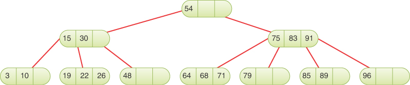

图 9-1 2-3-4 树
这里，根据定义，前三个节点有子节点，底行的七个节点都是叶节点，没有子节点。在 2-3-4 树中，所有叶节点总是在同一层。让所有叶子都处于同一水平确保平衡。

### 名字里有什么？

名称 2-3-4 树中的 2、3 和 4 指的是给定节点可以潜在地引用多少个到子节点的链接。对于非叶节点，可以采用三种排列方式：

- 具有一个数据项的节点总是有两个子节点。
- 具有两个数据项的节点始终具有三个子节点。
- 具有三个数据项的节点始终有四个子节点。

简而言之，非叶节点的子节点必须总是比它们的数据项多一个。或者，象征性地说，如果子链接的个数为L，数据项的个数为D，那么
D = 1 或者 D = 2 或者 D = 3 

L = 0 或者 L = L + 1
这些关键关系决定了 2-3-4 树的结构。叶节点没有子节点，但它仍然可以包含一个、两个或三个数据项。不允许空节点。图 9-1 显示了每种节点的示例。根节点有一个数据项和两个子节点。在其下方，左侧有一个具有两个数据项和三个子节点的节点，右侧有一个具有三个数据项和四个子节点的节点。其余的是具有一个、两个或三个数据项的叶节点。
因为 2-3-4 树的节点最多可以有四个子节点，所以它被称为 4 阶多路树。
你可能想知道为什么 2-3-4 树不称为 1-2-3-4 树。一个节点不能像二叉树中的某些节点那样只有一个子节点吗？二叉树——在第 8 章"二叉树"中描述——可以被认为是二阶多路树，因为每个节点最多可以有两个子节点。然而，二叉树和 2-3-4 树之间有两个重要的区别。显而易见的是最大数量的子节点——在 2-3-4 树的情况下是四个。在二叉树中，一个节点最多可以有两个子链接。一个链接，到它的左边或右边的子节点，也是完全允许的。另一个链接具有空值或无值。
另一方面，在 2-3-4 树中，非叶节点至少有两个子节点；不允许使用具有单个链接的内部节点。具有一个数据项的节点必须有两个链接或者是叶子，在这种情况下它没有链接。

### 2-3-4 树术语

2-3-4 树中的节点以其子链接数命名。你可能想通过它们包含的数据项的数量来调用它们，但这可能会对它们是否是叶节点产生一些疑问。相反，你将图 9-1 的根节点称为 2 节点，因为它有两个子节点（并且，按照规则，一个数据项 54）。根左侧的子节点是 3 节点，因为它有三个子节点（以及两个数据项，15 和 30）。最后一个内部节点是一个 4-node，有 3 个数据项：75、83 和 91。底部节点仍然称为叶节点，而不是 0-节点。事实上，尽管它们没有子节点，但有时根据它们包含的数据项的数量将它们称为 2 节点、3 节点或 4 节点。
为了方便起见，我们将节点中的数据项从 0 到 2 编号，子链接从 0 到 3 编号。节点中的数据项按升序排列，按照惯例从左到右（从低到高的数字） .因此，我们指的是数据（或键）0、数据 1、数据 2、子项 0、子项 1、子项 2 和子项 3，而不是左、中和右。

### 2-3-4 树组织

任何树结构的一个重要方面是它的链接与其数据项的键值之间的关系。在二叉搜索树中，键小于节点键的所有子节点都在以节点的左子节点为根的子树中，键大于或等于节点键的所有子节点都以节点的右子节点为根。在 2-3-4 树中，原理是相同的，因为它们总是用于搜索，但还有更多：

- 以子节点 0 为根的子树中的所有子节点的键值都小于键 0。
- 以子节点 1 为根的子树中的所有子节点的键值都大于键 0 但小于键 1。
- 以子节点 2 为根的子树中的所有子节点都具有大于键 1 但小于键 2 的键值。
- 以子节点 3 为根的子树中的所有子节点都具有大于键 2 的键值。

键在节点内按升序存储，通常在数组内。它们按数组的索引命名，而不是按"左"、"中"和"右"等标签命名。这种关系如图 9-2 所示。 2-3-4 树中通常不允许重复值，因此你无需担心比较相同的键。

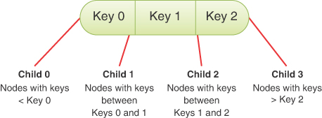

图 9-2 键和子项
再看看图 9-1 中的树。与所有 2-3-4 树一样，叶子都在同一层（底行）。上层节点往往未满；也就是说，它们可能只包含一个或两个数据项，而不是三个。另外，请注意树是平衡的。即使你按升序（或降序）顺序插入一系列数据，它也会保持平衡。 2-3-4 树的自平衡能力源于插入新数据项的方式，我们稍后将对此进行描述。

### 搜索 2-3-4 树

查找具有特定键的数据项就像二叉树中的搜索例程。你从根开始，除非在那里找到搜索键，否则选择通向具有适当值范围的子树的链接。
例如，要在图 9-1 中的树中搜索键为 89 的数据项，你可以从根开始。你搜索根但没有在其键中找到 89。因为 89 大于 54，所以你转到子节点 1，它表示为 75-83-91。 （记住子节点 1 在右边，因为子节点和链接的编号从左边的 0 开始。）你也没有在这个节点中找到密钥，所以你必须转到下一个子节点。在这里，因为 89 大于 83 但小于 91，所以你转到子节点 2。这次，你在 85-89 节点中找到指定的项目。

### 插入

新数据项总是插入到树的底行的叶子中。如果将项目插入到有子节点的节点中，则需要更改子节点的数量以维护树的结构，该结构规定一个节点中的子节点应该比数据项多一个。
插入 2-3-4 树有时很容易，有时却相当复杂。在任何情况下，该过程都是从搜索合适的叶节点开始的。
如果搜索过程中遇到的所有节点都有空间，则插入很容易。当到达合适的叶节点时，新的数据项被简单地插入其中。图 9-3 显示了一个带有键 46 的数据项被插入到图 9-1 中的 2-3-4 树中。显示了到46所属叶节点的路径。

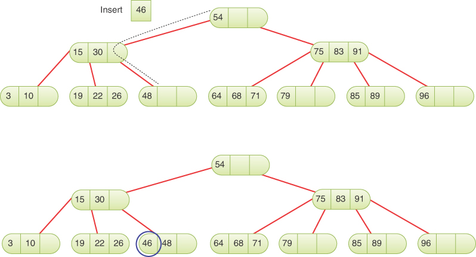

图 9-3 没有分割的插入
插入可能涉及移动一个节点中的一个或两个其他项目，以便在插入新项目后键的顺序正确。在这个例子中，48 必须向右移动以便为 46 腾出空间。

### 节点分裂

如果在向下到插入点的路径上遇到完整节点，则插入会变得更加复杂。全节点是包含三个数据项的节点。发生这种情况时，必须拆分节点。分裂过程使树保持平衡。我们在这里讨论的这种 2-3-4 树通常称为自上而下的 2-3-4 树，因为节点在向下到插入点的路径上被拆分。
这是插入过程拆分非根节点时发生的情况。 （我们稍后研究分裂根。）

- 创建一个新的空节点。它是被拆分节点的兄弟节点，将被放置在它的右侧。
- 数据项 2 被移动到新节点中。
- 数据项 1 被移动到被拆分节点的父节点中。
- 数据项 0 保留在被拆分节点中的位置。
- 最右边的两个子节点与正在分裂的节点断开连接并连接到新节点。

图 9-4 显示了节点拆分的示例。描述节点拆分的另一种方式是说一个 4 节点已转换为两个 2 节点。

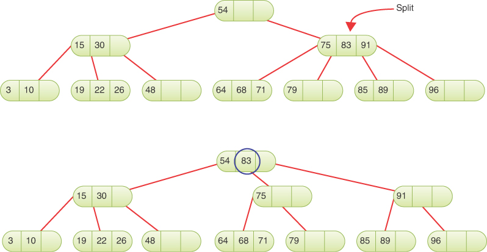

图 9-4 拆分非根节点
请注意，节点拆分的效果是将数据向上或向右移动。如图中圆圈所示，来自拆分节点的密钥 1 向上移动到父节点。 75 和 91 密钥作为提升密钥两侧的子节点进入它们自己的节点。这种重新排列使树保持平衡。
该示例仅显示了一个节点分裂，但在到插入点的路径上可能会遇到多个完整节点。在这种情况下，将出现多次拆分。
完整节点可以出现在树中的任何位置。当全节点为叶子时，它没有子节点，如图9-4中的节点19-22-26和64-68-71。如果它是一个内部节点，那么它必须有四个子节点，就像节点 75-83-91 在它被拆分之前所做的那样。

### 分裂根

当开始搜索插入点时遇到全根节点时，拆分结果稍微复杂一些：

- 创建一个新的根节点。它保存被拆分节点的数据项 1，并成为旧根节点的父节点。
- 创建第二个新节点。它成为被拆分节点的兄弟节点。
- 分裂根的数据项 2 被移动到新的兄弟节点中。
- 旧根维护数据项 0（丢弃其对数据项 1 和 2 的引用）。
- 被分裂的旧根节点最右边的两个子节点与它断开连接并连接到新的兄弟节点。

图 9-5 显示了正在拆分的根。这个过程创建了一个比旧根更高级别的新根。因此，树的总高度增加了 1。描述分裂根的另一种方式是说一个 4 节点被分裂成三个 2 节点。

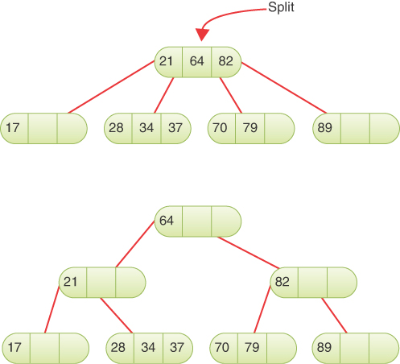

图 9-5 拆分根
如前所述，节点分裂发生在搜索插入节点期间。每次拆分后，插入点的搜索继续沿着树向下，可能会找到更多需要拆分的完整节点。在图 9-5 中，如果要插入的数据项的关键字介于 21 和 64 之间，则对插入节点的搜索将导致包含 28-34-37 的节点。该节点必须拆分，因为它已满。插入任何其他叶节点都不需要再次拆分。

### 在下降的路上分裂

请注意，因为所有完整节点都在下降的过程中被拆分，所以拆分不会产生波及整个树的效果。被拆分的任何节点的父节点都保证不会满，因此可以接受数据项 1 而无需拆分自身。当然，如果这个parent在它的child分裂的时候已经有两个child，那么随着数据项1的加入，它就会变满。变满意味着下次插入搜索遇到它的时候，它就会分裂。
图 9-6 显示了一系列从空树开始并构建三层树的插入。有五个节点分裂：两个根节点和三个叶子节点。插入 79 后，树与图 9-5 顶部相同。与该示例不同，图 9-6 中下一次插入 49 会导致两次拆分：一次在根节点，一次在包含 28-34-37 的叶节点。分裂根增加了第三层，分裂叶节点可以在 37 之后插入 49。树在每个阶段都保持平衡，并且每当分裂根节点时层数都会增加。

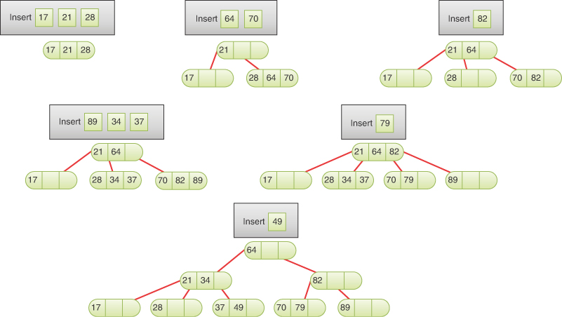

图 9-6 插入 2-3-4 树

## Tree234 可视化工具

操作 Tree234 可视化工具提供了一种查看 2-3-4 树如何工作的详细信息的方法。 当你启动可视化工具时，你会看到如图 9-7 所示的屏幕。

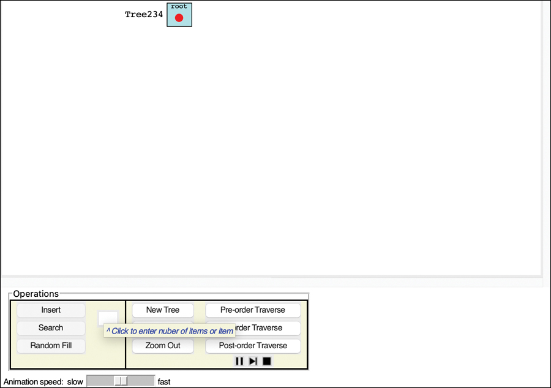

图 9-7 Tree234 可视化工具
当你启动该工具时，树最初是空的。顶部的 Tree234 标签用于树对象本身，带有指向根节点的空指针。这与你在第 8 章中看到的二叉搜索树的结构相匹配。

### 随机填充和创建按钮

你可以使用随机填充按钮将项目添加到树中。你在文本输入框中键入要添加的数据项数，然后选择随机填充。尝试向空树添加一些项目（最多三个）以查看第一个节点的创建。与二叉搜索树一样，每个项目都有一个数字键和一个彩色背景来表示用键存储的数据。
填写许多项目（允许的最大值为 99）将创建一个大的 2-3-4 树。因为 2-3-4 树可能非常"浓密"（宽），所以它们很难轻松地适合屏幕。可视化提供了用于在较大的树上缩放和滚动的工具，但通过关注较小的树更容易了解 2-3-4 树的运作方式。要使所有节点都可见，请使用 10 个或更少的数据项填充空树。
如果你创建了一棵大树并想返回到较小的树，请使用"新建树"按钮返回到空树。然后，你可以随机添加新项目，也可以使用我们稍后描述的"插入"按钮添加新项目。

### 搜索按钮

你可以通过在文本输入框中键入键值并选择"搜索"按钮来观察可视化工具定位数据项的过程。使用指针设备单击现有数据项可在文本输入框中输入其密钥。你可以使用 Step 和 Pause/Play 按钮停止动画以观察各个步骤。
搜索涉及检查每个级别上的一个节点。在每个非叶节点中，该算法检查每个数据项，从左侧开始，查看它是否与搜索关键字匹配，如果不匹配，则下一步应该转到哪个子节点。在叶节点中，它检查每个数据项以查看它是否与搜索关键字匹配。如果在叶节点中找不到指定的项，则搜索失败。

### 插入按钮

Insert 按钮导致在树中插入一个新数据项，该数据项具有在文本框中指定的键。该算法首先搜索合适的叶节点。如果沿途遇到一个完整节点，它会在继续之前拆分该节点。拆分节点会加宽树，因此展开的树的部分可能会放置在可见区域之外。分裂根节点会使树变得更高更窄。对于高大的树，根节点可能出现在最右边，以期在第 1 级进一步分裂以扩大树。
试验插入过程。观察当到插入点的路径上没有完整节点时会发生什么。这个过程很简单。然后尝试在包含完整节点的路径末尾插入，可以是根节点、叶节点或两者之间的某个位置。观察新节点是如何形成的，被拆分节点的内容分布在三个不同的节点中。

### 缩放和滚动

查看 2-3-4 树的问题之一是有很多节点和数据项仅向下几层。将级别数保持在最低限度当然有利于搜索速度，但是当水平显示时很难看到特定级别上的所有项目。第 0、1 和 2 层相当容易看到，但是当树生长到第 3 层或更深时，叶节点会散布很长的距离。
当树的大小大于窗口中可以显示的大小时，你可以使用滚动条在树中移动。你还可以放大和缩小以专注于树的特定部分或尝试查看整体形状。放大和缩小按钮可让你缩小或扩大视图中心周围的焦点。
你还可以通过双击树或其背景进行缩放。每次双击都会放大一个步骤，同时将单击的点保持在屏幕上的同一位置。双击时按住 Shift 键或使用第二个鼠标按钮可围绕单击点缩小一步。当一个或两个滚动条消失时，可能无法再以单击点为中心。滚轮也应该可以改变缩放系数。返回空（新）树将恢复缩放系数并删除滚动条。
例如，如果你从一棵空树开始并插入 55 个随机数据项，你将生成类似于图 9-8 的视图，其中只有 11 个项是可见的。

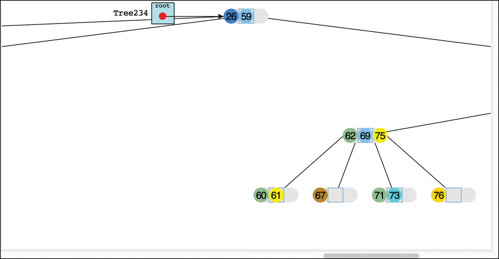

图 9-8 包含 55 个数据项的树的放大视图
如果缩小五步，视图将变成图 9-9 所示的样子。 你现在可以看到所有四个级别的数据项，但个别项目变得难以辨认。 间隙的存在是为了在叶级容纳新节点。

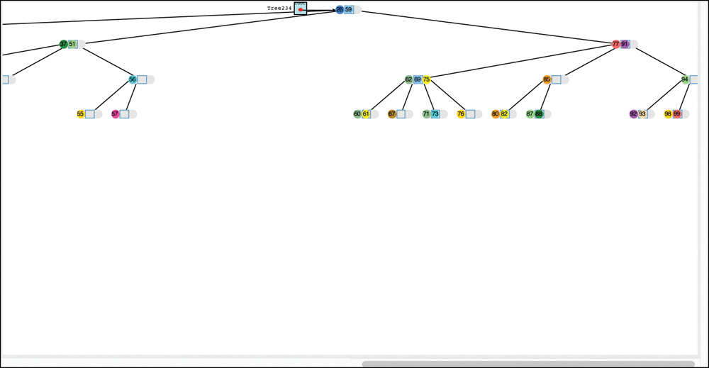

图 9-9 同一 55 个数据项树的缩小视图
使用缩放和滚动控件可以让你同时看到全局和细节，我们希望将两者放在一起。
在动画操作期间，代码保留指向树中一个或两个节点的指针。可视化工具试图通过更改滚动条使这些活动指针在屏幕上可见。当你放大到大树的几个节点时，程序对滚动条的操作会导致视点的大幅跳跃。该工具不会更改缩放系数，将其留给你。如果你双击，则可以在动画暂停时更改缩放比例，但可能会在错误的位置留下一些指针。

### 实验

Tree234 可视化工具提供了一种快速了解 2-3-4 树的方法。尝试将项目插入树中。注意节点分裂。在一个即将发生之前停下来，并找出来自拆分节点的三个数据项将去往何处。然后恢复动画，看看你是否正确。随着树变大，你需要绕着它移动才能看到所有节点。
你可以在树中插入多少个数据项？这是有限制的，因为只允许使用值为 0 到 99 的键。这一百个项目可以打包到少至 34 个节点中，因为每个节点可以容纳三个项目。
可以有多少级？在第 0 层，正好有 1 个节点。在第 1 层，有 4 个，在第 2 层，有 16 个。最大尺寸的树至少占据 34 个节点，因此它必须在第 3 层有一些节点。根据插入项目的顺序，一些分裂可能导致树达到第 4 级。是否有可能达到第 5 级的情况？到 6？
你可以通过故意将它们插入位于没有完整节点的路径上的节点来在最少的级别中插入最多的项目，这样就不需要拆分。当然，没有办法用真实数据来保证这样的排序。

## 2-3-4 树的 Python 代码

在本节中，我们将研究一个实现 2-3-4 树的 Python 程序。我们分节介绍代码。你可以使用此文本在补充文件中获得完整的 Tree234.py 程序，你可以在可视化工具的代码窗口中看到其中的大部分内容。该程序相对复杂，尽管它在某些方面类似于第 8 章中描述的二进制搜索树。通常最好在编辑器中细读整个程序以了解其工作原理。
与 BinarySearchTree 一样，此数据结构使用两个类：Tree234 和 \_\_Node。 Tree234 是公共类，\_\_Node 是其中定义的私有类。让我们从 \_\_Node 类开始。

### \_\_Node 类

\_\_Node 类的对象表示树的各个节点。它们管理存储在节点上的项目以及对任何子树的引用。我们将 \_\_Node 类定义为 Tree234 类中的私有类，以指示调用程序不应更改树的内部关系。
如清单 9-1 所示，Tree234 类为它可以存储的子链接和键值对（数据项）的最大数量定义了相关常量。 \_\_Node 类在为数据分配数组时使用这些常量。在此实现中，键、它们对应的值和相关的子项保存在单独的数组中。这种安排与其他数据结构形成对比，其他数据结构为每个数据项存储单个对象并使用键函数从对象中提取键值。两种风格各有优势。
\_\_Node 对象的构造函数将单个键和数据值作为输入。原因是 2-3-4 树中的节点必须始终至少存储一项；永远不会有空节点。该节点可以是叶节点或持有一项的内部节点。当其他节点分裂时（第一个根除外）创建节点。根据被拆分的节点是根节点、内部节点还是叶节点，被构造的节点将有两个或没有子节点。构造函数的子参数前的星号表示 Python 会将数据参数后的任何参数解释为对子节点的引用。
与 \_\_Node 对象类型相同的子参数放置在有效列表中。该过滤是通过使用列表理解完成的——[x for x in children if isinstance(x, type(self))]——它使用 x 作为变量来遍历所有子项并测试它们是否是该对象的实例类型。列表理解后的第一个 if 语句检查调用者是否将适当数量的有效子节点传递给构造函数。不允许超过两个，因为节点将只有一个项目。 2-3-4 树中不允许有一个子节点。当子节点的数量不是零或两个时，构造函数会引发异常来报告问题。
在验证提供的子节点的数量和类型后，构造函数初始化对象的属性。键值对的数量 nKeys 设置为 1。键和数据放入大小为 maxKeys 的数组中。构造函数分配完整数组，以便稍后在添加或删除更多项时启用移动键和值。请注意，数组被初始化为在其中包含键和数据的三个副本，但多余的副本将被忽略，因为 nKeys 为 1。类似地，子链接存储在 children 数组中，数量保存在 nChild 字段中。 children 数组用 None 填充以确保分配了 maxLinks 个单元格。
清单 9-1 Tree234 类中的 \_\_Node 类

```python
class Tree234(object):  # A 2-3-4 multiway tree class

    maxLinks = 4  # Maximum number of child links
    maxKeys = maxLinks - 1  # Maximum number of key-value pairs

    class __Node(object):  # A node in a 2-3-4 tree
        def __init__(  # Constructor takes a key-data pair
            self,  # since every node must have 1 item
            key,  # It also takes a list of children,
            data,  # either empty or a pair that must
            *children
        ):  # both be of __Node type.
            valid = [
                x
                for x in children  # Extract valid child links
                if isinstance(x, type(self))
            ]
            if len(children) not in (0, 2):  # Check number of children
                raise ValueError(
                    "2-3-4 tree nodes must be created with 0 or 2 children"
                )
            self.nKeys = 1  # Exactly 1 key-data pair is kept
            self.keys = [key] * Tree234.maxKeys  # Store array of keys
            self.data = [data] * Tree234.maxKeys  # Store array of values
            self.nChild = len(valid)  # Store number of valid children
            self.children = valid + [None] * (  # Store list of child links
                Tree234.maxLinks - len(valid)
            )

        def __str__(self):  # Represent a node as a string of keys
            return (
                "<Node234 "
                + "-".join(  # joined by hyphens w/ prefix
                    str(k) for k in self.keys[: self.nKeys]
                )
                + ">"
            )

        def isLeaf(self):  # Test for leaf nodes
            return self.nChild == 0
```

我们提供了一个 \_\_str\_\_() 方法来启用节点检查和打印树。此函数通过使用连字符连接键列表，将包含键 27 和 48 的节点转换为字符串"<Node234 27-48>"。放入字符串中的键受节点的 nKeys 属性限制。 isLeaf() 方法检查节点是否是没有子节点的叶节点或内部节点。
构造完2-3-4节点后，需要能够向其中插入其他数据项。与二叉搜索树相比，2-3-4 节点拥有不止一个键和数据。插入发生在拆分任何完整的 2-3-4 节点并找到新项的键所属的叶节点之后。插入也可以发生在分裂节点时，在父节点中插入key 1。清单 9-2 中所示的 insertKeyValue() 方法采用一个键、一个数据值和一个可选的子树来执行此操作。在拆分期间将项目插入内部节点时需要子树。
清单 9-2 \_\_Node 对象的 insertKeyValue() 方法

```python
class Tree234(object):  # A 2-3-4 multiway tree class
…
    class __Node(object):  # A node in a binary search tree
    …
        def insertKeyValue(  # Insert a key value pair into the
            self,  # sorted list of keys. If key is already
            key,  # in list, its value will be updated.
            data,  # If key is not in list, add new subtree
            subtree=None,
        ):  # if provided, just after the new key
            i = 0  # Start looking at lowest key
            while (
                i < self.nKeys and self.keys[i] < key  # Loop until i points to a key
            ):  # equal or greater than goal
                i += 1  # Advance to next key
            if i == Tree234.maxKeys:  # Check if goal is beyond capacity
                raise Exception("Cannot insert key into full 2-3-4 node")
            if self.keys[i] == key:  # If the key is already in keys
                self.data[i] = data  # then update value of this key
                return False  # Return flag: no new key added
            j = self.nKeys  # Otherwise point j at highest key
            if j == Tree234.maxKeys:  # Before shifting keys,
                raise Exception(  # raise exception if keys are maxed out
                    "Cannot insert key into full 2-3-4 node"
                )
            while i < j:  # Loop over keys higher than key i
                self.keys[j] = self.keys[j - 1]  # and shift keys, values
                self.data[j] = self.data[j - 1]  # and children to right
                self.children[j + 1] = self.children[j]
                j -= 1  # Advance to lower key
            self.keys[i] = key  # Put new key and value in hole created
            self.data[i] = data  # by shifting array contents
            self.nKeys += 1  # Increment number of keys
            if subtree:  # If a subtree was provided, store it
                self.children[i + 1] = subtree  # in hole created
                self.nChild += 1  # This node now has one more child
            return True  # Return flag: a new key was added
```

在排序数组中插入键与第 3 章"简单排序"中使用的插入排序过程相同。因为我们选择将键、值和子树存储在具有相关索引的单独数组中，所以重用 SortArray 类有点复杂。相反，我们实现了一个简单的 while 循环来查找新键的插入索引。因为最大数组只有三个元素长，所以我们可以使用更简单的线性搜索而不是对性能影响很小的二分搜索。在将 i 设置为应插入键的索引后，循环退出，如果插入会溢出数组，则该方法会引发异常。
下一个 if 语句检查要插入的键是否与现有键重复。在这种情况下，它只是更新与该键关联的数据值并返回一个布尔标志以指示没有插入新键。或者，该方法可以引发异常以禁止重复键。
insertKeyValue() 的下一部分使用索引 j 来索引必须存储在节点中的最高键。当 j == Tree234.maxKeys 时，节点必须已满，因此会引发异常，而不是溢出存储。 j 变量指向最后一个活动键之后的单元格。 while 循环将键、数据值和子链接移动到更高的索引，以便为索引 i 处的插入腾出空间。 children 数组中的引用从相应的键和数据数组偏移一个。移动所有单元格值后，可以在索引 i 处插入新键和数据。增加键的数量并插入新的子树（如果提供）。
insertKeyValue() 方法以返回 True 结束，表示插入添加了键和值。在下一节中，你会看到该返回值如何使调用者受益于不同类型的 2-3-4 树插入。

### Tree234 类

Tree234 类的对象表示整棵树。该类只有一个字段 root，它是一个 \_\_Node 对象或 None。所有公共操作都从根开始，但有几种方法可以受益于对特定 \_\_Node 对象指定的子树进行操作的私有递归方法。
清单 9-3 中所示的 Tree234 对象的构造函数通过简单地将根字段设置为 None 来创建一个空树。 isEmpty() 方法通过比较 root 和 None 来检查是否有任何项目被插入到树中。 root() 方法使用它在空树上引发异常。对于包含节点的树，它返回根节点包含的数据和键的数组。 Python 数组长度（切片的）表示根节点是否包含一项、两项或三项。

### 搜索
搜索具有指定目标键的数据项（可能用于插入）由 \_\_find() 例程执行。清单 9-3 中所示的方法是一个私有方法，它将返回目标节点及其父节点的 \_\_Node 对象。这将用于 search() 和 insert() 操作，这在搜索过程中是否应拆分完整节点方面有所不同。 prepare 参数告诉方法是否在搜索期间拆分这些节点。
通过使用相同的例程执行搜索和插入，\_\_find() 必须根据操作对重复键执行不同的操作。搜索现有键和插入重复键都调用 \_\_find() ，目标是匹配树中的某个键。对于搜索，\_\_find() 应该使用键定位节点并返回其关联的数据值。它不需要拆分任何完整节点，因为树没有被改变。
清单 9-3 Tree234 类的构造函数、基本方法和 __find() 方法

```python
class Tree234(object):  # A 2-3-4 multiway tree class
…
    def __init__(self):  # The 2-3-4 tree organizes items in  # nodes by their keys.
        self.__root = None  # Tree starts empty.

    def isEmpty(self):  # Check for empty tree
        return self.__root is None

    def root(self):  # Get the data and keys of the root node
        if self.isEmpty():  # If the tree is empty, raise exception
            raise Exception("No root node in empty tree")
        nKeys = self.__root.nKeys  # Get active key count
        return (  # Otherwise return root data and key
            self.__root.data[:nKeys],  # arrays shortened to current
            s1elf.__root.keys[:nKeys],
        )  # active keys

    def __find(
        self,  # Find a node with a key that matches
        goal,  # the goal and its parent node.
        current,
        parent,  # Start at current and track its parent
        prepare=True,
    ):  # Prepare nodes for insertion, if asked
        if current is None:  # If there is no tree left to explore,
            return (current, parent)  # then return without finding node
        i = 0  # Index to keys of current node
        while (
            i < current.nKeys and current.keys[i] < goal  # Loop through keys in current
        ):  # node to find goal
            i += 1
        if (
            i < current.nKeys
            and goal == current.keys[i]  # If key i is valid and matches goal
        ):
            return (current, parent)  # return current node & parent
        if (
            prepare
            and current.nKeys  # If asked to prepare for insertion and
            == Tree234.maxKeys
        ):  # node is full,
            current, parent = self.__splitNode(  # then split node, update
                current, parent, goal
            )  # current and parent, and adjust i
            i = 0 if goal < current.keys[0] else 1  # for new current
        return (
            (prepare and current, parent)  # Return current if
            if current.isLeaf()
            else self.__find(  # it's a leaf being prepared  # Otherwise continue search recursively
                goal,  # to find goal
                current.children[i],  # in the ith child of current
                current,
                prepare,
            )
        )  # and current as parent
```

对于插入，\_\_find() 应该在搜索下降到树时拆分完整节点。如前所述，在从根下降的同时拆分完整节点可以保持树的平衡。如果 \_\_find() 开始插入操作但最终找到了目标键的副本，它将更新该键的数据。这使得 2-3-4 树表现为重复键的关联键存储。
\_\_find() 例程递归地下降 2-3-4 节点。它从当前节点开始并跟踪其父节点。调用者通常传递根节点，父节点指向 Tree234 对象本身。如果 current 为 None，\_\_find() 立即返回它和父指针，处理基本递归情况。当存在当前节点时，第一步是确定目标键在现有键中的哪个位置。
将索引 i 设置为 0（最低键索引）后，while 循环遍历所有有效键，并在第 i 个键等于或大于目标时停止。因为排序后的数组最多包含三个键，所以对目标键使用二进制搜索不会保存超过一次比较。循环后，如果目标被发现为有效键，则它可以返回当前节点及其父节点。请注意，即使此节点已满且 \_\_find() 正在准备插入，也无需拆分它。更新重复键的数据不需要拆分。
下一个 if 语句处理拆分完整节点。当 prepare 标志为 true 并且键的数量是允许的最大值时，它调用 \_\_splitNode() 方法将这些键数据对重新分配到单独的节点中。执行该拆分可以更改当前指针和父指针的位置，因此 \_\_find() 会根据调用的多个结果更新这些变量。请记住，拆分根需要为被拆分的节点创建一个新的父节点，并且该父节点成为新的根节点。因为键数据对被移动了，它还需要更新当前节点中的第 i 个索引。当前节点将只剩下一个键（当被 \_\_splitNode() 方法拆分时，你很快就会看到），因此它只需要检查目标是在第一个键之前还是之后。当目标为before时，i索引设置为0；否则，它被设置为 1。
此时，\_\_find() 还没有找到目标，它已经执行了任何请求的拆分。如果存在，搜索应该在其中一个子节点中继续。这里有几个案例。如果当前节点是叶子节点，则没有子节点，这是应该插入或搜索应该终止的节点。复杂的 return 语句首先检查 current.isLeaf() 是否返回 true。如果是这样，它会返回当前节点和父节点并进行一次额外检查。通过返回 prepare 和 current 作为第一个结果，当调用是搜索操作的一部分并返回 current 作为插入的一部分时，\_\_find() 最终返回 False。检查准备标志并有条件地返回当前处理叶节点上的两种操作。
如果当前节点不是叶节点，则搜索和插入都必须在子节点中继续。确切的子节点取决于 while 循环结束的位置。如果目标小于最低键，i 将为 0，最低索引的子节点将是下一个要探索的。检查的每个其他键都增加了 i 并移动到子数组中的下一个链接。如果三个键都被选中，则 i 结束于最后一个子节点。 \_\_find() 方法用第 i 个子节点递归地调用自己。该子节点的父指针是当前节点，因为它下降到树中。如果必须拆分当前节点，则在进行递归调用之前调整 i 索引以指向适当的子节点。
分裂全节点
拆分包含三个项目的节点的方法，\_\_splitNode()，如清单 9-4 所示。参数是对要拆分的节点、toSplit、其父节点和插入树中的目标键的引用。它处理所有三种情况的拆分：根节点、内部节点和叶节点。所有情况都需要至少创建一个包含键（和数据）的新节点 2. 如果 toSplit 节点也是叶节点，则该 newNode 是叶节点。第一个 if 语句检查节点在树中的位置，并将最高的两个子链接传递给 \_\_Node() 构造函数（如果它们存在）。这些是键 2 正下方和上方的子链接。
清单 9-4 Tree234 的 \_\_splitNode() 方法

```python
class Tree234(object):  # A 2-3-4 multiway tree class
…
    def __splitNode(  # Split a full node during top-down
        self,  # find operation.
        toSplit,  # Node to split (current)
        parent,  # Parent of node to split (or tree)
        goal,
    ):  # Goal key to find
        if toSplit.isLeaf():  # Make new node for Key 2, either as a
            newNode = self.__Node(  # leaf node
                toSplit.keys[2], toSplit.data[2]  # with key 2 and value 2 as its
            )  # sole key-value pair
        else:
            newNode = self.__Node(  # or as an internal node
                toSplit.keys[2],  # with key 2 and value 2 as its
                toSplit.data[2],  # sole key-value pair and the highest
                *toSplit.children[2 : toSplit.nChild]
            )  # 2 child links
        toSplit.nKeys = 1  # Only key 0 and data 0 are kept in
        toSplit.nChild = max(  # node to split and child count is
            0, toSplit.nChild - 2
        )  # either 0 or 2
        if parent is self:  # If parent is empty (top of 2-3-4 tree)
            self.__root = self.__Node(  # make a new root node
                toSplit.keys[1],  # with key 1 and value 1
                toSplit.data[1],  # and the node to split plus new node
                toSplit,
                newNode,
            )  # as child nodes
            parent = self.__root  # New root becomes parent
        else:  # For existing parent node,
            parent.insertKeyValue(  # insert key 1 in parent with
                toSplit.keys[1],  # new node as its higher subtree
                toSplit.data[1],
                newNode,
            )
        return (
            toSplit  # Find resumes at node to split if goal
            if goal < toSplit.keys[1]  # is less than key 1
            else newNode,  # else new node
            parent,
        )  # Parent is either new root or same
```

在 \_\_splitNode() 创建新节点后，接下来的语句将节点的键和子节点的数量更新为 Split。该节点在拆分后将仅包含键（和数据）0。该方法将对其他键、数据和子链接的引用留在数组中，因为它很快需要引用键 1。理想情况下，数组单元格应设置为 None 以擦除额外的引用。仅保留键 0 意味着 toSplit 节点现在有两个或没有子链接，具体取决于它是否是叶节点。
在 \_\_splitNode() 改变键和子链接的数量后，下一个 if 语句通过测试其父节点是否为 Tree234 对象本身来检查 toSplit 节点是否为根节点。拆分根节点需要创建第二个新节点作为树的根。新的根持有节点 toSplit 的密钥（和数据）1。新节点成为包含键 0 的节点 toSplit 和包含键 2 的新节点的父节点。
随着新根的创建，从 \_\_find() 方法传递的父引用被设置为该根。该父指针将很快返回，因此调用者可以识别新的父节点。
如果toSplit节点不是根节点，那么它一定是一个内部节点或叶节点，\_\_splitNode()应该通过调用insertKeyValue()将它的键（和数据）1插入到已有的父节点中。请记住，父节点不能是完整的，因为它会在之前调用 \_\_find() 方法时被拆分，这是对父节点的调用。你还知道，在键 1 上方保存键的子树以先前创建的新节点为根，仅保存键 2。
此时，在第二个if语句之后，所有存储在toSplit节点的数据项都已经被放置到它们的新节点中，并且这些节点已经相互链接。是时候返回 \_\_find() 方法并将其当前指针和父指针更新到应该继续搜索的位置。当前指针应该指向包含目标的子树。这意味着要返回的子树是基于目标与被拆分的键之间的关系。如果目标键小于节点 toSplit 的键 1，则搜索将继续使用同一节点，因为它包含键 0 及其下方的任何子树。类似地，如果目标键大于键 1，则搜索应继续使用创建的包含键 2 及其子链接（如果有）的新节点。目标键不能与键 1 匹配，因为这意味着它是 \_\_find() 方法处理的副本。 parent 的返回值很简单，因为它始终是变量 parent，尽管如果 toSplit 节点是根节点，则可以修改它。
你现在拥有定义 public search() 和 insert() 方法所需的所有模块，如清单 9-5 所示。两者都通过在根上调用 \_\_find() 来获取指向持有或应该持有目标键的节点的指针。 search() 方法为准备标志传递 False 以避免分裂节点，并允许 \_\_find() 在未找到目标时返回 None 或 False。如果返回一个节点，则其键之一必须与目标匹配。 search() 的返回语句通过检查节点中键的数量及其键 1 与目标的关系来选择三个 node.data 项之一。如果 \_\_find() 没有返回任何节点，则 search() 也返回 None。
insert() 方法几乎一样简单。如果 \_\_find() 没有返回任何节点，那么树应该没有叶（或其他）节点。这与你在其他数据结构中看到的 find 方法不同，但请记住，\_\_find() 方法将拆分节点以为要插入的键腾出空间。第二个 if 语句检查父 p。如果它是 Tree234 对象，那么这是添加到空树中的第一个键。树的根节点设置为一个新的 \_\_Node，其中包含要插入的键和值，没有子节点。它返回 True 以指示插入了一个新项目。如果父对象不是 Tree234 对象并且节点是 None，那么就会发生错误，它会引发异常。这只有在 \_\_find() 方法开始通过一些 2-3-4 节点下降并最终为插入节点返回 None 时才会发生。
清单 9-5 Tree234 的 search() 和 insert() 方法

```python
class Tree234(object):  # A 2-3-4 multiway tree class
…
    def search(self, goal):  # Public method to get data associated
        node, p = self.__find(  # with a goal key. First, find node
            goal,
            self.__root,  # starting at root with self as parent
            self,
            prepare=False,
        )  # without splitting any nodes
        if node:  # If node was found, find key in node
            return node.data[  # data. It's the first data (index 0) if
                0
                if node.nKeys < 2 or goal < node.keys[1]  # there's only 1 key or
                else 1  # if the goal < key 1, else it's
                if goal == node.keys[1]  # the 2nd data if goal == key 1
                else 2
            ]  # Otherwise it's the 3rd data

    def insert(
        self,  # Insert a new key-value pair in a
        key,  # 2-3-4 tree by finding the node where
        value,
    ):  # it belongs, possibly splitting nodes
        node, p = self.__find(  # First, find insertion node for key
            key, self.__root, self, prepare=True  # starting at root with self as parent
        )  # and splitting full nodes
        if node is None:  # If no node was found for insertion
            if p is self:  # Check if this the root
                self.__root = self.__Node(  # Make a root node with just
                    key, value
                )  # 1 key value pair
                return True  # and return True for node creation
            raise Exception(  # If not root, then something is wrong
                "__find did not find 2-3-4 node for insertion"
            )
        return node.insertKeyValue(  # Otherwise, insert key in node
            key, value
        )  # with no subtree, returning insert flag
```

当 \_\_find() 返回一个非空的 2-3-4 节点时，insert() 方法将键值对插入该节点。如果插入新键，则 insertKeyValue() 方法返回 True，如果更新现有键，则返回 False。 insert() 方法将该标志返回给它的调用者。
如你所见，2-3-4 树中的插入比二叉搜索树或有序链表中的插入要复杂得多。如果代码在某些地方让你感到困惑，请使用可视化工具并逐步解决这些令人困惑的地方。在数据结构更新时查看代码和数据结构有助于阐明每行代码的算法和目的。

### 遍历

遍历 2-3-4 树为可能的树遍历顺序添加了一些新的皱纹。中序遍历应该按照关键字的升序访问每个数据项，类似于二叉搜索树。这很容易做到，首先遍历子节点 0，然后在节点中的键和它们对应的"正确"子节点之间交替。就节点的子节点和键名称而言，这将是子节点 0、键 0、子节点 1、键节点 1、子节点 2、键节点 2 和子节点 3。
不太清楚预序或后序遍历应该做什么。前序遍历的一种选择是在访问节点的任何子节点之前访问存储在节点中的所有键值对。另一种方法是在访问前两个子节点之前访问最小的键以模仿二叉树的行为，然后在子节点 2 之前访问键 1，在子节点 3 之前访问键 2。这种方法在某种程度上保留了键 1 的有序行为2. 第三个预排序将访问第一个密钥和第一个子节点，然后是第二个密钥和第二个子节点，然后是第三个密钥以及第三个和第四个子节点。最后一个排序连同后序遍历的对称排序一起显示在图 9-10 中。

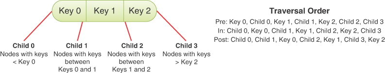

图 9-10 遍历 2-3-4 树
实施的确切顺序取决于数据结构的计划用途。图 9-10 的遍历顺序在 traverse() 生成器中的实现如清单 9-6 所示。与二叉搜索树一样，使用非递归生成器实现它是生成与其数据配对的密钥的最有效方法。
开始时，如果请求的 traverseType 不是预期值之一：pre、in 或 post，则 traverse() 方法会引发异常。接下来，它使用第 5 章"链表"中 LinkStack 中定义的链表栈创建一个栈。堆栈被初始化以保存 2-3-4 树的根节点。这些步骤与二叉搜索树中使用的 traverse() 方法中的步骤相同。
while 循环处理堆栈中的项目，直到它为空。它从堆栈弹出顶部项目并查看其类型以确定下一步做什么。与二叉搜索树的 traverse() 方法一样，可以存在三种类型的项——2-3-4 节点、（键、数据）元组或 None 值——它们出现在空的 2-3-4 树中或者当叶节点将它们的子链接压入堆栈时。
清单 9-6 Tree234 的 traverse() 生成器

```python
from LinkStack import *


class Tree234(object):  # A 2-3-4 multiway tree class
…
    def traverse(
        self, traverseType="in"  # Traverse the tree in pre, in, or post
    ):  # order based on type
        if traverseType not in [  # Verify traversal type is an
            "pre",
            "in",
            "post",
        ]:  # accepted value
            raise ValueError(f"Unknown traversal type: {str(traverseType)}")

        stack = Stack()  # Create a stack
        stack.push(self.__root)  # Put root node in stack

        while not stack.isEmpty():  # While there is work in the stack
            item = stack.pop()  # Get next item
            if isinstance(item, self.__Node):  # If it's a tree node
                last = max(  # Find last child or last key index
                    item.nChild,  # going 1 past last key for post order
                    item.nKeys + (1 if traverseType == "post" else 0),
                )
                for c in range(last - 1, -1, -1):  # Loop in reverse
                    if (
                        traverseType == "post" and c > 0 and c - 1 < item.nKeys
                    ):  # last data item
                        stack.push((item.keys[c - 1], item.data[c - 1]))
                    if (
                        traverseType == "in" and c < item.nKeys  # For in-order, push
                    ):  # valid data items to yield
                        stack.push((item.keys[c], item.data[c]))
                    if c < item.nChild:  # For valid child links,
                        stack.push(item.children[c])  # traverse child
                    if (
                        traverseType == "pre" and c < item.nKeys  # For pre-order, push
                    ):  # valid data items to yield
                        stack.push((item.keys[c], item.data[c]))
            elif item:  # Every other non-None item is a
                yield item  # (key, data) pair to be yielded
```

当要处理的项目是 2-3-4 节点时，各种键和子链接必须按照遍历类型的顺序压入堆栈。每个节点的key和child links的个数不同，叶节点和内部节点在数量关系上也不同。该方法使用子节点数和键数中的最大值来确定需要处理的子节点或键的最后一个索引。对于内部节点，循环必须覆盖所有子节点。对于叶节点，循环必须覆盖所有存储的项目。在后序遍历的情况下，最后一个索引可能与键数加一一样高，这与内部节点的子链接数相同，但叶子节点则不同。添加一个有助于简化接下来的循环。
for 循环在 0 到 last - 1 的范围内以相反的顺序递增变量 c。这个循环不同于你在其他数据结构中看到的，但它需要处理所有不同类型的节点和遍历顺序。反向排序使压入堆栈的项目在被外部 while 循环弹出时以所需的顺序出现。
在循环内部，四个 if 语句控制访问键和子链接的顺序。第一个处理后序遍历。这是三个命令中最复杂的一个，因为你要处理最后一个子节点之后的最后一个键。在这种情况下，你想将 c – 1 键压入堆栈，以便在子 c 之后访问它。例如，在一个完整的 2-3-4 节点中，最后一个键，键 2，必须在压入最后一个子节点，子节点 3 之前被压入堆栈。堆栈项目以相反的顺序处理，在之后产生键 2处理 child 3. if 语句验证 c – 1 在将具有该键及其对应数据的元组推入堆栈之前引用有效键。
第二个 if 语句处理中序遍历的情况。在这种情况下，应该在子 c 之后立即访问 c 键。如果 c 引用节点中的有效键，则将 c 键和 c 数据作为元组推送到堆栈上。
第三个 if 语句处理子 c 的处理。根据遍历类型，你可能已经为 c – 1 键或 c 键推送了 (key, data) 对。现在，当该方法将子项 c 压入堆栈时，该子项将在该键之前立即处理。这个 if 语句在将 c 压入堆栈之前检查它是否引用了一个有效的子级（尽管压入一个 None 值是可以接受的）。此项的类型始终为2-3-4节点，可以与（键，数据）元组区分开来。
第四个也是最后一个 if 语句处理前序遍历的情况。在这种情况下，子项 c 只是被压入堆栈，因此该方法将键 c 及其要处理的数据压入该子项之前。
遍历通常是数据结构中最简单的操作，但是各种类型的节点和其中的项目数量使 2-3-4 树的过程变得复杂。可视化工具显示了三个排序的执行以及此处描述的堆栈内容，以帮助阐明细节。

### 删除

我们展示了插入方法如何在 2-3-4 树中插入项目时保持平衡。如果删除一个节点也能做到这一点就好了。不幸的是，在保持平衡的同时删除比插入要复杂得多。我们回顾了如何完成此任务，但为了简洁起见跳过了详细的实施。

#### 在叶节点处删除

让我们首先考虑简单的情况。如果你从包含多个项目的叶节点中删除一个项目，则除了移动键和数据数组中的项目外，无需执行任何操作。节点中仍然至少有一项，并且它的键与父节点和兄弟节点中的键保持适当的关系。更重要的是，节点的数量和级别是相同的，因此保持了平衡。
叶节点还有一个更简单的情况。当你删除根节点中的唯一项，并且根也是叶节点时，那么它一定是树中的最后一项。删除它意味着树现在是空的。删除树中其他地方的叶节点可能会导致不平衡，我们很快就会看到。

#### 在内部节点删除
现在让我们考虑从内部节点删除。从节点中删除一个项目意味着减少子节点的数量。在某些情况下这是可能的，但并不总是那么容易。你可以将被删除键的"两侧"的两个子树组合起来，但这可能会很混乱。还有别的办法吗？还记得二叉搜索树中的删除吗？当节点有两个子节点时，我们看到了一些简单的情况和更困难的情况。你还记得那个案例的"技巧"吗？
这个想法是你可以通过提升其后继项来替换要删除的项目。后继项在树中具有下一个更高的键。必须有一个，因为你要从至少有两个子节点的内部节点中删除。查找后继项几乎和在二叉搜索树中一样简单。从被删除键"右侧"的子节点开始。如果要删除节点的第 i 个键，则开始在子节点 i + 1 中寻找后继者。这是包含大于第 i 个键的键的子树。然后你跟随任何子 0 链接，直到到达叶节点。叶节点中的最低键标识后继者。
图 9-11 显示了从 2-3-4 树中删除键为 15 的项目的示例。定位到持有key 15和30的节点后，发现15是key 0，是一个内部节点。这意味着后继者必须是该节点的子节点 1 的子树中的最小键。子节点 19-22-26 是叶节点，因此你不必再下降任何级别（通过子节点 0 链接），后继节点是该叶节点 19 中的最小键。如果你将项目 19 在持有项目 15 和 30 的节点中，那么你可以从叶节点中删除项目 19。这是你已经知道如何处理的简单案例。图 9-11 的底部显示了删除项目 15 后的树。项目 19 被提升以填补因删除项目 15 而产生的空洞，项目 22 和 26 在叶节点中左移。

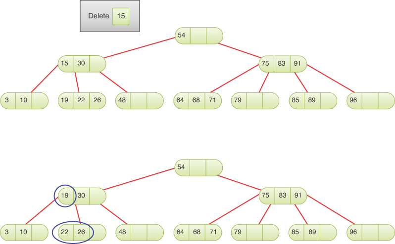

图 9-11 通过提升后继者从内部节点中删除
要从其后继位于具有其他项的叶节点的内部节点中删除项，你现在可以替换项，然后简单地删除叶中的项。树保持相同数量的节点和级别，因此保持平衡。该策略是否适用于所有内部节点中的所有项目？
考虑删除图 9-11 的初始树中的第 30 项。这次你需要在节点 15-30 的子节点 2 中寻找继任者。继任者是 48 岁，但有一个问题。项目 48 是叶节点中的唯一项目。如果你提升它来替换 30，然后从子节点中删除它，你将有一个空的 2-3-4 节点，这是不允许的。还有别的办法吗？
在这种情况下，是的，有。正如有一个后继项一样，内部 2-3-4 节点中的每个项也有一个前驱项。寻找前任是寻找继任者的镜子。搜索从第 i 个子节点开始，然后沿着该子树中的最大子链接（如果有），直到到达叶节点。在叶节点中，最大键标识前驱项。如果前驱不是叶节点中的唯一项，则可以将其提升以替换目标项（键 i）并删除前驱。在删除项目 30 的示例中，这最终成为项目 26 的提升，然后是从叶节点 19-22-26 删除 26 的简单情况。

#### 从 2 节点删除

提拔继任者或前任的技巧非常强大。图 9-11 的初始树的内部节点中的所有六个项目都有一个后继者或前任位于具有多个项目的叶节点中。不幸的是，你不能指望前任或继任者总是与其他项目位于一个节点中。你需要一些其他技术来处理只有一项的节点，也称为 2 节点，因为它们要么是具有两个子节点的内部节点，要么是没有任何子节点的叶节点。
有两种技术可以解决这个问题。考虑从图 9-12 所示的树中删除项目 54。通过链接，你可以看到前导和后继都只包含一个项目（并且可以被认为是 2 节点）。现在你不能简单地选择其中一个来替换第 54 项，因为删除叶子中的单个项目会破坏 2-3-4 树的规则。

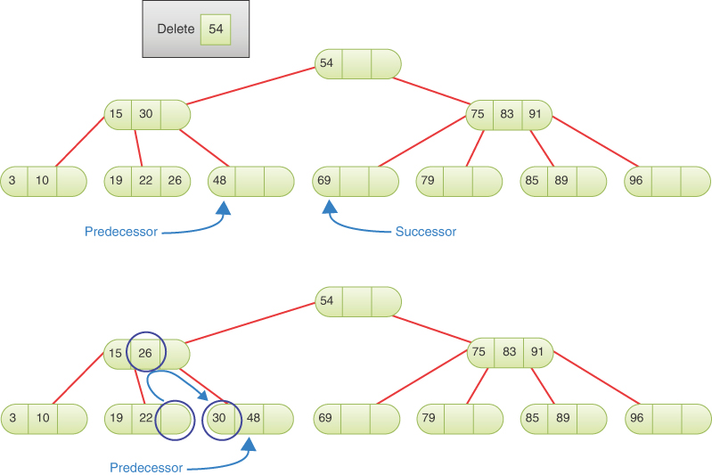

图 9-12 通过将项目旋转到前驱节点来删除项目
要改变前任的情况，我们可以查看它与其兄弟节点的关系。在这种情况下，前任有一个兄弟持有三个项目（可以被认为是一个 4 节点）。我们能不能"借"其中一个让前任有两个呢？嗯，不完全是，但我们可以将兄弟姐妹的项目向上移动，并将前任父项目的项目向下移动。这显示在图 9-12 的底部树中。你将项目 26 从兄弟项目移动到父项目，将项目 30 从父项目移到前任项目。圆圈显示项目更改的位置。
移动这两项称为旋转。旋转重新配置树，而不会破坏 2-3-4 树的任何规则。你仍然按排序顺序存储项目，并且树仍然是平衡的。通过向上旋转项目 26 和向下旋转项目 30，你创建了一个树，你可以在其中进行简单的删除：从叶节点中删除前任项目 48，并将项目 54 替换为项目 48。最后一步未在图 9 中显示 - 12.
只要前驱或后继具有 3 节点或 4 节点的兄弟节点（当其中存储了两个或三个项目时），就可以执行轮换。根据兄弟位于哪一侧，旋转是向左或向右（将较高的键移至较低的兄弟或将较低的键移至较高的兄弟）。父节点可以是任何类型的节点，2 节点、3 节点或 4 节点，因为你只是更改其中的一项。
如果前任和继任者都没有 3 节点或 4 节点兄弟怎么办？这就是图 9-12 中第 54 项的后继项所发生的情况；后继项的键为 69，其唯一的兄弟项是一个包含项 79 的双节点。图 9-13 显示了适用于这种情况的第二种技术。

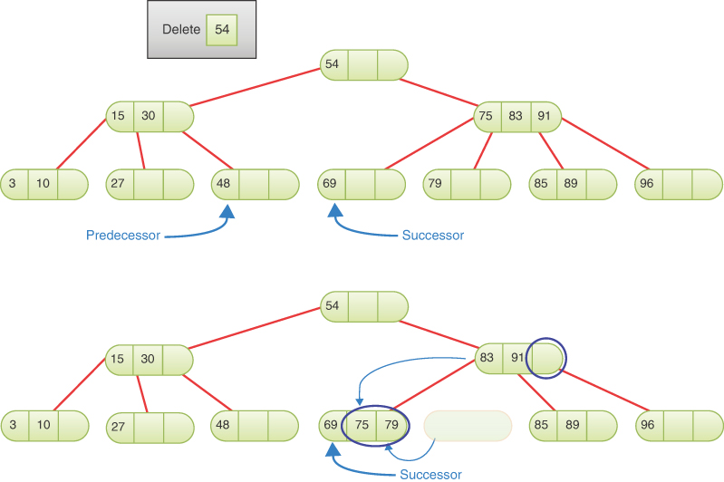

图 9-13 通过将项目融合到后继节点来删除项目
当你尝试修复的 2 节点仅具有也是 2 节点的兄弟节点时，你可以将后继节点的单个项目与兄弟节点的单个项目以及来自其共同父节点的项目融合，只要父节点具有两个或三个项目（是 3 节点或 4 节点）。在图中，项目 54 的后继项目是项目 69，一个 2 节点。继任者的唯一兄弟也是包含单个项目 79 的 2 节点。因为它们的共同父节点 75-83-91 是 4 节点，所以你可以窃取将两个兄弟分开的项目，项目 75，并把它和单项放在一起组成一个新的4-node，节点69-75-79，如下面的树所示。这称为融合操作。
如图 9-13 所示，将两个单项兄弟项与其父项中的一个项融合会从树中删除一个节点。这听起来可能会影响平衡，但如果你仔细观察，它不会。项目保持排序顺序，级别数在任何路径上都没有改变。删除节点的路径消失了，所以不再重要了。从继承者的父项中删除了一项，但这没关系，因为相应的子链接已删除。
结合使用旋转和融合，可以将后继节点或前导节点中的一个节点变成一个多项节点，然后在树中更高层替换要删除的项后执行删除。虽然我们已经展示了前驱旋转和后继融合，但它们确实可以应用于任何一侧。重要的是存储在节点及其父节点中的项目数量。
#### 扩展融合
都是这种情况吗？旋转和融合会解决一切吗？答案是：差不多。我们需要解决更多的特殊情况，但事实证明它们是你已经看到的情况的变体。不符合你所见的任何规则的例外是完整的二叉树。如果 2-3-4 树中的每个节点都只有一个项目，那么每个节点都是一个 2 节点，如图 9-14 中所示的顶部示例。

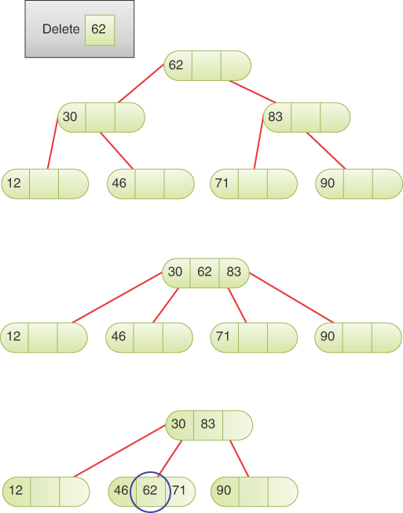

图 9-14 从只有 2 个节点的 2-3-4 树中删除
当每个节点都是 2 节点时，你不能像前面描述的那样使用旋转或融合，因为两者都需要兄弟节点或父节点成为 3 节点或 4 节点。你显然需要一些其他技术来处理这种情况。到目前为止描述的操作还有另一个限制：树永远不会收缩。到目前为止，你看到的每种情况都使树的高度（到叶子的路径中的层数）保持不变。用其后继项替换要删除的项，然后从叶节点中删除后继项留下相同数量的级别。旋转和融合也留下相同数量的级别。即使从也是叶节点的根节点中删除最后一项，技术上也会将级别数从零更改为零。使用这些技术，树如何从两层缩小到一层？
你可以通过对融合操作进行简单更改来解决这两个限制。如果在父节点是 2 节点且也是根节点时允许融合发生，并用融合节点替换根节点，则树会缩小一级。融合已经消除了一个节点；现在你将其扩展到消除整个级别。通过限制这种融合只发生在根节点上，它保证了树中的所有路径都缩小了一层并保持平衡。
在图 9-14 的示例中，通过将顶部的三个节点及其单个项融合为一个 4 节点，将顶部树转换为中间树。根节点的键值为 62 的项目成为新 4 节点的中间项目。根的两个子节点的项目成为新 4 节点的项目 0 和项目 2。节点 30 的子节点 0 和 1 成为 4 节点的子节点 0 和 1。节点 83 的子节点 0 和 1 成为 4 节点的子节点 2 和 3。换句话说，扩展融合将前三个 2 节点折叠成一个 4 节点，删除了树的一层。
在图 9-14 的中间树中，你现在可以使用你已经看到的操作删除项目 62。现在让我们关注项目 62 的前身或后继。两者都是 2 节点，并且都只有 2 节点作为兄弟节点。它们的父节点，新的根，是一个 4 节点，所以你可以应用融合操作。图中最下面的树显示了对节点 46 和 71 的融合应用，以生成包含 46-62-71 的新 4 节点。这是融合操作的一个比较特殊的方面：它可能会将要删除的项移到较低的位置，可能是一个容易删除的叶节点。在这种情况下，项目 62 从级别 0 开始。第一次融合将其保留为新根的项目 1，新根仍为级别 0。第二次融合将其移至级别 1，无需重新配置节点即可将其删除。

#### 在下降时应用旋转和融合
看起来你现在已经掌握了转换树和使用从叶节点简单删除的所有规则。但是，在如何应用这些操作方面还需要添加一件事。考虑一下如果你要求从图 9-14 中的顶层树中删除项目 83 会发生什么。如果你简单地跳过根节点 62，然后尝试从右子树中删除第 83 项，你将再次陷入困境，因为后继者和前任者都是 2 节点，父节点为 2 节点。因为前驱和后继的父节点不是根节点，所以不能使用扩展融合操作（如果这样做，它只会缩短该子树的叶子节点的路径，而不会平均缩短所有叶节点的路径） .怎么办？
这里的问题是你没有从根本上认识到你需要在下面应用融合操作。如果你这样做了，你最终会得到图 9-14 中的中间树，这使得在另一个融合操作之后删除 83 成为可能。你怎么知道是否需要融合？答案类似于我们为插入树所做的。请记住，当我们沿着路径到达插入点时，我们拆分了已满的节点。该方法确保当我们到达插入点时，父节点未满并且可以接受另一个项目。对于插入，我们假设我们需要拆分完整的节点。如果你假设在下降树以寻找要删除的节点及其后继或前任节点时需要折叠 2 个节点，会发生什么情况？
当为 2-3-4 树实现删除时，它需要像 __find() 方法这样的算法，它带有 prepare 标志，该标志查看沿路径遇到的每个节点，并应用旋转或融合将任何 2 节点更改为 3 节点节点或 4 节点。换句话说，你只是假设需要折叠几乎为空的 2 节点。该算法还必须跟踪要查找和删除的项目以及重新排列节点时的后继项目。所有这些额外的细节使它比插入例程复杂得多。有很多案例需要检查兄弟节点和父节点，以及很多项目和子链接的重新排列。在我们展示的轮换示例中，被轮换的项目都在叶级别和上一级。当你在内部节点上应用旋转时，与重新排列的两个更深的项目关联的子树必须跟在这些项目之后。当我们在第 10 章"AVL 和红黑树"中讨论红黑树中的旋转时，我们会更详细地讨论这个主题。
在 2-3-4 树中删除要记住的关键点是

- 当项目被删除时，树可以保持平衡。
- 删除使用 __find() 方法的修改版本通过树比较键下降来定位要删除的项目。
- 找到要删除的项后，将使用类似的树下降来查找项的前驱和后继。
- 两种下降都对沿途遇到的 2-nodes 应用旋转和融合操作，以确保当要删除的项目或前导/后继被定位时，它位于具有多个项目的节点中（或者它是具有单个项目的根节点).

## 2-3-4 树的效率
全面分析 2-3-4 树的效率很困难，但它们与二叉树有很多相似之处。我们当然可以确定操作和内存使用的 Big O 复杂性，这是最重要的。

### 速度

对于你在第 8 章中看到的二叉树，在搜索过程中必须访问每一层上的一个节点，无论是查找现有节点、插入新节点还是删除节点。平衡二叉树的层数约为 log~2~(N)，因此搜索时间与此成正比。
在 2-3-4 树中的每一层也必须访问一个节点，但是 2-3-4 树比具有相同数据项数的二叉树更短（层数更少）。要看到这一点，请比较图 9-5 和图 9-14 中转换后的树。在这两种情况下，2-3-4 树都被拆分或折叠成（部分）二叉树。
更具体地说，在 2-3-4 树中，每个节点最多有四个子节点。一棵完整的单节点 2-3-4 树有三个项目，高度为 0。一棵完整的 2-3-4 树，高度为 1，有 5 个节点和 15 个项目。如果每个节点都已满，则树的高度将与 log~4~(N) 成正比，其中 N 是项目数（不是节点数）。以 2 为底和以 4 为底的对数相差一个常数因子，2 × log~4~(x) = log~2~(x) 或 log~4~(x) = ½ log~2~(x)。因此，如果所有节点都已满，则 2-3-4 树的高度大约是二叉树的一半。因为它们不是全满的，所以 2-3-4 树的高度介于 log~2~(N) 和 log~2~(N)/2 之间。与二叉树相比，2-3-4 树的高度降低在一定程度上减少了搜索路径。
另一方面，沿路径的每个节点中要检查的项目更多，这增加了搜索时间。使用线性搜索检查节点中的数据项会将搜索时间乘以与 M 成比例的数量，M 是每个节点的平均项目数。即使对节点中已排序的键使用二分搜索，最终搜索时间也会与 M × log~4~(N) 成正比，因为与线性搜索相比，二分搜索仅保存一次比较，并且仅当存在三个键时比较。
有些节点包含一项，有些包含两项，有些包含三项。如果你估计平均值为 2，则搜索时间将与 2×log~4~(N) 成正比。如果将其转换为以 2 为底的对数，则会得到 2×log~4~(N) = 2 × ½ log~2~(N) = log~2~(N)。因此，对于 2-3-4 树，每个节点增加的项目数往往会抵消树高度的减少。 2-3-4 树和平衡二叉树的搜索时间大致相等，均为 O(log N)。
插入和删除的情况类似。它们每个都下降到 log4(N) 层。插入和删除都需要到达叶级别才能完成它们的工作。当它们下降时，插入过程分裂完整的 4 节点，删除过程将 2 节点折叠为 3 节点或 4 节点。这些操作消耗时间，但时间的长短与树中节点的数量无关；对于路径上的每个节点，它大致不变。它确实取决于每个节点的项目数 M。节点修改操作可以被认为是另一个常数因子 C，它最终使插入或删除时间为 C × M × log~4~(N)。那仍然是 O(log N)。
遍历当然要遍历每一个节点，所以它的总时间是O(N)。

### 存储要求

2-3-4 树中的每个节点都包含三个键和对数据项的引用以及对其子项的四个引用的存储。这个空间可以是数组的形式，如 Tree234.py 中所示，也可以是单个变量。然而，大多数 2-3-4 树并没有使用所有这些存储空间。只有一个数据项的 2 节点将浪费 2/3 的数据空间和 1/2 的子节点空间。具有两个数据项的 3 节点将浪费 1/3 的数据空间和 1/4 的子空间。如果用于键、数据和子引用的空间相同并且每个节点有两个数据项作为平均利用率，则使用 6 个单元中的 4 个用于键和数据，使用 4 个单元中的 3 个用于子链接， 一般。 10 个中有 7 个在使用，10 个中有 3 个（30%）被浪费了。
你可能会考虑使用链接列表而不是数组来保存子项和数据引用，但与数组相比，链接列表的时间开销（仅针对三或四个项目）可能不值得采用这种方法。
节点数与 2-3-4 树中的项目数不同。如果所有节点都已满（4 节点），节点数可以低至项目数的 1/3。在另一个极端，每个节点（2 节点）只能有一个项目，因此节点数的范围从 N/3 到 N，平均预期为 N/2 个项目。在大 O 表示法中，你将所有这些视为 O(N)。这也意味着未使用内存的平均数量为 O(N)。
在执行遍历时，算法需要存储树下降的每个级别的信息。这种存储可以采用递归调用的形式，也可以采用需要访问的显式节点堆栈的形式。该堆栈将增长到树的层数，因此所需的内存为 O(log N)。请注意，搜索、插入和删除不需要递归（尽管 Tree234 中 __find() 的实现确实使用了它）；可以将它们编写为遵循指针链，而无需将完整路径存储回根。这意味着他们只需要 O(1) 空间。

## 2-3棵树

我们在这里讨论 2-3 棵树，因为它们具有重要的历史意义。此外，一些用于 2-3 树的技术也适用于 B 树，我们将在下一节中对其进行研究。最后，有趣的是，每个节点的子节点数量的微小变化如何导致树算法的巨大变化。
2-3 树和 2-3-4 树之间有许多相似之处，只是正如你可能从名称中猜到的那样，它们少了一个数据项并且少了一个子节点。它们是第一个多路树，由 J. E. Hopcroft 于 1970 年发明。B 树（其中 2-3-4 树是一个特例）直到 1972 年才被发明。
在许多方面，2-3 树的操作类似于 2-3-4 树的操作。节点可以包含一个或两个数据项，并且可以有零个、两个或三个子节点。否则，父项及其子项的键值排列是相同的。将数据项插入节点的过程可能会得到简化，因为可能需要更少的比较和移动。与 2-3-4 树一样，所有的插入都在叶节点中进行，并且所有叶节点都在同一层，如图 9-15 所示的示例 2-3 树。

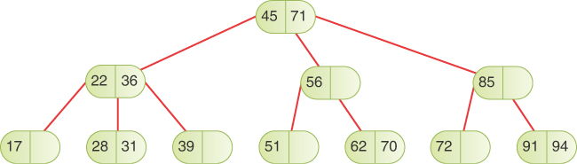

### 节点分裂

你在 2-3 树中搜索现有数据项与在 2-3-4 树中一样，但数据项和子项的数量除外。你可能猜想插入也类似于 2-3-4 树，但在处理拆分的方式上存在惊人的差异。
这就是分裂如此不同的原因。在任何一种树中，节点分裂都需要三个数据项：一个保留在被分裂的节点中，一个向右移动到新节点中，一个向上移动到父节点。 2-3-4 树中的一个完整节点具有三个数据项，它们被移动到这三个目的地。然而，2-3 树中的完整节点只有两个数据项。哪里可以买到第三件物品？你必须使用新项——插入到树中的项。
在 2-3-4 树中，新项在所有拆分发生后插入。在 2-3 树中它必须参与拆分。它必须插入叶子中，所以在向下的路上不可能分裂。如果应该插入新项的叶子节点没有满，可以立即插入新项，但是如果叶子节点满了，就必须分裂。它的两项和新项分布在这三个节点中：现有节点、新节点和父节点。图 9-16 显示了项目分配方式的三种情况。

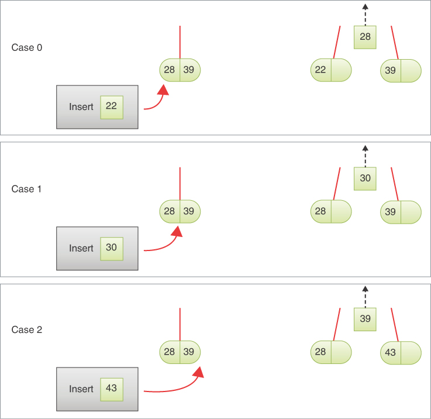

图 9-16 插入到已满导致分裂的叶节点
在情况 0 和 2 中，要插入的新项目进入包含单个项目的叶子。在情况 1 中，当新键落在被拆分的叶节点中的两个项目之间时，它必须传递给父节点以便插入到那里。在所有情况下，一个项目都会被传递（或"提升"）到父节点，如图右侧所示，黑色虚线箭头向上。如果父节点只有一个项目，则可以将提升的项目插入该节点，附加一个新的子链接，插入完成。如果父节点已满，则必须重复该过程，可能一直持续到根节点。
例如，在图 9-15 的 2-3 树中插入一个键为 47 的项目会将项目添加到叶节点 51，将项目 51 移到右侧以保持节点中的项目有序。因为叶节点可以接受新项，所以不会将任何内容提升到其父节点。
如果你尝试将项目 67 插入到同一棵树中，你会发现叶节点 62-70 已满。这是情况 1 的示例，因为新项的键大于已存储在那里的键之一。项目 62 和 70 将被分离，项目 67 将被提升到父节点，节点 56。由于父节点未满，它可以接受项目 67，插入完成。项目 70 将位于新的拆分节点中，而项目 62 将保留在已拆分的叶节点中。

### 促进分裂到内部节点

如果你试图在图 9-15 的 2-3 树中插入一个新的项目 27，叶节点 28-31 将分裂并将项目 28 提升到它的父节点。节点 22-36 也将分裂，项目 28 将再次提升到其父节点，即根节点 45-71。根节点也会分裂，将第 45 项放入新的根节点，并使所有到叶节点的路径都长一级。
如你所见，通过内部节点向上提升项目的效果是复杂的。有正在推广的项目，还有需要重新排列以保持树结构完整的子链接。图 9-16 中显示的拆分案例都显示了一个项目被提升了两个子链接到父级。左边的子链接是在向下搜索要拆分的叶节点时来自父链接的链接。右边的链接指向由拆分创建的新节点。它始终包含一个大于被提升的密钥的密钥。这使得父节点能够将提升的项目作为项目 j 插入，并将提升的右侧子链接作为子节点 j+1 插入。到被拆分节点的原始链接保留在子节点 j 的提升项的左侧。
随着树的分裂和提升波及树，处理子链接会变得更加混乱。图 9-17 显示了当提升发现一个已经满的内部节点时可能发生的情况。在每种情况下，都会提升一个项目和一个子树。

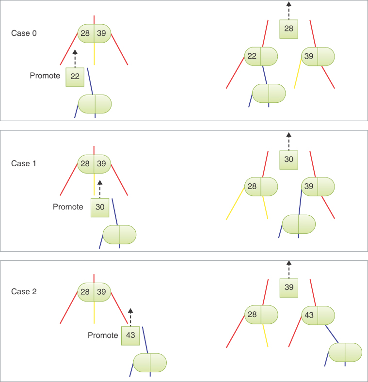

图 9-17 拆分内部节点
至于叶子节点，有三种情况，这取决于哪个子链接是分裂的源头。棘手的是子链接和项目在不同的情况下都需要不同的处理。图 9-17 中的示例都显示项目 28 和 39 被拆分到不同的节点但具有不同的排列。让我们看看每个案例。
在情况 0 中，拆分来自子树 0，即最低的子树。提升的键 22 必须低于被拆分节点的最低键。为了保持密钥顺序，提升的密钥必须替换密钥 0，并且该密钥 28 将被提升到其父级旁边。替换键 0 后，还必须用从下方提升的右子树（图 9-17 中的蓝色链接）替换被拆分节点的子节点 1。蓝色链接可能指向一个简单的叶节点或一个大的子树，具体取决于下面发生的拆分操作。然而，这部分算法只需要知道蓝色链接属于刚刚替换项目 0 的项目的右侧。
被拆分节点的子链接 1 和 2 的旧值如何？被拆分节点的子链路1如图9-17中黄色部分所示。在情况 0 中，子链接 1 的键高于被提升的项目 (28)，低于移动到新拆分节点的项目的键 39。因此，子链接 1（黄色）唯一可以去的地方是作为子链接0 的新分裂节点。被拆分节点的子链接 2 转到新拆分节点的子链接 1。
在情况1中，提升的项和子树来自于即将分裂的节点的子链接1。在这种情况下，被提升的项目30继续被提升到下一个父项。然而，提升的（蓝色）子树并没有跟随它向上延伸到树中。相反，它成为新拆分节点的子节点 0，因为它的键大于项目 30（向上到下一个父节点）并且小于新拆分节点的键 39。子节点链接 0 和 1 被拆分节点保持原样，子节点 2 移动成为新拆分节点的子节点 1，因为它拥有 39 以上的所有键。
案例 2 可能是这三个案例中最简单的一个。提升的项键 43 进入新的拆分节点，并且提升的（蓝色）子树成为该拆分节点的子节点 1。项目 39 从被拆分的节点提升到下一个父节点以及到新拆分节点 43 的链接。被拆分节点的子节点 2 移动成为新拆分节点的子节点 0，因为它的所有键都大于39 岁且小于 43 岁。

### 执行

我们将在 2-3 树中插入的完整 Python 实现作为练习。我们以一些关于如何处理拆分的提示作为结尾。
在下降的过程中，插入例程不会注意到它遇到的节点是否已满。它向下搜索树，直到找到合适的叶子。如果叶子未满，则插入新值并完成插入。但是，如果叶子已满，则例程必须重新排列树以腾出空间。为此，有几个选项。它可以调用 split() 方法。此方法的参数将包括完整的叶节点和要插入的新项目。 split() 负责进行拆分并将新项目插入新叶中，然后将项目提升到父级。
如果 split() 发现叶子的父节点已满，它将递归调用自身来拆分父节点。它不断调用自己，直到找到一个非完整节点或根。 split() 的返回值是新的右节点，它可以被 split() 的前一个化身使用。
split() 如何知道父节点？如果在叶节点上调用 split() 以及要插入的项目，它不会直接链接到叶节点的父节点，至少如果你遵循我们用于 2-3 的树和节点结构，则不会-4 棵树。有几种方法可以解决这个问题。首先，你可以向每个 Node 对象添加一个 parent 字段，以便在每个节点中都有一个显式链接。根节点将没有或可能有 2-3 树对象作为其父值。创建节点时，构造函数需要一个父参数。然后，当你在从拆分中提升项目的同时重新排列子链接时，你将同时重新排列父链接。这与第 5 章中讨论的从单链表创建双向链表所需的工作量大致相同。
第二种选择是保留一堆节点对象，代表被拆分节点的路径。堆栈的底部将是树的根节点，顶部最初将是要拆分的叶节点。这个堆栈可以替换 split() 的节点参数，找到父节点意味着从堆栈中弹出顶部项目。这个过程相当简单，尽管 insert() 方法需要构建堆栈，或者你可以修改 \_\_find() 方法以将其作为辅助返回值返回。
第三种选择是在 insert() 实现中使用自然属于 __find() 过程的递归。如果节点是叶子，则每次调用 insert() 都会尝试插入新项，如果节点已满，则返回要升级的项。换句话说，当 insert() 在子节点上递归调用自身时，它会检查返回值以查看它是否已完成（没有需要更多拆分的升级项目），或者是否有必须插入的要升级的项目当前节点。如果从递归调用接收到提升的项目并且节点未满，则可以插入提升的项目，并且在树中的该节点之上不需要进一步的拆分或提升。如果节点已满，则创建新的拆分节点，重新排列项目和子链接，并根据图 9-17 中描述的情况返回要提升的项目。递归变化波及到根，如果根已满，它也会被拆分。
使用这些选项中的任何一个来编写拆分过程的代码都会因提升项目及其伴随子树的案例逻辑而变得复杂。我们提到了提升的项目作为 split() 方法的参数或作为递归 insert() 方法的返回值。既有该项目的键和数据值，也有必须传递或返回的伴随子树。

### 2-3棵树的效率

我们没有显示 2-3 棵树的删除操作，但正如你可能想象的那样，它涉及旋转和融合操作，就像对 2-3-4 棵树所做的那样。这意味着 2-3 棵树的效率与 2-3-4 棵树的效率基本相同。搜索时间与树的高度成正比。如果每个节点都是满的，则每个内部节点有三个子节点，高度为 log~3~(N)，其中 N 是项目数。使用与 2-3-4 树相同的分析，你最终得到一个 O(log N) 操作的搜索。
插入也会降低树的高度，但有时必须返回到根的路径，拆分完整的节点以为插入的项目腾出空间。这意味着插入需要 log~3~(N) 和 2× log~3~(N) 步骤之间的某处。这比 2-3-4 树效率低，但仅在常量乘数方面。总的来说，两者仍然是 O(log N) 操作。
在内存使用方面，因为它在每个节点最多存储两个项目和三个子链接，所以 2-3 树的未使用内存量将少于 2-3-4 树。

## 外置储存

请记住，2-3-4 树是多路树的示例，它可以有两个以上的子节点和一个以上的数据项。另一种多路树 B 树在数据驻留在外部存储中时很有用。外部存储通常是指包含文件的某种磁盘系统，例如许多台式计算机和服务器中的硬盘。对于云计算，数据块存储在一起，并且可以成为分布在许多服务器上的数据集的一部分。通常，外部存储可以指访问速度比主内存慢并且可以通过某个整数寻址的任何存储系统。外部存储设备上使用的文件系统可能非常复杂。现在，只需将它们视为一个非常大的存储空间。
在本节中，我们首先描述外部数据处理的各个方面。我们讨论了一种组织外部数据的简单方法：顺序排序。最后，我们讨论 B 树并解释为什么它们对磁盘文件如此有效。我们以另一种外部存储方法结束，即索引，它可以单独使用或与 B 树一起使用。我们还涉及外部存储的其他方面，例如搜索技术。
外部存储技术的细节取决于操作系统、语言，甚至特定安装中使用的硬件。在这里，我们坚持进行一般性讨论以了解概念。

### 访问外部数据

到目前为止讨论的数据结构都是基于这样的假设，即数据完全存储在内存中（有时称为主内存或 RAM，用于随机存取存储器）。如果你有它的地址，RAM 中的每个元素都可以在相同的时间内访问。然而，在许多情况下，要处理的数据量太大，无法一次全部放入内存。在这种情况下，需要一种不同类型的存储。外部存储器的容量通常比主存储器大得多——这可以通过较低的每字节存储成本来实现。
当然，与大多数 RAM 相比，磁盘文件还有另一个优势：它们的持久性。当你关闭计算机（或电源出现故障）时，主内存中的数据将丢失。磁盘文件和其他非易失性数据存储设备可以在断电后无限期地保留数据。 RAM 是一种易失性数据存储，因为它的内容很容易丢失。
外部存储的缺点是它的速度；它比主内存慢得多。这种速度差异意味着必须使用不同的技术来有效地处理它。所有重要数据都必须保存在某种不会丢失的设备上。将数据在较慢的永久性存储之间有效地移动到更快的易失性存储（如 RAM）激发了对不同类型数据结构的需求。
作为外部存储的示例，假设你正在编写一个数据库程序来处理居住在特定州或国家/地区的每个人的基本联系数据——可能有 1 到 1 亿个条目。每个条目都包括姓氏、名字、电话号码、地址和各种其他数据。假设一个条目存储为一条需要 1,024 字节（1 千字节）的记录。结果是数据库大小至少为 1,000,000 × 1,024，即 1,024,000,000 字节，或接近 1 GB。曾经有一天，地球上没有一台计算机拥有 1 GB 的内存。现在千兆字节的存储已经司空见惯，机器可以拥有数 TB 的内存。我们假设有一些数据集合太大而无法放入主内存，但又足够小以适合某些目标机器的磁盘驱动器。这可能是为了收集更大的数据，比如一年中世界上所有的信用卡交易。
因此，我们在磁盘或其他慢速驱动器上有大量数据。你如何组织它以提供数据结构通常需要的特性：快速搜索、插入和删除？
在调查答案时，请记住两个限制条件。首先，访问外部数据比访问主存慢得多。其次，外部数据访问通常一次读取或写入许多记录。让我们探讨一下这些要点。

### 访问速度非常慢
计算机的主存储器以电子方式工作。可以像访问任何其他字节一样快地访问任何字节。访问时间取决于所使用的技术，但我们假设大约需要 10 纳秒（十亿分之一秒）。从外部存储中获取一个字节要慢多少？
让我们首先考虑磁盘驱动器。数据排列在旋转磁盘上的圆形轨道中。要访问磁盘驱动器上的特定数据，必须首先将读写头移动到正确的磁道。这是通过步进电机或类似设备完成的；这是一项需要几毫秒（千分之一秒）的机械活动。
找到正确的磁道后，读写头必须等待数据旋转到位。平均而言，磁头需要转半圈才能越过数据。即使磁盘以每分钟 15,000 转的速度旋转，也需要大约 2 毫秒才能读取数据。读写头定位后，开始真正的读（或写）过程；这可能需要几毫秒。
因此，大约 10 毫秒的磁盘访问时间很常见。这比可以在 10 纳秒内访问一个单元的主存储器慢 1,000,000 倍。该比率因设备而异，但总是很大，比如超过 100,000。
接下来，让我们考虑闪存，另一种形式的外部存储。与磁盘一样，它即使在电源关闭时也能保留其数据。闪存比旋转磁盘访问速度更快，但仍然比主内存慢。闪存设备可能需要大约 10 到 100 微秒（百万分之一秒）来访问数据的特定部分。虽然这比定位磁盘磁头的时间快得多，但仍然比从主存读取一个单元多 1,000 或 10,000 倍。
在云计算环境中，数据块分布在网络服务器上。访问存储在服务器 A 上的特定块以在服务器 B 上进行处理意味着通过网络复制数据。网络速度每隔几年就会增长得更快，但会随着流量负载的不同而有很大差异。与访问主内存的速度相比，网络访问速度可能要慢数百万或数十亿倍。
技术变化很快，主存储器和外部存储器的速度和成本都会发生变化。可能不会改变的是，与较慢的外部存储器系统相比，最快的存储器仍然很昂贵，无论是在购买它所需的资金还是它消耗的能量方面。速度差异可能保持在数千或数百万比一的数量级。因此，我们总是需要有效的方法来访问容量更大、成本更低的外部存储。

### 一次一个块

对于磁盘存储，当读写头正确定位并开始读取（或写入）过程时，驱动器可以快速地将大量数据传输到（或从）主存储器。出于这个原因，并为了简化驱动器控制机制，数据以称为块、页、分配单元、段或其他名称的块的形式存储在磁盘上，具体取决于系统。闪存还提供页面或块方面的访问，即使它不涉及旋转磁盘。我们在本次讨论中称这些数据块为块。值得注意的是，存储块并不直接对应于外部存储器中的文件；文件通常需要很多块。
磁盘驱动器总是每次至少读取或写入一个数据块。块大小因设备而异，通常是 2 的幂。对于我们的联系人数据库示例，我们假设块大小为 8,192 字节 (213)。这意味着包含一百万（1 千字节）记录的数据库将需要 1,024,000,000 字节除以每个块 8,192 字节，即 125,000 个块。
当读取或写入块大小的倍数时，外部存储器访问最有效。如果你要求读取 100 个字节，系统将读取一个块，8,192 个字节，并忽略其中除 100 个以外的所有字节。如果你要求读取 8,200 字节，它会读取两个块，即 16,384 字节，并丢弃几乎一半。无论请求大小如何，设备仍必须花时间获取完整块。通过组织你的软件，使其一次处理一个完整的数据块或多个数据块，你可以优化其性能。
假设联系人数据库记录大小为 1,024 字节，则可以在一个块中存储八条记录（8,192 除以 1,024），如图 9-18 所示。因此，为了获得最大效率，一次读取八条记录（或该数字的倍数）非常重要。

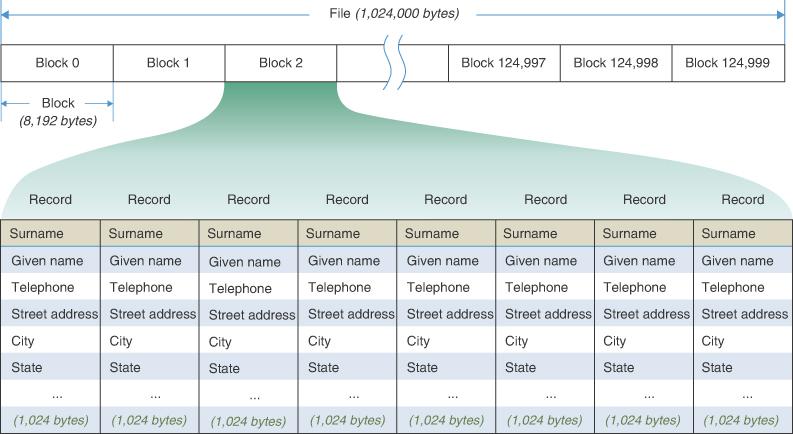

图 9-18 文件中的块和记录
请注意，将记录大小设置为 2 的幂也很有用，因为这会平均划分块大小，通常是 2 的幂。在任何情况下，最好将整数个记录放入一个块中，而不需要任何浪费空间。
当然，示例中显示的记录、块等的大小只是说明性的；它们将根据记录的类型、数量和大小以及其他软件和硬件限制而有很大差异。包含数百条记录的块很常见，记录可能远大于或小于 1,024 字节。
磁盘的读写头如前所述定位后，读取一个块是很快的，只需几毫秒。因此，磁盘访问读取或写入块不是很依赖于块的大小。因此，块越大，读取或写入单个记录的效率就越高（假设你使用了块中的所有记录）。

### 顺序排序

在磁盘上的文件中安排数据库的一种方法是根据某个键对所有记录进行排序，比如按姓氏的字母顺序排列。也许一个名叫 Aaron Aardvark 的人的记录会排在第一位，依此类推。这种情况如图 9-19 所示。

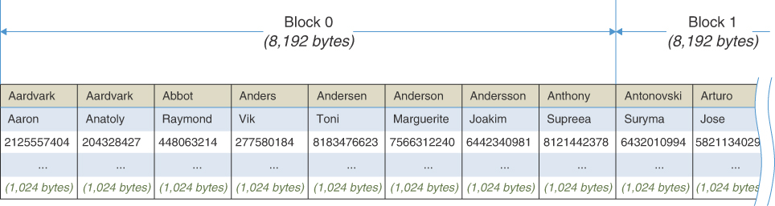

图 9-19 记录的顺序排序

### 搜索

要在按顺序排列的文件中搜索特定姓氏（例如 Turing），你可以使用二进制搜索。你将从从文件中间读取一个记录块开始。让我们简化讨论并假设文件的所有块都在磁盘上按顺序排列的块中，因此通过知道第一个和最后一个块号很容易找到中间块（在实际文件系统中很少出现这种情况，但有通常是几乎一样快地获得块号的方法）。块中的 8 条记录全部一次读入主内存中的 8,192 字节数组（或缓冲区）。
如果这些中间记录的键在字母表中太靠前（例如，以 Kahn 结尾），你将转到文件中的 3/4 点并在那里读取一个块，也许会找到 Pearl；如果中间记录中的键在搜索键之后，你将转到 1/4 点，也许会找到 Englebart。通过不断地将范围分成两半，你最终会找到目标记录。
正如你在第 3 章中看到的，主内存中的二分查找需要进行 log2 N 次比较，对于 1,000,000 项，大约需要 20 次。如果每次比较需要 1 微秒，那么这将是 20 微秒，或者大约 1/50,000 秒，比眨眼还少。
然而，在本节中，我们将处理存储在磁盘上的数据。因为每次磁盘访问都非常耗时，所以更重要的是关注需要多少次磁盘访问，而不是有多少条单独的记录。读取一个记录块的时间将远远大于在内存中搜索块中的八条记录的时间。
磁盘访问比内存访问慢得多，但另一方面，你一次访问磁盘一个块，块数远少于记录数。在我们的示例中，有 125,000 个块。这个数字的log2大约是17，所以理论上，你需要大约17次磁盘访问才能找到你想要的记录。
实际上，这个数字会有所减少，因为你一次读取了八个记录。在二进制搜索的开始阶段，内存中有多个记录没有帮助，因为下一次访问将在文件的较远部分。然而，当你接近所需的记录时，你想要的下一条记录可能已经在内存中，因为它是同一个八条记录块的一部分。将下一条记录保存在内存中可能会减少两次左右的磁盘访问次数。因此，你需要大约 15 次磁盘访问 (17 – 2)，按每次访问 10 毫秒计算，需要大约 150 毫秒或 0.15 秒才能完成顺序存储记录的二进制搜索。这比大约 1/50,000 秒的内存访问要慢得多，但还算不错。

### 插入
不幸的是，如果你想从按顺序排列的文件中插入（或删除）一个项目（一条记录），情况会更糟。因为数据是有序的，所以这两个操作平均需要移动一半的记录，因此需要移动大约一半的块。
更新每个块需要两次磁盘访问：一次读取和一次写入。找到插入点后，将包含它的块读入内存缓冲区。保存块中的最后一条记录，并将适当数量的记录向上移动以为插入的新记录腾出空间。然后缓冲区内容作为一个块写回磁盘文件。
接下来，插入块之后的块被读入缓冲区。它的最后一条记录保存在主内存中，所有其他记录都向上移动，前一个块的最后一条记录插入缓冲区的开头。然后缓冲区内容再次写回磁盘。这个过程一直持续到插入点之后的所有块都被重写。
假设有 125,000 个块，你必须（平均）读取和写入其中的 62,500 个，以每次读取和写入 10 毫秒计算，需要 20 多分钟才能插入一个条目（20 毫秒 × 62,500 = 1,250 秒 = 20.83 分钟）。按照今天的标准，这并不令人满意，尤其是当你要添加多条记录时。
顺序排序的另一个问题是它只对一个键有效。我们的示例联系人数据库按姓氏排列。假设你想搜索特定的电话号码或城市。你不能使用二进制搜索，因为数据是按名称排序的。你需要使用顺序访问逐块遍历整个文件。此搜索需要读取平均一半的块，这将需要大约 10 分钟，这对于简单搜索而言性能非常差。我们显然需要一种更有效的方法来在外部存储器中存储大量数据。

### B树

如何安排保存在外部存储器中的记录以提供快速的搜索、插入和删除时间？你已经看到树是组织内存中数据的好方法。树可以使用外部存储器（例如磁盘上的文件）吗？
确实如此，但是对于外部数据必须使用与内存数据不同的树。合适的树是多路树，有点像 2-3-4 树，但每个节点有更多的数据项；它被称为 **B 树**。 1972 年，R. Bayer 和 E. M. McCreight 首次将 B 树设想为适合外部存储的结构。（严格来说，2-3 树和 2-3-4 树分别是 3 阶和 4 阶 B 树，但是B 树这个术语通常被认为是指每个节点有更多的子节点。）值得注意的是，B 树不是二叉树，尽管它们的名称很相似。

#### 每个节点一个块
为什么每个节点需要这么多项目？你已经看到，当数据一次读取或写入一个块时，磁盘访问效率最高。在树中，包含数据的结构是节点（无论是 B 树、2-3-4 树、二叉搜索树或其他树中的节点）。那么在树的每个节点中存储整个数据块是有意义的。这样，读取节点在最短的时间内访问了最大量的数据。
一个节点可以放多少数据？当然，答案取决于物品的大小。在使用顺序记录的联系人数据库示例中，你可以将八个 1 KB 的数据记录放入一个 8,192 字节的块中。
然而，在树中，你还需要存储到其他节点的链接（这意味着到其他块的链接，因为一个节点对应一个块）。在内存中的树中，如前面章节中讨论的那些，这些链接是对内存其他部分中节点的引用。对于存储在磁盘文件中的树，链接指向文件中的块号（从 0 到 124,999，在百万记录数据库示例中）。对于块号，你可以使用整数字段。如果整数占用 4 个字节（32 位），它可以引用略多于 40 亿个可能的块，这可能就足够了。具有更多可寻址块的更大的数据库和外部存储设备将需要更大的块号。
将数据组织为树节点意味着你不能再将八个 1,024 字节的记录压缩到一个块中，因为你需要为子节点的链接留出空间。例如，你可以将记录数减少到 7 条，以便为占用 8 × 4 字节的链接腾出空间，但每个节点的记录数为偶数并填满块是最有效的。也许记录大小不需要是完整的 1,024 字节；也许可以减少一两个字段的大小。假设数据库设计者通过缩短某些字段来接受 1,010 字节的记录。这意味着一个节点仍然可以包含八个记录以及需要 36 个字节 (9 × 4) 的九个子链接（比数据项多一个）。该节点将有 8 × 1,010 字节的记录加上 36 字节的链接和另外几个 4 字节的整数，用于保存键和子链接的数量（nKeys 和 nChlld），留下 68 字节未使用（8,192 – 8,080 – 36 – 8 ).这种树中的一个块（以及相应的完整节点表示）如图 9-20 所示。

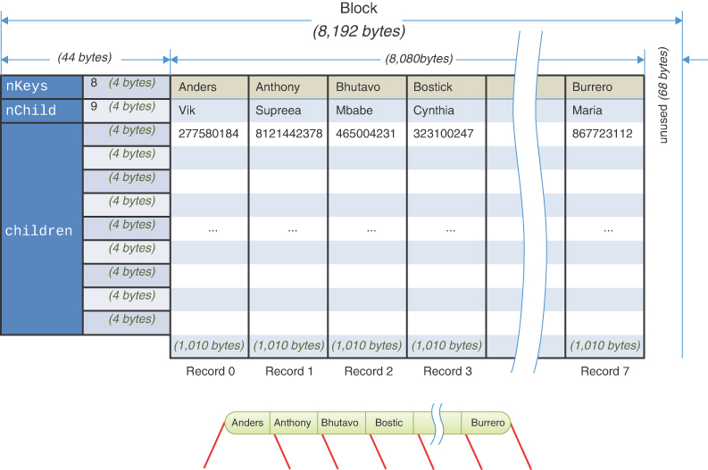

图 9-20 9 阶 B 树中的一个节点及其块结构
在每个节点中，数据按键顺序排序，就像在 2-3-4 树中一样。事实上，B 树的结构类似于 2-3-4 树，只是每个节点的数据项更多，与子节点的链接更多。 B 树的阶数是每个节点可能拥有的子节点数。在示例中，这是 9，因此树是 9 阶 B 树。
如果完整的树结构将存储在外部存储器中（这是数据库的典型做法），你还需要存储表示树的对象。 Tree234 对象用于在内存实现中保存该信息。所有必须存储在相应 B 树对象中的是对根节点块的引用。可能会为大型数据库存储其他属性，这些属性将放入此对象中。该信息可能会单独存储在一个块中，或者可能会代替块的第一条记录。尽管块中可能有很多未使用的字节，但就磁盘访问而言，将其保存在单独的块中并以相同方式对待所有树节点会更有效。

#### 搜索

搜索具有指定键的 B 树记录的执行方式与在内存中的 2-3-4 树中的搜索方式大致相同。假设树对象已经在内存中，它引用了包含根节点的块。首先，包含该根的块被读入内存。搜索算法然后开始检查八个记录中的每一个（或者，如果它不完整，则与节点保持的一样多），从 0 开始。当它找到具有更大键的记录时，它知道去到链接的子节点介于此记录和前一个记录之间。请注意，你可以在节点的键内使用二进制搜索，并且对大量键这样做更有意义。使用二进制搜索可以节省一些内存中的比较，与读取外部节点/块所需的时间相比，这只是很小的节省。
这个过程一直持续到找到正确的节点。如果到达叶节点而没有找到指定的键，则搜索不成功。

#### 插入
B 树中的插入过程更像是 2-3 树中的插入，而不是 2-3-4 树中的插入。回想一下，在一棵 2-3-4 树中，许多节点并不完整，实际上只包含一个数据项。 2-3-4 节点拆分总是产生两个节点，每个节点中有一个项目。这不是 B 树中的最佳方法，即使拆分不必创建具有单个项目的节点。
在 B 树中，保持节点尽可能满很重要，这样每次读取整个节点的磁盘访问都可以获得最大量的数据。为了帮助实现这一目标，插入过程在三个方面不同于 2-3-4 树：

- 节点分裂将数据项平分：一半去新创建的节点，另一半留在旧节点。
- 节点拆分是自下而上执行的，就像在 2-3 树中一样，而不是自上而下。
- 同样，在 2-3 树中，向上提升的不是节点中的中间项，而是节点中的项加上新项形成的序列中的中间项。

我们通过构建一个小型 B 树来演示插入过程的这些特征，如图 9-21 所示。没有空间显示每个节点的实际记录数，所以我们只显示八个；因此，这棵树是一棵 9 阶 B 树。我们还切换到使用整数键来将它们全部放入图中。

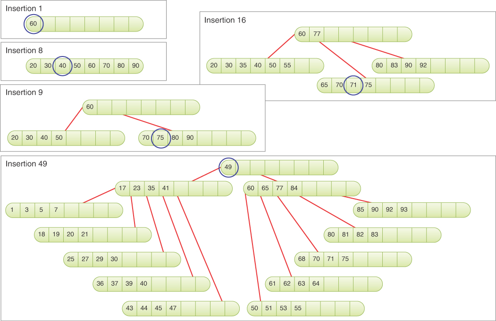

图 9-21 构建 B 树
图 9-21 的左上角是一个标有"插入 1"的面板。它显示了插入第一个项目（键为 60）后的根节点。蓝色圆圈表示刚刚插入的项目。在其下方是插入 8，其中插入了带有关键字 40 的第八个项目。这将填充根节点中的所有项目槽。像往常一样，所有项目都按排序顺序存储。
在下一个面板 Insertion 9 中，插入了一个键为 75 的新数据项，导致节点分裂。这是拆分的完成方式。由于正在拆分根，因此创建了两个新节点（如在 2-3-4 树中）：一个新根和一个位于被拆分节点右侧的新节点。
为了决定数据项的去向，插入算法在内部缓冲区中按顺序排列它们的九个键。其中八个键来自被拆分的节点，第九个来自插入的新项。这将介于项目 70 和 80 之间，将 60 作为中间项目，两侧各有四个。
中间项 60 放置在新的根节点中。它左侧的所有项目都保留在被拆分的节点中，右侧的所有项目都进入新的右侧节点。在插入 9 中，插入的项 75 最终出现在分裂的叶节点中，但情况并非总是如此，如你在后面的示例中所见。
分裂节点中的项目数始终是完整节点的一半。因此，如果这是一个 31 阶 B 树，则新的拆分节点中将包含 15 个项目。单个中间项将提升到父节点，原始叶节点也将减少到 15 个项。
在插入 9 之后很明显，B 树有能力在现有的三个节点中存储更多的项目。根据它们的键，新插入的项目进入两个叶节点之一。让我们再插入六个键为 35、65、83、55、92 和 77 的项目。其中两个项目 35 和 55 进入左叶，另外四个进入右叶。这使右叶达到了 8 个项目的满容量，整个 B 树中有 15 个项目。
在第 16 次插入中，项目 71 到达，它必须进入右叶。因为那片叶子已经满了，它必须被分开。项目 71 位于右叶中八个项目（65、70、75、77、80、83、90、92）的中间之前。这意味着第 71 项不会进入新的拆分节点；它将留在被拆分的"当前"节点上。具有较高键的四个项目从当前节点分裂以形成新节点。项目 77 从当前节点中取出并提升到其父节点，即根节点。当前节点成为根的子节点 1，新的拆分节点为子节点 2。在这种情况下，插入的项最终位于拆分的左侧。生成的 B 树如图 9-21 的右上面板所示。它有四个节点，第 16 个插入的项目 71 最终位于中央叶子。
将第 77 项从叶节点提升到根节点不会导致更多分裂，因为根节点中只有一个项目。请注意，Insertion 16 之后的三个叶节点都在树的同一级别，级别 1，即使我们在图中将它们显示在不同的垂直位置。
接下来的插入继续根据它们的键将项目添加到叶子。至少需要再插入 5 次才能拆分最新的叶子，因为它们每开始有 4 个项目。随着分裂的发生，一项被提升到父节点，即根节点。在至少再插入 28 次之后，根可以有九个子节点，每个子节点包含四个项目（总共 44 个项目 = 9 × 4 + 8）。添加至少四个项目后，其中一个子节点可以增长到容纳八个项目并变满。这使分布在 10 个节点上的项目总数达到 48 个。
图 9-21 的插入 49 显示了将 B 树扩展到两层的拆分是如何发生的。为此，插入的项目必须进入完整根下的完整叶子。让我们假设，有点巧合的是，插入了一个键为 49 的项目。该项目落在包含项目 43、44、45、47、50、51、53 和 55 的完整叶子中。该节点必须拆分，在这种情况下，因为 49 落在九个项目的中间，所以项目 49 是提升而不是先前插入的项目之一。这将整个叶节点拆分为两个四项叶节点，如图 9-21 中标记为插入 49 的面板底部所示。
提升的项目 49 上升到根节点，但因为它也已满，所以必须拆分该节点。查看与根中的项目 17、23、35、41、60、65、77 和 84 相关的提升项目，表明它再次落在中间。因此，项目 49 再次被提升，并且完整的根节点被一分为二。这就是你如何在图 9-21 的插入 49 处结束。第 49 项被提升到根节点之外，从而形成一个新的单项节点。旧根被拆分为节点 17-23-35-41 和 60-65-77-84。
这个（人为的）示例显示了插入的节点如何在内部节点或什至在新的根节点中结束。所有叶子在树中都保持在同一层，尽管它们在图中的位置。
请注意，在整个插入过程中，没有一个节点（根节点除外）未满一半，很多都超过半满。正如我们所指出的，保持节点尽可能满可以提高效率，因为读取节点的文件访问总是获取大量数据。在向下搜索到应该插入项目的节点时，节点不会被拆分；它们仅在插入遇到完整的叶节点并促使溢出返回到根时才被拆分。因此，没有不必要的拆分会导致昂贵的磁盘访问。

### B树的效率
因为每个节点有很多记录，每个级别有很多节点，考虑到数据存储在磁盘等较慢的存储设备上，B 树上的操作非常快。在联系人数据库示例中，有一百万条记录。 B 树中除根以外的所有节点都至少是半满的，因此它们至少包含四个记录和五个到子节点的链接。因此，树的高度略小于 log5 N（N 的以 5 为底的对数），其中 N 为 1,000,000。这大约是 8.58，因此树中将有九层（高度 8）。
因此，使用 B 树，只需九次磁盘访问即可在包含 1,000,000 条记录的文件中找到任何记录。每次访问 10 毫秒，这大约需要 90 毫秒，或 9/100 秒。这比按顺序排列的文件的二进制搜索要快得多。
节点中的记录越多，树中的级别就越少。你已经看到我们的示例 B 树中有九层，每个节点仅包含八条记录。相比之下，具有 1,000,000 个项目的二叉树大约有 20 个级别，而 2-3-4 树将有 10 个。如果你使用具有数百条记录的块，则可以减少树中的级别数并进一步提高访问次，尽管这仅适用于支持大到足以容纳所有这些记录的块的设备。
虽然在 B 树中搜索比在按顺序排列的磁盘文件中搜索更快，但 B 树最大的优势在于插入和删除。
让我们首先考虑一个 B 树插入，其中没有节点需要分裂。这是最有可能发生的情况，因为每个节点都有大量记录。在我们的联系人数据库示例中，最多需要九次块访问才能找到插入点。然后再访问一次可以将包含新插入记录的块写回磁盘，总共访问 10 次。
接下来让我们看看如果必须拆分节点，情况会怎样。被拆分的节点必须被读取，删除一半的记录，然后写回磁盘。这与没有拆分、10 次访问的插入所需的相同。新创建的节点必须写入磁盘，并且必须读取父节点，并在插入提升的记录后写回磁盘。这向更简单情况的 10 次添加了 3 次访问，总共 13 次（尽管父节点在搜索插入点时被读取后可能仍保留在主内存中，因此总数可能为 12 次）。这个数字比插入顺序文件所需的 500,000 次访问有了重大改进。随着分裂在 B 树中向上提升，它们每层增加三个访问，因此在一个八层树中最多增加 7 × 3 = 21 个访问。
在某些版本的 B 树中，只有叶节点包含记录。非叶节点仅包含键和块号。这种策略可能会导致更快的操作，因为每个块可以容纳更多的块号。由此产生的高阶树的层级会更少，访问速度会提高。另一方面，编程可能会很复杂，因为有两种节点，有值的叶子和没有它们的非叶子，并且需要找到与内部节点的键对应的叶节点来访问值。
#### 索引

加速外部存储器访问的另一种方法是按顺序存储记录，但使用文件索引和数据本身。文件索引是键/块对的列表，按键顺序排列。回想一下我们最初的联系人数据库示例有 1,000,000 条记录，每条记录 1,024 字节，将八条记录存储到一个块中，共 125,000 个块。要使用姓氏作为键创建文件索引，索引中的每个条目都包含两项：

- 钥匙，像琼斯一样的字符串。
- Jones 记录在文件中所在的块的编号。这些数字从 0 到 124,999。

假设你使用一个 59 字节长的字符串作为键（对于大多数姓氏包括 Unicode 字符来说足够大），4 个字节作为块号（整数），一个字节作为块内的记录号。此类索引中的每个条目都需要 64 个字节。这只是每条记录所需数量的 1/16。
索引中的条目按姓氏顺序排列。普通姓氏可能有多个条目。磁盘上的原始记录可以按任何方便的顺序排列。这通常意味着新记录只是简单地附加到序列的末尾，因此记录按插入时间排序。这种安排如图 9-22 所示。

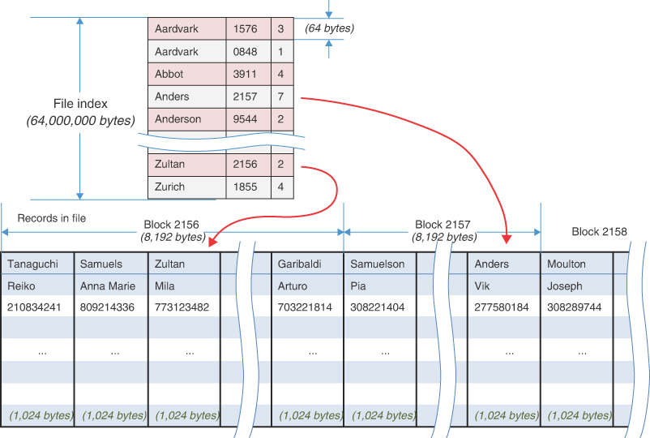

图 9-22 文件索引示例

#### 内存中的文件索引

文件索引比包含实际记录的文件小得多。它甚至可能小到完全适合主存。在此示例中，有 1,000,000 条记录。每个索引在索引中都有一个 64 字节的条目，因此索引的长度为 64 × 1,000,000，即 64,000,000 字节（略小于 64 兆字节）。在现代计算机中，将这个索引放入内存是没有问题的（尽管对于某些微型设备中的非常小的计算机来说，它可能太大了）。
文件索引可以存储在外部存储器中，并在数据库程序启动时读入主存。从那时起，对索引的操作可以在内存中进行。在每天结束时（或每当数据库关闭时），可以将索引写回磁盘以永久存储。 64,000,000 字节的索引将占用磁盘上的 7,813 个块。这可能需要几秒钟的时间来读取或写入，但只在启动和关闭时。

#### 搜索

与在外部存储器中按顺序排列的记录相比，内存中索引方法允许对数据库进行更快的操作。例如，二分查找可能需要 20 次索引访问。即使每次访问需要 0.1 微秒（100 纳秒），也只有大约 2/1,000,000 秒。索引必须可能支持重复键，因此 20 次索引访问只会识别要检查的多个条目中的第一个。在索引中找到块号之后，不可避免地需要时间从外部存储器读取实际记录。在磁盘上，读取操作可能需要访问一个块或大约 10 毫秒（1/100 秒）。

#### 插入
要在索引文件中插入新项目，需要两个步骤。你首先将项目的完整记录插入主文件；然后将一个条目插入到文件索引中，该条目由键和存储新记录的块号组成。
因为文件索引是按顺序排列的，要插入一个新项目，平均需要移动一半的索引条目。算出在内存中移动一个字节大约需要 3 纳秒（8 字节的一次读取和一次写入大约需要 20 纳秒），你有 500,000 个条目乘以每个条目 64 个字节乘以每个字节 3 纳秒，或大约 .096（1/10）秒插入一个新条目。相比之下，更新未索引的顺序文件需要 20 分钟。请注意，你不需要移动主文件中的任何记录；你只需将新记录附加到文件末尾即可。你最终需要将文件索引写入外部存储器，这大约需要 72 秒，以每块 1/100 秒的速度写入另外 7,182（= 1,000,000 × 64 / 8,192）个块。
当然，你可以使用更复杂的方法将文件索引存储在内存中。例如，你可以将其存储为二叉树、2-3-4 树或其他多路树。这些中的任何一个都会显着减少插入和删除时间。我们在第 11 章"哈希表"中讨论了另一种结构，它的速度特别快。在任何情况下，内存索引方法都比顺序文件方法快得多。在某些情况下，它也比 B 树更快。
插入索引文件所需的唯一实际磁盘访问涉及新记录本身并最终存储文件索引。通常，文件中的最后一个块被读入内存，追加新记录，然后该块被写回。此过程仅涉及两次文件访问。存储文件索引意味着写入数千个块，但只有在关闭数据库服务时才需要。保存文件索引所花费的时间分布在数百、数千甚至数百万次插入和搜索中。

#### 多重索引
索引方法的一个优点是可以为同一组记录（数据库）创建多个索引，每个索引具有不同的键。在一个索引中，键可以是姓氏；另一方面，电话号码；在另一个地址中。因为索引与数据文件相比很小，所以不会增加太多的数据存储总量。当然，当从文件中插入或删除项目时，它确实提出了更多的挑战，因为必须向所有索引添加或删除条目，但我们不在这里讨论。

#### 索引对于内存来说太大

如果索引太大而不适合内存，它也必须分成块并存储在磁盘上。对于大文件，将索引本身存储为 B 树可能会有利可图。在主文件中，记录以任何方便的顺序存储。
这种安排可以非常有效。将记录追加到主文件的末尾是一项快速操作，为新记录插入索引条目也很快，因为索引是一棵树。结果是非常快速地搜索和插入大文件。
请注意，当文件索引排列为 B 树时，每个节点包含 n 个子指针和 n-1 个数据项。子指针是文件索引中其他节点的块号。数据项由键值和指向主文件中块和记录的指针组成。不要混淆这两种块指针。

#### 复杂的搜索条件

在复杂的数据库搜索中，唯一实用的方法可能是按顺序读取文件中的每个块。假设在我们的联系人数据库示例中，你想要一个包含名字为 Kristen 的所有条目的列表，她住在圣保罗，电话号码中包含数字 284。想象一下，在圣保罗某个地方的一个装有很多钱的袋子里的一张纸片上发现了姓名和电话号码，找到此人的完整记录很重要。
按姓氏组织的文件根本没有帮助。即使有按名字和城市排序的索引文件，也没有方便的方法来查找哪些文件同时包含 Kristen 和 Sao Paolo。更不可能的是电话号码的三位数子序列的索引（尽管有时会创建它们）。在这种情况下，最快的方法可能是使用其中一个索引（如果存在），并逐块读取它为特定名称引用的每条记录，检查每条记录是否符合其余标准。

#### 排序外部文件

你已经了解了如何使用 B 树来管理存储在外部存储器中的数据库。每个节点的数据，以及每个块的数据，都是按一个键排序的。排序在插入项目时发生。如果其他进程将数据写入文件，而你想对这些数据进行排序，那该怎么办？想象一下计算机上某个进程写入的一堆日志文件。日志中的每条记录可能都有日期和时间，以及与流程相关的其他信息，例如操作阶段、发生的事件类型、某些内部数据结构的大小、交易帐号， 等等。如果你想按日期和时间以外的某个字段对日志文件进行排序（假设它们是按时间顺序记录的），并且它们并不都适合内部存储器，那么对它们进行排序的最佳方法是什么？
Mergesort 是对大量外部数据进行排序的首选算法。原因是，与大多数排序技术相比，磁盘访问更倾向于发生在相邻的记录中，而不是文件的随机部分。
回想一下第 6 章"递归"，归并排序通过调用自身对越来越小的序列进行排序来递归地工作。在对两个最小序列（内存版本中每个元素一个）进行排序后，将它们合并为一个两倍长的排序序列。合并越来越大的序列，直到最终对整个文件进行排序。
外部存储的方法是相似的。但是，可以从磁盘读取的最小序列是一个记录块。因此，需要一个两阶段过程。
在第一阶段，读取一个块，对其记录进行内部排序，并将排序后的块写回磁盘。下一个块被类似地排序并写回磁盘。这个过程一直持续到所有的块都被内部排序。
在第二阶段，两个排序的块被读取，合并成一个双块序列，然后写回磁盘。 这个过程一直持续到所有的块对都被合并。 接下来，将每对两块序列合并成一个四块序列。 在每一步中，排序序列的大小加倍，直到整个文件被排序。
图 9-23 显示了对外部文件的合并排序过程。 该文件由八个块组成，每个块有 16 条记录，总共有 128 条记录。 记录显示为彩色矩形，而不是在图中显示带有键的记录。 每个矩形的颜色和高度是它的关键。 尽管图中的高度不同，但磁盘上的记录的字节长度相同。

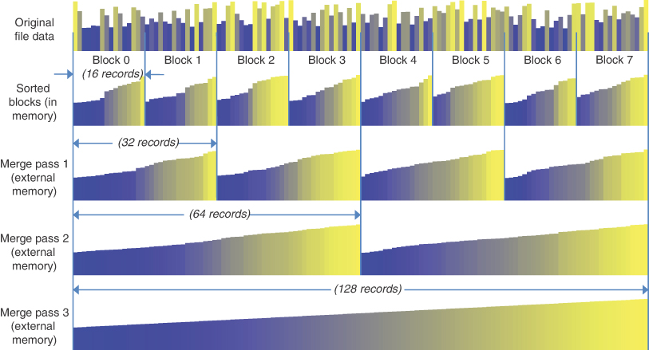

图 9-23 外部文件的归并排序
假设内部存储器只能容纳三个块，那么你不能简单地一次读取所有记录，对它们进行排序，然后将它们全部写出。当然，所有这些尺寸在实际情况下都会大得多。图 9-23 的第一行显示了原始的、未排序的文件数据。

#### 块的内部排序
在第一阶段，文件中的所有块都在内部排序。每个块都被读入内存，然后使用任何适当的内部排序算法对其记录进行排序，例如快速排序（或者，对于较小数量的记录，Shellsort 或插入排序）。内部排序也可以使用合并排序来完成，因为合并排序的主要缺点在这里不是问题。请记住，mergesort 需要第二个与原始数组大小相同的数组，但该缓冲区必须可用，因为 mergesort 需要它稍后在内存中合并两个块。无论使用何种排序算法，排序后的 16 条记录块都会被写回外部存储器，如图 9-23 的第 2 行所示。
假设外部存储的可用性不是问题，第二个文件 File 2 可用于保存排序的块。通常希望避免修改原始文件。

#### 合并

在第二阶段，合并排序的块。第一遍将每对 16 记录块合并为一个排序的双块序列。因此，最左边的两个块 0 和 1 在合并通道 1 中合并到最左边的 32 条记录中。此外，块 2 和 3、块 4 和 5 以及块 6 和 7 被合并到它们各自的 32 条记录序列中.结果显示在图 9-23 的合并通道 1 行中。让我们假设该进程写入第三个文件，文件 3，以保存此合并步骤的结果（尽管这可能并不总是必要的）。
在合并通道 2 中，两个 32 记录序列被合并成一个 64 记录序列，可以写回文件 2。这些序列中有四个被合并成两个更大的序列。图 9-23 的最后一行显示了合并通道 3 的结果，其中两个 64 记录的序列被合并到一个 128 记录的文件中，文件 3。现在排序完成了。当然，对较大的文件进行排序需要更多的合并步骤；这些步骤的数量与 log2 N 成正比。合并步骤可以在两个文件之间交替，最后丢弃一个。

#### 内部数组
因为计算机的内部存储器只能容纳三个块，所以合并过程必须分阶段进行。假设有三个数组，分别称为 arr0、arr1 和 arr2，每个数组都可以容纳一个块。
在merge pass 1中，block 0被读入arr0，block 1被读入arr1。然后将这两个数组合并排序到 arr2 中。因为 arr2 只有一个块，所以在排序完成之前它就变满了。当它变满时，其内容将写入磁盘文件 3。然后继续排序，再次填满 arr2。这样就完成了排序，并且 arr2 再次写入磁盘。该过程继续进行到块 2 和 3，将它们读入 arr0 和 arr1，并将它们的内容合并到 arr2。当 arr2 变满时，结果将写入文件 3 的末尾。
在合并通道 2 中，你可以继续使用三个数组，arr0、arr1 和 arr2，即使已排序序列的长度已经超过数组大小。输入数组 arr0 和 arr1 最初用序列的第一个块填充。在 arr0 中的所有记录都已合并到输出数组 arr2 之后，可以读取该序列的下一个块以重新填充 arr0。你使用一个块大小的数组（或者可能是几个块，具体取决于可用内存量）来有效地读取和写入外部存储器。它们的大小不取决于要排序的数据总量。该方案适用于所有合并通道。
我们可以对外部合并排序算法进行另一个重要的简化。在第一阶段，它将排序后的块写回外部存储器。因为合并通道 1 的第一步是将这些块读回 arr0 和 arr1，我们可以通过在读取未排序的块后立即执行内存排序来消除第一阶段。排序仅发生在合并通道 1 上，所有其他合并通道仅执行合并。

#### 外部合并排序的效率

即使数据在外部存储器中，归并排序的整体效率仍然是 O(N×log N)。然而，由于对外部数据的访问速度较慢，因此运行时间比所有数据都可以放入内部存储器时要长得多。外部数据访问的数量成为控制因素。在第二阶段，读取文件的每个块，如果它是合并通道 1，则进行排序，适当地合并，然后写回外部存储。因此，在每次合并过程中，每个块都有两次访问（读取和写入）。这使总数达到合并传递次数的两倍。合并遍数与 log~2~ N 成正比，但由于块包含多个记录（例如每个块 B 条记录）这一事实而减少。这使得合并传递的次数为 log~2~N/B，或者由于对数的工作方式，log~2~N – log~2~B。由于外部内存访问比内存操作长数千或数百万倍，因此它们占据了总时间.

## 概括
- 与二叉树相比，多路树的每个节点都有更多的项和子节点。
- 2-3-4 树是一棵多路树，每个节点最多包含三个项目和四个子节点。
- 在多路树中，节点中的项按其键的升序排列。
- 在 2-3-4 树中，所有的插入都在叶节点中进行，并且所有叶节点都在同一层。
- 2-3-4 树中可能有三种内部节点：2 节点有一个项目和两个子节点，一个 3 节点有两个项目和三个子节点，一个 4 节点有三个项目和四个子节点。这三种中的每一种也可以是叶节点。
- 2-3-4 树中没有 1 节点。
- 在 2-3-4 树的搜索中，在每个节点检查关键字。如果找不到搜索关键字，如果搜索关键字小于关键字0，则下一个节点将是子节点0；如果搜索键在键 0 和键 1 之间，则为 child 1；如果搜索键在键 1 和键 2 之间，则为 child 2；如果搜索关键字大于关键字 2，则为子节点 3。
- 插入 2-3-4 树需要在搜索插入点期间，在树的下行路径上拆分任何完整节点。
- 分裂根创建两个新节点；拆分任何其他节点都会创建一个新节点。
- 2-3-4 和 2-3 树的高度只有在根分裂时才能增加。
- 2-3-4 和 2-3 树的高度小于 log~2~(N)。
- 搜索时间与树高成正比。
- 2-3-4 树浪费空间，因为许多节点可能甚至未满一半。
- 2-3 树类似于 2-3-4 树，不同之处在于它只能有一个或两个数据项和零个、两个或三个子节点。
- 在 2-3 树中插入涉及找到合适的叶子，然后从叶子向上执行拆分，直到找到非完整节点。
- 2-3 和 2-3-4 树都通过将所有叶节点保持在同一级别来在插入和删除期间保持平衡。
- 外部存储是指将数据存储在主内存之外，例如磁盘上。
- 外部存储器比主存储器更大、更便宜（每字节）且速度更慢。
- 外部存储中的数据通常一次一个块地传入和传出主存储器。
- 块可以有不同的大小，但通常有数百到数万字节。
- 访问任意一块外部存储器比访问任意内部存储器慢数千或数百万倍。
- 尽管访问任意块很慢，但访问连续块通常要快得多。
- 数据可以按顺序键顺序排列在外部存储中。这提供了快速的搜索时间但缓慢的插入（和删除）时间。
- B 树是一种多路树，其中每个节点可能有数十个或数百个键和子节点。可能的子节点数是 B 树的顺序。
- B 树、2-3 树或 2-3-4 树内部节点中的子节点数总是多于项目数。叶节点没有子链接。
- 为了使用外部存储器获得最佳性能，通常组织 B 树以便一个节点保存一个数据块。
- 存储在外部存储器中的数据索引提供快速搜索时间，并允许在搜索中使用多个键。
- 如果搜索条件涉及许多键，则对文件中的所有记录进行顺序搜索可能是最实用的方法。
- 外部合并排序是一种对存储在外部存储器中的数据进行排序的有效方法。
- 通过使用三个大小为外部存储器块大小（一小部分）的数组，mergesort 可以对比内部存储器所能容纳的数据更多的数据进行排序。

## 问题
这些问题旨在作为读者的自测。答案可以在附录 C 中找到。
1. 2-3-4 树之所以这样命名是因为一个节点可以有
   1. 三个孩子和四个数据项。
   2. 零个、两个、三个或四个孩子。
   3. 两个父母，零个或三个孩子，以及四件物品。
   4. 两个父母，三个项目，零个或四个孩子。

2. 2-3-4 树优于二叉搜索树，因为它是________。__
3. 想象一个 2-3-4 的父节点，其项键为 25、50 和 75。如果其子节点之一具有值为 60 和 70 的项，则该子节点的编号为 ______。
4. 判断对错：2-3-4 树中的数据项仅位于叶节点中。
5. 每次分裂 2-3-4 树中根以下的节点时，以下哪项不是正确的？
   1. 恰好创建了一个新节点。
   2. 恰好一个新数据项被添加到树中。
   3. 一个数据项从拆分节点移动到其父节点。
   4. 一个数据项从拆分节点移动到它的新兄弟节点。

6. 当 ________ 时，2-3-4 树会增加层数。
7. 搜索 2-3-4 树不涉及
   1. 如有必要，在下降的过程中拆分节点。
   2. 根据节点中项目的键选择合适的孩子去。
   3. 如果找不到搜索键，则在叶节点处结束。
   4. 检查访问的任何节点中的至少一个键。

8. 2-3-4 树的非根节点分裂后，其父节点的新右子节点包含先前编号为 0、1 或 2 的项？
9. 以下关于 2-3 树（不是 2-3-4 树）的根以下的节点分裂操作的说法不正确的是？
   1. 分裂节点的父节点如果已满，也必须分裂。
   2. 被拆分节点中具有最小键的项始终留在该节点中。
   3. 在叶子上插入的项目或从较低拆分提升的项目必须与正在拆分的节点的其他项目进行比较。
   4. 分裂过程从一片叶子开始向上进行。

10. 在2-3树中插入和删除一个元素的Big O效率是多少？
11. 在访问磁盘驱动器上的数据时，
    1. 合并排序的记录并不总是可能的，因为至少一半的记录必须在 RAM 中才能有效地这样做。
    2. 移动数据以便为插入记录腾出空间的速度很快，因为可以一次访问如此多的项目。
    3. 删除记录很快，因为它可以被标记为可供其他程序使用。
    4. 读取两个连续的记录可能比读取一个大文件中的两个随机记录快 10,000 倍。

12. 在用于外部存储的 B 树中，每个节点包含 _______ 个数据项。
13. B 树中的节点拆分最像 _______ 树中的节点拆分。
14. 在外部存储中，索引意味着保存一个文件
    1. 密钥及其相应的块和记录。
    2. 记录及其对应的块。
    3. 密钥及其对应的记录。
    4. 姓氏及其相应的键。

15. 当外部存储中的数据太大而无法放入内存时，最有效的方法是
    1. 为每个块创建一个 2-3-4 树并按顺序遍历它。
    2. 将一半数据复制到内存中，对其进行排序，然后一次将其余数据合并到一个块中。
    3. 使用块大小数组和合并排序。
    4. 首先对每个块进行快速排序，然后对块使用插入排序。


## 实验
进行这些实验将有助于深入了解本章所涵盖的主题。 不涉及编程。
9-A 在插入以下每个键后，用手画出 2-3-4 树的样子：榆树、asp、橡树、无花果、月桂树、冷杉、树胶、紫杉和梣树。 哪些项目插入会导致拆分？ 不要使用 Tree234 可视化工具。

9-B 在插入与实验 9-A 相同的值序列后，用手画出一棵 2-3 树的样子。

9-C 考虑如何从 2-3 树中删除一个节点。 需要处理的案件有哪些？

## 编程项目
编写程序来解决编程项目有助于巩固你对材料的理解并演示如何应用本章的概念。 （如简介中所述，合格的讲师可以在出版商的网站上获得编程项目的完整解决方案。）
**9.1** 扩展 Tree234 类的定义以包括以下方法。显示他们如何对包含 0、1 和至少 10 个项目的树进行操作。这三种方法不需要探索所有节点，最多只有一种应该使用 traverse() 生成器是最有效的。

1. levels()——计算树中的层数。一棵空树和一棵只有一个节点且没有子节点的树的级别为零。
2. nodes()——计算树中的节点数。一棵空树有零个节点。单个根节点有一个节点。
3. items()——计算树中项目的数量。一棵空树有零个项目。单个根节点可以有一项、两项或三项。
4. minItem()——返回树中具有最小键的项的键和数据。在空树上调用它应该引发异常。
5. maxItem()——返回树中具有最大键的项的键和数据。在空树上调用它应该引发异常。

**9.2** 如图 9-22 所示，构建索引文件需要两件事：将记录分配给外部存储中的块，以及排序的记录键数组。当你构建 2-3-4 树时，每个记录都进入 2-3-4 节点。你可以通过编写一个遍历方法为每个 2-3-4 节点分配一个"块"编号，该方法返回每个键和数据及其所在节点的块编号和块内数据的索引编号。块编号可以从 1 开始并以 1 递增。

对于第二部分，编写一个按排序顺序维护一组记录的 SortedArray 类。 SortedArray 构造函数应采用一个参数，该参数是一个函数，用于从每条记录中提取排序键。可以在每条记录上调用该函数以获取排序键。 SortedArray 类应该有

1. 一个 \_\_len\_\_() 方法，以便可以使用 len() 函数找到它保存的记录数。
2. 返回数组中第 i 个记录的 get(i) 方法
3. find_index() 方法返回包含特定键的记录的索引，或者如果键不在排序数组中，则返回新键将被插入的索引。此方法应使用二进制搜索来查找索引并在找到多个重复键中的第一个时停止。
4. 一个 search() 方法，它返回与目标键关联的记录，如果没有记录具有这样的键，则返回 None 。
5. 一个 insert() 方法，用于将新记录添加到已排序的数组中（并且应该允许记录中的重复键）。
6. 一个 delete() 方法，用于从排序数组中删除一条记录，该数组将完整记录作为参数，这样即使存在具有相同键的其他记录，也可以从数组中删除确切的记录。

使用 SortedArray 和块遍历方法创建使用前面描述的 Tree234 类构建的 2-3-4 树的索引。将以下键值对插入2-3-4树中，然后以值（年份）为排序键构建排序索引。 2-3-4 树使用以下元组的第一个元素作为记录键，第二个元素作为数据。然后，你的 SortedArray 应该按第二个元素（一年）对它们进行排序。

```python
("Fran", 2006), ("Amir", 1996), ("Herb", 1975), ("Ken", 1979),
a ("Ivan", 1988), ("Raj", 1994), ("Don", 1974), ("Ron", 2002),
 ("Adi", 2002), ("Len", 2002), ("Vint", 2004), ("Tim", 2016)
```

按排序顺序显示 2-3-4 树的内容和 SortedArray 中的所有记录。打印记录中年份的文件索引。文件索引中的每个条目都有一个键（年份）、块号（2-3-4 节点号）和记录索引。打印完整索引后，删除几个具有重复年份键的项目并显示 SortedArray 中保留的记录。

**9.3** 2-3-4 树可以用作排序机。编写一个 sortarray() 函数，它传递一个值数组并将它们按排序顺序写回数组。

这个项目由于重复值的问题而有些复杂，因为 2-3-4 树需要唯一的键。但是，你可以通过利用与 2-3-4 树中每个键关联的值来处理它们。通过使该值成为键在数组中出现的次数的计数，可以将正确数量的重复值放入输出数组中（类似于第 7 章中的计数排序）。

sortarray() 函数应该首先创建一个空的 2-3-4 树，然后遍历所有键检查键是否已经在树中。如果一个键已经在树中，增加它的计数并用正确的计数将它重新插入树中。接下来，该函数应该遍历树以便将键复制回数组，制作任何需要的重复键副本。显示输入和输出数组内容，包括一些重复值。

一个有趣的排序"数组"是你的源程序。你可以使用如下表达式将源代码的每一行放入 Python 数组中

```python
[line for line in open('my_source_code.py')]
```

源代码中的一些空白行可能是重复值。

**9.4** 修改 Tree234.py 程序，创建一个 Tree23 类，这样它就可以创建并使用 2-3 棵树。它应该显示树并允许搜索。它还应该允许插入项目，但前提是叶节点（正在拆分）的父节点也不需要拆分。换句话说，它只允许在树的第 0 级和第 1 级插入，并且仅当插入路径上的一个或另一个节点未满时才允许插入。它必须处理图 9-16 中所示的叶节点拆分情况。下一个编程项目探索如何将项目插入更深的节点。 delete() 方法不是必需的。如果在现有键上调用 insert() ，则应更新键的值（并且不应拆分节点）。显示树如何随着你添加项目而生长。尝试添加 10 个不同的项目，然后在树中搜索它包含的项目和不包含的项目以显示其性能。

如果你计划同时解决这个编程项目和下一个项目，那么按如下方式设置 insert() 方法会有所帮助。 insert() 方法应调用递归方法 \_\_insert()，该方法将节点对象以及要插入的键和值作为参数。 insert() 方法在根节点上调用 \_\_insert() 并查看是否在根节点上发生了拆分。如果是这样， insert() 应该创建一个新的根节点来保存提升的项目，旧的根节点和拆分节点作为子节点。

为使其正常工作，\_\_insert() 方法应返回三项：一个键、键的值和一个拆分节点，所有这些都捆绑为一个 Python 元组。当发生拆分时，键和值一起是要提升的项目，拆分是新节点，该节点是子树顶部的新节点，该子树包含具有比提升项目更高的键的项目。如果返回的元组中的键为 None，则不会发生拆分。递归调用 \_\_insert() 方法来降低树，但只降低一级。如果它的节点参数是 None，那是一棵空树（没有根节点）的基本情况，所以它返回一个模拟的拆分，其中包含一个包含要插入的项目的元组，而 None 用于拆分节点。 insert() 方法将它变成一个新的根节点，它也是一个叶节点。

如果 \_\_insert() 方法获得一个有效的叶节点，它应该确定新键的去向，插入它，并确定这是否会导致拆分，如果不需要拆分，则返回一个包含三个 Nones 的元组。如果 \_\_insert() 方法获得一个有效的内部节点，它应该检查内部节点或应该进行插入的子节点是否未满，并对子节点进行递归调用。如果递归调用导致分裂，提升的项应该插入到内部节点中。如果两个节点都已满，则应该引发异常，说明不允许进行这种插入。

**9.5** 扩展编程项目 9.4 中的程序，使 \_\_insert() 例程完全递归，并且可以处理图 9-17 所示情况下的完整父项和完整子项的情况。这允许插入无限数量的项目。 \_\_insert() 的基本情况与以前相同，但不检查当前节点或将发生插入的子节点是否已满，拆分可以继续在递归调用中向上传播树。和以前一样，显示树如何随着你添加项目而生长。尝试添加 10 个不同的项目，然后在树中搜索它包含的项目和不包含的项目以显示其性能。