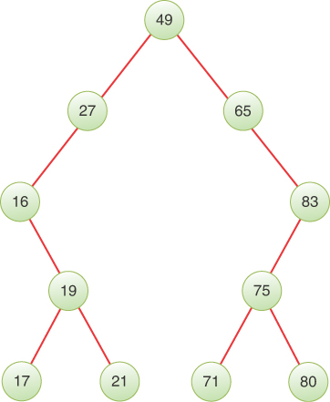
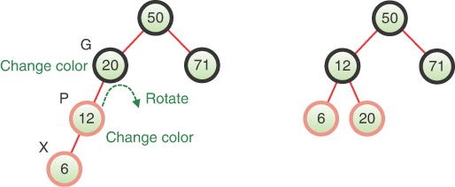

# AVL和红黑树

在这一章当中

- 我们的讨论方法
- 平衡树和不平衡树
- AVL树
- AVL树的效率
- 红黑树
- 使用红黑树可视化工具
- 试用可视化工具
- 红黑树中的旋转
- 插入新节点
- 删除
- 红黑树的效率
- 2-3-4 树和红黑树
- 红黑树实现

正如你在第 8 章"二叉树"中了解到的，普通的二叉搜索树作为数据存储结构具有重要的优势。它们支持使用给定键快速搜索项目，以及快速插入或删除项目。其他数据存储结构，例如数组、排序数组、链表和排序链表，执行这些活动中的一个或另一个的速度很慢。因此，二叉搜索树可能看起来是理想的数据存储结构。
在第 9 章"2-3-4 树和外部存储"中，你了解了如何在每个节点存储多个项目并在插入期间仔细控制它们可以生成平衡树。在树中保持平衡可以使查找、插入或删除项目所需的时间一致且快速。相比之下，不平衡的树可能要慢得多。根据插入项的顺序，普通的二叉搜索树可能会变得不平衡。
本章探讨了使用 AVL 树和红黑树来保持二叉搜索树平衡的方法。二叉树通常更简单，每个节点只有一个项目，并且在某些方面比多路树更容易实现。它们也更容易分析，因为每个节点的项目数是一个常数。
令人惊讶的是，多路 2-3-4 树和二叉红黑树之间存在直接对应关系，你将了解到这一点。

## 我们的讨论方法
我们将从平衡二叉树的简单方法开始：测量和校正。我们向每个节点添加一个额外的属性来跟踪树的高度，并在插入、移动和删除项目时不断更新它。由此，很容易看出何时需要纠正树的平衡。稍后，我们展示了一种不同的方法，将节点标记为红色或黑色。仅使用这两个标签和一些关于如何操作标签的规则，也可以确定树何时平衡。
AVL树是最早的一种平衡树。它以其发明者的名字命名：Adelson-Velskii 和 Landis。在 AVL 树中，每个节点存储一个额外的数据：它距该子树中最深叶节点的高度。这些数据在概念上最容易理解，也许也最容易实现。红黑树在概念上有点复杂，所以我们只讨论它是如何工作的，而不是展示一个实现。我们还研究了它与第 9 章的 2-3-4 树的联系。

## 平衡树和不平衡树

让我们回顾一下二叉树是如何变得不平衡的。当一组键按升序或降序插入时，树只在一侧生长，如图 10-1 所示的示例。


图 10-1 由按升序插入的项目导致的不平衡树
如第 8 章所述，节点将自己排成一条直线，没有分叉的分支。因为每个节点都比之前插入的节点大，所以每个节点都是右子节点，所以所有节点都在根的一侧。树是最大不平衡的。如果你要按降序插入项目，则每个节点都将是其父节点的左子节点，并且树的另一侧将是不平衡的。当插入顺序只是部分递增或递减时，每次递增或递减键的运行都可以形成这样的线性节点串。

### 退化为 O(N)

当没有分支时，树实际上变成了一个排序的链表。数据的排列是一维的而不是二维的。不幸的是，与链接列表一样，你现在必须搜索（平均）一半的项目才能找到具有特定键的项目。在这种退化的情况下，与平衡树的 O(log N) 相比，搜索速度降低到 O(N)。在这样一棵不平衡树中搜索 1,000,000 个项目平均需要 500,000 次比较，而对于平衡树，它只需要 20 次。
仅部分排序的数据会生成仅部分不平衡的树。如果你使用第 8 章中的二叉搜索树可视化工具来尝试生成具有 31 个节点的树，其中一些比其他的更不平衡。例如，图 10-2 中显示的树有 14 个项目，即使请求是用 31 个项目填充它（可以显示的最大值）。可视化工具会阻止在级别 4 以下插入，因此本应在级别 5 或以下插入的项目被丢弃。


图 10.2 部分不平衡的树
虽然不像最大不平衡树那么糟糕，但这种情况对于搜索来说并不是最优的。搜索部分不平衡的树所花费的时间介于 O(N) 和 O(log N) 之间，具体取决于树的不平衡程度。

### 测量树的平衡

要知道一棵树何时不平衡，我们应该有一种衡量平衡的方法。使用度量标准，我们可以将一些值或多个值定义为"平衡"，而其他所有值都可以视为不平衡。
我们应该衡量什么？如第 8 章所述，平衡树的左右两侧的节点数应该大致相等。我们可以简单地计算左侧和右侧的节点。在图 10-1 中，根节点 44 在左侧有零个节点，在右侧有三个节点。这显然是不平衡的，但是图 10-3 中的根，节点 49 呢？它的左边有五个节点，右边有五个节点。它更平衡，但仍然有很长的节点序列，只有一个节点。



图 10.3 平衡二叉树
简单地计算根节点左侧和右侧的节点有两个困难。首先是你只看根。如果你只测量顶部的树，你可能会错过更下面的问题。最好将度量应用于每个子树。这样，你可以实现两件事：获得对整棵树的测量，并且可以分别测量每个子树。由于能够测量子树，你可以注意到图 10-3 中的节点 19 和 75 是完全平衡的，而节点 27 和 65 则相当不平衡。
如果将节点计数技术应用于每个子树，你当然可以通过从左侧的数量中减去右侧的子节点数量来识别平衡和不平衡的节点。使用这些差异，零表示平衡，正值表示左侧有更多节点，负值表示右侧有更多节点。
要获得整个树的度量，你可以尝试将子树度量组合成一个度量。如果你将所有左右节点数的差异加起来，你会得到一个总体度量，但对于图 10-3 中的树，这仍然会导致值为零，因为每个具有负值的节点都有一个匹配另一边的正值。这可能是一种有趣的对称性度量，但它无助于决定何时平衡树以最小化搜索。
将差异的绝对值相加是衡量整棵树不平衡的一种方法。对于图 10-3 中的树，这将总共有 14 个（节点 27 和 65 各有 4 个，节点 16 和 83 各有 3 个，所有其他节点为零，因为它们是平衡的）。如果将节点重新排列成图 10-4 中所示的近乎对称和平衡的树，则总体指标会下降到 4（第 2 层的节点各有一个，关键字为 17、21、65 和 80）。


图 10.4 几乎对称的平衡二叉树
这绝对是一个进步。然而，对搜索性能的最大影响在于到最深叶节点的路径长度。这成为搜索必须遵循的最长路径。在图 10-1 所示的按键升序插入的退化情况下，最长路径的长度为 N-1。对两个子树上的节点进行计数可以捕捉到不平衡，但是将节点计数的绝对差异相加会为图 10-4 中的树生成一个度量值 4，其中到每个叶子的路径长度都相同。直接测量高度会更好。
假设你想测量每棵树两侧的深度差异。因为你想在每个子树上测量它，所以从子树根向下测量它的叶节点更有意义。这样，你就可以忽略子树在整个树中的位置；它相对于整个树根的位置不会改变指标。
从特定节点 X 到叶节点的最长路径上的节点数称为以节点 X 为根的子树的高度，或者更简单地说，X 的高度。图 10-5 显示了级别（或一个节点的深度）和以该节点为根的子树的高度。在示例树中，每个子树的高度在子树的根节点旁边以橙色显示。无论深度如何，所有叶节点的高度都为 1。高度测量节点下方最长的路径（到一个空子节点），级别测量到树根的距离。


图 10.5 节点级别和子树高度
为了平衡，你想要测量节点的两个子分支之间的高度差。你可以用左边子节点的身高减去右边子节点的身高来得到差值。当一个节点只有一个子节点时，如图 10-4 中的节点 17、21、65 和 80 所做的那样，空子节点的高度被认为是零。这样，对于具有单个叶节点作为子节点的节点（如节点 17 和 21），高度差为 +1 或 –1。你要确保计算这些节点的不平衡。
将高度差的绝对值相加得到不同的整体树度量。对于图 10-3 中的不平衡树，总数为 10（第 1 层的节点 27 和 65 各三个，第 2 层的节点 16 和 93 各两个，所有其他节点为零）。图 10-4 中的树总共有 4 个（节点 17、21、65 和 80 各有一个）。此总体指标与节点计数差异的总数相同。两者都发现有 4 个节点在其左右两侧之间存在不平衡。

### 如何定义平衡？

根据我们目前描述的总体指标，指标为零的树肯定是平衡的。如果你要求每棵具有非零度量的树都被认为是不平衡的，那么你只能拥有节点数为 1、3、7、15、...、2N – 1 的平衡树。原因是要达到完美平衡的唯一方法是让每个节点都链接到恰好两个（或没有）子节点，并完全填充树的所有最低级别（最接近根的级别）。
将 balance 定义为 metric = 0 不是一个非常实用的定义，因为你希望二叉树的行为类似于 2-3-4 树，它可以包含任意数量的节点并且仍然被认为是平衡的。平衡二叉树是关于将任何节点的最大高度保持在最小值，以便最长的搜索路径不会超过必要的长度。这正是图 10-4 中的情况，因此树的指标应该是平衡的。让我们看看我们需要将平衡的定义扩展到什么程度。
考虑最小的二叉树。一棵空树和一棵只有一个节点的树是平衡的。当一棵树有两个节点时，一个节点的高度必须与另一个节点不同。这意味着根节点必须至少有一个高度差。因此，你必须允许至少一个节点在平衡树中具有 +/- 1 的高度差。
当添加第三个节点时，有五种可能的树形，如图 10-6 所示。中间一个明显平衡。在所有其他节点中，根节点的高度差为 2，中层节点的高度差为 1。


图 10.6 3 节点二叉搜索树的可能形状
因为存在平衡的 3 节点配置，所以不需要扩展平衡的定义以包含除图 10-6 中的中间树之外的任何内容。你看到第 9 章中的 2-3-4 树可以转换为新的配置，而不会违反构建这些树的任何规则。在这些 3 节点二叉树中也是如此；它们的不同之处在于节点的简单旋转。理想情况下，平衡算法可以将不平衡版本轮换为平衡版本。我们马上回到那些轮换。
当你向树中添加第四个、第五个、第六个……节点时会发生什么？当你将第四个添加到平衡的 3 节点树时，它成为第 2 层的叶节点，如图 10-7 中最左边的树。它的父母身高差一，因为它只有一个子节点。根节点也是如此，因为它的一侧高度为 2，另一侧高度为 1。第 2 层的哪个子节点是第四个节点并不重要。该图显示它是最左边的子节点，但是在第 1 层，根节点和叶节点的高度差异仍然存在，只是符号发生了变化。


图 10.7 平衡的 4、5、6 和 7 节点二叉搜索树
当添加第五个和第六个节点时，如果它们像图 10-7 中的示例一样处于第 2 层，则任何节点的最大绝对高度差为 1。该示例显示了实现这一点的键，但即使在较低级别插入节点，只要节点计数，就会有旋转将树转换回图 10-7 中的形状之一是4到6。添加第七个节点意味着可以将树放入右侧的平衡形状。
这种相同的模式在树的每一层都重复出现。新插入的节点进入叶级。这要么将它们放置在没有节点的高度差超过 1 的位置，要么将它们放置在比最低叶子低一级的位置，并且旋转可以将它们升高以恢复平衡。这是所有自平衡树的核心思想。我们现在可以将平衡定义为

> 平衡二叉树是所有节点的绝对高度差为 1 或 0 的树。

## AVL树
AVL 树是一种改进的二叉搜索树，它为每个节点添加了高度属性。一个节点的左右子节点之间的高度差可以用来衡量它的平衡。当任何子树的绝对高度差大于 1 时，将使用旋转来纠正不平衡。让我们先看看这些轮换。
你在图 10-6 中看到了 3 节点二叉搜索树的五种可能配置。可能还不清楚的是，这些配置中的每一个都与另一个相距一个旋转。图 10-8 以稍微不同的顺序显示了这些配置。要将最左边的树转换为其右侧的下一棵树，需要围绕中间层节点（具有键 27 的节点）进行旋转。该旋转将节点 27 向下移动到左侧并将节点 49 提升到中间层。图中的下一个变换显示了以相反方向围绕根节点 65 旋转。这会将节点 49 提升到根节点并将节点 65 降低到右侧，从而在中间生成平衡树。


图 10-8 3 节点二叉搜索树上的旋转
图 10-8 右侧显示了操作的镜像。从最右边的树开始，围绕中间层节点 65 向右旋转，生成从右边数第二个节点 49 位于中间层的树。将该树的根向左旋转会在中间生成平衡树，根节点为 49。你还可以反转变换方向，以实现图中的另一方向。换句话说，从中间的平衡树开始，围绕根向右旋转，生成图中右数第二棵树。
AVL 树的基本思想是利用每个节点中的附加高度属性来确定其父节点的平衡性。当插入或删除造成多个不平衡时，将通过使用旋转来纠正。

### AVLTree 可视化工具

让我们使用 AVLTree 可视化工具探索 AVL 树的工作原理。当你启动该工具时，它开始时与 Tree234 可视化工具类似，只是顶部的空树对象标记为 AVLTree。与其他树可视化一样，只允许使用 0 到 99 之间的数字键。你可以像以前一样使用插入和搜索按钮插入和搜索单个键。还有依次删除、随机填充、清空、遍历节点的操作按钮。
首先，尝试用 31 项随机填充空树。出现的树应该类似于图 10-9。高度显示在树中每个节点的上方和右侧。


图 10.9 具有随机填充树的 AVLTree 可视化工具
图 10-9 中的树是平衡的；所有节点的高度差为 –1、+1 或 0。这与将 31 个随机选择的键插入图 10-2 的二叉搜索树时发生的情况截然不同。结果平衡只是运气好吗？不，AVL 树使树在每次插入时保持平衡。
尝试使用 New Tree 按钮擦除树并用 31 个随机节点重新填充它。结果又是一棵平衡树。如果你多次重复实验并将结果与使用二叉搜索树的相同实验进行比较，你还会发现生成的 AVL 树平均有更多的节点。这是为什么？
由于两个因素，随机生成的 AVL 树比类似生成的二叉搜索树具有更多的节点。第一个是可视化工具强加的深度限制。由于在任一工具中都不允许在级别 5 或以下进行插入，因此一些插入的密钥将被丢弃。第二个因素是平衡树在深度限制内有更多可用节点来填充。因为 AVL 树会在每次插入时调整平衡，所以树的叶子会尽可能靠近根。这为以后的插入留下了空间。最终，即使是 AVLTree 可视化工具也会在较低级别用完空间，因此很难将所有 31 个随机选择的值都放在树中。

### 使用 AVLTree 可视化工具插入项目

让我们看看 AVL 树是如何保持平衡的。如果你使用可视化工具创建一棵新树，然后将键 10 和 20 插入其中，你将看到一棵如图 10-10 所示的树。左边的 flag = True 表示插入操作成功（即没有超过深度限制，没有找到具有相同 key 的现有节点）。根节点旁边的 2 表示它位于树中的高度 2。


图 10.10 AVL 树中插入的前两项
如果你尝试在树中插入一个键为 30 的节点，它首先会尝试将该项目作为节点 20 的右子节点插入，遵循与二叉搜索树相同的过程。 图 10-11 的上图显示了插入完成后，更新节点 20 和节点 10 的高度之前的过程。该过程然后向上返回通向插入点的路径，检查每个内部节点的高度差 并更新自己的高度。


在图 10-11 的面板 2 中，进程返回到根节点（现在顶部的箭头指向它）并发现节点 10 的高度差为 –2（其空左子节点的高度为 0， 2 为它的右边，节点 20)。请注意，此时它尚未更新节点 10 的高度。发现高度差的绝对值大于1，就必须重新平衡树。为此，它选择提升节点 20，如箭头所示。
三个节点向左旋转，将节点 20 带到根节点，如图 10-11 的最后一张图所示。 top 和 toRaise 节点的高度已经在旋转中携带，需要更新。但是请注意，节点 30 的高度 1 仍然正确，因为高度是相对于叶级别测量的。
这个简化的例子展示了插入的基本操作，但隐藏了许多细节。特别是，这是最简单的旋转形式，其中要提升的节点在它与顶部节点之间的一侧没有子节点。现在让我们转向代码并研究结构中发生的所有事情。

### AVL 树的 Python 代码

AVLtree 类与第 8 章的 BinarySearchTree 和第 9 章的 Tree234 的代码共享很多代码。我们在这里解释不同的关键组件，并省略一些通用的实现。你可以参考前面章节中的代码或查看随附的源代码以了解其余的实现。
出于与 Binary SearchTree 和 Tree234 类中相同的原因，AVLtree 将其 \_\_Node 类定义为私有的。与 BinarySearchTree 的 \_\_Node 构造函数的主要区别是增加了对 updateHeight() 方法的调用，该方法创建一个名为 height 的实例属性，如果它不存在，并根据左右的高度确定其值child，如清单 10-1 所示。因为 AVL 树总是创建新节点作为叶节点，所以构造函数不会为新节点获取左右参数。构造函数可以简单地将高度设置为 1 而无需调用 updateHeight()，因为新节点的左右子节点始终为空。我们在代码中保留了该调用，以显示如何进行计算以获得初始值 1。
清单 10-1 AVLtrees 的 \_\_Node 类

```python
class AVLtree(object):
    class __Node(object):  # A node in an AVL tree
        def __init__(  # Constructor takes a key-data pair
            self, key, data  # since every node must have 1 item
        ):
            self.key, self.data = key, data  # Store item key & data
            self.left = self.right = None  # Empty child links
            self.updateHeight()  # Set initial height of node

        def updateHeight(self):  # Update height of node from children
            self.height = (
                max(  # Get maximum child height using 0 for
                    child.height if child else 0  # empty child links
                    for child in (self.left, self.right)
                )
                + 1
            )  # Add 1 for this node

        def heightDiff(self):  # Return difference in child heights
            left = self.left.height if self.left else 0
            right = self.right.height if self.right else 0
            return left - right  # Return difference in heights
```

updateHeight() 方法明确处理空子链接。它使用 Python 列表理解（for child in (self.left, self.right)）来检查两个子节点。对于 None 的链接，子项高度被视为 0，否则它从子项的高度属性中获取高度。子节点的身高作为参数传递给 max() 函数。最后，它将子节点的最大高度加 1，使叶节点的高度为 1。
接下来是决策指标 heightDiff()。节点的右子树的高度从其左子树的高度中减去。因为这些子树可能是空的，所以如果子链接为 None，它会用默认值零替换子节点的高度。因此，只有一个子节点的节点会产生一个高度差，该高度差等于或减去子节点的身高。
插入 AVL 树
将新项目插入 AVL 树开始时就像插入二叉搜索树一样；将要插入的项的键与树中现有的键进行比较，直到找到应该插入的叶节点。在 BinarySearchTree 类中，插入只需更改新节点父节点中的一个子链接即可完成其工作。因为 AVL 树需要在每次插入后检查平衡，并且可能一直旋转到根，所以在叶级插入后，它需要跟随父链接返回树。使用递归实现很容易返回所遵循的路径，这就是清单 10-2 中所示的内容。保留在路径上访问过的节点的显式堆栈也可以做同样的事情。
insert() 方法很简单。它从根节点开始调用递归的私有 \_\_insert() 方法来完成工作。请注意，它将 \_\_root 属性设置为该调用的结果。这就是递归算法更新树的方式；它调用一个在子树上操作的方法，然后用发生的任何修改替换子树。通过这种方式，例如，空的根属性在第一次插入时被新创建的节点填充。 insert() 方法返回一个布尔标志，指示是否在树中插入了一个新节点（与更新现有键相反）。该标志是 \_\_insert() 返回的第二个值。
在 \_\_insert() 方法中，首先检查的是基本情况。如果在空树（或子树）上调用 \_\_insert() ，则节点参数为 None，它只返回一个新节点，其中包含要插入的项的键和数据。该新对象的返回处理插入树的第一个节点。它还将插入标志返回为 True 以告知调用者已添加另一个节点。
如果要插入的节点的键与树中的现有键匹配，则 \_\_insert() 方法面临如何处理重复键的选择。与 2-3-4 树一样，此实现使用要插入的新数据更新现有节点的数据属性。这意味着不允许重复键，并且 AVL 树的行为类似于关联数组。调用者可以通过查看返回的插入标志为 False 来了解这一点。更改数据属性后，必须返回修改后的节点，以便其父节点可以将同一节点存储回根或其他子链接中。
清单 10-2 AVLtree insert() 方法

```python
class AVLtree(object):
…
    def insert(self, key, data):  # Insert an item into the AVL tree
        self.__root, flag = self.__insert(  # Reset the root to be the
            self.__root, key, data
        )  # modified tree and return the
        return flag  # the insert vs. update flag

    def __insert(
        self,  # Insert an item into an AVL subtree
        node,  # rooted a particular node, returning
        key,
        data,
    ):  # the modified node & insertion flag
        if node is None:  # For an empty subtree, return a new
            return self.__Node(key, data), True  # node in the tree

        if key == node.key:  # If node already has the insert key,
            node.data = data  # then update it with the new data
            return node, False  # Return the node and False for flag

        elif key < node.key:  # Does the key belong in left subtree?
            node.left, flag = self.__insert(  # If so, insert on left and
                node.left, key, data
            )  # update the left link
            if node.heightDiff() > 1:  # If insert made node left heavy

                if node.left.key < key:  # If inside grandchild inserted,
                    node.left = self.rotateLeft(node.left)  # then raise grandchild

                node = self.rotateRight(  # Correct left heavy tree by
                    node
                )  # rotating right around this node

        else:  # Otherwise key belongs in right subtree
            node.right, flag = self.__insert(  # Insert it on right and
                node.right, key, data
            )  # update the right link
            if node.heightDiff() < -1:  # If insert made node right heavy

                if key < node.right.key:  # If inside grandchild inserted,
                    node.right = self.rotateRight(node.right)  # then raise grandchild

                node = self.rotateLeft(  # Correct right heavy tree by
                    node
                )  # rotating left around this node

        node.updateHeight()  # Update this node's height
        return node, flag  # Return the updated node & insert flag
```

处理完基本案例后，剩下的就是递归案例。 （在 AVLTree 可视化工具中，检查了另一种"基本"情况：插入是否超过深度限制。）有两个选项；要插入的项目属于节点的左子树或右子树。如果要插入的键小于该节点的键，则它属于左侧，否则属于右侧。这两个选择在接下来的两个代码块中处理。
对于左边，第一步是用在左子树递归插入项的结果更新左链接（并记录插入标志结果）。对于刚刚习惯递归的程序员来说，这似乎是一件愚蠢的事情，因为它看起来像是为自己设置一个变量。正如你在第 6 章"递归"中看到的，它可能非常强大。你已经看到，如果 node.left 链接为 None，\_\_insert() 将返回一个新的叶节点来替换它，而这正是我们所需要的。如果左边的链接指向某个子树，你可以假设它会在任何插入和旋转之后返回该子树顶部的节点，以保持子树的平衡。做出该假设后，剩下的就是在返回平衡子树后通过更新链接来完成工作。当然，你必须将此调用中修改后的子树返回给 \_\_insert() 以确保假设仍然准确。
左子树更新后还必须做什么？好吧，有可能是左边的插入导致这棵子树的平衡变得左重；也就是说，左子树的高度现在比右子树的高度大一倍以上。它不可能使这个节点右重，因为插入是在左子树中进行的，并且你从平衡子树开始（因为 AVL 树旨在始终保持自我平衡）。另一种说法是，当调用 \_\_insert() 方法时，节点的高度差必须为 –1、0 或 +1。
\_\_insert() 方法通过查看 node.heightDiff() 现在是否超过 1 来检查节点的平衡。如清单 10-1 所示， heightDiff() 计算节点左子树的（新修改的）高度与节点的左子树的高度之差右子树。如果在递归调用中正确更新了左节点的高度，这将起作用。如果你向前看代码，该更新恰好发生在 \_\_insert() 方法返回修改后的节点之前。
当节点在其左子节点中插入后变得很重时，\_\_insert() 方法需要通过执行一到两次旋转来纠正它。为了决定需要哪些，该方法查看相对于节点插入键的位置。回到图 10-8，你看到了如何旋转 3 节点树直到它们达到平衡。在假设刚刚插入的项目是第三个节点的情况下，同样的逻辑适用于此。
当插入节点的左子节点时，树的形状要么是图 10-8 中最左边的树，要么是倒数第二个树。插入一定产生了一个孙节点；否则，它不可能让节点变得沉重。那么问题就变成了，该项目是插入节点的内部还是外部孙节点节点？图 10-8 中最左边的树显示了在顶部节点的内部孙节点处的插入。这需要两次旋转才能获得图 10-8 中间树中的平衡形式。如果插入的是外孙节点，这种情况只需要一个轮换。
清单 10-2 中的 \_\_insert() 代码检查插入的键是否大于节点的左子键。如果是，则插入是一个内部孙节点，因为插入路径在向下的过程中向左然后向右。为了纠正不平衡，它围绕节点的左子节点执行左旋转。否则，它只执行一次旋转——围绕子树 node 的顶部向右旋转。如果插入到外面的孙节点，这就是需要的，在向下的路上向左并再次向左。右旋转纠正了树的左重度。旋转操作由我们稍后描述的方法执行。它们使用与递归 \_\_insert() 方法相同的样式，并将旋转顶部的节点设置为向上移动的任何节点。
前面的步骤处理节点左子树中插入的旋转。下一个 else 子句处理节点右子树中插入的旋转。这些是左手旋转步骤的镜像，左右交换并改变高度差的符号。内部孙节点是先是右子链接，然后是左子链接，而外部子链接是右-右链接。
在任何一种子树插入之后， \_\_insert() 方法都会调用节点上的 updateHeight() ，然后从递归调用中返回修改后的节点和插入标志。高度可能与进入 \_\_insert() 方法时节点的高度不同，因为下面的子树中还有一个项目。此时更新高度可确保返回给调用者的节点具有关于其相对于子树叶子的位置的正确信息。
旋转是通过更改子树中节点之间的链接来执行的。子树的顶部有时称为旋转中心或枢轴（尽管后一个术语可能与快速排序中使用的枢轴混淆）。对于 rotateRight()，顶部的左子节点被提升。清单 10-3 的代码显示 top.left 存储在变量 toRaise 中。
清单 10-3 AVLtree 的 rotateRight() 和 rotateLeft() 方法

```python
class AVLtree(object):
…
    def rotateRight(self, top):  # Rotate a subtree to the right
        toRaise = top.left  # The node to raise is top's left child
        top.left = toRaise.right  # The raised node's right crosses over
        toRaise.right = top  # to be the left subtree under the old
        top.updateHeight()  # top. Then the heights must be updated
        toRaise.updateHeight()
        return toRaise  # Return raised node to update parent

    def rotateLeft(self, top):  # Rotate a subtree to the left
        toRaise = top.right  # The node to raise is top's right child
        top.right = toRaise.left  # The raised node's left crosses over
        toRaise.left = top  # to be the right subtree under the old
        top.updateHeight()  # top. Then the heights must be updated
        toRaise.updateHeight()
        return toRaise  # Return raised node to update parent
```

下一步可能是最令人困惑的。这是被提升的节点将其右子节点移动到顶部的左子节点的地方。移动的子节点是交叉子树。在图 10-8 中左数第二个 3 节点树中，右子节点是空的，因此它似乎只是一种将 top 的左子节点初始化为空的方法。我们稍后会讨论当交叉包含子树时会发生什么。
移动交叉链接后，top成为节点toRaise的右子节点，完成节点的重组。需要更新两个更改节点的高度，因为它们的相对位置发生了变化。你首先更改 top 的高度，因为它在树中移动得较低，而 toRaise 的高度现在取决于它。当两个高度都更新时，子树的新顶部 toRaise 将返回以存储在父节点到旋转子树的链接中。
清单 10-3 中 rotateLeft() 的代码是 rotateRight() 代码的另一个镜像，交换了左右的角色。

### 旋转中的交叉子树

当在较低级别插入后旋转在树上冒泡时，在更复杂的树的旋转过程中会发生什么？正在旋转的节点周围可能有子链接。他们去哪里？为了回答这个问题，让我们看一下树中间的右旋。
当你围绕某个节点向右旋转时，你正试图将其左子节点向上抬起。我们将位于顶部的节点称为 T，将要提升的节点称为 R。一般情况下，三个子树会出现在 T 和 R 的下方，如图 10-12 所示。 R 的左子节点拥有所有键小于 R 的键的节点，R 的右子节点拥有所有大于 R 的键的键。更具体地说，它具有 R 的密钥和 T 的密钥之间的所有密钥。原因是你在插入这些键时必须遵循 T 的左子链接。涉及的第三个子树是 T 的右子树，其节点的键大于 T 的键。


图 10.12 右旋和交叉子树
图 10-12 的左侧显示了旋转前 T、R 及其三个子树的关系。 T 位于顶部，R 是它的左子节点。 T 可能有也可能没有父节点，由向上的淡线表示。 T 和 R 下面挂着三棵子树，包含小于 R 的键（k < R）、R 和 T 之间的键（R < k < T）和大于 T 的键（T < k）。绿色箭头表示节点的计划移动方向。 R 向上和向右移动，而 T 向下和向右移动。
旋转产生图中右侧的配置后，外面的两个子树显然仍然在正确的位置。交叉子树呢？它持有高于 R 的密钥且低于 T 的密钥。因为它现在是 T 的左子节点，所以任何到达 T 的搜索都会正确地选择左链接来查找它包含的键。因为 T 成为 R 的右子节点，所以任何搜索大于 R 的密钥都会正确选择它到 T 的正确链接，从而到达交叉子树。
右旋转将项目保留在与旋转的键相关的正确子树中。另外，子树的高度在旋转过程中不会发生变化，因此在 rotateRight() 中调用 updateHeight() 只需要检查每个子树最顶层节点的高度即可正确更新 T 和 R 的高度（top 和募集）。 rotateLeft() 方法执行镜像操作集，保留子树关系。
可视化工具在旋转期间为各种子树的运动设置动画。图 10-11 显示了带有空交叉子树的左旋转的简单示例。尝试创建子树从左到右交叉（或反之亦然）的情况。插入键序列时会发生一个简单的示例：10、20、30、40、50、60。插入节点 60 后，在调用 rotateLeft 方法时使用步进功能观察 top 和 toRaise 的更新旋转根节点。这显示了交叉子树（以节点 30 为根）是如何放置的。显示内部孙节点的双重旋转的另一个示例是将键 25 和 27 添加到刚刚插入的六个。然后添加键 29、28 和 22 以查看 3 节点交叉子树移动。多次观看这些动画，直到你可以轻松地预测节点移动之前会发生什么。

### 从 AVL 树中删除

从 AVL 树中删除稍微复杂一些，并遵循第 8 章中描述的用于二叉搜索树的策略。删除叶节点很容易，但之后必须检查树的平衡。如果一个内部节点只有一个子链接，删除它并不难；子节点替换树中的节点。仅删除具有两个子链接的内部节点会带来重大挑战。即使那样，你也知道可以用它的后继节点替换存储在该节点的项目，后者总是位于较简单的删除位置之一。
与插入的情况一样，子树中的每次删除都可能导致高度发生足够大的变化，以至于树不再平衡。纠正不平衡将涉及旋转——实际上，与用于插入的旋转相同。实现可以使用相同类型的递归方法找到要删除的节点，然后寻找后继节点，在每次递归调用完成后更新子链接和高度。
清单 10-4 中所示的主要 delete() 方法与 insert() 方法起着相同的作用；它调用根节点上的私有递归 \_\_delete() 方法，用返回值更新根，并返回一个标志，指示是否找到并删除了目标节点。
清单 10-4 AVLtree 的 delete() 方法

```python
class AVLtree(object):
…
    def delete(self, goal):  # Delete a node whose key matches goal
        self.__root, flag = self.__delete(  # Delete starting at root and
            self.__root, goal
        )  # update root link
        return flag  # Return flag indicating goal node found

    def __delete(
        self, node, goal  # Delete matching goal key from subtree
    ):  # rooted at node. Return modified node
        if node is None:  # If subtree is empty,
            return None, False  # then no matching goal key

        if goal < node.key:  # Is node to delete in left subtree?
            node.left, flag = self.__delete(  # If so, delete from left
                node.left, goal
            )  # update the left link and store flag
            node = self.__balanceLeft(node)  # Correct any imbalance

        elif goal > node.key:  # Is node to delete in right subtree?
            node.right, flag = self.__delete(  # If so, delete from right
                node.right, goal
            )  # update the right link and store flag
            node = self.__balanceRight(node)  # Correct any imbalance

        # Else node's key matches goal, so determine deletion case
        elif node.left is None:  # If no left child, return right child
            return node.right, True  # as remainder, flagging deletion
        elif node.right is None:  # If no right child, return left child
            return node.left, True  # as remainder, flagging deletion
        # Deleted node has two children so find successor in right
        else:  # subtree and replace this item
            node.key, node.data, node.right = self.__deleteMin(node.right)
            node = self.__balanceRight(node)  # Correct any imbalance
            flag = True  # The goal was found and deleted

        node.updateHeight()  # Update height of node after deletion
        return node, flag  # Return modified node and delete flag
```

\_\_delete() 方法适用于以树中的节点为根的子树。首先它检查基本情况。如果节点为 None，则子树为空，因此无法删除任何内容。空子树与 False 一起返回，表示没有发生删除。
对于具有某些项目的子树，接下来的检查确定目标相对于子树的根节点所在的位置。如果目标键小于节点的键，则要删除的项目必须在其左子树中。它使用递归调用 node.left 上的 \_\_delete() 的结果更新左子树。然后它通过调用 balanceLeft() 重新平衡知道左侧已减少的节点。同样，如果目标键大于节点的键，则要删除的项目必须在其右子树中。它在右侧执行删除并相应地重新平衡。对于这两个分支，它存储指示删除是否实际发生的标志。
如果这些 if 语句条件均未应用，则 \_\_delete() 知道目标键与节点的键匹配。现在它可以看看它有什么删除案例。如果该节点没有左子节点，那么删除该节点只是简单地提升其右子节点以在树中替换它。如果左右子链接都为空，则节点是叶子，返回 node.right，即 None，将从其父节点中删除它。下一个 elif 语句检查右子链接是否为空。如果是这样，它只是简单地提升左子节点来替换节点。
在检查了所有简单删除案例之后，你知道你正在从具有两个子树的节点中删除一个项目。你必须找到该节点的后继者，将其项存储在该节点的键和数据属性中，从树中删除后继者，纠正导致的任何平衡问题，更新该节点的高度，并返回修改后的节点。这是相当多的工作要做，它被分解成几个辅助方法。
\_\_delete()方法调用\_\_deleteMin()方法删除节点右子树中key最小的项。正如你在第 8 章中学到的，该最小值是该节点的后继节点。然后它调用 \_\_balanceRight() 方法来纠正因从右子树中删除后继节点而导致的任何不平衡。它还将标志设置为 True，表示发生了删除。
在执行任何不同类型的删除后，节点的高度可能已经改变，因此它调用 node.updateHeight()。最后返回修改后的节点和删除标志。我们查看每一种新方法，看看它们是如何工作的。
\_\_deleteMin() 方法使用 Python 元组返回三个值。前两个是后继节点的key和data。它们必须替换 \_\_delete() 找到的节点中正在删除的项目。第三个返回值是 \_\_delete() 找到的节点的右子节点的修改节点。右子节点可能是叶节点（使其成为后继节点），这意味着为第三个值返回 None。
清单 10-5 中所示的 \_\_deleteMin() 方法与 \_\_delete() 的操作类似，因为它递归地下降子树以查找和删除项目。要查找的项目不为特定键所知；它是具有最小键的项，因此递归始终遵循左链接，直到找到左子节点为空的节点。这是基本情况，首先进行测试。找到最小节点后，可以将其密钥和数据作为后继返回。它返回后继者的右子节点（可能为空）作为替换最小节点的子树。在返回给它的调用者之后，最小节点已经从树中移除。 （这里不需要递归调用 \_\_delete() 就像删除二叉搜索树中的后继者一样，因为从递归调用的结果中对 node.left 的赋值会从树中删除该节点。）
清单 10-5 AVLtree 的 \_\_deleteMin() 和 Rebalance 方法

```python
class AVLtree(object):
…
    def __deleteMin(  # Find minimum node of subtree, delete
        self, node  # it, return minimum key, data pair and
    ):  # updated link to parent
        if node.left is None:  # If left child link is empty, then
            return (
                node.key,
                node.data,  # this node is minimum and its
                node.right,
            )  # right subtree, if any, replaces it
        key, data, node.left = self.__deleteMin(  # Else, delete minimum
            node.left
        )  # from left subtree
        node = self.__balanceLeft(node)  # Correct any imbalance
        node.updateHeight()  # Update height of node
        return (key, data, node)

    def __balanceLeft(self, node):  # Rebalance after left deletion
        if node.heightDiff() < -1:  # If node is right heavy, then
            if node.right.heightDiff() > 0:  # If the right child is left
                node.right = self.rotateRight(  # heavy, then rotate
                    node.right
                )  # it to the right first

            node = self.rotateLeft(  # Correct right heavy tree by
                node
            )  # rotating left around this node
        return node  # Return top node

    def __balanceRight(self, node):  # Rebalance after right deletion

        if node.heightDiff() > 1:  # If node is left heavy, then
            if node.left.heightDiff() < 0:  # If the left child is right
                node.left = self.rotateLeft(  # heavy, then rotate
                    node.left
                )  # it to the left first

            node = self.rotateRight(  # Correct left heavy tree by
                node
            )  # rotating right around this node
        return node  # Return top node
```

\_\_deleteMin() 方法的其余部分处理递归工作，即左子树下降、存储后继键和找到的数据、调整左子树中较低的删除引起的任何平衡问题，并在删除后更新节点的高度和可能的轮换。这些操作类似于插入操作，尽管对 \_\_balanceLeft() 方法的调用不同。在我们描述它是如何工作的之前，让我们先仔细看看哪些子树被 \_\_deleteMin() 重新平衡了。

因为对 \_\_balanceLeft() 的调用是在每次递归下降到左子链接后立即发生的，所以它适用于访问的每个具有左子节点的节点。根据定义，后继节点没有左子节点。无法在继任者上调用 \_\_balanceLeft() 会导致问题吗？

要回答这个问题，请考虑后继节点的两种可能性：叶节点，或具有右子树而没有左子树的节点。在第一种情况下，叶节点正在被删除，因此实际上没有任何可以平衡的东西。在第二种情况下，后继者被其右子树替换。右子树，称为 S，必须在调用 \_\_delete() 之前平衡，因为 AVL 树为插入和删除保持平衡。 S 的平衡度量仅取决于 S 的子树的高度，而不取决于它们在整个树中的位置。因此，在使用以 S 为根的已经平衡的子树更新后继节点后，你可以安全地跳过对后继节点的重新平衡。但是，后继节点的父节点可能需要重新平衡，因为 S 的高度将比正在移动的后继节点小一.调用者将负责平衡继承者的父级。

在另一种情况下，可能不会调用 \_\_balanceLeft() 方法。当对 \_\_deleteMin() 的第一次调用落在没有左子节点的节点上时，就会发生这种情况。这种情况下的节点是与目标键匹配的节点的右子节点（很快就会用后继键更新）。 \_\_deleteMin() 在其基本情况下立即返回其节点的项目和右子树，不会调用 \_\_balanceLeft() 方法。然而，使用与前面相同的推理，你知道返回的右子树必须在调用 \_\_delete() 之前已经平衡。已经平衡的子树正在被提升以替换调用 \_\_deleteMin() 中的节点并且不需要重新平衡。当 \_\_deleteMin() 返回时，\_\_delete() 方法调用 \_\_balanceRight() 来重新平衡缩短的右子树。

重新平衡所有需要它的节点有点棘手。删除例程中的递归结构遵循每个链接并在每个级别应用 \_\_balanceLeft() 或 \_\_balanceRight() 方法。这应该让你有信心，你不会错过沿途的任何节点。

现在是时候看看清单 10-5 中的 \_\_balanceLeft() 和 \_\_balanceRight() 方法本身了。他们使用 heightDiff() 方法分别确定以该节点为根的子树是右重树还是左重树。如果子树的一侧不重，则它什么都不做并返回未修改的节点（及其子树）。

在 \_\_balanceRight() 中，当要重新平衡的子树很重时，这与 \_\_insert() 方法必须处理在左子树中添加新项目时的情况几乎相同。然而，这一次，你没有插入键来知道在何处添加了额外的高度（因为从右子树中删除了一个节点）。相反，你需要查看左子树的平衡（高度差），即需要提升以恢复平衡的子树。如果左子树是完美平衡的，或者左子树的高度比右子树高 1（高度差为 0 或 +1），那么你只需要向右旋转一次就可以将它带到顶部。请注意，左子树的高度差只能取三个可能的值：–1、0 或 +1。任何其他值都意味着子树是不平衡的，并且在将其传递到递归链之前你已经平衡了每个子树。

当 \_\_balanceRight() 中要重新平衡的节点的左子树的高度差为 –1 时会发生什么情况？这种差异表明它的右子树的高度比它的左子树高一倍。这种情况如图 10-13 的左侧所示。在节点T上调用了\_\_balance Right()方法，发现由于右子树的删除导致左重。这意味着它在 T 处发现了 +2 的高度差。此外，T 的以节点 R 为根的左子树的高度差为 –1。这意味着右子树的高度比左子树高一倍。在图中，它们显示的高度为 H 和 H + 1。当 \_\_balanceRight() 方法将 T 向右旋转时，高度为 H + 1 的右侧将交叉。


图 10.13 平衡左重子树
在这种情况下，T的右子树的高度必须为H。你知道因为T处的高度差正好是+2，而R的高度是H + 2。如果围绕T执行右旋转，你会得到图10-13右边的情况。高度为 H+1 的 R 的右子树交叉成为 T 的左子树。那么 T 的高度将为 H+2，因为它比其最大子树的高度大一。比较 R 处的高度差，现在是右旋转后的顶部节点，你会发现 –2，这意味着它是一棵右重树。这是个问题，但你可以通过另一个轮换来解决它。
解决方案是使用在左子树上插入后处理内部孙节点时使用的相同操作（参见图 10-8）。如果你首先在左子树 R 上使用左旋转，这会将交叉子树的高度降低到 H。通过将 T 的内部孙节点树向上提升一个（围绕 R 向左旋转），你已经将之前的左侧弄平了将 T 的左子节点提升为新的树顶（围绕 T 向右旋转）。
因此， \_\_balanceRight() 方法执行一次或两次旋转来纠正不平衡的子树。它检查子树根部及其左子树的高度差异，以确定需要进行哪些旋转。 \_\_balanceLeft() 方法执行镜像操作以纠正导致右重子树的左删除。请注意，它不需要递归地下降到子树中。原因是你已经确保它们在之前的重新平衡操作中都有一个或更小的绝对高度差。
可视化工具展示了所有这些方法是如何运作的。尝试从树中删除节点：首先是几片叶子，然后是一些带有一个和两个子节点的内部节点，以查看所有情况。你可以使用指针设备单击一个节点以在文本输入框中输入其密钥，或者在选择删除按钮之前键入密钥编号。在对一侧进行多次删除后，AVL 树最终将使用 \_\_balanceLeft() 或 \_\_balanceRight() 方法执行旋转。使用步进控件仔细跟踪任何引起混淆的呼叫。
我们现在已经介绍了 AVL 树中的插入和删除。 AVL 树的其余方法，如 search() 和 traverse() 与二叉搜索树相同，如果仔细查看可视化工具的代码，就会发现这一点。添加的节点高度属性可能不会暴露给调用者，因为它仅用于维持树的平衡，但对于某些应用程序来说，它可能是一个有用的指标。

## AVL树的效率
因为 AVL 树类似于二叉搜索树，所以它们的效率是相似的。保持每个节点的高度会增加存储成本，并且会增加更新该属性和在插入和删除期间重新平衡子树所需的时间。额外的工作会生成平衡的二叉树，你知道它的搜索时间为 O(log N)。最重要的是，对于退化的情况，搜索时间不会降低到 O(N)。
你需要付出多少才能获得余额的好处？在插入时，在每个递归级别都有对 updateHeight() 的调用。树中有 log~2~(N + 1) 层和相同数量的递归层。还会在每一层调用 heightDiff() 来检查树的平衡。其中一些导致更多的关键比较和轮换。在最坏的情况下，每个级别都会调用一次 heightDiff() 并进行两次旋转（每次调用 updateHeight() 两次）。这是相当多的，但它仍然是一个固定的工作量，不依赖于树中的节点数量。所有添加的操作都会使每个递归级别完成的工作量增加一个常数。在大 O 表示法中，你可以忽略常量并得出插入是 O(log N) 的结论，因为唯一随 N 增长的是级别数。
删除的分析遵循插入的分析。仍然有 log~2~(N + 1) 个级别需要访问，每个级别都涉及调用 \_\_balanceLeft() 或 \_\_balanceRight() 内部的 updateHeight() 和 heightDiff()，以及在发现不平衡时进行一到两次旋转。这些调用都添加到乘以级别数的常量，并且该常量不会随着项目数量的增加而改变。这使得删除成为 O(log N) 操作。
考虑使用的内存量，它是 O(N)，因为每个节点都需要固定数量的内存，并且每个存储的项目都有一个节点。然而，乘以项目数的常量已经增长，因为你将高度属性添加到树中。有点难看的是 height 属性需要足够大才能准确计算每个子树的高度。如果你使用单个字节作为高度，那么它最多只能计算到 255 的高度。对于大量项目来说，这个限制可能会成为一个问题。一个完整的机器字可以用来存储高度，它是 64（或可能是 32）位，允许极深的树。
还有用于递归堆栈的 O(log N) 内存，因为树的每一层至少有一个调用。当然，还有许多其他过程调用，但在任一时刻处于活动状态的总数将与级别数成正比。因为 O(log N) 内存将比存储节点所需的 O(N) 内存小得多，所以通常被忽略。

## 红黑树

还有其他方法可以平衡二叉树吗？是的，当然有，但是有没有像 AVL 树一样高效但不会增加那么多额外工作的方法呢？这是一个更大的挑战，但称为红黑树的结构提供了一个有趣的答案。红黑树不需要依赖节点高度的度量，而是需要关于每个节点的信息多 1 位。该位编码节点是标记为红色还是黑色。一点如何帮助平衡树？让我们找出答案。
红黑树并不容易理解。因此，实际代码比你预期的更冗长和复杂。因此很难通过检查代码来了解算法。你已经在二叉搜索树和 AVL 树中看到了许多关键操作的实现，例如旋转和确定内外孙节点节点。所以，本文不对红黑树源码进行描述。相反，我们讨论结构和算法，并使用另一种可视化工具帮助你理解操作。

### 概念性的

为了从概念上理解红黑树，我们可以使用 RedBlackTree 可视化工具。我们描述了如何与该工具合作将新节点插入树中。将人纳入插入程序肯定会减慢速度，但也使人更容易理解该过程的工作原理。
搜索在红黑树中的工作方式与在 AVL 或普通二叉搜索树中的工作方式相同。正如你所料，插入和删除是差异出现的地方。因此，在本章中，我们将重点放在插入过程上。

### 自顶向下插入

红黑树使用自上而下的插入。这意味着当搜索例程沿着树向下寻找插入节点的位置时，可能会对树进行一些结构更改。在第 9 章的 2-3-4 树中使用了这种方法，当算法搜索插入点时将完整节点拆分。

### 自底向上插入

另一种方法是自底向上插入。这种类型涉及找到插入节点的位置，然后通过树进行结构更改。自下而上的插入效率较低，因为必须通过树的级别进行两次传递。第 9 章中的 2-3 树使用自下而上的方法，拆分完整的叶节点并将溢出提升到顶部（根）。 AVL 树还以自下而上的方式重新平衡树。在红黑树中，平衡在插入和删除期间保持不变，就像对所有自平衡树所做的那样。插入项目时，插入例程会检查是否违反了树的某些特征。如果是，它会采取纠正措施，根据需要重组树。因为例程保持这些特征，所以树保持平衡。

### 红黑树特性

在红黑树中，每个节点都被标记为黑色或红色。这些是任意颜色；蓝色和黄色也可以。事实上，说节点有颜色的整个概念有些武断。可以使用其他一些类比来代替。你可以说每个节点都是或重或轻，或阴或阳。然而，颜色是方便的标签，可以帮助程序员使用一致的词汇。一个布尔数据属性，例如 isRed，被添加到节点类来体现这个颜色信息。
在 RedBlackTree 可视化工具中，节点的红黑特性通过其边框颜色显示。正如在所有树可视化工具中一样，中心颜色只是节点数据属性的指示。当我们在本章中谈到节点的颜色时，我们几乎总是指图中显示的纯红色或黑色边框颜色。

### 红黑规则
插入（或删除）新节点时，你会检查某些条件，称为红黑规则。如果它们都被跟随，则这棵树被称为红黑正确，并且它将是平衡的。

- **规则 1**. 每个节点不是红色就是黑色。
- **规则 2**. 根总是黑色的。
- **规则 3**. 如果一个节点是红色的，它的子节点必须是黑色的（尽管反之不一定成立）。
- **规则 4**. 从根到叶子或空子节点的每条路径都必须包含相同数量的黑色节点。

规则 4 中提到的"空子节点"是一个子节点可以附加到非叶节点的地方。换句话说，它是只有右子节点的节点的潜在左子节点或只有左子节点的节点的潜在右子节点。随着我们的进行，这个描述会更有意义。
从根到叶的路径上黑色节点的数量称为黑色高度。表述规则 4 的另一种方式是，对于从根到叶或空子节点的所有路径，黑色高度必须相同。请注意，黑色高度是为路径定义的，而用于 AVL 树的高度度量是针对整个子树的（并且不关心节点颜色）。
这些规则可能看起来完全神秘。它们将如何导致一棵平衡树并不明显，但它们确实如此；一些非常聪明的人发明了它们。将它们复制到某处并放在手边。在了解红黑树时，你需要经常参考它们。
除了基本规则外，红黑树与二叉搜索树一样灵活。它们允许任何类型的密钥，只要它们可以通过比较来确定排序。它们不允许重复键并充当关联键存储。熟悉轮盘赌轮盘的红色和黑色的人可能会推断这些钥匙在某种程度上必须是奇数或偶数，但这是错误的。你不会总是在每条路径上看到交替的颜色；规则 3 仅防止红色节点具有也为红色的子节点。黑色节点可以有黑色或红色子节点。

### 修复规则违规

假设你看到（或者我们很快介绍的可视化工具告诉你）违反了颜色规则。你如何修复你的树以使其符合要求？你可以采取两种且只有两种可能的操作：

- 你可以更改节点的颜色。
- 你可以执行轮换。

在该工具中，更改节点的颜色意味着更改其红黑色边框颜色（而不是中心颜色）。更改颜色意味着将布尔标志设置为一个或多个节点的不同值。因为它是一个布尔值，所以你可以将此称为"翻转"两个值之一之间的颜色，类似于翻转硬币。正如你所见，旋转以一种希望使树更加平衡的方式重新排列一些节点。它们始终保留键的搜索关系。节点的颜色随着它们旋转而保持不变，并且"粘性"会导致（或修复）违反规则。
在这一点上，这些概念可能看起来很抽象，所以让我们熟悉一下 RedBlackTree 可视化工具，它可以帮助澄清事情。

## 使用红黑树可视化工具

要启动可视化工具，请按照附录 A"运行可视化"中的说明进行操作，然后运行 RedBlackTree.py 程序或从可视化菜单中选择它。图 10-14 显示了 RedBlackTree 可视化工具在插入两个节点时的样子。


图 10.14 RedBlackTree 可视化工具
与你研究过的其他树一样，RedBlackTree 对象有一个指向树根节点的指针。在图中，节点 77 是根节点，颜色为黑色。它的右侧有一个子节点，即节点 94，颜色为红色。
在左上角，出现了关于红黑规则的三个消息（第一个规则——所有节点都是红色或黑色——总是由工具强制执行）。规则 2 是对还是错，取决于根的颜色。对于规则 3，该消息计算链接到其他红色节点的红色节点的数量。对于规则 4，该消息显示了可以在树中找到的所有不同的黑色高度。换句话说，它计算树中每个叶节点和空子节点的黑色高度，并在花括号内显示一组唯一高度。在图 10-14 的例子中，节点 94 是一个黑色高度为 1 的叶节点，根节点有一个空左子节点，其黑色高度也为 1。
这棵树都满足红黑规则，所以消息显示为绿色，最后一条消息是"RED-BLACK CORRECT!"当违反任何规则时，该消息就会消失。

### 翻转节点的颜色

你可以通过使用指针设备单击节点或在文本输入框中输入其键并选择"翻转颜色"按钮来更改节点的颜色。尝试将节点 94 的颜色更改为黑色。环的颜色发生变化，消息也发生变化，表明违反了其中一条规则，如图 10-15 所示。由于树中恰好有两个黑色节点，现在有两个不同的黑色高度：1 表示根的空左子节点，2 表示叶节点 94。将节点 94 翻转回红色，再次满足规则。


图 10.15 恰好有两个节点的树，都是黑色的
单击节点翻转其颜色的一个副作用是节点的密钥被输入到文本输入框中，以供后续操作使用。 这与你看到的在操作完成后清除文本输入框的其他操作略有不同。
节点 94 再次变红，将根节点 77 的颜色翻转为红色。 现在违反了两条规则，如图 10-16 所示。 根节点不是黑色，违反规则 2，并且一个父子链接位于两个红色节点之间，违反规则 3。链接以红色突出显示，表明存在问题。 然而，两个红色节点满足规则 4，因为所有黑色高度现在都为 0。


图 10.16 恰好有两个节点的树，都是红色的

### 旋转节点

正如你在 AVL 树中看到的（并针对 2-3-4 树进行了讨论），围绕节点旋转可以改变树的平衡。在 RedBlackTree 可视化工具中，你选择要旋转的子树的顶部节点，然后选择向左旋转或向右旋转按钮以执行旋转。你可以通过在文本输入框中键入其密钥或使用指针设备单击它来复制密钥来选择顶部节点。单击也会更改其颜色，如果不希望这样，你可以再次单击它以恢复颜色。
双击一个节点也会将该节点向右旋转。有关规则的消息暂时消失。节点重新定位后，重新检查红黑规则。如果在双击时按住 Shift 键或使用第二个鼠标按钮，则会向左旋转。如果你要求旋转一个没有子树的节点以将其提升到位，操作区域下方会出现一条消息来解释该问题。

### 插入按钮

Insert 按钮会创建一个新节点，其中包含在文本输入框中键入的键（假设可视化工具树中有空间供它使用）。虽然未显示代码，但它执行熟悉的二叉搜索树算法来查找密钥的位置。如果该键已经存在，它会通过为数据圈赋予新颜色来更新该键的数据。如果键不存在但会进入 0 到 4 级的节点，它会插入带有键和数据的新节点。尝试在级别 5 或以下插入密钥失败并显示错误消息。 （另请注意，将节点移动到级别 5 的旋转将删除这些节点。）
我们将在下一节讨论新节点红黑环颜色的选择。当然，颜色会影响红黑规则，因此可能需要进行更改以保持树的平衡。

### 搜索按钮

搜索按钮的作用与你在其他树可视化工具中看到的按钮类似。它遵循从根开始的二叉搜索树算法（无动画）并报告是否找到了密钥。找到密钥后，该节点将被包围以突出显示它。

### 删除按钮

删除按钮的作用类似于二叉搜索树的按钮。首先，它找到请求的键（没有动画）。如果找到，则该节点的子节点数决定删除的方式。对于零个或一个子节点，调整父节点到节点的链接。有两个子节点，找到后继节点，复制到被删除的节点，然后删除后继节点。在减少的树上检查红黑规则以更新摘要。

### 擦除和随机填充按钮

如果你想从空树开始，请在文本输入框中键入 0 并选择擦除和随机填充按钮。你还可以通过输入更大的数字（最多 99）来创建更大（和更复杂）的树。正如二叉搜索树可视化工具所示，你可能无法在填充所有可能的 31 个节点的序列中插入键。
分配给节点的红色和黑色并不是真正随机的；他们的分配遵循个别插入的逻辑。通常，当树的大小为三或更多时，这将导致至少一次违反红黑规则。偶尔，随机填充满足所有规则。

## 试用可视化工具
现在你已经熟悉了 RedBlackTree 操作，让我们做一些简单的实验来感受一下该工具的作用。这里的想法是学习操纵工具的控件。稍后你将使用这些技能来平衡树。

### 实验一：插入两个红色节点

如果已经有树，通过在文本输入框中键入 0 并选择擦除和随机填充来清除它。接下来，键入 50 并选择"插入"。使用 50 根密钥进行试验很方便，因为该数字为在任一侧插入密钥提供了最大的灵活性。毫不奇怪，对于这个单节点树，所有的红黑规则都满足，因为插入操作选择黑色作为根节点。
插入第二个值小于根的节点，比如 20。插入操作使该节点变为红色，以防止违反任何规则。
插入比根大的第三个节点，比如 71。新节点也是红色的，树仍然是红黑正确的。它也是平衡的。结果如图10-17所示。


请注意，新插入的节点始终显示为红色（根节点除外）。这种颜色并非偶然。插入红色节点比插入黑色节点更不可能违反红黑规则。原因是，如果新的红色节点连接到黑色节点，则没有规则被破坏。第一次插入不会造成两个红色节点在一起的情况（规则 3），也不会改变任何路径中的黑色高度（规则 4）。当然，如果你在一个红色节点下面插入一个新的红色节点，就会违反规则 3。然而，运气好的话，这种情况只会发生一半。另一方面，添加一个新的黑色节点总是会改变其路径的黑色高度，如果树已经满足该规则，则违反规则 4。
此外，与规则 4（黑色高度不同）相比，更容易解决违反规则 3（父母和子节点都是红色）的问题，如你稍后所见。

### 实验二：旋转

让我们尝试一些旋转。从图 10-18 左侧所示的三个节点开始。选择节点 50 作为旋转中的顶部节点（通过在文本输入框中键入键或单击它两次以选择它而不更改其颜色）。现在通过选择向右旋转按钮执行向右旋转。节点全部转移到新的位置，如图10-18右侧所示。


图 10.18 右旋操作
在这种右旋转中，父节点或顶部节点移动到其右子节点的位置，左子节点向上移动并取代父节点，右子节点向下移动成为新顶部节点的孙节点。
请注意，树现在是不平衡的；右子树的高度比左子树高两倍。此外，状态消息表明违反了红黑规则，特别是规则 2（根始终为黑色）和规则 4（黑色高度必须相同）。
以另一种方式旋转很容易恢复平衡。这一次，你必须选择节点 20 作为旋转顶部。使用向左旋转按钮或按住 Shift 键并双击节点 20 向左旋转。节点返回到图 10-17 的位置。

### 实验 3：颜色交换

从图 10-17 的情况开始，除了根位置的 50 之外，还插入了节点 20 和 71。请注意，父节点（根节点）是黑色的，它的两个子节点都是红色的。现在尝试插入另一个节点，比如键值为 12。无论你使用什么值，你都会看到一种新的变化。动画显示根的黑色被复制到两个红色子节点。这是怎么回事？
在以下情况下需要进行颜色交换：当你在搜索插入点时遇到带有两个红色子节点的黑色节点。如果两个红色子节点是树叶，那么颜色必须翻转的原因就很清楚了。插入一个新的红色节点作为红色节点的子节点将违反规则 3。翻转父节点及其两个子节点的颜色可以避免该问题。
或者，当然，如果你用它的两个红色子节点交换黑色根节点的颜色，根节点就会变成红色，这就违反了规则 2。在执行颜色交换时，我们对根节点做了一个例外，让它保持黑色。
图 10-19 显示了插入键值为 12 的节点时发生的步骤。当内部 \_\_find() 方法沿树向下移动以定位插入点时，它会检查当前节点及其子节点的颜色。在这种情况下，它在根节点 50 处找到黑-红-红模式并执行交换（但保持根为黑色）。它下降到节点 20 后，没有找到黑-红-红模式。插入进入节点 20 的左子槽。


图 10.19 插入带有颜色交换的节点
树在整个过程中保持红黑正确。根是黑色的，不会出现父子都是红色的情况，所有的路径都有相同数量的黑色节点（两个）。添加新的红色节点不会改变红黑正确性。

### 实验四：不平衡树

现在让我们看看当你尝试做一些导致树不平衡的事情时会发生什么。在图 10-19 的最后一棵树中，一条路径比另一条路径多了一个节点。这个例子不是很不平衡，并且满足 AVL 树使用的平衡定义。没有违反红黑规则，因此你和红黑算法都无需担心进行更改。
让我们创建一个不平衡的树。对于此示例，将键为 6 的节点插入到图 10-19 的最终树中。你会看到如图 10-20 所示的情况。节点 6 是红色的，位于红色节点 20 的下方。红色-红色链接突出显示，状态消息显示此类链接的计数为 1。


图 10.20 父母和子节点都是红色的
你如何修复这棵树才能不违反规则 3？一种明显的方法是将指示的节点之一更改为黑色。尝试通过单击将子节点 6 更改为黑色。
好消息是你解决了父母和子节点都是红色的问题。坏消息是现在规则 4 的状态消息显示黑色高度：{2, 3}。从根节点到节点 6 的路径中有三个黑色节点，而从根节点到节点 71 的路径中只有两个。看来你赢不了。
然而，这个问题可以通过旋转和一些颜色变化来解决。如何做到这一点是后面几节的主题。

### 更多实验

自行试验 RedBlackTree 可视化工具。插入更多节点，看看会发生什么。查看你是否可以使用旋转和颜色变化来实现平衡的树。保持树的红黑正确似乎可以保证（几乎）平衡的树？
尝试在一个空的起始树中插入五个升序键（50、60、70、80、90）。忽略状态消息，直到插入所有键；然后尝试翻转颜色和旋转节点。你能平衡这棵树吗？如果是这样，它需要多少次操作？从一棵空树重新开始并尝试五个降序键（50、40、30、20、10）。你能用更少的操作来平衡这棵树吗？

### 红黑规则和平衡树

尝试创建一个两层或更多层不平衡但红黑正确的树。换句话说，尝试创建一棵树，其中至少一个节点的高度差为 3 或更大。事实证明，这是不可能的。这就是红黑规则保持树平衡的原因。如果一个路径不止一个节点比另一个长，它必须有更多的黑色节点，违反规则 4，或者它必须有两个相邻的红色节点，违反规则 3。通过使用该工具进行试验让自己相信这是真的。

### 空子节点

请记住规则 4，它指定从根到任何叶子或任何空子节点的所有路径必须具有相同数量的黑色节点。空子节点是非叶（内部）节点可能有但没有的子节点。换句话说，如果内部节点有右子节点，则它是缺少左子节点，反之亦然。在图 10-21 中，从 50 到 20 到 20 的右子节点（它的空子节点）的路径在顶部的树中有两个黑色节点。从 50 到 20 再到 12 的路径有 3 个，这违反了规则 4。到两个叶节点的路径具有相同数量的黑色节点，但导致问题的是更高的空子节点。即使那些内部节点是红色的，如底部树中所示，四个路径中的黑色节点数量也不匹配。


图 10.21 到 null 子节点的路径

## 红黑树中的旋转

为了平衡树，一些算法必须重新排列节点。如果根的左侧有太多节点，如图 10-20 所示，你需要将其中一些节点移到右侧。与其他二叉树一样，这是使用旋转来完成的。在本节中，你将了解旋转如何与红黑规则相互作用。
请注意，红黑规则和节点颜色仅用于帮助决定何时执行轮换。摆弄颜色本身并不能完成任何事情；轮换才是重中之重。这就像改善你的房子或公寓。改变墙壁的颜色和添加植物可以改变房间的气氛，而移动墙壁和添加门道可以改变整个结构。

### 移动中的子树

你已经看到单个节点在旋转过程中改变位置，但正如你在 AVL 树中看到的那样，整个子树也可以移动。要查看此移动，请从一棵空树开始（通过输入 0 并选择擦除和随机填充），然后按顺序插入以下节点序列：50、25、75、12、37、62、87、6、18 , 31, 43。当你插入节点 12 和 6 时，你将看到发生颜色交换。结果排列如图 10-22 左侧所示。


图 10.22 旋转期间的子树移动
现在通过双击或键入 50 并选择 Rotate Right 按钮围绕根节点 50 旋转。很多节点都改变了位置。结果如图 10-22 右侧所示。这是发生了什么：

- 顶部节点 (50) 转到其右子节点。
- 顶部节点的左子节点 (25) 转到顶部（根）。
- 以节点 12 为根的整个子树向上移动。
- 以 37 为根的整个子树交叉成为 50 的左子树。
- 以 75 为根的整个子树作为节点 50 的右子节点向下移动。

状态消息表明根节点不是黑色并且黑色高度不同。你可以暂时忽略这些消息。尝试通过双击节点并按住 Shift 键或在向左旋转时使用第二个鼠标按钮来围绕根来回旋转。这样做（可能放慢动画速度）并观察子树发生了什么，尤其是根为 37 的子树。
在图 10-22 中，子树用虚线三角形包围。请注意，旋转不会影响每个子树中节点的关系。整个子树作为一个单元移动。子树可以比本例中显示的三个节点更大（具有更多后代）。无论子树中有多少个节点，它们都会在轮换过程中一起移动。即使子树为空，移动也是一样的。如果空子树有一些节点，它会移动到相同的位置。


## 插入新节点
现在你有足够的背景知识可以了解红黑树的插入例程如何使用旋转和颜色规则来维持树的平衡。剩下的讨论描述了一些细节，即什么条件会触发什么颜色变化和旋转以保持平衡。

### 插入过程预览

在这里，我们简要预览我们描述插入过程的方法。如果预览中的内容不完全清楚，请不要担心；我们稍后将更详细地讨论这个过程。
下面的讨论使用 X、P 和 G 来指定相关节点的模式。 X 是导致违反规则的节点。有时X指的是新插入的节点，有时指的是父子节点发生红红冲突时的子节点。

- X 是一个特定的节点。
- P 是 X 的父级。
- G 是 X 的祖父母（P 的父母）。

在沿着树向下寻找插入点的过程中，只要找到带有两个红色子节点的黑色节点，就可以执行颜色交换。有时交换会导致红-红冲突（违反规则 3）。调用红色子 X 和红色父 P。冲突可以通过单次旋转或双次旋转来解决，具体取决于 X 是 G 的外孙节点还是内孙节点。经过一些颜色翻转和旋转，你继续向下到插入点并插入新节点。
插入新节点 X 后，如果 P 为黑色，则只需附加新的红色节点即可。如果 P 是红色，则有两种可能性：X 是 G 的外孙节点或内孙节点。你执行两次颜色更改（我们稍后会展示它们是什么）。如果 X 是外孙节点，则执行一次旋转，如果是内孙节点，则执行两次。此过程将树恢复到平衡状态。
现在让我们更详细地回顾一下这个预览。我们将讨论分为三个部分，按复杂程度排列：

1. 颜色在下降的过程中交换
2. 插入节点后的旋转
3. 下降途中的轮换

如果我们按照严格的时间顺序讨论这三个部分，我们会在第 2 部分之前检查第 3 部分。然而，在树的底部讨论旋转比在中间更容易，并且更频繁地遇到操作 1 和 2比操作 3，所以我们在 3 之前讨论 2。

### 颜色在下降的过程中交换

红黑树中的插入例程开始时做的事情与普通二叉搜索树中做的基本相同：它遵循从根到应该插入节点的位置的路径，在每个节点向左或向右移动，取决于节点键的相对大小和要插入的键。
然而，在红黑树中，由于颜色交换和旋转，到达插入点变得很复杂。在前面的"实验 3：颜色交换"部分，你学习了改变颜色的效果；现在让我们更详细地看看它们。
想象一下插入例程沿着树向下进行，在每个节点向左或向右移动，寻找插入新节点的位置。为了确保在即将到来的插入中不破坏颜色规则，它需要在必要时执行颜色交换。规则如下：每次插入例程遇到一个有两个红色子节点的黑色节点时，它会将子节点更改为黑色，并将父节点更改为红色（除非父节点是根，它始终保持黑色）。
颜色交换如何影响红黑规则？为方便起见，我们将三角形顶部的节点称为交换前的红色节点，P 代表父节点。你可以称 P 的左右子节点 X1 和 X2。这种安排显示在图 10-23 的左侧。


图 10.23 颜色交换

### 黑色高地不变

图 10-23 显示了右侧颜色交换后的节点。交换保留了从根向下通过 P 到任何叶节点或空节点的路径上的黑色节点数。所有这些路径都经过 P，然后经过 X1 或 X2。在交换之前（图中左侧），只有 P 是黑色的，因此三角形（由 P、X1 和 X2 组成）为这些路径中的每条路径添加一个黑色节点。
交换后，P 不再是黑色，但 X1 和 X2 都是黑色，因此三角形再次为通过它的每条路径贡献一个黑色节点。在 P 是树的根并且颜色交换使它变黑的例外情况下，一个黑色节点被添加到树中的每条路径。因此，所有路径都具有相同的黑色高度，并且颜色交换不会导致违反规则 4。
颜色交换很有用，因为它们将红色叶节点变成黑色叶节点。这种设计使得在不违反规则 3 的情况下更容易附加新的红色节点。

### 违反规则 3

虽然颜色交换不违反规则 4，但可能会违反规则 3（节点及其父节点不能均为红色）。如果P的父节点是黑节点，那么P由黑变红是没有问题的。但是，如果 P 的父节点是红色，则颜色更改会创建两个链接的红色节点。
在你继续沿着路径插入新节点之前，必须解决此问题。你可以通过轮换来纠正这种情况，我们很快就会看到。

### 插入子叶

在你向下移动到树中的适当位置之后，如有必要，执行颜色交换（和旋转），然后在向下的路上，你可以插入新节点，如第 8 章中描述的普通二叉搜索树。然而，这并不是故事的结局。

### 插入节点后的旋转

新节点的插入可能会导致违反红黑规则。图 10-20 显示了插入带有违反规则 3 的键 6 的节点的示例。因此，在插入之后，你必须检查是否违反规则并采取适当的步骤。
请记住，如前所述，新插入的称为 X 的节点始终为红色。 X 可能正好位于相对于 P 和 G 的四个位置，如图 10-24 所示。


图 10.24 插入节点的传递变体
请记住，如果节点 X 位于其父节点 P 的同一侧，则该节点 X 是外部孙节点，即 P 是其父节点 G 的节点。也就是说，如果 X 是 P 的左节点且 P 是G 的左子节点，或者它是 P 的右子节点，并且 P 是 G 的右子节点（如图 10-24 的两个最外层关系）。相反，如果 X 在其父代 P 的另一侧，即 P 是其父代 G 的另一侧，则 X 是内部孙代（如图 10-24 的内部关系所示）。
插入节点与其祖先之间可能被称为"手"（左或右）关系的多样性是红黑插入例程编程如此复杂的原因之一。
符合红黑规则所需的动作由 X 及其亲属的颜色和配置决定。也许令人惊讶的是，节点只能以三种主要方式排列（不包括已经提到的手动变化）。必须以不同的方式处理每种可能性，以保持红黑正确性，从而导致平衡树。我们简要列出三种可能性，然后在各自的部分中详细讨论每一种可能性。图 10-25 显示了它们的样子。请记住，X 始终为红色。


图 10.25 插入后的三种可能性

1. P 是黑色的。
2. P 是红色的，X 是 G 的外孙节点。
3. P 是红色的，X 是 G 的内孙节点。

你可能认为此列表并未涵盖所有可能性。探讨完这三个问题后，我们再回到这个问题。

### 可能性 1：P 是黑色

如果 P 是黑色的，你就可以搭便车。你刚刚插入的节点始终为红色。如果它的父节点是黑色的，则没有红色到红色的冲突（规则 3），也没有增加黑色节点的数量（规则 4）。因此，没有违反颜色规则。你无需执行任何其他操作。插入完成。

### 可能性 2：P 是红色，X 在外面

如果 P 是红色而 X 是外孙节点，则需要单次旋转和一些颜色变化。单次旋转与 AVL 树中所需的相同，但颜色变化是新的。让我们回到图 10-20 中的示例，它是在 RedBlackTree 可视化工具中通过在空树中插入 50、20、71、12 和 6 来设置的。图 10-26 显示了情况以及 X、P 和 G 标签。可视化工具中的状态显示有一个红色-红色链接，因此你知道你需要采取一些措施。



图 10-26 P 是红色的，X 是外孙节点
在这种情况下，你可以采取三个步骤来恢复红黑正确性，从而平衡树。以下是步骤：

1. 切换 X 的祖父母 G 的颜色（本例中为 20）。
2. 切换 X 的父级 P (12) 的颜色。
3. 与 X 的祖父母一起旋转，G (20) 在顶部，沿提升 X (6) 的方向。这是示例中的右旋转。

如你所知，要在可视化工具中翻转颜色，请使用指针设备单击节点。要向右旋转，请双击顶部节点。 （或者，单击父项 12，然后单击祖父项 20，然后选择向右旋转按钮，同时 20 已作为旋转点填写。）完成这三个步骤后，可视化工具会告诉你树是红黑正确的。它也是平衡的，如图 10-26 右侧所示。
在这个例子中，X 是外孙节点和左子女。当 X 是外孙节点但右子女时，存在对称情况。通过创建树 50、25、75、87、93 来尝试此操作。通过更改 87 和 75 的颜色并在节点 75 处向左旋转来修复它。再次，树变得平衡。

### 可能性 3：P 是红色，X 在里面

如果 P 是红色而 X 是内孙节点节点，则需要两次旋转和一些颜色变化。要查看实际效果，请使用可视化工具创建具有键 50、20、71、12、17 的树。结果是图 10-27 左侧的树。


图 10-27 P 是红色的，X 是一个内部孙节点
请注意，节点 17 是内部孙节点。它和它的父项都是红色的，因此你再次看到状态消息，表明存在一个红-红链接。
修复这种排列稍微复杂一些。如果你尝试将祖父节点 G (20) 在顶部向右旋转，就像你在可能性 2 中所做的那样，则内部孙节点 X (17) 会横向移动而不是向上移动，因此树不会比前。 （试试这个；然后向左旋转，顶部为 12，以恢复它。）需要一个不同的解决方案。
当 X 是内部孙代时，技巧是执行两次旋转而不是一次旋转，就像 AVL 树所需要的那样。旋转 1 将 X 从内孙节点更改为外孙节点，如图 10-27 中间所示。现在情况就像可能性 1，你可以应用相同的旋转，祖父母在顶部，就像你之前所做的那样。结果如右图所示。
你还必须重新着色节点。在进行任何旋转之前执行此操作。这些操作的顺序并不重要，但如果等到旋转之后才对节点重新着色，则很难知道如何称呼它们。以下是步骤：

1. 切换 X 的祖父母的颜色（本例中为 20）。
2. 切换 X 的颜色（不是它的父代；这里的 X 是 17）。
3. 与 X 的父级 P 在顶部（不是祖父级；父级为 12）沿提升 X 的方向旋转（在本例中为左旋转）。
4. 再次旋转 X 的祖父母 G (20)，在顶部，沿提升 X 的方向（右旋转）。

旋转和重新着色将树恢复为红黑正确性并使其平衡。与可能性 2 一样，存在镜像情况，其中 P 是 G 的右子节点而不是左子节点。

### 其他可能性呢？
刚刚讨论的三种插入后可能性真的涵盖了所有情况吗？
例如，假设 X 有兄弟姐妹 S，P 的另一个子节点。这种情况可能会使插入 X 所需的旋转变得复杂，并且就好像图 10-25 中每个可能性中的底部虚线节点都已填充一样in. 如果P是黑色的，那么插入X还是没有问题的，是红色的（就是可能性1）。
当P是红色的时候呢？好吧，你知道树在插入之前是平衡的，所以当 P 是红色时 G 必须是黑色的（以避免违反规则 3）。如果 X 有兄弟姐妹，它也必须是黑色的（以避免违反规则 3）。这意味着，就在插入之前，P 只有一个子节点，即兄弟姐妹，而且是黑人。这是不平衡的，因为 P 的空子节点在其路径中会有不同数量的黑色节点，这违反了规则 4。你可以得出结论，当 P 为红色时，X 不可能有兄弟节点。
另一个需要探索的案例是 P 的祖父母 G 有一个子节点 U，P 的兄弟姐妹和 X 的叔叔（图 10-25 中顶部的虚线节点）。同样，这种情况可能会使任何必要的轮换变得复杂。如果 P 是黑色的，那么插入 X 时就不需要旋转，如你所见。假设 P 是红色，G 是黑色（如图 10-25 的可能性 2 和 3）。那么U也一定是红色的；否则，从 G 到 P 的 null 子节点的黑色高度将不同于从 G 到 U 的黑色高度。因为黑色父节点 G 和两个红色子节点 P 和 U 会在下降的过程中交换，你得出结论这种情况也不可能存在。
因此，刚才讨论的三种可能性是唯一可能存在的（除了可能性 2 和 3 的镜像情况，X 可以是右子节点或左子节点，P 可以是右子节点或左子节点）。

### 颜色交换完成了什么

假设执行旋转和适当的颜色更改会导致其他违反红黑规则的行为出现在树的更上层。你可以想象这样的情况，在这种情况下，你需要一直沿着树返回，执行旋转和颜色切换，以消除违反规则的情况。这就是 AVL 树所做的。
幸运的是，这种情况不会出现。在下降的过程中使用颜色交换消除了旋转可能在树的更上层引入任何违反规则的情况（我们将在下一节介绍下降过程中的旋转）。当你开始插入叶子时，可以保证一到两次旋转加上两次颜色翻转将恢复整棵树的红黑正确性。证明这种保证超出了本书的范围，但这样的证明是可能的。
下降过程中的颜色交换使得红黑树中的插入比其他类型的平衡树（例如 AVL 树）更有效。他们确保你只需要在下行时穿过树一次。如果实现是递归的，则递归调用返回后不需要任何工作。

### 向下旋转

现在让我们讨论插入节点所涉及的三个操作中的最后一个：在向下到达插入点的过程中进行旋转。正如我们所指出的，虽然我们最后讨论了这个操作，但它实际上发生在插入节点之前。我们等到现在才讨论它只是因为解释刚安装的节点的旋转比解释树中间的节点更容易。
在插入过程中颜色交换的讨论中，我们注意到颜色交换可能导致违反规则 3（父子不能都是红色）。当你访问具有两个红色子节点和一个红色父节点的黑色节点时，问题就出现了。我们还注意到轮换可以解决此违规问题。
在下降的路上有两种可能性，对应于前面描述的插入阶段的可能性 2 和可能性 3。违规节点可以是外孙节点节点，也可以是内孙节点节点。 （在可能性一对应的情况下，不需要采取任何行动。）
### 外孙节点
首先，让我们检查一个示例，其中违规节点是外部孙节点。 "违规节点"是指导致红-红冲突的父子对中的子节点。
对于此示例，开始一棵新树并插入以下键：50、25、75、12、37、6 和 18。插入 12 和 6 将导致颜色交换。
现在尝试插入一个值为 3 的节点。这棵树最初看起来像图 10-28 中左边的那个。随着对插入点的搜索展开，它认识到需要在以节点 12 为根的子树处交换颜色。交换颜色时，节点 12 变为红色，与其父节点 25 匹配。可视化工具继续插入节点 3 ，但让我们看看在节点 12 处颜色交换之后的情况。


图 10.28 在下降的过程中纠正一个红-红的外孙节点节点
图 10-28 中的中间树显示了红色-红色冲突，其中节点 12 是问题，X；节点 25 是其父节点 P；节点 50 是它的祖父节点 G。与你在叶级处理插入的方式类似，你必须执行两次颜色更改和一次旋转。这个例子看起来有点奇怪，因为 X 指的是前面讨论中插入的节点，而这里它甚至不是叶节点。然而，这些沿途向下的旋转可以发生在树中的任何地方。
你遵循与可能性 2 下相同的规则集：P 是红色且 X 在外面，如前所述：

1. 翻转 X 的祖父母 G 的颜色（本例中为 50）。忽略有关根不是黑色的状态消息。
2. 翻转 X 的父 P (25) 的颜色。
3. 与顶部的 X 的祖父母 (50) 一起旋转，沿提升 X 的方向（此处为右旋转）。

这些步骤产生了图 10-28 右侧的树。突然间，这棵树不仅平衡了，而且变得对称得令人愉悦！这个结果看起来有点奇迹，但这只是遵循颜色规则的结果。
现在可以用通常的方式插入值为 3 的节点。因为它连接的节点 6 是黑色的，所以插入并不复杂。
当你在可视化工具中尝试此操作时，它不会在插入节点 3 期间自动执行旋转；你必须在插入后执行此操作。在动画期间，当当前箭头到达节点 12 时，该工具将显示图 10-29 中的顶部面板。图的底部面板显示了颜色交换和节点 3 插入后的显示。


图 10.29 在可视化工具中纠正红-红外孙节点
插入后可以进行同色翻转和旋转，满足红黑规则。事实上，如果该算法是无所不知的，它甚至可以在尝试插入之前对原始树执行颜色翻转和旋转。可悲的是，全知不是一种选择。然而，在向下搜索中检测并修复问题是非常实用的。

### 里面的孙节点

如果X是inside grandchild，在下降的过程中发生红-红冲突，则需要旋转两次才能正确。这种情况就像后插入阶段的内孙节点，我们称之为可能性3。
要查看实际效果，请清空可视化工具中的树，然后插入 50、25、75、12、37、31 和 43。现在尝试插入值为 28 的新节点。在当前箭头的动画期间下降，它将节点 37 的颜色与其子节点的颜色交换。这使得节点 37 变为红色并与其父节点 25 发生冲突，如图 10-30 左侧所示。在这种情况下，G 为 50，P 为 25，X 为 37。


图 10.30 在下降的过程中纠正孙节点内部的红-红
要消除红-红冲突，你必须执行与前面"可能性 3：P 是红色且 X 在里面"中描述的相同的两次颜色翻转和两次旋转：

1. 更改 G 的颜色（节点 50；忽略根不是黑色的消息）。
2. 更改 X (37) 的颜色。
3. 以 P (25) 为顶部，沿升高 X 的方向（在本例中为左侧）旋转。这会生成图 10-30 中间的树。
4. 以 G (50) 为顶部，沿升高 X 的方向（在本例中为右侧）旋转。

现在节点 28 的插入可以如图 10-30 右侧所示进行。同样，此操作不会带来额外的挑战，因为当你第一次尝试插入 28 时，节点 31 和 43 都被交换为黑色。
使用可视化工具插入28时，会进行节点37、31、43的颜色交换，插入28后还需要进行以上四步操作。
我们已经总结了树如何在插入过程中保持红黑正确的描述。遵守红黑规则可以保证平衡，因为在任何子树中叶子的级别最多只能相差两个（忘记红色和黑色标签）。与 AVL 树相比，这是对平衡的不同定义，我们在讨论效率时会看看这意味着什么。

## 删除

正如你可能还记得第 8 章以及之前在 AVL 树的实现中看到的那样，删除编码比插入编码更难。第 9 章描述了如何使用旋转和融合操作在 2-3-4 树中进行删除以保持平衡。使用红黑树，可以进行旋转和颜色更改操作以保持红黑正确性（平衡），并且如你所料，删除过程仍然非常复杂。
事实上，删除过程非常复杂，以至于许多程序员以各种方式回避它。与普通二叉树一样，一种方法是将一个节点标记为已删除而不实际删除它——"软"删除。任何找到该节点的搜索例程都知道不会将其报告给调用者。但是，删除的节点必须仍保持其红黑状态，以平衡整个树。软删除解决方案适用于删除不常见的情况。然而，当有人采用该实现并将其应用于删除更频繁发生的某些问题时，这种方法最终会导致性能问题。无论如何，我们放弃对删除过程的讨论。

### 红黑树的效率
与普通的二叉搜索树一样，红黑树允许在O(log~2~ N) 时间内进行搜索、插入和删除，这与O(log N) 时间相同。搜索时间在红黑树中应该与在普通树中几乎相同，因为在搜索过程中不使用树的红黑特性。然而，不同之处在于红黑树的高度。约束层数的规则，规则4，只计算路径上的黑色节点。这意味着可能有一条通往黑叶的路径恰好有两个黑色节点，而一条通往红叶的路径有两个黑色节点和两个红色节点，如图 10-31 所示。黑色节点的数量是相同的，但搜索的路径是原来的两倍。根据 Sedgewick（见附录 B），可以证明搜索不需要超过 2×log~2~ N 次比较。前面那个常量 2 来自额外的路径长度，这是最坏的情况。平均而言，它需要大约 log~2~ N 次比较。请记住，在大 O 表示法中，你忽略了常量，因此它仍然是 O(log N)。


图 10.31 最长路径是最短路径两倍的红黑树
插入和删除的时间增加了一个常数因子，因为必须在向下和插入点处执行颜色交换和旋转。平均而言，插入需要大约旋转一圈。因此，插入仍然需要 O(log N) 时间，但比普通二叉树中的插入要慢。与自下而上执行旋转的 AVL 树相比，红黑树的速度大约是其两倍，因为它只需要在下降过程中做功，尽管其他乘数用于颜色翻转和旋转，加上更深的可能性，稍微改变一下。
与普通二叉搜索树相比，存储惩罚是标记每个节点颜色所需的布尔变量。这比 AVL 树所需的要小。它也与树中的层数无关（当层数变大时，每个节点不需要更多空间）。
因为在大多数应用程序中搜索比插入和删除多，所以使用红黑树或 AVL 树而不是普通的二叉搜索树可能不会有太多的总时间损失。当然，红黑、AVL、2-3-4树的一大优势就是对插入的顺序不敏感。它们都不会降低 O(N) 搜索性能，即使数据是按键的顺序插入的。
### 2-3-4 树和红黑树
在这一点上，2-3-4 树（在第 9 章中描述）和红黑树可能看起来像是完全不同的实体。事实证明，在某种意义上它们是完全等价的。一个可以通过应用一些简单的规则转化为另一个，甚至保持它们平衡所需的操作也是等价的。数学家会说它们是同构的。
你可能永远不需要将 2-3-4 树转换为红黑树，但这些结构的等价性为它们的操作提供了额外的启示，并且有助于分析它们的效率。
从历史上看，2-3-4 树是最先开发的；后来红黑树就是由它演化而来的。

### 从 2-3-4 到红黑的转变

你可能还记得，2-3-4 树的节点有 2、3 或 4 个子链接（对于叶节点来说可能都是空的）。通过应用基于其类型的规则，每个 2-3-4 节点都可以转换为红黑子树，如图 10-32 所示。规则是

- 将 2-3-4 树中的任意 2-节点变换为红黑树中的一个黑色节点。它的两个子节点 W 和 X 成为黑色节点的左右子节点。
- 将任意 3 节点转换为一个子节点 C 和一个父节点 P。对于三个原始子链接 W、X 和 Y 的转换位置有两种可能性，如图 10-32 所示。子节点 C 将 W 和 X 或 X 和 Y 作为其子链接。父项 P 获得剩下的一个子项：Y 或 W。如果保留键之间的关系，则哪个项成为子项和哪个项成为父项并不重要。父母是黑色的，子节点是红色的。
- 将任何 4 节点转换为一个父节点和两个子节点。第一个子节点得到子节点 W 和 X；第二个子节点得到子节点 Y 和 Z。和以前一样，父母是黑人；这两个子节点是红色的。


图 10.32 变换节点：2-3-4 到红黑
请记住，在应用这些规则时，存储单个项目的叶节点被视为 2 节点。 通常，存储 L 项的叶节点转换为 L+1 节点。
图 10-33 显示了一个 2-3-4 树及其通过应用这些变换获得的相应红黑树。 虚线三角形围绕着由 4 个节点（一个黑色节点和两个红色节点）构成的子树。 虚线菱形围绕着由 3 个节点（一个黑色节点和一个红色节点）构成的子树。 转换自动满足红黑规则。 检查情况是否如此：根是黑色的，两个红色节点从不连接，并且对于每个叶节点和空子节点，到根的路径具有相同数量的黑色节点，三个。


图 10.33 一棵 2-3-4 树及其等效的红黑树
你可以说 2-3-4 树中的 3 节点相当于红黑树中的父节点有一个红色子节点，而 4 节点相当于有两个红色子节点的父节点。由此可见，红黑树中的黑色父节点和黑色子节点并不代表 2-3-4 树中的 3 节点；它只是代表一个带有另一个 2 节点子节点的 2 节点。类似地，带有两个黑色子节点的黑色父节点（如图 10-33 中红黑树的根节点）不代表 4 节点。

### 操作等价

不仅红黑树的结构对应了一颗2-3-4树，而且对这两种树的操作也是等价的。在 2-3-4 树中，树在插入期间使用节点分裂保持平衡。在红黑树中，平衡方法是颜色交换、翻转和旋转。

### 4 节点拆分和颜色交换

当插入算法沿着 2-3-4 树搜索新节点的去向时，它将每个 4 节点拆分为两个 2 节点。在红黑树中，该算法要求进行颜色交换。这些操作是等价的吗？
图 10-34 的第一行显示了正在拆分的 2-3-4 树中的一个 4 节点（键为 40-50-60）。作为 4 节点父项的 2 节点持有项目 70 变为 3 节点，持有 50 和 70。


图 10-34 的底行显示了与顶行中的 2-3-4 树等效的红黑树。虚线三角形围绕着 4 节点的等价物，包含 40、50 和 60。颜色交换导致节点 40 和 60 变为黑色，节点 50 变为红色。因此，节点 50 及其父节点相当于一个 3 节点，如围绕节点 50 和 70 的虚线菱形所示。这相当于上面包含 50 和 70 的 3 节点。
因此，很明显，在 2-3-4 树的插入过程中分裂一个 4 节点等同于在红黑树的插入过程中进行颜色交换。

### 3 节点拆分和旋转

当 2-3-4 树中的一个 3 节点被转换成它的红黑等价物时，有两种可能的排列方式，如图 10-32 所示。两个数据项中的任何一个都可以作为父项放置。根据选择的不同，3 节点的中间子节点在红黑树中要么是左子节点，要么是右子节点，连接父子节点的线的斜度要么是左子节点，要么是右子节点。这些有时被称为左倾和右倾红黑树。
两种安排均有效；但是，它们对平衡树的贡献可能不同。让我们在稍微大一点的背景下看情况。
图 10-35 中的顶部面板显示了一个 2-3-4 树。底部面板显示了从转换规则导出的等效红黑树的左倾和右倾选项。它们之间的区别在于选择顶部 3 节点中的两个数据项中的哪一个作为父节点。在左倾选项中，节点 80 成为父节点，在右倾选项中，节点 70 被选中。


图 10.35 3 节点变换和等效旋转
尽管这些安排同样有效，但你可以看到左边的树看起来不如右边的平衡，尽管两者都遵循所有红黑规则。如果你试图在左边的树中插入一个键为 45 的项目，插入算法将沿着左分支下降并发现节点 50 有两个红色子节点并执行颜色交换。这将使节点 50 变为红色并违反规则 3 及其父节点 70。要解决此问题，你将应用 Outside Grandchild 冲突的规则。令人惊讶的是，这种旋转（在没有冲突的树上执行）导致与右倾选项完全相同的树！
因此，你可以看到红黑树中的旋转与将 2-3-4 树转换为红黑树时选择哪个节点作为父节点之间的等价性。虽然我们没有展示它，但对于内部孙节点所需的双重旋转，可以看到类似的等价性。

## 红黑树实现

如果你正在为红黑树编写插入例程，那么你需要做的（具有讽刺意味的）就是编写代码来执行前面部分中描述的操作。正如我们所指出的，显示和描述此类代码超出了本书的范围。然而，这是你需要考虑的。
首先，你需要向 __Node 类添加一个红黑属性。默认情况下，构造函数会创建用于插入的红色节点。
你可以从第 8 章的 BinarySearchTree、第 9 章的 Tree234 类或本章的 AVLtree 改编插入例程。在到达插入点的路上，检查当前节点是否为黑色且其两个子节点是否均为红色。如果是，则更改所有三个的颜色（除非父项是根，必须保持黑色）。
颜色交换后，检查是否有违反规则 3 的情况。如果是，则执行适当的旋转：一次用于外孙节点，两次用于内孙节点。
当到达叶节点时，插入新节点，确保该节点为红色。再次检查红-红冲突，并执行任何必要的旋转。
也许令人惊讶的是，你的软件不需要跟踪树的不同部分的高度或黑色高度（尽管你可能想在调试期间检查这一点）。你只需要检查是否违反规则 3，即红色父项和红色子项，这可以在本地完成（不像检查黑色高度，规则 4，这需要更复杂的簿记，就像你对 AVL 树中的高度所做的那样） .
如果你执行前面描述的颜色交换、颜色更改和旋转，节点的黑色高度会自行处理，并且树应该保持平衡。 RedBlackTree 可视化工具报告黑高错误只是为了帮助你理解规则；他们不需要被算法跟踪。虽然红黑树的概念有点难以掌握，但实现起来比 AVL 树更快，即使两者都保持 O(log N)。

## 概括
- 保持二叉搜索树平衡可确保找到给定节点的时间尽可能短。
- 插入已经排序的数据可以创建最大不平衡树，其搜索时间为 O(N)。
- 你可以通过计算左右子树中的节点或路径长度来衡量树的平衡。
- 你应该测量每个节点（每个子树）的平衡，而不仅仅是树的根。
- 在 AVL 树中，每个节点都保留一个测量其高度的属性。
- 一个节点的高度是到它下面最深的叶节点的路径上的节点数，包括它自己。
- 节点的空子树的高度被认为是零。
- 当每个节点的左右子节点的高度差至多为 1 时，二叉树是完全平衡的。
- AVL 树执行自下而上的不平衡校正。
- 左右旋转改变子树的位置和高度。
- 旋转是通过改变树节点之间的链接来实现的。
- 旋转通过将交叉子树移动到旋转顶部的左子树或右子树来保留树中键的顺序。
- 当插入一个节点导致 AVL 子树变得左重或右重时，它会对外部孙节点进行一次旋转，对内部孙节点进行两次旋转以纠正不平衡。
- 从 AVL 子树中删除节点涉及找到要删除的节点、找到要删除的节点的后继项、将后继项向上移动到要删除的节点、删除后继节点以及纠正因删除后继节点而造成的任何不平衡节点。
- 删除引起的不平衡也可以通过检查节点和发生删除的子节点的高度差，使用一次或两次旋转来纠正。
- 每个 AVL 节点的高度必须在对其子树执行旋转、删除和插入后更新。
- AVL 树采用 O(log N) 进行搜索、插入和删除操作。遍历是 O(N)。
- AVL 树消耗 O(N) 内存。
- 在红黑平衡方案中，每个节点都被分配了一个特征——一种颜色，要么是红色，要么是黑色。
- 一组四个规则，称为红黑规则，规定了不同颜色节点的排列方式。
- 在插入和删除每个节点时保持红黑规则。
- 颜色交换将具有两个红色子节点的黑色节点更改为具有两个黑色子节点的红色节点。
- 旋转会改变子树的高度，有时会导致违反红黑规则。
- 在向下搜索树以查找应插入新节点的位置时应用颜色交换，有时还应用颜色翻转旋转。这些操作有助于在插入后将树恢复为红黑正确性。
- 插入新节点或内部节点进行颜色交换后，再次检查红-红冲突。如果发现违规，则进行适当的旋转以使树红黑正确。
- 这些自上而下的调整导致树被平衡，或者至少几乎是平衡的。
- 红黑树具有与 AVL 树相同的大 O 性能：O(log N) 用于搜索、插入和删除操作。遍历是 O(N)。
- 在最坏的情况下，红黑树中的搜索路径是包含相同项的 AVL 树中搜索路径长度的两倍。
- 红黑树消耗 O(N) 内存。
- 与 AVL 树相比，红黑树每个节点消耗的内存更少，因为它们只需要一位存储节点颜色，而 AVL 树使用整数来跟踪子树的高度。
- 将平衡添加到二叉树对平均性能只有很小的负面影响，并且可以避免插入数据按键排序时的最坏情况性能。
- 任何 2-3-4 树都可以派生出红黑树，保持平衡。
- 2-3-4 树的插入和删除操作可以证明等价于红黑树中的相应操作。

## 问题
这些问题旨在作为读者的自测。答案可以在附录 C 中找到。
1. 平衡二叉搜索树是可取的，因为它避免了插入数据时性能下降________。
2. 在一棵平衡树中，左右子树的节点数大致相同，且
   1. 在搜索过程中可能需要重组树。
   2. 从根到所有叶节点的路径长度大致相同。
   3. 所有左子树的高度与所有右子树的高度相同。
   4. 所有子树的起始级别都受到严格控制。

3. 如果小于或等于一，以下哪个指标可以保证平衡二叉树？
   1. 在树的每个节点处，左右子树的节点数之差的总和
   2. 根节点的左右子树节点个数之差
   3. 在树的每个节点上，左右子树的高度之间的绝对差
   4. 根节点的左子树高度减去右子树高度

4. AVL树
   1. 跟踪每个节点下的子树中的节点数。
   2. 使用子树中键的平均值来加快搜索时间。
   3. 插入高度为 1 的每个项目，然后在以后的操作中修改其子树后调整该高度。
   4. 使用节点子树的高度差异来确定哪个子树将存储下一个插入的项目。

5. 如果一棵空的 AVL 树中插入了 100 个项目，并且每次插入都会在根部导致平衡或临时左重树，你可以得出结论
   1. 向右旋转的次数将等于或超过向左旋转的次数。
   2. 树将部分不平衡，导致搜索的平均比较次数约为 50。
   3. 最后插入的 50 个项目将在根的右子树中结束。
   4. 只需要正确的轮换来纠正不平衡。

6. 从 AVL 树中删除一个项目
   1. 当包含该项目的节点有两个子树时最简单。
   2. 根据 (1) 子树和 (2) 具有较大高度的子树的高度平衡，使用一次或两次旋转来重新平衡子树，
   3. 在某些情况下使用像 2-3-4 树那样的融合操作。
   4. 使用插入项目的镜像操作。

7. 判断对错：红黑规则是重新排列树中的节点以使其平衡的一系列步骤。
8. null 子节点是
   1. 一个不存在但接下来将被创建的子节点作为占位符来平衡树。
   2. 一个没有自己子节点的子节点。
   3. 其密钥被删除但作为软删除留在树中的子节点。
   4. 具有右子节点的节点的不存在的左子节点（反之亦然）。

9. 以下哪项不是红黑规则？
   1. 从根到叶或到空子节点的每条路径都必须包含相同数量的黑色节点。
   2. 如果一个节点是黑色的，它的子节点一定是红色的。
   3. 根节点始终为黑色。
   4. 每个节点必须是黑色或红色。

10. 用于平衡红黑树的两个可能的动作是______和______。
11. 新插入的节点总是有颜色的_______。
12. 交叉节点或子树从 ________ 开始，然后变成 _______，反之亦然。
13. 以下哪项不属于红黑树？可能需要轮换
    1. 在插入节点之前。
    2. 插入节点后。
    3. 在搜索插入点期间。
    4. 在搜索具有给定键的节点时。

14. 颜色交换涉及改变 ______ 和 ______ 的颜色。
15. 外孙节点是
    1. 在其父项的另一侧而不是其父项是其兄弟项。
    2. 在其父项的同一侧，而不是其父项与其父项的同一侧。
    3. 一个是右后代的左后代（反之亦然）。
    4. 在其父母的另一侧而不是其兄弟姐妹是他们的祖父母。

16. 判断对错：在红黑树的最低层，当一次旋转紧接着另一次旋转作为单次插入的一部分时，它们的方向相反。
17. 需要旋转两次
    1. 该节点是内部孙节点，父节点是红色的。
    2. 该节点是内部孙节点节点，父节点是黑色的。
    3. 该节点是外部孙节点，父节点是红色的。
    4. 该节点是一个外部孙节点，父节点是黑色的。

18. 两种颜色交换是必要的
    1. 在删除时遇到带有两个红色子节点的黑色节点。
    2. 在插入时遇到一个带有两个黑色子节点的红色节点。
    3. 在插入时遇到带有两个红色子节点的黑色节点。
    4. 没有这些情况。

19. 在对比AVL树和红黑树的效率
    1. AVL 树中的所有操作都比红黑树的操作更有效，因为它们是自下而上操作的。
    2. AVL 树每个节点使用更多内存，并且搜索速度比红黑树慢。
    3. 红黑树使用较少的旋转来平衡树，使它们在插入、删除和搜索时更快。
    4. 两者都是 O(log N)，但红黑规则可能导致平衡树的路径长度是 AVL 树中路径长度的两倍，从而导致红黑树中的搜索时间变慢。

20. 2-3-4 树（第 9 章）
    1. 可以折叠成 2-3 棵树（第 9 章），在某些情况下，可以折叠成平衡二叉树（第 10 章）。
    2. 可以转化为 AVL 树，但必须通过额外的旋转来调整它们的平衡。
    3. 可以使用旋转重组为红黑树，尽管红黑树的平衡可能是左重或右重，具体取决于 3 节点的处理方式。
    4. 可以映射为等价的红黑树，4节点分裂操作与红黑颜色交换具有相同的效果。


## 实验
进行这些实验将有助于深入了解本章所涵盖的主题。不涉及编程。
10-A 树结构已被抵抗运动等秘密组织使用了很长时间。树结构表示组的层次结构。组成员知道他们的领导者——他们的父节点——以及他们的直接下属——他们的子节点。然而，认识超过几个他们的成员对组织来说可能是危险的。发现一个成员的敌人可能能够发现该成员已知的组的其他部分。

你研究过的哪种树结构（第 9 章和第 10 章）最适合作为组织这样一个小组的基础？平衡树将如何帮助或伤害组织？如果有帮助，你所见过的哪种平衡方法最能防止敌人在俘获一名成员后了解组织的规模和结构？

10-B 如果 AVL 树使用单个字节来表示每个节点的高度，则高度的范围可以从 0 到 255。高度比这更深的树会导致问题。在不遇到该问题的情况下，这样的 AVL 树可以容纳多少项（节点）？

10-C 如果你还没有完成以下部分中的所有实验："实验 1：插入两个红色节点"、"实验 2：旋转"、"实验 3：颜色交换"和"实验 4：一个不平衡的树。"

10-D 使用 RedBlackTree 可视化工具并用 31 个随机节点填充空树。重复此操作 50 次。生成的树满足所有红黑规则的频率是多少？树严重不平衡的频率有多高（即某些节点的高度差为 3 或更多）？这与在二叉树可视化工具中随机构建相似的树相比如何？

10-E 进行足够多的插入以说服自己，如果红黑规则 1、2 和 3 完全遵循本章中描述的颜色交换和旋转，则规则 4 将自行解决。

## 编程项目
编写程序来解决编程项目有助于巩固你对材料的理解并演示如何应用本章的概念。 （如简介中所述，合格的讲师可以在出版商的网站上获得编程项目的完整解决方案。）
10.1 为 AVLtree 类编写一个方法 isBalanced() 来验证整棵树是否平衡。当每个节点的高度差为 –1、0 或 +1 时应返回 True，否则返回 False。表明树在空时开始平衡，并在插入节点和稍后删除节点时保持平衡。

为了更加彻底，使用 Python 的 itertools 包来查找六个不同键的顺序的每个排列以插入到空树中。计算这些插入排列中有多少产生平衡树。

10.2 为 AVLtree 类编写 howManyWithin() 方法，计算键值在低值和高值之间的项目数。因为 AVL 树是二叉搜索树，所以不需要调查所有节点。例如，当范围的低值为 40 时访问键为 20 的节点，则无需访问其左子分支，因为它不可能在范围内有任何键。如果高值等于或大于低值（非空范围），该方法应计算匹配低值或高值的键。在各种范围上测试你的方法，包括空范围和与树中的一个键完全匹配的范围。

10.3 也许你在数学中用过集合。它们用于对所有素数的集合或 3 的所有倍数的集合等事物进行分组。另一个类似的概念是多重集。在标准集中，元素要么在集合内，要么在集合外，元素的重复实例不能在集合中。多重集允许同一元素在一个集合中有多个实例。多重集跟踪其每个元素的计数；如果计数变为零，则该元素不再在集合中。同样的想法在不同的地方被称为 bag、aggregate、weighted set 和其他名称。例如，在具有多张同一张牌的游戏中，它可以用来表示袋子中的硬币或玩家手中的牌。 Python 具有内置的集合数据类型，但没有特定的多重集。

使用 AVLtree 实现 Multiset 类并执行基本的集合操作。 AVL 树的键是多重集的元素，它们对应的值存储该元素的计数。这允许字符串、整数、元组、列表和任何其他可以排序的数据类型的多集。
你的 Multiset 实现应包括以下方法：

- \_\_len\_\_() - 返回存储在多重集中的键（不同元素）的数量，并允许在多重集中使用 Python len() 函数。
- cardinality()——返回存储在多重集中的所有元素的总数。
- _\_str\_\_() - 返回显示键及其计数的多重集的字符串表示，例如"[(A: 4), (P: 1)]"。这允许打印多集或将其传递给 Python str() 函数。
- \_\_contains\_\_(key) — 如果给定的键在多重集中，则返回 True，否则返回 False，允许在表达式中使用多重集，例如 key in multiset。
- count(key) — 返回给定键在多集中的计数，如果键不在多集中则返回零。
- add(key, count=1) — 使用默认为 1 的可选计数参数向多重集添加一个键，允许在一次调用中添加多个副本。描述此方法的另一种方式是它通过 count 参数增加给定键的计数。
- remove(key, count=1) — 从多重集中删除一定数量的键副本。副本数是一个可选参数，默认为 1。如果要删除的副本数等于或大于密钥的当前计数，则应从底层 AVL 树中删除该密钥。

显示你在空多重集上的实现，添加一些项目，显示代表多重集的字符串，显示整个多重集的长度和基数，显示单个键的计数，然后删除一些元素，然后在删除后显示更多计数.

10.4 扩展编程项目 10.3 中的 Multiset 实现以添加 union() 和 intersection() 方法。两个多重集的并集类似于常规集的并集，不同之处在于并集中元素的计数是其在输入多重集中计数的最大值。两个多重集的交集的计数是输入多重集中元素计数的最小值。对于这两种操作，不在多重集中的元素的计数为零。

Multiset 的 union() 方法应该将另一个 multiset 作为输入并返回一个包含并集的新 multiset。将其编写为修改其中一个输入多重集的方法更加困难，因为你必须在修改它时遍历底层 AVL 树。类似地，intersection() 方法应该将另一个多重集作为输入并返回一个包含交集的新多重集。

要执行并集和交集操作，你需要遍历底层 AVL 树中的项。为此，你可以查看第 9 章中用于 2-3-4 树的 traverse() 生成器或本教科书为 AVL 树提供的代码。为了高效地执行操作，你可以为两个多重集生成迭代器并按顺序访问所有元素。这个操作有点像 mergesort，它接受两个排序的序列并产生一个新的按排序顺序组合的序列。在每一步，该算法都会查看两个序列中具有最低键的元素，并确定输出多重集中应该包含什么。

通过向两个多重集添加各种元素来展示并集和交集的实现，确保某些元素在两个集合中，而其他元素仅在一个集合中而不在另一个集合中。还要确保一些公共元素的计数在两个多重集中是不同的。显示通过组合这两者形成的并集和交集多重集以及它们的长度和基数。

10.5 通过改变 AVL 树的结构来存储和报告所执行操作数量的统计数据，从而衡量 AVL 树的性能。在 AVLtree 的构造函数中，为最初全为零的 updateheight()、heightdiff()、rotateRight() 和 rotateLeft() 的调用次数创建存储。添加方法以获取这些统计信息的值并将它们清除回零。编写一个 \_\_len\_\_() 方法来获取 AVLtree 中的项目数计数和一个 height() 方法来获取根节点的高度。

当你插入 100 个或更多项然后删除它们时，使用新方法获取每个统计信息的绝对计数。显示插入和删除的计数以及除以树大小的对数的计数；也就是说，除以 math.log(len(tree))，当大小为 4 或以上时，始终具有正分母并且树中至少有两层。在固定宽度的列中打印统计信息很有帮助（请参阅 Python 的字符串格式函数），因此它们看起来像：

```python
N       H updHgt hgtDif RotLft RotRgt updHgt hgtDif RotLft RotRgt
84      7      6      5      0      1  1.354  1.128  0.000  0.226
```

第一行显示统计信息的缩写标题。表示节点数，N；树的高度，H；四个原始统计数据；以及这些计数与 log N 值的四个比率。打印出这些统计数据的大约 15 个样本。

如果操作的效率是 O(log N)，那么比率应该是有界的并且相对稳定。当重新平衡树所需的旋转次数最多时，它们将最大。跟踪最大比率并在插入所有项目后打印它们，然后在删除所有项目后再次打印。即使将项目数量增加到一千，比率也应保持在一定范围内。

事实上，最差的比率出现在树很小的时候，因为分母最小。例如，查看图 10-5 中以节点 72 为根的子树。如果你忘记树的其余部分并假设节点 72 是根，那么它就是一棵平衡的 AVL 树，因为它的所有 12 个节点的高度差都为 1 或更小。如果你随后从该树中删除节点 69，左侧将变得不平衡。它需要两次旋转来平衡左子树，因为必须提升内部孙节点树。根现在不平衡，左侧高度为 2，右侧高度为 4。这需要左旋转来固定，并且需要进一步的右旋转，因为右子树是左重的。总共四次旋转，每次旋转都会调用两次 updateHeight()。从下降到要删除的节点（节点 69），还有两次对 updateHeight() 的调用，总共剩下 10 次调用。使用 math.log() 函数时，调用次数除以节点数的日志 12（删除前）比 4.0 多一点，这就是所谓的自然对数。对于较大的树，你的结果应该显示小于 4 的比率。