# 哈希表

在这一章当中

- 哈希简介
- 开放寻址
- 独立链接
- 哈希函数
- 哈希效率
- 散列和外部存储

哈希表是一种提供非常快速的插入和搜索的数据结构。当你第一次听说它们时，哈希表听起来好得令人难以置信。无论有多少数据项，插入和搜索（有时删除）都可能花费接近常数的时间：大 O 表示法中的 O(1)。实际上，这只是一些机器指令。
对于哈希表的人类用户来说，这段时间基本上是瞬时的。它的速度如此之快，以至于计算机程序在需要在不到一秒的时间内查找数十万个项目时通常会使用哈希表（如拼写检查或自动完成）。哈希表比树快得多，正如你在前面的章节中了解到的，树的运行时间相对较快 O(log N)。它们不仅速度快，而且哈希表的编程也相对容易。
尽管有这些惊人的特性，哈希表还是有一些缺点。它们基于数组，在分配数组后扩展数组可能会带来挑战。如果在插入很多项目后会有很多删除，可能会有大量未使用的内存。对于某些类型的哈希表，当表变得太满时，性能可能会发生灾难性的下降，因此程序员需要对将存储多少数据项有一个相当准确的想法（或者准备好定期将数据传输到更大的哈希表，a耗时的过程）。
此外，没有方便的方法以任何顺序（例如从最小到最大）访问哈希表中的项目。如果你需要这种遍历，则需要寻找其他地方。
但是，如果你不需要按顺序访问项目，并且你可以提前预测数据库的大小或接受一些额外的内存使用和数据库建立时的一点点缓慢，哈希表的速度是无与伦比的和方便。

## 哈希简介

在本节中，我们介绍哈希表和哈希。最重要的概念是如何将一系列键值转换为一系列数组索引值。在哈希表中，这种转换是通过哈希函数完成的。但是，对于某些类型的密钥，不需要散列函数；键值可以直接用作数组索引。让我们先看看这个更简单的情况，然后继续看看当键没有以这种有序的方式分布时如何使用散列函数。

### 银行帐号作为键

假设你正在编写一个程序来访问一家小银行的银行账户。假设这家银行相当新，只有 10,000 个账户。每条账户记录需要 1,000 字节的存储空间。因此，你只需 10 兆字节就可以存储整个数据库，这很容易装入你的计算机内存中。
银行董事已指定她希望尽可能快地访问任何个人记录。此外，每个帐户都有一个从 0（第一个创建的帐户）到 9,999（最近创建的帐户）的数字。这些帐号可以用作访问记录的密钥；事实上，通过其他密钥访问被认为是不必要的。账户很少关闭，但即使关闭，它们的记录仍保留在数据库中以供参考（以回答有关过去活动的问题）。在这种情况下你应该使用什么样的数据结构？

### 索引号作为键

一种可能性是一个简单的数组。每条账户记录占据数组的一个单元格，单元格的索引号是该记录的帐号。这种类型的数组如图 11-1 所示。

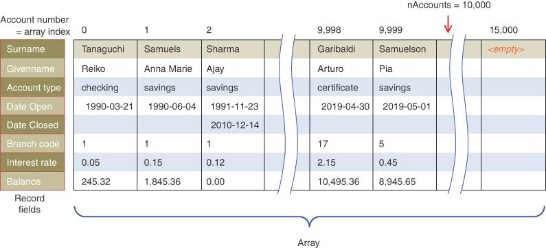

图 11-1 作为数组索引的帐号
如你所知，如果知道其索引号，访问指定的数组元素会非常快。查找支票从哪个帐户提取的职员知道它来自，比方说，72 号，所以他输入该号码，程序立即转到数组中的索引号 72。一个程序语句就足够了：

```python
accountRec = databaseArray[72]
```

添加一个新帐户也非常快：你将它插入到最后一个占用的元素之后。如果当前有 9,300 个帐户，则下一条新记录将放在单元格 9,300 中。同样，一条语句插入新记录：

```python
databaseArray[nAccounts] = newAccountRecord()
```

帐户数量的计数将像这样递增：

```python
nAccounts += 1
```

据推测，该数组比当前帐户数稍大一些，以便为扩展留出空间，但预计扩展不会太多，或者至少只需要不经常进行，例如每月一次。

### 并不总是那么有序

使用这种基于数组的数据库访问数据的速度和简单性使其极具吸引力。然而，这个例子之所以有效，只是因为键的组织非常好。它们按顺序从 0 运行到一个已知的最大值，这个最大值对于数组来说是一个合理的大小。没有删除，因此序列中不会出现浪费内存的间隙。可以在数组末尾顺序添加新项，并且数组不需要比当前项数大很多。

### 字典

在许多情况下，密钥并没有像刚才描述的银行帐户数据库中那样表现良好。典型的例子是字典。如果你想把英语词典的每一个词，从 a 到 zyzzyva（是的，它是一个词），放入你的计算机内存中以便快速访问它们，哈希表是一个不错的选择。
哈希表的一个类似的广泛应用是在计算机语言编译器中，它在哈希表中维护一个符号表（尽管有时使用平衡二叉树）。符号表包含程序员编写的所有变量和函数名称，以及它们在内存中的地址（或寄存器）。程序需要非常快速地访问这些名称，因此哈希表是首选的数据结构。
回到自然语言，假设你想在主内存中存储一个 50,000 词的英语词典。你希望每个单词在 50,000 个单元格数组中占据自己的单元格，这样你就可以使用索引号访问单词的记录（包括定义、词性、词源等）。这种方式访问起来很快，但是这些索引号和单词有什么关系呢？例如，给定单词 ambiguous，你如何找到它的索引号？

### 将单词转换为数字
你需要的是一个将单词转换为适当索引号的系统。首先，你知道计算机使用各种方案将单个字符表示为数字。一种这样的方案是 ASCII 码，其中 a 是 97，b 是 98，依此类推，直到 z 为 122。
扩展的 ASCII 代码从 0 到 255，以容纳大写字母、标点符号、重音符号、符号等。英文单词只有 26 个字母，所以让我们设计自己的代码，一种可以节省内存空间的更简单的代码。假设 a 为 1，b 为 2，c 为 3，依此类推直到 z 为 26。我们还假设一个空格——空格字符——是 0，所以我们有 27 个字符。 （本词典不使用大写字母、数字、标点符号和其他字符。）
我们如何将来自单个字母代码的数字组合成代表整个单词的数字？有各种各样的方法。我们将看看两个有代表性的，以及它们的优点和缺点。

### 添加数字

将单词转换为数字的一种简单方法可能是简单地为每个字符添加代码数字。假设你想将单词 elf 转换为数字。首先，你使用我们自制的代码将字符转换为数字：
$$
e = 5\ \ \ \ \ \	l = 12\ \ \ \ \  f = 6
$$

然后把它们相加：

```
5 + 12 + 6 = 23
```

因此，在你的字典中，单词 elf 将存储在索引为 23 的数组单元格中。所有其他英语单词同样会被分配一个由此过程计算的数组索引。
这种方法的效果如何？为了便于讨论，让我们限制在 10 个字母的单词上。然后（记住空格为 0），字典中的第一个单词 a 将被编码为

```python
0 + 0 + 0 + 0 + 0 + 0 + 0 + 0 + 0 + 1 = 1
```

字典中最后一个可能的词是 zzzzzzzzzz（10 个字母 z）。通过添加其字母获得的代码将是

```python
26 + 26 + 26 + 26 + 26 + 26 + 26 + 26 + 26 + 26 = 260
```

因此，单词代码的总范围是从 1 到 260（假设所有空格组成的字符串不是单词）。不幸的是，词典中有 50,000 个单词，因此没有足够的索引号可供查询。如果每个数组元素可以容纳大约 192 个单词（50,000 除以 260），那么你可能可以将它们全部放入，但是你如何区分一个数组元素中的 192 个单词？
显然，如果你考虑的是每个数组元素一个字的方案，那么这种编码会带来问题。也许你可以在每个数组元素处放置一个子数组或单词链接列表。不幸的是，这种方法会严重降低访问速度。访问数组元素会很快，但在 192 个单词中搜索你想要的单词可能会非常慢。
因此，将单词转换为数字的首次尝试还有待改进。太多的词具有相同的索引。当然，一个单词的任何变位词都会有相同的代码，因为字母的顺序不会改变值。另外，这些话

```python
acne       ago       aim       baked       cable       hack
```

还有许多其他单词的字母加起来等于 23，就像 elf 一样。对于代码较高的词，可能会有数百个其他匹配词。现在很明显，这种方法的区分度不够，因此生成的数组元素太少。我们需要扩展可能的指数范围。

### 乘以幂

让我们尝试一种不同的方式将单词映射到数字。如果数组之前太小，请确保它足够大。如果你创建一个数组，其中每个单词（实际上，每个潜在单词，从 a 到 zzzzzzzzzz）都保证占据其自己唯一的数组元素，会发生什么情况？
为此，你需要确保单词中的每个字符都以独特的方式对最终数字做出贡献。
你可以首先考虑使用数字而不是文字的类似情况。回想一下，在一个普通的多位数字中，每个数字位置代表的值是其右侧位置的 10 倍。因此 7,546 真正意味着

```python
7*1000 + 5*100 + 4*10 + 6*1
```

或者，将乘数写成 10 的幂：

7 \* 10^3^ + 5 \* 10^2^ + 4 \* 10^1^ + 6 \* 10^0^

在这个系统中，你将一个数字分解成它的数字，将它们乘以 10 的适当幂（因为有 10 个可能的数字），然后将乘积相加。如果这恰好是一个使用从 0 到 7 的数字的八进制数，那么你将得到 7*83 + 5*82 + 4*81 + 6*80。
以类似的方式，你可以将一个单词分解成它的字母，将字母转换成它们的等价数字，将它们乘以 27 的适当次方（因为有 27 个可能的字符，包括空格），然后将结果相加。这种方法为每个单词提供了一个唯一的编号。
让我们回到将单词 elf 转换为数字的示例。如前所述，你将数字转换为数字。然后将每个数字乘以 27 的适当次方并将结果相加：

5 \* 27^2^ + 12 \* 27^1^ + 6 \* 27^0^

计算幂给出

5*729 + 12*27 + 6*1

并将字母代码乘以幂产生

```python
3645 + 324 + 6
```

总和为 3,975。
这个过程确实为每个潜在的单词生成了一个唯一的数字。你刚刚计算了一个 3 个字母的单词。更大的词会怎样？不幸的是，数字的范围变得相当大。最大的 10 个字母的单词，zzzzzzzzzz，翻译成

```python
26*279 + 26*278 + 26*277 + 26*276 + 26*275 + 26*274 + 26*273 + 26*272 + 26*271 + 26*270
```

光是279，就超过了7000000000000，可见这个数字是巨大的。存储在内存中的数组不可能有这么多元素，除非在某些巨大的超级计算机中。就算装得下，用那么多内存来存一本只有五万字的字典也太浪费了。
问题是这个方案为每个潜在的单词分配了一个数组元素，无论它是否是一个实际的英语单词。因此，有一些单元格保留给 aaaaaaaaaa、aaaaaaaaab、aaaaaaaaac 等等，直到 zzzzzzzzzz。这些单元格中只有一小部分是真实单词所必需的，因此大多数数组单元格都是空的。这种情况如图 11-2 所示。在单词 elf 附近，将存储几个单词，例如 elk、eli（对于给定的名字 Eli）和 elm。红色箭头表示指向描述该词的记录的指针。在其他地方，例如鸟这个词周围，会有许多未使用的单元格，这些单元格没有指向其他结构的指针。

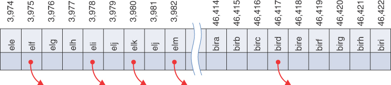

图 11-2 每个潜在词的索引
第一个方案——添加数字——生成的索引太少。这个最新的方案——将数字乘以 27 的幂相加——产生了太多。

### 哈希

我们需要的是一种方法，可以将从数字乘幂系统中获得的大量数字压缩到与合理大小的数组相匹配的范围内。
我们谈论的这本英语词典有多大数组？如果你只有 50,000 个单词，你可能会认为该数组应该包含大约这么多的元素。然而，最好有更多的细胞，而不是太少，这样你就可以争取两倍大小的阵列，即 100,000 个细胞。稍后我们将讨论将所需的最低数量增加一倍的好处。
因此，我们寻求一种方法将 0 到 7 万亿以上的范围压缩到 0 到 100,000 的范围内。一种简单的方法是使用模运算符 (%)，它可以在一个数除以另一个数时求余数。
为了了解这种方法的工作原理，让我们看一个更小、更容易理解的范围。假设你试图将 0 到 199 范围内的数字压缩到 0 到 9 范围内。大数字的范围是 200，而较小的范围只有 10。如果你想转换一个大数字（存储在一个变量中称为 largeNumber) 到较小的范围（并将其存储在变量 smallNumber 中），你可以使用以下赋值，其中 smallRange 的值为 10：

```python
smallNumber = largeNumber % smallRange
```

任何数除以 10 的余数总是在 0 到 9 之间； 例如，13 % 10 给出 3，而 157 % 10 给出 7。对于十进制数，它仅表示获取最后一位数字。 模运算将大范围压缩（或折叠）为较小范围，如图 11-3 所示。 在我们的玩具示例中，我们将 0-199 范围压缩到 0-9 范围内，这是 20 比 1 的压缩比。

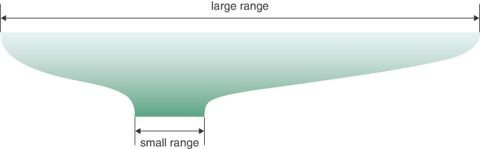

图 11-3 使用模的范围转换
可以使用类似的表达式将唯一表示每个英语单词的真正巨大的数字压缩为适合字典数组的索引号：

```python
arrayIndex = hugeNumber % arraySize
```

计算 hugeNumber 的函数是散列函数的一个示例。 它将字符串（或其他一些数据）散列（转换）为大范围内的数字。 对 arraySize 取模将数字映射到较小的范围内。 这个较小的范围是数组中索引号的范围。 插入哈希数据的数组称为哈希表。 特定键映射到的索引称为散列地址。 这个术语可能有点令人困惑。 我们使用术语哈希表来描述整个数据结构和其中包含项目的数组。
回顾一下：你可以将单词中的每个字母转换（或编码）为一个整数，然后根据它们在单词中的位置将它们乘以 27 的适当幂，从而将单词转换（或编码）为一个巨大的数字。 清单 11-1 显示了一些计算巨大数字的 Python 代码。
清单 11-1 将简单英语单词唯一编码为整数的函数

```python
def encode_letter(letter):  # Encode letters a thru z as 1 thru 26
    letter = letter.lower()  # Treat uppercase as lowercase
    return ord(letter) - ord("a") + 1 if "a" <= letter <= "z" else 0


def unique_encode_word_loop(word):  # Encode a word uniquely using
    return sum(
        encode_letter(word[i]) * 27 ** (len(word) - 1 - i) for i in range(len(word))
    )


def unique_encode_word(word):  # Encode a word uniquely (abbreviated)
    return sum(
        encode_letter(word[i]) * 27 ** (len(word) - 1 - i) for i in range(len(word))
    )
```

encode_letter() 函数接受一个字母，获取其小写版本，并检查它是否在"a"到"z"的范围内（含）。如果是，它会使用 Python 的内置 ord() 函数将字母转换为整数。此函数返回字符的 Unicode 值（也称为点），与英文字母的 ASCII 值相同。它返回字符相对于"a"字符的值，确保"a"返回值 1。对于"a"到"z"范围之外的字符，它返回 0。这意味着空格被编码为 0 ，以及不在范围内的所有其他 Unicode 字符。
要获得单词的唯一数字代码，你可以使用循环对每个字母的值求和。 unique_encode_word_loop() 函数使用索引 i 到其单词参数的字母中以提取每个字母，使用 encode_letter() 获取其编码值，将该值乘以适合其位置的 27 次幂，并将乘积添加到总计。对于索引为 len(word) - 1 的单词的最后一个字符，27 的幂应为 0。对于 len(word) - 2 处的倒数第二个字符，指数表达式将为 1。倒数第三个是指数 2，依此类推，直到单词中第一个字符（最左边）的指数 len(word) - 1。循环退出后，返回总数。
清单 11-1 还显示了一个计算完全相同的编码值的 unique_encode_word() 函数。然而，它使用更紧凑的语法和列表理解来计算它。 sum() 函数返回其参数的总和。列表（元组）理解为 sum() 提供参数。理解形式
序列变量的表达式

在 unique_encode_word() 函数中，i 被用作来自理解序列的索引变量（这是单词中字母的索引）。该表达式与循环版本中使用的表达式相同。
unique_encode_word() 函数是散列函数的一个示例。使用取模运算符 (%)，你可以将生成的巨大数字范围压缩到大约是你要存储的项目数量两倍的范围内。这将计算一个哈希地址：
单击此处查看代码图像

```数组大小 = 字数 * 2```
arrayIndex = unique_encode_word(word) % 数组大小
在巨大的范围内，每个数字代表一个潜在的数据项（字母排列），但这些数字中很少代表实际数据项（英文单词）。散列地址是从这些大数字到更小数组的索引号的映射。在这个数组中，你可以预期，平均而言，每两个单元格对应一个单词。有些单元格没有单词，有些单元格只有一个，而其他单元格可能不止一个。应该如何处理？

### 碰撞

我们为将大范围压缩为小范围付出了代价。不再保证两个词不会散列到同一个数组索引。
这类似于你在哈希方案是字母代码之和时看到的问题，但情况远没有那么糟糕。当你添加字母代码时，只有 260 个可能的数值（对于最多 10 个字母的单词）。现在你将代码分布到 100,000 个可能的数组单元格中。
不可能避免将几个不同的单词散列到同一个数组位置，至少偶尔是这样。计划是每个索引号有一个数据项，但事实证明这在大多数哈希表中是不可能的。你能做的最好的事情就是配置一些东西，这样就不会有太多的单词散列到同一个索引。
也许你想将单词 abductor 插入到数组中。你对单词进行散列以获得其索引号，但发现该编号处的单元格已被单词 bring 占用，而它恰好散列为完全相同的数字。这种情况如图 11-4 所示，称为冲突。 bring 一词的唯一代码为 1,424,122，通过对 100,000 取模将其转换为 24,122。 abductor 一词的唯一代码为 11,303,824,122，而 missable 的唯一代码为 139,754,124,122。他们三个都哈希到哈希表的索引 24,122。

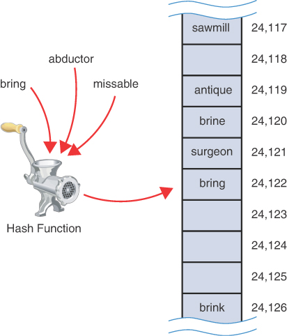

图 11-4 一次碰撞
稍微不同的词 brine 和 brink 散列到单元格附近的位置以供携带。原因是它们仅在最后一个字母上不同，并且该字母的代码乘以 270，即 1。其他单词也可以散列到相同的位置。

### 碰撞有多严重？

哈希函数是个好主意吗？通过"研磨机"运行字母串是否会产生某种有用的哈希值？碰撞的可能性似乎使该方案不切实际。这将有助于了解它们在设计应对策略时可能发生的频率。
通过回答一个经典问题可以看出一个相关的衡量标准：聚会中的两个人在什么时候更有可能同生同月？图 11-5 说明了这个概念。起初，这个想法似乎与哈希表无关。仔细观察，你可以将一年中的几天视为哈希表的单元格。结合日和月形成 366 个独特的索引。每个生日恰好落在其中一个。


图 11-5 在聚会中查找共同生日
如果聚会上只有几个人，他们不太可能有相同的出生月份和日期。如果有367个人，那么可以肯定的是，有些人的出生月日相同。在这些极端之间的某个地方，有一些人的月份和日期相同的可能性大于他们都不同的可能性。
也许直觉告诉你，如果你的人数是一年中天数的一半，那么同一出生月份和同一天的可能性会超过 50%。换句话说，如果有183个人，出生月份和日期相同的可能性更大。这种直觉是正确的，但它从低于 50% 变为高于 50% 的点是 23 人。有 22 个人，他们更有可能出生在不同的日子。该计算假设出生日期在一年中是随机分布的（事实并非如此）。当然，在生肖属相的聚会上，分布会大不相同！
因此，即使项目与哈希表单元格的比率小于 10%（366 个中的 23 个），发生冲突的可能性也大于 50%。这意味着你应该规划你的哈希表以始终处理冲突。你可以通过多种方式解决该问题。
我们已经提到了第一种技术：指定一个数组，其单元格数量至少是数据项数量的两倍。这意味着你希望一半的单元格为空。一种方法是，当发生冲突时，以某种系统的方式在数组中搜索空单元格并将新项插入到那里，而不是在散列地址指定的索引处。这种方法称为开放寻址。这有点像登上火车或地铁车厢；你在一个点进入并坐在最近的空位上。如果座位满了，你就继续穿过车厢，直到找到一个空座位。离你进入的门最近的座位类似于初始哈希地址。
回到将单词散列为数字，如果 abductor 散列为 24,122，但此位置已被 bring 占用，那么你可能会尝试在单元格 24,123 中插入 abductor，例如。当插入操作找到空单元格时，它会存储键及其关联值。这样，使用开放寻址的搜索操作可以将原始关键字与存储在表中的关键字进行比较，以确定搜索应该继续进行到什么程度。它还可以轻松检查空单元格，因为它们没有键值结构。
第二种方法（前面提到过）是创建一个数组，该数组包含对另一个数据结构（如单词链接列表）的引用，而不是单个单词的记录。然后，当发生冲突时，新项目将简单地插入列表中该索引处。这称为单独链接。
在本章的余下部分，我们讨论了开放寻址和分离链接，然后回到哈希函数的问题。
到目前为止，我们一直专注于散列字符串。实际上，许多哈希表用于存储字符串。按生日散列当然是可能的，但只在极少数情况下有用。许多其他哈希表以数字为键，例如银行帐号示例或信用卡号。在接下来的讨论中，我们使用数字而不是字符串作为键。这种方法使事情更容易理解并简化了编程示例。但是请记住，在许多情况下，这些数字将派生自字符串或字节序列。

## 开放寻址
在开放寻址中，当一个数据项不能放在哈希地址计算出的索引处时，就会在数组中寻找另一个位置。 我们探索了三种开放寻址方法，它们在用于查找下一个空单元格的方法上有所不同。 这些方法是线性探测、二次探测和双重散列。

### 线性探测

在线性探测中，算法按顺序搜索空单元格。 如果在尝试向其中插入数据项时单元格 5,421 已被占用，它将转到 5,422，然后是 5,423，依此类推，递增索引直到找到空单元格。 此操作称为线性探测，因为它沿着单元格的行按顺序进行。

### HashTableOpenAddressing 可视化工具

HashTableOpenAddressing 可视化工具演示了线性探测。 当你启动该工具时，你会看到如图 11-6 所示的屏幕。

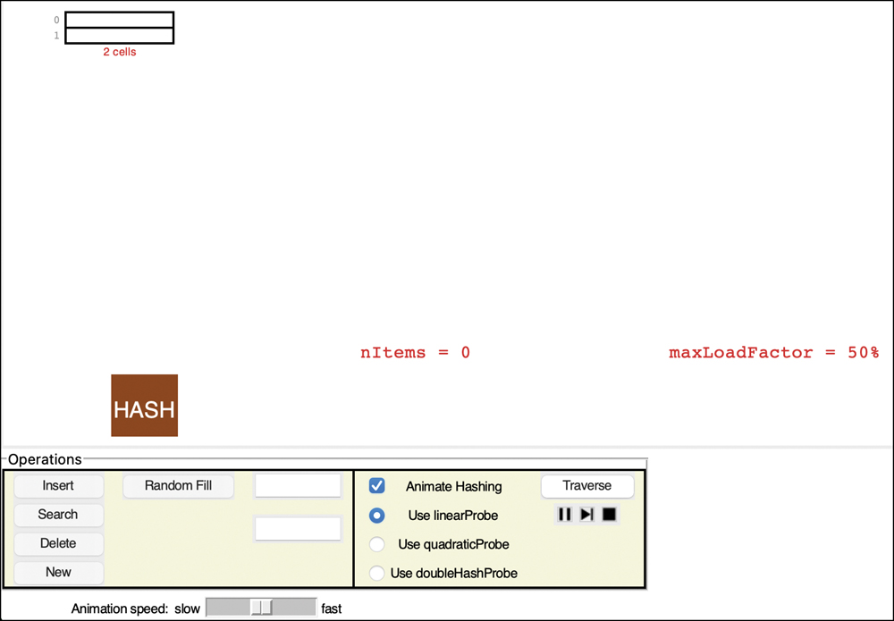

图 11-6 启动时的 HashTableOpenAddressing 可视化工具
在此工具中，键可以是数字或最多 8 位数字或字符的字符串。 数组的初始大小为 2。散列函数必须缩小键的范围以匹配数组大小。 正如你之前看到的，它使用模运算符 (%) 执行此操作：

```
arrayIndex = key % arraySize
```

对于 2 的初始数组大小，这是

```
arrayIndex = key % 2
```

这个散列函数很简单，所以你可以预测哪个单元格将被索引。如果你为其中一个操作提供数字键，则该键会对其自身进行哈希处理，并且模 2 操作会生成数组索引 0 或 1。对于字符串键（任何包含十进制数字以外的字符），它的行为类似于清单 11-1 中所示的 unique_encode_word() 函数。例如，键 cat 散列为 7627107，产生索引 1。键 bat 散列为少一，7627106，产生索引 0。
一个双单元哈希表显然不能容纳太多数据，很快你就会看到当它开始填满时会发生什么。单元格的数量显示在表格最后一个单元格的正下方，单元格索引显示在每个单元格的左侧。当前存储在哈希表中的项目数 nItems 显示在中间。
标有"HASH"的方框代表哈希函数。让我们看看它如何处理新键并用于查找数组索引。

### 插入按钮

要将一些数据放入哈希表中，请在顶部的文本输入框中键入一个键，例如 cat，然后选择 Insert。可视化工具显示了将字符串"cat"通过哈希函数传递以获得一个大整数的过程。使用表大小的模，它确定一个单元格索引并绘制一个箭头连接哈希结果到它，如图所示在图 11-7 中。箭头指向探测将开始寻找空单元格的位置。因为表最初是空的，所以第一个探测找到一个空单元格，插入操作通过将键复制到其中完成——连同一个代表一些关联数据的彩色背景——然后递增 nItems 值。

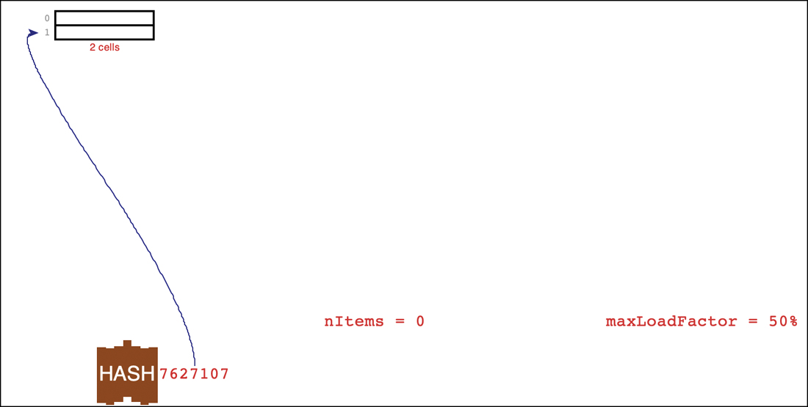

图 11-7 探测以将键 cat 插入空哈希表
插入的下一个项目可以显示碰撞中发生的情况。 插入密钥 eat 会导致散列地址为 7627109，它会探测单元 1，如图 11-8 所示。

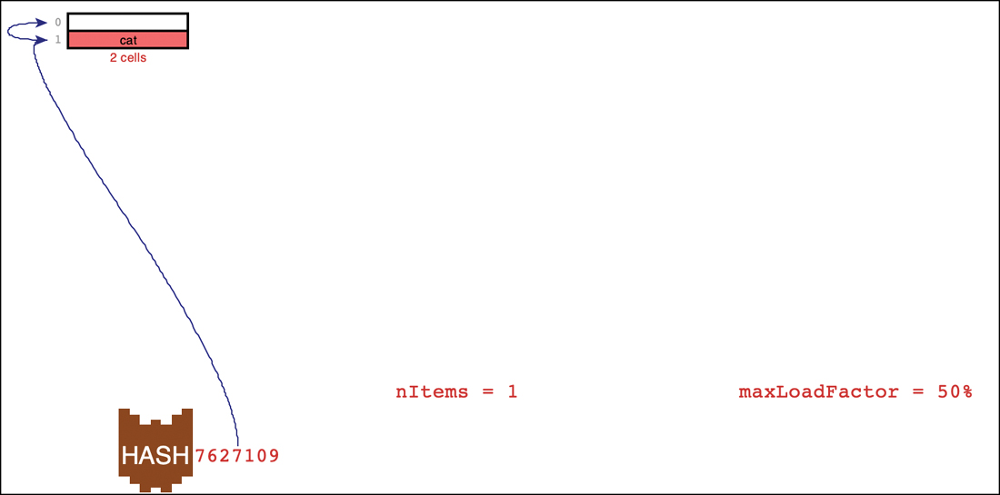

图 11-8 探测以插入钥匙
在发现单元格 1 被占用后，插入过程开始依次探测每个单元格（线性探测）以找到一个空单元格，如图 11-8 中的附加弯曲箭头所示。探测通常从索引 2 开始，但由于该索引超出了表的末尾，因此它绕回索引 0。因为单元格 0 是空的，所以键 eat 可以与其相关数据一起存储在那里。
将 nItems 值增加到 2 后，表现在已满。为了能够在未来添加更多项目，可视化工具会显示接下来会发生什么。分配了一个至少两倍大的新表。然后通过重新哈希将旧表中的项目重新插入到新表中。哈希函数没有改变，键也没有改变，所以看起来这些项目最终会处于相同的相对位置。但是，由于表的大小增加，模运算符会产生新的单元格索引。这次 cat 和 eat 键最终出现在单元格 3 和 5 中，如图 11-9 所示。

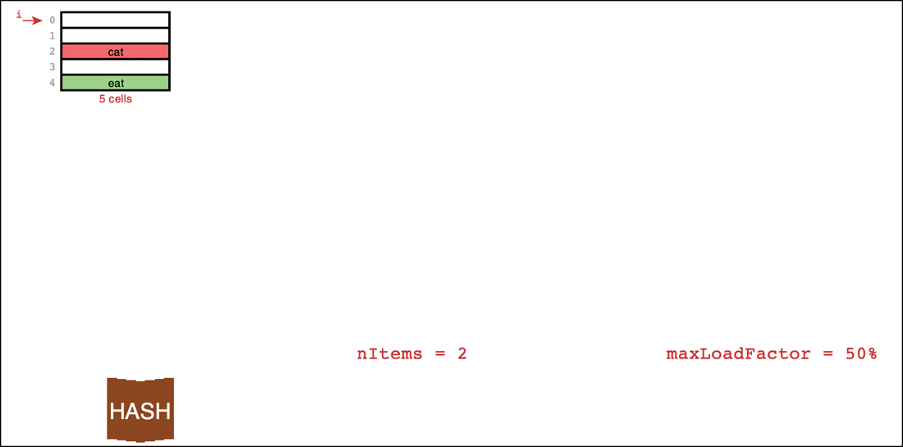

图 11-9 在空哈希表中插入 cat 和 eat 之后
我们将在后面的"增长哈希表"和"重新散列"部分中探讨这个过程的细节。首先，让我们进一步了解可视化工具和线性探测。

### 随机填充按钮

最初，哈希表开始为空并根据需要增长。要探索当较大的表格变得拥挤时会发生什么，你可以使用"随机填充"按钮用指定数量的数据项填充它们。尝试在文本输入框中输入 2 并选择随机填充。可视化工具生成两个随机字符串作为键，并动画化插入它们的过程。
动画过程需要一些时间，当你了解插入的工作原理时，最好直接跳到最终结果。如果取消选中标记为动画散列的按钮，则随机填充操作将执行所有没有动画的插入。同样，单项插入将跳过散列键的动画（但不会跳过之后发生的探测）。尝试禁用动画并再插入 11 个项目。你会看到随着表的增长，它分成多个列，如图 11-10 的例子所示。

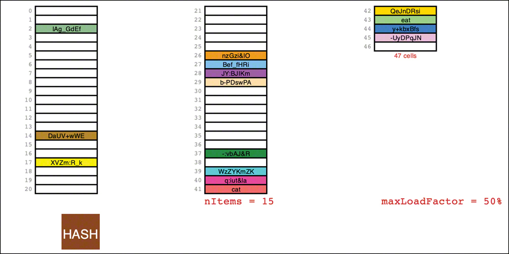

图 11-10 包含 15 个项目的哈希表

### 搜索按钮

要在哈希表中定位项目，你输入项目的键并选择搜索按钮。如果选中动画散列按钮，该工具会以动画形式将密钥字符串转换为大数字。表的探测从散列键确定的索引开始。如果它发现单元格已填充且键匹配，则键和表示其数据的颜色将复制到输出框中。
可视化工具通过在单击存储的密钥时将密钥复制到文本输入框来简化对随机生成的密钥和其他现有密钥的搜索。当键不在表中时，搜索行为会变得有点复杂。该工具使用一个专门处理数字键的散列函数：它们散列到它们的数值。尝试键入 3 作为键（或单击表中另一个空单元格的索引，如图 11-10 中所示）并选择"搜索"。初始探测落在一个空单元格上，该工具立即发现该项目不在表中。
现在尝试输入已填充单元格的索引，如图 11-10 中的 14。你也可以单击索引号，但要确保键是数字索引而不是存储在单元格中的字符串键。当你选择"搜索"时，可视化工具会显示转到所选索引的初始探测。发现单元格已满，但不包含所需的键，它开始线性探测以查看在插入项目时是否发生了碰撞。探测到的下一个空单元结束搜索。

### 填充序列和簇

正如你所预料的那样，一些哈希表的项在整个单元格中均匀分布，而另一些则不然。有时会有一系列空单元格，有时会有一系列填充单元格。在图 11-10 的示例中，填充的序列包括 4 个 1-item 序列、1 个 4-item 序列和 1 个 7-item 序列。
让我们将哈希表中的一系列填充单元格称为填充序列。随着你添加越来越多的项目，填充的序列会变得更长。这种现象称为集群，如图 11-11 所示。请注意，项目插入表中的顺序决定了键相对于其默认位置的放置距离。

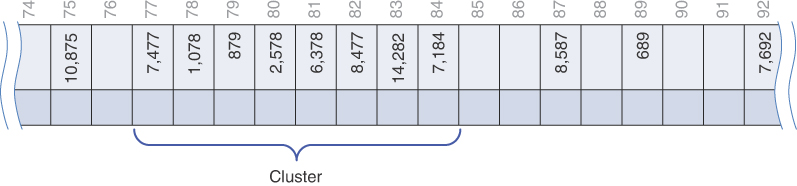

图 11-11 线性寻址中的聚类示例
当你搜索键时，第一个索引单元格可能已被具有其他键的数据项占用。这是一次碰撞；你会看到可视化工具添加了另一个指向下一个单元格的箭头。在处理冲突的同时找到合适的单元格的过程称为探测。
发生冲突后，哈希表的搜索算法简单地沿着数组逐步查找顺序中的每个单元格。如果它在找到目标键之前遇到一个空单元格，它就知道搜索失败了。进一步查找是没有用的，因为插入算法会在此单元格中插入项目（如果不是更早的话）。图 11-12 显示了简化哈希表中成功和不成功的线性探测。所谓简化，我们的意思是它使用键的最后两位作为表索引，这在实践中不是一个好主意。 （你稍后会明白为什么。）对键 6,378 的初始探测落在单元格 78。它探测下一个相邻的单元格，直到它在单元格 81 中找到匹配的键。对键 478 的搜索也从单元格 78 开始。探测 7 之后填充序列中的单元格，它会在索引 85 处找到一个空单元格，从而结束搜索。

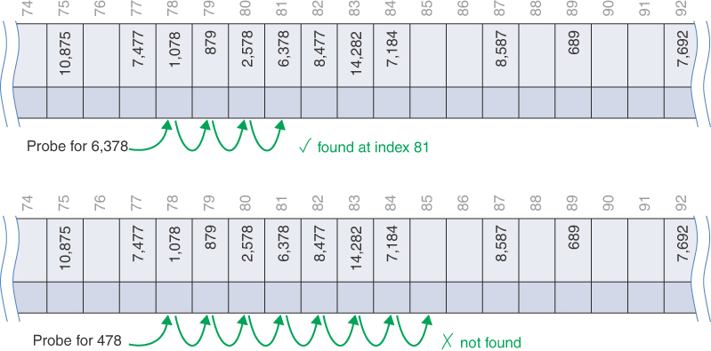

图 11-12 集群中的线性探头
尝试用填充序列进行试验。找到这样一个序列的起始索引，如图 11-10 中的索引 26。单击该索引将其复制到文本输入框中后，选择插入（而不是搜索）。插入算法必须逐步遍历所有已填充的单元格以找到下一个空单元格。插入后，如果你现在搜索相同的索引，则搜索必须重复相同的过程。

### 删除按钮

Delete 按钮删除其键由用户键入的项。删除不是通过简单地从单元格中删除数据项，将其留空来完成的。为什么不？我们稍后再看原因。现在，你可以看到该工具用显示中显示为 DELETED 的特殊键替换了已删除的项目。
插入按钮在第一个可用的空单元格或已删除的项目中插入一个新项目。搜索按钮将已删除的项目视为现有项目，以便进一步搜索另一个项目。
如果有很多删除，哈希表就会被这些伪造的数据项填满，这会降低它的效率。出于这个原因，一些开放寻址哈希表实现不允许删除。如果已实现，则应谨慎使用以避免大量未使用的内存。

### 允许重复？

你能允许在哈希表中使用具有重复键的数据项吗？可视化不允许重复，这是哈希表的典型行为。如前几章所述，这种方法将存储类型实现为关联数组，其中每个键最多只能有一个值。
允许重复键的替代方案会使事情复杂化。至少在某些情况下，这将需要重写搜索算法以查找具有相同键的所有项目，而不仅仅是第一个。这需要搜索所有填充的单元格序列，直到找到一个空单元格。探测整个填充序列会浪费所有表访问的时间，即使不存在重复项也是如此。删除项目将尝试删除特定键的第一个实例或所有实例。这两种情况都需要探测填充序列以找到重复项的范围，然后如果删除打开了一些单元格，则至少将序列中的一项移动到它们的默认位置。由于这些原因，你可能希望禁止重复或在需要时使用其他数据结构。

### 避免集群
尝试在 HashTableOpenAddressing 可视化工具中插入更多项。当表格达到 61 个单元格时，该工具将停止增长表格。随着表变得越来越满，集群变得越来越大。聚类会导致非常长的探测长度。这意味着访问序列中更深的单元格非常慢。
数组越满，聚类就越差。举个极端的例子，使用 Random Fill 按钮输入足够多的随机键，使键的总数为 60。现在尝试搜索一个不在表中的键。初始探测落在 61 单元阵列的某处，然后寻找剩余的单个空（或可能已删除）单元。如果你很不幸，初始探测是空单元格之后的单元格，则搜索可以遍历所有 61 个单元格。
当阵列满了一半时，集群通常不是问题，而当它满了三分之二时仍然不是太糟糕。然而，除此之外，随着集群变得越来越大，性能会严重下降。出于这个原因，在设计哈希表时确保它永远不会超过一半或最多三分之二是满的，这一点至关重要。我们将在本章末尾讨论哈希表的满度与探测长度之间的数学关系。
簇是在插入过程中创建的，但也会影响删除。当从哈希表中删除一个项目时，你最好将它的单元格标记为空，以便它可以再次用于以后的插入并分解潜在的集群。然而，这种简单的策略对于开放式寻址来说是一个问题，因为探测器会按照表中的一系列索引来定位项目，并在找到空单元格时停止。例如，如果删除恰好位于此类序列中间的项目，例如图 11-12 中的项目 879 或项目 2,578，则不会找到探测序列中稍后着陆的项目，例如项目 6,378通过后续搜索。当被删除的项目是多个探测序列的一部分时，丢失的项目尤其成问题。在示例中，项目 879 恰好在项目 6,378 的探测序列中，即使它们的序列从不同的表索引开始。
你可能认为有某种方法可以重新排列项目以填补因删除而造成的空缺。例如，如果你跟踪探测序列直到结束会怎样。你不能移动序列中的最后一项来填充被删除的单元格（有点像二叉搜索树中的后继节点替换已删除的节点）？不幸的是，序列中的最后一项可能是其键未散列到用于查找要删除的项的探测序列开头的项。例如，如果你要删除图 11-12 中的项目 1,078，按照它的探测序列一直到最后会建议项目 7,184 可以替换它，但这会导致该项目从其从单元格 84 开始的正常探测序列中丢失.
另一个想法：如果你发现删除探测序列中的最后一个项目与被删除的项目共享相同的起始单元格怎么办？这确保你只移动同一探测序列上的一个项目。不幸的是，这也会导致问题，因为它可能会在另一个探针序列中产生一个新的洞。如果其他一些探测序列碰巧落在被移动的项目上，那么该序列就会被破坏。你可以尝试找到任何序列，这些序列会访问保存正在移动的项目的单元格，因为它们跳过了碰撞，但可能会有很多很多这样的序列。就像汽车一样，碰撞后的清理是一个大问题。
如可视化工具所示，删除开放地址中项目的方法是简单地将单元格标记为已删除。然后，搜索算法可以在探测密钥时跳过已删除的单元格。插入算法也可以寻找空的或删除的单元格以用于新项目。这有助于保持簇的大小较小，但仅用于插入。在查找项目（用于搜索或删除）时，你仍然必须搜索过去已删除的单元格。它还会浪费内存，我们稍后会讨论。

### 用于开放寻址哈希表的 Python 代码

让我们看看哈希表中开放寻址的实现。除了一些更高级的散列函数外，它们的实现很简单。我们将创建一个类，在其中可以轻松更改哈希函数和探测技术来解决冲突。这种设计选择使探索不同的选项更加方便，但对性能来说并不是特别好。

#### 核心哈希表

哈希表对象必须维护一个数组来保存它存储的项目。该表应该是私有的，因为调用者不应该能够操作它的条目。那张桌子应该有多大？我们可以选择在构造函数中提供一个参数来设置大小，但与其他数据结构一样，如果需要更多单元格，允许它稍后扩展会很有用。
因为我们正在创建一个类来处理具有不同开放寻址探测器的哈希表，所以构造函数还需要一种方法来指定在发现冲突时要搜索的方法。清单 11-2 中的代码通过提供探测参数来处理该特性。探测器的默认值为 linearProbe，我们将对其进行简短描述。还有用于表的初始大小、哈希函数和 maxLoadFactor 的参数，稍后解释。
清单 11-2 核心 HashTable 类

```python
class HashTable(object):  # A hash table using open addressing
    def __init__(  # The constructor takes the initial
        self,
        size=7,  # size of the table,
        hash=simpleHash,  # a hashing function,
        probe=linearProbe,  # the open address probe sequence, and
        maxLoadFactor=0.5,
    ):  # the max load factor before growing
        self.__table = [None] * size  # Allocate empty hash table
        self.__nItems = 0  # Track the count of items in the table
        self.__hash = hash  # Store given hash function, probe
        self.__probe = probe  # sequence generator, and max load factor
        self.__maxLoadFactor = maxLoadFactor

    def __len__(self):  # The length of the hash table is the
        return self.__nItems  # number of cells that have items

    def cells(self):  # Get the size of the hash table in
        return len(self.__table)  # terms of the number of cells

    def hash(self, key):  # Use the hashing function to get the
        return self.__hash(key) % self.cells()  # default cell index
```

构造函数创建一个指定大小的私有 \_\_table。单元格中的初始 None 值表示它们是空的。存储项的计数 \_\_nItems 设置为零。插入项目时，它们会将 (key, value) 元组放置在表格的单元格中，使空单元格和完整单元格易于区分。所有其余的构造函数参数都存储在私有字段中供以后使用。
HashTable 定义了一个 \_\_len\_\_() 方法，这样 Python 的 len() 函数就可以在实例上使用来查找它们包含的项目数。一个单独的 cells() 方法返回表格中的单元格数，因此你可以通过将其与项目数进行比较来了解表格的填充程度。当它充满时，发生碰撞的可能性会增加。
清单 11-2 中显示的另一个核心方法是 hash() 方法。此方法用于将键散列到表索引中。我们允许调用者在构造函数中提供哈希函数。这可能是清单 11-1 中的 unique_encode_word() 函数或类似的东西。无论使用什么函数，它都应该从单个键参数返回一个整数。该整数与表中单元格数的模提供该键的初始表索引。这种设计允许调用者提供返回非常大整数的散列函数，然后将其映射到表中的单元格范围。

#### simpleHash() 函数

HashTable 的默认哈希函数是 simpleHash()，如清单 11-3 所示。此函数接受几种常见的 Python 数据类型，并从它们的内容中生成一个整数。它不是一个复杂的散列函数，但它用于展示如何创建此类函数来处理任意数据类型。
清单 11-3 simpleHash() 方法

```python
def simpleHash(key):  # A simple hashing function
    if isinstance(key, int):  # Integers hash to themselves
        return key
    elif isinstance(key, str):  # Strings are hashed by letters
        return sum(  # Multiply the code for each letter by
            256**i * ord(key[i])  # 256 to the power of its position
            for i in range(len(key))
        )  # in the string
    elif isinstance(key, (list, tuple)):  # For sequences,
        return sum(  # Multiply the simpleHash of each element
            256**i * simpleHash(key[i])  # by 256 to the power of its
            for i in range(len(key))
        )  # position in the sequence
    raise Exception(f"Unable to hash key of type {str(type(key))}")
```

#### search() 方法

search() 方法用于查找哈希表中的项目，导航过去的任何冲突。它通过调用内部 \_\_find() 方法来获取键的表索引来实现这一点，如清单 11-4 所示。最好将该方法保密，因为调用者不需要知道哪个单元格包含特定项目。
\_\_find() 方法返回一个单元格的整数索引，或者当它找不到要查找的键时可能返回 None 。 search() 方法查看返回的索引并在找不到键的情况下返回 None 。换句话说，如果 \_\_find() 返回的索引为 None 或者它指示的表格单元格包含 None，或者存储在该表格单元格中的键不等于要查找的键，则搜索键失败。唯一的另一种可能性是表格单元格的键与正在查找的键匹配，因此它返回单元格元组中的第二项，即与键关联的值。
常量 \_\_Deleted 的定义可能看起来有点不寻常。这是存储在已填充但后来删除的表格单元格中的值。这是一个标记值。通过在 Python 中使其成为元组，它具有唯一的引用地址，可以使用 is 运算符进行比较。在打开地址搜索期间，代码必须区分包含 None 的空单元格、包含 \_\_Deleted 的已删除单元格和完整单元格。 \_\_find() 方法（稍后描述）中的比较测试使用 is 运算符而不是 == 运算符将单元格内容与 \_\_Deleted 进行比较，以防某些应用程序决定存储同一元组的副本。 search() 方法不关心 \_\_find() 返回的单元格是空的还是已删除，但 insert() 方法关心，正如你很快就会看到的。另请注意，\_\_Deleted 标记的键 None 无法通过 simpleHash() 进行哈希处理。如果可以，则 search() 方法可能会返回已删除的标记值作为结果。
清单 11-4 HashTable 的 search() 和 \_\_find() 方法

```python
class HashTable(object):  # A hash table using open addressing
…
    def search(
        self, key  # Get the value associated with a key
    ):  # in the hash table, if any
        i = self.__find(key)  # Look for cell index matching key
        return (
            None
            if (i is None)
            or self.__table[i] is None  # If index not found,
            or self.__table[i][0]  # item at i is empty or
            != key  # it has another key, return
            else self.__table[i][1]
        )  # None, else return item value

    __Deleted = (None, "Deletion marker")  # Unique value for deletions

    def __find(
        self,  # Find the hash table index for a key
        key,  # using open addressing probes. Find
        deletedOK=False,
    ):  # deleted cells if asked
        return next(
            (
                i
                for i in self.__probe(self.hash(key), key, self.cells())
                if (
                    self.__table[i] is None
                    or (self.__table[i] is HashTable.__Deleted and deletedOK)
                    or self.__table[i][0] == key
                )
            ),
            None,
        )  # If we find an empty cell or  # a deleted  # cell when one is sought or the
```

\_\_find() 方法将搜索键作为参数，并带有一个可选的标志参数 deletedOK，指示是否可以在找到已删除的单元格后停止。该方法实现了开放寻址方案的核心。使用创建表时提供的哈希函数对密钥进行哈希处理。 hash() 方法（清单 11-2）被调用以将由 simpleHash() 或其他一些哈希函数计算的大整数映射到哈希表当前大小范围内的整数。该散列地址是为该项目探测表的单元格的起点。
调用 hash() 返回的哈希地址被传递给构造哈希表时给出的探测函数。循环

```python
for i in self.__probe(self.hash(key), key, self.cells()):
```

表明探测函数被用作生成器。换句话说，它必须创建一个遍历序列的迭代器。序列的元素是应该为项目探测的表格单元格索引。对 self.hash(key) 的调用返回第一个索引，键和单元格数量参数让生成器知道如何创建序列的其余部分。我们很快会看一下 linearProbe() 生成器定义，但首先让我们看一下 \_\_find() 方法的其余部分。
在 for 循环中，\_\_find() 检查单元格 i 的内容以查看存储在那里的内容。如果为 None，则单元格为空，可以返回 i 以指示该键不在表中。如果单元格不为空且具有匹配的键，则 \_\_find() 也可以返回 i 作为结果以指示找到该项目。唯一棘手的情况是，如果单元格已被标记为已删除，该怎么办。默认 (deletedOK=False) 是将其视为由碰撞引起的另一个填充单元格并继续探测序列。只有当调用者要求在删除的单元格上停止，并且单元格的值为 \_\_Deleted 标记时，\_\_find() 才会结束循环并返回。
当在单元格 i 中找到其他项目时，探测序列将继续。对于线性探测，在达到表中的单元格数后，它只是索引 i+1 或 0。如果完成整个探测序列而没有找到任何空单元格，则表中一定充满了不匹配或已删除的项目。在这种情况下，\_\_find() 返回 None。

#### 插入方法

在表中插入项目的过程遵循与搜索相同的方案，并添加了一些曲折来处理不断增加的项目。清单 11-5 显示了 insert() 方法通过在要插入的项的键上调用 \_\_find() 来获取单元格 i 的索引。使用 deletedOK=True 进行调用以允许查找已删除的单元格，insert() 将填充这些单元格。
对 i 的第一个测试检查它是否为 None，表示探测序列在未找到密钥、空单元格或已删除单元格的情况下结束。在这种情况下，要么表格已满，要么探测序列未能找到任何可用的单元格。 insert() 方法为此引发了一个异常。对于这种情况，该方法可以尝试增加表的大小，但如果探测序列有问题，增加表的大小可能只会让事情变得更糟。
下一个测试检查单元格 i 是否为空或已删除。在这些情况下，内容可以替换为 (key, value) 元组以将项目存储在单元格中。这样做会向表中添加一个新项目，并且 insert() 方法会增加项目字段的数量。这种增加可能会使桌子满了或几乎满了。为了减少冲突问题，该方法应该在项目数量超过某个阈值时增加表的大小。
应该使用什么阈值？绝对数字没有意义，因为当超过它时，桌子可能会再次变满。相反，最好查看加载因子，即已满表格单元格的比率（或百分比）。 load_factor() 方法计算值，该值始终是 0.0 到 1.0 范围内的数字。通过将负载因子与构建哈希表时指定的 maxLoadFactor 进行比较，我们可以使用一个无论哈希表增长到多大都有效的阈值。我们很快就会检查 \_\_growTable() 方法。
清单 11-5 insert() 和 \_\_growTable() 方法

```python
class HashTable(object):  # A hash table using open addressing
…
    def insert(
        self, key, value  # Insert or update the value associated
    ):  # with a given key
        i = self.__find(  # Look for cell index matching key or an
            key, deletedOK=True
        )  # empty or deleted cell
        if i is None:  # If the probe sequence fails,
            raise Exception(  # then the hash table is full
                "Hash table probe sequence failed on insert"
            )
        if (
            self.__table[i] is None
            or self.__table[i] is HashTable.__Deleted  # If we found an empty cell, or
        ):  # a deleted cell
            self.__table[i] = (  # then insert the new item there
                key,
                value,
            )  # as a key-value pair
            self.__nItems += 1  # and increment the item count
            if self.loadFactor() > self.__maxLoadFactor:  # When load
                self.__growTable()  # factor exceeds limit, grow table
            return True  # Return flag to indicate item inserted

        if self.__table[i][0] == key:  # If first of tuple matches key,
            self.__table[i] = (key, value)  # then update item
            return False  # Return flag to indicate update

    def loadFactor(self):  # Get the load factor for the hash table
        return self.__nItems / len(self.__table)

    def __growTable(self):  # Grow the table to accommodate more items
        oldTable = self.__table  # Save old table
        size = len(oldTable) * 2 + 1  # Make new table at least 2 times
        while not is_prime(size):  # bigger and a prime number of cells
            size += 2  # Only consider odd sizes
        self.__table = [None] * size  # Allocate new table
        self.__nItems = 0  # Note that it is empty
        for i in range(len(oldTable)):  # Loop through old cells and
            if (
                oldTable[i]
                and oldTable[i]  # insert non-deleted items by re-hashing
                is not HashTable.__Deleted
            ):
                self.insert(*oldTable[i])  # Call with (key, value) tuple
```

当一个空的或删除的单元格被填充时， insert() 方法通过返回 True 来完成。该值向调用者指示另一个单元格已满。另一种方法是，当哈希表已经具有与要插入的键关联的值时，用新值替换或更新该值。 insert() 方法的最后一个 if 子句返回 False 以指示插入没有填充未使用的单元格。

#### 不断增长的哈希表

清单 11-5 中的 \_\_growTable() 方法增加了包含单元格的数组的大小。我们在第 2 章"数组"的一个编程项目中探索了增长数组，对于哈希表，这个过程稍微复杂一些。首先，让我们看看它应该增长多少。我们可以添加固定数量的细胞或将细胞数量乘以某个生长因子。添加少量固定数量的单元将使未使用的单元数保持在最低限度。乘以，比如 2，最初会创建大量未使用的单元格，但这意味着增长操作将执行更少的次数。
要查看增长方法的区别，我们假设使用哈希表的应用程序选择从一个包含五个单元格的小型哈希表开始，并且它必须存储 100,000 个键值对。如果选择将表格增加五个单元格或每增加一步将其大小加倍，则需要多少步？表 11-1 显示了两种方法增加表大小的步骤。
表 11-1 以固定增量和双倍增长表

| 固定规模增长 |            | 规模增长翻倍 |          |
| :----------: | :--------: | :----------: | :------: |
|     步骤     |    尺寸    |     步骤     |   尺寸   |
|      0       |     5      |      0       |    5     |
|      1       |     10     |      1       |    10    |
|      2       |     15     |      2       |    20    |
|      3       |     20     |      3       |    40    |
|      4       |     25     |      4       |    80    |
|     ...      |            |     ...      |          |
|      N       | 5 * (N +1) |      N       | 5 * 2^N^ |
|     ...      |            |     ...      |          |
|      14      |     75     |      14      |  81920   |
|      15      |     80     |      15      |  163840  |
|     ...      |            |     ...      |          |
|    19998     |   99995    |              |          |
|    19999     |   100000   |              |          |

固定大小的增长需要 20,000 步才能达到所需的 100,000 个细胞。当大小每一步都翻倍时，第 16 步达到 100,000 的容量。正如你之前看到的，这就是 O(N) 和 O(log N) 步骤之间的区别。减少生长步骤的数量很重要，因为阵列生长后必须完成的工作。然而，在我们看这个之前，还有另一个选择新数组大小的因素。
清单 11-5 中的 \_\_growTable() 方法首先将 oldTable 设置为引用当前哈希表，并估计下一个表的大小是旧大小的两倍加一。然后它开始一个循环，找到第一个等于或超过该大小的素数。为什么？这是因为质数对于使用模运算符的算法具有特殊的重要性。当你选择一个质数作为大小时，只有该质数的倍数散列到单元格 0。类似地，只有该质数的倍数加上一个散列到单元格 1。如果要插入到哈希表中的键没有那个素数作为一个因素，它们倾向于散列整个单元格范围。这是非常理想的行为，稍后你将看到。
素数测试 is_prime() 不是标准 Python 的一部分。这个（看似简单的）测试有许多已发布的算法，所以我们不在这里展示。

#### 重新散列

在确定哈希表的新大小后，清单 11-5 中的 \_\_growTable() 方法创建新数组并将项目数设置回零。这可能看起来很奇怪；为什么此时我们需要一个空的哈希表？原因是oldTable中的键值对需要存储到新表中，但是在新的位置，而且还没有一个到位。如果你只是将 oldTable 中某个单元格的内容复制到新数组中具有相同索引的单元格，则 \_\_find() 方法可能找不到它。新的数组大小会影响算法开始搜索的位置，因为它用于计算哈希地址的模运算。例如，在图 11-12 中，针对键 6,378 的线性探测从单元格 78 开始，由于碰撞最终在单元格 81 中找到了该项目。那是阵列大小为 100 时的情况。如果阵列大小为 200，则线性探头将从单元格 178（6,378 模 200）开始。仅当有一个大集群从 178 延伸到单元格 199，然后从 0 到 78 环绕时，将该项存储在新表的单元格 78 处才有效。
必须重新插入键值对，而不是复制，这个过程称为重新散列，以确保正确放置。插入过程将它们分配到它们的新单元格中，可能会导致碰撞，但可能比较小阵列中发生的碰撞更少。清单 11-5 中的 \_\_growTable() 方法遍历较小数组中的所有单元格，并重新插入任何已填充的单元格，而不仅仅是删除的单元格标记。此操作可能非常耗时，并且它必须使用 range(len(oldTable)) 迭代器扫描所有单元格，而不仅仅是已知要填充的 \_\_nItems。
一个实现注意事项：self.insert(\*oldTable[i]) 表达式中的星号告诉 Python 获取存储在 oldTable[i] 中的元组并将其两个组件用作调用 insert() 时的两个参数，它们是键和值。星号 (\*) 在大多数情况下表示乘法，但当它位于函数调用的参数或任何元组的元素之前时具有不同的含义。

#### linearProbe() 生成器

让我们回到插入过程中探测空单元格的部分。清单 11-4 中的 \_\_find() 方法有一个循环形式

```python
for i in self.__probe(self.hash(key), key, self.cells()):
```

这是调用对象的 \_\_probe 属性以生成要检查的索引序列的地方。 \_\_probe 属性的默认值是 linearProbe()，如清单 11-6 所示。
清单 11-6 用于开放寻址的 linearProbe() 生成器

```python
def linearProbe(  # Generator to probe linearly from a
    start, key, size
):  # starting cell through all other cells
    for i in range(size):  # Loop over all possible increments
        yield (start + i) % size  # and wrap around after end of table
```

linearProbe() 是一个简单的生成器，其行为类似于 Python 的 range() 生成器。事实上，它在一个内部循环中使用 range()，该循环将变量 i 步进通过表的所有大小的单元格。 i 索引被添加到探测的起始索引，因此它将检查数组中的所有后续单元格。当该偏移索引超过表的末尾时，迭代器通过使用偏移索引与大小的模数将索引回零。新索引将始终介于零和比大小小一之间。
循环体中的 yield 语句将新索引发送回 \_\_find() 方法进行检查（清单 11-4）。请记住，yield 语句向调用者返回一个值和控制权。然后调用者在自己的循环中使用这个值，直到从迭代器中获取下一个值。然后控制权在 yield 语句之后立即返回给迭代器。在这种情况下，linearProbe() 继续并递增它自己的 i 变量。
当 linearProbe() 完成遍历数组的所有索引时，生成器结束（通过引发 StopIteration 异常）。这向调用者 \_\_find() 发出信号，表明所有单元格都已被探测到。如果 insert() 方法在线性探测序列完成之前未找到空单元格，则表格必须已满。
请注意，linearProbe() 迭代器不使用目标键来确定索引序列。我们将很快讨论。

#### delete() 方法

对于哈希表，删除项很简单，因为你只需要标记已删除的单元格。与插入一样，delete() 方法首先使用 \_\_find() 方法查找包含要删除的项目的单元格，如清单 11-7 所示。在单元格索引 i 确定后，行为取决于存储在单元格中的内容。如果 __find() 无法发现该单元格，或者它已经包含一个已删除的元素或一些其键不匹配的其他项目，则可能会发现错误。此 delete() 方法有一个可选参数 ignoreMissing，它确定是否应引发异常。一般来说，存储和检索数据的数据结构应该在调用者试图删除不在存储中的项目时引发异常，但在某些情况下可以安全地忽略此类错误。
清单 11-7 HashTable 的 delete() 方法

```python
class HashTable(object):  # A hash table using open addressing
…
    def delete(
        self,  # Delete an item identified by its key
        key,  # from the hash table. Raise an exception
        ignoreMissing=False,
    ):  # if not ignoring missing keys
        i = self.__find(key)  # Look for cell index matching key
        if (
            i is None
            or self.__table[i] is None  # If the probe sequence fails or
            or self.__table[i][0] != key  # cell i is empty or
        ):  # it's not the item to delete,
            if ignoreMissing:  # then item was not found. Ignore it
                return  # if so directed
            raise Exception(f"Cannot delete key {key} not found in hash table")

        self.__table[i] = HashTable.__Deleted  # Mark table cell deleted
        self.__nItems -= 1  # Reduce count of items
```

当 delete() 方法找到具有匹配键的单元格时，它会使用为该类定义的特殊 \_\_Deleted 标记来标记该单元格，并减少存储项的数量。 通常，当许多删除导致负载因子缩小到用于确定何时增长表的阈值以下时，不会尝试调整哈希表的大小。 跳过调整大小操作基于两个假设：与插入和搜索相比，删除发生的频率要低得多，并且必须重新散列存储在表中的所有项目的成本。

#### traverse() 方法

要遍历哈希表中的所有项目，必须访问所有表单元格以确定哪些单元格被填充。 该过程很容易作为生成器实现。 一个特殊的考虑是不应产生已删除的项目。 清单 11-8 显示了实现。
清单 11-8 HashTable 的 traverse() 方法

```python
class HashTable(object):  # A hash table using open addressing
…
    def traverse(self):  # Traverse the key, value pairs in table
        for i in range(len(self.__table)):  # Loop through all cells
            if (
                self.__table[i]
                and self.__table[i]  # For those that contain undeleted
                is not HashTable.__Deleted
            ):  # items
                yield self.__table[i]  # yield them to caller
```

因为实现将键值对存储为（不可变的）Python 元组，所以它们可以直接生成给调用者，调用者可以将它们分配给循环中的两个变量，例如

```python
for key, value in hashTable.traverse():
```

或者，调用者可以使用单个循环变量将对作为元组保存。

#### 遍历和新按钮

返回可视化工具，遍历按钮启动前面的循环。每个项目的密钥都打印在一个框中（忽略其数据并添加一个逗号来分隔密钥）。它说明了 traverse() 迭代器跳过空的和已删除的单元格。
你可以使用"新建"按钮创建新的空哈希表。此按钮有两个参数：初始单元格的数量和最大加载因子。你可以指定 1 到 61 个单元格的起始大小和 0.2 到 1 的最大加载因子。当提供无效参数时，将使用默认值 2 和 0.5。
如果你创建具有非质数大小的哈希表，它们将使用清单 11-5 中的 __growTable() 方法增长，将新大小设置为质数。尝试逐步完成重新散列过程的动画。此动画显示项目如何移动到它们的新单元格。
如果你想查看使用不同表格大小的效果，请尝试使用"新建"按钮创建一个具有所需大小且最大加载因子为 0.99 的表格。该表在完全填满之前不会增长，因此你可以看到不同表大小和集群的影响。

### 二次探测

使用开放寻址，哈希表可以找到空的（和删除的）单元格来填充新值，但可以形成簇。随着集群规模的增长，新项目更有可能散列到集群内的单元格中。线性探针遍历集群并将新项目添加到末尾，使其更大，可能加入两个集群。
这种行为有点像汽车驶入高速公路。如果只有孤立的车辆构成高速公路交通流，那么到达的车辆就有很多空隙可以容纳。当高速公路拥挤时，更长的车辆链形成集群。新到达的车辆等待集群通过并在最后加入，从而增加了集群的大小。希望到达的车辆在"探测"高速公路上的空地时不会引起现实世界的碰撞。
形成集群的可能性和集群的大小取决于哈希表中的项目数与其大小的比率——它的负载因子。即使负载因子不高，也可以形成集群，尤其是当哈希函数没有在表上均匀分布键时。哈希表的一部分可能由大簇组成，而其他部分则人口稀少。集群会降低性能。
二次探测是一种防止集群形成的尝试。这个想法是探测更广泛分离的单元而不是那些与主要哈希站点相邻的单元。
步数是步数的平方
在线性探测中，如果主哈希索引是 x，则后续探测将转到 x + 1、x + 2、x + 3，依此类推。在二次探测中，后续探测会到达 x + 1、x + 4、x + 9、x + 16、x + 25 等。与初始探针的距离是步数的平方：x + 1^2^、x + 2^2^、x + 3^2^、x + 4^2^、x + 5^2^，依此类推。图 11-13 显示了一些二次探针。

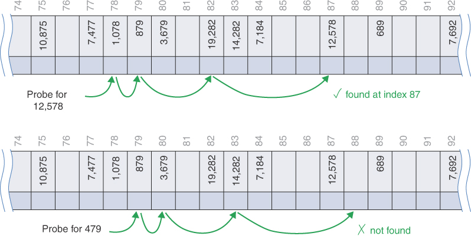

图 11-13 二次探测
二次探头的开始与线性探头相同。当初始探测落在不匹配的键上时，它会选择相邻的单元格。如果那个被占用，它可能在一个小集群中，所以它会尝试四个单元格外的东西。如果那个被占用，集群可能会更大一些，所以它会尝试九个单元格。如果它被占用，它就会真正开始大步前进并跳到 16 个单元格之外。很快，它将超过数组的长度，尽管由于模运算符它总是环绕。

#### 在开放寻址可视化工具中使用二次探测

HashTableOpenAddressing 可视化工具可以演示不同类型的冲突处理——线性探测、二次探测和双重哈希。 （我们将在下一节中查看双重散列。）只要表为空，你就可以通过选择三个单选按钮之一来选择探测方法。当表格有一个或多个项目时，按钮将被禁用以保持数据的完整性。
要查看实际的二次探测，请尝试以下操作。使用"新建"按钮创建一个包含 21 个单元格且最大加载因子为 0.9 的哈希表。选择使用 quadraticProbe 按钮切换到二次探测。然后使用 Random Fill 按钮在表中插入 12 个随机键。此操作会生成一个包含各种填充序列的表格，如图 11-14 所示。有一个六单元填充序列以及几个较短的序列。

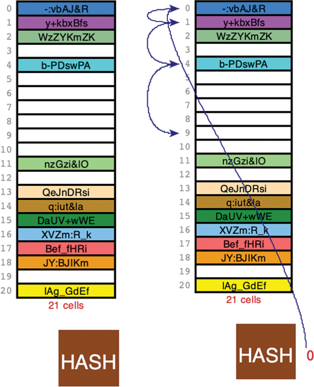

图 11-14 HashTableOpenAddressing 可视化工具中的二次探测
在此示例中，尝试插入键 0。因为它是一个数字键，所以哈希值为 0，并且第一个探测到单元格 0。在找到单元格 0 已满后，它将尝试插入 0 + 1 处的单元格。该单元格已被占用，所以它继续到单元格 0 + 4，找到另一个存储的项目。当它到达 0 + 9 时，它发现单元格 9 是空的，可以在那里插入键 0。很容易看出二次探针如何越来越远地展开。
如果你接下来尝试插入密钥 21，它将再次散列到单元格 0 以进行初始探测，因为该表有 21 个单元格。现在插入将重复与键 0 相同的一组探测，然后继续定位一个空单元格。或许令人惊讶的是，它在探测期间重新访问了一些相同的单元格，如图 11-15 所示。

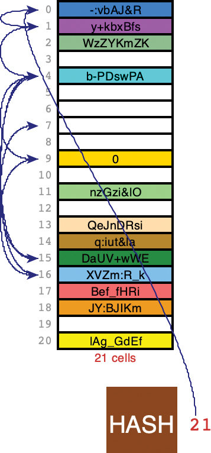

图 11-15 通过二次方探测相对完整的哈希表插入键 21
具体来说，探测插入key 21的cells是0,1,4,9,16,(25)4,(36)15,(49)7。括号中的索引是对21取模前的值。
这个例子特别麻烦。它不仅必须探测所有被探测到的单元格以插入密钥 1，而且它还会在单元格 4 处重复探测，而使用线性探测则不会发生这种情况。如果你继续插入更多的键，你会看到当表快满时这种行为会变得更糟。将最大加载因子设置为 0.9 时，在插入第 19 个键之前，表不会增长。
顺便说一句，如果你尝试将哈希表填充到它支持的最多 61 个项目或具有非常高的最大加载因子，则可视化工具可能无法插入项目，即使保留空单元格也是如此。该程序在放弃之前只尝试了 61 次探测（或者无论当前表的大小是多少）。因为二次探针可以重新访问相同的单元格，所以序列可能永远不会落在剩余的几个空单元格之一上。
当表快满时也尝试一些搜索，包括现有的键和不在表中的键。在某些情况下，探针序列会变得很长。
实施二次探针很简单。清单 11-9 显示了 quadraticProbe() 生成器。与清单 11-6 中所示的 linearProbe() 一样，它使用 range() 遍历所有可能的单元格一次。循环变量 i 被平方，添加到起始索引，然后使用模运算符映射到可能的索引。因为 i 从零开始，所以第一个产生的索引是起始索引。
清单 11-9 用于开放寻址的 quadraticProbe() 生成器

```python
def quadraticProbe(  # Generator to probe quadratically from a
    start, key, size
):  # starting cell through all other cells
    for i in range(size):  # Loop over all possible cells
        yield (start + i**2) % size  # Use quadratic increments
```

#### 二次探针的问题
二次探针减少了线性探针的聚类问题，这被称为初级聚类。然而，二次探测存在不同且更微妙的问题。出现这些问题是因为所有探测序列都遵循相同的模式来尝试找到可用的单元格。
假设 184、302、420 和 544 都散列到地址 7 并按此顺序插入。然后 302 将需要一个单元偏移，420 将需要四个单元偏移，而 544 将需要从第一个探头开始的九个单元偏移。每个具有散列为 7 的键的附加项目都将需要更长的探测时间。尽管单元格在哈希表中不相邻，但它们仍然会导致冲突。这种现象称为二次聚类。
二级集群不是一个严重的问题。它发生在任何将许多键放置在同一个初始单元格或多个单元格中的哈希函数中，这些单元格恰好与其他填充单元格相距一个平方数。然而，还有另一个问题，那就是探测序列访问的单元格的覆盖范围。
二次探针不断地进行越来越大的步骤。这些步骤与用于将索引映射到可用单元格的模运算符之间存在意外交互。在线性探头中，索引总是递增 1。这意味着线性探测将在绕过最后一个索引后最终访问哈希表中的每个单元格。
在二次探测中，增加的步长意味着它最终只访问了大约一半的单元格。图 11-15 中的示例在重新访问单元格 4 时说明了问题的一部分。这种行为的原因需要一些数学来解释。
如果你查看探测到的单元格之间的间距，你会发现它在每一步都增加了两倍。 x + 1 和 x + 4 之间的间距为三。 x + 4 和 x + 9 之间的间距为五。 x + 9 和 x + 16 之间的间距为七，依此类推。它已经看起来好像它可能会跳过所有其他单元格，因为如果初始探测是针对偶数单元格（反之亦然），它将停留在奇数单元格上。实际上并非如此，因为当索引超过模值时，模运算符将在奇数和偶数单元格之间变化。该值通常是质数，因此是奇数。
然而，即使有素数的细胞，二次探针也会相当快地开始重复相同的细胞索引序列。这是一个基本的例子。为简单起见，假设哈希表中有七个单元格，并且存储初始哈希值到单元格索引 0 的键。二次探测然后访问索引 1、4、9、16、25、36、49、64 等.然而，在对七取模后，完整序列为 0、1、4、2、2、4、1、0、1、4、2、2、4、1、0 等。 0, 1, 4, 2, 2, 4, 1 序列永远重复，遗漏单元格索引 3、5 和 6。
三个细胞可能看起来不多，但它们是总共七个细胞中的三个。更糟糕的是，探测器会两次重新访问索引 1、2 和 4。因为在七探测序列中已经访问过它们，所以它们一定已经被占用，所以重新访问它们只会浪费时间（比图 11-15 中的示例中的单个单元格重新访问的时间要多得多）。随着单元格的素数变大，重复行为会继续。在二次项增长到表大小的平方后，序列返回到起始索引。最终，大约一半的细胞被访问，一半没有。
因此，线性探测最终导致初级聚类，而二次探测最终导致次级聚类，并且只有哈希表覆盖的一半。没有使用这种方法，因为有更好的解决方案。

### 双重散列

为了消除二级聚类和一级聚类并帮助哈希表覆盖，还有另一种方法：双重哈希。任何为每个键生成相同探测序列的算法都会发生二次聚类。
我们需要的是每个键不同的探测序列，而不是每个键都相同。然后，散列到同一索引的具有不同键的数字将使用不同的探测序列。
双重散列方法使用不同的方法对密钥进行第二次散列，并将结果用作步长。对于给定的键，步长在整个探测过程中保持不变，但对于不同的键是不同的。只要步长不是数组大小的倍数，它最终会访问所有的单元格。这就是素数适合数组大小的原因之一；它们使避免获得均匀划分数组大小的步长变得更容易。
经验表明，这个二级哈希函数必须具有某些特征：

- 它不能与主哈希函数相同。
- 它绝不能输出 0（否则，不会有任何步骤；每个探测器都会落在同一个单元格上）。

专家们发现以下形式的函数效果很好：

```python
stepSize = constant - (key % constant)
```

其中常量是素数且小于数组大小。 例如，

```python
stepSize = 5 - (key % 5)
```

HashTableOpenAddressing Visualization 工具将这种方法用于其双重哈希探测。 不同的键可能散列到同一个索引，但它们（很可能）会生成不同的步长。 使用此算法且常数 = 5，步长都在 1 到 5 的范围内。两个示例如图 11-16 所示。 对键 4,678 的第一次搜索从单元格 78 开始。辅助哈希函数确定该键的步长为三。 在探测了三个填充的单元格之后，该函数在第四步找到了所需的键。 第二次搜索是针对密钥 178 并从同一单元格开始。 然而，对于这个键，步长被确定为四。 在探测到两个已填充的单元格后，该函数在第三步找到一个空单元格。

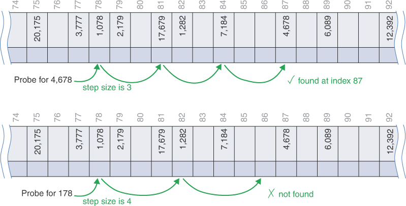

图 11-16 双重散列
实施双重散列仅比线性或二次探测稍微复杂一点。你仍然需要一个循环遍历可能索引的生成器，但这次你需要应用辅助哈希函数来获取步长。该步长应小于或等于数组大小以下的素数。清单 11-10 显示了该生成器的实现。
doubleHashProbe() 生成器首先立即生成折叠在可能的单元格范围内的第一个单元格索引。这与线性和二次探针中的方法略有不同。原因：如果第一个单元格最终成为所需的单元格，则无需确定步长。与其他探测器一样，它不需要知道调用者寻找的是空单元格还是已满单元格。如果调用者找到可接受的单元格，它将通过生成器序列退出其循环，跳过步长的计算。如果循环继续，则生成器调用 doubleHashStep() 来计算步长。该值在类似于线性和二次探头的循环中使用。不同之处在于，它从添加到起始索引的步长的 1 倍开始，并继续遍历所有可能的单元格。
doubleHashStep() 函数计算给定键的步长。首先，它通过调用 primeBelow() 获取小于数组大小的最大素数。接下来，它将哈希函数 simpleHash() 重新应用于密钥（尽管在这里使用不同的哈希函数会更好）。它产生的大整数使用模运算符映射到较小素数的范围。从质数中减去余数，使步长落在 [1, 质数] 范围内。
清单 11-10 用于开放寻址的 doubleHashProbe() 生成器

```python
def doubleHashProbe(  # Generator to determine probe interval
    start, key, size
):  # from a secondary hash of the key
    yield start % size  # Yield the first cell index
    step = doubleHashStep(key, size)  # Get the step size for this key
    for i in range(1, size):  # Loop over all remaining cells using
        yield (start + i * step) % size  # step from second hash of key


def doubleHashStep(key, size):  # Determine step size for a given key
    prime = primeBelow(size)  # Find largest prime below array size
    return prime - (  # Step size is based on second hash and
        simpleHash(key) % prime
    )  # is in range [1, prime]


def primeBelow(n):  # Find the largest prime below n
    n -= 1 if n % 2 == 0 else 2  # Start with an odd number below n
    while n > 3 and not is_prime(n):  # While n is bigger than 3 or
        n -= 2  # is not prime, go to next odd number
    return n  # Return prime number or 3
```

primeBelow() 函数是一个简单的数学计算。它首先找到参数 n 下方的奇数，方法是从中减去 1 或 2，具体取决于 n 是偶数还是奇数。 while 循环将 n 递减 2，直到它找到一个素数或达到 3。
为了节省一些时间，可以将 primeBelow 结果存储在 HashTable 对象中，并仅在数组大小发生变化时重新计算。步长根据密钥而变化，因此无法有效存储。你基本上需要一个哈希表来查找每个键的步长！

#### 在开放寻址可视化工具中使用双重哈希

与其他方法一样，只要哈希表在 HashTableOpenAddressing 可视化工具中为空，你就可以设置探测类型。要查看工作中探测器的一个很好的例子，你需要将表格填满，比如大约十分之九的容量或更多。尝试创建一个包含 41 个单元格且最大负载因子为 0.9 的哈希表。通过选择使用 doubleHashProbe 按钮设置探测类型。用 30 个随机键填充表的大部分（可能没有动画散列以更快地进行）。
在如此高的负载因子下，只有大约四分之一的新随机数据项将被插入到第一个哈希函数指定的单元格中；大多数将需要扩展的探针序列。尝试使用带有散列动画的"随机填充"按钮插入一个或两个以上的随机密钥。
尝试在拥挤的表中找到一些现有的键。当搜索需要多步探测序列时，你会看到对于给定键，所有步长如何相同，但步长不同。一些步长可能很大，并且在围绕表格大小时环绕时，可以采用看起来像单元格之间的随机路径。
可视化工具不显示计算步长的代码。事实上，没有显示任何探针序列生成器的代码。但是，你仍然可以看到它们产生的模式，方法是按照指示被探测细胞的箭头进行操作。下一节将讨论双哈希探测的逐步执行。

#### 双哈希示例

双哈希算法有很多步骤。如果你还没有看过可视化工具，下面是一系列插入工作原理的示例。我们从使用 doubleHashProbe() 作为其探测序列创建的空 HashTable 开始（参见清单 11-10）。我们创建初始大小为 7 的哈希表（这与可视化工具的默认大小 2 不同）。当我们插入密钥时，哈希函数会计算将它们存储在何处以及探测开放地址的步长应该有多大。当负载因子变得太大时，表会增长以容纳更多的键值对。
表 11-2 显示了每个插入如何探测以找到要修改的单元格。插入的第一个键是 1。simpleHash() 函数只返回相同的整数。这使得很容易看出插入是如何工作的（但它通常是一个糟糕的哈希函数）。使用相同的整数还阐明了双重散列的步长大小。 7 以下的第一个素数是 5。从 5 中减去 1 mod 5 留下 4 作为步长。但是，由于单元格 1 为空，因此步长无关紧要，项目 1 将插入到单元格 1 中。
表 11.2 使用双重哈希填充哈希表

| 项目编号 | Key  | 简单哈希值 | 步长 | Total Cells | 下面的素数 | simpleHash 之后的探测序列 |
| :------: | :--: | :--------: | :--: | :---------: | :--------: | :-----------------------: |
|    1     |  1   |     1      |  4   |      7      |     5      |                           |
|    2     |  38  |     3      |  2   |      7      |     5      |                           |
|    3     |  37  |     2      |  3   |      7      |     5      |                           |
|    4     |  16  |     2      |  4   |      7      |     5      |             6             |
|    5     |  20  |     3      |  6   |     17      |     13     |             9             |
|    6     |  3   |     3      |  10  |     17      |     13     |                           |
|    7     |  11  |     11     |  2   |     17      |     13     |                           |
|    8     |  24  |     7      |  2   |     17      |     13     |                           |
|    9     |  4   |     4      |  9   |     17      |     13     |           13, 5           |
|    10    |  16  |     16     |  15  |     37      |     31     |                           |
|    11    |  10  |     10     |  21  |     37      |     31     |                           |
|    12    |  31  |     31     |  31  |     37      |     31     |                           |
|    13    |  18  |     18     |  13  |     37      |     31     |                           |
|    14    |  12  |     12     |  19  |     37      |     31     |                           |
|    15    |  30  |     30     |  1   |     37      |     31     |                           |
|    16    |  1   |     1      |  30  |     37      |     31     |                           |
|    17    |  19  |     19     |  12  |     37      |     31     |                           |
|    18    |  85  |     11     |  8   |     37      |     31     |          19，27           |

插入的第二个键 38 遵循相同的模式。 在对 7 进行散列和取模后，探测从索引 3 开始。它会根据 5 获得不同的步长 2 – (38 mod 5)，但同样，这并不重要，因为单元格 3 是空的。 插入的第三个键 37 映射到索引 2，它也是空的。
在第四个键 16 上，我们遇到了第一次碰撞。 simpleHash() 将其映射到索引 2，其中包含键 37。该键的步长为 5 – (16 mod 5) = 4。第二个探针转到单元格 6 (2 + 4)，该单元格为空，因此 密钥 16 存储在那里。 该表显示了 Probe Sequence After simpleHash 列中的单元格 6。
此时，哈希表中存储了四个项目。 该表有七个单元格，因此负载因子现在为 4/7，大于默认的 maxLoadFactor 0.5。 insert() 方法在插入第四项后调用 __growTable() 方法。 该表增长到容纳 17 个单元格，四个项目重新散列到它们中，如下所示：

| 0    | 1    | 2    | 3    | 4    | 5    | 6    | 7    | 8    | 9    | 10   | 11   | 12   | 13   | 14   | 15   | 16   |
| ---- | ---- | ---- | ---- | ---- | ---- | ---- | ---- | ---- | ---- | ---- | ---- | ---- | ---- | ---- | ---- | ---- |
|      | 1    |      | 37   | 38   |      |      |      |      |      |      |      |      |      |      |      | 16   |

根据新的大小，所有键在其初始散列地址处重新散列到扩展表的单元格中。
要插入的第五项的键值为 20。它散列到 17 单元格表中的单元格 3，该单元格已被占用。步长为 6，这是使用表大小下方的最大素数计算得出的，即 13（步长 = 13 – (20 mod 13)）。探测六个单元格发现单元格九是空的，所以这就是项目 20 的位置。
要插入的第六项具有键 3。它也散列到占用的单元格 3。二次散列导致步长为 10，下一个探测发现单元格 13 为空。项目 3 被放置在单元格 13 中，避免了任何集群的扩大。这些最后插入的键 20 和 3 说明了主哈希地址发生冲突的两个键如何通过在初始探测后使用不同的步长来避免创建集群。
键为 11 的第七个项目发现单元格 11 为空并落在那里。对于存储在空单元格 7 中的项目 8，键 24，该模式重复。
更多的冲突发生在第九个项目上，它的键值为 4。插入该项目之前的数组内容是

| 0    | 1    | 2    | 3    | 4    | 5    | 6    | 7    | 8    | 9    | 10   | 11   | 12   | 13   | 14   | 15   | 16   |
| ---- | ---- | ---- | ---- | ---- | ---- | ---- | ---- | ---- | ---- | ---- | ---- | ---- | ---- | ---- | ---- | ---- |
|      | 1    |      | 37   | 38   |      |      | 24   |      | 20   |      | 11   |      | 3    |      |      | 16   |

单元格 4 已被占用，因此它计算的步长为 9 (13 – (4 mod 13))。下一个检查的单元格是 13。该单元格也已满，因此它在 5 (13 + 9 % 17 = 5) 处进行探测，这是空的。密钥 4 存储在那里，形成一个由三个填充单元格组成的集群。
将第 9 项存储在包含 17 个单元格的表中会使负载系数达到 9/17，超过 0.5。表格再次增长以容纳 37 个单元格，九个项目被重新插入其中。在重新插入期间发生一次冲突（键 38 通常位于 37 单元格表中的索引 1，但存储在单元格 25 (1 + (31 – (38 mod 31)))）。
如表 11-2 所示，插入项目 10 到 17 时没有发生任何冲突。当表增长后负载因子降低时，这种行为是典型的。查看详细信息，你可以看到第 10 项实际上是第 4 项的重复键，如星号 (*) 所示。两者都有一个键值 16，因此第二次插入成为对与该键关联的值的更新。第 16 项是另一个副本；这次是键 1。它还会立即在单元格 1 中找到键，并且在更新值之前不需要探测其他单元格。
第十八项产生碰撞。这是一个新键 85，它散列到单元格 11（因为该表现在的长度为 37）。因为密钥 11 存储在单元格 11 中，所以双重哈希确定它应该步进八个单元格。探测单元格 19 发现它已被先前插入的密钥 19 占用，因此它继续将该密钥存储在可用单元格 27 中。
从这个例子中可以看出，冲突确实会导致一些项目被放置在与其原始哈希位置不同的单元格中。碰撞的机会随着负载因子的增加而增加。 18 次插入填充了表格的 16 个单元格，因为其中两个键与之前的键重复。这使得表负载系数为 16/37。插入三个新键后，表必须再次增长，以保持较低的碰撞机会和较小的簇数。

#### 表大小素数

双重哈希要求哈希表的大小为质数。要了解原因，请想象表大小不是质数的情况。例如，假设数组大小为 15（索引从 0 到 14），并且特定键散列为初始索引 0 和步长 5。探测序列为 0、5、10、0、5 , 10, 等等，不断重复。只会检查这三个单元格，因此算法永远不会找到可能在 1、2、3 等处等待的空单元格。可用小区的覆盖范围减少意味着算法将在退出前用尽所有探测。换句话说，它会崩溃并燃烧。
如果数组大小改为 13，这是质数，探测序列最终将访问每个单元格。它将是 0、5、10、2、7、12、4、9、1、6、11、3 等等。即使只有一个空单元格，探测器也会找到它。使用素数作为数组大小使得任何数字都不可能将其均分（除了 1 和素数本身），因此探测序列最终将检查每个单元格。
尽管寻找素数需要更多的时间，但在为开放式寻址选择最佳探测序列时，双重散列法总体上胜出。

## 独立链接

在开放寻址中，通过在哈希表中查找开放单元来解决冲突。一种不同的方法是在哈希表的每个索引处安装一个链表或二叉树。数据项的键以通常的方式散列到索引，并将该项插入到该索引处的结构中。散列到同一索引的其他项目只是简单地添加到结构中；无需在主数组中搜索空单元格。图 11-17 显示了分离链接的外观。顶部版本在表格单元格中显示排序的链表，底部版本显示平衡的二叉树。

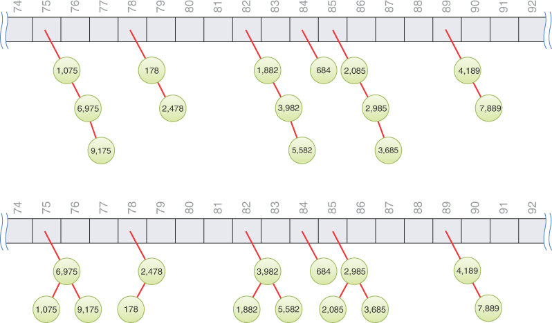

图 11-17 单独链接的示例
分离链接在概念上比开放寻址中使用的各种探测方案简单一些。但是，代码较长，因为它必须包含链表或树的机制，通常以附加类的形式出现。

### HashTableChaining 可视化工具

要查看单独链接的工作原理，请启动 HashTableChaining 可视化工具。它显示一个空数组，如图 11-18 所示。与开放式寻址工具一样，它以两个空单元格开始，随着新项目的添加，这些单元格会增长。链表从这些单元格开始向下生长。

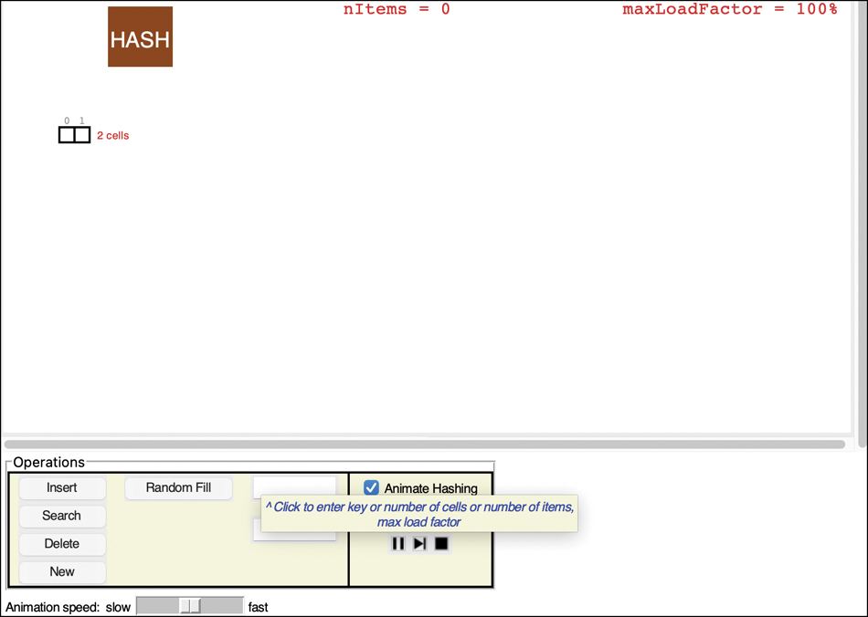

图 11-18 HashTableChaining 可视化工具中的单独链接
HashTableChaining Visualization 工具中的按钮与 HashTableOpenAddressing 工具中的按钮几乎相同，只是移除了探测选择按钮。尽管外观相似，但操作有很多差异。
尝试插入一些项目。与开放寻址工具一样，键可以是字符串或整数，并且相同的 simpleHash() 函数确定数组的哪个单元格应包含键。散列框、项目计数和加载因子限制位于顶部，以防止它们在链表向下增长时挡路。
链表是未排序的（我们很快就会讨论保持它们排序的选项）。新项目附加到列表的末尾。在所有列表中的项目总数除以单元格数超过 maxLoadFactor 限制后，类似的 __growTable() 函数将创建一个数组，该数组至少是其两倍大且单元格数为素数。这些项目被重新散列以找到它们在新数组中的位置。
单独的链接工具以 1.0 (100%) 的 maxLoadFactor 开始可能看起来很奇怪。你看到了拥挤的哈希表是如何导致开放寻址问题的。拥塞也可能是单独链接中的一个问题，但方式不同。
尝试用 30 个随机键填充数组（你可以通过在填充前取消选择 Animate Hashing 选项来关闭插入的动画）。你可能会得到一个类似于图 11-19 中的表格。大多数 (14) 个链表有一项，少数 (5) 个有两项，示例中有两个有三项（单元格 26 和 43 中的列表）。这 30 个项目存储在 47 单元格表的 21 个单元格中。这是典型的独立链接；这些物品分布在许多但不是全部的单元格中，链条的长度相对较短。

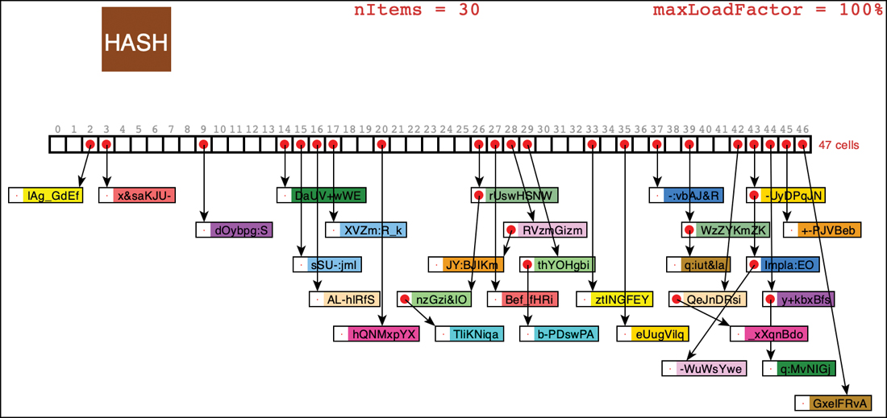

图 11-19 具有 30 个随机项的单独链接哈希表
对于哈希表中的项目，尝试一些搜索。如果单击单元格的索引编号，它将在文本输入框中输入该编号。你可以将该索引用作搜索关键字。如果单击图 11-19 中散列表的索引 26，启用"动画散列"选项，然后选择"搜索"，你可以看到散列如何立即找到单元格 26，并且必须遍历链表中的三个项目中的每一个以确定哈希表中不存在键为 26 的项。在找到目标键之前，搜索现有键也可能会遍历一些项目。
尝试删除一些项目（记住你可以单击一个键将其复制到文本输入框）。要删除的项目的搜索机制是相同的，动画显示了它所采取的步骤。与开放式寻址不同，项目从链表中删除，而不是用特殊的删除值替换。
在可视化工具中，项目大致放置在它们所属的哈希表单元格下方，但会调整位置以避免遮挡其他项目并减少一些重叠箭头。箭头有不同的长度，使得每个列表中的链接数量更难看清。例如，图 11-19 中的单元格 16 包含一个项目"AL-hlRfS"的链表，由于在它之前插入了其他项目，该项目被放置在所有其他项目之下。

### 负载系数

负载因子通常在单独链接中与在开放寻址中不同地管理。在单独的链接中，将 N 或更多项放入 N 元胞数组中是正常的；因此，负载因子可以为 1 或更大。这没有问题；有些地点的列表中只包含两个或更多项目。
当然，如果列表项很多，访问时间会更长，因为访问指定项需要平均搜索列表中一半的项。找到初始单元格很快，需要 O(1) 时间，但搜索列表所需的时间与 M 成正比，M 是列表中项目的平均数。这是 O(M) 时间。因此，你不希望列表变得太满。如果使用二叉树，搜索时间为 O(log M)。如果树保持平衡，你可以让树比列表长得更多。
如初始可视化工具所示，负载因子为 1 是很常见的。在开放寻址中，当负载因子增加到二分之一或三分之二以上时，性能会严重下降。在单独链接中，负载因子可以上升到 1 以上而不会对性能造成太大影响。这种对负载的不敏感使得分离链接成为一种更健壮的机制并减少了未使用的内存，尤其是当很难提前预测将有多少数据将被放置在哈希表中时。当负载因子（或最长列表或最深树）增长太大时，仍然需要增长哈希表，但决策指标不同。
你可以通过使用可视化工具中的新建按钮创建新表来试验从 0.5 到几乎 2.0 的负载因子限制。你还可以填充多达 99 个随机键控项，哈希表大小的增长限制为 61 个单元格。此限制会创建一些非常拥挤的独立链接哈希表。滚动条将被调整以允许你查看整个结构。大型表格的可视化速度会变慢，因为它会尝试调整链接以避免重叠。

#### 重复
在单独的链接中可以允许重复的键，但通常不是因为所有与开放寻址相同的原因，以及提到的链表和二叉树的原因。如果允许，所有具有相同键的项目将被插入到相同的列表或树中。因此，如果你需要发现所有这些，你必须在成功和不成功的搜索中搜索更多的列表或树。删除具有相同键的所有项目时，也必须进一步搜索。这些扩展搜索会降低性能。
#### 删除

在分离链接中，删除比在开放寻址中更容易。删除的项目不需要标记。该算法散列到适当的表格单元格，然后从列表或树中删除该项目。如果该项是存储在该单元格中的最后一项，如果最小内存使用量很重要，则可以将该单元格设置回空。在单元格中保留空树或列表头不会损害垃圾收集。
#### 表大小

使用单独的链接，使表大小成为质数并不像使用开放寻址那么重要。单独链接中没有探针序列，因此你不必担心探针会进入无限序列或无法覆盖所有单元格，因为步长大小会平均分配到数组大小中。
另一方面，当数组大小不是素数时，某些类型的键分布会导致数据聚集。当我们讨论哈希函数时，我们对这个问题有更多的话要说。

#### 水桶

另一种类似于单独链接的方法是在哈希表中的每个单元格处使用数组而不是链表。这种固定大小的数组有时称为桶（尽管一些哈希表描述使用术语"桶"来表示我们一直描述为哈希表的"单元格"）。然而，由于选择桶大小的问题，这种方法不如链表方法有效。如果它们太小，它们可能会溢出，需要扩展哈希表并重新哈希所有项目。如果桶太大，它们会浪费内存。动态分配内存的链表和二叉树没有这个问题。

### 用于单独链接的 Python 代码

开放寻址和独立链接的代码之间有许多共同点。清单 11-11 显示了一个单独的链接 HashTable 的核心类定义。将其与清单 11-2 中所示的开放寻址定义进行比较。区别三点：有一个import语句获取KeyValueList类，构造函数中没有探测参数，因为没有探测序列，maxLoadFactor的默认值更高。此类使用第 5 章"链接列表"中的 LinkedList 类的略微修改版本来实现单独的链接。你还可以使用第 10 章"AVL 和红黑树"中的 AVLTree。它只需要支持相同的创建、插入、查找、删除和遍历接口即可。稍后我们将讨论 KeyValueList 类和树替代方案。
该类的构造函数可以将哈希表的所有单元格初始化为空链表。但是，这样做会增加结构消耗的内存并增加构建过程的时间。最好等到项目需要插入单元格后再创建链（列表或树）来保存它们。请注意，实用程序方法 \_\_len\_\_()、cells() 和 hash() 保持相同。现在让我们看看单独链接有什么变化。
也许最重要的变化是缺少 \_\_find() 方法。对于其他数据结构，你使用 find 方法来定位项目的存储位置。在单独链接的情况下，你可以使用散列函数查找单元格（或桶），并使用链的搜索和查找方法在该单元格中定位项目。
清单 11-11 用于分离链接的核心 HashTable 类

```python
from KeyValueList import *


class HashTable(object):  # A hash table using separate chaining
    def __init__(  # The constructor takes the initial
        self,
        size=7,  # size of the table,
        hash=simpleHash,  # a hashing function, and
        maxLoadFactor=1.0,
    ):  # the max load factor before growing
        self.__table = [None] * size  # Allocate empty hash table
        self.__nItems = 0  # Track the count of items in the table
        self.__hash = hash  # Store given hash function, and max
        self.__maxLoadFactor = maxLoadFactor  # load factor

    def __len__(self):  # The length of the hash table is the
        return self.__nItems  # number of cells that have items

    def cells(self):  # Get the size of the hash table in
        return len(self.__table)  # terms of the number of cells

    def hash(self, key):  # Use the hashing function to get the
        return self.__hash(key) % self.cells()  # default cell index
```

单独链接 HashTable 的 search() 方法只是将键散列到单元格索引 i；检查单元格 i 是否已填充列表对象；如果没有返回 None 或在列表中搜索键的结果。清单 11-12 显示了实现。探针序列的所有复杂性都消失了，取而代之的是链结构（链表或树）的操作，希望能很好理解。
insert() 方法也得到了简化。在对密钥进行哈希处理以获得单元格索引 i 之后，它会检查单元格是否填充有列表对象。如果不是，则创建一个新的空键值列表并将其存储在那里。插入的主要工作是使用 KeyValueList 的 insert() 方法进行的，稍后会显示。与树实现一样，insert 方法返回一个标志，指示是否创建了新节点（而不是更新现有键的值）。创建新节点时，它会增加项目数并检查负载因子。如果超过阈值，则哈希表必须扩大。重要的是计算存储在哈希表单元格中的所有列表中的项目数，而不是列表的数量，正如我们稍后将讨论的那样。在管理表的增长之后，insert() 可以返回指示是否有新节点被添加到哈希表的标志。
__growTable() 方法的开始与开放寻址相同。它保持一个指向旧表的局部变量，同时分配一个新表，其大小是质数，至少是前一个表的两倍。然后它将旧表中的每一项重新散列到新表中。旧表的遍历是遍历其所有单元格的循环。必须使用链的 traverse() 方法遍历填充的单元格。键值元组存储在 item 变量中，然后作为两个参数传递给哈希表自己的 insert() 方法。
清单 11-12 单独链接哈希表的搜索和插入方法

```python
class HashTable(object):  # A hash table using separate chaining
…
    def search(
        self, key  # Get the value associated with a key
    ):  # in the hash table, if any
        i = self.hash(key)  # Get cell index by hashing key
        return (
            None
            if self.__table[i] is None
            else self.__table[i].search(key)  # If list exists,
        )  # search it, else None

    def insert(
        self, key, value  # Insert or update the value associated
    ):  # with a given key
        i = self.hash(key)  # Get cell index by hashing key
        if self.__table[i] is None:  # If the cell is empty,
            self.__table[i] = KeyValueList()  # Create empty linked list
        flag = self.__table[i].insert(key, value)  # Insert item in list
        if flag:  # If a node was added,
            self.__nItems += 1  # increment item count
            if self.loadFactor() > self.__maxLoadFactor:  # When load
                self.__growTable()  # factor exceeds limit, grow table
        return flag  # Return flag to indicate update

    def __growTable(self):  # Grow the table to accommodate more items
        oldTable = self.__table  # Save old table
        size = len(oldTable) * 2 + 1  # Make new table at least 2 times
        while not is_prime(size):  # bigger and a prime number of cells
            size += 2  # Only consider odd sizes
        self.__table = [None] * size  # Allocate new table
        self.__nItems = 0  # Note that it is empty
        for i in range(len(oldTable)):  # Loop through old cells and
            if oldTable[i]:  # if they contain a list, loop over
                for item in oldTable[i].traverse():  # all items
                    self.insert(*item)  # Re-hash the (key, value) tuple
```

让我们看一下 KeyValueList 类的实现。它是第 5 章中 LinkedList 类的特殊版本，其中每个链接项都包含一个（键，值）元组，如清单 11-13 所示。该定义首先导入 LinkedList 类并定义一些访问器函数以从链接中获取键和值。
insert() 方法在处理重复键插入的方式上与其父类不同。简单的 LinkedList 版本总是在列表的开头插入新项目。如果键已在列表中，则 KeyValueList 必须更新现有值。它首先找到任何具有匹配键的链接（使用父类的 find() 方法和 itemKey 函数从每个链接的元组中提取键）。如果没有找到这样的链接，它会使用父类的 insert() 方法将 (key, value) 元组放在列表的开头。它返回 True 以指示添加新项目。如果找到具有匹配键的链接，它会使用 (key, value) 元组更新该链接的数据并返回 False 以指示未进行任何添加。
清单 11-13 KeyValueList 类的定义

```python
import LinkedList


def itemKey(item):
    return item[0]  # Key is first element of item


def itemValue(item):
    return item[1]  # Value is second element of item


class KeyValueList(LinkedList.LinkedList):  # Customize LinkedList
    def insert(self, key, value):  # Insert a key + value in list
        link = self.find(key, itemKey)  # Find matching Link object
        if link is None:  # If not found,
            super().insert((key, value))  # insert item at front
            return True  # return success
        link.setData((key, value))  # Otherwise, update existing link's
        return False  # datum and return no-insert flag

    def search(self, key):  # Search by matching item key
        item = super().search(key, key=itemKey)  # Locate key + value
        return itemValue(item) if item else None  # Return value if any

    def delete(self, key):  # Delete a key from the list
        try:  # Try the LinkedList deletion by key
            return super().delete(key, itemKey)
        except:  # All exceptions mean key was not
            return False  # found, so return False

    def traverse(self):  # Linked list traverse generator
        link = self.getFirst()  # Start with first link
        while link is not None:  # Keep going until no more links
            yield link.getData()  # Yield the item
            link = link.getNext()  # Move on to next link
```

search() 方法使用父类的 search() 方法来获取具有匹配键的第一个链接（如果有的话）。如果找到链接，它返回关联值，否则返回 None。
delete() 方法与其父方法的区别最大。在简单的 LinkedList 版本中，如果列表为空或找不到键，则 delete() 会抛出错误。 KeyValueList 使用 try except 子句从父 delete() 方法获取结果。如果找到并删除了一个项目，它会返回该项目。如果发生错误，它会返回 False 以指示未找到密钥。
最后，KeyValueList 的 traverse() 方法与其父类的代码几乎相同，但使用 yield 语句使其成为生成列表中的 (key, value) 元组的生成器。
回到单独的链式 HashTable 实现，你可以定义它的 traverse() 方法，如清单 11-14 所示，以使用 KeyValueList 的方法。这些循环类似于 __growTable() 中使用的循环。不同之处在于 traverse() 方法循环遍历当前哈希表单元格而不是旧副本，并且它产生它找到的项目而不是重新插入它们。
清单 11-14 分离链接的 traverse() 和 delete() 方法

```python
class HashTable(object):  # A hash table using separate chaining
…
    def traverse(self):  # Traverse the key, value pairs in table
        for i in range(len(self.__table)):  # Loop through all cells
            if self.__table[i]:  # For those cells containing trees,
                yield from self.__table[i].traverse()

    def delete(
        self,  # Delete an item identified by its key
        key,  # from the hash table. Raise an exception
        ignoreMissing=False,
    ):  # if not ignoring missing keys
        i = self.hash(key)  # Get cell index by hashing key
        if self.__table[i] is not None and self.__table[i].delete(key):
            self.__nItems -= 1  # if found, reduce count of items
            return True  # Return flag showing item was deleted
        if ignoreMissing:  # Otherwise, no deletion. If we ignore
            return False  # missing items, return flag
        raise Exception(f"Cannot delete key {key} not found in hash table")
```

在我们讨论 delete() 方法之前，让我们看一下遍历哈希表项的顺序。

### 哈希表中的遍历顺序

哈希表应该以什么顺序遍历它的项目？在二叉搜索树中，你可以选择按顺序、前序或后序遍历。有没有办法在哈希表中做同样的事情？树中的排序基于具有父节点、左子节点和右子节点的树结构。哈希表中的所有项目都没有等效结构（即使在具有单独链接的单个单元格中可以有这样的结构）。
清单 11-14 和清单 11-8 中所示的 traverse() 方法生成项目的顺序主要基于它们的哈希地址。这是哈希函数和哈希表大小的组合。如果你希望按升序生成键，则需要反转散列函数或收集所有键并对它们进行排序。在大多数情况下，反转哈希函数非常困难。如你所见，对键进行排序可能需要 O(N×log N) 时间。通常，哈希表以"任意"（不可预测的）顺序返回键。如果调用者需要按顺序排列它们，它可以对它们进行排序（按键或值）。有趣的是，Python 的字典哈希表在早期版本中以任意顺序返回键。在 3.7 及更高版本中，它按插入顺序返回它们。
请注意，在单独的链接中，每个单元格中的项目根据所使用的列表或树的遍历顺序进行遍历。在 KeyValueList 实现中，列表以反向插入顺序保留项目。然而，当哈希表增长时，项目的重新哈希通过链表并反转之前的插入顺序。这使得最终的遍历顺序很难预测。如果使用 AVL 树进行链接，那么每棵树中的项都可以按键顺序遍历，但由于重新散列，它们仍然会以任意顺序遍历哈希表产生。

### 分离链接的 delete() 方法

清单 11-14 中所示的单独链接的哈希表实现的最后一个方法是 delete()。与 insert() 一样，delete() 的代码比开放寻址所需的代码更简单。此方法计算键的哈希地址，然后使用 KeyValueList delete() 方法删除项目（如果列表存在）。如果该列表报告某个项目已被删除，它会减少哈希表的项目计数并返回 True 以表示删除了该项目。如果最小内存使用量很重要，则当删除导致空列表或树时，在返回 True 之前应将单元格设置为 None。
如果单元格为空或树找不到要删除的键，则 ignoreMissing 参数确定是返回 False 还是引发异常。

### 你应该使用哪种类型的链接？
单独的链接可以使用多个二级结构来存储每个单元格中的项目。列表和树很常见，有时是小数组（当避免动态分配新存储时）。没有一种类型最适合所有用例。根据散列函数和插入的键，某些结构比其他结构更有效。
最重要的因素是单元格中项目的最大数量以及它们将被搜索的次数。如果散列函数非常好，它会将键值均匀地分布在所有表格单元格中。如果 N 个项目存储在 M 个表格单元格中，则每个单元格的平均项目数为 N/M。请注意，这与哈希表的加载因子完全相同。在单独的链接实现中，我们使用 1.0 的 maxLoadFactor 作为默认值。使用良好的散列函数，存储在单元格中的项目的平均数量最多应为 1。有些单元格有两个项目，有些没有，很少有三个或更多项目。
如果没有单元格包含超过三个项目，则使用最简单的结构进行单独链接（链表）是有意义的。这些项目不需要保持排序，因为你最多只需要比较三个键。插入未排序的列表通常是 O(1) 操作。但是，在单独链接的情况下，你必须搜索整个列表以查看它是否是重复键。搜索该列表需要 O(N) — 或者在本例中为 O(N/M) — 用于列表的预期平均长度。将负载因子 N/M 保持在 1.0 或以下意味着搜索未排序列表和插入都预计为 O(1)。
排序列表不会加快成功搜索的速度，但它们确实可以将不成功搜索的时间缩短一半。一旦到达大于搜索键的项目，平均是列表中项目的一半，搜索就可以宣告失败。列表越长，这将变得越重要。在排序列表中，删除时间也减少了一半。
如果预计会有很多不成功的搜索，那么使用稍微复杂一些的排序列表而不是未排序列表可能是值得的。然而，当插入速度更重要时，未排序的列表会胜出。这方面的一个例子可能是使用哈希表来存储"选择 6"彩票的所有条目。每个彩票参与者选择一个由六个数字组成的序列。哈希表用于存储每个参与者的联系信息，因此键是数字序列，数据是选择该序列的人员列表。可能有数百万个这样的序列，但由于只有一次搜索由彩票经理选择的中奖序列，因此对哈希表的搜索将很少（成功和不成功）。在插入过程中花时间对键进行排序没有什么意义。
在单独链接中使用的二级结构的选择也会受到散列函数选择的影响。虽然有很多好的散列函数，但也有一些不好的。如果一个特定的应用程序要么选择了一个错误的散列函数，要么以某种方式运行了一组键，这些键使用该函数散列到散列表中的一个或两个地址，则一个单元格中的项目数可以增长到 N。不太可能的情况，像 AVL 树这样的平衡二叉树可能是最好的。这使得每个单元格中的插入和搜索操作 O(log N) 而不是 O(N)。这是一种退化的情况，其中哈希函数不会将数据分布在大量单元格中，因此更高效的树结构是对列表的改进。
当我们在本章后面讨论哈希表的效率时，我们会回到何时使用分离链接与开放寻址的问题。

## 哈希函数

在本节中，我们探讨什么是好的散列函数的问题，并了解如何改进本章开头提到的散列字符串的方法。

### 快速计算

一个好的散列函数很简单，因此可以快速计算。哈希表的主要优点是它们的速度。如果计算散列函数很慢，这个速度就会降低。具有许多迭代或计算级别的哈希函数不是一个好主意。许多是基于复杂的数学。如果它们涉及大量乘法和除法运算，尤其是在没有硬件支持此类运算的计算平台上，它们可能会花费相当多的时间。
哈希函数的目的是获取一系列键值并将它们转换为索引值，哈希地址随机分布在哈希表的所有索引中。密钥可能是完全随机的，也可能不是那么随机。

### 随机键

所谓的完美散列函数将每个键映射到不同的表位置。这在实践中几乎不可能。当键表现得异常好并且落在一个足够小的范围内可以直接用作数组索引时，就会发生一种特殊情况。例如，制造商为其制造的每个零件提供编号。这些数字从 1,000 开始，一直增加到他们曾经生产过的东西的数量，比如过去 50 年的 10,000 件。因为它们被创建为唯一且没有间隙，所以可以轻松地将它们直接用作数组索引而无需散列，只需使用散列函数从零件号中减去 1,000。这些是异常行为良好的键。
如果你只需要存储这些零件号中的几个，比如目前库存中的一百个零件，那么可以创建一个完美的哈希函数，将它们映射到较小数组中的唯一索引。完美的哈希函数需要将一百个零件号中的每一个映射到一个唯一的索引。你在第 8 章"二叉树"中看到了霍夫曼编码算法，它为消息中使用的每个字母提供了一个唯一的位序列。类似的技术可用于为每个零件编号分配唯一索引。
然而，在大多数应用程序中，不可能预测将在哈希表中插入哪些键。不知道密钥的数量和类型，就不可能构建完美的哈希函数。所以通常情况下，你会做出假设。在本章中，我们假设转换后的键随机分布在一个较大的数值范围内。在这种情况下，哈希函数

```python
index = key % arraySize
```

令人满意。它只涉及一个数学运算，如果密钥真的是随机的，那么生成的索引也将是随机的，因此分布良好。如果键共享一些公约数，你可以通过选择 arraySize 为质数（并希望质数不是公约数）来减少它们导致冲突的机会。

### 非随机键

数据通常是非随机分布的。事实上，很难找到真正随机（数学家会称之为均匀）分布的数据。
让我们考虑一些密钥示例：时间戳密钥，例如自特定时间点以来经过的毫秒数和 Internet 上的 IP 地址。通常，这些类型的键不会均匀分布在所有可能的值中；他们集中在范围内。毫秒时间戳可能适用于持续时间较短的事件，例如过去一周计算机服务器上的日志消息，或者可能适用于某些过去的事件，例如一群人的出生。这些出生很可能都集中在上个世纪的日期，而不是均匀地分布在数万年的时间里。即使在上个世纪，出生率也时高时低，分布不均。对于 IP 地址，很难得到一组来自世界各地的地址样本数据。通常，将有许多对本地 IP 地址的引用，以及来自与收集数据的计算机或网络设备通信的任何区域的较小数字。
许多可能使用的键都有一个内部结构。 IP 地址是 32 位或 128 位数字，组织成四个八位字节或八个 16 位字。为不同的目的保留了不同的地址块。任何特定的密钥集都可能有许多来自几个块的密钥，而大多数都没有。
制造商的部件号通常也有结构。让我们看一个使用汽车零件号作为键的系统示例，并讨论如何有效地散列它们。也许这些零件号的形式
033-400-03-94-05-0-535

这个号码 033-400-03-94-05-0-535 可能被解释如下：

- 数字 0–2：供应商编号（1 至 999，目前最多 70 个）
- 数字 3–5：类别代码（100、150、200、250，最多 850）
- 数字 6–7：介绍月份（1 至 12）
- 数字 8–9：引入年份（00 至 99）
- 数字 10–11：序列号（1 到 99，但不超过 100）
- 第 12 位：有毒风险标志（0 或 1）
- 数字 13–15：校验和（其他字段的总和，模 1000）

如果忽略分隔连字符，则用于前面 16 位零件号的十进制代码将为 0,334,000,394,050,535。零件的密钥不会随机分布在所有可能的数字上。大多数从 0 到 9,999,999,999,999,999 的数字实际上不会出现（例如，大于 70 的供应商编号、不是 50 的倍数的类别代码以及从 13 到 99 的月份）。此外，校验和不独立于其他数字。应该对这些部件号进行一些处理，以帮助确保它们形成一系列更真实的随机数。

### 不要使用非数据
应该压缩关键字段，直到每一位都很重要。例如，汽车零件编号中的类别代码应更改为从 0 到 15（对应于此处出现的值 100、150、...、850）。校验和应该从散列的计算中移除，因为它不添加任何额外的信息；这是故意多余的。各种其他位旋转技术适用于将密钥中的各个字段压缩为它们所代表的唯一值。
密钥在内存中的地址或包含密钥的记录永远不应在哈希函数中使用。换句话说，如果通过引用指针访问密钥，则在计算哈希时不要使用该指针。仅使用零件号或指针引用的其他标识元素。内存中存储数据的位置随运行而变化。使用该位置意味着密钥只会在程序的某些运行中匹配。

### 使用所有数据

密钥的每个部分（除了刚才描述的非数据）都应该对散列函数有贡献。不要只使用前四位数字、后四位数字或类似的缩写。对密钥有贡献的数据越多，密钥就越有可能均匀散列到整个索引范围内。
有时键的范围太大，以至于溢出了编程语言支持的整数值类型。大多数计算平台都支持 32 位和 64 位整数。但是，某些嵌入式处理器可能仅支持 16 位或 8 位。无论平台大小限制如何，都会有一些键的数值超出了单个机器字所能表示的范围。当我们稍后讨论散列字符串时，我们会展示如何处理溢出。
总结一下：诀窍是找到一个简单快速的散列函数，使用所有可用数据，同时排除密钥的非数据和冗余部分。

### 使用质数作为模基数

哈希函数通常涉及在大范围内创建一个数字，并使用具有表大小的模运算符 (%) 将其映射到哈希地址。你已经看到，在使用二次探查或双哈希时，表的大小必须是质数是很重要的。如果键本身不是随机分布的，那么无论使用什么散列系统，表的大小都必须是质数。
要了解质数单元格为何有用，请考虑如果许多散列键在值中由某个数字 X 分隔会发生什么情况。如果 X 是数组大小的约数，例如大小的 ¼，则大组键散列到相同的四个位置，导致主要集群。使用素数表大小几乎可以消除这种可能性。例如，如果在汽车零件示例中表的大小是 50 的倍数，则类别代码可以全部散列为 50 的倍数的索引号（假设该代码乘以散列值）。但是，对于质数，例如 53，可以保证只有散列为该质数倍数（加上常量偏移量）的键才会散列到同一地址。零件编号和其他人为设计的方案很少使用这样的质数。
回到时间戳作为键的例子，时间戳代表的事件往往是周期性的。时间可以表示通常在整点、每 20 分钟或每年发生的事情。周期性事件将创建围绕特定高峰时间聚集在一起的时间戳。如果这些峰值被数组大小的倍数分隔，那么许多键散列到同一个地址。即使它们没有恰好落在数组大小的倍数上，这些串也会造成散列地址的冲突，从而导致开放寻址中的簇或单独链接中的长链。
道德是仔细检查你的密钥并调整你的哈希算法以消除密钥分布中的任何规律性。

### 哈希字符串

在本章的开头，你看到了如何通过将数字代码乘以常数的幂来将短字符串转换为关键数字。特别是，你看到三个字母的单词 elf 可以通过计算变成数字 3,975

$$
key = 5*27{^2} + 12*27{^1} + 6*27{^0}
$$
这种方法具有包含输入字符串中所有字符的理想属性。然后可以按照通常的方式将计算出的键值散列到数组索引中：

```python
index = key % arraySize
```

清单 11-3 中所示的 simpleHash() 方法使用了类似的计算，但基数是 256 而不是 27。这种计算允许字符串中有更多可能的字符（但不是所有 Unicode 值）。
simpleHash() 方法并不像它可能的那样高效。在哈希字符串时，它会进行字符转换，将 256 的 i 次方（字符在字符串中的位置）相乘，并将所有乘积添加到求和表达式中：

```python
sum(256 ** i * ord(key[i]) for i in range(len(key)))
```

这种表达计算的方式简洁明了，但是做了一些可以避免的额外工作。你可以利用称为 Horner 方法的数学恒等式来消除计算 256 的幂。这个方法说明像这样的表达式

$$
var4*n{^4} + var3*n{^3} + var2*n{^2} + var1*n{^1} + var0*n{^0}
$$

可以写成

```python
(((var4*n + var3)*n + var2)*n + var1)*n + var0
```

基数 n 现在没有指数，乘以每个带括号的表达式（包括 var4）。要将此方程式转换为循环形式，你可以从最里面的括号内开始并向外计算。将此等式转换为 Python 函数会产生以下结果：

```python
def hashString1(key):  # Use Horner's method to hash a string
    total = 0  # Sum contribution of all characters
    for i in range(len(key) - 1, -1, -1):  # Go in reverse order
        total = total * 256 + ord(key[i])  # Multiply by base, add char i
    return total  # Return sum
```

hashString1() 函数计算与 simpleHash() 对字符串所做的相同的散列，但在循环中对每个字符进行一次乘法和一次加法。通过重复乘法将 256 提高到一个幂。
这种方法是一个明确的改进，因为大多数处理器可以在几个时钟周期内执行乘法，而将数字提高到一个幂可能需要更长的时间。还有两个变化可以提供更多帮助。乘以 2 的幂与将二进制数的位向左移动该幂相同。在这种情况下，256 是 28，你可以使用位移运算符 <<，而不是乘法：

```python
def hashString2(key):  # Use Horner's method to hash a string
    total = 0  # Sum contribution of all characters
    for i in range(len(key)):  # Go in forward order
        total = (total << 8) + ord(key[i])  # Shift to mult., add char i
    return total  # Return sum
```

每个现代处理器都支持移位，并且通常比乘法更快。此示例还更改了字符索引 i，从 0 增加到键的最后一个字符。这种方法节省了一点点时间（减法）并使代码更简单，尽管对于相同的字符串（回文除外），它会产生与 hashString1() 截然不同的哈希值。字符串仍然被散列为唯一值，但最重要的字符（更改散列值最多的字符）位于 hashString2() 函数的左侧。
hashString2() 函数提供了一个更优化的散列函数，可以从每个字符串中非常快速地计算出一个唯一的数字。然而，还有另一个因素需要考虑，那就是总和的大小。当你移动位（或乘法）时，你最终创建的数字大于机器字中的数字。一个 64 位处理器可以将总数移动 8 位七次而不会溢出其 64 位寄存器。对于长度超过 8 个字符（或字符点数大于 255）的字符串，很可能会发生溢出。
我们可以修改基本方法以免溢出任何变量吗？请注意，我们最终得到的哈希地址总是小于数组大小，因为我们应用了模运算符。不是最终索引太大；这是中间总值。
对于使用 +、* 和 – 的任何算术表达式，你可以在计算的每个步骤中应用模运算符 (%)。以这种方式使用运算符与在末尾应用一次模运算符得到相同的结果，但避免了溢出，代价是在循环内添加了一个运算。 hashString3() 方法显示了它的外观：

```python
def hashString3(key, size):  # Use Horner's method to hash a string
    total = 0  # Sum without overflowing
    for i in range(len(key)):  # Go in forward order, shift, add char i
        total = ((total << 8) + ord(key[i])) % size  # and use modulo
    return total  # Return sum
```

大多数字符串哈希函数都采用这种方法（或类似方法）。还可以使用各种位操作技巧，例如使用 2 的幂的大小。这意味着模运算符可以通过与位"掩码"（例如，total & 0xFFFFFFF ).另一方面，使用 2 的幂作为哈希表大小意味着对于具有与 2 的幂相关的模式的键，而不是素数，可能存在哈希表冲突。
你可以使用类似的方法将任何类型的字符串或字节序列转换为适合散列的数字。因为所有数据都存储为字节序列，所以该方案几乎可以处理任何类型的数据。

### 折叠式的

另一个合理的散列函数涉及将密钥分成数字组并添加组。这种方法确保所有数字都会影响哈希值。一组中的位数应与数组的大小相对应。也就是说，对于包含 1,000 个项目的数组，使用每组三位数字。折叠技术几乎就像将数字串写在一张纸条上，在每组 K 位数字之间折叠纸张，然后将现在堆叠的数字相加。
例如，假设你要散列 10 位电话号码以进行线性探测。如果数组大小为 1,000，你可以将 10 位数字分成三组，每组 3 位数字，外加最后一位数字。如果特定电话号码是 123-456-7890，你将计算键值 123+456+789+0 = 1368。模运算符可以将这些总和映射到索引范围 0–999。在这种情况下，1368 % 1000 = 368。如果数组大小为 100，则需要将 10 位密钥分成五个 2 位数字：12+34+56+78+90 = 270，以及 270 % 100 = 70。
当数组大小是 10 的倍数时，更容易想象这个操作是如何工作的。但是，为了获得最佳结果，数组大小应该是质数，或者可能是 2 的幂，就像你在其他哈希函数中看到的那样。我们将此方案的实施留作练习。

## 哈希效率

我们注意到在哈希表中插入和搜索可以接近 O(1) 时间。如果没有发生冲突，或者单独的链最多包含一个元素，则只需要调用哈希函数、数组引用以及可能的链接取消引用来查找现有项或插入新项。这是最短访问时间。
请注意，哈希函数需要一些时间来计算，时间长短取决于密钥的长度和哈希函数。密钥通常很短，可能有几十个字节。因为键的长度比大的 N（存储的项目数）短得多，所以你将散列所花费的时间视为 O(1)。当你考虑对大量字节序列（比如整个视频文件）进行散列处理时，散列处理所花费的时间可能会变得很长，但与存储的项目数量（例如，Internet 上所有可用的视频）相比，它仍然可能很小.
如果发生冲突，访问时间将取决于最终的探测长度或链搜索。在链中的探测或链接期间访问的每个单元格都会为搜索空单元格（用于插入）或现有单元格添加另一个时间增量。在访问期间，必须检查单元格或链接以查看它是否为空以及是否包含所需的项目。
因此，单个搜索或插入时间与探针的长度、链的长度或树的深度成正比。必须将此可变时间添加到哈希函数的常数时间。
平均探测或链长度（以及因此的平均访问时间）取决于负载因子（表中项目与表大小的比率）。随着负载系数的增加，长度变长。
让我们看看我们研究过的各种哈希表的探测长度和负载因子之间的关系。

### 开放寻址

对于各种开放式寻址方案，高负载因子的效率损失比单独链接更严重。
在开放寻址中，不成功的搜索通常比成功的搜索花费更长的时间。请记住，在探测序列期间，算法会在找到所需项目后立即停止，平均而言，这是在探测序列的一半。另一方面，在确定找不到项目之前，探测必须一直进行到序列的末尾。

### 线性探测

以下等式显示了线性探测的探头长度 (P) 和负载系数 (L) 之间的关系。为了成功搜索，它是
$$
P = ( 1 + 1 / (1 – L) ) / 2
$$

对于不成功的搜索，它是

$$
P = ( 1 + 1 / (1 – L) 2) / 2
$$

这些公式来自 Knuth（参见附录 B，"进一步阅读"），它们的推导相当复杂。图 11-20 以蓝色（上部）曲线显示了这些方程的图形。上图显示成功搜索的探针长度，下图显示不成功搜索的长度。

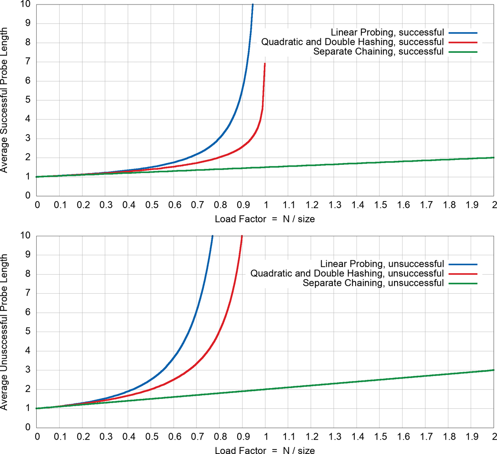

图 11-20 成功和不成功的探测性能
在负载因子为 0.5 时，平均成功搜索需要 1.5 次比较，平均不成功搜索需要 2.5 次。在负载系数为 2/3 时，数字为 2.0 和 5.0。在更高的负载系数下，数字变得非常大——如此之高以至于超出图表的无穷大。我们很快就会讨论图中的其他线条。
如你所见，要点是负载系数必须保持在 2/3 以下，最好低于 1/2。另一方面，负载因子越低，给定数量的项目需要的内存就越多。特定情况下的最佳负载系数取决于内存效率（随着负载系数降低而降低）与速度（增加）之间的权衡。

### 二次探测和双重哈希
二次探测和双重哈希共享它们的性能方程式。这些等式表明相对于线性探测的适度优势。为了成功搜索，公式（同样来自 Knuth）是
$$
P = –ln(1 – L) / L
$$

其中 ln() 是自然对数函数。这类似于 log2()，除了基数是特殊常数，e ≅ 2.718。对于不成功的搜索，它是

$$
P = 1 / (1 – L)
$$

图 11-20 使用红线显示了这些公式的图形。在负载因子为 0.5 时，成功的搜索需要大约 1.4 次探测，而不成功的搜索平均需要 2.0 次。在 2/3 负载系数下，数字约为 1.6 和 3.0；在 0.8 时，它们是 2.0 和 5.0。因此，与线性探测相比，二次探测和双重散列可以容忍稍高的负载因子。这在图表中显示为位于蓝线下方的红线。
请注意，当负载因子接近 1.0 时，红线和蓝线都急剧上升。这种行为是预料之中的，因为这意味着表几乎已满，找到一个键或一个空槽可能需要进行 N 次探测。

### 独立链接

单独链接的效率分析与开放寻址不同，而且通常更容易。
我们想知道搜索键或将具有新键的项目插入到单独链接的哈希表中需要多长时间。所有方法都必须计算散列函数并确定起始散列地址。计算所花费的时间是一个常数，因此我们关注搜索链结构时所需的键比较次数。对于链接，我们假设确定何时到达列表或树的末尾等同于一次键比较。因此，所有操作都需要 1 + nComps 时间，其中 nComps 是键比较的次数。
假设哈希表包含 size 个单元格，每个单元格都有一个列表，并且在表中插入了 N 个数据项。然后，平均而言，每个列表包含 N 个除以大小的项目：
$$
Average List Length = N / size
$$

这与负载系数 L 的定义相同：

$$
L = N / size
$$

因此，平均列表长度等于负载因子。

### 搜索
在成功的搜索中，算法散列到适当的列表，然后沿着链表搜索项目。平均而言，必须检查一半的物品才能找到正确的物品。因此，搜索时间为

$$
P = 1 + L / 2
$$

无论列表是否有序，都是如此。在不成功的搜索中，如果列表是无序的，则必须搜索所有项目，所以时间是

$$
P = 1 + L
$$

图 11-20 中使用绿色（最低）线绘制了这些公式。对于有序列表，在不成功的搜索中只需检查一半的项目，因此时间与成功搜索的时间相同。
在单独的链接中，通常使用大约 1.0 的加载因子（数据项的数量等于数组大小）。较小的负载因子不会显着提高性能，但所有操作的时间会随着负载因子线性增加，因此超过 2 左右通常不是一个好主意。当然，开放寻址方法必须将负载因子保持在 1.0 以下。

### 插入

从表面上看，插入新密钥是立即的，因为不需要比较。但是，因为我们选择不允许重复键，所以必须搜索任何现有链以确定键是新键还是重复键。这意味着插入的行为与搜索完全一样，加上一些持续的工作，以在列表的末尾（或开头）插入新项目或更新现有数据。仍然必须计算散列函数，插入或更新数据，所以我们称插入时间为 1。为了与其他度量保持一致，你可以称其为 1 的探测长度 P。发现密钥是新的相当于对无序列表搜索失败所花费的时间：
$$
P = 1 + L
$$

如果列表是有序的或者键存在于链中，那么，对于不成功的搜索，必须检查每个列表中平均一半的项目，因此插入时间是

$$
P = 1 + L / 2
$$

### 用二叉搜索树分离链接

如果使用二叉搜索树来组织每个单元格中的项目，则与使用列表的单独链接存在一些差异。如果你想获得二叉树快速搜索的好处，使用一种自平衡二叉搜索树结构（例如，AVL、2-3-4 或红黑树）是最有意义的.它们的代码更复杂，但成功和不成功搜索所需的比较次数与树的深度成正比。每棵树中存储的平均项目数是负载因子，就像列表一样。这意味着树的平均深度是 log2(L)。当负载因子为零时，仍然有一个探针，因此探针长度约为
$$
P = 1 + log2(L + 1)
$$

插入树中需要找到新密钥所属的位置，这需要 1 + log2(L + 1) 步。查找现有密钥也需要 1 + log2(L + 1) 步。当键通常适合的子节点不存在时，搜索不在树中的键就会停止，因此它也需要相同数量的步骤。在每种情况下，确切的步骤数之间存在细微差异。
与图 11-20 中所示的其他方法相比，二叉搜索树的图形将恰好位于单独链接的绿线下方。两个图都从 1.0 开始，随着负载因子的增加而缓慢上升，但二叉搜索树在负载因子大于 1.0 后上升得更慢。对于低负载因子，差异是如此之小，以至于使用列表链接的简单性超过了探测性能。更快的搜索是一个好处，只有当负载因子变大，或者散列函数与被散列的键的错误组合将 N 项的大部分放在一棵树中时。

### 不断增长的哈希表
除了探索插入新项目的位置所花费的时间之外，还有增长哈希表和重新散列已存储在其中的项目所花费的时间。开放寻址和独立链接都通过保持较低的负载因子而受益，因此当负载因子超过阈值（这两种类型不同）时，它们通常会将哈希表大小加倍。
重新插入物品会导致多少额外工作？考虑第一个插入：当负载因子较低时，单个项目的插入发生在 O(1) 或"恒定"时间内。如果你从来不需要重新散列这些项目，那么插入 N 个项目需要 O(N) 时间。这可能看起来不直观，但允许哈希表通过将大小加倍来呈指数增长可以保持 O(N) 性能。
为了了解原因，我们假设你从大小为 1 的表开始，并且每次插入使负载因子超过 0.5 时都将其加倍（我们有意在此处忽略选择主要表大小的复杂性）。第一次插入后，表格加倍为两个单元格，并重新插入一个项目。第二次插入再次将负载因子推到阈值之上，必须将这两项重新插入到四单元格表中。具体步骤如表11-3 所示。
表 11.3 表大小加倍时的重新插入

| Item       | 1    | 2    | 3    | 4    | 5    | 6    | 7    | 8    | 9    | 10   | 11   | 12   | 13   | 14   | 15   | 16   |
| ---------- | ---- | ---- | ---- | ---- | ---- | ---- | ---- | ---- | ---- | ---- | ---- | ---- | ---- | ---- | ---- | ---- |
| Table size | 2    | 4    | 8    | 16   | 16   | 16   | 16   | 32   | 32   | 32   | 32   | 32   | 32   | 32   | 32   | 64   |
| 重新插入   | 1    | 2    | 3    | 4    |      |      |      | 8    |      |      |      |      |      |      |      | 16   |
| Item      | 17   | 18   | 19   | 20   | 21   | 22   | 23   | 24   | 25   | 26   | 27   | 28   | 29   | 30   | 31   | 32   |
| 表大小     | 64   | 64   | 64   | 64   | 64   | 64   | 64   | 64   | 64   | 64   | 64   | 64   | 64   | 64   | 64   | 128  |
| 重新插入   |      |      |      |      |      |      |      |      |      |      |      |      |      |      |      | 32   |

在插入第四个项目时，桌子加倍以容纳 16 个项目，并且必须重新插入这 4 个项目。然而，第五项不会导致任何加倍或重新插入。相同的条件一直保持到第八个项目，当另一个加倍发生时，必须重新插入 8 个项目。
如表 11-3 所示，每次项目数达到 2 的另一个幂时都会发生重新插入工作。这些扩展之间的间隔越来越长。在插入第 32 项之前，表 11-3 的整个第二部分没有重新插入。当你插入大量项目时，比如一百万，重新插入的次数将是

$$
1 + 2 + 3 + 4 + 8 + 16 + … + 262,144 + 524,288
$$

求和中的最后一个数字是百万以下的 2 的最大次方。移出 3 的例外并将它们写成 2 的幂得到总和：

$$
3 + 2^{0} + 2^{1} + 2^{2} + 2^{3} + 2^{4} + … + 2^{18} + 2^{19}
$$

2 的幂之和应该看起来很熟悉。它与二叉树中从根到叶的节点数相同。正如你在第 8 章分析二叉树的效率时看到的那样，从 0 到某个级别的 2 的幂之和 K 可以写成一个取决于 2 的幂本身的公式：
$$
2^{0} + 2^{1} + \cdots + 2^{K} = \sum_{i=0}^{K}2^{i} = 2^{K+1} - 1
$$

因此，重新插入的总数为 3 + 2K+1 – 1 或 2 + 2K+1。看起来它可能会变成一个非常大的数字，这意味着插入 N 项将比 O(N) 花费更多的工作。你要记住的是K和N的关系。当你插入一百万项时，K是19； 2K是小于或等于N的2的最大次方。换句话说，K是刚好低于log2(N)的整数。将等式中的 log2(N) 替换为重新插入的次数（并忘记获取正下方的整数）留下

$$
number of reinsertions = 2 + 2^{log_{2} (N)+1} = 2 + 2 × 2^{log2 (N)} = 2 + 2 × N = 2(N +1)
$$

这意味着重新插入的数量随着 N 的增长而线性增长。原来的 N 项是用 O(N) 的工作量插入的，重新插入只是增加了常量倍数 N，所以整体复杂度仍然是 O(N)。即使当你将表增长为下一个大于其当前大小两倍的素数时，相同的模式仍然存在。要重新插入的项目数始终小于新表大小的一半，并且重新插入项目的总和不会增长得比 O(N) 更快。

### 哈希表内存效率
我们注意到哈希表在各种情况下可能包含许多未使用的单元格。总的来说，它们仍然消耗 O(N) 内存来存储 N 个项目。它们需要比简单数组更多的内存，因为它们必须存储键及其相关值（数组仅存储值，键是隐式的）。将加载因子保持在阈值以下意味着你需要的单元格数量大约是项目数量 N 的两倍，但这仍然是 O(N)。
我们假设表在插入期间通过在需要时将其大小加倍来增长，因此它永远不会超过 N 的两倍。但是，当你仔细观察时，如果你首先插入 P 项然后删除其中一些以达到 N项，开放寻址实现将消耗 O(P) 空间。当 P 远大于 N 时，这个数额可能很大。
对于单独链接的哈希表，插入 P 个项目然后删除一些项目以留下 N 个项目的过程不会浪费与开放式寻址一样多的内存，因为链或树中的删除会释放正在消耗的内存。仅删除链或树中的最后一项会留下空的内存单元或空链对象。
要注意的另一项是遍历时间与表大小成正比。如果从曾经包含 P 项的哈希表中删除许多项，遍历时间仍然需要 O(P) 来检查所有单元格。这是我们看到的第一个数据结构，其中遍历可能比 O(N) 慢一点，其中 N 是当前存储的项目数。哈希表的删除导致遍历时间效率的差异。它仍然是 O(N)，但 N 是插入项目的最大数量，而不是当前存储的数量。

### 开放寻址与独立链接

如果要使用开放寻址，则双哈希是首选系统（当然优于二次探测）。例外情况是内存充足，建表后数据不会扩容；在这种情况下，线性探测的实现稍微简单一些，如果使用低于 0.5 的负载因子，则几乎不会造成性能损失。
在编写数据结构实现时，通常不知道将插入哈希表的项目数，有时甚至在创建表时也不知道。因此，在大多数情况下，单独链接比开放寻址更可取。允许负载因子变大会导致开放寻址中的主要性能损失，但在单独的链接中性能只会线性或对数下降。
如有疑问，请使用单独的链接。它的缺点是需要链表或二叉搜索树类，但好处是添加比预期更多的数据不会导致性能下降到爬行速度。

## 散列和外部存储
在第 9 章"2-3-4 树和外部存储"的末尾，我们讨论了使用 B 树作为外部（基于磁盘的）存储的数据结构。让我们简单地看一下哈希表在外部存储中的使用。
回想一下第 9 章，磁盘文件被分成包含许多记录的块，访问块的时间比在主存储器中对数据进行任何内部处理的时间要长得多。由于这些原因，设计外部存储策略的首要考虑是尽量减少块访问次数。
另一方面，外部存储每字节的成本较低，因此使用大量它可能是可以接受的，超过保存数据的严格要求，如果这样做可以加快访问时间。哈希表使这种加速成为可能。

### 文件指针表

外部哈希的核心特征是一个包含块号的哈希表，它指的是外部存储中的块。这种配置类似于单独链接的哈希表，但表单元格的内容指向外部块而不是内存中的列表或树。哈希表有时称为索引（在书籍索引的意义上）。它可以存储在主内存中，或者，如果它太大，则存储在外部磁盘上，一次只将其中的一部分读入主内存。即使它完全适合主内存，也可能会在磁盘上保留一个副本，并在打开文件时将其读入内存。

### 非完整块

让我们假设与第 9 章的联系人数据库示例具有相同的特征，其中块大小为 8,192 字节，记录为 1,024 字节。因此，一个块可以容纳 8 个记录。哈希表中的每个条目都指向这些块之一。假设某个文件中有 100 个块。
主内存中的索引（哈希表）包含指向文件块的指针。哈希表具有从 0 到 99 的索引。例如，单元格 11 的内容在存储一组记录的外部存储中保存块号。这些记录的键散列为 11。
在外部哈希中，块不会变满很重要。因此，你可以存储大约是最大容量一半的平均值，因此在此示例中每个块存储 4 条记录。有些块会有更多记录，有些则更少。文件中大约有 400 条记录。这种安排如图 11-21 所示。

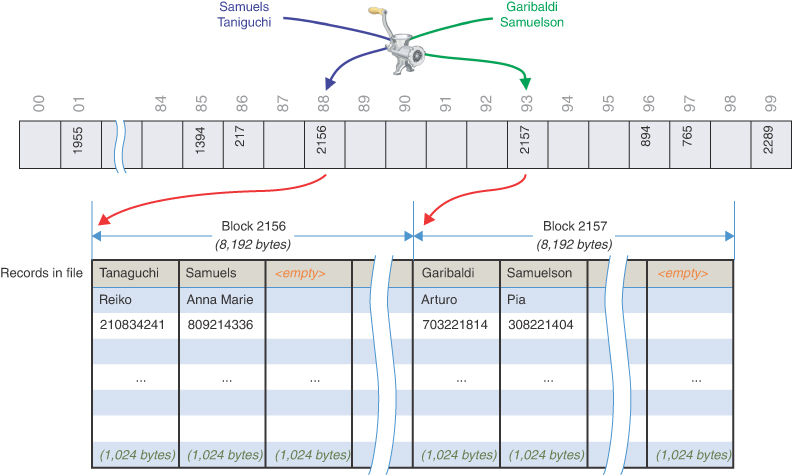

图 11-21 散列到外部块
具有散列为相同值的键的所有记录都位于同一个块中。为了找到具有特定键的记录，搜索算法对键进行哈希处理，使用哈希值作为哈希表的索引，获取该索引处的块号，然后读取块。在图 11-21 的示例中，名称 Samuels 散列到 100 块索引中的地址 88。其中包含块号 2156。从磁盘读取该块允许算法检索 Samuels 的完整记录。像 Samuelson 这样的相似名字可以散列到一个非常不同的地址，在示例中为 93，并存储在另一个块中。像 Taniguchi 这样的不同名字可以像 Samuels 一样散列到相同的表地址和块。新密钥可能散列到没有块号的空单元格。
这个过程是有效的，因为只需要一个块访问来定位一个给定的项目。缺点是浪费了大量磁盘空间，因为块在设计上未满。图 11-21 中的示例显示了两个块，每个块仅包含两条记录。为了获得最佳性能，负载因子需要保持在 0.5 到 1.0 之间。
要实现此方案，你必须谨慎选择散列函数和散列表的大小，以便有限数量的键散列为相同的值。在此示例中，平均每个键只需要四个记录。

### 全块

即使有一个好的哈希函数，一个块偶尔也会变满。这种情况可以使用针对内部哈希表讨论的冲突解决方案的变体来处理：开放寻址和单独链接。
在开放寻址中，如果在插入过程中发现一个块已满，则该算法会将新记录插入到相邻块中。在线性探测中，这是下一个块，但也可以使用双重散列来选择它。在单独的链接中，可以使用特殊的溢出块；当发现主块已满时，将新记录插入溢出块。可以链接溢出块以允许大量溢出，尽管这些会显着影响性能。
满块是不可取的，因为第二个和任何后续溢出块需要额外的磁盘访问；并且磁盘块访问时间可能比内存访问长数十或数千倍。然而，如果这种情况很少发生，那么这样长的访问时间可能仍然是可以接受的。
我们只讨论了外部存储的最简单的哈希表实现。对图 11-21 所示示例的一个简单改进是，除了块号之外，还向哈希表添加记录索引。这将允许在块内的记录被读取后以恒定的时间检索每个单元格中仅几个字节的存储空间。还有许多更复杂的方法超出了本书的范围。

## 概括
- 哈希表基于数组。
- 可能的键值范围通常大于数组的大小。
- 键值通过散列函数散列为数字。
- 散列数被映射到称为散列地址的数组索引，通常使用模运算。
- 英语词典（其中单词是键，定义是值）是可以使用哈希表有效处理的数据库的典型示例。
- 将一个键散列到填充有不同键的数组单元称为冲突。
- 可以通过两种主要方式处理冲突：开放寻址和分离链接。
- 在开放寻址中，散列到完整数组单元的数据项被放置在数组中的另一个单元中，通过遵循规定的探测序列来选择。
- 在单独的链中，每个数组元素都由一个链表或二叉树组成。散列到给定数组索引的所有数据项都插入到该链接结构中。
- 我们讨论了三种开放寻址探测序列：线性探测、二次探测和双重哈希。
- 在线性探测中，步长始终为 1，因此如果 x 是由散列函数计算出的散列地址，则探测将转到 x、x+1、x+2、x+3 等。
- 在线性探测中，可能会出现连续的填充单元序列。它们被称为主集群，它们会降低性能。
- 在二次探测中，哈希地址 x 的偏移量是步数的平方，因此探测会到达 x、x+1、x+4、x+9、x+16 等。
- 二次探测消除了主要聚类，但受到不太严重的次要聚类的影响。
- 二次聚类的发生是因为散列为相同值的所有键在探测期间都遵循相同的步骤序列。
- 散列为相同值的所有键在二次探测中遵循相同的探测序列，因为步长不依赖于键。
- 二次探测仅访问（或覆盖）哈希表中大约一半的单元格。
- 在双重哈希中，步长取决于密钥并从二级哈希函数中获得。
- 如果二级散列函数在双重散列中返回值 s，则探测将转到 x、x+s、x+2s、x+3s、x+4s 等，其中 s 取决于密钥但在整个过程中保持不变探测。
- 找到指定项目所需的探测单元数称为探测长度。
- 负载因子是存储在哈希表中的数据项的数量与表大小的比率。
- 开放寻址的最大负载因子应该在 0.5 左右。对于此负载因子的双哈希，不成功的搜索的平均探测长度为 2。
- 当负载因子在开放式寻址中接近 1.0 时，搜索时间会变得无穷大。
- 开放寻址哈希表不要变得太满是至关重要的。
- 负载因子 1.0 适用于单独链接。
- 在负载因子为 1.0 时，单独链接中的成功搜索的平均探测长度为 1.5，不成功的搜索为 2.0。
- 使用列表的单独链接中的探测长度随负载因子线性增加。
- 使用平衡二叉树的单独链接中的探测长度随负载因子呈对数增长。
- 通过适当地管理负载因子以限制探测长度和冲突，哈希表在搜索、插入和删除单个项目时具有有效的 O(1) 性能。
- 遍历哈希表需要 O(N) 时间，其中 N 是插入的最大项目数。
- 哈希表需要 O(N) 存储空间，并且比简单数组存储 N 项占用更多空间。
- 可以通过将每个字符的数值乘以常数的不同幂并将乘积相加来散列字符串。
- 为避免大数溢出，如果使用多项式函数和 Horner 方法，你可以在过程的每一步应用模运算符。
- 哈希表的大小一般应该是质数。使用质数有助于在不知道密钥分布的情况下最大程度地减少冲突的可能性。
- 当哈希表呈指数增长时，插入 N 项的成本仍然是 O(N)，即使在表的每次翻倍时都必须重新插入许多项。
- 哈希表可用于外部存储。一种方法是让哈希表中的元素包含磁盘文件块号。这些块包含有限数量的记录，因此负载因子保持较低。

## 问题
这些问题旨在作为读者的自测。答案可以在附录 C 中找到。
1. 使用大 O 表示法，（理想情况下）需要多长时间才能在哈希表中找到一个项目？
2. A(n) __________ 将一系列键值转换为一个（可能很大的）数字，该数字可以映射到一系列索引值。
3. 用于将大数值范围映射为小数值范围的典型操作是__________。
4. 当不同的键映射到哈希表中的同一个索引时，会发生________。
5. 开放寻址是指
   1. 保持阵列中的许多单元格未被占用。
   2. 使用散列函数中的参数来扩展它可以寻址的单元格范围。
   3. 在单元格 x+1、x+2 等处探测，直到找到空单元格。
   4. 当原来的位置被占用时，寻找数组中的另一个位置。

6. 通过测试哈希表中的相邻单元格来搜索关键字称为 ______。
7. 二次探测中原始地址的前五个偏移量是多少？
8. 二次聚类的发生是因为
   1. 许多键散列到同一位置。
   2. 步长的顺序总是相同的。
   3. 插入了太多具有相同键的项目。
   4. 哈希函数将键映射到周期性组中。

9. 双重哈希
   1. 应该使用与哈希地址不同的哈希函数，并根据哈希值计算步长。
   2. 将相同的哈希函数应用于哈希地址，而不是密钥，以获得下一个哈希地址。
   3. 分离链接比开放寻址更有效。
   4. 将搜索时间减少两倍。

10. 单独链接涉及在每个哈希表单元格中使用 a(n) \_\_\_\_\_\_\_\_\_\_\_ 或 \_\_\_\_\_\_\_\_\_\_\_\_。
11. 分离链中合理的负载因子是________。
12. 判断对错：一个可能的字符串散列函数涉及将每个字符值乘以一个随字符位置增加的幂的数字。
13. 通常，哈希表的大小应_________ 以尽量减少冲突次数。
14. 如果在散列函数中使用数字折叠，则每组中的数字个数应反映 ______。
15. 在哪些开放地址探测方法中，搜索不成功比搜索成功花费的时间长？
16. separate chaining with linked lists，插入新项的时间
    1. 随着负载因子的对数增加。
    2. 与表中项目与表单元格数的比率成正比。
    3. 与列表的数量成正比。
    4. 与表格中填充单元格的百分比成正比。

17. 当插入超过阈值时哈希表的大小加倍或超过两倍并且必须将项目重新散列到数组中时，插入 N 项所花费的总时间是
    1.  O(log N) 时间。
    2. 准时。
    3. O(N×log N) 时间。
    4. O(N^2^) 时间。


18. 在存储完全相同的 N 项集合时，对这些数据结构的"未使用"内存进行排序：排序链表、AVL 树和使用双哈希和负载因子 0.6 的开放寻址哈希表。未使用的内存是指已分配但未填充（或未填充）的单元格或字段，而不是值或链接到另一个结构。

19. 判断对错：在外部哈希中，块永远不会变满很重要。

20. 在外部散列中，所有键散列为相同值的记录都位于\_\_\_\_\_\_\_\_\_\_。

## 实验
进行这些实验将有助于深入了解本章所涵盖的主题。不涉及编程。
11-A 一个人登上一列长途火车并寻找一个空座位，以及汽车进入高速公路，这与开放寻址寻找空单元格来存放物品的方式非常相似。你能想到像独立链一样的真实世界流程吗？想一想这样的情况，在这些情况下，人们或事物的去向有一些初始选择，然后根据第一选择在列表中搜索以找到他们的最终目的地。当你想到一个时，发生碰撞的可能性有多大？你能想出基于哈希表结构使现实世界的流程更高效的方法吗？

11-B 这需要一点数学知识。需要多少人参加聚会才能使他们更有可能共享出生月份（而不是生日）？对于这个问题，假设所有十二个出生月份的可能性均等。如果聚会上只有一个人，那么他们的出生月份一定是独一无二的。第二个人将有一个独特的出生月份，可能性为 11/12。第三个人将有一个唯一的出生月份，可能性为 10/12，依此类推。所有人都有不同出生月份的可能性是这些可能性的产物。将它们相乘，找出何时具有唯一出生月份的组合可能性低于 50%。

11-C 散列的思想可以用在排序中。在第 3 章"简单排序"和第 7 章"高级排序"中，我们介绍了多种排序方法。哪些使用散列或类似的东西来排列项目？

11-D 使用 HashTableOpenAddressing 可视化工具，制作一个小型二次哈希表，其大小不是质数，比如 24，最大负载因子为 0.9，这样它就不会增长。将它装满，比如 20 件随机物品。现在搜索不存在的键值。尝试不同的键，直到找到一个使二次探针进入无休止序列的键。这种重复序列的发生是因为二次步长模数组大小形成了一个重复序列。

重复实验，但这次使用质数作为数组大小，比如 23。你能找到不存在的键来导致类似的无休止序列吗？

11-E 使用 HashTableChaining 工具，创建一个包含 11 个单元且最大负载系数为 1.99 的数组以允许高密度。接下来，用 20 个随机项目填充它。检查显示的链接列表。最长的列表是什么？将所有这些链表的长度相加，然后除以链表数，得到链表的平均长度。平均而言，你需要在一次不成功的搜索中搜索这个长度。 （实际上，有一种更快的方法可以找到这个平均长度。它是什么？）

## 编程项目
编写程序来解决编程项目有助于巩固你对材料的理解并演示如何应用本章的概念。 （如简介中所述，合格的讲师可以在出版商的网站上获得编程项目的完整解决方案。）
**11.1** 为 HashTable 实现一个新方法，该方法查找由于冲突而未放置在开放寻址哈希表中的初始哈希位置的所有键。显示最大负载因子为 0.5、0.7 和 0.9（换言之，在九种不同条件下：三个探测方案乘以三个负载因子）的哈希表中线性、二次和双哈希探测的置换键的计数。

冲突的数量在很大程度上取决于插入表中的键的分布。你应该使用随机生成的密钥多次运行测试，因为结果会因每组而异。确保使用相同的一组键插入到每个不同的哈希表类型中，以进行合理的比较。你可以通过导入 random 模块并评估来生成 [0, 999] 范围内的 200 个随机整数

```python
random.sample(range(1000), 200)
```

使用 random.sample() 函数保证序列中不会有重复的键。初始化大小为 103 的哈希表，以减少某些探测序列无法在小表中找到空单元格的可能性。多次运行你的测试以查看某些探测算法是否明显优于或低于其他算法。

**11.2** 编写两个散列函数，实现本章"折叠"部分描述的数字折叠方法。其中一个功能应该折叠三位数的组和其他两位数的组。使用这些函数创建两个具有线性探测的 HashTable 对象和项目 11.1 中的置换键计数方法。编写一个程序，用 random.sample(range(10000000000), 1000) 生成的一千个随机 10 位整数填充这两个哈希表。显示两个散列函数和相同的三个最大负载因子：0.5、0.7 和 0.9 的置换键的计数。

访问正数中的一组 K 位数字可能比你想象的要容易。你能否概括折叠哈希函数以处理任意数量的数字，或者甚至可以处理折叠范围的任何数字，而不仅仅是 10K？

**11.3** 探索当哈希表大小是 2 的幂而不是质数时会发生什么。重写 HashTable.__growTable() 方法，使其将表的大小加倍，而不会找到下一个比它大的素数。使用与 Project 11.1 中相同的条件，但哈希表的起始大小为 128。插入的 200 个键将迫使表至少增长一次，并且它应该保持 2 的幂。

使用非素数的表大小会增加发生冲突的可能性，以至于当探测序列用完所有要尝试的单元格时，你可能会遇到 insert() 方法引发的异常（参见清单 11- 5).仅某些密钥分布会发生异常，因此你可能需要使用不同的值来为随机数生成器提供种子以导致异常。确保捕获异常并记录特定探测序列和负载因子的问题。同一组密钥可能适用于一个探测序列，但不适用于其他探测序列。

与项目 11.1 一样，显示九种不同条件下的移位键数：三个探测方案乘以三个负载因子。如果在特定条件下无法插入 200 个密钥，也显示该条件。

**11.4** 清单 11-10 中的双哈希步长计算使用了 simplehash() 函数。用乘法散列函数替换该函数，该函数是"散列字符串"部分中描述的 Horner 方法的变体，只是它设计用于处理整数散列键。整数键可以被视为字节序列。你可以通过使用 Python 中的位掩码 N & 0xFF 从大整数 N 中获取最低字节。循环遍历字节并计算从 0 开始的散列值。在每次迭代中，当前散列值乘以一个素数，低字节加上另一个素数，以获得散列值的下一个值。乘以一个质数并添加另一个质数有助于分散密钥的每一位对散列值的影响。

生成一个类似表 11-2 的表，显示从范围 [0, 99999] 中随机选择的 20 个整数键的插入。显示乘法散列地址以及带有小质数的模数以得出步长。你需要编写一些代码来生成探测序列，并在将项目插入哈希表之前查看存储的值，以便显示表的最后一列。

**11.5** 哈希表非常适合计算文本中单词使用次数之类的任务。通过一次一个单词地浏览文本，你可以检查哈希表以查看该单词是否已经出现过。如果没有，则该词作为键值插入到哈希表中，值为 1。如果已经看到，则更新该表以保存递增的计数。遍历完成的哈希表得到总字数。

编写一个程序来读取文本文件，提取单个单词，使用哈希表计算它们出现的次数，然后打印出所有不同单词及其计数的列表。要在 Python 中获取文本文件的行，可以使用类似 for line in open('myfile.text', 'r') 的循环。要从行中获取单词，你可以使用类似 for word in line.split() 的循环，它会在空白字符处拆分字符串。要从单词中删除前导和尾随标点符号，你可以使用字符串的 strip() 方法，如 word.strip('()<>[]{}-_,.?!:;"')。这例如，会将"（open-addressing！）"转换为"open-addressing"。对于不区分大小写的字数统计，你可以使用字符串的 lower() 方法将所有字符变为小写。显示程序的输出在短文本文件上运行。
