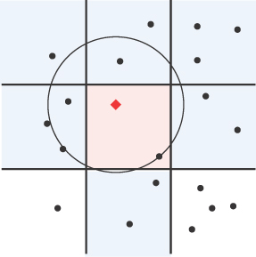
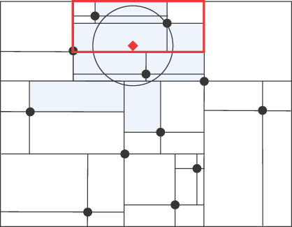

# 空间数据结构

在这一章当中

- 空间数据
- 计算点之间的距离
- 圆圈和边界框
- 搜索空间数据
- 点列表
- 网格
- 四叉树
- 理论性能和优化
- 实际考虑
- 进一步扩展

到目前为止，我们所有的数据结构都存储了包含用于识别它们的密钥的记录。 当你想找到与键完全匹配的记录时，这是完美的。 当你想要按位置识别物品时怎么办？例如，查找特定位置一定距离内的所有杂货店？ 对于该任务，你需要一个结构，该结构使用两个单独的数字键来标识与空间中的点对应的记录的位置。
尽管这对数字可能看起来是一个数字键的简单扩展，但必须显着改变数据结构才能使所需的操作有效地发生。 空间中点的性质及其距离驱动了大部分设计。 我们首先研究表示空间中点的方法，然后研究存储与这些点相关联的记录的三种方法。 我们最后讨论了你可以从这些结构中获得的性能以及其他领域所需的一些扩展。

## 空间数据
具有位置属性的数据称为空间数据。 空间数据包括笛卡尔坐标和地理坐标。

### 笛卡尔坐标

空间数据的最简单形式对应于平面上的点。 每个点都由一对数字表示，这些数字指定其在表面上的 X 和 Y 坐标，通常写为 (x, y)。 平面上的这些 (x, y) 坐标称为笛卡尔坐标，由法国数学家笛卡尔发明。 例如，如果你正在编写足球比赛的模拟程序，你可以使用笛卡尔坐标来表示每个球员在场上的位置。 因为足球场是地球表面的一小部分，你可以很方便地假装球场表面是完全平坦的，所以使用笛卡尔坐标是合适的。
笛卡尔坐标可以使用任何方便的距离单位来表示——例如，屏幕上的像素，或运动场上的英尺或米。 选择的确切单位对应用程序很重要，但如果两个维度的单位相同，则不会影响数据结构和算法。

### 地理坐标

地球表面的空间数据点通常由一对指定纬度（从赤道向北或向南的角度）和经度（从英国格林威治本初子午线向东或向西的角度）的数字表示。 一些应用程序还需要第三个值，该第三个值对应于地球表面或地球表面上方的高度。 在本章中，我们只考虑地球表面上的点，即海平面上的点。
图 12-1 显示了地球是如何被蓝色的赤道和红色的本初子午线分成半球的。 例如，加拿大渥太华的位置大约为（45.30096°，–75.81689°），如小绿点所示。 负经度表示该点位于本初子午线以西。 南非约翰内斯堡的位置大约是 (–26.17643°, 28.04551°)，由另一个点标记。 负纬度表示约翰内斯堡位于赤道以南。 纬度、经度坐标称为地理坐标。


图 12-1 地理坐标使用经度和纬度
## 计算点之间的距离

在本章后面，我们将了解支持在指定的笛卡尔坐标或地理坐标处或附近搜索记录的数据结构。 要进行这些计算，你需要能够计算两个空间数据点之间的距离。 这种计算对于笛卡尔坐标很容易实现，而对于地理坐标则稍微复杂一些。

### 笛卡尔坐标之间的距离

要计算笛卡尔坐标指定的两点之间的距离，你可以使用熟悉的毕达哥拉斯定理，即斜边的长度平方是直角三角形边的平方和。 因为这些点是由它们在 X 和 Y 轴上的坐标定义的，所以你可以将直角三角形与轴对齐以确定有时称为欧几里德距离的距离。 如果两点分别在(x~1~, y~1~)和(x~2~, y~2~)，那么两点之间的欧式距离d为
$$
d = \sqrt{(x_{2} - x_{1})^{2} + (y_{2} - y_{1})^{2}}
$$

在 Python 中实现这个距离度量很简单，如清单 12-1 所示。 此公式的结果与输入的笛卡尔坐标采用相同的测量单位。
清单 12-1 笛卡尔坐标之间的欧几里得距离

```python
# return the Euclidean distance between points (x1,y1) and (x2,y2)
def euclideanDistance(x1, y1, x2, y2):
    dx = x2 - x1
    dy = y2 - y1
    return (dx * dx + dy * dy) ** 0.5
```

### 地理坐标之间的距离

计算地理坐标之间的距离更为复杂。 首先，地理坐标被指定为地球上的纬度和经度角度——这并不直接对应于以长度单位表示的距离。 其次，地球表面既不是平坦的也不是完美的球形，这使计算更加复杂。 有许多方法可以计算地理坐标之间的距离。 计算的准确性取决于所使用的简化假设和近似值。
球体上两点之间的最短路径位于大圆的曲线上。 要获得大圆，请取包含两点和球体中心的平面，并将其与球体本身相交。 使用欧几里德距离计算渥太华和约翰内斯堡之间的距离只有在你可以直线穿过地球时才有用。 即使在图 12-1 中画出的一条直线看起来直达两点之间，也不一定是最短路径。 为确保路径最短，它必须位于连接它们的大圆路径上。 这就是为什么从纽约飞往西班牙的航班沿弯曲的路径飞向北极，而不是像典型地图所暗示的那样向东飞行。
haversine 公式计算球体上两个地理坐标之间的大圆距离。 虽然地球不是一个完美的球体，但 haversine 公式将给出 0.5% 以内的正确答案。 这应该足以找到最近的机场或咖啡店，但对于其他应用程序可能不够准确。 两个地理坐标之间的距离的 haversine 公式是
$$
d = 2R\arcsin \sqrt{\sin^{2} \left ( \frac{\bigtriangleup \phi }{2}  \right ) + \cos \phi _{1} \cos \phi _{2} \sin^{2}\left ( \frac{\bigtriangleup \lambda }{2}  \right )  } 
$$

其中

- R是地球的半径
- 是两点的纬度
- 是两点的纬度差
- 是两点的经度之差。

虽然这个公式看起来相当令人生畏，但 Python 实现很简单，如清单 12-2 所示。
清单 12-2 Haversine 距离的 Python 实现

```python
from math import *

RADIUS_OF_EARTH = 6371  # radius in kilometers

# return the haversine distance between (lon1, lat1) and (lon2, lat2)
def haversineDistance(lon1, lat1, lon2, lat2):
    lat1 = radians(lat1)  # trig functions need radians
    lon1 = radians(lon1)
    lat2 = radians(lat2)
    lon2 = radians(lon2)

    dLon = lon2 - lon1  # difference of longitudes
    dLat = lat2 - lat1  # difference of latitudes
    # Haversine formula:
    a = sin(dLat / 2) ** 2
    if dLon != 0:  # save some trig for dLon == 0
        a += cos(lat1) * cos(lat2) * sin(dLon / 2) ** 2

    # Numerical issues at antipodal points requires min, max:
    return 2 * RADIUS_OF_EARTH * asin(min(1, max(a, 0) ** 0.5))
```

值得注意的是，在英语中，地理坐标通常被称为"纬度、经度"对。 但是，当你编写代码以统一支持笛卡尔坐标或地理坐标时，将地理坐标称为"经度、纬度"对更有意义。 简而言之，经度角对应于沿赤道的值，类似于沿笛卡尔 X 轴的点。 同样，纬度角对应于沿南北经线的值，类似于笛卡尔 Y 轴。 我们为空间数据结构提供的类定义中的方法接受"a、b"对来指定空间位置，然后将其适当地解释为表示 x、y 或经度、纬度坐标。 尽管欧几里德距离适用于任何单位，但半正弦距离的这种定义总是返回以公里为单位的距离，因为地球的半径是以这种方式指定的。

## 圆圈和边界框

在处理空间数据时，你经常需要确定点是否位于特定区域内。 例如，你可能想知道特定地理坐标是位于特定国家/地区内还是位于财产边界内。 可以检查多种区域。 最简单和最常见的两种是圆形和盒形区域。 在许多情况下，你将需要使用距离计算来确定一个点是在这些区域之一的内部还是外部。

### 澄清距离和圆

当你开始搜索离查询点最近的数据点时，尚未考虑任何数据点时，可以方便地将查询点到最近点的初始距离视为无穷大——换句话说， 一个任意大的数字。 Python 数学模块方便地提供了一个预定义常量 math.inf，它比任何其他 int 或 float 数字都大。 （在 Python 3.5 之前的版本中，无穷大的常量由表达式 float('inf') 产生，它仍然可以使用。）随着搜索的进行，并遇到后续的点，该距离变为有限数，这 随着更靠近查询点的点被识别出来，它逐渐变小。
在直角坐标系中，在搜索的任何一步，都可以把查询点连同到最近点的距离一起想成在查询点周围定义一个圆，其半径等于到当前最近点的距离。
在地理坐标中，当绘制在纬度线和经度线以均匀分隔度数（称为墨卡托投影）间隔开的网格上时，等距曲线不是完美的圆。 事实上，这就是导致在某些地图上查看时陆地明显扭曲的原因。 例如，在两极附近，子午线比在赤道附近靠得更近。
这些距离的变化如图 12-2 所示，其中用蓝色绘制了三个 1,000 公里的路径。 在地球上绘制的路径与从太空中看到的路径相同，在使用墨卡托投影的地图上绘制，经度和纬度网格线各相隔 10 度。 冰岛周围的路径看起来比墨卡托投影中以巴西海岸为中心的路径大得多，尽管两者的直径相等。 围绕南美洲南端火地岛尖端的路径（在地球投影中仅部分可见）的直径也是相同的。


图 12-2 比较地球上不同点的 1000 公里圆
在接下来的几页中，当我们讨论查询圆时，请记住，有时圆并不是真正的圆形。 术语查询圆用于指代距查询点恒定距离的曲线，根据地图视点的不同，它可能看起来并不总是完美的圆形。 我们的计算解释了这种明显的失真。

### 边界框

正如我们刚刚提到的，当使用地理坐标时，一个半径为恒定距离的查询圆在投影到经纬度间距均匀的地图网格上时看起来并不像一个圆。 对于远离赤道的地理坐标查询圆，圆开始看起来更像一个椭圆体。 此外，查询圆的最宽部分并不直接位于查询圆中心的正东或正西，因为它在赤道或笛卡尔坐标中。 例如，当搜索圈从赤道向北移动时，搜索圈会变得越来越扁平，并且搜索圈最宽的部分会向圆心以北移动。
在接下来的几页中，我们将研究将空间划分为矩形块的数据结构。 为了搜索特定点，算法会反复检查查询圆是否与包含数据点的特定矩形空间相交。 确定圆形和矩形是否相交在计算上可能很复杂，更重要的是，变形的椭圆体和矩形是否相交。
简化这些重复查询圆-矩形相交计算的一种方法是通过矩形边界框来近似查询圆，该边界框在笛卡尔坐标或地理坐标中紧贴查询圆。 正如你将看到的，确定两个矩形是否相交是一项快速而简单的计算。 如果查询圆的边界框不与空间矩形相交，则可以确定查询圆本身不可能与空间矩形相交。 只有当边界框确实与空间矩形相交时，你才需要进行更详细的计算以尝试在该矩形内找到与查询点匹配或在查询点附近的点。

### 笛卡尔坐标系中查询圆的边界框

在笛卡尔坐标中，你可以轻松识别半径为 r、圆心位于 a、b 的查询圆边界的左、右、上、下坐标，如图 12-3 所示。 左边界位于 a – r。 右边界位于 a + r。 垂直边界是相似的。


图 12-3 笛卡尔坐标系中圆的边界框

### 地理坐标中查询圆的边界框

如何确定地理坐标中半径为 r 的查询圆的边界框？ 很明显，你需要计算经度和纬度的界限，但是如何计算呢？ 解决此问题的公式（此处显示）采用了超出本文范围的球面几何方法。
$$
\bigtriangleup _{long} = \arcsin \left [ \frac{\sin \left ( \frac{r}{R}  \right ) }{\sin \left ( \frac{\pi }{2} -B \right ) }  \right ] 
$$

$$
\bigtriangleup _{lat} = \frac{r}{R} 
$$

你无需了解详细的数学知识即可创建计算和使用地理坐标中搜索圆边界框的方法。 前面的方程和图 12-4 中的图表显示了如何计算从查询圆的中心到其边界框边缘的经度宽度和纬度高度，其中

- r 是查询圆的半径。
- R是地球的半径。
- B是查询圆的a、b中心的纬度b，用弧度表示，而不是度数。
- (Δ~long~) 是从中心到查询圆最宽点的经度宽度（以弧度为单位）。
- (Δ~lat~) 是从中心到查询圆的顶部或底部的纬度高度（以弧度为单位）。


图 12-4 地理坐标中查询圆的边界框
请注意，查询圆的最宽点可能不在中心的正东。 图中所示的示例说明了这种失真，导致圆的最宽部分在垂直方向上略微偏离纬度 b。
在 Python 中实现边界框

我们使用 Bounds 类及其 CircleBounds 子类在 Python 中表示所有类型的边界框，如清单 12-3 所示。
清单 12-3 创建和调整边界对象

```python
class Bounds(object):
    def __init__(self, left=-inf, right=inf, top=inf, bottom=-inf):
        Bounds.adjust(self, left, right, top, bottom)

    # mutator to initialize/change bounds in existing object
    def adjust(self, left, right, top, bottom):
        self.__l = left
        self.__r = right
        self.__t = top
        self.__b = bottom

    # return a new Bounds, where some of the
    # current boundaries have been adjusted
    def adjusted(self, left=None, right=None, top=None, bottom=None):

        if left is None:
            left = self.__l
        if right is None:
            right = self.__r
        if top is None:
            top = self.__t
        if bottom is None:
            bottom = self.__b

        return Bounds(left, right, top, bottom)
```

清单 12-3 中显示的 Bounds 类的实例存储笛卡尔或地理空间矩形部分的左、右、上、下边界的坐标。 你可以通过调用构造函数来创建新的 Bounds 对象，如以下代码片段所示：

```python
b = Bounds(-125.6, -60.8, 49.72, 23.77)
```

返回的对象表示美国大陆的大致矩形边界，其左边界在经度 –125.6 度，右边界在经度 –60.8 度，上边界在纬度 49.72 度，下边界在纬度 23.77 度。
调用不带参数的 Bounds() 会产生一个无限大的矩形。 增变器方法 adjust() 使客户端代码和构造函数能够更新私有属性。
一个名为 adjusted() 的单独方法创建并返回一个从当前对象派生的新 Bounds 对象，并用新值替换部分或所有边界。

### CircleBounds 子类

Bounds 的 CircleBounds 子类，如清单 12-4 所示，创建了一个包含一个圆的框。
清单 12-4 初始化和调整 CircleBounds 对象

```python
# A bounding box that surrounds a search circle. Properly handles
# distorted circles resulting from geographic coordinates.
class CircleBounds(Bounds):
    # create the bounding box that surrounds the search
    # circle at a,b,r using the specified distance function
    def __init__(self, a, b, r, func):
        # remember the circle's parameters for later
        self.__a, self.__b, self.__r = a, b, r
        self.__func = func

        # get the width/height of the bounding box
        deltaA, deltaB = self.__deltas(a, b, r, func)

        # initialize the superclass's rectangular bounds
        super().__init__(
            a - deltaA, a + deltaA, b + deltaB, b - deltaB  # left  # right  # top
        )  # bottom

    # if the circle's radius changed, mutate its bounds
    def adjust(self, r):
        if r != self.__r:
            self.__r = r

            # new dimensions of bounding box
            deltaA, deltaB = self.__deltas(self.__a, self.__b, r, self.__func)

            # update the box
            super().adjust(
                self.__a - deltaA,  # left
                self.__a + deltaA,  # right
                self.__b + deltaB,  # top
                self.__b - deltaB,
            )  # bottom
```

用户通过使用圆心的 a、b 坐标、圆的半径和对距离函数的引用调用构造函数来创建新的 CircleBounds 对象，如以下代码片段所示：

```python
c = CircleBounds(38.736, -9.142, 3.14, haversineDistance)
```

此代码段创建了一个 CircleBounds 对象，该对象代表以葡萄牙里斯本为中心、半径为 3.14 公里的圆周围的矩形边界。
如清单 12-4 所示，构造函数将参数保存在私有属性中——稍后可能由调整圆半径的 adjust() 增变器方法使用。 给定圆的 a、b 坐标和半径 r，构造函数获得从圆心到圆上最宽点和最高点的距离，称为 deltaA 和 deltaB。 最后，构造函数使用这两个距离来调用具有圆的矩形边界的超类的构造函数。
客户端可以使用新的圆半径值来调用 adjust() 增变器。 如果 adjust() 确定半径已更改，则重新计算 deltaA 和 deltaB，然后超类的 adjust() 方法用新计算的边界替换矩形边界。
剩下要讨论的是如何计算 deltaA 和 deltaB 距离，如清单 12-5 中的 \_\_deltas() 方法所示。 该方法实现了图12-3和图12-4中两种圆的宽和高的计算。 对于无限半径圆或笛卡尔坐标，deltaA 和 deltaB 只是搜索圆的半径。 对于地理坐标，deltaA 和 deltaB 使用前面的复杂公式计算，并分别替代图 12-4 中的 Δ~long~ 和 Δ~lat~。
清单 12-5 计算围绕一个圆的边界框的宽度和高度

```python
class CircleBounds(Bounds):
…
    def __deltas(self, a, b, r, func):
        # When r is infinity, bounds are always infinite
        # For cartesian coordinates, the edges of the bounding
        # box are r away from the center of the search circle.
        if r == inf or func == euclideanDistance:
            deltaA = deltaB = r

        else:  # geographic coordinates
            # The width of the bounding box is determined by
            # the width of the distorted circle at its widest point.
            alpha = r / RADIUS_OF_EARTH
            gamma = radians(90 - abs(b))  # b is latitude

            # if the circle itself crosses the pole then
            # alpha >= gamma, so we set deltaA as inf,
            # effectively treating the width as if it were inf
            deltaA = inf if alpha >= gamma else degrees(asin(sin(alpha) / sin(gamma)))
            deltaB = degrees(alpha)

        return deltaA, deltaB
```

回想一下，对于地理坐标，查询圆在接近任一极点时会逐渐变平。 如果圆心在极点的查询半径内，则圆超出极点（换句话说，极点位于查询圆内）。 当 alpha 变量超过 gamma 变量时，代码中会检测到这种情况，这可能会导致用于计算 deltaA 的反正弦函数的值未定义。 在这种情况下，它不会计算反正弦，而是将 deltaA 设置为无穷大，因为搜索圆一直围绕着极点。

### 确定两个边界对象是否相交

在本章后面的 Grid 和 QuadTree 类的讨论中，一些方法需要确定由它们的 Bounds 对象定义的两个矩形是否相交。 如果一个矩形完全位于另一个矩形的左侧或完全位于另一个矩形的上方，则可以通过简单观察它们不相交来确定两个矩形是否相交。
如图 12-5 所示，矩形 2、3 和 4 不与矩形 1 相交，因为它们都在矩形 1 的正上方或侧面。然而，矩形 5 确实与矩形 1 相交。


对于任意两个矩形 A 和 B，如果以下伪代码表达式为真，则可以说它们不相交：

(A is to the left of B) or (B is to the left of A) or (A is above B) or (B is above A)

因此，要确定矩形 A 和 B 是否相交，你只需否定整个表达式并简化，结果是

(A is NOT to the left of B) and (B is NOT to the left of A) and (A is NOT above B) and (B is NOT above A)

检查矩形 1 和 5，你可以看到后一个表达式的计算结果为 True，因此矩形 1 和 5 相交。
清单 12-6 中的代码显示了 intersects() 方法的简单实现。 它使用不相交定义的否定。
清单 12-6 确定边界对象是否相交

```python
class Bounds(object):
…
    # return True if bounds of the rectangles intersect.
    # Two rectangles don't intersect if one is totally to
    # the left of or above the other. So we negate to
    # determine if they do intersect.
    def intersects(self, other):
        return not (
            # check if self's box is to left or right of other
            self.__r < other.__l
            or self.__l > other.__r
            or
            # check if self's box is above or below other
            self.__b > other.__t
            or self.__t < other.__b
        )
```

### 确定一个边界对象是否完全位于另一个边界内

你很快就会看到，一些方法还需要确定圆的边界是否完全适合网格上正方形单元子集的边界。
图 12-6 说明了一个示例场景，你想要确定以黑色绘制的圆及其以红色绘制的边界框是否完全位于网格单元的蓝色阴影正方形内。 如果你有一个用蓝色阴影区域的边界初始化的 Bounds 对象，以及另一个用围绕圆的边界框初始化的 CircleBounds 对象，则很容易确定圆是否适合蓝色框，如 within() 所示 清单 12-7 中的方法。


图 12-6 另一个 Bounds 对象中的 CircleBounds
清单 12-7 确定一个边界对象是否位于另一个边界对象内

```python
class Bounds(object):
…
    # return True if the bounds of self fall within other
    def within(self, other):
        return (
            self.__r < other.__r
            and self.__l > other.__l
            and self.__t < other.__t
            and self.__b > other.__b
        )
```

请注意，within() 的相同定义用于 Bounds 和 CircleBounds 对象。 这对于搜索数据结构的目的来说已经足够好了，但无法正确确定一个 CircleBounds 对象的圆是否真正在（或什至重叠）另一个 CircleBounds 对象的圆内。

## 搜索空间数据

现在我们已经处理了这些几何基础知识，我们可以专注于搜索空间数据点集合以找到与查询点的精确匹配或找到与查询点最接近的匹配的有趣挑战。 要找到最接近的匹配，我们需要指定接近的含义； 换句话说，应该使用哪个距离函数来比较查询点和候选数据点？ 如果空间数据由笛卡尔坐标组成，则 euclideanDistance() 函数将是合适的。 如果空间数据由地理坐标组成，则 haversineDistance() 函数将是合适的。
在以下部分中，我们将了解几个实现数据结构和算法以支持精确匹配和最接近匹配空间搜索的类。 这些类在代码复杂性和 大 O 性能方面有所不同，因此它们的适用性取决于你尝试处理的数据量和分布。 重要的问题是如何处理使用坐标作为键以及搜索时如何处理距离。 首先，我们从一个简单的方法开始。 然后我们添加更复杂的结构来提高性能。 最后，我们看看不同方法之间的权衡。

### 点列表

如果你想支持少量点的空间数据搜索，将空间数据点存储在你已经见过的一种结构中可能是合适的，例如数组或列表。 然后通过遍历项目来查询空间数据以找到与查询点完全匹配或最接近的匹配。 这种蛮力方法是最简单的可能解决方案，但由于这种简单性，大 O 性能是 O(N) 来搜索精确或最接近的匹配项。 换句话说，要使用强力进行空间搜索，代码必须将查询点与存储在结构中的每个点进行比较。

### 创建 PointList 类的实例

我们将使用一个简单的 Python 列表（数组）来保存 PointList 类中的项目集合。 客户端代码通过调用构造函数创建包含笛卡尔点的对象来创建 PointList 类的实例：

```python
b = PointList('cartesian')
```

或者包含地理点：

```python
b = PointList('geographic')
```

如果向构造函数传递除"笛卡尔"或"地理"以外的任何字符串，则会引发异常。
清单 12-8 PointList 构造函数

```python
class PointList(object):
    def __init__(self, kind):  # must specify type of coordinate
        if kind == "cartesian":
            self.__distance = euclideanDistance
        elif kind == "geographic":
            self.__distance = haversineDistance
        else:
            raise Exception("Invalid kind of coordinate")

        self.__points = []  # keep track of inserted points
```

清单 12-8 显示了 PointList 构造函数的代码。 只有两个私有属性：对适用于笛卡尔坐标或地理坐标的距离函数的引用，以及对将用于存储对象中的点的初始空列表的引用。

### 插入点

使用 insert() 方法将点插入到 PointList 对象中。 对于笛卡尔点，用户向 insert() 方法传递一个 x 坐标、一个 y 坐标，以及对与笛卡尔 x、y 点关联的任何数据的引用：

```python
b.insert(34, 56, "Player 1")  # insert a point at x == 34, y == 56
```

同样，对于地理点，用户通过插入经度、纬度，以及对与该地理经度、纬度点关联的数据的引用：

```python
b.insert(-73.987853, 40.748440, "Empire State Building")
```

客户端代码很可能会使用循环重复调用 insert() 以便 PointList 对象包含所有要搜索的点。
PointList.insert() 方法的实现非常简单（参见清单 12-9）。 每个插入点都存储为一个元组，其中包含附加到私有 \_\_points 列表末尾的三个元素。 每个元组包含

- x 或经度坐标
- y 或纬度坐标
- 对与指定点关联的数据的引用

清单 12-9 将点插入点列表

```python
class PointList(object):
…
    def insert(self, a, b, data):
        # Loop through the points looking for an exact match
        for i in range(len(self.__points)):
            p = self.__points[i]
            if p[0] == a and p[1] == b:  # Replace data
                self.__points[i] = (a, b, data)  # for a duplicate
                return

        self.__points.append((a, b, data))  # not there, so append
```

对于本章中的所有数据结构，insert()方法确保没有存储重复的a、b坐标的点。 因此，对于 PointList，insert() 循环遍历列表中的所有点，如果找到具有相同 a、b 坐标的已存在点，则当前为该点存储的数据将替换为新插入的数据。 如果没有找到重复项，则通过将一个点附加到 \_\_points 列表的末尾来完成插入。 当客户端稍后尝试查找精确或最近的匹配时，findExact() 或 findNearest() 方法将返回找到的与查询点匹配的单个点，返回的数据将是最近插入的数据 对于那些坐标。 因为 insert() 循环遍历列表中的所有点以避免插入具有重复坐标的点，所以每次插入都需要 O(N) 时间。

### 寻找完全匹配

你调用 findExact() 方法来搜索 PointList 对象中包含的与指定的 x、y 或经度、纬度坐标完全匹配的点。 如果找到完全匹配，该方法将返回对为匹配点存储的数据的引用：

```python
>>> ans = b.findExact(-73.987853, 40.748440)
>>> print("Answer was:", ans) # Answer was: Empire State Building
```

毫不奇怪，清单 12-10 中所示的 findExact() 的实现很简单。 该方法可能遍历存储在 \_\_points 列表中的每个点。 如果找到与指定的 a、b 坐标完全匹配的点，则将该点的数据返回给客户端。
清单 12-10 在 PointList 中查找精确匹配

```python
class PointList(object):
…
    def findExact(self, a, b):  # Return data for exact point
        return next((p[2] for p in self.__points if p[0] == a and p[1] == b), None)
```

因为在最坏的情况下 findExact 必须潜在地循环遍历 \_\_points 列表的每个点，所以该方法的复杂度必须为 O(N)。

### 删除点

实现一种从 PointList 中删除由一对坐标指定的点的方法很简单。 如清单 12-11 所示，该方法与 findExact() 使用的方法非常相似，只是在识别出匹配点后，使用 Python 的 del 运算符将其从列表中删除。 如果找到匹配点，则 delete() 返回与删除点关联的数据。 否则，delete() 返回 None。
清单 12-11 从 PointList 中删除一个点

```python
class PointList(object):
…
    # delete the point at a,b
    # Return the deleted point's data if found, or None
    def delete(self, a, b):
        # Loop through the points looking for an exact match
        for i in range(len(self.__points)):
            p = self.__points[i]
            if p[0] == a and p[1] == b:  # found a match
                del self.__points[i]  # delete the point
                return p[2]  # return its data

        return None  # point wasn't there
```

就像 findExact() 一样，delete() 的大 O 时间是 O(N)。

### 遍历点

因为 PointList 是作为一个简单的元组列表实现的，所以遍历点是微不足道的。 与你见过的其他数据结构一样，traverse() 被实现为一个生成器，如示例 12-12 所示。
清单 12-12 PointList 的 traverse() 方法

```python
class PointList(object):
…
    def traverse(self):
        yield from self.__points
```

该实现循环遍历列表的每个元素，产生包含 a、b 坐标和关联数据的元组。 因为链表中的每个点都被访问一次，所以遍历的复杂度是O(N)。 调用者可以在其 for 循环中使用元组赋值将值赋给三个变量，或者只将返回的元组赋给单个循环变量。

### 寻找最近的匹配

你调用 findNearest() 方法来查找存储在 \_\_points 列表中最接近查询点的点。 根据 PointList 对象存储的是笛卡尔坐标还是地理坐标，findNearest() 会自动使用适当的函数来计算从查询点到对象的每个点的距离，如清单 12-13 所示。
清单 12-13 在 PointList 中找到最近的点

```python
class PointList(object):
…
    def findNearest(self, a, b):  # find closest point to (a,b)
        if len(self.__points) == 0:  # No points yet?
            return None

        distance = inf  # Assume no nearest point
        for p in self.__points:  # For each point
            newDist = self.__distance(a, b, p[0], p[1])
            if newDist == 0:  # Nothing could be closer!
                return p[0], p[1], p[2], 0
            if newDist < distance:  # If it is closest so far,
                distance = newDist  # remember the distance,
                answer = p  # and the point

        return answer[0], answer[1], answer[2], distance
```

该方法向客户端返回一个四元素元组，其中包含 x/longitude、y/latitude、相关数据，以及距查询点最近点的距离。 构建对象时设置的距离函数决定了测量的单位。
例如，假设埃菲尔铁塔位置的地理点已经插入到 PointList 对象中，此代码段显示调用 findNearest() 将返回的内容：

```python
>>> ans = b.findNearest(2.2, 48.8)
>>> print(ans)  # (2.294694, 48.858093, 'Eiffel Tower', 9.47495437535)
```

清单 12-13 中所示的 findNearest() 的实现首先检查空列表的基本情况。 如果 PointList 为空，则没有最近的点，因此返回 None。 如果有一些点，它将距离变量初始化为无穷大，然后循环遍历所有点。 如果 a、b 到其中一个新点的距离小于当前最佳距离，则更新答案，然后记录新的最佳距离。
这种方法效率不高，因为它需要计算查询坐标与存储在 PointList 对象的 \_\_points 列表中的每个点之间的距离。 唯一的捷径发生在查询点与 \_\_points 列表中的点之一具有完全相同的坐标时，在这种情况下，没有理由继续循环遍历其余点，它返回当前点作为答案。 每次调用 findNearest() 的复杂度也是 O(N)。

## 网格
PointList 类适用于存储和查询数量相对较少的空间数据点。 如果你有很多点并且它们大部分均匀分布在空间中，那么你可以在这些点之上叠加一个网格以加速 insert()、findExact() 和 findNearest() 方法。 要了解为什么会这样，请考虑图 12-7，它显示了 2,000 个空间数据点的集合，其中一个查询点显示为红色菱形。


图 12-7 两千个数据点和一个查询点
要找到与红色查询点完全匹配或最接近的点，必须将 2,000 个点中的每一个点都与红色查询点进行比较。 如果在这些点之上叠加一个网格，你可以将它们分成 10 行和 10 列的单元格，如图 12-8 所示。


图 12-8 将空间分解成 10 × 10 的网格
要查找与红色查询点是否完全匹配，你只需要检查与查询点落在同一单元格内的点。 找到离红色查询点最近的点比较复杂，因为你最终可能会检查一些相邻单元格中的点。 即使在这种情况下，也只需要检查总点数的一小部分。

### 在 Python 中实现网格

将笛卡尔坐标或地理坐标转换为网格的行号和列号只需要将坐标除以像元大小（以适合坐标类型的单位指定）。 网格单元可以表示为一个数组，以快速访问与每个单元关联的点列表。
二维数组似乎是保存单独点列表的自然选择。 这两个坐标可以单独计算并用于索引数组中的特定单元格。 然而，在处理负值和可能的坐标范围时会出现一些问题。 大多数编程语言不允许在数组中使用负索引，因此如果将 –23.75 转换为 –24，则不能使用它来索引行或列。
要解决该限制，你需要了解可能使用的所有可能坐标范围。 知道坐标的边界，你可以从正在处理的任何给定坐标中减去每个坐标的最小值以获得零值或正值。 然后可以将正值转换为数组中的索引。
知道坐标边界解决了一个问题，但又带来了另一个问题。 边界可能比一组特定点所需的边界大得多。 在地理坐标中，边界是众所周知的。 经度范围从 –180 到 +180，纬度范围从 –90 到 +90。 假设你想要在数据结构中跟踪地球上每艘已知船只的位置。 如果你把它们组织成一个二维数组，它们只会被放置在一些单元格中。 每个只包含陆地的单元格都将是空的（除了可能用拖车在陆地上运输的船）。 即使在代表海洋的单元格中，也可能有许多单元格没有一艘船。 这意味着二维数组可能有很大一部分未使用的单元格。
正如你在第 11 章中看到的，哈希表可以处理这两个问题。 提供给哈希表的键可以包括负数，甚至可以包括一个数字序列，例如点的 a、b 坐标。 散列函数将坐标对转换为一个大数字，然后将该数字映射到其表中的一个单元格。 随着更多项目存储在哈希表中，用于存储它的内存会增长，同时将未使用的单元格限制在总单元格的一定百分比。 因为坐标的界限并不重要，所以哈希表可以表示具有正数和负数的行数和列数的无限网格。 此功能使其非常适合管理网格数据结构中的点。
下一个存储点数据的数据结构，网格，使用Python字典（哈希表），其键是包含网格行号和列号（不是直接坐标）的元组。 每个网格单元中存储的数据是一个点列表，就像 PointList 中使用的列表一样。 当使用字典来实现网格的存储时，淘汰了不用的单元格，很好地处理了负网格坐标，不需要确定坐标的极界。

### 创建网格类的实例

你可以通过调用适当的构造函数创建包含笛卡尔点或地理点的对象来创建 Grid 类的实例。 调用必须包括一个额外的参数，即每个单元格的宽度和高度。 例如，以下代码片段创建了一个 Grid 实例，该实例将包含具有笛卡尔坐标的点以及 10 个单位宽和高的网格单元：

```python
g = Grid('cartesian', 10)
```

同样，以下代码创建一个 Grid 实例，它将包含具有地理坐标的点，其中每个网格单元的经度为 1.2 度宽，纬度为 1.2 度高：

```python
g = Grid('geographic', 1.2)
```

请注意，网格单元格的大小以度为单位，而点之间的距离以公里为单位。 这种差异的基本原理可能不容易看出。 地理点坐标以度为单位提供。 要为这些点中的一个点找到合适的网格单元格，Grid 实例将需要根据两个度值确定单元格。 以这些单位定义网格大小更容易。 距离度量仍然是 haversineDistance() 函数，计算距离的 Grid 方法将返回以公里为单位的值。
与 PointList 一样，如果向 Grid 构造函数传递了"笛卡尔"或"地理"以外的任何字符串，则会引发异常，如清单 12-14 所示。
清单 12-14 网格构造函数

```python
class Grid(object):
    def __init__(self, kind, cellSize):
        if cellSize <= 0:
            raise Exception("Cell size must be positive")
        self.__cellSize = cellSize

        if kind == "cartesian":
            self.__distance = euclideanDistance

        elif kind == "geographic":
            self.__distance = haversineDistance

        else:
            raise Exception("Invalid kind of coordinate")

        # dict key: (row, col) tuple
        # dict data: list of (a, b, data) tuples
        self.__cells = {}
```

共有三个私有属性：每个网格单元格的大小 (\_\_cellSize)，对适合笛卡尔坐标或地理坐标的距离函数的引用，以及对将包含网格单元格的初始为空的哈希表（字典）的引用 （\_\_Cell）。 构造函数根据提供的参数初始化所有这些属性。
### 插入点

使用 insert() 方法将点插入到 Grid 对象中。 从客户端的角度来看，点的插入方式与 PointList 插入方式相同。 向 insert() 方法传递 x、y 坐标（或经度、纬度坐标）和关联的数据项，如清单 12-15 所示。
私有方法 \_\_getCell() 通过将每个坐标除以单元格大小然后取结果的 floor（即下一个最低的 int）来确定单元格的行和列以包含插入点。 （floor() 函数由 Python 的数学模块提供。）单元格的行、列坐标作为元组存储在单元格变量中。 因为这可能是单元格中的第一个点，所以 insert() 方法首先使用表达式 cell in self.\_\_cells 检查点列表是否已经与单元格相关联。 该表达式测试 \_\_cells 哈希表是否具有键 cell 的条目。 如果该单元格中尚未存储任何内容，则 else: 子句只会在 \_\_cells 字典中创建一个新的网格单元格，并为其分配一个仅包含 (a, b, data) 元组的新列表。
如果单元格已经存在，则需要通过循环遍历存储在单元格列表中的所有（a，b，数据）元组来确定具有相同a，b坐标的点是否已经插入到单元格中。 与 PointList 中的插入一样，如果找到重复项，则替换列表中已为该点存储的数据。 但是，如果没有找到重复项，那么新的 (a, b, data) 点将附加到单元格的列表中。
插入是通过可能在字典中创建一个新条目以包含一个 O(1) 操作的新列表或通过检查现有单元格的列表是否重复并可能将一个点附加到列表的末尾来完成的，这是一个 O(1) 操作 (N) 操作。 网格单元仅包含存储在完整结构中的 N 个项目的一部分，但该数量与项目总数成正比。 因此，insert() 的复杂度为 O(N)。 我们在"大 O 和实际考虑"和"理论性能和优化"部分进一步讨论了这一点。
清单 12-15 网格插入方法

```python
class Grid(object):
…
    # inputs: x,y  or  long,lat
    # returns row,col tuple specifying grid cell
    def __getCell(self, a, b):
        col = floor(a / self.__cellSize)
        row = floor(b / self.__cellSize)
        return row, col

    # Insert either an x,y,data or longitude,latitude,data point
    def insert(self, a, b, data):
        cell = self.__getCell(a, b)  # which cell contains point?
        if cell in self.__cells:  # existing cell?
            c = self.__cells[cell]
            for i in range(len(c)):
                p = c[i]  # For each point in cell
                if p[0] == a and p[1] == b:  # replace data for
                    c[i] = (a, b, data)  # a duplicate
                    return

            c.append((a, b, data))  # append new point to cell
        else:
            self.__cells[cell] = [(a, b, data)]  # create new cell
```

### 寻找完全匹配

客户端使用 findExact() 方法搜索 Grid 对象中包含的与指定的 x、y 或经度、纬度坐标完全匹配的点。 如果找到完全匹配，该方法将返回对为匹配点存储的数据的引用。 客户端以与 PointList 类相同的方式使用 findExact()。
需要两个步骤才能在网格中找到精确匹配。 首先，通过调用 \_\_getCell() 将 a、b 坐标转换为相应单元格的行、列，如示例 12-16 所示。 如果 Grid 中存在具有 a、b 坐标的点，则必须在该单元格中找到它。 Python 表达式 \_\_cells.get(cell, None) 查看 \_\_cells 字典是否为单元格键存储了一个值，如果有则返回它。 当键不在字典中时，它返回第二个参数 None。 结果放在 points 变量中。
接下来，如果单元格包含任何点，则 findExact() 方法循环遍历每个点。 如果找到完全匹配，则该方法返回关联数据。 如果未找到匹配项，则循环结束并且该方法仅返回 None。
清单 12-16 在网格对象中查找精确匹配

```python
class Grid(object):
…
    # Find the data associated with exact match of coordinates
    def findExact(self, a, b):
        cell = self.__getCell(a, b)  # which cell contains a,b
        if points := self.__cells.get(cell, None):
            for p in points:  # check each point and seek a match
                if p[0] == a and p[1] == b:
                    return p[2]  # return the data for exact match
        return None
```

### 大 O 和实际考虑

findExact() 的效率如何？ 有一个理论答案，然后是一个更实际的答案，这表明人们还必须考虑务实的工程角度。
从理论上讲，findExact() 和 insert() 都是 O(N)。 让我们回顾一下原因。 两种方法的第一步都是将 a、b 坐标转换为行、列对，指定可能存储 a、b 点的单元格。 这可以在 O(1) 时间内完成。 现在你知道哪个单元格可能包含搜索点，代码将遍历存储在单元格列表中的所有点以寻找完全匹配的点。 这一步的大 O 取决于每个列表的长度如何随着总点数 N 的增长而增长。 假设网格有五行五列，并假设点均匀分布在 25 个网格单元格中。 然后你可以预期每个单元格中存储了大约 N/25 个点。 因为你在分析复杂性时丢弃了常量因素，所以循环 N/25 个点以找到匹配项需要 O(N) 时间。
这种情况似乎有些极端。 例如，如果你有 100 万个点，则 5×5 的网格是不合适的。 通过采用务实的方法，如果网格改为具有 500 x 500 个单元格，那么这百万个点将分布到 250,000 个单元格中每个单元格大约 4 个点，这看起来确实像是一个 O(1) 操作来进行精确查找 ！ 但从理论的角度来看，该算法仍然是 O(N)，因为大 O 描述了计算时间如何随着 N 变大而增加。 如果你要将网格固定在 500 × 500 个单元，然后允许 N 从 100 万点增长到 1000 万，你预计计算时间同样会线性增加 10 倍。
从实际的角度来看，如果你知道点的数量是固定的，甚至增长非常缓慢，那么在你有足够的内存的情况下，设计你的网格以包含足够的单元格是合适的，这样每个单元格都包含一个 少量的点，导致有效地恒定时间来处理单元格的点。 这种方法为已知大小的特定场景提供了在时间效率和空间或内存效率之间进行经典工程权衡的可能性。 在存储固定数量的 100 万个点的 500 × 500 网格示例中，你有效地使用了 O(N) 内存用于单元格和列表，以在 findExact() 和 insert( ). 然而，即使使用该工程解决方案，重要的是要记住，随着点数 N 的增加，对于固定的网格大小，精确的查找操作仍然是 O(N)。
在下一节中，我们将考虑四叉树，它具有更具吸引力的 O(log N) 时间复杂度来查找精确匹配。 这是否意味着你将始终想要使用四叉树？ 不必要。
在编写实际应用程序时，你通常知道可能必须处理的数据点数量的实际范围。 在本章末尾，我们将实际考察如何通过对不同大小的测试数据进行计时来在空间数据结构解决方案中进行选择。 正如你将看到的，理论上最具吸引力的解决方案并不总是导致最短的运行时间。

### 删除和遍历

我们将其作为一个编程项目留给你，以实现一种从网格中删除由一对坐标指定的点的方法。 该方法应该类似于 findExact() 使用的方法，只是在识别匹配点后，将其从单元格列表中删除。 和findExact()一样，Grid的delete的大O也是O(N)。
只要删除正确地从单元格中删除点并跳过空单元格，遍历网格就很简单。 因为 Grid 被实现为包含简单元组列表的网格单元，所以你可以使用两个嵌套循环将 traverse() 方法实现为生成器。 清单 12-17 显示了实现。
清单 12-17 Grid 的 traverse() 方法

```python
class Grid(object):
…
    def traverse(self):
        for cell in self.__cells:  # for each cell in the grid
            yield from self.__cells[cell]
```

traverse() 生成器循环遍历每个非空单元格，从 _cells 哈希表中获取单元格键。 该键是单元格的行、列元组。 内部循环遍历存储在该单元格中的所有点，产生每个点。 这些点是包含 a、b 坐标和相关数据的元组。 调用者可以在 for 循环中使用元组分配将值分配给三个变量，或者只将返回的元组分配给单个循环变量。 这种方法有O(N)的复杂度（假设持有网格单元格的哈希表遍历也是O(N)）。

### 寻找最近的匹配

有时可以快速轻松地找到与查询点最近的匹配项。 该方法可以像 findExact() 一样开始，将查询点的坐标转换为网格单元格的行、列坐标，然后检查存储在该网格单元格中的所有点，以确定距离查询点最近的点 . 图 12-9 显示了网格的一部分，红色的查询点和围绕查询点绘制的圆圈，以显示到该网格单元格中最近点的距离。 从图中可以清楚地看出，不需要进一步搜索，因为该网格单元之外的任何点都不可能比当前最近点更近。


图 12-9 在网格中查找最近的匹配项
但是，有时你并不那么幸运。 检查查询点的网格单元后，该网格单元中距离查询点最近的点可能距离太远，以至于更近的点可能位于相邻的网格单元中。 图 12-10 说明了这种情况。 在这种情况下，有必要检查相邻网格单元中的点（以浅蓝色阴影显示）以确保找到最近的点。



图 12-10 要检查的其他网格单元以找到最近的点
也完全有可能查询点的网格单元中根本没有点。 在这种情况下，有必要检查距离查询点越来越远的网格单元，直到找到靠近（但可能不是最近）查询点的点。 这种检查一次完成一层单元格，其中每一层都是离查询点单元格更远的一个网格单元格。
当查询点到目前找到的最近点的距离小于查询点到所有点都与查询点进行比较的整个层的边缘的距离时，搜索过程可以停止。

### 查询圈是否在一个层内？

该算法如何确定 findNearest() 已找到距离查询点最近的点？ 一个层内的所有点都检查完后，如果查询圆被该层包围，那么可以肯定的是，在更远的层中没有可能更接近查询点的点。 在图 12-9 的例子中，你知道不需要考虑额外的单元格层。 但是在图12-10和图12-11的情况下，查询圆超出了当前层单元格的边界，所以需要考虑下一层的点。 在图 12-11 中，包含查询点的单元格为空，强制搜索至少包括第一层。 然而，在第一层停止搜索会错过第二层中可能更近的点。


图 12-11 检查附加层以找到最近的点
通过乘以私有的 \_\_cellSize 属性，可以将单元格的行号和列号转换回其左下角的坐标。 因此，给定包含查询点的单元格的行和列、\_\_cellSize 以及你正在搜索的层数（假设包含查询点的中心单元格位于第 0 层），很容易计算 笛卡尔坐标或地理坐标中整个层的左、右、上和下边界。
例如，见图12-12，其中中心查询单元格的行、列在1、2； 当前层为2； 像元大小在笛卡尔坐标系中为 50 个单位。 因为你在第 2 层，所以整个正方形层包含五行和五列单元格，每个单元格在笛卡尔坐标中都是 50 × 50。 则最底层的行为1-2或-1，顶层的行为1+2或3，以笛卡尔坐标表示


图 12-12 确定层的边界坐标

```python
bottom edge: y = (–1 * 50) = –50
top edge: y = ((3 + 1) * 50) = 200
```

同样，当前图层的左右坐标可以根据查询单元格的列号计算出来。
清单 12-18 中的 \_\_getLayerBounds() 方法采用指定单元格的行、列元组和层号作为参数，并执行此计算，返回包含左、右、上、下的笛卡尔坐标或地理坐标的 Bounds 对象， 和当前单元格层的底部边缘。
清单 12-18 计算层的边界

```python
class Grid(object):
…
    # return Bounds of the layer with cell at its center
    def __getLayerBounds(self, cell, layer):
        left = (cell[1] - layer) * self.__cellSize
        right = left + (self.__cellSize * (layer * 2 + 1))

        bottom = (cell[0] - layer) * self.__cellSize
        top = bottom + (self.__cellSize * (layer * 2 + 1))

        return Bounds(left, right, top, bottom)
```

现在计算查询圆是否完全包含在以查询点为中心的矩形边界内并延伸到指定层数之外是一件简单的事情，如清单 12-19 所示。 首先，计算图层外边界的位置，然后使用 Bounds.within() 方法（参见清单 12-7）确定查询圆的边界框是否落在当前图层的边界内。
清单 12-19 确定查询圈是否位于层内

```python
class Grid(object):
…
    # Returns true if the query circle falls within the specified
    # layer surrounding the search coordinates.
    # a,b are the coordinates of the query circle center
    # cbounds is the current Bounds of the query circle
    def __withinLayer(self, cBounds, a, b, layer):
        # get the bounds of the layer
        cell = self.__getCell(a, b)  # row,col of cell
        layerBounds = self.__getLayerBounds(cell, layer)

        # check if the circle's bounds are within the layer
        return cBounds.within(layerBounds)
```

### 查询圆是否与网格单元相交？

查询点与网格单元中每个点之间的距离的计算在计算上可能是昂贵的，特别是对于涉及多个三角函数调用的 haversine 距离的计算。 但是你只需要考虑那些与查询圆相交的单元格中包含的点，你可以忽略不与查询圆相交的单元格。
图 12-13 说明了在确定查询圆的任何部分是否落在中心网格单元内时可能出现的五个查询圆示例场景。 通过在查询圆周围创建边界框，你可以轻松确定查询圆是否可能与中心网格单元相交。 当然，用边界框来近似查询圆是有局限性的。 近似值有时可能会错误地确定查询圆与网格单元相交，而实际上是边界框的角与网格单元相交，而不是圆本身。 我们选择使用查询圆的边界框，即使以偶尔额外访问一个单元为代价，以简化远离赤道的高度扭曲的查询圆的交集计算。


图 12-13 确定查询圆和单元格之间的交点
如果圆的边界框和单元格不相交，如图 12-13 中查询圆 3 和 5 的情况，那么你可以移动到下一个单元格。 清单 12-6 中 Bounds 类的 intersects() 方法执行这个相交测试（边界框近似于查询圆）。

### 生成要访问的相邻小区的序列

搜索最接近查询点的点从包含查询点的单元格开始，然后向外搜索，考虑距离查询点单元格连续层的单元格中的点。 图 12-14 以红色显示了查询点，然后是标有与查询单元格的行和列偏移量的相邻单元格。 通过取两个偏移量的绝对值的最大值，可以很容易地从行、列偏移量中得出层数。


图 12-14 从查询中心到每一层的偏移量
Grid 类包含一个名为 offsets() 的静态方法，编写为生成器，如清单 12-20 所示。 该方法一次产生一个元组，其中每个元组是要访问的下一个网格单元格的行、列偏移量。 对于每一层，offsets() 首先为层两侧的单元生成元组，然后是层角的元组。 每个层最后产生角点，因为角点单元格包含可能离查询点最远的点。
清单 12-20 按层顺序生成网格偏移量的生成器

```python
class Grid(object):
    # Generator to yield grid offsets in concentric
    # layers, starting at the center 0,0
    @staticmethod
    def offsets():
        yield 0, 0

        layer = 1
        while True:
            for num in range(-layer + 1, layer):
                yield num, layer  # yield offsets for the
                yield num, -layer  # cells along each side
                yield -layer, num
                yield layer, num

            yield -layer, layer  # yield offsets for the
            yield layer, layer  # corners of the layer
            yield layer, -layer
            yield -layer, -layer

            layer += 1  # move on to the next layer
```

假设这种方法可以永远运行，产生无限序列的连续更远的网格单元偏移层。 然而，你很快就会看到，在查询圆适合一个层后，findNearest() 停止使用生成器的偏移量。 实际上，如果每个网格单元有足够的点，则很少需要访问超过一层的相邻单元。

### 齐心协力：实施 Grid 的 findNearest()

完成这些准备工作后，你终于可以实现 findNearest() 了。 这个方法比通常的要长一点，所以清单 12-21 中的代码注释用字母标签注释，我们将在接下来的段落中对其进行扩展。
A：如果还没有任何东西被插入到网格中，就没有必要进一步进行，所以直接返回 None 即可。 这是唯一不返回 None 的情况。 请注意，Grid 对象不会跟踪它存储的项目数。 Python 字典 (\_\_cells) 的长度是具有值的键的数量，因此当没有键时，没有插入点列表。

B：算法会跟踪到目前为止看到的最近点，以及到该点的距离。 最初，最近点的答案是 None，到最近点的距离是 math.inf。 因为 inf 是最大可能的数字，任何后续点的距离必然会更近。

C & D：\_\_getCell()方法将查询点的坐标转换为查询点所在单元格的行、列。 该单元格被认为是第零层。

E：遍历偏移量生成器返回的每个网格单元格偏移量。 第一个偏移量是 (0,0)，因此搜索过程从包含查询点的单元格开始。

F：在某些时候，序列中的下一个偏移量将更远一层。 为了确定层数何时更改，我们计算下一个偏移量的层。 如图 12-14 所示，层数是行和列偏移值的绝对值中较大的一个。

G：如果下一个偏移量位于新的单元格层中，这是检查是否有必要遍历新层中的单元格的机会。 因此，如果已找到答案点，并且查询圆完全适合上一层 (curLayer)，那么继续下一层就没有意义了。 该方法跳出偏移循环，返回目前为止的最佳答案点。 否则，它将下一个偏移量的层记录为当前层。

H：到达要搜索的新偏移单元后，findNearest() 检索存储在那里的点列表。 单元格的行和列是通过查询点单元格的行、列加上偏移量得到的。

I：现在我们准备好决定是否进行将新单元格中的所有点与查询点进行比较的工作。 仅当单元格中有一些点并且查询圆与单元格相交时才需要进行比较。 最初，当还没有找到答案时，可能是因为到目前为止所有的网格单元格都是空的，距离仍然是无穷大，所以查询圆将与每个单元格相交。 但是如果查询圆不与单元格相交，那么没有一个点可能更接近目前遇到的最近点。

J：循环遍历当前单元格中的每个点，计算从该点到查询点的距离。 如果距离正好为零，这意味着搜索找到了与查询点完全匹配的点，可以返回该点及其数据。 否则，如果到查询点的距离小于目前找到的最小距离，则记住新的候选点及其距离。 因为到最近点的距离现在已经减小，所以该方法调用 CircleBounds.adjust() 来重新计算较小查询圆的边界框。

K：只有一种方法可以完成这行代码。 也就是说，在步骤 G 中执行 break 语句是因为找到了答案并且因为查询圆完全包含在前一层搜索单元格中。 findNearest() 方法返回该点的坐标、该点存储的数据以及查询点到答案（即最近）点的距离。

这个过程可能看起来很复杂。 然而，正如我们在本章末尾展示的那样，在某些情况下，此 Grid.findNearest() 的性能明显优于理论上优越的 QuadTree 代码。
清单 12-21 Grid 的 findNearest() 方法

```python
class Grid(object):
…
    def findNearest(self, a, b):  # find the closest point to (a,b)
        if len(self.__cells) == 0:  # A: Nothing in grid yet
            return None

        answer = None  # B: remember the closest point so far

        # The current search circle and its bounds so far
        distance = inf
        cBounds = CircleBounds(a, b, distance, self.__distance)

        cell = self.__getCell(a, b)  # C: cell containing a,b
        curLayer = 0  # D: the layer we're up to

        # E: for each offset
        for off in Grid.offsets():
            # F: what layer is this new offset?
            layer = max(abs(off[0]), abs(off[1]))

            # G: if we're about to consider a new layer,
            # but the search circle falls entirely within
            # the prior layer, then there's no need to continue.
            if (
                layer != curLayer
                and answer
                and self.__withinLayer(cBounds, a, b, curLayer)
            ):
                break
            curLayer = layer  # remember what layer we're up to

            # H: get the points stored in the cell at that offset
            offsetCell = cell[0] + off[0], cell[1] + off[1]
            points = self.__cells.get(offsetCell, None)

            # I: if there are points in the cell, and
            # the search circle intersects the cell...
            if points and cBounds.intersects(self.__getCellBounds(offsetCell)):

                for p in points:  # J: for each point in the grid cell
                    # compute distance to that point from query point
                    newDist = self.__distance(a, b, p[0], p[1])

                    if newDist == 0:  # exact match?
                        return p[0], p[1], p[2], 0

                    if newDist < distance:  # new point closer?
                        distance = newDist  # remember the distance
                        answer = p  # and the point, and
                        cBounds.adjust(distance)  # adjust bounds

        # K: returns a, b, data, distance to query point
        return answer[0], answer[1], answer[2], distance
```

## 四叉树
在前面的部分中，你看到当数据稍微均匀分布时，网格是搜索点的绝佳数据结构，因为每个网格单元包含相对相等数量的搜索点。 但是，如果数据分布不均匀会怎样？ 图 12-15 显示了大约 30,000 个点。 每个集群都有大约三分之一的点。 这种聚类数据在现实世界中很典型。 例如，餐馆、咖啡店和其他企业的位置往往彼此靠近。


图 12-15 三万个高度聚集的点
如图 12-16 所示，在这些数据之上叠加一个网格可以清楚地表明，对于集群数据，网格不会提供太多好处。 在靠近底部的红色轮廓网格单元内搜索一个点将涉及处理该集群中的几乎所有点。


图 12-16 划分 30,000 个点的均匀网格
许多网格单元是空的或只包含几个点，而大多数点都集中在少数网格单元中。 作为一种解决方案，你可以减小每个网格单元的大小。 因此，你可以使用 100 × 100 个单元格的网格而不是 10 × 10 个单元格的网格，总共 10,000 个网格单元格来存储 30,000 个点。 图 12-17 放大以查看 10 × 10 单元格中的一个，红色轮廓的单元格包含数千个点。


图 12-17 只有一个点簇上的更精细的网格
在此比例下，因为你现在使用的是 100 × 100 的网格，以前是单个网格单元的现在本身由 10 × 10 的较小单元组成。 同样，大多数点都集中在一小部分单元格中，而大多数单元格包含相对较少的点。
这是使用固定网格的困境，其中像元大小在所有数据中都是统一的。 现实生活中的数据往往分布非常不均匀。 无论你使用何种放大倍数来检查数据，集群往往都很明显。 这意味着无论网格制作得多么精细，某些空间区域都会受益于更精细的网格。
四叉树，也写成四叉树，由 Raphael Finkel 和 Jon Bentley 在 1970 年代早期发明，并为这个问题提供了一个优雅的解决方案。 四叉树是一种树数据结构，它递归地将空间划分为四个象限。 包含更多点的四叉树部分被进一步划分为更精细的象限。 四叉树中包含较少点的部分将空间划分为较大的象限。 根据空间数据的密度自适应地细分空间使得在 O(log4 N) 时间内插入或搜索点成为可能，或者如你在第 2 章"数组"中所见，更简单地说只需 O(log N) 时间。
这种树状结构可能看起来很眼熟。 你在第 8、9 和 10 章中学习的不同种类的树都是通过按键划分项目来组织的。 四叉树做类似的事情，但有两个数值。 具有单个数字键的二叉搜索树在左子树中插入具有较低值键的项，在右子树中插入具有较高值键的项。 对于空间数据，你可以做类似的事情，但这次使用象限。
在接下来的几页中，我们将使用与为 PointList 和 Grid 类实现的相同方法更详细地查看四叉树实现：构造函数、insert()、findExact()、findNearest()、delete() 和 traverse( ).

### 创建 QuadTree 类的实例

客户端代码通过调用构造函数创建包含笛卡尔点的对象来创建 QuadTree 类的实例：

```python
q = QuadTree('cartesian')
```

或者包含地理点：

```python
q = QuadTree('geographic')
```

如果向构造函数传递除"笛卡尔"或"地理"以外的任何字符串，则会引发异常。
清单 12-22 显示了 QuadTree 构造函数的代码。 它只有两个私有属性：对适用于笛卡尔坐标或地理坐标的距离函数的引用，以及对树根节点的初始空引用。
清单 12-22 四叉树构造函数

```python
class QuadTree(object):
    def __init__(self, kind):  # must specify type of coordinate
        if kind == "cartesian":
            self.__distance = euclideanDistance
        elif kind == "geographic":
            self.__distance = haversineDistance
        else:
            raise Exception("Invalid kind of coordinate")

        self.__root = None
```

### 插入点：概念概述

让我们看一下将点插入最初为空的四叉树的前几个点，每个新点通过递归下降在四叉树中找到它的位置。 四叉树中的每个节点可能有四个子节点，对应于围绕该点的东北、东南、西南和西北象限空间。 被插入四叉树的第一个点成为树的根（图 12-18 中标记为点 A），该节点的四个子节点都指向 None。


图 12-18 在四叉树中插入根点
接下来，如图 12-19 所示，插入另一个标记为 B 的点。 从根开始，将新点的坐标与根节点 A 的坐标进行比较。B 点位于 A 点的西南方向，因此递归下降到 A 点的相应子节点。因为西南子节点当前指的是 为 None，创建一个新节点来包含 B，并且在从递归返回时，A 的西南子节点指向 B。


图 12-19 插入点 B
下一个标记为 C 的点被插入，如图 12-20 所示。 再次从根节点开始，比较C点和A点的坐标，C点在A的东南方，所以递归到东南方的子节点，因为发现是None，所以新建了一个节点 包含点 C 的坐标，然后从递归返回并分配给 A 的东南孩子。


图 12-20 插入点 C
最后，如图 12-21 所示，标记为 D 的点被递归地插入到树中，从根点 A 开始。由于 D 位于 A 的西南象限，因此递归继续进行到点 B，即 点 A 的西南子节点。点 D 的坐标在点 B 的坐标的西北方向，因此递归然后继续到 B 的西北子节点。达到 None 后，创建一个新节点来保存点 D，然后是 从递归返回。 返回到点 B 后，B 的西北子节点被设置为引用刚刚返回的对新创建的点 D 的引用。


图 12-21 插入点 D

### 避免歧义

当递归下降四叉树以进行插入或搜索时，重要的是在每个节点上就下降到哪个子节点做出一致的决定。 如果一个点恰好在一个象限内，那么就没有歧义。 但是，如果插入点或搜索点位于节点的正上方或正下方，或者正右侧或左侧，应该选择哪个象限？ 例如，在图12-22中，B点属于A的哪个象限？


图 12-22 象限模糊
无论我们选择什么解决方案，我们都必须确保始终如一地应用它。 我们解决这个问题的方法是让四个轴线边界线上的点都属于轴线顺时针方向的象限。 因此，在图 12-22 中，B 属于 A 的西南象限。
更一般地，如图 12-23 所示，恰好在节点点上方的点都属于节点的东北象限。 恰好位于四叉树节点右侧的点属于该节点的东南象限，依此类推。


图 12-23 轴边界线到象限的分配

### 四叉树可视化工具

要查看四叉树的运行方式，你可以运行四叉树可视化工具。 该工具可用于管理矩形区域中的笛卡尔点数据，如图12-24所示。 这些点显示为点，上面有一个标签，表示与点关联的"数据"。


图 12-24 四叉树可视化工具
你可以通过两种方式插入新点：通过在浅蓝色区域中用指针（鼠标）按钮双击，或者在三个文本框中输入 X 坐标、Y 坐标和数据标签并选择"插入"按钮。
插入的第一个点成为四叉树的根，并以黄色突出显示。 通过双击插入点时，该工具会根据四叉树中的当前点数自动选择 P0、P1、P2 等形式的数据标签。 当你键入坐标时，它们是相对于区域左下角的原点 (0, 0) 的。 你可以为数据提供任何短字符串（只要点具有唯一名称）。
当显示它们之间的边界时，每个点周围的象限都是可见的。 如果取消选中 Show Boundaries 复选框，你将只看到点，使它们的树关系不可见。 查找节点的父节点有些棘手。 你必须查看边界，沿着它们到达端点，然后沿着交叉边界看它是否与标记节点相交。 例如，在图 12-24 中，P3 的父级是 P1，P3 的两条边界线终止于 P1 的边界线。 P4 的父级很难看到，因为根据最近的边界线，P1 和 P3 看起来可能性相同。 你必须查看两个潜在父母的界限范围以解决歧义。 P0，根，有一直延伸到蓝色区域边界的边界线，而没有边界线通向另一个节点。
尝试通过键入点的坐标来插入几个点。 通过给出精确坐标，你可以在象限边界上插入新点。 根据图 12-23 中的规则，你应该能够预测新点的象限。 为其绘制的（单个）边界线跨越该象限。 另一条边界线与该点所在的边界线重叠，因此不可见。 你还可以单击现有点以将其坐标和标签复制到文本输入框。 从那里，你可以编辑值以插入一个新点，该点正好落在其象限边界之一上。 单击没有点的蓝色区域，只需将两个坐标输入文本框即可。

### 实现四叉树：节点类

与其他类型的树一样，你可以定义一个类来对应四叉树中的节点，如清单 12-23 所示。 Node 类及其属性不必设为私有，因为 QuadTree 类永远不会直接返回 Node 类型的对象，因此不会违反封装。
清单 12-23 节点类

```python
class Node(object):
    # a,b corresponds to either x,y or long,lat
    def __init__(self, a, b, data):
        self.a = a  # coordinates of the point
        self.b = b
        self.data = data # data associated with point

        # Four children of the Node
        self.NE = self.SE = self.SW = self.NW = None
```

看过构造函数后，你可能想知道，在 Node 或 QuadTree 类中，每个象限的边界线存储在哪里？ 答案是边界线没有明确存储在任何地方！ 相反，你可以将每个节点的 a、b 坐标视为建立边界，将点周围的所有空间细分为四个象限。 例如，节点的东南象限的上边界由 b 坐标指定，左边界由 a 坐标指定。 但是底部和右边的边界呢？ 这些边界没有明确存储在 Node 对象中； 相反，它们是隐含的。 这就是为什么很难从可视化工具中显示的边界看到父子关系的部分原因——子边界延伸到其父边界。
正如你很快就会看到的那样，findNearest() 搜索的实现递归地沿四叉树下降，逐步细化被访问象限的空间边界。 例如，根节点在（a，b）处的边界分别为：
左：-math.inf，右：math.inf，上：math.inf，下：-math.inf
换句话说，根节点的空间包含平面中的所有点。 假设你下降到根节点 P0 的东南角，即图 12-24 中的节点 P1。 然后，你可以将 (a, b) 处 P0 的东南象限的边界细化为
左：a，右：math.inf，上：b，下：-math.inf
换句话说，根的东南象限被认为是向右和向下不受约束的。 当你深入到树中时，左、右、上和下边界会更新以反映与子节点关联的平面子集。 然而，在实现的许多部分，这些边界不需要显式存储。 例如，插入不需要它们。 我们在讨论 findNearest() 时会更详细地讨论显式边界。

### 插入方法

四叉树客户端使用 insert() 方法插入点数据，其签名与 PointList 和 Grid 中的方法相同。 清单 12-24 显示了 insert() 及其配套方法 \_\_insert() 的 Python 代码。
insert() 方法是一个包装方法，其唯一功能是调用递归的 \_\_insert() 方法，将四叉树的根传递给它。 无论 \_\_insert() 返回什么，然后都分配回 \_\_root 属性。 这种不寻常的模式值得讨论，因为你可能还记得它在第 10 章"AVL 和红黑树"中用于 AVLTree 对象时的情形。
为什么 insert() 需要在每次调用时为 \_\_root 重新分配一个值？ 考虑四叉树还不包含任何点的情况，因此 \_\_root 指的是 None。 当 insert() 调用 \_\_insert() 时，会创建一个新的 Node 对象，然后立即将其返回给 insert()，然后将其分配给 \_\_root。 那讲得通！ 但是 insert() 的后续调用呢？ 它对 \_\_insert() 的递归调用是否会返回对不同节点的引用？ 不，不会。 但这没关系，因为对 self.\_\_root 的分配最终只是将已经存在的同一个 Node 分配给它！ 当你更仔细地查看 \_\_insert() 时，你会发现你可以针对所有递归层的返回提出相同的问题。
清单 12-24 QuadTree 的 insert() 方法

```python
class QuadTree(object):
…
    def insert(self, a, b, data):  # Wrapper. Always succeeds.
        self.__root = self.__insert(self.__root, a, b, data)

    # Recursive private method that does the inserting
    def __insert(self, n, a, b, data):

        # return a new Node if we've reached None
        if not n:
            return Node(a, b, data)

        # if the point to be inserted is identical to current node,
        # overwrite the data, and don't recurse any further
        if n.a == a and n.b == b:
            n.data = data
            return n

        # recurse down into the appropriate quadrant
        if a >= n.a and b > n.b:
            n.NE = self.__insert(n.NE, a, b, data)
        elif a > n.a and b <= n.b:
            n.SE = self.__insert(n.SE, a, b, data)
        elif a <= n.a and b < n.b:
            n.SW = self.__insert(n.SW, a, b, data)
        else:
            n.NW = self.__insert(n.NW, a, b, data)
        # a <  n.a and b >= n.b

        return n
```

转到 \_\_insert()，该方法将对四叉树中当前节点 n 的引用作为参数，以及 a、b 坐标和要插入的点的关联数据。 在第一步中，如果 \_\_insert() 到达一个空的子节点（None），那么它会创建一个新的 Node 并返回它。 调用者可能是 insert() 包装器，在这种情况下，新节点将被分配给 self.\_\_root。 调用者也可能是方法后面对 \_\_insert() 的递归调用之一。 当这些调用返回时，返回的新创建的 Node 被分配到 quadrant 属性中，该属性直到现在都指向 None。
如果 n 指的是 None 以外的任何东西，那么下一个检查是新插入的点 a、b 和当前节点 n 都指的是完全相同的坐标的可能性。 我们做出了一个设计决定，即 QuadTree 对象将不支持具有重复坐标的多个点。 因此，如果存在精确匹配，则新插入的数据将覆盖为这些坐标存储的现有数据，然后 \_\_insert() 可以返回对当前节点 n 的引用。 我们将其作为练习来探索如何插入具有重复坐标的点。
最后，递归的真正工作发生了。 在 \_\_insert() 方法的这一点上，a、b 不可能与 n 的坐标完全匹配。 将插入点的 a、b 坐标与当前节点 n 的坐标进行比较，以决定哪个象限应该接收新点。 让我们仔细看看这四个相似的递归决策中的第一个：

```python
if a >= n.a and b > n.b: n.NE = self.__insert(n.NE, a, b, data)
```

请注意，如果 a 坐标大于或等于当前节点的 a 坐标并且 b 坐标大于当前节点的 b 坐标，则点将最终位于东北象限。 但这正是我们在图 12-23 中说明的决定：不明确的点在象限中顺时针放置在远离它们所在边界的位置。 递归到其他三个象限的决定同样与该图一致。
还要注意递归调用的特殊形式。 它递归地将 n.NE 传递给 \_\_insert()，然后 \_\_insert 的调用返回的任何内容都被分配回 n.NE！ 这只是 insert() 包装器方法第一次调用 \_\_insert() 的变体。 这里，当递归调用 \_\_insert() 时，n.NE 可能是 None，或者它可能已经引用了一个子节点。 如果 n.NE 为 None，则在递归调用后，\_\_insert() 将立即创建并返回一个包含插入的 a、b 数据点的新节点。 调用者适当地将新节点分配给 n.NE。 如果 n.NE 不是 None 并且已经引用了一个子节点，那么 \_\_insert() 最终将必然返回那个节点，然后它被无害地分配回 n.NE。
适当地，\_\_insert() 的最后一行导致对当前节点 n 的引用返回给调用方法。
总之，递归有三种可能的返回：

1. 如果递归到达表示为 None 的空节点，则返回对全新节点的引用。
2. 如果插入了重复点，则在用新插入的数据覆盖当前节点的数据后，返回对当前节点的引用。
3. 如果插入递归发生在当前节点下方的某处，则返回对当前节点 n 的引用。

在所有这三种情况下，返回给调用方法的是对属于四叉树中该点的节点的引用。 大多数时候，返回值引用一个已经创建的节点，并且已经被父节点的一个子属性引用。
考虑这一点的另一种方法是想象将具有新坐标的点向下 10 层插入到四叉树中所涉及的过程。 你向下递归 10 个级别进入适当的象限并到达包含 None 的子属性。 那时，你创建了一个新节点，并将其返回以分配给父节点的适当子属性。 随着递归然后"展开"一直返回到根，每个中间 Node 只是返回到调用方法，然后调用方法无害地将 Node 分配回已经包含该引用的子属性。
尝试使用可视化工具逐步完成点的插入。 它显示了对 \_\_insert() 的每次递归调用如何检查新点坐标与树中节点坐标的关系，然后下降到子节点、创建新节点或更新现有节点的数据。 随着递归的展开，沿着通往新节点或更新节点的路径访问的节点将返回到它们的父节点。

### 插入效率

如果四叉树比较平衡，那么向四叉树中插入应该花费 O(log N) 时间，因此插入 N 个点将花费 O(N × log N) 时间。 与二叉搜索树一样，退化的插入序列会导致树非常不平衡。 例如，如果沿西南对角线按顺序插入点，则结果可能是最坏的情况，每次插入花费 O(N) 时间，导致插入 N 个点需要 O(N2) 时间。 你很快就会看到这种不平衡的四叉树也会降低搜索性能。
以类似于 AVL 树的方式动态重新平衡四叉树是可能的，但非常复杂。 如果一个应用程序预先有所有甚至大部分的点需要存储在四叉树中，那么批量插入的方法可以使树更好地平衡。 我们将此方法留给你作为本章末尾的练习来完成。

### 寻找完全匹配

客户端使用 findExact() 方法搜索 QuadTree 对象中包含的与指定的 x、y 或经度、纬度坐标完全匹配的点。 如果找到完全匹配，该方法将返回对为匹配点存储的数据的引用。 客户端以与 PointList 和 Grid 类相同的方式使用 findExact()。
查找精确匹配是一个简单的过程，如清单 12-25 所示。 如果 QuadTree 包含精确匹配，则保证使用 insert() 所使用的下降的递归下降找到匹配点。
与 insert() 方法一样，你可以使用名为 findExact() 的包装器方法来启动递归，方法是将根节点传递给递归的 \_\_find() 方法并简单地返回其结果。 如果递归达到 None（空叶）值，则会出现第一种基本情况。 如果发生这种情况，可以肯定 a、b 没有完全匹配，应该返回 None 以指示未找到任何点，因此不会返回任何数据。
如果搜索到达与 a、b 完全匹配的节点，则会出现另一种基本情况。 在这种情况下，关联的数据将返回并在递归展开时返回到包装器方法。
否则，如果与 a、b 的精确匹配位于四叉树中的任何位置，则它必须位于包围 a、b 的象限中。 因此，就像插入时所做的那样，你递归地下降到适当的象限，并返回递归调用返回的任何内容。 如果递归到None，则可以确定不存在匹配指定坐标的节点。
清单 12-25 QuadTree 的 findExact() 方法

```python
class QuadTree(object):
…
    def traverse(self):
        s = []  # initialize stack with root
        if self.__root:
            s.append(self.__root)

        while s:  # stack's not empty?

            # process Node at top of stack
            n = s.pop()
            yield n.a, n.b, n.data

            # push each child onto stack
            if n.NE:
                s.append(n.NE)
            if n.SE:
                s.append(n.SE)
            if n.SW:
                s.append(n.SW)
            if n.NW:
                s.append(n.NW)
```

该方法首先将堆栈初始化为仅包含根节点。 然后，只要堆栈不为空，就从堆栈中弹出顶部节点并生成其坐标和数据。 最后，Node 的所有子节点都被压入堆栈。
此实现似乎比 PointList 和 Grid 类中相应的 traverse() 方法更复杂。 它的 Big O 复杂度是多少？
通过一些分析，我们可以确定四叉树的遍历也是 O(N)。 我们通过关注点进出堆栈的推送和弹出来确定这一点。 检查代码，我们可以看到每个 Node 仅被压入堆栈一次，并且每个 Node 最终仅从堆栈弹出（并产生）一次，对应于每次通过 while 循环。 因此，对于包含N个节点的四叉树，可以通过N次while循环遍历，以及总共N次推送和N次弹出来完成遍历。 这些大约 3N 次操作对应于 traverse() 方法的 O(N) 复杂度。

### 删除点

要定位要删除的点，你应该使用与 findExact() 中使用的方法相同的方法。 如果识别出匹配点，则需要将其删除。 如果不是，则应引发异常。
从四叉树中移除叶节点应该相对简单。 但是，如果匹配节点是四叉树的内部节点，该方法应该做什么？ 因为在不重建其子节点结构的情况下无法轻易地将节点从四叉树中删除，所以一种合理的方法是将节点保留在原位，并将其数据属性设置为 None。 因此，任何具有包含 None 的数据属性的节点随后都不会被视为存储在四叉树中的有效数据点。 如果四叉树必须支持 None 作为一个点的合法数据值，那么必须插入一个可以与 None 区分开来的特殊标记值。 __Deleted sentinel 为开放寻址哈希表（如第 11 章"哈希表"中所述）执行此角色。
将数据属性标记为已删除意味着需要对 findExact() 方法（在清单 12-25 中）和 findNearest() 方法（在以下部分中描述）进行小的更改，以便没有数据的节点永远不会被视为有效的匹配点 . 这些无数据节点需要一些额外的内存，但仍提供有关空间在哪里被细分为象限的有用信息。
因为delete()必须像findExact()一样先找到节点，所以大O至少要O(log N)。 其余工作（删除叶节点或在内部节点的数据属性中插入无数据标记）需要几个步骤但不依赖于四叉树中的项目数，因此它不会增加整体 复杂。 如果删除很多内部节点，树不会收缩，所以O(log N)中的N是插入项的总数，而不是树中的当前项数，用于删除、插入和查找。
我们将其作为一个编程项目留给你，以实现一种方法来从四叉树中删除由一对坐标指定的点。 可视化工具没有删除操作，但是可以用新建按钮擦除所有点，然后插入新点。

### 寻找最近的匹配

与往常一样，通过 findNearest() 方法查找最近的匹配比 findExact() 更复杂。 与 Grid 类一样，仅仅下降到适当的四叉树象限并不能保证你找到了与搜索坐标最接近的匹配项。
例如，在图 12-25 中，如果你进入四叉树以找到其边界围绕红色菱形查询点（以红色标出）的最深节点，你可以使用该最深点作为最近匹配的良好候选者。 但是，如果你绘制一个以查询点为中心的圆，其半径与到候选点的距离相匹配，那么很明显，与圆重叠的任何象限都可能包含更近的节点，因此必须加以考虑。 你必须访问的那些象限以浅蓝色阴影显示。 例子表明查询圆中有一个点在到候选的路径上没有被访问（因为从根节点——其象限边界跨越整个图形的节点——沿着路径到NW，然后是NE ，然后是基于查询点的 SW 象限）。 你如何确保在搜索过程中访问其他蓝色阴影的象限？



图 12-25 基于查询圈要访问的附加象限
类似于 Grid 对象必须与具有各种单元格的查询圆相交的方式，有一种方法可以将四叉树边界与查询圆进行比较，以最小化要探索的象限。 让我们看一下实现细节，以加深你对如何找到离查询点最近的节点的理解。

### 寻找候选节点

让我们首先按照 findExact() 中使用的逻辑获取查询点附近某处的点。 清单 12-27 显示了私有的 \_\_nearPoint 方法。 你很快就会看到，findNearest() 通过传入 \_\_root 和 a、b 搜索坐标来调用此方法。
清单 12-27 \_\_nearPoint() 方法

```python
class QuadTree(object):
…
    # find a nearby (but not necessarily the nearest) point
    # to a,b by recursing as deep as possible into the tree.
    def __nearPoint(self, n, a, b):
        # Base cases:
        if not n:
            return None  # reached None so return it

        if a == n.a and b == n.b:
            return n  # found exact point

        # recurse down into the appropriate quadrant
        if a >= n.a and b > n.b:
            ans = self.__nearPoint(n.NE, a, b)
        elif a > n.a and b <= n.b:
            ans = self.__nearPoint(n.SE, a, b)
        elif a <= n.a and b < n.b:
            ans = self.__nearPoint(n.SW, a, b)
        else:
            ans = self.__nearPoint(n.NW, a, b)
        # if we found a lower Node near this point return it
        # otherwise return the current node
        return ans or n
```

\_\_nearPoint() 方法沿着从根到查询点的路径返回树中最深的节点。 它通过以几乎与 \_\_find() 相同的方式递归下降到四叉树来实现。 如果发现与 a、b 完全匹配，则 \_\_nearPoint() 不会返回相应的数据，而是返回对与 a、b 完全匹配或在四叉树中尽可能深的节点的引用。
毫不奇怪，基本情况类似于 \_\_find()。 如果 \_\_nearPoint() 达到 None，则返回 None。 如果它到达一个坐标与 a、b 完全匹配的节点，则返回该节点 (n)。
否则，它递归地下降到包含查询点的象限，并将递归调用返回的任何内容存储在 ans 中。 递归调用后只有两种可能。 一种可能是 ans 是 None 因为 \_\_nearPoint() 刚刚下降到一个空孩子。 如果发生这种情况，则意味着当前节点 n 在查询象限中没有后代，因此它返回当前节点 n。 否则，如果 ans 不是 None，则意味着递归正在返回对可能的最低节点的引用，然后将其返回给其调用者。
寻找最近的节点

在 \_\_nearPoint() 发现了距离 a、b 最近的节点的候选者之后，清单 12-28 中所示的 \_\_nearest() 方法可以再次递归下降四叉树，从根开始，尝试依次找到更接近的候选者。 此方法计算从查询点到访问的每个节点的坐标的距离。 如果距离小于到目前最佳候选节点的距离，则当前节点 n 成为新的更接近的候选节点 cand。
清单 12-28 递归优化最近的候选

```python
class QuadTree(object):
…
    # Returns the nearest Node and distance to query point a,b.
    def __nearest(
        self,
        n,  # current Node being visit
        a,
        b,  # query point
        dist,  # distance to candidate
        cand,  # best candidate so far
        bounds,
    ):  # Bounds of current quadrant

        # Reached a None node, or already found
        # a perfect match? Return our answer.
        if not n or dist == 0:
            return cand, dist

        # Is the current quad tree point closer than
        # the candidate? If so, update the candidate
        fn = self.__distance
        newDist = fn(a, b, n.a, n.b)
        if newDist < dist:
            cand = n
            dist = newDist
        # bounding box surrounding the search circle
        cBounds = CircleBounds(a, b, dist, fn)

        # For each child node - update bounds for that quadrant
        # if the search circle's bounds intersects the child
        # quadrant's new bounds, descend to that child node.
        newB = bounds.adjusted(left=n.a, top=n.b)
        if cBounds.intersects(newB):
            cand, dist = self.__nearest(n.SE, a, b, dist, cand, newB)
            cBounds.adjust(dist)  # adjust the circle's bounds

        # likewise for the other three quadrants
        newB = bounds.adjusted(left=n.a, bottom=n.b)
        if cBounds.intersects(newB):
            cand, dist = self.__nearest(n.NE, a, b, dist, cand, newB)
            cBounds.adjust(dist)

        newB = bounds.adjusted(right=n.a, top=n.b)
        if cBounds.intersects(newB):
            cand, dist = self.__nearest(n.SW, a, b, dist, cand, newB)
            cBounds.adjust(dist)

        newB = bounds.adjusted(right=n.a, bottom=n.b)
        if cBounds.intersects(newB):
            cand, dist = self.__nearest(n.NW, a, b, dist, cand, newB)
            # no need to update circle's bounds after last quadrant

        return cand, dist  # best candidate seen so far
```

在 Grid 类中，你看到了 intersects() 方法如何确定查询圆的边界是否与网格单元格相交，因此，是否考虑单元格内的点。 QuadTree 的 \_\_nearest() 方法也使用相同的 intersects() 方法来确定查询圆的边界是否与当前节点下方的任何象限相交，因此，是否继续递归到该象限。 为做出该决定，\_\_nearest() 必须为查询圆和与节点 n 关联的象限管理 Bounds 对象。 从父级传递的 bounds 参数保存节点 n 的边界，cBounds 变量使用到 n 的新最近距离设置为查询圆的边界。 随着算法下降到每个节点的象限，这些边界将被更新，如下所述。
对 \_\_nearest() 的四种可能的递归调用的每次返回都会返回刚刚传递给 \_\_nearest() 递归的相同候选者和距离，或者返回递归发现的更接近的候选者和距离。 因为递归调用可能会减少到最近候选者的距离，所以 \_\_nearest 还调用 CircleBound 的 adjust() 来调整当前查询圆周围的边界框。 在可能检查了所有四个象限之后，\_\_nearest() 然后返回找到的最佳候选者和距离。
\_\_nearest() 使用 Bounds.intersects() 的方式有一些微妙之处。 如前所述，Node 对象不会显式存储它们所覆盖的矩形空间的特定边界。 更确切地说，每个节点只存储两个边界，根据适当的定义，由 a 坐标（用于左边界或右边界）和由 b 坐标用于顶部或底部边界。
你如何确定定义每个节点周围矩形的所有四个边界？ 考虑图 12-26，它显示了一个仅包含三个节点的四叉树：根节点 G，用绿色绘制； 它的东北孩子，P，画成紫色； 和 P 的东南孩子 C，用（钴）蓝色绘制。 这些节点形成祖父母 (G)、父母 (P) 和孩子 (C) 关系。 该图还显示了三个点中每个点的笛卡尔坐标。


图 12-26 祖先象限的交集形成子象限
G 的空间区域的左、右、上、下边界是什么？ 因为 G 是根，所以它的平面区域是无界的。 换句话说，它的边界是
```left: -math.inf, right: math.inf, top: math.inf, bottom: -math.inf```

当搜索递归下降到 G 的东北子节点 P 时，P 的边界是多少？ P 的上界和右界仍在无穷大。 但是，P 的左边界在 G 的 a 坐标 300 处，P 的底部边界在 G 的 b 坐标 200 处。换句话说，P 的区域边界是
```left: 300, right: math.inf, top: math.inf, bottom: 200```

再往前一步，当搜索递归下降到 P 的西南子节点 C 时会发生什么。C 的边界是什么（如蓝色交叉线所示）？ C的上边界由P的b坐标450定义，C的右边界由P的a坐标380定义。C的其他边界继承自P。换句话说，C的区域边界是
```left: 300, right: 380, top: 450, bottom: 200```

每次你下降到四叉树中更深的节点时，通过将四个边界中适当的两个替换为当前节点的坐标来细化该子节点的边界。 换句话说，四叉树中节点的边界由从根到该节点的路径中的象限边界框的交集形成。
基于这种理解，再看一下示例 12-28 中 \_\_nearest() 的代码。 对于四个子象限中的每一个，该方法使用 Bounds.adjusted() 创建一个新的 Bounds 对象 newB，适当更新以反映该子对象基于其父对象的范围的范围。 newB 对象确定搜索圈的边界是否与孩子的象限边界相交。

### 齐心协力：实施 QuadTree 的 findNearest()

如清单 12-29 所示，公共 findNearest() 方法按如下方式进行。 首先，使用 \_\_nearPoint() 方法，它通过递归地从根尽可能远地下降到四叉树中找到候选节点 ans。 然后它计算从查询点到候选节点的距离。 这是迄今为止最好的答案，即使它是一个粗略的近似值（除非查询点与其中一个点完全匹配）。 候选节点及其到查询点的距离定义一个以查询点为中心的查询圆，其半径等于到初始候选节点的距离。
清单 12-29 四叉树的 findNearest() 方法

```python
class QuadTree(object):
…
    # returns a,b,data,distance of point nearest to query a,b.
    def findNearest(self, a, b):
        if not self.__root:
            return None  # No points yet!

        # Descend the tree and find the leaf node nearby
        # to this query point. This quickly sets an upper
        # bound on the nearest possible point
        ans = self.__nearPoint(self.__root, a, b)
        dist = self.__distance(a, b, ans.a, ans.b)

        # Now we will descend the tree once more, refining
        # the candidate by progressively shrinking the radius.
        # The bounds of the root node are infinite.
        bounds = Bounds()
        ans, dist = self.__nearest(self.__root, a, b, dist, ans, bounds)

        return ans.a, ans.b, ans.data, dist
```

接下来，findNearest() 方法为根节点的无限范围构造一个 Bounds 对象。 根节点、查询点、当前最佳候选答案和无限边界被传递给 \_\_nearest() 方法开始递归搜索，它下降到与当前查询圈重叠的任何象限。 每次遇到比当前候选更接近查询点的Node，就替换候选，查询圆的半径变小。 对根节点的递归调用的结果提供了完整搜索的所有返回值。
四叉树可视化工具可以更轻松地查看节点的访问方式、距离如何改变查询圆边界以及边界如何重叠。 我们在图 12-27 中展示了一个使用查找最近搜索工具的示例。 它首先通过降序 7 节点四叉树找到最接近 a、b 查询点的叶节点。 从根 P0 开始，它转到东南象限访问 P2。 查询点位于 P2 的西北象限，因此 \_\_nearPoint() 下降到 P5。 P5 是叶节点，因此将其作为答案 ans 返回。


图 12-27 在查找最近搜索过程中查找 nearPoint
找到近点存入ans中，不涉及任何距离计算，只进行坐标比较。 然后 findNearest() 方法计算从查询点到 ans 的距离，如图 12-27 中的绿线所示。 生成的 dist 度量作为查询圆半径（从当前 cand 到查询点的距离）传递给对 \_\_nearest() 方法的第一次调用。
第一次调用 \_\_nearest() 检查根节点 P0。 在检查访问空叶节点或找到 dist 为 0 的精确坐标匹配的基本情况后，该方法测量从 P0 到查询点的距离。 图 12-28 显示了此测量结果，并清楚地表明 P0 比 \_\_nearPoint() 找到的候选对象 cand P5 更近。


图 12-28 在查找最近搜索期间访问根节点
可视化工具还显示 \_\_nearest() 使用的各种边界对象。 最初，只有作为参数传递的边界值出现并且具有无限范围。 图 12-28 在右上角显示了边界值作为字符串，并在整个显示中以相同颜色对角散列。
从查询点（a，b）到 P0 的距离为 62.2，小于到左上角所示 cand 点的 dist 度量。 这意味着 \_\_nearest() 方法将 cand 替换为当前节点 P0，并更新 dist 度量，从而减少查询圈。 新半径用于计算圆边界 cBounds，用于确定要探索的象限。
图 12-29 显示了在根的东南子节点上调用 \_\_nearest() 时的情况。 n 指针指示当前节点 P2，而 cand 仍指向 P0。 此时，会显示三个 Bounds 对象（除了根节点的无限边界的褪色版本）。 边界区域是从调用例程传递过来的，覆盖了 P0 的整个东南象限。 cBounds 区域显示围绕 a、b 的查询圆边界框。 它的大小刚好足以包括 P0、根和当前最佳 cand 点。 它以不同的颜色和不同的角度显示散列标记。 最后，newB 区域显示当前正在检查是否应搜索的区域，即 P2 的西南象限。 它以第三种颜色和不同的散列角显示。 它的三边由其点的坐标和从其父项 P0 继承的边界界定。 因为 newB 不与 cBounds 区域重叠，很明显 P2 的西南象限不能包含任何比当前最佳 cand 点更近的点。 因此，\_\_nearest() 方法不会对 P2 的西南象限进行递归调用。 但是，它将调用 P2 的西北象限并访问节点 P5，因为该象限确实与 cBounds 区域重叠。


图 12-29 在寻找最近的搜索过程中消除象限
尽管可视化工具中的重叠信息可能会造成混淆，但消除的象限更容易看清。 P2 的 SW、NE 和 SE 象限被消除，P5 的 NE 和 SE，P6 的 SW 和 SE，P1 的 NW 和 SW，P3 的 NW 和 SW，以及 P4 的 NW 和 NE 象限也被消除。 这大约是象限的一半，这类似于二进制搜索如何删除一半的单元格范围以进行探索。
### findNearest() 的效率

findNearest() 的时间复杂度平均为 O(log N)。 \_\_nearPoint() 方法的行为与 findExact() 类似，应该能够在 O(log N) 时间内识别出候选节点，除非树是高度不平衡的。 同样，一个好的初始候选者将导致一个紧密的查询循环，使 \_\_nearest() 能够有效地下降回到只考虑少量相邻四叉树单元格的树中，再次在 O(log N) 时间内。 不平衡的树或退化的数据分布可能导致每次搜索的时间为 O(N)。 例如，如果四叉树的所有节点分布在一个圆圈中，查询点位于或非常接近圆心。 然后，\_\_nearest() 别无选择，只能访问四叉树中的每个节点，因为搜索圈必然与每个非空四叉树单元重叠。

## 理论性能和优化
PointList、Grid 和 QuadTree 提供了三种不同的方法来存储和查询空间数据点。 表 12-1 总结了跨空间数据结构实现的每个操作的平均 Big O 复杂度。
表 12-1 空间数据结构的大 O 性能

|               | 点列表 | 网格 |  四叉树  |
| :-----------: | :----: | :--: | :------: |
|   insert()    |  O(N)  | O(N) | O(log N) |
|  findExact()  |  O(N)  | O(N) | O(log N) |
| findNearest() |  O(N)  | O(N) | O(log N) |
|   delete()    |  O(N)  | O(N) | O(log N) |
|  traverse()   |  O(N)  | O(N) |   O(N)   |

PointList 和 Grid 的 Big O 是否可以改进以具有竞争力或优于 QuadTree？
PointList 的一个简单增强是使用哈希表（例如 Python 字典）而不是列表来将整个点集合存储在 PointList 中。 这样做会提高 insert()、findExact() 和 delete() 的 O(1) 性能。 然而，findNearest() 和 traverse() 的性能不会得到改善，因为两者都需要考虑 PointList 中的每个点。
Grid 实现已经使用哈希表将网格单元格坐标映射到存储在每个网格单元格中的点列表。 然而，由于网格间距是固定的，因此每个网格单元中的列表包含 O(N) 个点，使得查找和删除方法也为 O(N)。 通过用字典替换每个网格单元格中的列表，findExact() 和 delete() 的性能也可以提高到 O(1)。 在这里，findNearest() 也保持 O(N)，因为查询点的最近邻居是通过检查存储在一个或多个网格单元中的所有 O(N) 点来找到的。
即使有了这些改进，QuadTree 的 findNearest() 理论 O(log N) 性能也很难被超越。

## 实际考虑

在本章中，我们介绍了三种不同的组织空间数据的方法：使用点列表的蛮力、均匀网格和四叉树。 如果你有数十个甚至数百个空间数据点，那么蛮力方法可能就足够了。
但是如果你有更多的点——比如几万、几十万甚至几百万，你应该使用什么？ 理解数据结构的大 O 提供了一些指导。 但请记住，算法的大 O 只会告诉你曲线的形状。 它（有意地）排除了一个重要的常量因素，该因素可以在现实生活中产生影响。
让我们检查一下 Grid 和 QuadTree 数据结构性能的一些实际时间测量。 为此，我们进行了实验，将点加载到 Grid 或 QuadTree 中，然后记录执行 1,000 次 findNearest() 查询的时间。 地理数据点是随机选择的，均匀分布在大致覆盖美国大陆的矩形上。 然后在同一个矩形中随机选择 1,000 个均匀分布的查询点，并记录找到最近数据点的时间。
图 12-30 显示了这些信息丰富的实验的结果。 X 轴显示加载到 Grid 或 QuadTree 数据结构中的点数。 Y 轴显示对数据运行 1,000 次 findNearest() 查询的总时间（以秒为单位）。 对于网格，我们创建了一个 Grid 对象，其中的单元格在纬度和经度上的大小为 0.5 度——导致大约 6,500 个网格单元格覆盖美国。 创建了第二个网格对象，其中单元格的大小为 1.0 度纬度和经度 - 产生大约 1,600 个网格单元格。 最后，我们还创建了一个四叉树，它也加载了不同数量的点，但能够随着插入更多点而增加深度。


图 12-30 findNearest() 在不同大小的数据集上的性能
毫不奇怪，红色和蓝色绘图线非常线性，证实了对其 O(N) 性能的分析。 它们的斜率反映了网格单元的各自大小，因此反映了每个单元平均存储了多少点。 从长远来看，由于数据结构加载了数百万个点，四叉树获胜，随着点数的增加，它们的 O(log N) 增长非常缓慢。
有趣的是，如果你只有 100,000 个或更少的点，那么像元大小为 1 或 0.5 度的网格可以比四叉树表现得更好。 如果你愿意在网格单元存储上花费更多内存，那么通过减少主要常数因子，更精细的网格将带来更好的线性性能。 但是要小心，确保数据在使用这些网格的软件中不会变得太大。
这些实验有些人为，因为现实生活中的数据通常不会均匀分布在地图上。 企业、人、车辆和其他现实生活中的物体往往在空间中非常聚集。 如果这就是你的数据的样子，那么你应该特别小心地衡量你的空间数据结构在现实条件下的性能。

## 进一步扩展

我们已经探讨了空间数据的基础知识：它是什么，如何在数据结构中组织点，以及这些组织如何影响四种基本操作。 所有数据结构共有的搜索操作需要精确匹配和最近匹配的扩展。 然而，空间数据用于许多不同的目的，这些应用程序通常需要比我们在这里描述的更多的功能。 让我们探索一些扩展。

### 其他操作

除了我们介绍的 insert()、findExact()、findNearest()、delete() 和 traverse() 操作之外，还有许多其他可能且有用的空间数据操作。 这里仅仅是少数：

- 不是只找到一个点的最近邻居，而是找到查询点的 K 个最近邻居。
- 按照距查询点距离递增的顺序遍历这些点。
- 查找距查询点指定距离内的所有点。
- 找到矩形空间区域内的所有点。
- 查找位于多边形边界（例如国家边界）内的所有点。
- 找到最近的一对点。

这些操作中的每一个都需要特殊的算法来识别候选点，确定它们是否影响输出，并确定如何将它们合并到输出中。 使它们高效是一项挑战。

### 更高维度

本章涵盖的数据结构都处理二维数据——平面上或地球表面上的点，仅用两个坐标指定。 三维点数据也很常见。 例如，第三维可以对应于平面或地球上方物体的高度。 Grid 类的自然扩展可用于存储和查询三维点。 实际上，三维网格看起来像是规则间隔的立方体集合（而不是正方形）。
四叉树在三维世界中也有一个天然的类比，即八叉树。 使用四叉树，每个点递归地将空间细分为四个象限。 对于八叉树，每个点将空间细分为八个八分圆。 类似于地图数据，八叉树可以有效地表示和搜索在空间中聚集的三维点数据。
可以使用空间数据结构来表示更高维度的点数据。 你可以使用 k-d 树（即 k 维）来表示任意高维度的点。 这些 k-d 树通常是通过沿精心选择的维度递归地将空间细分为一半来实现的。
这些更高维度的数据结构可以支持相同类型的操作，包括插入、遍历、精确查找和最近查找。
实现和使用高维数据的数据结构带来了理论和工程挑战。 在讨论二维和三维空间中点与点之间的距离时，你对"距离"的含义有一个直观的理解。 但是当你考虑额外的维度时，空间距离的概念就没有意义了，必须小心处理。 例如，时间的第四维可能非常有用，但是在由 x、y、z 和时间组成的空间中，什么样的距离函数才有用呢？
高维数据也会遭受"维数灾难"。 如果你测量两个非常高维度的点之间的欧几里德距离，那么许多点对之间的距离差异可能非常小。 另一种说法是，如果你有高维数据，则数据集中的所有点看起来彼此之间的距离相等或几乎相等！ 因此，虽然可以在 O(log N) 时间内搜索低维数据的四叉树甚至 k-d 树，但是随着数据维度的增加，搜索所有树的单元格和数据点的比例越来越大 寻找最近的邻居！

## 概括
- 空间数据结构存储基于二维位置的点数据。
- 位置可以对应于地球上的笛卡尔 x、y 坐标或地理经纬度坐标。
- 点之间的距离根据坐标系以不同方式测量。
  - 欧氏距离计算平面上各点之间的直线距离。
  - 半正弦距离计算沿地球上连接点的大圆的距离。
- 点数据可以存储在不同种类的空间数据结构中。
- 蛮力方法将点存储在列表或数组（例如 PointList）中。
- 网格结构将平面或地球划分为大小相等的单元格，并将点数据存储为每个单元格的列表或数组。
- 四叉树将点数据组织为树。
- 四叉树中的每个节点都存储空间中特定点的数据。
- 一个四叉树节点最多可以有四个子节点对应于相对于它的位置的四个象限。
- 网格结构不适应空间聚类的点数据，但四叉树可以。
- 所有空间数据结构都提供了插入新点数据、搜索精确匹配以及搜索距离查询点最近的点数据的方法。
- 网格搜索从查询点网格单元开始，逐层向外扩展。
- 四叉树搜索从根节点开始，然后跟随包含查询点的子象限。
- 通过消除位于当前查询圈之外的网格单元或象限来提高搜索性能。
- 当地理坐标用经度子午线的平行线绘制时（如在墨卡托投影中），查询圆具有不同的形状。
- 矩形边界框简化了对一个区域与另一个区域的交集或完全封闭的测试，但只能近似查询圆的边界。
- 不同的空间数据结构产生不同的 Big O 性能。
- 简单的点列表和网格需要 O(N) 时间进行搜索和删除（以及在必须检测和更新重复点时插入）。
- 四叉树需要 O(log N) 的时间来进行插入、搜索和删除。
- 空间数据结构的性能可以通过使用 O(1) 数据结构（例如哈希表）扩充结构来提高。
- 为你的应用程序使用真实数据执行测量以确定适合你的数据规模和类型的最佳方法非常重要。
  - 使用网格可以很好地组织均匀分布的数据，并且可以使网格单元变小以提高性能。
  - 使用四叉树可以更好地组织不均匀数据或未知大小或分布的数据，因为四叉树自适应地细分包含更多数据的区域中的空间。
- 八叉树可以存储和搜索三维数据。
- 空间数据应用程序还需要各种各样的其他操作。

## 问题
这些问题旨在作为读者的自测。 答案可以在附录 C 中找到。
1. 空间数据结构的键与用于树、数组和列表等其他结构的键有什么区别？
2. _________ 坐标用于表示地球表面上的一个点。
2. 当你为二维空间数据创建数据结构时，在为所有这些数据创建（空）结构时必须初始化哪些东西？
4. 边界框用于空间计算是因为
   1. 矩形是唯一适用于空间坐标的可行形状。
   2. 检查两个矩形是否重叠在计算上比检查椭圆体是否与矩形重叠更简单。
   3. 使用边界框是限制空间计算的最坏情况复杂性的一种简便方法。
   4. haversine 距离仅适用于矩形边界。


5. 判断对错：点列表永远不是用于搜索空间数据的可接受的数据结构。
6. 在存储空间数据方面，网格比点列表有什么优势？
7. 四叉树在存储空间数据方面比网格有什么优势？
8. 要实现对网格单元格的高效访问，你可以使用
   1. 一个二维数组或一个列表，用于存储包含数据点的网格的每个单元格。
   2. 四叉树定位存储细胞的象限。
   3. 按每个点的行号和列号排序的点坐标列表。
   4. 一个哈希表，它将由行、列元组组成的键映射到该网格单元中对应点的列表。

9. 使用大 O 表示法，在以下每个包含 N 个点的结构中找到查询点的最近邻居需要多长时间？
   1. 点列表
   2. 一个网格
   3. 四叉树

10. 判断对错：四叉树支持任意维数的数据点。
11. 查询圈子
    1. 用于查找精确搜索以确定某个点是否与查询匹配。
    2. 被四叉树用来限制每个节点象限的大小。
    3. 被网格用来限制应该遍历哪些其他网格单元。
    4. 在网格和四叉树中找到最近的搜索点时，开始变大并减小半径。

12. 判断对错：四叉树使用层逐渐扩展对最近点的搜索。
13. 节点的象限是什么？ 位于两个象限之间边界上的点如何放置到适当的象限中？
14. N 个点的均衡四叉树的深度与
    1. 否
    2. N / 4
    3. $$\sqrt[4]{n}$$
    4. log4N

15. 判断对错：四叉树之所以优越，是因为它们在最坏情况下的表现总是优于点列表或网格。

## 实验
进行这些实验将有助于深入了解本章所涵盖的主题。 不涉及编程。
12-A 本章讨论的三种空间数据结构中，哪一种对每个空间数据点使用的内存最少？ 对于相同数量的点，哪个会使用最多的内存？

12-B 考虑找到离查询点最远的项目的问题。 你将如何解决这个问题，哪种数据结构更合适：网格还是四叉树？

12-C 四叉树可以非常快速地找到最近的点。 findNearest() 中使用的原则是否可以应用于在其他数据结构中查找最近的键？ 更具体地说，如何加快二叉搜索树中最近键的搜索速度？ 如果键是字符串而不是整数，答案会改变吗？

12-D 考虑寻找查询点的 K 个最近邻居的问题。 你将如何使用你选择的空间数据结构来实施此方法，以及你可能使用什么补充数据结构来提高实施效率？

## 编程项目
编写程序来解决编程项目有助于巩固你对材料的理解并演示如何应用本章的概念。 （如简介中所述，合格的讲师可以在出版商的网站上获得编程项目的完整解决方案。）
**12.1** 修改 Grid 类以支持 delete() 方法，该方法给出要删除的点的坐标。 如果在 Grid 中找到该点，则从相应的单元格中删除该点，并将相关数据返回给客户端。 如果未找到该点，则 None 返回给客户端。

**12.2** 修改 QuadTree 类以支持 delete() 方法。 因为一个 Node 对象不能轻易地从四叉树中删除，考虑采用这样的表示，即一个没有数据的 Node 表示一个"已删除"的节点。 以这种方式实现 delete 时，你必须修改该类的其他方法以与这种新表示一致。 如果未找到该点，则 None 返回给客户端。

**12.3** 修改 Grid 和 QuadTree 以在特定坐标处存储多个数据。 换句话说，更改它们以允许重复键。 请务必修改可能受此更改影响的所有方法。

**12.4** 创建一个名为 BulkQuadTree 的 QuadTree 的子类。 新的子类有一个构造函数，它批量接受一系列点，然后尝试构建一个平衡良好的四叉树。 向四叉树添加测量方法以量化其平衡并使用随机点的大集合和排序点的大集合来测量四叉树的平衡。

**12.5** 向 Grid 添加一个方法，将与指定位置的点关联的数据移动到新位置。
