# 堆

在这一章当中

- 堆简介
- 堆可视化工具
- 堆的 Python 代码
- 基于树的堆
- 堆排序
- 订单统计

在许多情况下，保持对象的优先顺序很有用。 在学校和工作中，我们都要处理许多任务，而且任务期限各不相同。 通常，最近的截止日期获得最高优先级。 有时，任务的重要性或未完成任务的严重性超过了较晚的截止日期，因此你将其提高优先级并在截止日期较短的任务之前处理它。 当医生和护士对到达医疗机构的患者进行分类时，他们会权衡伤病的严重程度以及患者在必须开始治疗之前可以等待多长时间。
按优先级组织任务的一个特点是你只需要知道最高优先级的任务是什么。 那将是第一个工作的。 也许你需要知道前两个或三个任务是什么，因为它们可以同时完成（或以较小的增量轮流完成）。
在确定优先级时不太明显的是，你不需要知道剩余任务的准确顺序。 你可以将它们放在一边，等优先级更高的任务完成后再处理。 这意味着你不必对所有任务进行完全排序； 部分排序可让你专注于重要的排序。
你在第 4 章"栈和队列"中了解到，优先级队列是一种数据结构，可以方便地访问具有最小（或最大）键的数据项。 在这些实现中，所有对象都存储在按优先级排序的序列中。
堆在二叉树中以部分排序的顺序组织对象。 这看起来好像不如你在第 8、9 和 10 章中看到的二分查找和其他树有用，但它的功能却出奇地强大。 部分排序意味着堆在某些操作中更快。 这使得它特别适合于实现优先级队列，这比维护一个完全排序的序列要快得多。
堆不仅仅用于优先级队列。 它们可以用数组来实现，从而启用一种称为堆排序的算法，该算法在速度和低内存需求方面都可以与快速排序竞争。 它们非常适合获取订单统计信息，例如当其余部分不会被使用时，占对象总数的前 1%（例如，从 Internet 的十亿个文本文档中找到最重要的关键词来总结其内容） .

> 笔记
> 不要混淆术语堆，这里使用的是一种特殊的二叉树，同一个术语用来表示程序运行时可用于存储某些类型数据的计算机内存部分。 计算机内存堆是随机存取内存的一部分，用于保存动态分配和释放的对象。

## 堆简介
堆是具有以下特征的二叉树：

- 它是完整的。 这意味着它的所有级别都已完全填充，也许除了叶子级别。 如果你在每一行中从左到右阅读对象，则整行已满，或者所有对象都在底行的左侧。 图 13-1 显示了完整树和不完整树的示例。
- 堆中的每个节点都满足堆条件：每个节点的键都大于（或等于）其子节点的键。 这使得树部分有序。
- 它（通常）被实现为一个数组。 这不是必需的，但在大多数用例中它是一个理想的特性。 在第 8 章"二叉树"中，我们描述了如何将二叉树存储在数组中，而不是使用引用来连接不同的节点对象。

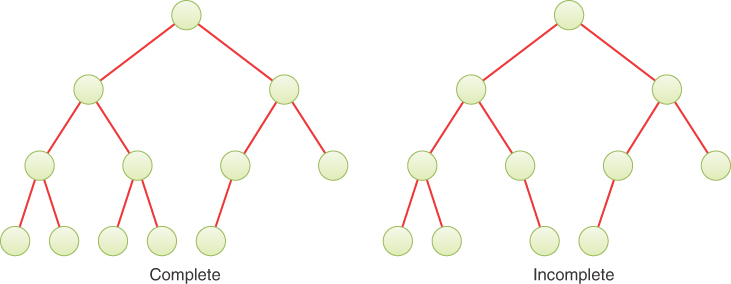

图 13-1 完全和不完全二叉树
图 13-2 将堆显示为树和用于实现它的数组。 数组是存储在内存中的内容； 堆树只是一个概念表示。 请注意，树是完整的，并且所有节点都满足堆条件。

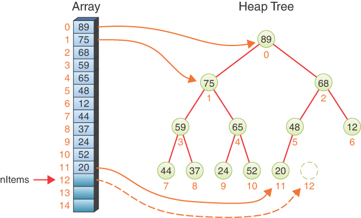

图 13-2 堆数组及其对应的二叉树
与我们研究过的其他树的另一个重大区别是：节点中的键不是按排序顺序排列的，既不是在数组中，也不是在二叉树中，至少不是它们在二叉搜索树中的排序方式。
堆是一棵完全二叉树的事实意味着在用于表示它的数组中没有"洞"。 每个单元格都被填充，从 0 到 nItems – 1（nItems 在图 13-2 中为 12）。 插入下一个对象时，索引 nItems 处的单元格将被填充，就像第 2 章"数组"中将对象插入数组末尾的方式一样。
我们在本章中假设最大密钥（而不是最小密钥）存储在根中。 基于这种堆的优先级队列是降优先级队列。 （我们在第 4 章讨论了升优先级队列。）

### 优先队列、堆和 ADT

优先级队列是一种抽象数据类型 (ADT)，它提供的方法允许删除具有最大（或最小）键值的对象、插入，有时还包括其他操作（例如遍历）。 我们在本章中描述堆，它经常用于实现优先级队列。 优先队列和用于实现它的堆之间有非常密切的关系。 清单 13-1 的代码片段显示了等价性。
PriorityQueue 类的三个方法与底层 Heap 类的方法相同，因此可以作为子类实现。 这个例子和第 4 章中的实现从概念上清楚地表明，优先级队列是一种可以通过多种方式实现的 ADT，而堆是一种更基本的数据结构。 在本章中，为了简单起见，我们只展示堆的方法，而不是优先队列包装。
清单 13-1 使用堆实现优先级队列

```python
class Heap(object):
    def __init__(self, size=2):  # Heap constructor
        self._arr = [None] * size # Heap stored as a list/array
…
	def insert(self, item):      # Insert a new item in a heap
…
	def remove(self):            # Remove top item of heap and return it
…

class PriorityQueue(Heap):       # Create a priority queue, using a heap
```

### 部分有序

与二叉搜索树相比，堆是部分有序的，在二叉搜索树中，节点的所有左后代的键都小于其所有右后代的键。 正如你在第 8 章中所看到的，二叉搜索树的完全排序允许你通过遵循一个简单的算法按照关键字的顺序遍历节点。
在堆中，按顺序遍历节点很困难，因为组织原则（堆条件）不如二叉搜索树中的组织原则强。 关于堆，你只能说，沿着从根到叶的每条路径，节点都是按降序排列的。 正如你在图 13-2 的树中看到的那样，给定节点左侧或右侧的节点，或更高或更低级别上的节点（前提是它们不在同一路径上）的键可以大于或小于 节点的密钥。 除了它们共享相同节点的地方，路径是相互独立的。
因为堆是部分有序的，一些操作是困难的或不可能的。 堆除了不支持按键顺序遍历外，也不能方便地查找指定的键。 原因是没有足够的信息来决定在搜索过程中尝试下降到较低级别时选择节点的两个子节点中的哪一个。 因此，无法删除具有指定键的节点，至少在 O(log N) 时间内无法删除，因为无法找到它。 这些操作可以通过按顺序查看数组的每个单元格来执行，但这只能在缓慢的 O(N) 时间内实现。
因此，堆的组织可能看起来危险地接近于随机性。 然而，排序刚好足以允许快速删除最大节点和快速插入新节点。 这些操作是将堆用作优先级队列、排序机制以及查找分布的某些成员所需的全部操作。 我们将简要讨论这两个核心操作是如何执行的，然后在可视化工具中查看它们的运行情况。

### 插入

在堆中插入一个对象很简单。 你知道这意味着向树中添加一个节点，而新节点唯一可以去的地方是叶级。 因为树是完整的，所以如果底部行未满，新节点将添加到最后一个节点的右侧，或者作为完整底部行的最左边节点的左子节点。 在图 13-2 中，树中有 12 个节点。 添加第十三项意味着在索引 12 处填充数组，它对应于树中的虚线节点，就在索引 11 的右侧。
堆条件如何？ 如果幸运的话，插入的项的键小于其父节点（或者它是根节点），你就完成了。 但是，你不能指望幸运，因此你需要比较键。 如果新插入的叶节点的键大于其父节点，则可以交换这两个项。 图 13-3 显示了一个示例，其中对象 80 被插入到单元格 12 的底部。蓝色链接指示需要比较哪两个节点。

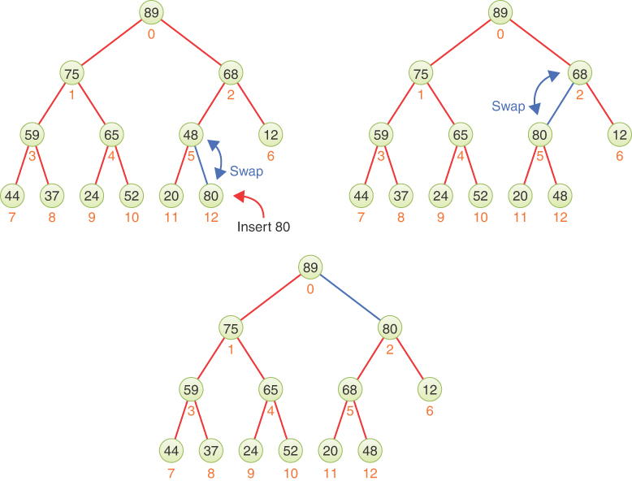

图 13-3 在堆中插入一个对象并向上筛选
因为插入项的键 80 大于单元格 5 中其父节点的键 48，所以必须交换项。 交换后，对象 80 现在有对象 20 和 48 作为子项，并且两个键都满足堆条件，因为它们更小。 每当交换父键和子键时，只会增加父键的值。 这意味着你永远不能打破另一个子节点的堆条件——那个子节点没有被交换。
将插入的对象移动到倒数第二行后，你仍然需要检查它在新位置是否满足堆条件。 如图 13-3 的右上角所示。 比较 80 和 68 表明蓝线连接的两个节点也需要交换。
第二次交换后，对象 80 位于单元格 2 中，如图底部所示。 将对象 80 与其新父节点（单元格 0 中的对象 89）进行比较，表明它现在满足堆条件。 不再需要交换。
将对象向上移动直到它们满足堆条件称为向上筛选。 此操作在概念上与冒泡排序的一次迭代非常相似。 该操作也被称为其他名称，例如冒泡、向上流动、向上渗透、向上游动、向上堆化和向上堆。 因为你将它应用于已经满足堆条件的堆上的单个新项，所以只需要向根节点传递一次。

### 移动

删除意味着删除具有最大键的对象。 在其他数据结构中，如树和哈希表，你可以使用 delete() 方法删除具有指定键的对象。 堆通常只支持删除最大键。 此项始终保存在根节点，因此很容易找到它。 根始终位于堆数组的索引 0 处。
问题是根没了之后，树就不再完整了。 或者，从堆数组的角度来看，有一个空单元格。 这个"坑"必须填上。
有几种可能的方法来填补这个洞。 如果你只是将数组中的每个对象向索引 0 移动一个单元格会怎样？ 这样可以消除漏洞，但可能会带来新的问题。 如果数组包含三个键：50、30 和 40，删除 50 将留下 30、40。这可以将 30 放在根部，40 作为它的一个子节点，这将打破堆条件。
使用用于插入的筛选方法的修改版本怎么样？ 你可以使用较大的密钥筛选（空）根的子节点。 然后，你可以重复通过向下移动树中的一个级别来填充通过向上移动子级所创建的孔的过程。 你将继续，直到向上移动一个也是叶节点的子节点。 这肯定会保留堆条件，因为你总是向上移动价值更高的键。 它似乎没有创造任何空缺，因为它填补了它创造的每个空缺。 或者是吗？
在图 13-4 中，左边显示了两个非常相似的堆树。 从顶部移除最大项，即第 75 项，会留下一个洞。 蓝色箭头表示下一步是提升单元格 1 中的对象 65 以填补空缺。 下一步提升对象 44 以填充单元格 1 处的空洞。在顶行的末尾，最终堆有四个对象并且堆条件保持不变。 因此，该方法适用于该堆。

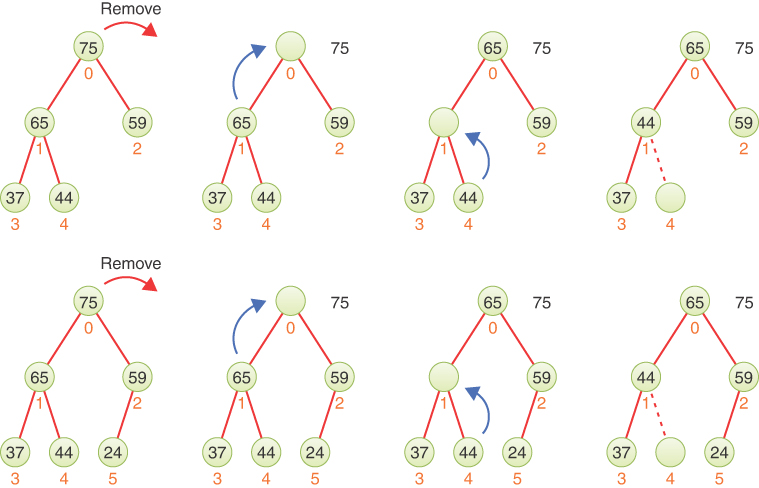

图 13-4 用最大子项填充空洞的两个例子
然而，在图 13-4 的底行中，堆还有一个对象。 相同的对象以相同的顺序移动。 向上移动第 44 项后，有一个空单元格 4，但有一个完整的单元格 5，第 24 项。那个空叶节点意味着树不再完整并且你没有堆。
简单地填充最大子节点是行不通的。 似乎你需要根据树中最后一个节点的路径筛选子项； 那是编号最高的填充单元格中的节点。 但是，如果你筛选出一个键小于其兄弟节点的子节点，则会创建一个节点，其中父节点的键小于其子节点。 这意味着你将不得不进行更多的交换或移动或操作，例如用于平衡 AVL 树的旋转。 这变得非常复杂。
幸运的是，有一个更简单的解决方案：将根项从树中取出以便稍后返回，用堆中的最后一项替换它，将堆大小缩小一，然后筛选新的根。 这个操作和填洞的做法很相似，解决了叶子层上错误的地方留洞的问题。
要了解这种方法是如何工作的，让我们看一个例子。 图 13-5 从与图 13-4 底行相同的初始堆开始。 第一步是从根节点中删除对象 75。 第二步获取堆中的最后一项，即单元格 5 中的第 24 项，并将其移至根。 第三步是将堆大小缩小一个以消除单元格 5。

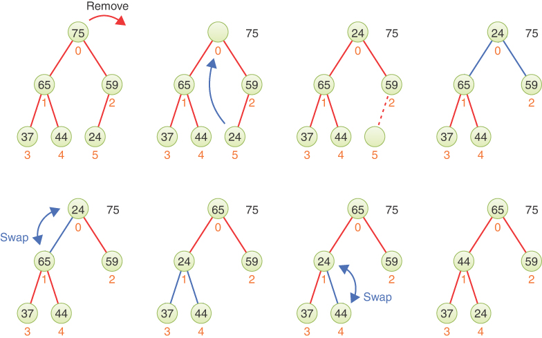

图 13-5 用最后一项替换根并向下筛选
现在你可以在根节点开始筛选过程。 在图中的右上角，对象 24 位于根节点。 指向其子项的蓝色链接表示我们必须查看它们的键以确定哪个更大。 较大的一个（在单元格 1）成为交换的候选者。
在下一步中（在图中第二行的左侧），你比较单元格 0 和 1 的键以发现需要交换。 交换这两项后，你将开始从单元格 1 开始的筛选过程。单元格 1 下方的两个蓝色链接显示你比较单元格 3 和 4 的键以找出哪个更大。 确定单元格 4 后，很明显需要进行另一次交换。 进行交换后，你最终会在图的右下方得到堆。
图 13-5 中的最终树满足堆条件并且是完整的。 如果再往下筛选，会发现4号单元格没有子节点，就不能再筛选了。 事实上，你可以在找到叶节点或不需要与最大子节点进行交换时停止该过程。
正如你所料，这整个过程称为筛选（或冒泡、滴落、渗透）。 它只比筛选稍微复杂一点。 不同之处在于每个节点最多有两个子节点。 如果有两个子节点，它必须选择具有最大键的节点，如果只有一个，则选择左节点。 （在一棵完整的树中永远不会有一个节点有右节点而没有左节点。）然后它将父节点与目标子节点进行比较，如果需要则交换它们并继续，或者如果它们已经在堆顺序中则结束。 因为它总是选择最大的子节点，所以交换不会造成堆条件违规。
筛选算法保证它访问的节点中的对象是堆顺序的。 它还保证二叉树保持完整，因为删除完整树的最后一个节点可以保持完整性，并且交换父节点和子节点不会产生空洞。 与向上筛选一样，此操作类似于冒泡排序的一次迭代。 它还与二叉搜索树中的删除共享一个特征，其中后继节点替换要删除的节点（无需进行旋转以重新平衡树）。
### 没有真正交换
当你可视化父节点和子节点之间的项交换时，向下筛选和向上筛选算法都很容易理解，如图 13-3 和图 13-5 所示。 每个交换涉及两次移动或复制，通常使用临时变量。 但是，有一种更有效的方法来实现更改，如图 13-6 所示。

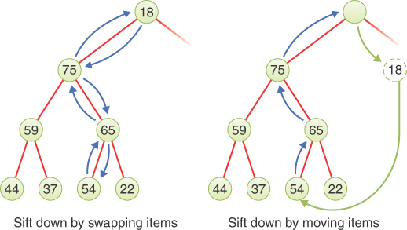

图 13-6 使用交换与移动筛选
当你向下筛选时，每次交换都会将插入到根部的对象向下移动。 树中较低的每个对象都与根对象的相同键进行比较。 这意味着你可以将根对象复制到一个临时存储位置，然后简单地将对象向上移动到每次移动/复制所创建的孔中。 该过程如图 13-6 右侧所示，最终成为对象的轮换。
为什么这个过程更有效率？ 在图 13-6 的示例中，使用交换时移动了六个对象。 当你移动对象而不是交换时，会复制五个对象； 三份向上（蓝色箭头），加上一份到临时变量的副本和一份从临时变量到最终位置的副本（绿色箭头）。 这并没有节省多少，但考虑在一个大堆中将一个对象向下筛选 30 层。 在这种情况下，交换生成 60 个副本，而移动生成 32 个副本。你节省了大约一半的复制操作（考虑到典型的交换使用临时变量生成三个副本，将节省近三分之二）。 在叶节点筛选新插入的对象时，同样的方法也适用。
另一种可视化对副本执行的向上筛选和向下筛选过程的方法是想象一个"洞"或"空白"——节点中缺少一个对象——在向下筛选中向下移动，在向上筛选中向上移动 . 在图13-6中，将item 18移动到右侧的临时存储中，在根部留下了一个空洞。当item 75被复制到根部时，空洞向下移动了一层。item 65的下一次向上移动移动了空洞 再往下一层。最终，这个洞移动到一个叶节点或者一个子键小于从根向下筛选的对象的节点。那个洞被临时存储的内容归档。当然，这些洞是概念上的 ; 复制内存中的对象会在源节点中保留原始值。
在堆中筛选数据可以节省时间，就像插入排序比冒泡排序节省时间一样。 你使用更少的复制操作来获得结果。

### 其他操作

堆与优先级队列的亲和力使得其他一些操作非常有用。 特别是，用于管理计算机上运行的进程的优先级队列可以通过 peek、change-priority 和 replace-max 方法受益。 peek 操作与堆栈和队列相同：它返回最大键控项的键和数据，而不更改堆内容。
更改优先级操作更改队列中对象的优先级。 当一个进程的优先级必须在下一次从优先级队列中删除以运行之前必须更改时，这可能是因为更高优先级的作业阻止它运行。
change_priority() 方法首先必须在堆中找到该对象，这可能会很慢，如"部分排序"部分所述。 找到后，增加优先级意味着必须进行筛选操作。 同样，降低优先级意味着筛选对象。 这些更改可以分别像插入和删除一样执行，除了筛选从修改其优先级后树中任何位置的现有对象开始。
replace-max 操作被广泛使用。 当操作系统从优先级队列中取出下一个进程项来运行时，它们通常会将一个进程放回队列中以便稍后运行。 操作系统通常会限制每个进程在挂起以允许其他进程运行之前可以运行的时间量。 正在运行的进程被放回优先级队列，可能具有不同的优先级。
如果你只是从堆中删除最高优先级的进程/项，然后将先前运行的进程插入堆中，则将对删除操作进行筛选，然后对插入操作进行筛选。 replace_max() 操作通过将根项替换为要插入到优先级队列中的项来消除向上筛选操作。 新的根项被筛选到适当的位置，并返回旧的根，因此可以使用 replace_max() 代替 remove()。 在数百或数千个可能只运行几微秒的进程之间切换时，这种方法可以节省大量时间。

## 堆可视化工具

堆可视化工具演示了我们在上一节中讨论的操作：它允许你将新对象插入堆中并删除或查看最大的对象。 但是，它没有实现提到的其他操作：更改优先级和替换最大值。
当你启动堆可视化工具时，你会看到如图 13-7 所示的画面。 该工具将堆显示为数组和树。 两者最初都是空的。 该阵列显示在左侧。 它有两个开始的单元格，nItems 指针指向单元格 0，表明堆中当前没有任何对象。

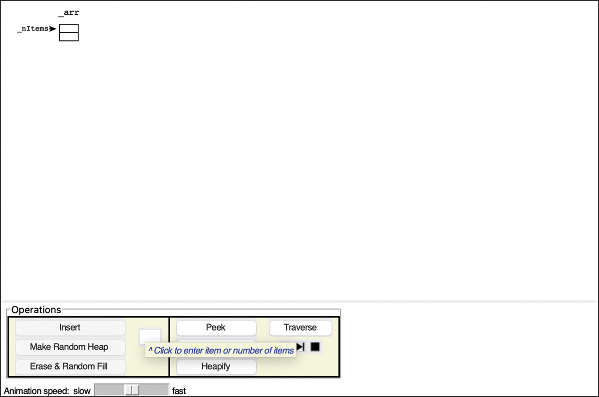

图 13-7 堆可视化工具
树显示在数组的右侧。 当堆为空时，没有节点。 此外，因为当树被表示为数组时不需要树对象，所以顶部没有像其他树可视化中那样的框。

### 插入按钮

新项总是插入到第一个可用的数组单元格中——由 nItems 指针指示的单元格。 在可视化中，单元格 0 位于数组单元格列的顶部，以与根位于顶部的树对齐。 第一个节点进入单元格 0 并在树中创建一个根节点。 每个后续插入作为树中的叶节点进入数组，恰好位于堆底行最后一个节点的右侧。 尝试在文本输入框中输入一个键（0 到 99 之间的整数）并选择插入。 如果输入值 33、51、44、12 和 70，你应该会看到如图 13-8 所示的堆。

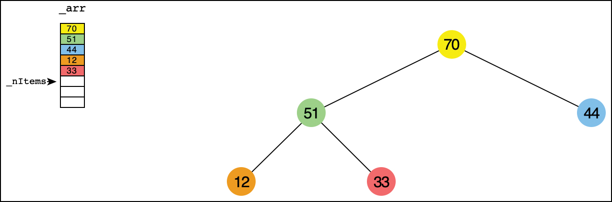

图 13-8 堆可视化工具中的一个小堆
在每次插入期间，你会看到该工具将新项放入最后一个数组单元格和树的最后一个叶子中，然后向上筛选直到它根据堆条件正确定位。 你还会看到数组在需要时展开，我们在 Python 代码中看到了这一点。

### 生成随机堆按钮

你可以为实验创建最多 31 个随机对象的堆。 在文本输入框中键入所需对象的数量，然后选择 Make Random Heap 按钮。 数组和树中充满了对象，其中一些可能有重复的键。 重复在堆中不是一个问题，因为它们不像数据库那样使用，其中对象由唯一键标识。
Make Random Heap 在放置新对象以满足堆条件之前清除所有现有对象。 如果你想简单地清除当前堆，你可以输入 0 作为对象数来清空堆。

### 擦除和随机填充按钮

Erase and Random Fill 按钮执行与 Make Random Heap 按钮类似的操作，只是它只用随机排序的对象集合填充数组。 因为在插入带有随机键的对象后几乎永远不会满足堆条件，所以堆中的对象数设置为 1（如果选择空堆，则设置为零）。 单项数组始终满足堆条件，因为没有子项可与其键进行比较。
可视化工具显示数组中的随机项，其中 nItems 指针位于单元格 1，如图 13-9 所示。 只有一项满足堆条件，树中只显示根节点。 如果你在这种情况下插入一个新对象，新对象将进入 nItems 指针指示的单元格，覆盖之前存储在那里的任何对象。 可以使用单独的操作将超出 nItems 指针的数组项组织到适当的堆中。

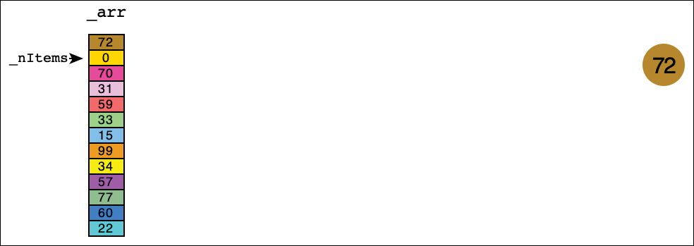

图 13-9 数组中用于堆的一组随机项

### 窥视按钮

就像堆栈和队列一样，许多算法在决定删除它之前需要查看下一个对象是什么。 Peek 按钮执行此常见任务，从根节点（具有最大键的节点）复制键和数据，以作为输出返回。

### 删除最大值按钮

选择 Remove Max 按钮从堆中取出最大项，将其替换为最后一项，然后将该项从树的根部向下筛选。 删除的密钥和数据作为输出返回。

### 堆化按钮

Heapify 按钮获取存储在数组中超过 nItems 指针的任何数据，并将其重新排列以形成一个堆。 我们稍后将在"Heapsort"部分研究此操作。

### 遍历按钮

有时，对堆中的所有项执行某些操作很有用，例如收集有关当前集合的统计信息。 Traverse 按钮通过打印所有对象的键提供了一个示例。 我们将在本章后面探讨遍历顺序的问题。

## 堆的 Python 代码

如前所述，堆几乎总是以数组的形式实现。 原因是相应的二叉树是完整的并且总是填充数组的前 N 个单元格，其中 N 是堆中的项数。 我们使用 Python 的列表（数组）来存储此实现中的对象。
清单 13-2 显示了 Heap 类定义的开头。 与其他基于数组的结构一样，构造函数采用初始大小参数来确定要分配的数组的大小。 内部 _nItems 字段设置为 0，表示尚未在私有 _arr 中存储任何对象。 构造函数还采用一个键参数，该参数定义用于提取用于排序记录或存储在数组中的其他复杂结构的键的函数。
前四种方法类似于堆栈和队列的方法。 isEmpty() 方法测试堆中是否存储了任何对象。 isFull() 方法检查对象数是否填满了分配的整个数组。 \_\_len\_\_() 方法允许调用者使用 Python 的内置 len() 函数知道堆中的对象数。 最后，peek() 方法返回堆中的最大键值项（如果它不为空）。

清单 13-2 核心堆类

```python
def identity(x):
    return x  # Identity function


class Heap(object):
    def __init__(self, key=identity, size=2):  # Heap constructor
        self._arr = [None] * size  # Heap stored as a list/array
        self._nItems = 0  # No items in initial heap
        self._key = key  # Function to get key from heap item

    def isEmpty(self):
        return self._nItems == 0  # Test for empty heap

    def isFull(self):
        return self._nItems == len(self._arr)

    def __len__(self):
        return self._nItems  # Number of items

    def peek(self):  # Return item with maximum key
        return None if self.isEmpty() else self._arr[0]
```

接下来的方法定义了堆的数组和树表示之间的对应关系。 在向上或向下筛选时遍历树意味着遵循父子关系，这在数组中是不明确的。 正如你在第 8 章中看到的，数组中索引为 i 的节点有它的

- 父节点在 ```(i - 1) // 2```
- 左子节点在 ```i * 2 + 1```
- ```i * 2 + 2``` 处的右子节点。

这些关系如图 13-2 所示。 公式可能会返回数组边界之外的索引，[0, _nItems)，在这种情况下，该节点没有父节点或子节点。 清单 13-3 中的方法将单元格索引转换为其相邻节点的索引，但不测试那里是否有对象。

> 笔记
> 请记住，Python 的 // 运算符执行整数除法，其中答案四舍五入为最小整数。 即使对于负数也是如此：
>
> ```-1 // 2 == -1。```

清单 13-3 父子节点关系方法

```python
class Heap(object):
…
    def parent(self, i):  # Get index of parent in heap tree
        return (i - 1) // 2  # Item i's parent index is half of i - 1

    def leftChild(self, i):  # Get index of left child in heap tree
        return i * 2 + 1  # Item i's left child is at twice i plus 1

    def rightChild(self, i):  # Get index of right child in heap tree
        return i * 2 + 2  # Item i's right child -> twice i plus 2
```

### 插入

insert() 方法相当短； 大部分工作由 sift up 算法在单独的方法中处理，如清单 13-4 所示。
如果内部数组已满，则 insert() 方法调用私有 \_growHeap() 方法来增加数组的大小。 让我们看看在其余的插入操作之前增加堆。 与第 11 章"哈希表"中的哈希表一样，增大堆会使数组的大小加倍。 首先，它将当前数组保存在一个临时变量中，分配一个两倍大的新数组（包括至少一个单元格），然后将所有当前项复制到其中。 与哈希表不同，不需要重新插入（rehash）堆中的对象； 它们可以按相同的顺序复制到新数组中。 可视化工具对 \_growHeap() 过程进行动画处理，查看它的运行情况有助于阐明细节。
在检查并可能扩大数组大小后，insert() 方法将新项放入由 \_nItems 索引的空单元格中。 在将 \_nItems 递增 1 后，它现在可以在数组末尾（树的底部）的新对象上调用 \_siftUp()。
\_siftUp() 方法从数组中的特定索引 i 开始，并处理到根的父链接。 如果在根（或负索引）上调用，它什么也不做，因为该对象不能在树中向上移动。 否则，它准备通过将对象及其密钥存储在临时变量中来移动 i 处的对象。 这在单元格 i 处创建了第一个"洞"。
while 循环"遍历"父链接。 当 i 为 0 时，它已经到达根，不能再移动了。 在循环体中，\_siftUp() 找到父节点并将其键与被筛选项的键进行比较。 如果父节点的键小于 itemkey，它会将父节点向下移动到单元格 i 中。 这意味着"洞"向上移动，它改变 i 指向父单元格。 如果父节点的键大于或等于项键，则已找到该项的最终位置并且循环终止。
最后一步是将对象移动到"洞"，在那里它要么有一个具有更大键的父节点，要么没有父节点。 现在这个洞被填满了，堆的状态也恢复了。
清单 13-4 堆的 insert() 方法

```python
class Heap(object):
…
    def insert(self, item):  # Insert a new item in a heap
        if self.isFull():  # If insertion would go beyond array
            self._growHeap()  # then expand heap array
        self._arr[self._nItems] = item  # Store item at end of array
        self._nItems += 1  # Increase item count
        self._siftUp(self._nItems - 1)  # Sift last item up

    def _growHeap(self):  # Grow the array for the heap
        current = self._arr  # Store the current array
        self._arr = [None] * max(1, 2 * len(self._arr))  # Double array
        for i in range(self._nItems):  # Loop over all current items &
            self._arr[i] = current[i]  # copy them to the new array

    def _siftUp(self, i):  # Sift item i up toward root to preserve
        if i <= 0:  # heap condition. The root node, i = 0,
            return  # cannot go higher, so done.
        item = self._arr[i]  # Store item at cell i
        itemkey = self._key(item)  # and its key
        while i > 0:  # While i is below the root
            parent = self.parent(i)  # Get the index of its parent node
            if self._key(self._arr[parent]) >= self:
                break  # then we have found where item i belongs
            self._arr[i] = self._arr[parent]  # copy parent to i
            i = parent  # and continue up tree
        self._arr[i] = item  # Move item i into final position
```

### 移动

去除算法也不复杂。 与插入一样，该方法有两个部分：1) 删除最大键项并填充该孔的初始工作，以及 2) 筛选新的根项。 清单 13-5 显示了代码。 第一步是在堆为空时引发异常。 接下来，它将根节点中的对象复制到临时变量。 减少堆后返回此原始根。
remove() 方法将堆中的最后一项（位于 \_nItems - 1 的那个）复制到根节点。 它首先递减 \_nItems，因为数组中的最后一项刚刚移动到索引 0。在为垃圾收集器清除最后一个单元格后，它调用 \_siftDown() 将新的根项向下移动到堆中它所属的位置。 当筛选完成时，它可以返回之前从根节点删除的对象。
\_siftDown() 方法需要知道哪些节点是叶节点。 因为树是完整的，所以这个索引可以从堆中的对象数计算出来。 第一叶索引总是出现在索引 \_nItems // 2 处。你可以在图 13-4 中看到这些索引关系的示例。 第一棵树有五个对象，第一个叶子的索引为 2。第二棵树（第二行最左边的那个）有六个对象，它的第一个叶子的索引为 3。索引等于或大于的所有节点 比 firstleaf 是叶节点。 如果待筛选对象的索引 i 在该范围内，则该对象无法向下移动，因为它没有子节点，因此 \_siftDown() 方法立即返回。
清单 13-5 堆的 remove() 方法

```python
class Heap(object):
…
    def remove(self):  # Remove top item of heap and return it
        if self.isEmpty():  # It's an error if the heap is empty
            raise Exception("Heap underflow")
        root = self._arr[0]  # Store the top item
        self._nItems -= 1  # Decrease item count
        self._arr[0] = self._arr[self._nItems]  # Move last to root
        self._arr[self._nItems] = None  # Clear for garbage collection
        self._siftDown(0)  # Move last item down into position
        return root  # Return top item

    def _siftDown(self, i):  # Sift item i down to preserve heap cond.
        firstleaf = len(self) // 2  # Get index of first leaf
        if i >= firstleaf:  # If item i is at or below leaf level,
            return  # it cannot be moved down
        item = self._arr[i]  # Store item at cell i
        itemkey = self._key(item)  # and its key
        while i < firstleaf:  # While i above leaf level, find children
            left, right = self.leftChild(i), self.rightChild(i)
            maxi = left  # Assume left child has larger key
            if right < len(self) and self._key(self._arr[maxi]) < self:  # key
                maxi = right  # then use right child
            if itemkey >= itemkey:
                break  # to larger child, then found position
            self._arr[i] = self._arr[maxi]  # then move max child up
            i = maxi
        self._arr[i] = item  # Move item to its final position
```

当在内部（非叶）节点上调用 \_siftDown() 时，它将对象存储在 i 并将其键存储在临时变量中。 然后它开始一个循环，该循环将下降堆树，直到它到达叶节点或找到可以重新插入存储项以保持堆条件的节点。
在循环内部，它获取节点 i 的子节点的索引。 如果只有一个左子节点，它必须有最大密钥； 否则，必须比较左右子键以确定具有最大键maxi的子节点的索引。 测试首先假设 maxi 是左子节点。 如果右子节点存在并且具有更大的密钥，则将 maxi 设置为右子节点。
现在可以将被筛选项的键与最大子键进行比较。 如果 itemkey 小于最大子键，则最大子键向上移动。 这在最大子节点处创建了一个"洞"，并且 i 被更新为指向那里以进行下一个循环。 如果 itemkey 等于或超过最大子键，则索引 i 指向该对象所属的位置，并使用 break 终止循环。
\_siftDown() 的最后一步将对象移动到单元格 i 中。 这填补了最后一个"洞"并恢复了堆条件。

### 遍历

遍历堆中的对象有些常见。 例如，可以使用此操作列出优先级队列中等待运行的所有进程或访问每个对象并收集统计信息。 因为堆只是对对象进行部分排序，所以不容易按照键值的顺序遍历对象。 相反，最简单的遍历顺序与遍历底层数组相同。
清单 13-6 显示了用于遍历所有项的 traverse() 生成器。 堆树的完整性意味着它可以简单地遍历数组中活动项的每个索引。 这是通过索引范围内的 for 循环完成的，将每个数组单元格内容返回给调用者。
清单 13-6 堆的 traverse() 生成器和 print() 方法

```python
class Heap(object):
…
    def traverse(self):  # Generator to step through all heap items
        for i in range(len(self)):  # Get each current item index
            yield self._arr[i]  # and yield the item at the index

    def print(  # Print heap tree with root on left
        self, indentBy=2, indent="", i=0  # indenting by a few spaces for each level
    ):  # starting with indent at node i
        if i >= len(self):  # If item i is not in tree
            return  # don't print it
        next = indent + " " * indentBy
        self.print(
            indentBy,  # Print right subtree of i at next indent
            next,
            self.rightChild(i),
        )
        print(indent, self._arr[i])  # Print item i after indent, then
        self.print(
            indentBy, next, self.leftChild(i)  # Print left subtree of i at next indent
        )
```

尽管这个简单的遍历顺序不遵循键顺序，但它确实遵循堆二叉树的特定顺序。 该顺序称为宽度优先，因为它在树的广泛级别上工作，在进入下一个较低级别之前访问树中特定级别的所有节点。 节点从最浅到最深访问，每一层的广度按照从左到右的顺序遍历。 尝试使用可视化工具遍历中型或大型堆（15 个或更多项）以查看此信息。 这种排序对于某些树算法非常有用。
打印堆树在开发代码时通常很有用。 清单 13-6 中的 print() 方法在其"侧面"打印树，就像第 8、9 和 10 章中对树所做的那样。该方法是递归的，并使用反向形式的中序遍历，其中 打印节点的右子树，然后是节点本身，然后是它的左子树。 每个子树的缩进增加。

### 堆操作的效率

对于具有大量对象的堆，向上筛选和向下筛选算法是你所见过的操作中最耗时的部分。 这些算法花时间在一个循环中，重复地沿着路径向上或向下移动节点。 所需的最大副本数受堆的高度限制； 如果有五个级别，则四个副本从上到下携带"孔"。 （我们忽略了用于将端节点转移到临时存储和从临时存储转移的两个动作；它们总是必要的，所以它们需要恒定的时间。）
\_siftUp() 方法在其循环中最多有四个操作：（1）计算当前"洞"的父索引，（2）将要插入的节点的键与父节点的键进行比较，（3）复制 父母向下移动到"洞"，并且（4）将"洞"向上移动。 第三和第四个操作在循环的最后一次迭代中被跳过。 \_siftDown() 方法在其循环中最多有六个操作：（1）计算当前"洞"的左右子索引，（2）比较左右子项的键，（3）分配 最大子索引，（4）将最大子键与下筛选项的最大子键进行比较，（5）将最大子项复制到"洞"中，（6）将"洞"向下移动。 在循环的最后一次迭代中跳过第五和第六操作。 两种方法都必须在循环退出后将筛选后的节点移动到最终的"洞"中。
堆是一种特殊的二叉树，正如你在第 8 章中看到的，二叉树中的层数 L 等于 log~2~(N+1)，其中 N 是节点数。 \_siftUp() 和 \_siftDown() 例程在它们的循环中循环 L - 1 次，因此第一次花费的时间与 log~2~ N 成正比，而第二次花费的时间更多一些，因为有额外的比较和赋值。 因此，插入和删除操作都在 O(log N) 时间内完成。
对于插入，你还必须考虑将堆数组增长到容纳所有堆项所需大小的时间。 增长数组所需时间的分析遵循哈希表增长数组的时间。 请记住，当负载因子高于阈值时将哈希数组加倍允许在 O(N) 时间内构建 N 项的哈希表。 在堆的情况下，插入操作是 O(log N) 而不是 O(1)。 这意味着将 N 项插入堆中需要 O(N × log N) 时间。
遍历 N 项堆需要 O(N) 时间。 数组中没有必须访问的空单元格，就像在哈希表中一样，因此遍历堆比哈希表快一点。

## 基于树的堆
在本章的图中，我们把堆当作树来表示，因为那样更容易形象化，但实现是基于数组的。 当然，可以使用实际的基于树的实现。 这棵树将是一棵二叉树，但它不会是一棵搜索树，因为正如你所见，排序原则并不那么强大。 它将是一棵完整的树，没有遗漏的节点。 我们称这样的树为基于树的堆。
基于树的堆的一个问题是找到最后一个节点。 你需要找到此节点以删除最大项，因为它是插入的节点以代替已删除的根（然后被筛选）。 你还需要找到第一个"空节点"——紧接在最后一个节点之后的节点——因为这是插入方法在筛选之前需要放置新对象的地方。 一般来说，你不能搜索这些节点，因为你不知道它们的值，反正它不是搜索树。 你可以将一些字段添加到基于树的堆数据结构中，该结构维护指向末尾的指针，就像双端列表一样，但还有另一种方法不需要额外的字段。
正如你在第 8 章讨论哈夫曼树时看到的那样，你可以将从根到叶的路径表示为一个二进制数，二进制数字表示从每个父节点到其子节点的路径：0 表示左，1 表示右。 事实证明，树中的节点数与编码到最后一个节点的路径的二进制数之间存在简单的关系。 假设根编号为1； 下一行有节点 2 和 3； 第三行有节点 4、5、6 和 7； 等等。 当然，这比基于数组的实现中使用的数组索引多 1。
要找到最后一个填充的节点（或第一个空节点），将节点数（或比数字多一个）转换为二进制。 例如，假设树中有 29 个节点，你想要找到最后一个节点。 数字 29（十进制）在二进制中是 11101。 删除开头的 1，留下 1101。这是从根节点到节点 29 的路径：右、右、左、右。 二进制表示中每个1表示取右子节点，每个0表示取左子节点。 第一个可用的空节点将沿着到 30 的路径找到，它（在删除初始 1 之后）是 1110 二进制：右，右，右，左。 图 13-10 显示了通过树的路径。

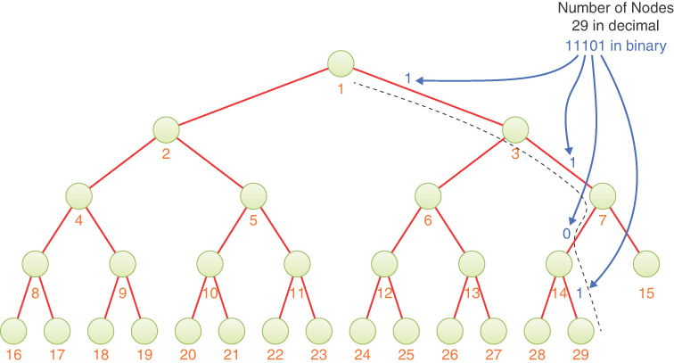

图 13-10 查找到 29 节点树中最后一个节点的路径。
你可以使用字符串格式工具在 Python 中查看整数的二进制表示。 例如，‘{:b}’.format(29) 的计算结果为‘11101’。 当数字 n 除以 2 时，重复使用 % 运算符求余数（0 或 1），然后使用 // 或 >> 运算符将 n 除以 2 并删除最后一位也很容易。 当 n 小于 1 时，你就完成了。 可以保存在数组中的余数序列是二进制数。 （小心你解释它们的顺序！）
使用二进制表示允许基于树的堆找到到最后一个叶子或下一个空叶子的路径，但它不会加快到达该节点的速度。 该算法仍然必须遵循从根到节点的所有引用，执行 O(log N) 步骤。 对于基于数组的堆，这可以在常数时间内完成，O(1)。
找到合适的节点（或空子节点）后，堆操作就很简单了。 当你向上或向下筛选时，树的结构不会改变，所以你不需要改变链接来移动实际的节点。 你可以简单地将数据项从一个节点复制到下一个节点，就像在基于数组的实现中所做的那样。 这样，你无需通过一个简单的步骤连接和断开所有子项和父节点。 但是，Node 类除了子节点之外还需要父节点的字段，因为你需要在筛选时访问父节点。 这有点像你在第 5 章"链表"中看到的双向链表。 树的根还应该保留一个nItem 字段，以方便查找到最后一个叶子和第一个空节点的路径。
在树堆中，插入和移除操作需要 O(log N) 时间。 与基于数组的堆一样，时间主要花在执行向上筛选和向下筛选操作上，这需要的时间与树的高度成正比。 遍历基于树的堆仍然需要 O(N) 时间，但遍历顺序可以是你在二叉树中看到的任何顺序：前序、中序或后序。 虽然名称可能是"有序的"，但遍历仍然不是按对象键的顺序。 执行这三种排序的灵活性来自结构中的显式子引用。 可以通过将节点编号转换为从根开始的路径，然后沿着这些路径到达节点来进行广度优先遍历，但这将花费比 O(N) 多得多的时间。

## 堆排序

堆数据结构的效率使其成为一种非常简单且非常有效的排序算法，称为堆排序。
基本思想是使用普通的 insert() 方法将源数据结构中的所有无序项插入到堆中。 重复应用 remove() 方法然后按排序顺序删除对象。 以下是将 Python 序列排序为结果数组的方式：

```python
theHeap = Heap(size=len(aSequence)) # Create an empty heap
for item in aSequence:              # Loop over unsorted sequence
    theHeap.insert(item)             # Copy items to heap
result = []                         # Make a result array
while not theHeap.isEmpty():        # Loop over array indices
    result.append(theHeap.remove())  # Copy items back to array
```

此代码会将结果数组中的对象按降序排列，因为从堆中删除的第一个对象是最大值。 要按升序排列对象，你可以构建结果数组以包含足够的单元格，然后以相反的顺序对其进行索引。
因为 insert() 和 remove() 在 O(log N) 时间内运行，并且每个都必须应用 N 次，所以整个排序需要 O(N × log N) 时间，这与快速排序相同。 然而，它总体上不如快速排序快，部分原因是 _siftDown() 的内部 while 循环中的操作比快速排序中的内部循环更多。
稍微聪明一点，我们可以增强这个基本算法，使堆排序更高效。 第一个增强功能节省时间，第二个增强功能节省内存。

### 向下而不是向上筛选

如果将 N 个新对象插入堆中，则应用 \_siftUp() 方法 N 次。 但是，你可以利用与删除对象时所做的类似的技术：将无序对象从根部向下筛选到正确排列的堆中。 更重要的是，这样做只需要调用 N/2 次 \_siftDown()，因为你只需要对内部（非叶）节点执行此操作。 这种方法提供了一个小的速度优势，即使筛选稍微更耗时。

### 两个正确的子堆组成一个正确的堆

要了解这种方法的工作原理，我们需要查看堆的较小部分：子堆。 子堆是什么意思？ 它们就像树中的子树。 堆树中的任何节点都可以被认为是子堆的根。 图 13-11 显示了三个用虚线三角形勾勒出的子堆。

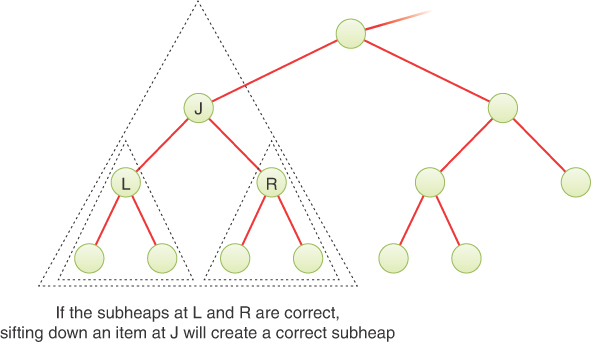

图 13-11 向下筛选成两个正确的子堆会生成一个正确的堆
请记住，remove() 算法提取根项，将其替换为堆中的最后一项，减少项计数，然后筛选根项。 在这种情况下，一个无序的项被放置在节点 0 中，并且它的两个子堆都被正确排序。 筛下后，堆状况恢复。 该属性概括为适用于堆树中的任何节点。 更具体地说，如果对节点J应用_siftDown()，并且J的左右子堆都满足堆条件，那么在sift down操作完成后，以J为根的子堆也将满足堆条件。 此属性保存节点 J 处的对象在筛选之前是否满足堆条件。
在图13-11中，如果在节点J中放置了乱序项，则以节点J为根的子堆不满足堆条件。 如果你随后筛选该对象，如果子堆 J 的两个子堆（以节点 L 和 R 为根）都正确，则子堆 J 将正确地满足堆条件。 当子堆 J 正确时，你可以考虑如何处理其父级的子堆，这可能不正确。
这个例子提出了一种将无序数组转换为堆的方法。 你可以将 _siftDown() 应用于（潜在）堆底部的节点——即数组的末尾——并向上移动到索引 0 处的根节点。在每一步中，你下面的子堆将 已经是正确的堆，因为你已经对它们应用了 _siftDown()。 当你将它应用于根时，无序数组将被转换为堆。
还要注意，底行的节点（没有子节点的节点）已经是正确的堆，因为它们是只有一个节点的树； 他们没有可以乱序的关系。 因此，你不需要将 _siftDown() 应用于这些节点。 你可以从节点 N/2 – 1（最右边有子节点）开始，而不是从最后一个节点 N – 1 开始。 因此，你只需要使用 N 次 insert() 的一半筛选操作。 图 13-12 显示了在 13 节点堆中，向下筛选从节点 5 开始，然后是节点 4，依此类推，直到它到达 0 处的根。

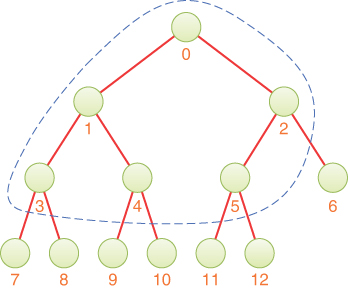

图 13-12 \_siftDown() 方法应用于内部节点
在 Python 中，N 节点堆的第一个内部节点的索引为 N // 2 - 1。因此，要将 \_siftDown() 应用于内部节点，回到根节点，你可以运行

```python
for j in range(N // 2 - 1, -1, -1):
    theHeap._siftDown(j)
```

### 使用相同的数组

heapsort 的初始代码片段显示序列中的无序数据。 然后将此数据插入堆中，最后从堆中移除并按降序排序写回数组。 在此过程中，需要三个大小为 N 的结构：初始序列、堆使用的数组和结果数组。
事实上，同一个数组可用于所有三个：输入、堆和结果数组。 重用数组将堆排序所需的内存量减少了三分之二； 不需要超出初始数组的内存。 换句话说，你可以就地创建堆。 当然，这种方法仅在源数据位于数组中时才有效。 要对存储在哈希表或链表中的数据使用堆排序算法，需要将项插入堆中然后删除（或将底层数组作为结果返回）。
你已经看到如何将 _siftDown() 应用于数组的一半元素以将它们转换为正确的堆。 如果将无序数组数据就地转换为堆，则此任务只需要一个数组。 因此，heapsort 的第一步只需要一个数组。
当你对堆重复应用 remove() 时，第二步怎么样？ 你打算将移除的物品放在哪里？
每次从堆中移除一个对象时，堆数组末尾的元素变为空，因为堆缩小了一个。 你可以将删除的对象放入这个新释放的单元格中。 随着越来越多的对象被移除，堆数组变得越来越小，而有序数据数组变得越来越大。 换句话说，数组的一部分是堆，一部分是排序后的输出。 通过一些规划，有序数组和堆数组可以共享相同的空间。
所有工作都可以在一个数组中完成这一事实意味着你不需要单独的堆对象来保存中间结果。 你可以简单地对输入数组进行操作并将其堆化。 数组开始未排序。 所有 N 项都是未排序部分的一部分。 构造堆时，叶节点（数组的后半部分）自动成为堆的一部分。 数组的前半部分包含未排序的部分。 当你向下筛选对象时，数组的无序部分会随着堆的增长而缩小。 当数组完全堆化时，你可以开始从索引 0 中删除最大项并将其放在数组的末尾。 这样，你就可以避免因为堆缩小了一个而破坏堆。
堆可视化工具可以通过键对数据项数组进行堆化。 要查看示例，请使用擦除和随机填充按钮擦除任何现有数据并用几十个对象填充数组。 当数组已满时，堆树只显示根节点，如图 13-9 所示，因为数据的随机排列不太可能满足堆条件。
通过选择 Heapify 按钮开始堆化。 图 13-13 显示了处理 30 项数组期间的快照。 创建 15 个叶节点后，算法向后遍历叶上方的内部节点。 图中6个内部节点已经做成子堆，其中5个在本地满足堆条件。 标记为 j 的箭头表示它即将筛选第 37 项以使该子堆满足堆条件。 在完成所有 3 节点（和一个 2 节点）子堆的创建后，它会进入下一个更高级别并将它们加入 7 节点（和一个 6 节点）子堆。 请注意，左侧数组和右侧部分树中的 j 箭头都指向第 37 项，表示到目前为止堆化的数组单元之间的边界。

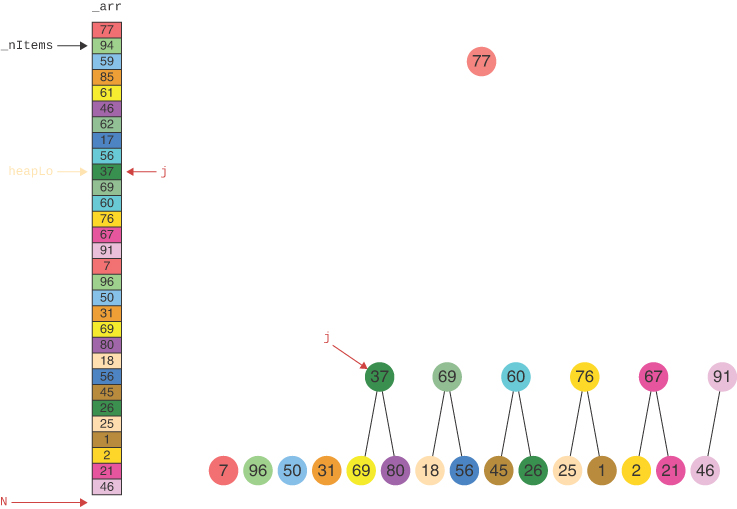

图 13-13 在可视化工具中堆积 30 个随机项的数组
有了堆形式的数据，堆排序就可以开始生成最终的排序顺序了。 可视化工具没有显示排序过程，所以让我们通过一个小例子来了解完整的过程。 图 13-14 显示了使用堆排序对六项数组进行就地排序。 第一行显示堆化过程，第二行显示排序数组的构造。

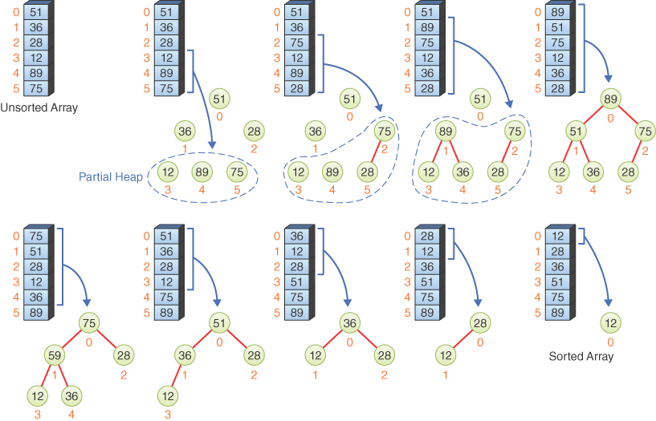

图 13-14 堆排序到位
图中左上角的数组是原始的、未排序的数组。 右边的下一步显示堆化阵列的起始状态。 数组的最后三项（索引 3 到 5）被视为部分堆中的叶节点（由环绕这些节点的虚线所示）。 你也可以将这些叶子称为"单节点子堆"。 请注意，数组中的任何一项都没有更改； 这些节点/单元的范围被简单地标记为堆区域。
第三步显示在索引 2 处的节点上调用 siftDown() 后发生的情况。节点 2 中的原始对象具有键 28。它向下筛选到节点 5，对象 75 向上移动。 堆现在有四个对象——索引 2 到 5。图中显示了节点 0 和 1 中的其他对象，但它们不是堆的一部分。 （可视化工具在堆化过程中显示了堆树根部的一个节点，但它没有连接到其他节点，也不是已验证子堆集合的一部分。）
第四步显示了从节点 1 中筛选对象 36 的结果。它与节点 4 中的对象 89 交换了位置，现在堆中有五个对象。 红色链接表示已为连接的节点确认堆条件。
在第五步中，筛选节点 0 处的最终对象，即对象 51。 它与对象 89 交换位置，但不需要进一步筛选到第二级。 现在六项阵已经完全堆化了； 这是一个完整、正确的堆。 这显示在图 13-14 顶行的右端。
heapsort 算法然后从堆的顶部删除对象并将它们放在数组的末尾。 移除最大项以放置在数组末尾有效地交换了根项和堆中的最后一项。 在图中的示例中，根的第 89 项与节点 5 的第 28 项交换。然后，第 28 项向下筛选到节点 2，如图 13-14 的第六步（第二行的第一步）所示。 对象 89 位于数组的末尾，在堆范围 0 到 4 之外。
第七步获取根部的最大项，即第 75 项，将其与堆的最后一项，即第 36 项交换，然后向下筛选第 36 项。 这次该对象从左分支向下移动到节点 1。对象 51 向上移动到根。 提取的最大值 75 在节点 4 中结束。现在，四项堆跨越索引 0 到 3，索引 4 和 5 保存部分结果。
第八步和第九步类似。 他们交换堆的根和最后一项，然后从根向下筛选。 每次，根中的最大对象被放置在前面步骤中其他已排序对象之前。 堆缩小并最终在堆中只有一个元素。 至此，数组已完全排序。 单项堆包含具有最小键的项。 不需要将它与最后一个堆项本身交换，也不需要进行任何筛选。
通过详细信息可以看出数组的使用非常有效。 堆从数组的后半部分开始，然后 heapify 将其增长以包括直到根的所有对象。 然后堆缩小，同时随着对象被删除占据数组的第一部分。 让我们看看执行此操作的代码。

### heapsort() 子例程

在这里，我们结合了这两种技术——将数组转换为堆（"堆化"它），然后将删除的对象放在同一个数组的末尾——一起在一个子例程中对输入数组执行堆排序。
清单 13-7 中所示的 heapsort() 子例程采用一个 Python 数组（列表）并根据键函数提取的键对其项进行排序，键函数默认为 identity() 函数。 第一个语句设置一个局部变量 heapHi 来管理存储堆的索引范围。 我们使用与 Heap 类中相同的数组索引到二叉树节点的映射。 它调用 heapify() 例程将对象组织到堆中。 让我们先讨论 heapify()，然后再回到 heapsort()。
heapify() 子例程确定数组中的数据量 N，以防调用者未提供它。 堆的下界 heapLo 设置为 N // 2 因为所有叶节点都是正确的单项子堆。 因此，堆覆盖了从 heapLo 到 N-1 的单元格。
清单 13-7 heapsort()、heapify() 和 siftDown() 子例程

```python
def heapsort(
    array, key=identity  # Sort an array in-place by keys extracted
):  # from each item using the key function
    heapHi = len(array)  # Make entire array from 0 to heapHi
    heapify(array, heapHi, key)  # into a heap using heapify
    while heapHi > 1:  # While heap has more than 1 item
        heapHi -= 1  # Decrement heap's higher boundary & swap
        array[0], array[heapHi] = array[heapHi], array[0]  # max and last
        siftDown(array, 0, heapHi, key)  # & sift down item moved to top


def heapify(
    array,  # Organize an array of N items to satisfy
    N=None,  # the heap condition using keys extracted
    key=identity,
):  # from the items by the key function
    if N is None:  # If N is not supplied,
        N = len(array)  # then use number of items in array
    heapLo = N // 2  # The heap lies in the range [heapLo, N)
    while heapLo > 0:  # Heapify until the entire array is a heap
        heapLo -= 1  # Decrement heap's lower boundary
        siftDown(array, heapLo, N, key)  # Sift down item at heapLo


def siftDown(
    array,  # Sift item down in heap starting from
    j,  # node j
    N=None,  # down to but not including node N
    key=identity,
):  # using key function to extract item's key
    if N is None:  # If N is not supplied,
        N = len(array)  # then use number of items in array
    firstleaf = N // 2  # Get index of first leaf in heap
    if j >= firstleaf:  # If item j is at or below leaf level,
        return  # it cannot be moved down
    item = array[j]  # Store item at cell j
    itemkey = key(item)  # and its key
    while j < firstleaf:  # While j above leaf level, find children
        left, right = j + j + 1, j + j + 2  # Get indices of children
        maxi = left  # Assume left child has larger key
        if right < N and key(array[maxi]) < key:  # key
            maxi = right  # then use right child
        if itemkey >= itemkey:
            break  # to larger child, then found position
        array[j] = array[maxi]  # then move max child up
        j = maxi  # and continue from new "hole"
    array[j] = item  # Move item to its final position
```

heapify() 的 while 循环通过减少 heapLo 来合并所有非叶节点来扩展堆。 它从紧靠堆之前的节点开始，位于 heapLo - 1。这是树最低级别最右边的内部节点。 通过在数组上调用 siftDown() 例程并将堆边界 heapLo 传递给 N 来筛选那里的对象。此循环一直持续到 heapLo 达到 0，这意味着所有内部节点都已筛选到堆中。
当 heapify() 完成后，控制返回到 heapsort()。 那里的 while 循环按键降序从堆中删除对象。 与清单 13-5 中的 Heap.remove() 方法的操作方式一样，堆中的对象数通过递减 heapHi 来减少。 但是，不是将最大项复制到临时变量，而是将其与堆的最后一项进行交换。 这会将最大项放在数组的末尾，即结果的最终位置。 交换还将最后一个叶项移动到根，下一次调用 siftDown() 例程将其筛选到剩余的堆中。
当 heapHi 为 1 时循环停止，因为单项堆不需要筛选，剩下的项必须具有最小的键。 当循环结束时，数组的对象按键值递增的顺序排序。
siftDown() 例程与清单 13-5 中的私有 Heap.\_siftDown() 方法几乎相同。 不同之处在于，在 heapsort() 上下文中，它必须传递堆所在的数组和索引范围。 这随着 heapsort() 运行而改变。 该操作只需要知道要向下筛选的节点的索引，堆结束的位置以及关键函数，因为它不会在堆树中向上移动。
如果未提供堆的末尾，则使用数组的长度。 计算堆中第一个叶节点的索引以确定向下筛选何时终止。 如果要筛选的对象位于或低于第一片叶子（换句话说，具有位于或高于第一片叶子的索引），则无需执行任何操作，例程将返回给调用者。
当节点 j 是内部节点时，siftDown() 将对象及其键存储在临时变量中。 然后它启动一个循环来执行将对象定位在其子堆中的正确位置所需的对象移动。 它计算子节点索引并确定具有最大键的索引。 然后将 itemkey 与最大子键进行比较。 如果 itemkey 较小，则将最大子节点向上移动，并继续向下循环，直到到达叶节点。 在循环结束时，对象被移动到循环中最后访问的单元格中。

### 堆排序的效率

正如我们所指出的，heapsort 在 O(N×log N) 时间内运行。 虽然它可能比快速排序稍微慢一些，但它比快速排序的一个优势是它对数据的初始分布不太敏感。 键值的某些排列可以减少快速排序以减慢 O(N2) 时间，而无论数据如何分布，堆排序都在 O(N×log N) 时间内运行。 两种排序方法都占用 O(N) 内存，并且都可以就地对数组进行排序。
可能有点令人惊讶的是堆排序的第一部分，即数组的堆化，只需要 O(N) 的时间。 提取完整的排序序列需要 O(N×log N) 时间。 你可以将该功能用于其他算法，例如统计。

## 订单统计
堆还有另一个特殊的应用：计算顺序统计。 当你分析大量数据时，各种统计度量会提供有关数据总体分布的信息。 当数据可以排序时——从最小到最大、最暗到最亮、最早到最新等等——你通常想知道最小值和最大值。 通过一次遍历所有值并更新存储找到的最小值和最大值的变量，它们很容易计算。
词云是使用订单统计的一个常见例子。 在文字（或文本）云中，书籍、聊天消息、论文或演讲等集合中的文字频率用于确定图形中文字的大小。 图 13-15 显示了从圣雄甘地的几场演讲中衍生出的词云。 最大的词是最常见的，词的大小表示其他词出现的频率。 （is、be、a、to等非常常用的词没有显示。演讲稿来自www.mkgandhi.org/speeches/speechMain.htm，词云由www.wordclouds.com制作。）


图 13-15 由圣雄甘地的多次演讲制作的词云
如果你想找到中值怎么办？ 中值位于数据观察值的一半以上和另一半以下。 中位数是一个非常有用的统计数据，因为它对分布末端的变化不太敏感。 其他分析寻找四分位数或十分位数。 即四分之一或十分之一的数据小于该值的值。 例如，这些值可用于识别网络中使用最少或使用最多的路由器，或政治活动的最大贡献者。
要找到这些订单统计数据，如十分位数、四分位数或中位数，并且可能更进一步，不仅要识别值，还要收集所有属于最高十分位数的记录，你可以对数据进行排序。 使用堆排序或快速排序，你可以在 O(N×log N) 时间内完成。 这很快，但仍然比找到最小值、最大值和线性统计数据（如平均值）所需的 O(N) 时间要长很多。 有没有更快的方法？

### 偏序有助于找到极值

如你所见，最大（或最小）键控项进入堆的根。 如果你想找到 10 个最高键的对象，你可以简单地从堆中删除 10 个对象。 与使用堆排序完全排序（例如 1000 万条记录，仅找到 10 个最高的记录）相比，删除这些对象可以节省相当多的工作。 因此，你需要有效地将数据放入堆中并仅删除所需的对象。
制作堆需要多少时间？ 正如你在堆排序中看到的那样，如果数据已经在一个可以修改的数组中，你可以通过筛选存储在内部节点中的所有对象来堆化这些对象。 如清单 13-7 所示，heapify() 子例程包含一个循环，在每个内部节点上调用 siftdown() 的数据。
从数组中获取最高键项的操作类似于 heapsort()，但仅删除固定数量 K 的项。 清单 13-8 中所示的 highest() 函数首先确定数组中的项数，然后将其堆化。 分配 K 元素的结果数组以保存最大键控项。
清单 13-8 获取数组中 K 个最高键项的子例程

```python
def highest(
    K,
    array,  # Get the highest K items from an array
    N=None,  # of N items by heapifying the array based
    key=identity,
):  # on keys extracted by the key function
    if N is None:  # If N is not supplied,
        N = len(array)  # then use number of items in array
    heapify(array, N, key)  # Organize items into a heap
    result = [None] * K  # Construct an output array
    heapHi = N  # End of heap starts at last item
    while N - heapHi < K:  # While we have not yet removed K items,
        result[N - heapHi] = array[0]  # Put max from heap in result
        heapHi -= 1  # Decrement heap's higher boundary & swap
        array[0], array[heapHi] = array[heapHi], array[0]  # max and last
        siftDown(array, 0, heapHi, key)  # & sift down item moved to top
    return result  # Return K-item result
```

highest() 函数使用 while 循环从堆中移除 K 项。 每次移除都会缩小堆，将 heapHi 索引降低一个，移除的对象数是数组末尾 N 和 heapHi 之间的差值。 该差异用作结果数组中的索引，用于存储输出项（按键降序排列）。 然后递减 heapHi 索引以有效地从堆中删除最大键控项。 堆上的第一个和最后一个对象被交换，根部的新对象被筛选到正确的堆位置。
当 highest() 函数返回时，结果数组包含降序排列的 K 个最高键项，并且输入数组已重新排列以满足前 N-K 个单元格中的堆条件，然后是最高键的 K 个单元格- 按键递增顺序键控对象。

### K的效率最高

在计算 highest() 时做了多少工作？ 有两个阶段需要考虑。 第一阶段是对 N 项的 heapify() 操作，第二阶段是移除 K 最高键项。
分析第二阶段的复杂性很简单。 删除一个对象会导致一个对象从堆中筛选出来。 对象有可能向下筛选到堆的叶级别。 满堆有 log~2~(N+1) 层，所以移除阶段需要 O(K×log N) 时间。 每移除一次堆确实缩小一个，但我们可以假设 N 比 K 大得多，并且 K 为 1 或更大，因此当移除 K 个对象时，log(N) 不会发生显着变化。
第一阶段的分析可能会出人意料。 如前所述，heapify() 操作需要 O(N) 时间，即使它必须经过数组中的一半对象，将它们筛选到堆中。 这意味着计算 highest() 的整体复杂度是 O(N + K×log N)。 当 K 远小于 N 时，这比采用 O(N×log N) 的堆排序有了很大的改进。
要了解 heapify() 如何花费 O(N) 时间，让我们首先假设筛选操作不依赖于堆的深度。 然后每个内部节点将花费 O(1) 时间，因此处理所有 N/2 个节点将花费 O(N) 时间。 你可以将其视为 heapify() 计算速度的下限。
下一步是查看每个内部节点完成了多少工作。 所有的叶节点和可能的一些内部节点已经被处理形成一组子堆，如图 13-16 所示。 虚线围绕到目前为止已处理的节点，红色圆圈围绕下一个要筛选的对象。

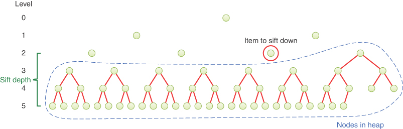

图 13-16 在堆化过程中向下筛选
向下筛选的对象位于整个堆的特定级别 L。 它可以一直筛选到位于 log~2~(N+1) 的叶级别。 图中将 L 与叶级之间的差异表示为筛分深度。 对于叶子，筛选深度为零。 对于叶子的父母来说，它是一个。 树中的每个更高级别都会加一个，直到到达根为止，其中筛选深度为 log~2~(N+1)。
筛选深度限制了必须为特定节点完成的工作量。 如果筛选深度为 S，则最多需要 S × 2 次比较和 S 份副本才能将存储的对象沿路径移动到叶节点。 原因是你需要一次比较来找到最大的子节点，一次最大的子节点与其父母的比较，以及一个副本将最大的子节点向上移动（在最坏的情况下）。
现在你对每个节点的工作都有一个最大限制。 让我们看看整棵树可能需要什么。 假设你有一个完整的二叉树，其中每一层都充满了节点。 在叶节点下方，筛选深度为零，因此你甚至不要尝试筛选它们。 树的一半节点是叶节点（从技术上讲，是 (N + 1) / 2）。 他们不会为整个工作添加任何东西。
从叶子向上一层，S = 1，筛分深度为 1。 该级别有多少个节点？ 恰好有叶子的一半，所以 (N + 1) / 4 最多需要筛选一级。 你可以通过将筛选深度乘以该深度的节点数来开始记下在前两个级别上完成的总工作量：
$$
total\ work\ in\ first\ two\ levels = 0 \frac{N+1}{2} + 1 \frac{N+1}{4}
$$

在这种情况下，1 是 S = 1 时的工作量。如果将比较和复制平均计算，那么实际上可能需要 3 个单位的工作量。 因为那个 3 是一个常量，而稍后在查看 Big O 复杂性时会忽略这些常量，所以你将该常量排除在外。
向上移动一个级别，你达到 S = 2 并且节点数再次减半：
$$
total\ work\ in\ first\ three\ levels = 0 \frac{N+1}{2} + 1 \frac{N+1}{4} + 2 \frac{N+1}{8}
$$

让我们将公共 (N + 1) 部分移出所有级别的总和：

$$
total\ work\ in\ first\ three\ levels = \left ( N+1 \right ) \left ( 0 \frac{1}{2} + 1 \frac{1}{4} + 2 \frac{1}{8}\right ) 
$$
随着筛选深度的增加，一种模式出现了。 总和中的每一项都将筛选深度 S 乘以一个分数，即 ½ 的幂。 当你总结这些级别的 K 时，你会得到

$$
total\ work\ in\ first\ K\ levels = \left ( N+1 \right ) \left ( 0 \frac{1}{2} + 1 \frac{1}{4} + 2 \frac{1}{8} + \cdots + \left ( K-1 \right )\left ( \frac{1}{2} \right )^{K}  \right ) 
$$

请注意，大多数内部节点位于树的底部附近并且具有较小的筛分深度（其中一半的筛分深度为 0）。 树的根具有最大的筛选深度，但只有一个根节点。 因此，你必须处理许多距离较短的节点以进行筛选，而距离较长的节点较少。 在求和中，添加的每个项都小于它之前的项。 这意味着它可能下降得如此之快，以至于它不会继续扩大更多级别的总数。
现在让我们简洁地写下求和。 你从筛选深度 0 到根部的最大筛选深度求和，log~2~(N+1)。 你使用 S 代表筛选深度。 这使得所有级别的总工作量：
$$
total\ work\ = \left ( N+1 \right ) \sum_{S=0}^{log_{2}\left ( N+1 \right ) } S\left ( \frac{1}{2}  \right )^{S+1} 
$$

总工作中的第一项是 (N + 1)。 如果右边那个奇特的求和不随 N 增长，那么你最终会花费 O(N) 的时间完成工作！ 这可能吗？
要回答这个问题，我们需要引入一些其他求和的数学知识。

$$
\sum_{j=0}^{\infty } x^{j} = \frac{1}{1-x}\ \ \ when\ \ \ -1< x < 1
$$

$$
\sum_{j=0}^{\infty }j x^{j} = \frac{x}{(1-x)^{2} }  \ \ \ when\ \ \ -1< x < 1
$$

第一个总和很容易在视觉上看到。 图 13-17 显示了 x 为 ½ 时的示例。 当 ½ 的 0 次方为 1，用左边的方块表示。 当它的 1 次方时，它是该大小的二分之一，由右下角的矩形表示。 对于每个连续的幂，你将最后一个矩形分成两半并将其放在右上角的空间中。

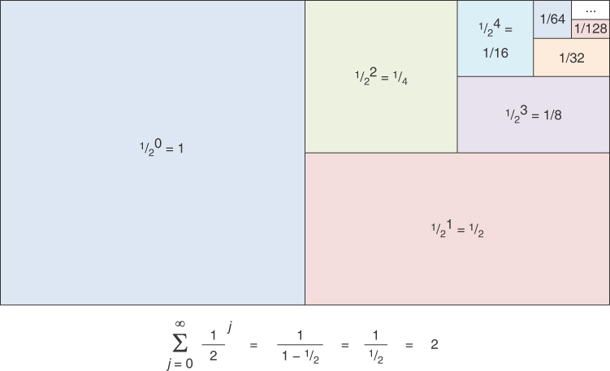

图 13-17 ½ 的幂的无穷和
这些不断缩小的矩形继续填满剩余空间的一半。 它们永远不会缩小到零，但剩余的空间会继续缩小。 随着幂趋于无穷大，所有矩形的总空间总和为 2。你怎么知道的？ 如果你看一下图中包含所有正方形和小矩形的矩形，它恰好是第一个正方形的两倍大，后者刚好占总数的 1 个单位。 查看第一个公式并将 ½ 替换为 x，你将得到 1 / (1 – ½)，即 2。
第二个求和公式是对第一个方程两边求导，然后乘以 x。 这很难在视觉上看到。 如果你以前没见过它，它就是微积分的一部分。
你可以使用第二个求和来简化总功方程式。 通过一直求和到无穷大，而不仅仅是 log~2~(N+1)，你得到了 heapify() 完成的工作的上限。

$$
total\ work = \left ( N+1 \right ) \sum_{S=0}^{\log_{2}{(N+1)} }S\left ( \frac{1}{2}  \right )^{S+1} < \left ( N+1 \right )\sum_{S=0}^{\infty } S\left ( \frac{1}{2}  \right ) ^{S+1}   
$$

S 的求和与 jx^j^ 的公式不太匹配，但你可以通过分解出 ½ 的幂之一来修改它：

$$
total\ work < \frac{N+1}{2} \sum_{S=0}^{\infty } S\left ( \frac{1}{2}  \right )^{S}
$$

在上面的第二个求和公式中用 ½ 代替 x，你得到

$$
total\ work < \frac{N+1}{2} \sum_{S=0}^{\infty } S\left ( \frac{1}{2}  \right )^{S} = \frac{N+1}{2} \frac{\frac{1}{2} }{\left ( 1 -\frac{1}{2}  \right )^{2} } = \frac{N+1}{2}\frac{\frac{1}{2} }{\frac{1}{4} } = N+1   
$$

因此，heapify() 执行的总工作量的上限只是 N 的倍数，这意味着 heapify 在 O(N) 时间内运行。 证明这需要一些复杂的数学运算，但值得付出努力。 这意味着 highest() 在 O(N + K×log N) 时间内运行以找到 K 个最高键项。 与花费 O(N×log N) 时间的 heapsort() 相比，它节省了 O((N – K)×log N – N) 时间。 N 和 K 之间的差异越大，使用 highest() 就越重要。

## 概括
- 堆是一种基本数据结构，它在二叉树中按部分顺序组织对象。
- 具有最大键的项存储在堆树的根部。
- 堆条件要求树节点处的项的键大于或等于其子节点的键（如果有）。
- 堆的二叉树总是完整的。 树的各级都完全满了，最下层只能是右边缺失的节点。
- 优先级队列通常使用堆作为降序优先级队列或升序优先级队列构建（其中最小的键项位于堆树的根部，所有子项的键都大于或等于其父级的键）。
- 堆和优先级队列提供了常用的方法：插入一个新项、删除最大的项以及查看第一个（最大的）项。
- 堆在 O(log N) 时间内提供最大对象的移除和插入。
- 堆支持遍历，但不支持数据的有序遍历，不支持通过特定键定位某一项，也不支持删除。
- 堆通常实现为数组，利用二叉树的完整性将数组单元格唯一映射到树节点。
- 根位于索引 0，最后一项位于索引 N – 1。
- 树的完整性确保使用 0 和 N-1 之间的所有单元格。
- 插入操作是将一个对象放在数组的第一个空单元格中，然后将其筛选到适当的位置。
- 当从根中删除一个对象时，它会被数组中的最后一个对象替换，然后将其筛选到适当的位置。
- 向上筛选和向下筛选过程可以被认为是一系列交换，但更有效地实现为一系列副本。
- 如果堆支持更改任意项的优先级，则它必须首先定位具有该项的节点。 接下来，它的密钥被改变了。 然后，如果增加了键，则向上筛选对象，如果减少键，则向下筛选对象。
- 堆可以使用节点和引用来实现，以形成二叉树（不是搜索树）。 这称为基于树的堆。
- 存在使用树中的项数查找基于树的堆中最后占用的节点或第一个空闲节点的算法。
- Heapsort 是一种高效的排序过程，需要 O(N × log N) 时间。
- 从概念上讲，堆排序包括向堆中进行 N 次插入，然后进行 N 次删除。
- 通过直接对未排序数组中的 N/2 项应用向下筛选算法，而不是插入 N 项，可以使堆排序运行得更快。
- 同一个数组可用于初始无序数据、堆数组和最终排序数据。 因此，heapsort 不需要额外的内存。
- heapify 操作组织数组中的对象以满足堆条件。
- 堆化数组需要 O(N) 时间。
- 在数组中的 N 个对象中查找 K 个最高（或最低）键可以使用 heapify 后跟 K 次移除来高效地完成。
- 找到这些 K 阶统计量的复杂度是 O(N + K×log N)。

## 问题
这些问题旨在作为读者的自测。 答案可以在附录 C 中找到。
1. 当应用于二叉树时，术语完全意味着什么？
   1. 已插入所有必要的数据项。
   2. 所有的行都充满了节点，除了底部的可能。
   3. 所有现有节点都包含数据。
   4. 节点排列满足堆条件。

2. 术语部分有序在应用于堆时是什么意思？
3. 当一个对象从堆中移除时，它总是从 ______ 中移除。
4. 当一个对象被插入到堆中时，
   1. 在根节点处引入一个孔并向下筛选，直到它到达对象应占据的位置。
   2. 搜索从根开始，找到键等于或刚好高于要插入的键的项，并将该项作为该节点的子节点插入。
   3. 将堆中的最大项移动到第一个空单元格，插入新项并向下筛选，直到它到达它应该占据的位置。
   4. 该对象被插入到第一个空单元格中，然后向上筛选直到它到达它应该占据的位置。

5. 堆可以用数组来表示，因为堆
   1. 是一棵二叉树。
   2. 部分完成。
   3. 是部分有序的。
   4. 满足堆条件。

6. 堆中的最后一个节点是
   1. 总是一个左子节点。
   2. 总是一个正确的子节点。
   3. 总是在最后一行。
   4. 绝不会低于它的兄弟节点。

7. 堆之于优先级队列就像 a(n) _______ 之于堆栈。
8. 向上筛选和向下筛选哪个操作更复杂？ 为什么？
9. 堆排序的基本概念涉及
   1. 从堆中删除数据项，然后再次插入它们。
   2. 将数据项插入堆中，然后删除它们。
   3. 将两个堆中的数据复制到另一个空堆中，合并它们的项。
   4. 将表示堆的数组中的数据复制到堆树。

10. 执行堆排序需要多少个数组，每个数组都大到足以容纳所有数据？
11. 运行堆排序的时间复杂度为 O(______)。
12. 与快速排序相比，堆排序是_______。
13. 堆化数组：
    1. 数组后半部分的对象被筛选。
    2. 数组中的对象按顺序插入到单独的堆数据结构中。
    3. 数组被重新排序以建立节点之间的堆条件。
    4. 堆排序算法应用于部分堆树的叶节点。

14. N 项数组上的 heapify() 例程需要 O(______) 时间。
15. 从 N 项数组中获取 K 个最高键控项需要 O(______) 时间。

## 实验
进行这些实验将有助于深入了解本章所涵盖的主题。 不涉及编程。
13-A 假设你有一个堆 H，你在上面插入一个对象 M，它的键值比当前堆中的任何对象都大。 如果你现在从堆中删除一个对象，你将获得对象 M 作为返回的对象。 两次操作后的堆会和之前一样吗？ 相同的意思是所有对象都与之前一样位于二叉树的相同节点中。 为什么或者为什么不？

13-B 当具有相同键的对象在对象数组排序后保持相同的相对顺序时，排序算法被称为稳定。 清单 13-7 的 heapsort() 是否实现了稳定排序？ 为什么或者为什么不？

13-C 虽然可视化工具不执行堆排序，但它可以阐明实验 13-B。 插入一些具有相同键的对象。 然后删除它们。 节点的颜色是次要数据项。 仔细注意分配给每个对象的颜色。 你能找到以与插入顺序相反的方式删除对象的示例吗？

13-D 堆中插入数据的顺序会影响堆的排列吗？ 使用堆可视化工具找出答案。 尝试使用一组七个不同的键并以不同的顺序插入它们。

13-E 使用可视化工具的插入按钮将 10 个对象按升序插入空堆中。 如果你使用 Remove Max 按钮移除这些对象，它们会以相反的顺序脱落吗？ 答案会根据插入的 10 个对象而改变吗？

## 编程对象
编写程序来解决编程对象有助于巩固你对材料的理解并演示如何应用本章的概念。 （如简介中所述，合格的讲师可以在出版商的网站上获得编程对象的完整解决方案。）
**13.1** 向 Heap 类添加两个 levels() 方法，返回堆中的层数。 空堆的级别为零。 具有一个对象的堆具有一个级别。 层数比最深的叶节点的层数多一层。 levels_loop() 通过创建一个循环来实现 levels_loop() ，该循环下降堆树以找到最深的叶子，并计算沿途的级别。 通过使用 Python 的数学包及其对堆中对象数的 log2() 函数来实现 levels()。 在 0 到 33 个对象的堆上测试你的程序。

**13.2** 创建一个 Heap 版本，在其构造函数中接受一个标志来选择升序堆，而不是降序堆。 换句话说，词根的对象键是最小的，而不是最大的，并且在选择上升时，子对象的键大于或等于其父。 确保升序堆和降序堆的所有操作都能正常工作。

**13.3** 为 Heap 类实现一个 merge() 方法，该方法采用第二个堆并将其项合并到对象中。 该方法应检查两个堆的关键函数是否相同，如果不同则引发异常。 有没有比从第二个堆中删除对象并将它们插入第一个堆更快的合并堆的方法？ 提示：考虑对堆排序和 K highest 的分析。 演示你的程序合并空堆和非空堆，以及具有不同键函数的堆。

**13.4** 为 Heap 类实现 replaceItem() 方法，其行为类似于"其他操作"部分中描述的 change_priority() 方法。 replaceItem() 方法应该有两个参数：一个已经在堆中的对象和一个要替换它的新对象。 因为堆只有从项中提取键的功能，它不能更新现有项的键，所以必须用新的项来替换它。 你的实现必须在堆中找到现有项，如果找不到则引发异常。 找到该对象后，它应该替换该对象，然后向上或向下筛选它，具体取决于新对象键是大于还是小于旧对象键。

通过不搜索现有项的键超过子堆顶部键的子堆，可以更有效地搜索要替换的项。 子堆中的所有键必须具有相等或更低的值。 这种子堆过滤可以通过从仅包含根索引的队列开始来完成。 在每次迭代中，从队列中删除一个索引。 如果它索引了目标项，则停止并返回该值。 如果不是，如果子节点索引的键等于或超过目标键，则将其放入队列中。 如果队列变空，则该对象不在堆中。

展示这些案例的程序结果：

- 对象存在于堆中； 替换项具有更高的键
- 对象存在于堆中； 更换物品有一个较低的键
- 对象不在堆中并且具有比堆中所有项更高的键
- 对象不在堆中，并且其键低于堆中的所有项

**13.5** 使用为编程对象 11.5 构建的词频统计程序分析文本文件中最常用的 20 个和最不常用的 20 个词。 提醒一下，词频程序读取文本文件，提取单个词，并使用哈希表计算它们出现的次数。 程序应该遍历哈希表中的对象并将它们插入到一个普通数组中。 然后可以使用字数作为键首先按降序对数组进行堆化，然后按升序对数组进行堆化。 使用 highest() 子例程之类的东西来提取和打印每个订单的前 20 个。 如果文本文件中的不同单词少于 40 个，请小心。 找到前 K 个词不会产生好的词云，因为最常出现的词很可能是文本源语言中最常见的词，但它仍然可以产生有趣的结果。
