# 图

在这一章当中

- 图简介
- 遍历和搜索
- 最小生成树
- 拓扑排序
- 有向图中的连通性

图是计算机编程中使用的最通用的结构之一。 它们出现在各种问题中，这些问题通常与我们迄今为止在本书中处理的问题大不相同。 如果你正在处理一般类型的数据存储问题，例如数据库中的记录，你可能不需要图形，但对于某些问题——而且它们往往是有趣的问题——图形是必不可少的。
我们对图的讨论分为两章。 在本章中，我们介绍了与未加权图相关的算法，展示了这些图可以表示的一些问题，并提供了一个可视化工具来探索它们。 在下一章中，我们将研究与加权图相关的更复杂的算法。

## 图简介

图是数据结构而不是树。 在数学意义上，树是一种特殊的图。 然而，在计算机编程中，图的使用方式与树不同。
本书前面研究的数据结构具有与在其上使用的算法交织在一起的体系结构。 例如，二叉树的结构是这样的，因为这种"形状"使得搜索数据和插入新数据变得容易。 树中节点之间的链接代表从父节点到子节点的快捷方式。
另一方面，图形通常具有由物理或抽象问题决定的形状。 例如，图中的节点可能代表城市，而边（链接）可能代表城市之间的航线或公路或铁路。 另一个更抽象的示例是表示完成项目所需的各个任务的图形。 在图中，节点可以表示任务，而有向边（一端带有箭头）表示必须先完成哪个任务。 在这两种情况下，图形的形状都来自特定的现实世界情况。
如果图形代表现实世界的事物，它们可以用来做什么？ 好吧，描述交通连接的那些可以用来找到从一个地方到另一个地方的所有可能方式。 如果你只对最短路径（或最长路径）感兴趣，可以使用图形算法找到该路径。 当图表表示人与人之间的交流时，你可以找到形成社区或组织的人群。 同样，通信图可用于查找彼此孤立的人或群体。
在进一步讨论之前，我们必须提到，在讨论图时，节点传统上称为顶点（单数是顶点）。 顶点之间的链接称为边。 原因可能是图的命名法比树的命名法更早，几个世纪前就出现在数学中。

### 定义

图 14-1 显示了华盛顿西雅图附近主要高速公路的简化地图。 地图旁边是模拟这些高速公路的图表。

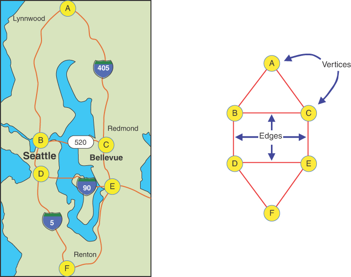

图 14-1 路线图和相应的图表
在图中，圆圈代表高速公路立交桥，连接圆圈的直线代表高速公路路段。 圆是顶点，线是边。 顶点通常以某种方式标记——通常，如此处所示，带有字母表中的字母。 每条边连接并以其两端的两个顶点为界。
该图不反映地图上显示的确切地理位置； 它只显示顶点和边的关系——即哪些边连接到哪个顶点。 它不关心物理距离或方向（即使图中显示的方向与地图大致相同）。 该图提供的主要信息是一个交叉路口与另一个交叉路口的连通性（或不连通），而不是实际路线。

### 邻接和邻居

如果两个顶点由一条边连接，则称它们彼此相邻。 因此，在图 14-1 中，顶点 C 和 E 相邻，但顶点 C 和 F 不相邻。 与给定顶点相邻的顶点被称为它的邻居。 例如，顶点 D 的邻居是 B、E 和 F。

### 路径

路径是一系列边。 图 14-1 中的图有一条从顶点 A 到顶点 F 并经过顶点 B 和 D 的路径。按照惯例，我们称这条路径为 ABDF。 两个顶点之间可以有不止一条路径； 从 A 到 F 的另一条路径是 ACEF。 因为这张图来自道路网络，所以你可以很容易地看到现实世界的路线与图中路径的对应关系。

### 连通图

如果从每个顶点到每个其他顶点至少有一条路径，则称该图是连通的，如图 14-1 中的图所示。 如果"你不能从这里到达那里"（就像一个农村农民可能会告诉城市里停下来问路的聪明人），这个图就没有连接。 例如，北美的公路网没有与日本的公路网相连。 非连通图由多个连通分量组成。 在图 14-2 中，显示了具有相同顶点组的两个图。 在左边的图中，所有五个顶点都相连，形成一个连通分量。 右图有两个连通分量：B-D 和 A-C-E。

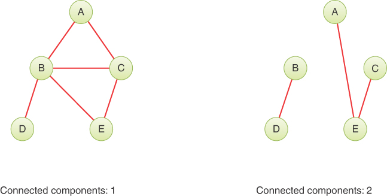

图 14-2 连通图和非连通图
请注意，边总是连接图中的两个顶点。 例如，消除图 14-2 右侧图中的顶点 D 并留下连接到 B 的"悬挂"边是不正确的。
为简单起见，我们在本章中讨论的算法被编写为适用于连通图或非连通图的一个连通分量。 如果合适，小的修改通常也能使它们与非连通图一起工作。

### 有向图和加权图

图 14-1 和图 14-2 显示了无向图。 这意味着边缘没有方向； 你可以选择任何一种方式。 因此，你可以同样轻松地从顶点 A 到达顶点 B，或从顶点 B 到达顶点 A。 无向图对河流和道路进行了适当的建模，因为你通常可以在它们上走任何一条路（至少，在缓慢流动的河流上）。 有时无向图被称为双向图。
图通常用于模拟只能沿边沿一个方向行驶的情况——从 A 到 B，但不能从 B 到 A，例如在单行道上、高速公路的北行或南行车道，或下游 在有瀑布和急流的河流上。 这样的图被称为有向图。 允许的方向通常在边的末端用箭头表示。 有向图中的有效路径是边序列，其中边 J 的结束顶点是边 J + 1 的起始顶点。
在一些图中，边被赋予了一个数字权重。 权重用于对某些事物建模，例如两个顶点之间的物理距离，或者从一个顶点到另一个顶点所需的时间，或者从一个顶点到另一个顶点的旅行成本（例如，在航线上）。 这样的图称为加权图。 我们将在下一章探讨它们。
在本章中，我们开始讨论简单的无向、未加权图； 稍后我们探索有向的、未加权的图。 我们绝不涵盖适用于图形的所有定义和描述； 随着我们的进行，我们会介绍更多。

### 图的首次使用

18 世纪初，莱昂哈德·欧拉 (Leonhard Euler) 是最早使用图形的数学家之一。 他解决了一个与波罗的海沿岸柯尼斯堡镇的桥梁有关的著名问题。 如图14-3所示，这个河上小镇包括一个岛屿和七座桥。

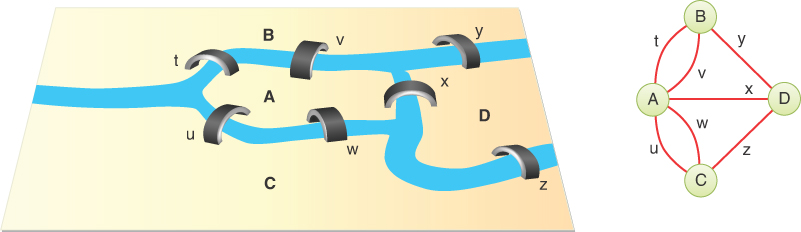

请注意，在 Königsberg 桥梁图中，多座桥梁连接不同的陆地区域。 例如，岛 A 通过桥梁 u 和 w 连接到河流 C 的下游。 该图显示了多条边，并标记了边以区分它们。 允许多条边连接一对顶点的图的术语是多重图。 在这种情况下，边标签不是权重——只是区分顶点 A 和 C 之间可能路径的方法。

### 在程序中表示图形

像欧拉和其他数学家所做的那样，抽象地考虑图形是很好的，但是你想用计算机来表示图形。 什么样的软件结构适合建模图？ 让我们先看顶点，再看边。

### 顶点

在抽象图形程序中，你可以简单地将顶点编号为 0 到 N–1（其中 N 是顶点数）。 你不需要任何类型的变量来保存顶点，因为它们的有用性取决于它们与其他顶点的关系。
然而，在大多数情况下，顶点代表一些真实世界的对象，并且必须使用数据项来描述该对象。 例如，如果一个顶点在航线模拟中代表一个城市，它可能需要存储城市名称、机场名称、高度、位置、跑道方向和其他此类信息。 因此，用顶点类的对象来表示顶点通常很方便。 我们的示例程序仅存储名称字符串（如 A），用作识别顶点的标签。 清单 14-1 显示了基本 Vertex 类的外观。
清单 14-1 基本顶点类

```python
class Vertex(object):  # A vertex in a graph
    def __init__(self, name):  # Constructor: stores a vertex name
        self.name = name  # Store the name

    def __str__(self):  # Summarize vertex in a string
        return f"<Vertex {self.name}>"
```

请注意，name 属性在这里声明为 public。 原因是你可以允许调用者在各种操作期间对其进行操作，而不会影响包含它的图形。
顶点对象可以放在一个数组中，并使用它们的索引号进行引用。 顶点也可以放在列表或其他一些数据结构中。 唯一的顶点索引或对象本身可以在图中标识该顶点。
对于具有纬度和经度等坐标的顶点，将它们存储在四叉树中可能是有意义的，如第 12 章"空间数据结构"中所述。 将它们置于保留其唯一标识符的某种结构中很重要，这样即使调用者更改名称或其他属性，也可以检索顶点。 如果使用四叉树，则不能在不更改顶点在四叉树中的位置的情况下更改顶点的坐标。 对于具有简单标记顶点的图，如果顶点始终保持在其原始索引处，则数组适合存储。
无论顶点使用何种结构，这种存储只是为了方便。 它与它们如何通过边连接无关。 对于边缘，你需要另一种机制。

### 边

在第 8 章"二叉树"中，你看到计算机程序可以用多种方式表示树。 该章主要检查了树，其中每个节点都包含对其子节点的引用，但你还了解到可以使用数组，节点在数组中的位置指示它与其他节点的关系。 第 13 章，"堆"，描述了用于表示一种称为堆的特殊树的数组。
然而，图通常不具有与树相同的固定组织。 在二叉树中，每个节点最多有两个子节点，但图中的每个顶点都可以连接到任意数量的其他顶点。 例如，在图 14-2 中，左侧图的顶点 B 与其他四个顶点相连，而 D 仅与一个顶点相连。
为了模拟这种自由形式的组织，一种不同的表示边的方法比用于树的方法更可取。 几种方法通常用于图形。 我们检查两个（虽然有些人可能称之为三个）：邻接矩阵和邻接表。 请记住，如果一个顶点由一条边连接，而不是通过多条边的路径，则称它们相邻。

### 邻接矩阵

邻接矩阵可以表示为二维数组，其中的元素指示两个顶点之间是否存在边。 如果一个图有 N 个顶点，则邻接矩阵是一个 N×N 数组。 表 14-1 显示了图 14-2 左侧图的邻接矩阵示例，在此重复。
表 14-1 邻接矩阵

|      | A    | B    | C    | D    | E    |
| ---- | ---- | ---- | ---- | ---- | ---- |
| A    | 0    | 1    | 1    | 0    | 0    |
| B    | 1    | 0    | 1    | 1    | 1    |
| C    | 1    | 1    | 0    | 0    | 1    |
| D    | 0    | 1    | 0    | 0    | 0    |
| E    | 0    | 1    | 1    | 0    | 0    |

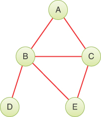

顶点标签用作行和列的标题。 两个顶点之间的边用 1 表示； 没有边是 0。（你也可以使用布尔值 True/False。）如你所见，顶点 B 与所有其他四个顶点相邻； A与B和C相邻； C与A、B、E相邻； D仅与B相邻； 并且E与B和C相邻。在这个例子中，顶点与自身的"连接"用0表示，所以从左上角到右下角的对角线A-A到E-E，称为恒等对角线和阴影灰色 ，全为0。 恒等对角线上的条目不传达任何真实信息，所以你同样可以在其中放置 1，如果这对程序来说更方便的话。 （一种称为伪图的图允许从顶点到自身的边。此类图可以使用邻接矩阵的对角线来表示此类边的存在或不存在。）
请注意，矩阵对角线上方的三角形部分是下方部分的镜像； 两个三角形包含相同的信息。 这种冗余有点低效，但在大多数计算机语言中都没有简单的方法来创建三角数组，所以接受冗余更简单。 因此，当你向图中添加一条边时，你会在邻接矩阵中创建两个条目而不是一个条目。
请注意，在本章中，我们关注的是未加权的图，并且边不需要像 Königsberg 桥那样的单独标签。 允许一对顶点之间存在多条边的图称为多重图。 它们可能非常有用，就像 Königsberg 的桥梁一样，但超出了本文的范围。

### 对邻接矩阵使用哈希表

提高存储效率的一种方法是将矩阵保留为哈希表而不是二维数组。 为此，哈希表必须接受包含两部分的键——每个顶点一个。 正如第 11 章"哈希表"中所讨论的，这很简单。 字符串中的单个字符或元组中的索引可以使用散列函数中的不同权重进行散列，以生成单个散列索引。
要使用哈希表邻接矩阵表示边，你可以在特定的一对顶点处创建一个条目。 例如，要在顶点 2 和 7 之间添加一条边，你可以为键 (2, 7) 插入一个值。 使用第 11 章的数据结构，你可以写

```python
adjacencyMatrix = HashTable()
adjacencyMatrix.insert((2, 7), True)
```

将边放入矩阵后，程序可以使用哈希表的 search() 方法确定两条边是否相邻。 例如，要查看两个顶点是否相邻，你可以计算 adjacencyMatrix.search((4, 12))。 如果没有输入 (4, 12)，搜索将返回 None，Python 在布尔上下文中将其视为 False。 如果为该键创建了一个条目，则将返回其 True 值。
使用哈希表或二维数组，你可以通过始终在第一个位置使用较小的顶点索引来避免矩阵的两个三角形半部分的重复存储。 换句话说，要检查顶点 19 是否通过双向边与顶点 8 相邻，你可以检查矩阵 (8, 19) 而不是 (19, 8)。 对矩阵的所有操作（插入、删除和搜索）都需要重新排序顶点索引。 这为每个操作增加了一些额外的时间。 当搜索比插入和删除更频繁时，通过同时使用排序和更新两个矩阵单元来增加插入和删除操作的时间的替代方法通常更可取。 正如你稍后会看到的，它对于方向图也更好。
当边很少时，哈希表比二维数组有额外的好处。 例如，如果一个图有 1000 个顶点和 2000 个边，则二维数组需要存储 100 万个单元，而哈希表只需要 2000 个边（因此可能有 4000 个单元）。 对于大型图，这种差异变得很重要，因为二维数组所需的内存是 O(N^2^)，其中 N 是顶点的数量，限制了计算机内存中可以保存的内容。
另一方面，二维数组更容易分解成行和列。 开发了许多图形算法以利用快速访问行和列的能力。 表示的选择取决于需要在图上快速完成哪些操作。

### 邻接表

表示边的另一种常用方法是使用列表。 邻接表中的列表指的是第 5 章"链表"中讨论的那种链表。 实际上，邻接表是列表的数组，有时是列表的列表，有时是存储在每个 Vertex 中的列表。 每个单独的列表都包含对该顶点的相邻顶点的引用。 表 14-2 显示了图 14-2 左侧图的邻接表，此处重复。
表 14-2 邻接列表

| 顶点 | 相邻顶点列表 |
| ---- | ------------ |
| A    | B→C          |
| B    | A→C→D→E      |
| C    | A→B→E        |
| D    | B            |
| E    | B→C          |


在此表中，→符号表示链表中的链接。 列表中的每个链接都是一个顶点。 在这里，顶点在每个列表中按字母顺序排列，尽管这不是绝对必要的。 更有可能的是，顶点的顺序将取决于边添加到图中的顺序。
不要混淆邻接表的内容和路径。 邻接列表显示哪些顶点与给定顶点相邻（一条边远离），而不是从顶点到顶点的路径。
在下一章中，我们将讨论何时使用邻接矩阵而不是邻接表。 本章所示的可视化工具展示了邻接矩阵方法，但在许多情况下，列表方法更有效。

### 向图形添加顶点和边

要向图中添加一个顶点，你需要创建一个新的 Vertex 对象，将其插入一个顶点数组或列表中，然后增长邻接结构，我们稍后将对此进行讨论。 在真实程序中，一个顶点可能包含许多数据元素，但为了简化程序示例，你可以假设它只包含一个属性，即它的名称。 （可视化工具还将不同的颜色与顶点相关联，除了它们的名称之外，以指示它们引用的不同数据。）因此，顶点的创建看起来像这样：

```python
vertices.append(Vertex('F'))
```

此命令在称为顶点的 Python 数组的末尾插入一个名为 F 的顶点对象。
如何向图形添加边取决于你是使用邻接矩阵还是邻接列表来表示图形。 假设你正在使用邻接矩阵并希望在顶点 1 和 3 之间添加一条边。这些数字对应于存储顶点的顶点数组索引。
创建邻接矩阵时，它将具有特定的大小。 如果添加一个新顶点意味着它需要额外的行和列，则数组将需要增长。 首次创建邻接矩阵 adjMat 时，它用 0 或布尔值 False 填充。 当它增长时，所有新的单元格都必须填充相同的值。 以哈希表表示的邻接矩阵在添加新顶点时不需要增长。 如第 11 章"哈希表"中所述，当边缘作为新键添加时，它们会增长。

### 二维数组和 Python

要在 Java 或 C++ 中的二维数组中的顶点 1 和 3 之间插入边，你可以编写

```java
adjMat[1][3] = 1;
adjMat[3][1] = 1;
```

核心 Python 语言仅支持一维数组，尽管像 NumPy 这样的扩展提供了多维数组。 你可以将一个数组存储在另一个数组的单元格中以近似多维数组。 例如，你可以创建一个顶点数组和一个邻接矩阵，并使用如下代码插入一条边：

```python
vertices = []                  # A list of vertices
vertices.append(Vertex('A'))
vertices.append(Vertex('B'))
vertices.append(Vertex('C'))
vertices.append(Vertex('D'))

adjMat = [
    [False for v in range(len(vertices))] for _ in range(len(vertices))
]
adjMat[1][3] = True
adjMat[3][1] = True
```

为了创建邻接矩阵，我们使用了嵌套列表理解来创建一个由数组填充的外部数组。 内部理解，[False for v in range(len(vertices))]，创建一个包含四个单元格的列表/数组，其中填充了值 False。 外部理解重复内部创建四次以创建四个填充列表/数组的单元格。 最后两个赋值语句的结果使 adjMat 保持不变

```python
[[False, False, False, False],
 [False, False, False, True],
 [False, False, False, False],
 [False, True,  False, False]]
```

True 值显示在由 (1, 3) 和 (3, 1) 索引的行和列中。 请注意，Python 使用乘法运算符扩展列表/数组的功能在这里无法正常工作。 如果你试试

```python
badMat = [ [False] * len(vertices) ] * len(vertices)
badMat[1][3] = True
```

生成的 badMat 数组包含

```python
[[False, False, False, True],
 [False, False, False, True],
 [False, False, False, True],
 [False, False, False, True]]
```

那不是你想要的，但为什么会这样呢？ 原因是乘法运算符用完全相同的值填充扩展列表的单元格。 内部乘法创建一个包含 False 值的四元胞数组。 外部乘法进行相同类型的扩展，每个单元格都填充了对同一个内部四单元格数组的引用。 因为同一个内部数组在外部数组的所有单元格之间共享，所以将 True 分配给一行中的单元格 3 会影响所有行。

### 在邻接表中存储边

回到使用邻接表的概念，它们具有类似的嵌套列表/数组结构，但有显着差异。 它们不是每行具有相同的长度，而是顶点索引的可变长度列表。 例如，

```python
adjList = [ [] for v in range(len(vertices)) ]
adjList[1].append(3)
adjList[3].append(1)
```

产生一个包含的数组

```python
[[], [3], [], [1]]
```

该数组的单元格包含顶点索引列表。 单元格 0 具有顶点 0 的（空）顶点列表，依此类推。 完整的邻接表显示顶点 0 和 2 没有边，而顶点 1 和 3 共享一条边。
请注意，乘法运算符也无法用于邻接列表。 例如，

```python
badList = [[]] * len(vertices)
badList[1].append(3)
```

产生

```python
[[3], [3], [3], [3]]
```

列表理解方法有效地执行一个循环，为其输出数组创建单独的元素； 这就是它在每次迭代中构建单独列表的方式。

### 图类

让我们用一个 Python Graph 类来更具体地讨论这个问题，该类构建一个顶点列表和一个邻接矩阵，并包含添加顶点和边的方法。 清单 14-2 显示了代码。
此实现使用 Python 的列表类型来管理顶点列表和 dict 类型来存储邻接矩阵。 这两个结构的行为类似于你在前面章节中看到的 Stack 和 HashTable 类，但语法有所不同。 Graph 的构造函数创建一个名为 _vertices 的空列表和一个名为 _adjMat 的空字典。 你在第 12 章"空间数据结构"中看到了用于存储单元格网格的哈希表。 如果你跳过了这一点，我们将在此处更详细地描述 Python 的 dict 类型作为字典（哈希表）的使用。
构造函数中的花括号 {} 创建了一个空哈希表，可以接受大多数 Python 数据结构作为键。 对于这个图，我们使用顶点索引的元组，如 (2, 7)，作为邻接矩阵的键。 当我们需要在特定元组的邻接矩阵中存储 1 时，我们可以写

```python
self._adjMat[(2, 7)] = 1
```

\_adjMat 之后的方括号将哈希表的键括起来。 这告诉 Python 它应该对里面的键进行哈希处理，以找到将值放在哈希表中的位置。 稍后我们可以使用相同的语法从哈希表中检索值。
你还可以使用稍微简单的语法

```python
self._adjMat[2, 7] = 1
```

做同样的事情。 对于熟悉其他语言的程序员来说，这种语法可能看起来像多维数组引用，但事实并非如此。 括号内表达式中的逗号告诉 Python 构造一个元组。 在这种情况下，它构造元组 (2, 7) 并将其用作哈希表的键。 哈希函数在计算哈希表索引时使用所有元组元素。 这意味着该值存储在键 (2, 7) 的唯一位置。 在二维数组中，第 2 行第 7 列的单元格将被寻址，但在哈希表中，使用其一维数组中的某个位置。 对于调用程序来说，调用哪个并不重要，只要它稍后在哈希表中引用 (2, 7) 时找到完全相同的单元格即可。
清单 14-2 基本图形类

```python
class Graph(object):  # A graph containing vertices and edges
    def __init__(self):  # Constructor
        self._vertices = []  # A list/array of vertices
        self._adjMat = {}  # A hash table mapping vertex pairs to 1

    def nVertices(self):  # Get the number of graph vertices, i.e.
        return len(self._vertices)  # the length of the vertices list

    def nEdges(self):  # Get the number of graph edges by
        return len(self._adjMat) // 2  # dividing the # of keys by 2

    def addVertex(self, vertex):  # Add a new vertex to the graph
        self._vertices.append(vertex)  # Place at end of vertex list

    def validIndex(self, n):  # Check that n is a valid vertex index
        if n < 0 or self.nVertices() <= n:  # If it lies outside the
            raise IndexError  # valid range, raise an exception
        return True  # Otherwise it's valid

    def getVertex(self, n):  # Get the nth vertex in the graph
        if self.validIndex(n):  # Check that n is a valid vertex index
            return self._vertices[n]  # and return nth vertex

    def addEdge(self, A, B):  # Add an edge between two vertices A & B
        self.validIndex(A)  # Check that vertex A is valid
        self.validIndex(B)  # Check that vertex B is valid
        if A == B:  # If vertices are the same
            raise ValueError  # raise exception
        self._adjMat[A, B] = 1  # Add edge in one direction and
        self._adjMat[B, A] = 1  # the reverse direction

    def hasEdge(self, A, B):  # Check for edge between vertices A & B
        self.validIndex(A)  # Check that vertex A is valid
        self.validIndex(B)  # Check that vertex B is valid
        return self._adjMat.get(  # Look in adjacency matrix hash table
            (A, B), False
        )  # Return either the edge count or False
```

请注意，用于寻址一维数组和哈希表的 Python 语法是相同的。 当 Python 看到 var[2] 时，它会查看 var 变量的类型以确定下一步要做什么。 如果 var 是列表，则括号中的表达式应该是其数组单元格之一的整数索引。 如果 var 是一个字典，那么括号中的内容包含一个要被散列的键。 诸如 (2, 7) 之类的顶点编号的元组被视为单个哈希键。
转到清单 14-2 的 Graph 类中定义的第一个方法，你会发现 nVertices() 使用 Python 的 len() 函数来获取包含顶点的列表/数组的长度。 新构造的 Graph 有一个空的 _vertices 列表，因此长度为零。
第二种方法 nEdges() 与此类似，但在其计算中使用哈希表的长度 _adjMat。 Python 使用已存储在哈希表中的键的数量作为其长度。 因为我们计划将顶点对连同它们的镜像一起存储——例如 (2, 7) 和 (7, 2)——作为每条边的单独键，所以边的总数是键数的一半。
第三种方法，addVertex()，通过使用 Python 内置的 append() 方法在 \_vertices 列表上添加一个顶点到图中。 这就像将一个元素压入堆栈（假设堆栈的顶部是列表的末尾）。 我们在这个方法中遗漏了一个检查，即顶点参数是清单 14-1 中定义的 Vertex 对象之一，但包含它会很好。
接下来，该程序介绍了一个简单的有效顶点索引 validIndex() 测试。 因为调用者通过索引指定顶点，所以他们可以指定已添加到图中的索引范围之外的索引。 这个谓词——一个带有布尔结果的函数——检查索引是否位于 [0, nVertices) 范围之外，如果超出则引发 IndexError 异常。 这与 Python 用于无效数组索引的异常相同。
getVertex() 方法根据索引 n 从图中获取顶点。 验证索引后，可以从数组中检索顶点对象。
addEdge() 方法采用两个顶点索引 A 和 B 作为参数。 要创建边，它首先验证 A 和 B 是否都是有效的顶点索引。 如果没有这些检查，图表可能会变得内部不一致。 它还检查 A 和 B 是否是相同的索引。 这将创建一条从顶点到自身的边。 这个简单的 Graph 类不允许创建伪图。 最后，该方法更新邻接矩阵以创建边。 它使用顶点的两个顺序，因为边是双向的。
我们现在有了一个基本的 Graph 对象，它可以扩展以接受任意数量的顶点和边。 下一个重要的方法是测试两个顶点之间是否存在边。 hasEdge() 方法采用两个顶点索引 A 和 B 作为参数。 像以前一样检查它们的有效性。 使用有效索引，可以检查邻接矩阵以查看是否定义了边。 你可能希望使用相同的 Python 语法 \_adjMat[A, B] 来测试该边缘。 但是，如果边缘不存在，则会导致问题。 当要求访问之前未插入的键时，Python 哈希表会引发 KeyError 异常。
有几种方法可以解决邻接矩阵中丢失的键。 一种是捕获访问 \_adjMat[A, B] 时可能发生的 KeyError 异常。 另一种是对哈希表使用 Python 的 get() 方法，这就是这个实现所做的。 get() 方法将键作为第一个参数加上第二个参数，如果键不在哈希表中则返回值。 我们传递元组 (A, B) 作为键。 默认值设置为 False，以便 hasEdge() 在边不存在时返回该值。 如果边确实存在，则调用 get() 将返回 1，即由 addEdge() 插入的值，在布尔上下文中被解释为 True。
另一种实现 hasEdge(A, B) 检查的方法是在 self.\_adjMat 中返回此表达式 (A, B) 的值。 Python 使用 in 运算符来测试一个键是否已经插入到哈希表中。 因为我们只将 \_adjMat 中的值设置为 1，所以我们可以忽略该值并只检查密钥是否存在。 然而，当边被删除时，如果我们在 self.\_adjMat 测试中使用 (A, B)，我们不能简单地将值设置为 0； 我们需要从哈希表中删除密钥。

## 遍历和搜索
对图执行的最基本操作之一是查找可以从指定顶点到达哪些顶点。 此操作用于查找图形的连接组件，并且是许多更复杂操作的基础。 当我们查看图表时，通常很明显哪些顶点是相连的，至少对于简单的图表来说是这样。 然而，对于计算机来说，它必须通过将边链接在一起来发现连接了哪些顶点。 让我们看一些发现连接的例子。
想象一下，你正乘飞机或乘船去国外度假。 在那里，你将骑自行车游览乡村，并且你想知道所有可以去的地方。 柏油路和一些土路适合旅行，但关闭维修或被泥泞或洪水冲毁的道路不值得穿越。 道路状况可能在某处编目，但在某些情况下，你必须到附近的位置才能确定道路是否可以通行。 根据路况，有些城镇可以到达，有些则不能。 你仍然希望尽可能享受最好的假期，因此你会确定哪些地方可以骑自行车到达，并决定你在这些地方之间的路线。 你可能需要在旅行时重新制定计划，并详细了解每个地区的路况。
其他需要查找从指定顶点可达的所有顶点的情况是设计电路和管道网络。 电子电路由晶体管等组件组成，这些组件通过导线或金属路径等导体连接。 在管道网络中，热水器、水龙头、排水管和燃气灶等各种组件通过管道连接。 图 14-4 显示了电子电路和管道网络的小示例。 在这两种情况下，许多组件都是连接的，而其他组件则没有。 完成连接对它们的功能至关重要。 否则，热水可能无法到达特定的水龙头，或者来自天线的信号可能无法到达解码器。 也许更重要的是，断开连接的顶点必须保持原样——以免电源直接连接到扬声器或燃气供应连接到水龙头。

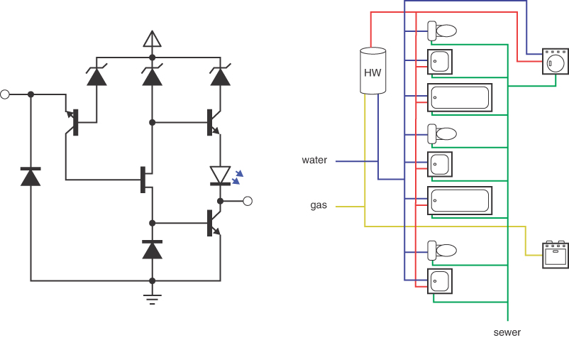

图 14-4 电子电路和管道网络
在这些类型的网络中，找到连接到给定顶点的所有顶点很重要。 这定义了图形的连接组件。 每个连接的组件必须以电气或管道连接的形式实现。 在像图 14-4 这样的图表中，你通常很容易看到这一点，尤其是当管道图中边缘的颜色清楚地区分管道种类时。 就骑自行车的道路网络而言，情况就不太清楚了，尤其是当你必须前往一个地区了解什么是连通的，什么不是。
假设你已获得描述网络的图表。 现在你需要一种算法，它提供一种系统的方法来从指定的顶点开始并沿着边移动到其他顶点，这样当它完成时，你可以保证它已经访问了连接到起始顶点的每个顶点。 在这里，就像我们在第 8 章讨论二叉树时所做的那样，访问意味着对顶点执行一些操作，例如显示它、将它添加到集合中或更新它的属性之一。
有两种常见的遍历图的方法：**深度优先**（DF）和**广度优先**（BF）。 两者最终都会到达所有连接的顶点，但访问它们的顺序不同。 深度优先遍历是用栈实现的，而广度优先是用队列实现的。 你可以遍历所有连接的顶点，或者在找到特定顶点时停止。 当目标是在特定顶点停止时，该操作称为深度优先搜索 (DFS) 或广度优先搜索 (BFS)，而不是遍历。
你在第 8 章中看到，二叉树的不同遍历顺序（前序、中序和后序）具有不同的属性和用途。 图形也是如此。 选择深度优先还是广度优先取决于操作的目标。

### 深度优先

深度优先遍历使用堆栈来记住它到达死胡同（没有相邻的未访问顶点的顶点）时应该去哪里。 我们在这里展示一个示例，鼓励你使用图形可视化工具尝试类似的示例，然后最后展示一些执行遍历的代码。

#### 一个例子

让我们看看与图 14-5 中的图相关的深度优先遍历背后的想法。 此图中的彩色数字和虚线箭头显示了访问顶点的顺序（这与用于标识顶点的 ID 号不同）。

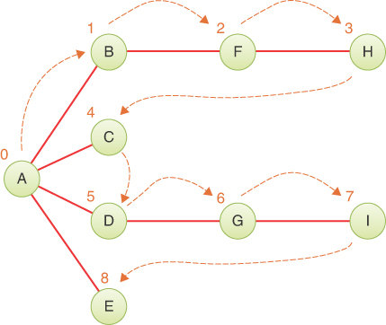

图 14-5 深度优先遍历示例
为了执行深度优先遍历，你选择一个起点——在本例中是顶点 A。然后你做三件事：访问这个顶点，将它压入堆栈以便你记住它，并标记它以便你 不会再访问它。
接下来，你将转到与 A 相邻但尚未访问过的任何顶点。 我们假设顶点是按字母顺序选择的，这样就会出现 B。你访问 B，标记它，然后将它压入堆栈。
怎么办？ 你在 B，你做和以前一样的事情：去一个没有被访问过的相邻顶点。 这将引导你找到 F。我们可以将此过程称为规则 1。
***规则1***

- 如果可能，访问一个相邻的未访问的顶点，标记它，并将其压入堆栈。

再次应用规则 1 会将你引向 H。然而，此时你需要做一些其他事情，因为没有与 H 相邻的未访问顶点。这就是规则 2 的用武之地。
***规则 2***

- 如果你不能遵循规则 1，那么，如果可能的话，从堆栈中弹出一个顶点。

按照规则 2，将 H 从堆栈中弹出，这使你返回到 F。F 没有未访问的相邻顶点，因此将其弹出。 顶点B也是一样，现在栈上只剩下A了。
但是，A 确实有未访问的相邻顶点，所以你访问下一个顶点 C。访问 C 表明它又是行的末尾，所以你弹出它，然后回到 A。你访问 D 、G 和 I，然后当你到达 I 的死胡同时将它们全部弹出。现在你回到了 A。你访问了 E，然后又回到了 A。
然而，这一次，A 没有未访问的邻居，因此你将其从堆栈中弹出。 现在没有什么可以弹出了，这就引出了规则 3。
***规则 3***

- 如果你不能遵循规则 1 或规则 2，你就完了。

表 14-3 显示了堆栈在此过程的各个阶段的外观，如图 14-5 所示。 堆栈的内容显示了你从起始顶点到你所在位置（在堆栈顶部）所采用的路径。 当你离开起始顶点时，你会边移动边推顶点。 当你返回起始顶点时，你会弹出它们。 你访问顶点的顺序是 ABFHCDGIE。 请注意，这不是路径，只是顶点列表，例如，因为 H 不与 C 相邻。
表 14-3 深度优先遍历期间的堆栈内容

| 事件    | 栈   |
| ------- | ---- |
| Visit A | A    |
| Visit B | AB   |
| Visit F | ABF  |
| Visit H | ABFH |
| Pop H   | ABF  |
| Pop F   | AB   |
| Pop B   | A    |
| Visit C | AC   |
| Pop C   | A    |
| Visit D | AD   |
| Visit G | ADG  |
| Visit I | ADGI |
| Pop I   | ADG  |
| Pop G   | AD   |
| Pop D   | A    |
| Visit E | AE   |
| Pop E   | A    |
| Pop A   |      |
| Done    |      |

你可能会说，深度优先算法喜欢以最快的速度远离起点，到达死胡同才返回。 如果你使用术语深度来表示距起点的距离，你可以了解深度优先这个名称的来源。

#### 类比

深度优先搜索的一个类比是解迷宫。 迷宫——可能是一种用在英国流行的树篱或在美国流行的玉米秸秆制成的人型迷宫——由狭窄的通道（想想边）和通道相交的交叉点（顶点）组成。
假设米妮迷失在迷宫中。 她知道有一个出口，并计划系统地穿过迷宫找到它。 幸运的是，她有一个线团和一支记号笔。 她从某个十字路口开始，沿着随机选择的通道走下去，解开绳子。 在下一个十字路口，她沿着另一条随机选择的通道走下去，依此类推，直到最后到达死胡同。
在死胡同里，她绕着绳子原路返回，直到到达之前的十字路口。 她在这里标记了她走过的路，所以她不会再走这条路，而是尝试另一条路。 当她标记了从该十字路口通往的所有路径后，她返回到前一个十字路口并重复该过程。
该字符串以深度优先的方式表示堆栈：它"记住"到达某个点所采用的路径。 笔表示将顶点标记为已访问。 如果米妮没有笔，她总是可以在到达十字路口时选择最左边的通道访问。 沿线返回，回到路口时，她会选择右边的下一条通道访问，如果右边没有通道，就继续沿线返回。 关键是 Minnie 需要记住曾经访问过一个交叉点/顶点，这样她就不会只是重新访问它们。 大多数图形不存在左右感，计算机不用笔； 他们必须使用明确的标记。

#### 图可视化工具和深度优先遍历

你可以使用图形可视化工具中的深度优先遍历按钮尝试深度优先遍历。 启动该工具（如附录 A"运行可视化"中所述）。 一开始，没有顶点或边，只有一个空的阴影矩形。 你可以通过双击阴影框内的所需位置来创建顶点。 第一个顶点自动标记为 A，第二个顶点自动标记为 B，依此类推。 他们每个人都被赋予了不同的颜色。
要制作边，请将指针从一个顶点拖到另一个顶点。 图 14-6 显示了使用该工具创建时图 14-5 的部分图形。 邻接矩阵出现在右下角。 当可视化工具第一次启动时，没有顶点，矩阵是空的。 矩阵和右上角的 _vertices 表随着你添加顶点而增长。


图 14-6 图形可视化工具
你可以通过多种方式编辑图形。 与其他可视化工具一样，这个工具在操作区域中有按钮，允许你通过标签创建和删除顶点。 因为该工具必须通过标签找到顶点，所以所有名称都必须是唯一的（并且足够短以适合小圆圈和矩形）。 当你添加一个顶点时——比如标签为 V——程序将在阴影框中为其选择一个随机位置，并方便地将文本输入框中的标签更新为 W，以防你打算添加另一个。 这允许你单击 N 次新建顶点以创建 N 个具有唯一名称的顶点。 你还可以在文本输入框中输入一个数字，然后选择"随机填充"按钮以创建更多的顶点。
如果要重新排列顶点位置，请在按住 Shift 键的同时单击顶点并将其拖动到新位置。 可视化工具允许你仅将顶点放置在完全位于着色框内且不与其他顶点重叠的位置。 如果你想去掉一个顶点或一条边，你可以双击它。
删除边的另一种方法是单击邻接矩阵表中与该边对应的框。 因为在这种图形中存在或不存在边缘，所以每次单击都会打开或关闭边缘。 你可以通过按下按钮折叠邻接矩阵并使用按钮恢复它。 该功能对于大型图形特别有用。
要运行深度优先遍历算法，请通过单击选择起始顶点，然后选择"深度优先遍历"按钮。 当你单击一个顶点时，蓝色圆圈将其标记为遍历的起始顶点，如图 14-6 中标记的顶点 A。 在图 14-6 所示的图形或你自己的设计之一上尝试一下。 动画显示了在阴影框下方创建堆栈以及如何推入和弹出顶点以遍历图形。 当然，遍历只遍历包含所选顶点的连通分量。

#### Python代码

深度优先遍历算法必须找到未访问过且与指定顶点相邻的顶点。 应该怎么做？ 邻接矩阵包含答案。 通过转到指定顶点的行并跨列，你可以选择带有 1 的列； 列号是相邻顶点的编号。 然后，你可以通过检查名为 visited 的单独数组中该顶点的值来检查该顶点是否未被访问。 如果该值为 False，则你已找到所需的内容 - 下一个要访问的顶点。 如果行上没有顶点同时为 1（相邻）且未访问，则没有未访问的顶点与指定顶点相邻。 这个过程的代码由几个部分组成——一个用于所有顶点的生成器，一个用于获取相邻顶点的生成器，以及一个用于获取未访问顶点的生成器——如清单 14-3 所示。
清单 14-3 遍历相邻顶点的代码

```python
class Graph(object):
…
    def vertices(self):  # Generate sequence of all vertex indices
        return range(self.nVertices())  # Same as range up to nVertices

    def adjacentVertices(  # Generate a sequence of vertex indices
        self, n
    ):  # that are adjacent to vertex n
        self.validIndex(n)  # Check that vertex n is valid
        for j in self.vertices():  # Loop over all other vertices
            if j != n and self.hasEdge(n, j):  # If other vertex connects
                yield j  # via edge, yield other vertex index

    def adjacentUnvisitedVertices(  # Generate a sequence of vertex
        self,
        n,  # indices adjacent to vertex n that do
        visited,  # not already show up in the visited list
        markVisits=True,
    ):  # and mark visits in list, if requested
        for j in self.adjacentVertices(n):  # Loop through adjacent
            if not visited[j]:  # vertices, check visited
                if markVisits:  # flag, and if unvisited, optionally
                    visited[j] = True  # mark the visit
                yield j  # and yield the vertex index
```

所有顶点索引的生成器与 Python 的 range() 生成器相同，索引值最多为 ```nVertices – 1```。 adjacentVertices() 生成器将顶点索引 n 作为起始顶点。 它检查 n 是否在已知顶点的边界内，然后在所有其他顶点索引上开始循环。 对于另一个顶点 j，它不是 n 但在邻接矩阵中确实有一条到 n 的边，生成器生成顶点 j 供调用者处理。 检查完所有 nVertice 后，生成器完成，并引发 StopIteration 异常。
实现将顶点标记为已访问或未访问的一种方法是在调用者和生成器之间共享数据结构。 最简单的方法是使用布尔标志数组，指示哪些 nVertices 已被访问。
清单 14-3 的 adjacentUnvisitedVertices() 生成器采用起始顶点索引 n，加上一个已访问数组和一个 markVisits 标志作为参数。 已访问数组应至少有一个单元格用于所有顶点，最初所有顶点均为假值。 可以使用 ```[False] * nVertices``` 或 ```[None] * nVertices``` 等表达式在 Python 中创建此数组。 当 markVisits 为真时，生成器会将其访问的单元格的标志设置为真。
通过使用 adjacentVertices() 枚举与顶点 n 相邻的顶点，剩下的就是检查它们是否已被访问过。 如果还没有，则在生成它们之前可选择将它们标记为已访问。 使用这种生成器，很容易定义不同的遍历顺序，如深度优先，如清单 14-4 所示。
清单 14-4 图的深度优先遍历的实现

```python
class Stack(list):  # Use list to define Stack class
    def push(self, item):
        self.append(item)  # push == append

    def peek(self):
        return self[-1]  # Last element is top of stack

    def isEmpty(self):
        return len(self) == 0


class Graph(object):
…
    def depthFirst(  # Traverse the vertices in depth-first
        self, n
    ):  # order starting at vertex n
        self.validIndex(n)  # Check that vertex n is valid
        visited = [False] * self.nVertices()  # Nothing visited initially
        stack = Stack()  # Start with an empty stack
        stack.push(n)  # and push the starting vertex index on it
        visited[n] = True  # Mark vertex n as visited
        yield (n, stack)  # Yield initial vertex and initial path
        while not stack.isEmpty():  # Loop until nothing left on stack
            visit = stack.peek()  # Top of stack is vertex being visited
            adj = None
            for j in self.adjacentUnvisitedVertices(  # Loop over adjacent
                visit, visited
            ):  # vertices marking them as we visit them
                adj = j  # Next vertex is first adjacent unvisited
                break  # one, and the rest will be visited later
            if adj is not None:  # If there's an adjacent unvisited vertex
                stack.push(adj)  # Push it on stack and
                yield (adj, stack)  # yield it with the path leading to it
            else:  # Otherwise we're visiting a dead end so
                stack.pop()  # pop the vertex off the stack
```

深度优先算法需要一个堆栈来跟踪遍历图形的顶点路径。 Python 的列表数据类型就像一个堆栈，包括一个 pop() 方法。 因为它没有相应的 push() 或 peek() 方法，所以我们在列表的简单 Stack 子类中根据等效操作定义它们。 清单 14-4 顶部的四行 Python 代码显示了实现带有列表的堆栈需要做的改动有多么小。
depthFirst() 生成器使用前面概述的基于规则的方法遍历顶点。 检查起始顶点的索引后，它为每个 nVertices 创建一个填充为 False 的已访问数组。 创建堆栈后，将起始顶点 n 压入堆栈并标记为已访问。 生成器现在可以在深度优先遍历中生成第一个顶点 n。
depthFirst() 生成器生成被访问的顶点索引和顶点的堆栈（路径），因为不同的调用者需要其中之一或两者。 例如，要找到图中的连通分量，你只需要收集顶点，而要解决迷宫问题，你需要找到到达出口的路径。
depthFirst() 生成器的主 while 循环应用这三个规则。 栈顶是最后访问的顶点。 它使用 peek() 获取其索引并将其存储在访问中。 规则需要知道是否有未访问的顶点与访问顶点相邻。 该方法通过将 adj 设置为 None 并调用 adjacentUnvisitedVertices() 生成器来查找这样的顶点来假设没有。 如果产生一个，adj 将更新其索引，并退出内部 for 循环。 如果没有找到，则 adj 保持为 None。 深度优先遍历只需要找到第一个未访问的邻居。 其他人将在稍后通过循环时找到。
现在我们可以测试规则 1：如果有相邻的未访问顶点，将其标记为已访问并将其压入堆栈。 标记由 adjacentUnvisitedVertices() 完成，depthFirst() 将相邻顶点压入堆栈。 新的顶点和它的路径被 yield 给调用者处理，while 循环继续。
如果规则 1 不适用，它现在检查规则 2：如果可能，从堆栈中弹出一个顶点。 此时，堆栈不能为空，因为 while 循环测试检查了这一点，并且从那时起没有顶点被弹出。 一个简单的 pop() 操作完成规则 2。
如果规则 1 和规则 2 都不适用，那么你将到达规则 3：你完成了。 当外部 while 循环完成时，所有可到达的顶点都已被压入堆栈，然后按照深度优先顺序弹出。
你可以在一个简单的图形上测试这段代码，如图 14-7 所示。

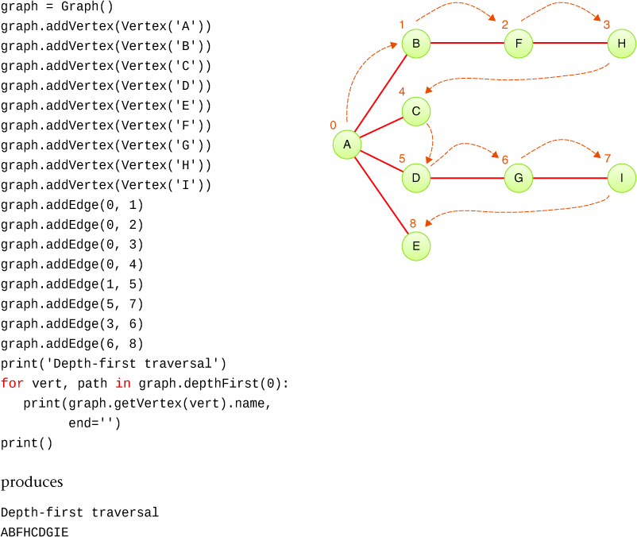

图 14-7 depthFirst() 在小图上的测试
回顾在 depthFirst() 生成器中生成顶点和到该顶点的路径的选择，请注意冗余，因为顶点始终是路径中的最后一个元素。 你可以重写生成器以仅返回路径，将提取顶点的责任转移给调用者。 这在 Python 中并没有太大的变化，在 Python 中，调用者可以使用对路径 [-1] 的 O(1) 引用来访问最后一个顶点。 但是，如果路径以链表形式返回，则获取最后一个元素需要 O(N) 时间并且值得额外的返回值。

#### 深度优先遍历和游戏模拟

在实现游戏程序时，深度优先遍历可以模拟玩家的移动顺序。 在国际象棋、西洋跳棋和西洋双陆棋等双人棋盘游戏中，每位玩家轮流从一组可能的动作中进行选择。 每回合的行动取决于游戏的状态，有时称为棋盘状态。 例如，在国际象棋的初始状态下，动作仅限于棋子或马的移动。 随后的棋盘状态允许涉及其他棋子的动作。
这种行为可以用一个图来建模，其中可能的动作形成棋盘状态之间的边，它们是图中的顶点。 从一个特定的棋盘状态开始，深度优先遍历列举了从初始状态可以到达的所有可能的棋盘状态。
让我们看看它是如何用于简单的井字游戏的。 第一个玩家，假设它是 X 玩家，可以从九种可能的动作中选择一个。 O-player 可以用八种可能的移动之一进行反击，依此类推。 每一步都会导致你的对手做出另一组选择，这会导致你的另一系列选择，直到最后一个方格被填满。 图 14-8 显示了电路板状态的部分图表。 仅包括连接每个移动的最顶层棋盘状态的边，并且不绘制对称棋盘状态。 这只为 X-player 的第一步留下了三个不同的可能选择。

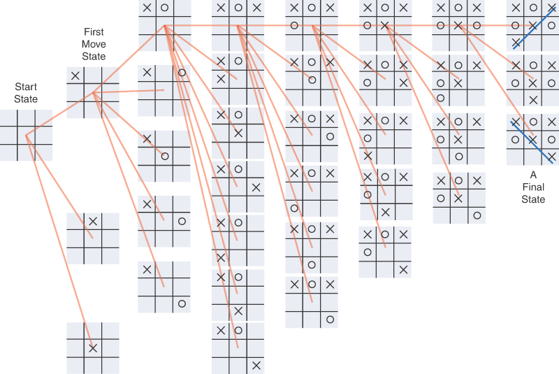

图 14-8 井字棋盘状态图
当你决定采取什么行动时，一种方法是在心里想象一步棋，然后是对手可能的反应，然后是你的反应，等等。 你可以通过查看哪一步会导致最佳结果来决定要做什么。 在像井字棋这样的简单游戏中，可能的移动次数非常有限，因此可以沿着每条路径走到游戏的尽头。
分析这些动作涉及遍历图形。 如图 14-8 所示，即使像井字棋这样的"简单"游戏也可以生成大图。 消除对称移动后，第一步的边数为三。 O-player 的第一步包括四个选项。 消除对称性后，X-player 的下一个动作最多可以有七个选项。 之后选项的数量会减少。
使用深度优先遍历意味着分析首先朝着最终状态发展。 任何导致对手获胜的路径都可以被消除，或者至少作为最后的选择留待进一步探索。 这将使你能够显着"修剪"图形。 修剪能节省多少？ 如果你不注意对称性，则有九种可能的第一步，然后是八种可能的对手着法，然后是七种可能的先手着法，依此类推。 这是 9×8×7×6×5×4×3×2×1（9 阶乘或 9！或 362,880）步，忽略了由于一名玩家连续完成三局后游戏结束而导致的减少。 这些移动是图中的边，并且有很多边需要遵循。 修剪可以节省大量资金。
尽管探索 362,880 条边对于现代计算机来说似乎是可以管理的，但其他游戏的图形要大得多。 国际象棋有 64 个方格，每个玩家有 16 个棋子。 围棋游戏有一个 19 乘 19 的网格点，玩家可以在其中放置黑子或白子。 那些361点意味着有361之类的东西！ 潜在的移动顺序（并且该数字不考虑石头的移除和替换）。 即使某些序列导致相同的棋盘状态，探索完整的图表也是相当艰巨的。 大多数玩游戏的算法仅将图形探索到特定深度，并使用多种技术在分析移动选项时消除尽可能多的路径。 他们可能永远不会生成完整的图。

### 广度优先

深度优先遍历算法的行为就好像它想尽快远离起点一样。 另一方面，在广度优先中，算法喜欢尽可能靠近起点。 它首先访问与起始顶点相邻的所有顶点，然后才走得更远。 这种遍历是使用队列而不是栈来实现的。

#### 一个例子

图 14-9 显示了与图 14-5 相同的图，但这次我们以广度优先遍历图。 同样，数字表示访问顶点的顺序。 和以前一样，A 是起始顶点。 你将其标记为已访问并将其放入空队列中。 然后你遵循这些规则：
***规则1***

- 取出队列中的第一个顶点（如果有的话）并将其所有相邻的未访问顶点插入队列，将它们标记为已访问。

***规则 2***

- 如果因为队列为空而不能执行规则 1，那么你就完了。

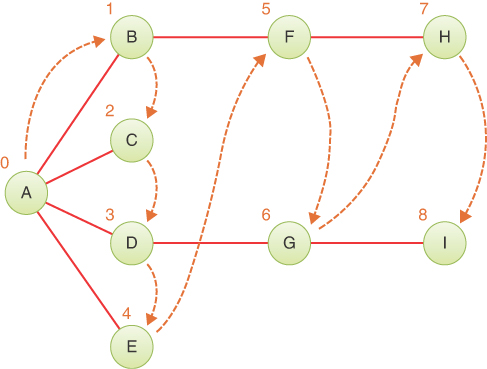

图 14-9 广度优先遍历示例
广度优先遍历比深度优先遍历稍微简单一些，因为只有两条规则。 遍历示例，你首先访问 A。然后获取与 A 相邻的所有顶点，并在访问时将每个顶点插入队列并标记它。 现在你已经访问了 A、B、C、D 和 E。此时队列（从前到后）包含 BCDE。
你再次应用规则 1，从队列中删除 B 并寻找与其相邻的顶点。 你找到了 A 和 F，但是 A 已经被访问过，所以你访问并只将 F 插入到队列中。 接下来，你从队列中删除 C。 它没有相邻的未访问顶点，因此队列中没有访问或插入任何内容。 你从队列中删除 D 并发现其邻居 G 未被访问，因此你访问它并将其插入队列。 你删除 E 并发现没有未访问的邻居。
此时队列包含 FG，这是之前访问 BCDE 时发现的唯一相邻的未访问顶点。 你删除 F 并访问 H 并将其插入队列。 然后你删除 G 并访问并插入 I。
现在队列包含 HI。 在你移除每一个并且没有找到相邻的未访问的顶点之后，队列是空的，所以你就完成了。 表 14-4 显示了这个顺序。
表 14-4 广度优先遍历时的队列内容

| 事件     | 队列（从前到后） |
| -------- | ---------------- |
| Visit A  | A                |
| Remove A |                  |
| Visit B  | B                |
| Visit C  | BC               |
| Visit D  | BCD              |
| Visit E  | BCDE             |
| Remove B | CDE              |
| Visit F  | CDEF             |
| Remove C | DEF              |
| Remove D | EF               |
| Visit G  | EFG              |
| Remove E | FG               |
| Remove F | G                |
| Visit H  | GH               |
| Remove G | H                |
| Visit I  | HI               |
| Remove H | I                |
| Remove I |                  |
| Done     |                  |

在每个时刻，队列都包含已访问但其邻居尚未完全探索的顶点。 （将这种广度优先遍历与深度优先遍历进行对比，深度优先遍历中堆栈的内容保存着你从起点到当前顶点所走的路线。）顶点按广度优先的顺序 ABCDEFGHI 访问。
图可视化工具和广度优先遍历
使用图形可视化工具通过广度优先遍历按钮尝试广度优先遍历。 同样，你可以用图 14-9 中的图形进行试验，也可以自己制作。
请注意广度优先遍历与深度优先遍历的相同点和不同点。
你可以将广度优先遍历想象为将石头投入水中时涟漪变大的过程，或者对于那些喜欢流行病学的人来说，将其想象为航空旅客从一个城市传播到另一个城市的流感病毒。 首先，访问距起点（飞机航班）一条边的所有顶点，然后访问两条边之外的所有顶点，依此类推。

#### Python代码

Graph 类的 breadthFirst() 方法类似于 depthFirst() 方法，不同之处在于它使用队列而不是堆栈，并充分探索相邻未访问顶点的序列。 Queue 类和遍历生成器的实现如清单 14-5 所示。
清单 14-5 图的 breadthFirst() 遍历生成器

```python
class Queue(list):  # Use list to define Queue class
    def insert(self, j):
        self.append(j)  # insert == append

    def peek(self):
        return self[0]  # First element is front of queue

    def remove(self):
        return self.pop(0)  # Remove first element

    def isEmpty(self):
        return len(self) == 0


class Graph(object):
…
    def breadthFirst(  # Traverse the vertices in breadth-first
        self, n
    ):  # order starting at vertex n
        self.validIndex(n)  # Check that vertex n is valid
        visited = [False] * self.nVertices()  # Nothing visited initially
        queue = Queue()  # Start with an empty queue and
        queue.insert(n)  # insert the starting vertex index on it
        visited[n] = True  # and mark starting vertex as visited
        while not queue.isEmpty():  # Loop until nothing left on queue
            visit = queue.remove()  # Visit vertex at front of queue
            yield visit  # Yield vertex to visit it
            for j in self.adjacentUnvisitedVertices(  # Loop over adjacent
                visit, visited
            ):  # unvisited vertices
                queue.insert(j)  # and insert them in the queue
```

在这里，我们将 Queue 类定义为列表的子类。 在队列中插入一个项目使用列表的 append() 方法。 这意味着队列的后端（或末尾）位于列表的最高索引处。 这意味着，peek() 和 remove() 对索引 0 处的列表的第一个元素进行操作。Python list.pop() 方法采用可选参数作为要删除的项目的索引。
遍历的开始就像深度优先一样，检查起始顶点的有效性并为所有顶点创建一个已访问数组。 然后创建访问数组并使用起始顶点索引作为种子，并将该索引标记为已访问。 示例 14-5 中的实现与前面显示的规则略有不同，因为第一个顶点的访问直到应用规则的 while 循环内才会发生。 另请注意，标记访问数组中的顶点发生在将它们交给调用者之前。 整个 breadthFirst() 生成器通过将顶点交给调用者进行处理来"访问"一个顶点，同时保持内部访问数组跟踪它已经放入队列中的顶点进行处理。
while 循环测试确定规则 1 还是规则 2 将适用。 如果是规则 1，循环体从队列的前面移除一个顶点并立即通过让出它来访问它。 该方法访问起始顶点的方式与访问所有其他顶点的方式相同。 请注意，我们不再有堆栈来提供到达该顶点所采用的路径。 因此，breadthFirst() 生成器仅生成一个顶点索引。 提供路径是可行且有用的，我们将其留作编程项目。
在 breadthFirst() 从队列中移除一个顶点并访问它之后，接下来要做的是将所有相邻的未访问顶点插入队列中。 该过程通过循环遍历 adjacentUnvisitedVertices() 生成器（如清单 14-3 所示）并将顶点插入队列来处理。 这样就完成了规则 1 的实现。规则 2 也完成了，因为当队列为空时不需要再处理。
让我们在深度优先使用的几乎相同的图上测试 breadthFirst() 遍历，但让我们在 C 和 H 之间添加一条边，看看它有什么效果。 图 14-10 显示了用于构建图并按广度优先顺序遍历顶点的代码。 额外的边缘在代码中突出显示。 请注意，用于创建边的顶点 ID 编号与图中顶点旁边的访问编号不同。

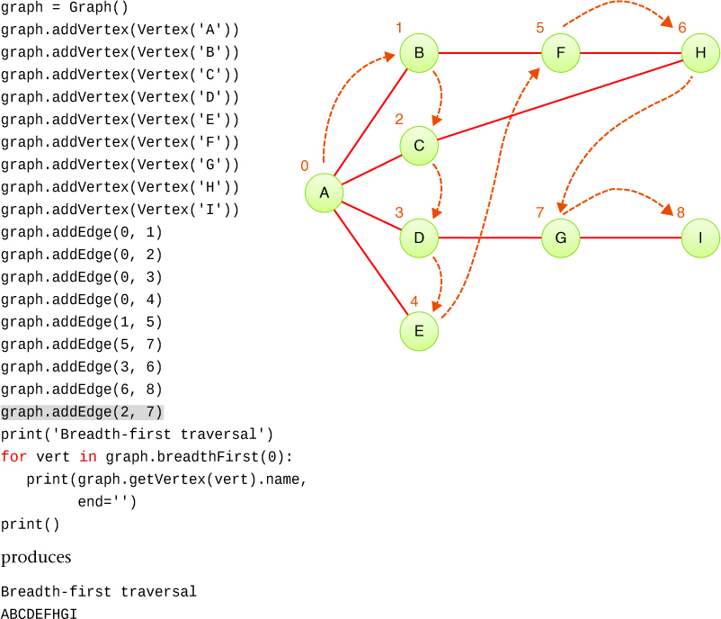

图 14-10 breadthFirst() 在小图上的测试
在测试示例中，在访问 ABCDE 之后，队列中包含未访问的相邻顶点 FHG。 如果没有从 C 到 H 的边，队列将是 FG，如图 14-9 所示。 对于边 CH，当 C 被移除时，H 被标记为已访问并插入到队列中。 然后 F 被移除，它的邻居搜索未访问的顶点。 H 还没有被访问过（由从 F 开始的生成器产生），但是当它被添加到队列中时被标记为已访问过。 因此，H 不会显示为要添加到队列中的顶点。 下一次通过 while 循环从队列的前面移除 H 并访问它。 因为它也没有相邻的未访问邻居，所以队列中没有任何内容。 下一遍从队列中移除 G，发现 I 未被访问，并插入最后一个顶点。
这个例子说明了广度优先遍历和搜索的一个有趣的特性：它首先找到距离起点一条边的所有顶点，然后是两条边之外的所有顶点，依此类推。 如果你试图找到从起始顶点到给定顶点的最短路径（请参阅项目 14.3），则此功能很有用。 你开始广度优先遍历，当你访问一个特定的顶点时，你知道你到目前为止追踪的路径是到它的最短路径。 如果有更短的路径，广度优先遍历就已经访问过了。 在图 14-10 中，从 A 到 H 有两条路径：ABFH 和 ACH。 广度优先在 G 之前访问 H 的事实是由于具有使用添加边的双边路径。 在图 14-9 中，没有边 CH 意味着 G 在 H 之前被访问，因为 G 和 H 都只能通过三边路径到达。

## 最小生成树
假设你正在设计一座大型公寓楼，需要决定热水管的走向。 图 14-4 中的示例显示了一个包含两个半浴室的房屋的完整管道网络，但假设你有数百个水槽、浴缸、淋浴器、洗衣机和热水器需要连接。 对于供水，你可以使用管道将每个固定装置连接到每个其他固定装置。 这肯定会提供每对灯具之间的最短路径。 那也会花费很多，任何被要求安装的水管工可能都会一笑置之。
克服尴尬后，你会发现你只需要将每个水槽、浴缸、淋浴器和洗衣机连接到热水器即可。 你希望这些管道很短，以便热水可以快速到达水龙头，并最大限度地减少需要保温的管道长度。 你不能将管道穿过建筑物的房间； 它们必须隐藏在墙壁、地板和天花板内。 并非每一面墙都允许管道穿过，例如玻璃墙。 因此，你必须采取一些曲折的路径将所有内容连接在一起。 你如何找到连接哪些路径，以便连接所有固定装置但管道数量最短？
最好有一种算法，对于任何连接的固定装置和管道集（顶点和边，在图形术语中），将找到连接所有固定装置所需的最小管道集。 即使它没有找到总的绝对最小管道长度或到热水器的最小总距离，如果它们之间有另一条路径，你也不会想要任何额外的管道连接两个固定装置。 例如，你不会想要像图 14-10 中的路径 ABFHCA 或图 14-11 左侧的完全连接图那样的管道（边）环（尽管在某些情况下管道环是可取的）。 这种算法的结果将是一个图，其中连接顶点所需的边数最少。 对于五顶点图，图 14-11 左侧的图具有最大边数 10。 右侧的图具有相同的五个顶点，但连接它们所需的最少边数为四个。 这构成了图形的最小生成树 (MST)。

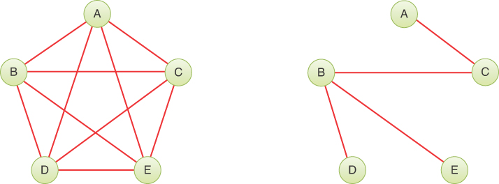

图 14-11 全连接图和最小生成树
对于给定的图，有许多可能的最小生成树。 图 14-11 的 MST 显示边 AC、BC、BD 和 BE，但边 AC、CE、ED 和 DB 也可以。 喜欢算术的人会注意到最小生成树中的边数总是比顶点数少一个。 从最小生成树中删除任何边将创建多个连接的组件。
现在，不要担心边缘的长度。 你并不是要寻找最小物理长度，而只是寻找最小边数。 （你的管道工可能有不同的意见。）我们在下一章讨论加权图时会对此进行更多讨论。
创建最小生成树的算法几乎与用于遍历的算法相同。 它可以基于深度优先或广度优先遍历。 这个例子使用深度优先遍历。
也许令人惊讶的是，通过执行深度优先遍历并记录你为到达顶点所经过的边，你会自动创建最小生成树。 这也有点违反直觉，因为广度优先遍历找到到每个顶点的最短路径。 你稍后会看到的最小生成树方法与你之前看到的深度优先遍历之间的唯一区别是，它必须以某种方式记录和返回树状结构。

### 图形可视化工具中的最小生成树

在你选择起始顶点并选择相应按钮后，图形可视化工具将运行最小生成树算法。 你会看到 depthFirst() 生成器在代码窗口中运行，为我们稍后探索的方法生成结果。
当深度优先遍历生成顶点及其从起始顶点开始的路径时，可视化工具会突出显示它们，如图 14-12 所示。 在该示例中，该算法将顶点 E 及其从起始顶点 C 的路径添加到它正在构建的树中。 添加的顶点周围有棕色圆圈（B、C、D 和 E），并且形成由 depthFirst() 返回的路径的边以蓝色突出显示。 在前面的步骤中添加的边（例如，边 BD）以棕色突出显示。

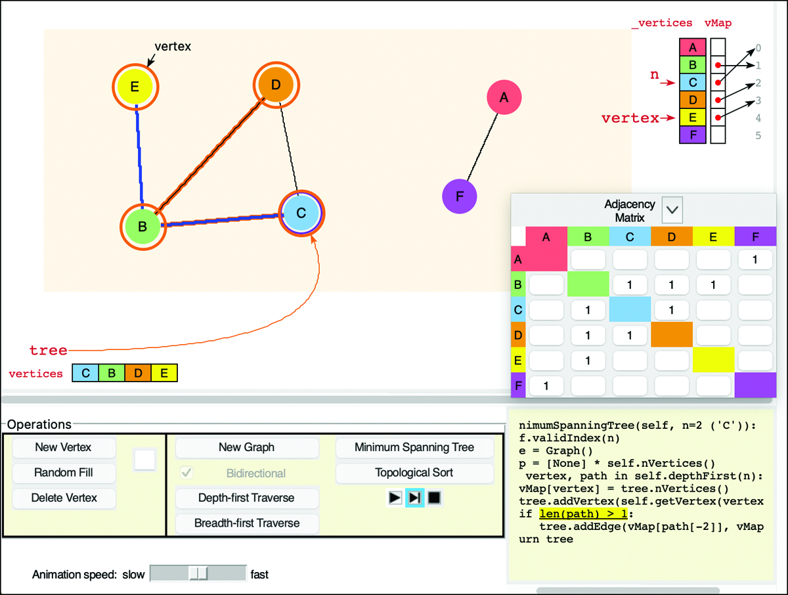

图 14-12 向最小生成树添加路径的图形可视化工具
如你所见，最小生成树实现必须在运行时跟踪许多事情。 我们探索了 Python 中的详细实现，但首先我们需要重新审视我们在前面几章中详细讨论的结构：树。

### 图中的树

最小生成树"看起来"是什么样的？ 是二叉树吗？ 不，因为连接到给定顶点的顶点数可以是一、二、三等。 比如图14-13右边的最小生成树，就没有办法把顶点和边排列成二叉树的形式。 即使图 14-11 和图 14-13 的树都来自同一个起始图，也无法知道生成的树是否具有可以形成二叉树的边。

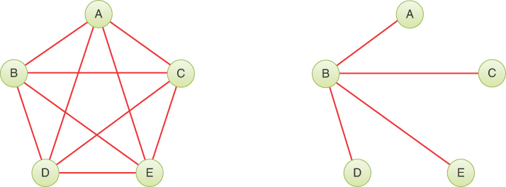

图 14-13 来自完全连接的五顶点图的另一个最小生成树
那么，应该用什么结构来表示最小生成树呢？ 你可以尝试为每个节点创建一个具有任意数量子节点的树结构，类似于 2-3-4 树，但具有任意数量的子节点。 这可能是一个很好的解决方案，但还有一个更简单的解决方案：使用 Graph 类本身。
最小生成树是一个子图——原始图的顶点和边的子集。 跨越部分意味着连接组件中的所有顶点仍然连接，而树意味着每对顶点之间都有一条唯一的路径。 到目前为止，你看到的树都具有这些属性。 从根到树中的每个节点都有一条唯一路径，并且所有节点都可以从根到达。
最小生成树有可能包含输入图的每个顶点和边。 然而，通常情况下，树是形成连通分量的顶点和边的真子集。

### 最小生成树的 Python 代码

我们的 minimumSpanningTree() 方法返回一个新图，其中包含起始图中的顶点和边的子集。 我们使用从起始顶点开始的深度优先遍历来创建 MST。 包含起始顶点的连通分量中的所有顶点都将进入 MST。 任何不相连的顶点，如图 14-12 中的 A 和 F，都被排除在外。 清单 14-6 显示了代码。
因为结果包含原始顶点的子集，所以两个图中的顶点索引可能不同。 例如，一个 10 顶点图可能由两个连通分量组成：一个有六个顶点，另一个有四个。 如果你要求 MST 从六顶点分量中的一个顶点开始，则 MST 将恰好有六个顶点，索引为 0 到 5。这些顶点在原始图中的索引最多为 9，因此你需要一种方法来跟踪 原始图中顶点与 MST 中顶点的对应关系。
清单 14-6 Graph 的 minimumSpanningTree() 方法

```python
class Graph(object):
…
    def minimumSpanningTree(  # Compute a minimum spanning tree
        self, n
    ):  # starting at vertex n
        self.validIndex(n)  # Check that vertex n is valid
        tree = Graph()  # Initial MST is an empty graph
        vMap = [None] * self.nVertices()  # Array to map vertex indices
        for vertex, path in self.depthFirst(n):
            vMap[vertex] = tree.nVertices()  # DF visited vertex will be
            tree.addVertex(self.getVertex(vertex))  # last vertex in MST as we add it
            if len(path) > 1:  # If the path has more than one vertex,
                tree.addEdge(  # add last edge in path to MST, mapping
                    vMap[path[-2]], vMap[path[-1]]
                )  # vertex indices
        return tree
```

minimumSpanningTree() 方法以一个空图（称为树）开始，用于保存 MST。 当我们向它添加顶点时，我们注意到名为 vMap 的数组中新旧顶点之间的转换。 该数组需要一个单元格来表示每个可能的顶点。 就在我们向 MST 添加一个顶点之前，我们知道它将获得什么索引，因为它被放置在现有顶点的末尾。 这意味着旧的顶点索引映射到到目前为止添加到 MST 的顶点数。
要了解映射的工作原理，请查看图 14-12 中的示例 vMap。 vMap 显示在显示的右上角，作为与输入顶点对齐的数组，输入顶点的值指向新树中的索引（顶点索引）。 作为起点，顶点 C 首先被访问并成为输出树中的第一个顶点，因此 vMap 显示 C 映射到索引 0。添加到树中的下一个顶点是顶点 B，因此它映射到索引 1，依此类推 上。 只有包含在最小生成树中的顶点才会在 vMap 中有条目将它们映射到它们的新索引。 在图 14-12 中，顶点 A 和 F 不在 vMap 中，因为它们没有连接到 C。
在设置空树和vMap后的代码中，minimumSpanningTree()使用depthFirst()遍历图来访问连通分量中的所有顶点。 depthFirst() 遍历为每次访问产生一个顶点和到该顶点的路径（以堆栈的形式）。 访问的第一个顶点将始终是起始顶点，并且路径将仅包含访问的那个顶点。
在深度优先循环体中，我们首先存储从被访问的顶点到它在 MST 中的索引的映射。 树中已有的顶点数提供了存储在 vMap 中的索引。 下一个调用将被访问的顶点添加到 MST。 然后，如果到访问顶点的路径中至少有一条边，我们也将最后一条边添加到 MST。 我们从路径中的最后两个顶点获取形成该边的顶点：path[-2] 和 path[-1]。 我们必须使用 vMap 数组转换那些顶点索引。 我们保证路径中的索引是在 vMap 中设置的，因为该路径仅包含之前由 depthFirst() 访问过的顶点。
这段代码能处理所有事情吗？ 边缘呢？ 除了起始顶点之外，我们为每个添加到 MST 的顶点添加一条边。 够了吗？ 是的，为每个顶点添加一条边意味着我们恰好从 N 个顶点连通分量中得到 N-1 条边。 每条添加的边都是通向该顶点的唯一路径中的最后一条边。 因此，该算法覆盖了属于 MST 的连通分量的所有顶点和边。
当深度优先遍历完成时，树包含完整的最小生成树，因此返回给调用者。 为了帮助开发和查看各种数组的详细内容，你可以为 Graph 类定义一些打印方法，如清单 14-7 所示。
清单 14-7 汇总和打印图形的方法

```python
class Graph(object):
…
    def __str__(self):  # Summarize the graph in a string
        nVertices = self.nVertices()
        nEdges = self.nEdges()
        return f"<Graph of {nVertices} vert{'ex' if nVertices == 1 else 'ices'}\
             and {nEdges} edge{'' if nEdges == 1 else 's'}>"

    def print(
        self, prefix=""  # Print all the graph's vertices and edges
    ):  # Prefix each line with the given string
        print(f"{prefix}{self}")
        for vertex in self.vertices():  # Loop over all vertex indices
            print(f"{prefix}{vertex}:", self.getVertex(vertex))
            for k in range(vertex + 1, self.nVertices()):  # Loop over
                if self.hasEdge(vertex, k):  # higher vertex indices, if
                    print(
                        prefix,  # there's an edge to it, print edge
                        self._vertices[vertex].name,
                        "<->",
                        self._vertices[k].name,
                    )
```

这些打印方法使用了一些 Python 的字符串格式化功能，我们在这里不做描述。 相反，我们在一个小例子中展示了它们产生的结果。
对于这个例子，我们使用一个有六个顶点的小图，其中两个顶点没有连接到其他四个顶点。 图 14-14 显示了左侧的原始图以及从顶点 A 开始的深度优先遍历。最小生成树在右侧。 顶点 C 和 F 没有出现在最小生成树中，因为它们没有通过边连接到其他顶点。 print() 方法的输出显示在每个图形下方。 请注意，边缘在它们的"第一个"（较低索引）顶点旁边打印一次，并且不会在它们的"第二"（较高索引）顶点旁边重复打印。

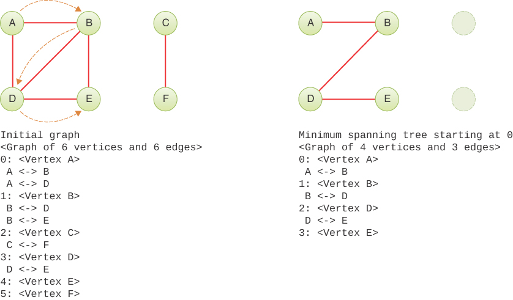

图 14-14 图形和最小生成树的打印描述
最小生成树算法遵循深度优先遍历，得到起始顶点的连通分量中的所有顶点。 其他组件的顶点将被忽略。 对于连接组件中的 N 个顶点，生成的子图将始终具有 N–1 条边。
构建最小生成树需要多少时间？ 好吧，至少 O(N) 遍历所有 N 个顶点。 depthFirst() 遍历方法似乎应该是 O(N)，就像你看到的其他数据结构的所有遍历算法一样。 然而，仔细检查会发现，对于访问的每个顶点，depthFirst() 生成器都会在所有顶点上启动自己的内部循环，以找到第一个相邻的未访问顶点。 如果边很少，则该内部循环可以在找到下一个相邻顶点之前遍历大部分顶点。 这意味着它可能需要 O(N) 才能找到下一个相邻顶点，而 depthFirst() 遍历可能需要 O(N^2^)。 广度优先遍历总是完成它的内部循环，所以它肯定是 O(N^2^)。 正如我们在下一章讨论的那样，深度优先并不总是会发生这种情况，但现在你可以假设最坏的情况，这意味着最小生成树也需要 O(N^2^)。

## 拓扑排序

拓扑排序是另一种可以用图建模的操作。 它在项目或事件必须按特定顺序排列的情况下很有用。 让我们看一个例子。

### 依赖关系

在学校里，学生发现（有时令他们沮丧的是）他们不能随心所欲地选修任何课程。 有些课程有先决条件——其他课程必须先修。 课程顺序通常模拟一个层次结构，在这个层次结构中，如果不首先理解另一组概念，就无法掌握某些概念。 这些是依赖关系。 它们无处不在。 代数取决于对算术的理解； 线性代数取决于对代数的理解。 在编程中，一个源文件可以导入或包含其他源文件，这使得一个文件依赖于另一个文件。 在烹饪中，每一步都取决于完成前面的准备工作。 例如，烤面包取决于混合面团和加热烤箱。
依赖关系可以用图来描述——特别是有向图。 图 14-15 显示了烤面包的简化配方。

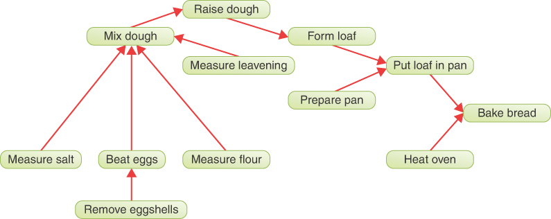

图 14-15 烤面包的依赖图
要烤面包，你需要有一个加热的烤箱和一个放在平底锅中的面团。 要有一条面包，它应该由面团制成。 那个面团应该先发酵，依此类推。 大多数步骤必须按特定顺序完成。 打完鸡蛋再去蛋壳是有问题的（发完面团再去蛋壳就更糟了）。 但是，某些成对的步骤可以按任一顺序完成。 测量面粉和盐的顺序无关紧要； 加热烤箱和混合面团可以按任何顺序进行，甚至可以同时进行。 箭头所示的依赖关系捕获了这种偏序。
分析不同的任务及其相对顺序对于以前烤过面包的人来说似乎微不足道，但对于机器人来说却一点也不微不足道。 想象一个机器人可以阅读食谱并找出所有步骤。 假设它能理解单词的意思，它仍然需要确定任务的顺序。 食谱通常是按步骤的时间顺序写的，所以它可以简单地遵循这个顺序。 然而，这可能会延长准备时间，因为可以同时完成的步骤将按顺序完成。 理想情况下，它会分析所有可能的步骤顺序并找到最有效的顺序。

### 有向图

依赖关系揭示了一个我们还没有讨论过的图形特征：边需要有方向。 在这种情况下，该图称为有向图或有向图。 在有向图中，你只能沿着一条边走一条路。 图 14-16 中的箭头表示边缘的方向。

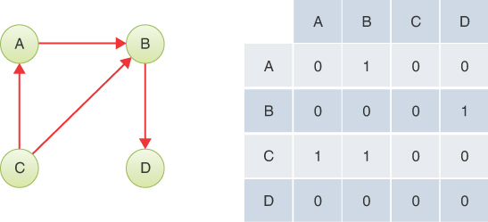

图 14-16 一个小的有向图及其邻接矩阵
在程序中，无向图和有向图的区别在于有向图中的一条边在邻接矩阵中只有一个条目。 图 14-16 显示了一个小的有向图及其邻接矩阵。
矩阵中的每个 1 代表一条边。 行标签显示边缘开始的位置，列标签显示边缘结束的位置。 因此，从 A 到 B 的边由 A 行 B 列的单个 1 表示。如果有向边被反转，从 B 到 A，则 B 行 A 列将有一个 1。
对于无向图，如前所述，邻接矩阵的一半镜像另一半，因此一半的单元格是冗余的。 然而，对于有向图，邻接矩阵中的每个单元都传达唯一的信息。 两半不是镜像。
对于有向图，添加边的方法因此只需要一个语句

```python
self._adjMat[A, B] = 1
```

而不是无向图中所需的两个语句。 如果你使用邻接表方法来表示你的图，那么 A 的列表中有 B，但是与无向图不同的是，B 的列表中没有 A。
排序有向图

想象一下，你使用图 14-15 作为输入数据，列出了烤面包所需的所有操作。 然后，你按照需要执行的顺序安排操作。 最后的烘焙面包步骤 (Bb) 是列表中的最后一项，它可能看起来像这样，每个顶点都使用两个首字母：
```Mf,Ms,Ml,Re,Be,Md,Rd,Fl,Pp,Pl,Ho,Bb```

以这种方式排列，图的顶点被称为拓扑排序。 在列表中的某个其他操作发生之前必须执行的任何操作。
许多可能的排序将满足依赖关系。 你可以先加热烤箱然后准备平底锅
```Ho,Pp,Mf,Ms,Ml,Re,Be,Md,Rd,Fl,Pl,Bb```

这种方法也满足所有关系（尽管在考虑面包时与化学符号的相似性可能有点令人不安）。 还有许多其他可能的顺序。 当你使用算法生成拓扑排序时，你采用的方法决定了生成各种有效排序中的哪一个。 图术语中必须遵循的具体约束如下。 对于有向图的有效排序，如果存在从顶点 A 到顶点 B 的路径，则在拓扑排序中顶点 A 必须先于顶点 B。
除了菜谱步骤和课程先决条件之外，有向图还可以对其他情况进行建模。 许多工业项目是通过将整个项目分解为更小的工作或任务来管理的。 每项任务可能取决于其他任务的输出，并且可能需要在一项任务结束和另一项任务开始之间经过一些时间。 以盖房子为例。 想要建造房屋的人必须确定地点、寻找建筑商、获得许可并获得融资。 实际的建设工作取决于完成所有这些任务。 在完成所有准备任务和开始施工之间可能会有延迟，因为建筑商发现船员可以开始新工作。 这些延迟在某种程度上是可以预测的，但很少有任何精确度。
使用图形对作业计划进行建模称为关键路径分析。 虽然我们没有在这里显示，但可以使用加权的有向图（在下一章中讨论），它允许该图包含完成项目中不同任务所需的时间。 然后，该图可以通过查看不同的可能拓扑类型告诉你完成整个项目所需的最短时间和总成本等信息。

### 图形可视化工具

Graph Visualization 工具也可以为有向图建模。 当图形没有边时，你可以选中或清除双向复选框。 当存在任何边时，该复选框将被禁用。 你可以选择 New Graph 以清除所有顶点和边并取消选中 Bidirectional 框。
对于有向图，顶点和边的编辑方式相同。 不同之处在于边缘被绘制为带有箭头的曲线； 将指针从一个顶点拖动到另一个顶点只会创建从第一个顶点到第二个顶点的边，而单击邻接矩阵中的一个单元格只会创建从相应行到相应列的边。 图 14-17 显示了与图 14-15 中的面包烘烤示例相同的有向图，使用了操作的两个字母缩写。 顶点已重新排列，但连接它们的边保持不变。 邻接矩阵很大并且遮挡了顶点表。 使用折叠和展开按钮切换矩阵的视图。


图 14-17 图可视化工具中的有向图。
你可以使用该工具运行深度和广度优先遍历以及有向图的最小生成树。 结果与无向图不同，因为边现在是有向的。

### 拓扑排序算法

让我们看看如何对顶点进行拓扑排序。 在这里，我们从一个基本算法开始，然后对其进行改进。 对于基本算法，我们至少需要两步。
***步骤1***

- 找到一个没有（未访问过）前辈的未访问顶点。

一个顶点 V 的前驱是那些直接在它"上游"的顶点——也就是说，通过一条指向 V 的边连接到它。如果一条边从 A 指向 B，那么 A 是 B 的前驱 （并且 B 是 A 的继承者）。 在图 14-16 中，唯一没有前驱的顶点是 C。在图 14-17 的面包烘烤示例中，六个顶点没有前驱：Mf、Ms、Ml、Re、Pp 和 Ho。 可以通过在邻接矩阵中查找没有边的列来找到这些顶点。
***步骤2***

- 将在步骤 1 中找到的顶点标记为已访问并将其添加到结果列表的末尾。

重复步骤 1 和 2，直到所有顶点都消失。 此时，结果列表包含按拓扑顺序排列的顶点。
你可以使用图形可视化工具查看工作过程。 构造图 14-16 中的图形（或任何其他图形，如果你愿意）。 然后选择拓扑排序按钮。 无需选择起始顶点，因为算法不需要。
可视化工具中的动画分两个阶段进行。 它比前面显示的两步算法更奇特，但使用了相同的步骤。 稍后我们将查看几个不同的实现，以了解如何有效地对顶点进行排序。
请注意，此拓扑排序算法适用于不连通图和连通图。 这模拟了你有两个不相关目标的情况，例如获得数学学位，同时在山区徒步旅行。 然而，有些图表会导致问题。

### 循环和树

这种基本算法无法处理的一种图是带环的图。 我们提到了图的最小生成树如何从不创建通过两条或多条边的路径将顶点连接到自身的循环。 这种循环的正式名称是循环。
如果一条路径通过有向边在它开始的顶点处结束，则该图至少有一个循环。 在图 14-18 中，路径 BDCB 形成一个循环。 此外，ABDCA 形成一个循环。 请注意，ABCA 不是循环，因为你不能在此有向图中从 B 转到 C。

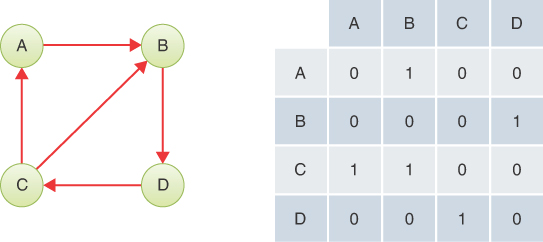

图 14-18 带循环的有向图。
A循环模拟了悖论（一些学生声称在某些机构遇到过），其中课程B是课程D的先决条件，D是C的先决条件，C是B的先决条件。幸运的是，这种悖论很少见 .
循环也可以出现在无向图中，但你必须更具体地了解它们。 你通常可以忽略通过沿一条边并立即沿同一边返回而形成的循环。 循环必须由两个或多个不同的无向边的路径形成。 多重图允许一对顶点由多条边连接，因此可以形成只有两条边的环。 在非多重图中，至少需要三个无向边才能形成一个环。
很容易弄清楚某些类型的无向图是否有环。 如果有 N 个顶点的图有多于 N-1 条边，则它一定有圈。 你可以尝试画一个有 N 个顶点和 N 条边且没有任何环的图来弄清楚这一点。 另一方面，很难检测有向图和边数较少的图中的环。 在第 15 章"加权图"中，关于效率的部分讨论了寻找某些类型的循环的复杂性。
没有循环的无向图总是一棵树。 循环的存在允许两个顶点通过不同的路径连接。
你在本书前面章节中看到的二叉树和多向树是有向图的类型，因为边总是将父节点链接到子节点。 我们从不允许这些树产生循环。 这样做会导致第 5 章中针对循环列表所描述的问题。
拓扑排序仅在没有循环的有向图上成功。 这样的图称为有向无环图，通常缩写为DAG。 基本的拓扑排序算法没有关于如果第 1 步失败时该怎么办的步骤——当没有顶点没有未访问的前辈时。 例如，如果你要求它处理图 14-18 中的图，步骤 1 将看到所有顶点至少有一个前驱并失败。 因此，我们需要添加最后一步：
***步骤 3***

- 第一步失败后，如果结果列表的顶点数少于图的顶点数，则图一定有环。

这个三步算法可以处理所有带环和不带环的有向图。

### 基本拓扑排序的 Python 代码

我们在 Graph 类中引入一些新方法来对前人进行处理，并使用它们来实现示例 14-8 中基本拓扑排序算法的三个步骤。 第一个方法 preferenceVertices() 是一个类似于 adjacentVertices() 的生成器，它生成给定顶点 n 的所有前驱顶点。 它验证顶点索引，然后遍历所有可能的索引，只产生边指向 n 的索引。
为了实现第 1 步，我们需要一个测试来找到一个没有未访问前辈的未访问顶点。 换句话说，该算法寻找一个顶点，其中它的所有前任（如果有的话）都在已访问的顶点中。 onlyVisitedPredecessors() 方法将顶点索引 n 作为参数，并使用 Python 的 all() 函数来测试 n 的所有前任是否都满足条件。 all() 函数的参数是每个前导索引的已访问数组的值。 如果这些先行者中的一个或多个具有 None 或 False 的访问值，则顶点 n 无法通过测试。 值得注意的是，如果 n 没有前辈，则 all() 函数的参数列表为空并返回 True。
清单 14-8 顶点的基本拓扑排序代码

```python
class Graph(object):
…
    def predecessorVertices(  # Generate a sequence of vertex indices
        self, n
    ):  # that are adjacent predecessors to n
        self.validIndex(n)  # Check that vertex index n is valid
        for j in self.vertices():  # Loop over all other vertices
            if j != n and self.hasEdge(j, n):  # If other vertex connects
                yield j  # via edge, yield other vertex index

    def onlyVisitedPredecessors(  # Test whether vertex n's predecessors
        self, n, visited
    ):  # have all been visited, if any
        return all(
            visited[j]  # All predecessors must have been set in
            for j in self.predecessorVertices(n)
        )  # visited array

    def findUnvisitedWithoutPredecessor(  # Find a vertex without
        self, visited
    ):  # unvisited predecessor vertices, if any
        return next(
            (
                vertex
                for vertex in self.vertices()
                if (
                    not visited[vertex]
                    and self.onlyVisitedPredecessors(vertex, visited)
                )
            ),
            None,
        )  # If vertex is unvisited and has  # only visited

    def sortVerticesTopologically(  # Return a sequence of all vertex
        self,
    ):  # indices sorted topologically
        result = []  # Result list of vertices
        nVertices = self.nVertices()  # Number of vertices
        visited = [None] * nVertices  # Array to mark visited vertices
        while len(result) < nVertices:  # Loop until all vertices handled
            vertex = self.findUnvisitedWithoutPredecessor(  # Find an
                visited
            )  # unvisited vertex without predecessors
            if vertex is None:  # If no such vertex exists, then raise an
                raise Exception("Cycle in graph, cannot sort")  # exception
            result.append(vertex)  # Append unvisited vertex and
            visited[vertex] = True  # mark it as visited
        return result
```

findUnvisitedWithoutPredecessor() 方法执行步骤 1，遍历所有可能的顶点，跳过访问过的顶点，并返回第一个满足 onlyVisitedPredecessors() 的未访问过的顶点。 如果它完成循环而没有找到一个没有先行者的未访问顶点，它返回 None，表示必须有一个循环。
sortVerticesTopologically() 方法执行步骤 1、2 和 3。它设置一个空结果列表来保存排序的顶点。 接下来它创建一个已访问数组，就像遍历方法中使用的数组一样，将所有顶点标记为未访问。 主要工作从 while 循环开始。 在循环的每一遍中，它都会尝试第 1 步找到一个没有前驱的顶点。 如果返回为 None，它会引发异常以指示检测到循环。 否则，将顶点添加到结果的末尾并标记为已访问，执行步骤2。如果循环结束，则结果列表中有nVertices，并返回，处理步骤3。
基本的拓扑排序算法很容易理解，但是我们来看看它的效率。 图 14-19 显示了算法的不同级别。 每个级别代表一个被调用的方法。 我们先来看最里面的一层。 通过 vertices() 序列的每个循环当然是 O(N)。 因此，对特定顶点的 onlyVisitedPredecessors() 测试的一次调用会查看所有其他顶点，因此它也需要 O(N) 时间。 在下一层，向外，findUnvisitedWithoutPredecessor() 方法在每个顶点上调用内部测试，直到找到一个匹配的顶点。 尽管中间层在找到这样的顶点时确实退出了，但它仍然必须扫描一部分顶点，所以中间层的最坏情况组合复杂度为 O(N^2^)（为了彻底，我们需要确定 找到顶点所需的平均尝试次数，但我们可以假设它与 N 成正比，而无需了解图的边）。

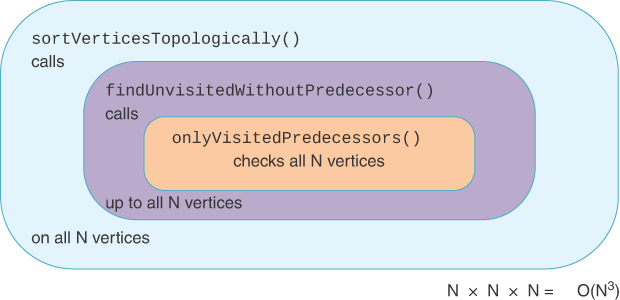

图 14-19 基本拓扑排序算法的复杂性
最外层的例程 sortVerticesTopologically() 调用中间层，直到所有 nVerticies 都被复制。 这是另一个 O(N) 因素，因此算法的每个级别都贡献 O(N)，如图所示。 总的来说，该算法是 O(N^3^)。 我们能做得更好吗？

### 改进拓扑排序

是的，我们可以将复杂度降低到至少 O(N^2^)，但这需要更复杂的数据组织。 虽然这种转变很复杂，但从其他人如何改进算法性能的例子中学习将有助于你分析和改进自己的程序。 这是另一个关于如何选择和使用最适合任务的数据结构的案例研究。
我们感兴趣的关键概念是每个顶点的边数。 如果我们按入站边的数量组织顶点，我们可以快速找到没有前辈的顶点。 在图中，入向边和出向边的条数称为入向度和出向度，简称入度和出度。
我们首先需要的是一种获取顶点入站和出站度数的方法。 清单 14-9 中的 degree() 方法将一个顶点作为参数，计算该顶点处的两种边，并将计数作为元组返回。
当我们知道所有顶点的入站度数后，我们可以将所有度数为 0 的顶点放在一个地方，这样就很容易找到它们。 事实上，如果我们保留一个按度数索引的数组，我们可以将每个顶点放入数组的单元格中以获得其入站度数。 我们需要在每个数组单元格中有一些结构可以容纳一组顶点。 该结构应该是堆栈吗？ 排队？ 一颗树？ 答案取决于我们如何处理顶点，所以让我们看看剩下的步骤。
在我们从单元格中取出一个度数为 0 的顶点后，我们可以将它放入排序后的结果列表中。 该顶点的后继者现在实际上少了一条入站边。 从放在结果列表中的顶点只有一个入站边的后继现在可以被认为具有度 0。因此，我们可以简单地更改每个后继顶点的度，而不是跟踪访问过哪些顶点，移动它 到数组中的适当单元格以获得新的度数。 当我们处理顶点及其后继顶点时，每个顶点最终都会向下移动到 0 度（如果没有循环）。
知道我们想要在数组中的单元格之间移动顶点，很明显我们需要一个能够快速插入和删除的结构。 堆栈和队列具有 O(1) 的插入和删除复杂度，但仅限于特定顺序（LIFO 和 FIFO）。 例如，对于此算法，我们需要从一个单元格中删除顶点 27 并将其添加到另一个单元格中。
如果我们想通过键插入和删除项目，例如它们的顶点索引，最好的数据结构是数组或哈希表。 两者都有 O(1) 的插入和删除时间（假设我们不需要移动数组中的项目来消除空洞）。 哈希表还有一个额外的优势，即只需要与其中的项目成比例的内存； 一个数组需要 N 个单元来保存 N 个顶点中的任何一个。
图 14-20 说明了我们需要的结构之间的关系。 左侧显示了一个简单的四顶点图。 右边的下一个是 Graph 对象，它包含 _vertices 数组和 _adjMat 邻接矩阵来表示它。 旁边是一个四元素数组，显示四个顶点中每个顶点的入站度数。 例如，顶点 A 的入站度为 1，而顶点 B 的入站度为 2。

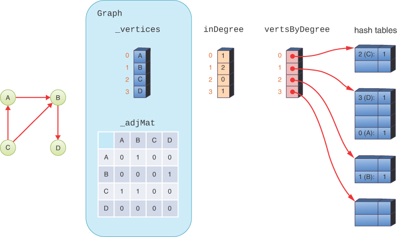

图 14-20 用于拓扑排序的结构
vertsByDegree 数组按入站度将顶点分组在一起。 此数组中的每个单元格都引用一个哈希表，该表保存具有特定入站度数的顶点的键。 例如，vertsByDegree[1] 引用包含两个键的哈希表。 键是入站度数为 1 的顶点的顶点索引：0 (A) 和 3 (D)。 度三的哈希表是空的，因为没有顶点具有入站度三。 哈希表有额外的单元格来维持 50% 的负载因子。
清单 14-9 中的 sortVertsTopologically() 方法首先创建 vertsByDegree 数组。 任何顶点可能拥有的最大入站度数是顶点数减一。 对于具有 E 条边的图，最高入站边数可能是 E。要考虑入度为 0 的顶点，我们需要将 1 加到 E。数组的大小是以下值中的最小值：nVertices 和 nEdges+1。 vertsByDegree 数组是使用列表理解 ```[{} for j in range(min(self.nVertices(), self.nEdges() + 1))]``` 构建的。 正如你在构建邻接矩阵时看到的那样，使用列表推导式可确保创建 N 个不同的空哈希表来填充数组单元格。
排序算法创建一个 inDegree 数组来保存每个顶点的入站度数。 最初，这些用 0 填充。
现在我们可以填充新的数据结构。 下一部分是所有顶点的 for 循环。 它通过调用 self.degree() 计算顶点的度数，并使用 [0] 提取返回元组的第一个元素以获得入站度数。
排序算法现在根据入站度将顶点插入 vertsByDegree 数组。 它通过引用 ```vertsByDegree[inDegree[vertex]]``` 找到合适的哈希表。 这种嵌套引用看起来有点复杂，但实际上只是两次数组查找。 顶点变量索引 inDegree 数组以获得顶点的数值度数。 该数字度索引 ```vertsByDegree``` 数组。 该数组单元格的内容是一个哈希表。 要在哈希表 ht 中输入一个键，你可以编写 ```ht[key] = 1```。这就是通过编写 ```vertsByDegree[inDegree[vertex]][vertex] = 1``` 来完成的； 它设置从 vertsByDegree 检索的哈希表中的顶点键。 当你第一次看时，这些参考字符串可能很难理解； 尝试从内部引用到外部引用，以及从外部引用到内部引用。
清单 14-9 改进的顶点拓扑排序

```python
class Graph(object):
...
    def degree(self, n):  # Get degree of vertex as (in, out) pair
        self.validIndex(n)  # Validate vertex index
        inb, outb = 0, 0  # Count inbound and outbound edges
        for j in self.vertices():  # Loop over all vertices
            if j != n:  # other than target vertex
                if self.hasEdge(j, n):  # If other vertex precedes
                    inb += 1  # increase inbound degree
                if self.hasEdge(n, j):  # If other vertex succeeds n
                    outb += 1  # increase outbound degree
        return (inb, outb)  # Return inbound and outbound degree

    def sortVertsTopologically(  # Return sequence of all vertex indices
        self,
    ):  # sorted topologically more efficiently
        # Make an empty hash table for every
        # possible degree, max = nVerts – 1 or nEdges
        vertsByDegree = [{} for _ in range(min(self.nVertices(), self.nEdges() + 1))]

        inDegree = [0] * self.nVertices()  # Allocate indegree array
        for vertex in self.vertices():  # Loop over all vertices, record
            inDegree[vertex] = self.degree(vertex)[0]  # inbound degree
            vertsByDegree[inDegree[vertex]][  # In hash table for this inbound degree
                vertex
            ] = 1  # insert vertex
        result = []  # Result list is initially empty
        while (
            len(vertsByDegree[0]) > 0  # While there are vertices with inbound
        ):  # degree of 0
            vertex, _ = vertsByDegree[0].popitem()  # take vertex out of
            result.append(vertex)  # hash table & add it to end of result
            for s in self.adjacentVertices(  # Loop over vertex's
                vertex
            ):  # successors; move them to lower degree
                vertsByDegree[  # In hash table holding successor vertex
                    inDegree[s]
                ].pop(
                    s
                )  # delete the successor
                inDegree[s] -= 1  # Decrease inbound degree of successor
                vertsByDegree[inDegree[s]][  # In hash table for lowered inbound degree
                    s
                ] = 1  # insert modified successor
        if len(result) == self.nVertices():  # All vertices in result?
            return result  # Yes, then return it, otherwise cycle
        raise Exception("Cycle in graph, cannot sort")
```

在用所有顶点填充 vertsByDegree 数组并创建空结果列表/数组后，该算法现在可以在 while 循环中处理顶点。 循环条件测试入站度 0 顶点的哈希表中是否有任何键。 如果没有度数为 0 的顶点，那么我们要么完成，要么图中至少有一个循环。
在 while 循环体内，我们从哈希表中弹出一个度数为 0 的顶点。 Python 有几种方法可以从哈希表中删除项目。 popitem() 方法从哈希表中删除并返回一个键及其值。 在这种情况下，排序算法不关心删除了哪个键，也不关心它有什么值，所以它将值放在下划线 (_) 变量中。 （Python 的 popitem() 总是删除最后插入的键，使其表现得像一个堆栈。）从哈希表中删除键的另一种方法是使用 pop() 方法，它需要一个特定的键。
接下来，该算法将度数为 0 的顶点附加到结果列表中。 因为顶点没有前驱，它可以是输出序列中的下一个顶点。 这允许顶点的每个后继者将其入站度数减少一个。 内层的 for 循环遍历 vertex 的相邻顶点，这与有向图的后继相同。 每个后继顶点 s 都根据其当前度数从包含 s 的哈希表中删除。 ```vertsByDegree[inDegree[s]]``` 查找哈希表，```.pop(s)``` 删除后继者的键。 接下来，该算法将 s 的度数降低一个，并将 s 插入到该较低度数的哈希表中。 在所有后继都降低了一个度数之后，该算法继续外部 while 循环，从度数为 0 的哈希表中弹出顶点。
当度数为 0 的哈希表为空时，我们根据顶点数检查结果列表的长度。 如果结果包含所有顶点，则可以将其作为排序后的顶点列表返回。 如果不是，则循环会阻止找到没有前辈的顶点。
尝试使用图形可视化工具查看拓扑排序的详细信息。 它实现了这个改进的算法，并展示了如何构建和更新 inDegree 和 vertsByDegree 数组。 当 sortVertsTopologically() 方法执行时，尝试弄清楚每一步接下来会发生什么。 哈希表显示为简单的列表，而不是带有空单元格的数组，可以说明它们的负载因子，但这对于理解整个算法并不重要。

### 拓扑排序的效率

这种新结构——哈希表数组——是否提高了效率？ 让我们来复习。 构建初始的空 vertsByDegree 数组需要 O(N) 时间。 第一个 for 循环也将至少花费 O(N) 时间，因为它遍历所有顶点。 现在我们必须看看那个循环内部发生了什么。
对 self.degree(vertex) 的调用需要 O(N) 时间，因为它必须检查所有 N 个顶点以查看它们是否具有到给定顶点的入站或出站边。 因此，填充 inDegree 数组会使整个 for 循环花费 O(N^2^) 时间，因为它覆盖了整个二维邻接矩阵来计算所有这些。
我们还必须检查将顶点放入 vertsByDegree 数组内的相应哈希表中的语句。 它执行两个数组查找（一个在 inDegree 内，另一个在 vertsByDegree 内）和每个顶点的哈希表访问。 查找和哈希表访问都是 O(1)，所以这不会增加第一个 for 循环的复杂性； 总的来说需要 O(N^2^) 的时间。
sortVertsTopologically() 方法的主 while 循环执行 N 次（如果没有循环，如果有则更少）。 在循环内，弹出一个项目并将其插入到结果列表末尾的操作是 O(1)。 内部 for 循环必须处理每个后继者。 查找（相邻的）后继者需要 O(N) 时间，因此内部 for 循环至少为 O(N)。 这 N 个顶点的某些子集将成为后继者，每个顶点都从哈希表中弹出，按度数递减，然后插入到另一个哈希表中，这些都是 O(1) 操作。 内部 for 循环需要 O(N) 时间； 因此，与它结合的外部主 while 循环需要 O(N^2^) 时间。
在第一个 for 循环中准备哈希表数组和在主 while 循环中处理结果都需要 O(N^2^) 时间。 vertsByDegree 和 inDegree 数组所需的额外内存已对基本算法的 O(N^3^) 时间进行了改进。 这可能看起来很小，但当 N 变大时它可能会很大。

## 有向图中的连通性
你已经了解了如何在无向图中通过深度优先或广度优先遍历找到所有连接的顶点。 当你尝试在有向图中找到所有连接的顶点时，事情会变得更加复杂。 你不能只从随机选择的顶点开始并期望到达所有其他连接的顶点。
考虑图 14-16 和图 14-20 中的小型有向图。 如果你从 A 开始，你可以到达 B 和 D，但不能到达 C。如果你从 B 开始，你只能到达 D，如果你从 D 开始，你什么也做不到。 关于连通性的有意义的问题是：如果你从一个特定的顶点开始，你能到达哪些顶点？

### 连接矩阵

你可以轻松地使用 depthFirst() 方法（清单 14-4）从每个顶点开始依次遍历图的一部分。 对于图 14-16 的图形，输出将如下所示：

```
ABD
BD
CABD
D
```

这是有向图的连接表。 第一个字母是起始顶点，随后的字母表示可以从起始顶点到达（直接或通过其他顶点）的顶点。

### 传递闭包和 Warshall 算法

在某些应用程序中，快速找出一个顶点是否可以从另一个顶点到达是很重要的。 这是家谱学的基本问题：谁是我的祖先？ 另一个例子是名人联系游戏，例如"凯文培根的六度"，人们试图通过熟人找到一条通往特定人物的路径。 有些人假设你最多需要六个熟人的路径长度才能联系到名人。 在许多应用中，路径长度并不重要。 也许你想乘火车从雅典到堪察加半岛，而且你不在乎中间需要停多少站。 这次旅行可能吗？ 图表非常适合回答这些问题。 除非顶点是同一连接组件的一部分，否则旅行是不可能的。
你可以检查连通性表，但随后你需要查看给定行上的所有条目，这将花费 O(N) 时间（其中 N 是从给定顶点可到达的顶点的平均数）。 但是你很着急。 有没有更快的方法？
可以构建一个表来快速（即在 O(1) 时间内）告诉你一个顶点是否连接到另一个顶点。 这样的表可以通过系统地修改图的邻接矩阵来获得。 这个修改后的邻接矩阵表示的图称为原图的传递闭包。 这样修改后的矩阵可以称为连接矩阵。
请记住，在普通的邻接矩阵中，行号表示边的起点，列号表示边的终点。 连接矩阵具有类似的排列，除了两个顶点之间的路径长度可能大于一个。 在邻接矩阵中，C 行和 D 列的交点为 1 或 True 表示从顶点 C 到顶点 D 有一条边，并且可以一步从一个顶点到达另一个顶点。 当然，在有向图中，并不意味着你可以走另一条路，从 D 到 C。
你可以使用以 Stephen Warshall 命名的 Warshall 算法来查找图的传递闭包。 它将邻接矩阵更改为连接矩阵。 这个算法在几行代码中完成了很多工作。 它基于一个简单的想法：
如果你可以从顶点 L 到达顶点 M，并且你可以从 M 到达 N，那么你就可以从 L 到达 N。
因此，两步路径是从两条一步路径导出的。 邻接矩阵显示了所有可能的单步路径，因此它是应用此规则的良好起点。
你可能想知道该算法是否可以找到多于两条边的路径。 毕竟，该规则只讨论将两条单边路径合并为一条双边路径。 事实证明，该算法可以基于先前发现的多边路径来创建任意长度的路径。 基本思想是：如果你可以为一条和两条边路径构建连接矩阵，那么你可以对该表应用相同的算法来构建所有三条边路径和更少的路径。 如果你不断地重新应用算法，你最终会发现所有可能的路径。
这是它的工作原理。 我们以图 14-21 的邻接矩阵为例。 对于此示例，你检查邻接矩阵中的每个单元格，一次检查一行。

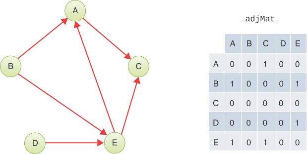

图 14-21 五顶点有向图及其邻接矩阵

#### A行

让我们从 A 行开始。该行的 A 列和 B 列中没有任何内容 (0)，但 C 列中有一个 1，因此你可以停在那里。
现在这个位置的 1 表示有一条从 A 到 C 的路径。如果你知道有一条从其他顶点 X 到 A 的路径，那么你就会知道有一条从 X 到 C 的路径。边在哪里 （如果有的话）以 A 结尾？ 它们在 A 列中。因此，你检查 A 列中的所有单元格。在图 14-21 的 _adjMat 中，A 列中只有一个 1：在 B 行。它表示从 B 到 A 有一条边。所以 ，你知道从 B 到 A 有一条边，从 A 到 C 有一条边（检查行 A 时开始的边）。据此，你推断可以分两步从 B 到 C。 你可以通过查看图表来验证这是真的。
要记录此结果，请在 B 行和 C 列的交点处放置一个 1。结果显示在图 14-22 中的第二个矩阵中。 突出显示的单元格显示值更改为 1 的位置。

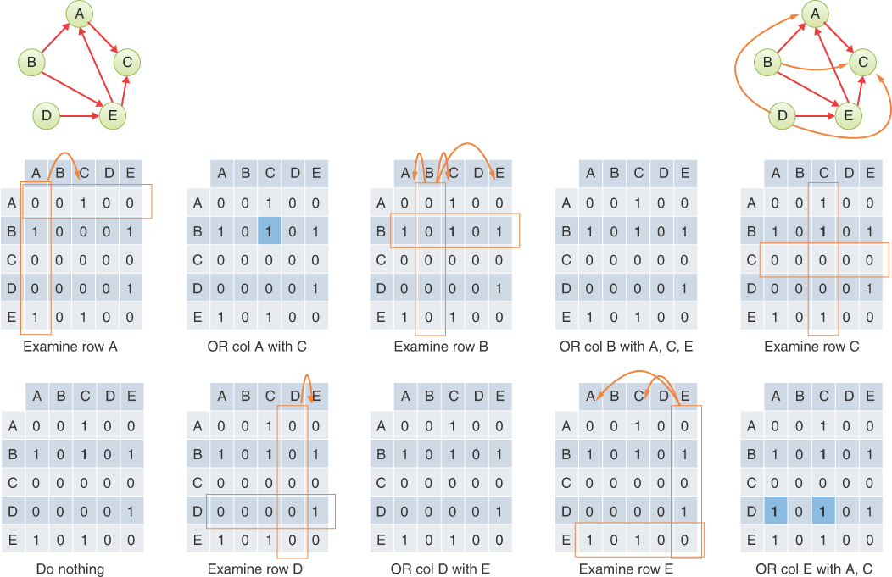

图 14-22 Warshall 算法的步骤
A 行的其余单元格为空白。 你只需要将 A 列的内容复制到 A 行中具有 1 的列。换句话说，你对第一个"位"执行类似于 A 列和 C 列的按位或的操作" 上"。 请注意，A 列的顶点 E 也为 1。C 列的顶点 E 已经为 1，因此按位或运算不会更改它。

#### B、C 和 D 行

接下来，转到 B 行。A 列的第一个单元格有一个 1，表示从 B 到 A 的一条边。是否有任何边以 B 结束？ 你查看 B 列，但它是空的，因此你知道在 B 行中找到的任何 1 都不会导致找到更长的路径，因为没有边在 B 处结束。你可以对 B 列的三列执行按位或运算 在 B 行中有一个 1，但是与 0 的按位或不会改变任何东西，如图 14-22 的第四个面板所示。
C 行根本没有 1，因此你转到 D 行。在这里，你找到从 D 到 E 的边。但是，D 列是空的，因此没有边以 D 结束，OR 也没有改变。

#### E行

在 E 行中，你会看到从 E 到 A 以及从 E 到 C 的边。查看 E 列，你会看到第一个条目是边 B 到 E，因此对于 B 到 E 和 E 到 A，你推断有 从 B 到 A 的路径。但是，该路径已经被发现，如该位置的 1 所示。
在 D 行的 E 列中还有另一个 1。从 D 到 E 的这条边加上从 E 到 A 和 E 到 C 的边意味着从 D 到 A 和 C 的路径，因此你在这两个单元格中插入一个 1。 结果显示在图 14-22 的最后一个矩阵中。
Warshall 的算法现已完成。 你已将三个 1 添加到邻接矩阵，它现在显示哪些顶点可以在任意数量的步骤中从另一个顶点到达。 图 14-22 右上角的图将传递闭包添加到图中的边显示为不同颜色的弯曲箭头。
#### 长路径
Warshall 算法能否在图中找到长路径并构建完整闭包？ 似乎逐行遍历矩阵一次可能找不到长而复杂的边链。 图 14-23 显示了一个更长的示例。

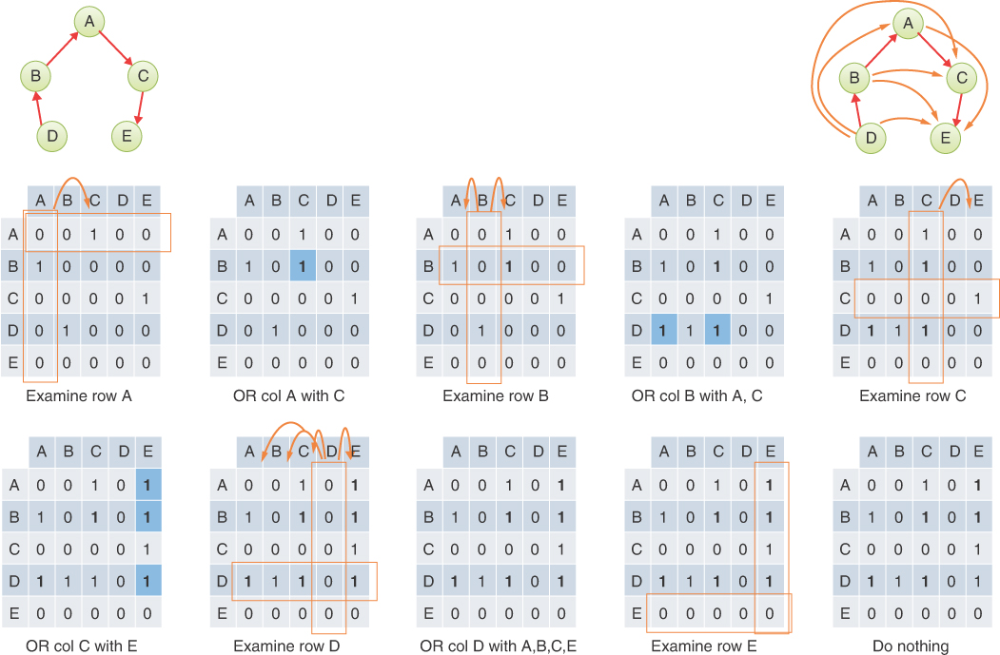

图 14-23 长路径上的 Warshall 算法
在此图中，五个顶点由四个边连接以形成一条长链。 Warshall 算法的每一步都会向矩阵添加新边。 首先，为 A 行添加一条边，然后在检查 B 行时添加两条边，然后为 C 行添加三条边。新条目有时排成一列，有时排成一行。 六个边缘是构建最终连接矩阵所需的全部； D 行和 E 行没有任何贡献，因为该行或其对应的列全为 0。

#### 循环

如果图 14-23 中的 D 连接到 E，它可以形成一个循环，假设边的方向从 E 到 D。如果有一个循环，连接矩阵会发生什么？ Warshall 的算法仍然有效吗？
事实上，Warshall 的算法可以用来检测循环。 考虑图 14-24 中所示的示例。 顶点A、B、C、D形成一个循环，顶点E挂在顶点C上。在初始邻接矩阵中，也就是图中左上角的矩阵，行索引与列索引相同的恒等对角线 索引全为 0。 这就是你在邻接矩阵中所期望的，因为只有伪图允许顶点有自己的边。

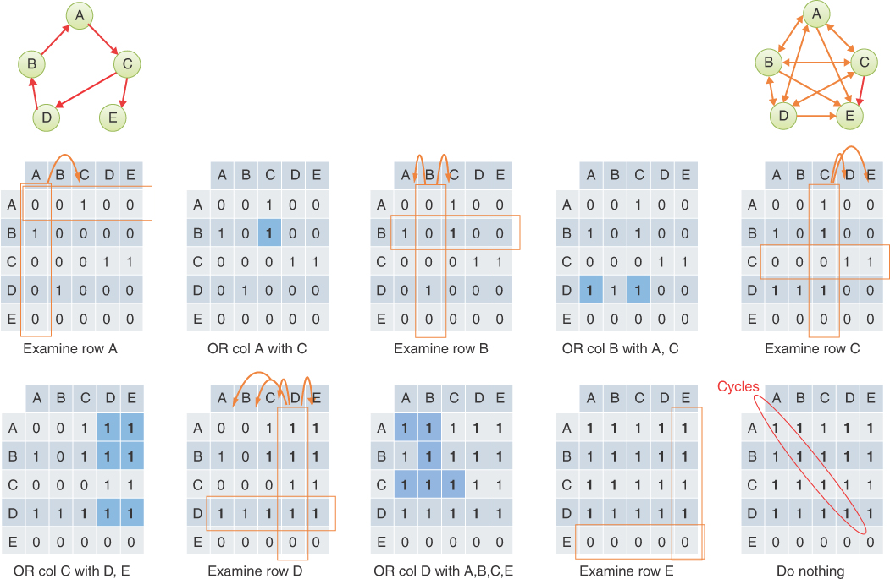

图 14-24 Warshall 算法应用于带环图
如果执行 Warshall 算法的步骤，最终的连通性矩阵会显示除顶点 E 外沿对角线的所有 1（如图 14-24 右下角矩阵中的圆圈所示）。 这意味着顶点 A、B、C 和 D 必须是至少一个循环的一部分。 有一些路径从每个顶点开始回到它自己。
沿对角线出现的 1 告诉你循环必须存在，但不是有多少个也不是哪些顶点在哪些循环中。 这些都是更难解决的问题。 尽管如此，拥有识别循环存在（和不存在）的方法还是很有用的。 图 14-24 中顶点 E 的对角线条目中的 0 告诉你它不是循环的一部分。 （也许应该要求学校通过将其应用于所有课程先决条件的依赖关系图来检查 0。）

#### Warshall 算法的实现

实现 Warshall 算法的一种方法是使用三个嵌套循环（如 Sedgewick 所建议的；参见附录 B，"进一步阅读"）。 外循环查看每一行； 让我们称其为变量 R。内部循环查看行中的每个单元格（列）； 它使用变量 C。如果在矩阵单元 (R, C) 中找到 1，则存在从 R 到 C 的边，然后激活第三个（最内层）循环。
第三个循环在 R 列和 C 列之间执行 OR 运算。它必须使用自己的变量遍历这些列中的每个单元格（顶点），并在它们的值之间执行 OR 运算。 我们将细节留作练习。
因为在所有 N 个顶点上有 3 个循环，所以整体复杂度为 O(N^3^)。 构建连接矩阵需要大量计算。 如果你只想找到问题的答案"是否有一系列从雅典到堪察加半岛的火车旅行？" 你可以使用深度优先或广度优先搜索在 O(N^2^) 时间内找到答案。 然而，首先构建完整的连接矩阵可以在其他高级图形算法中产生巨大差异。 它还可用于测试循环的存在，可能会在任何对角线设置为 1 时立即返回。 这仍然需要 O(N^3^) 时间（在最坏情况和平均情况下），所以速度不是很快。 我们将在下一章讨论这个和其他图算法的复杂性。

## 概括
- 图由边连接的顶点组成。
- 图可以表示许多现实世界的实体，例如运输路线、电路和作业调度。
- 如果一条边连接顶点，则顶点相邻。
- 顶点的邻接关系通常由邻接矩阵或邻接表表示。
- 邻接矩阵可以使用二维数组或哈希表来表示。
- 遍历算法允许你以系统的方式访问图中的每个顶点，并且是其他几个活动（例如搜索）的基础。
- 两种主要的遍历算法是深度优先（DF）和广度优先（BF）。
- 深度优先遍历可以基于栈； 广度优先遍历可以基于队列。
- 广度优先搜索找到两个顶点之间的最短路径（根据边数），如果存在的话。
- 深度优先搜索在遍历的早期探索离起始顶点最远的图形部分，这在游戏的移动分析中很有用。
- 最小生成树 (MST) 是具有连接所有无向图顶点所需的最少边数的子图。
- 最小生成树可用于查找互连数最少的网络布局。
- 可以在未加权的无向图上使用深度优先遍历来确定最小生成树。
- 树是一种无向图，其中唯一路径连接任意两个顶点。
- 在有向图中，边有一个方向（通常用箭头表示）。
- 有向图可以表示依赖关系、河流流量和单向道路网络等情况。
- 无向图的邻接矩阵总是具有镜像对称性，而有向图则不然。
- 在有向图顶点的拓扑排序中，如果存在从顶点 A 到顶点 B 的路径，则在结果列表中顶点 A 先于 B。 未通过路径连接的顶点对可以以任一顺序出现。
- 拓扑排序只能在有向无环图 (DAG)（没有循环的图）上进行。
- 拓扑排序通常用于安排复杂的项目，这些项目由取决于其他任务的任务组成。
- 拓扑排序可以在 O(N^2^) 时间内完成，其中 N 是顶点数，方法是计算每个顶点的入站度并将每个度的顶点保存在哈希表中。
- Warshall 的传递闭包算法查找是否存在从任何顶点到任何其他顶点的一条或多条边的连接。
- Warshall 的算法将邻接矩阵转换为连接矩阵，该矩阵可用于检测循环的存在。
- Warshall 算法的基本实现可能需要 O(N^3^) 时间。

## 问题
这些问题旨在作为读者的自测。 答案可以在附录 C 中找到。
1. 在图中，a(n) _______ 连接两个 ________。
2. 如何通过查看邻接矩阵判断无向图中有多少条边？
3. 在使用图形的游戏模拟中，a(n) _______ 对应于游戏棋盘状态，a(n) _______ 对应于玩家的移动。
4. 有向图是其中的一个
   1. 你必须遵循最小生成树。
   2. 你必须按拓扑排序顺序在顶点之间移动。
   3. 你只能在一个方向上从一个给定的顶点到另一个顶点。
   4. 你只能在任何有效路径上朝一个方向前进。

5. 如果图的邻接矩阵有 [0,1,0,0]、[1,0,1,1]、[0,1,0,0] 和 [0,1,1,0] 行， 顶点A、B、C、D对应的邻接表是什么？
6. 最小生成树是一个图，其中
   1. 连接所有顶点的边数尽可能少。
   2. 边数等于顶点数。
   3. 所有不必要的顶点都被删除了。
   4. 两个顶点的每个组合都由最少数量的边连接。

7. 三点三边的无向图中有多少种不同的最小生成树？
8. 从这些选项中选择最快的方法来检查有向图中是否存在从顶点A 到顶点Z 的路径。
   1. 获取 minimumSpanningTree(A)，然后找到从该树的根到 Z 的路径。
   2. 循环调用 depthFirst(A) 返回的顶点，直到 Z 出现。
   3. 循环调用 breadthFirst(Z) 返回的顶点，直到 A 出现。
   4. 将 Warshall 算法应用于图形，然后检查连接矩阵以查看 A 是否可以到达 Z。

9. 一个无向图一定有环如果
   1. 任何顶点都可以从其他顶点到达。
   2. 连通分量的个数多于一个。
   3. 边数等于顶点数。
   4. 路径数少于边数。

10. A(n) ______ 是一个没有圈的图。
11. 顶点的度数
    1. 是将它链接到起始顶点的路径中的边数。
    2. 是将它连接到其他顶点的边数。
    3. 是图的连通分量中的顶点数。
    4. 是邻接矩阵中其行中边数的一半。

12. 无向图的最小生成树可以有环吗？
13. 断对错：给定的有向图可能有许多正确的拓扑排序。
14. 拓扑排序结果为
    1. 边被定向，因此顶点按升序排列。
    2. 从起始顶点开始按边数递增的顺序列出顶点。
    3. 顶点按升序排列，因此 F 在 G 之前，G 在 H 之前，依此类推。
    4. 列出的顶点因此列表中后面的顶点位于前面的顶点的下游。

15. 如果图的邻接矩阵具有行 [0,1,0,0]、[0,0,0,1]、[1,0,0,0] 和 [1,0,0,0]，并且 顶点 A、B、C 和 D，是否可以作为参数传递给 sortVertsTopologically()？ 如果是这样，结果会是什么？
16. 什么是 DAG？
17. 沃歇尔算法
    1. 找到图中的最大环（如果有的话）。
    2. 将邻接矩阵更改为连接矩阵。
    3. 按升序而非拓扑排序顶点。
    4. 找到执行闭合所需的最少边数。

18. 在什么条件下对无向图进行拓扑排序有意义？
19. 如果图 G1 有 100 个顶点，G2 有 10 个顶点，那么在 G1 和 G2 上调用 sortVertsTopologically() 的计算时间比是多少？
20. 哪种算法解决了柯尼斯堡桥问题？
    1. 沃歇尔算法
    2. 最小生成树算法
    3. 拓扑排序算法
    4. 广度优先遍历算法


## 实验
进行这些实验将有助于深入了解本章所涵盖的主题。 不涉及编程。
**14-A** 你看到了如何使用深度优先遍历来确定特定图的最小生成树。 你能改用广度优先遍历吗？ 如果不是，为什么不呢？ 如果是这样，这两种方法之间会有什么不同？ 使用本章中显示的示例图进行实验。

**14-B** 考虑在计算机中表示 Königsberg 网络的网桥（见图 14-3）。 使用邻接矩阵有用吗？ 邻接表怎么样？ 桥是否需要不同的标签（如图中的标签）或者是否需要存储的只是两个顶点之间的边数是否重要？ 如果任何一种表示都不起作用，请解释原因，并提出一种使其起作用的方法。

**14-C** 使用图形可视化工具，从一个新的（空图形）开始并折叠邻接矩阵窗口。 然后随机填充5个顶点并添加7条边。 在不公开邻接矩阵的情况下，写下图的邻接矩阵。 完成后，展开矩阵视图以查看是否正确。 对包含 5 个顶点和 10 个边的有向图重复此练习。

**14-D** 在纸上，创建一个五乘五的矩阵。 沿对角线放置 Xs。 然后用1s随机填充一些单元格，其余留空（或填充0s）以形成五顶点邻接矩阵。 不要担心围绕对角线的对称性。 现在，隐藏图形可视化工具的邻接矩阵，从你的纸矩阵创建相应的有向图。 完成后，在工具中显示矩阵以查看图形是否对应于你的邻接矩阵。

**14-E** 在图形可视化工具中，查看你是否可以创建带有拓扑排序操作无法识别的循环的有向图。

## 编程项目
编写程序来解决编程项目有助于巩固你对材料的理解并演示如何应用本章的概念。 （如简介中所述，合格的讲师可以在出版商的网站上获得编程项目的完整解决方案。）
**14.1** 更改 Graph 类以能够创建两种图：无向图或有向图。 向默认为 False 的构造函数添加一个可选的定向参数。 根据是否设置有向标志更改有向图与无向图具有不同行为的所有方法，包括 print() 方法以显示 ->（而不是 <->）用于有向边。 使用 10 个顶点（A、B、C、D、E、F、G、H、I 和 J）和 12 条边（AG、AI、CF、DA、DI、HD、HE、HF）构造两种图 、HG、IH、JC 和 JH）。 在两个图上显示 print() 方法的输出以及从顶点 J 开始的 depthFirst() 遍历顶点和路径。

**14.2** 制作一个递归遍历生成器，depthFirstR()。 清单 14-4 中所示的方法使用堆栈来跟踪到当前顶点的路径。 你的方法应该利用递归调用中传递的调用堆栈和值来确定访问顶点的顺序和要生成的路径。 在项目 14.1 中的图表和图 14-10 中第二个广度优先示例中使用的图表上演示生成器的输出。 显示顶点的顺序和每个顶点的路径。

**14.3** 修改 breadthFirst() 生成器以返回每个顶点的路径以及被访问的顶点。 使用它来编写一个 shortestPath() 方法来查找两个顶点之间的最短路径（如果存在这样的路径）。 在图 14-10 的第二个广度优先示例中演示其搜索从顶点 A 到 H 的最短路径的输出，以及在图 14-14 的初始图中从顶点 F 到 A 的最短路径。 在这些图中分别从顶点 A 和 F 开始包括全广度优先遍历。

**14.4** 实施 Warshall 算法，根据图的邻接矩阵计算连通矩阵。 不是更新邻接矩阵，而是编写一个新方法 connectivityMatrix()，它返回一个新矩阵。 结果可以作为内部 _adjMat 的副本开始（使用 Python dict 的 copy() 方法）。 使用项目 14.1 中的有向图实现。 编写第二个方法 hasCycles()，测试图中是否存在循环。 在图 14-22、图 14-23 和图 14-24 的图表上展示你的方法。

**14.5** 团是 N 个顶点的图或子图，其中每个顶点都与所有 N-1 个其他顶点相邻。 在通信模式图中，派系可以表示相互关联且有影响力的群体。 它们代表相互交流的人群或组织——比图中的其他人交流更多。 这种只与群体成员互动的倾向导致了社会小圈子之外的人感到被排斥的感觉。

向 Graph 类添加一个方法，该方法返回所有具有 N 个顶点的子图 cliques。 参数 N 应介于 2 和图中的顶点总数之间才有意义。 每对相邻顶点形成一个大小为 2 的团（在无向图中），因此每条边恰好有一个大小为 2 的子图团。 较大的团可以通过将单个顶点添加到较小的顶点来形成，如果该顶点具有到较小团中所有顶点的边。

你的方法应将派系作为具有 N 个顶点的子图返回。 至少在以下两个图中展示你的方法在寻找大小为 3、4 和 5 的集团时的输出：

- 一个 10 顶点图，其中五个顶点完全互连，另外五个顶点不连接到一个以上的其他顶点。
- 具有三个大小为 4 的重叠派系的 10 顶点图。派系通过共享一个顶点而重叠。 可以使用以下顶点索引对表达式生成此模式：

```python
[(a, b) for c in range(0, 9, 3) for a in range(c, c + 4) for b in range(a + 1, c + 4)]
```

> 注意：在图中查找派系在计算上可能相当复杂，尤其是在搜索所有派系时。 在大图上运行你的方法可能需要很长时间来处理，我们将在下一章讨论。

**14.6** The Knight's Tour 是一个古老而著名的国际象棋谜题。 目标是让骑士在一个空棋盘上从一个方格移动到另一个方格，直到它恰好访问过每个方格一次。 编写一个程序，使用深度优先搜索来解决这个难题。 最好使电路板尺寸可变，以便你可以尝试针对更小的方形电路板 (K×K) 的解决方案。 普通的 8×8 棋盘在小型计算机上可能需要数年才能解决，但 5×5 的棋盘只需不到一分钟。 在下一章中，我们将更多地讨论这个问题的复杂性。

请参阅本章中的"深度优先遍历和游戏模拟"部分，记住拼图就像是单人游戏。 可能更容易想到一个新的马被创建并在移动时留在新的方格上（而不是移动一个马）。 这样，一系列添加的马代表游戏板状态，并且可以从马的位置推断出占用的方块。 当棋盘完全被马填满时（马的顺序等于棋盘的大小），你就赢了。

在寻找下一步行动时，马不仅必须进行合法的马移动（一个方向两个空间，另一个方向一个空间），而且它也不能离开棋盘或进入已经占据（访问）的方格 . 如果让程序显示棋盘并在每次移动后等待按键，你可以观察算法的进展，因为它将越来越多的马放在棋盘上。 当它被装箱时，你可以看到它通过移除一些骑士并尝试一系列不同的动作来回溯。

这个问题有一些看似不明显的复杂性。 其中最重要的一项是图中的顶点代表什么。 查看图 14-8 中的井字棋盘会建议使用顶点来表示棋盘状态：其中九个方块中的每一个都是空白、X 或 O。要使用所示的 depthFirst() 遍历方法 在示例 14-4 中，你需要首先创建一个 Graph，其中包含每个可能的棋盘状态的顶点。 在井字游戏中，有 39 = 19,683 种可能的方式将空白、X 或 O 放置在九个方块中。 尽管其中许多在真实游戏中是不可能的（例如，X 和 O 的数量相差超过 1），但创建所有这些顶点然后在它们之间添加边将非常耗时。 对于一个 8×8 的棋盘，每个方格要么是空的，要么被一个马占据，有 264 个或超过 40 亿个棋盘状态。 这不太可能是解决此问题的有效方法。

对于许多游戏模拟，图形在一开始并没有完全创建。 随着移动的进行和潜在的反移动被探索，新的顶点将根据最后一个棋盘状态的合法移动添加到图中。 因此，该图在整个游戏中仅部分表示。 这意味着我们实施的深度优先遍历方法无法解决骑士之旅，因为邻接矩阵和顶点列表都不完整。

另一种方法是在棋盘上的每个方块上创建一个顶点。 顶点之间的边可以代表国际象棋中合法的马步。 通过这种方式，图表代表合法的棋盘移动，而不是棋盘状态。 棋盘的状态隐含在搜索所采用的路径中，搜索路径是放置马的一系列方格。 图的顶点数为 K×K，大约有 4×K×K 条边。 如果你在这个合法的走棋图上使用 depthFirst() 遍历方法，你会解开这个谜题吗？ 这种方法肯定会提供所有合法移动的路径，并避免重新访问先前在路径上访问过的顶点（正方形）。 然而，问题在于它被设计为只访问每个顶点一次。

在 Knight’s Tour 的情况下，你需要探索通往顶点的每条可能路径。 要了解原因，请想象一下，在访问了 5×5 棋盘中 25 个方格中的 24 个之后，你发现无法从访问的最后一个方格到达最后一个空方格。 所以，你必须在深度优先搜索中回溯。 假设你返回第 20 个骑士并尝试通过剩余 5 个方格的新路径。 如果你在 depthFirst() 遍历方法使用的已访问数组中标记了最后 5 个方块中的 4 个，则不会再次搜索它们。 你需要一种不同的方式来标记已经搜索过的内容。

如果你使用合法的棋盘移动图，你将需要编写深度优先遍历来探索图中所有可能的路径，而不仅仅是所有顶点。 如果在搜索时创建游戏板状态顶点，则必须确保以深度优先顺序访问这些顶点。
