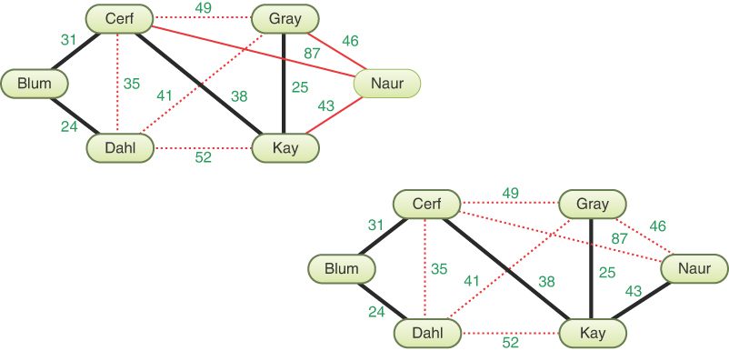
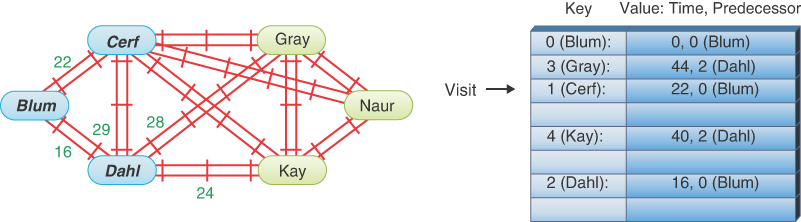
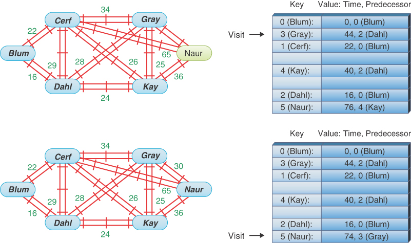

# 加权图

在这一章当中

- 带加权图的最小生成树
- 最短路径问题
- 全对最短路径问题
- 效率
- 棘手的问题

在前一章中，你看到图形的边可以有方向。 本章探讨了另一个边缘特征：权重。 例如，如果加权图中的顶点代表城市，则边的权重可能代表城市之间的距离，或者它们之间的飞行成本，或者每年在它们之间进行的车辆旅行次数（公路工程师感兴趣的数字） .
当你将权重作为图形边缘的特征时，会出现一些有趣且复杂的问题。 加权图的最小生成树是什么？ 从一个顶点到另一个顶点的最短（或最便宜）距离是多少？ 这些问题在现实世界中有重要的应用。
我们首先检查一个加权但无向图及其最小生成树。 在本章的后半部分，我们将结合著名的 Dijkstra 算法研究有向图和加权图，该算法用于寻找从一个顶点到另一个顶点的最短路径。

## 带加权图的最小生成树

为了介绍加权图，我们回到最小生成树的问题。 使用加权图创建这样一棵树比使用未加权的图要复杂一些。 当所有的边都具有相同的权重时，算法就可以非常简单地选择一条边添加到最小生成树中，正如你在[第 14 章](./14-图.md)"图"中看到的那样。 但是，当边缘具有不同的权重时，你需要更加谨慎地选择。

### 一个例子：丛林中的网络

假设你要安装高速网络线路以连接神话国家图拉拉的六个城市。 连接六个城市只需要五通，但是应该是哪五通呢？ 连接每对城市的成本各不相同，因此你必须谨慎选择路线，以最大限度地降低总体成本。 图 15-1 显示了一个带有六个顶点的加权图。 每条边都有一个权重，由边旁边的数字显示。 这是加权图的抽象形式。 请注意，某些链接未显示（例如，没有从 A 到 D 或 A 到 F 的直接链接）。 当图形表示现实世界的问题时，某些链接可能会因为距离、地形、环境或其他问题而变得不切实际。


图 15-1 加权图
你如何选择一个子图来最小化将顶点连接到网络中的成本？ 答案是计算最小生成树。 它将有 5 条边（比顶点数少一条），它将连接所有六个城市，并将链接的总成本降至最低。 你能通过查看图 15-1 中的图形找出这条路线吗？ 如果没有，你可以使用 WeightedGraph Visualization 工具解决问题。

### 加权图可视化工具

加权图可视化工具类似于图形工具，但它创建加权的无向图。 你可以创建顶点，将它们与边连接起来，并像以前一样显示或隐藏邻接矩阵。 在阴影图形区域中，你可以双击以创建一个新顶点，从一个顶点拖动到另一个顶点以创建一条边，然后使用第二个鼠标按钮或按住 Shift 键拖动以移动一个顶点。 双击边或顶点将其删除。
通过拖动指针创建的边的初始权重为 1。你可以通过在阴影图形区域或邻接矩阵中选择它并更改数值来更改权重。 当你在一个地方改变权重时，它们会在所有地方更新。 如果你擦除权重或将其设为零，边缘就会消失。 权重限制为值 1–99。
通过创建一些小图并找到它们的最小生成树来试用此工具。 （对于某些配置，你需要小心定位顶点，以便权重数字不会落在彼此之上。）
使用 WeightedGraph Visualization 工具构建图 15-1 的图形。 结果应该类似于图 15-2。 如果你碰巧在可以从命令行启动它的计算机上运行可视化工具，则可以使用以下命令初始化图形（顶点的随机定位）：

```python
python3 WeightedGraph.py A B C D E F A-B:4 A-C:6 B-C:7 B-D:12 B-E:8 C-D:7 C-E:10
D-E:5 D-F:7 E-F:6
```


图 15-2 加权图可视化工具
现在从顶点 A 开始找到该图的最小生成树，方法是单击该顶点以用蓝色环突出显示它，然后选择"最小生成树"按钮。 结果应该是图15-3所示的最小生成树。


图 15-3 上图的最小生成树
该工具发现最小生成树由边 AB、AC、CD、DE 和 EF 组成，总边权重为 28。指定边的顺序并不重要。 如果你从不同的顶点开始，你将创建一棵具有相同边但顺序不同的树。 对于具有不同连通分量的图，最小生成树只连接其中一个分量，正如你在[第 14 章](./14-图.md)中看到的那样。

### 构建最小生成树：派出测量员

构建最小生成树的算法有点复杂，所以我们将类比在Turala中构建高速网络来介绍它。 想象一下，你的公司赢得了为这个丛林覆盖的国家提供高速网络的合同。 你当然是项目经理，你的团队中还有各种测量员。
这个项目的第一个挑战是在许多问题中都会发生的事情：你必须"发现"图表。 虽然城市的位置以及铺设网络电缆或创建点对点微波传输系统的大致成本是已知的，但城市之间地形的确切细节却未知。 这意味着图及其边权重在开始时是未知的。 你的部分工作是发现该信息。
计算机算法总是关注问题的微小部分。 与喜欢看大局的人类不同，计算机一次只关注单个顶点、边、节点、键等，做出一系列局部决策，这些决策结合起来以达到特定目标。 对于图，算法倾向于从某个顶点开始并远离它，在查找更远的顶点之前获取有关附近顶点的数据。 在大型图表中尤其如此，这些图表很难或不可能一次完全表示，例如星系中恒星之间的所有可能路线。
以类似的方式，在图拉拉规划路线涉及到达一些城市并找出连接它们的道路和路径上的内容。 获取此信息需要时间。 这就是你的测量员进来的地方。

### 始于百隆

你首先在布卢姆市设立办事处。 （你可以从任何城市开始，但你听说过 Blum 拥有最好的餐厅。）合同中要连接的其他城市是 Cerf、Dahl、Gray、Kay 和 Naur。 Blum 位于该国的一端，你了解到从 Blum 只能到达两个城市——Cerf 和 Dahl——如图 15-4 所示。 该图显示的 Blum 具有较粗的彩色轮廓，表示你在那里有办公室。


图 15-4 图拉拉访问的首批城市
从技术上讲，你可以尝试通过丛林中的直接路径到达其他城市。 网络必须到达那两个城市，并且你的分析表明，通过一个或两个城市比在某条新路径上穿越丛林、山脉和河流成本更低。
你派出两个调查小组沿着路径前往这些城市，看看情况如何。 他们的工作是针对不同的网络选项（埋地电缆、架空电缆、输电塔等）评估这些路由。 他们采用实际距离，并为土壤条件、河流穿越、海拔变化等增加额外的成本因素。
第一支队伍到达瑟夫并给你打电话报告他们的情况； 他们说从 Blum 到 Cerf 的连接线应该花费 3100 万图拉拉戈比（而且风景很美）。 稍后，第二个小组从达尔那里报告说，跨越更多地级国家的布鲁姆-达尔连接线应该耗资 2400 万美元。 你列一个清单：

- 布鲁姆-达尔，24 岁
- 布鲁姆-瑟夫，31 岁

你总是按照成本递增的顺序列出链接； 你很快就会明白为什么这是个好主意。

### 完成 Blum-Dahl 链接

在这一点上，你认为你可以派出施工人员实际建造 Blum-Dahl 链接。 你如何确定链接最终将成为最佳解决方案（最小生成树）的一部分？ 到目前为止，你只知道系统中两个链接的成本。 你不需要更多信息吗？
要感受这种情况，请尝试想象一些其他连接 Blum 和 Dahl 的路线，该路线会比直接连接更好。 如果它不直接去达尔，那么这条另一条路线必须经过瑟夫并绕回达尔，可能途经图 15-5 中问号所示的一个或多个其他城市。 你已经知道从 Blum 到 Cerf 的链路比从 Blum 到 Dahl 的链路 24 的成本更高，为 3100 万。你的预先计划表明，尝试直接从 Blum 到达任何其他城市的成本甚至更高。 所以即使这条假想的环形路线中剩余的链路很便宜，成本为 100 万（甚至为 0），但从布卢姆经过 Cerf 和未知城市（> 3100 万）到达达尔的成本仍然更高 . 好的，如果未知环路的成本很高，比如说 100（或者任何大于 31 的东西）怎么办？ 如果这些成本很高，你可能会在计划中同时保留 Blum–Dahl 和 Blum–Cerf 路线。 在这两种情况下，对于未知的成本，Blum-Dahl 路线都保持不变。 Blum–Cerf 链接不确定，因此你还不能在那里构建任何东西。


你得出结论，Blum–Dahl 路线将是最小生成树的一部分。 这不是正式的证明（这超出了本书的范围），但它确实表明你最好的选择是选择最便宜的链接。 你派遣部分员工在达尔设立办事处。
你为什么需要另一个办公室？ 根据图拉兰政府的规定，你必须先安装一间办公室，然后才能从城镇派出测量员。 在图形术语中，你必须先向树中添加一个顶点，然后才能了解远离该顶点的边的权重。 所有有办公室的城镇都在最终最小生成树中的链接上； 没有办事处的城镇尚未连接。

#### 建立 Blum–Cerf 链接

在你完成 Blum-Dahl 连接并建立你的新办公室后，你可以从 Dahl 派出测量员到从那里可以到达的所有城市。 他们了解到这些是 Cerf、Gray 和 Kay。 调查组到达目的地后报告的费用分别为 35、41 和 5200 万。 当然，你不会将勘测团队派回 Blum，因为你已经勘测了路线、安装了网络链接并在那里设有办公室（可以欣赏到美丽的海岸景色）。
现在你知道了四个链接的成本（除了你已经建立的那个）：

- 布鲁姆-瑟夫，31 岁
- 达尔-瑟夫，35 岁
- 达尔-格雷，41 岁
- 达尔凯，52 岁

在这一点上，接下来要做什么可能并不明显。 有许多潜在的链接可供选择。 你认为现在最好的策略是什么？ 这是规则：
***规则***

- 从列表中，始终选择成本最低的边缘。

其实，当你从百隆选择走哪条路线时，你就已经遵循了这条规则； Blum-Dahl 边的权重（成本）最低。 这里成本最低的边是 Blum–Cerf，因此你现在可以以 3100 万的成本完成 Blum 到 Cerf 的路线。 你现在可以在瑟夫开设办事处（并享受那里独特的音乐文化）。
让我们暂停一下，做一个一般性的观察。 在给定时间规划最佳路线，有以下三种城市：

1. 已确定路线上的城市。 （在图形术语中，它们是最小生成树中的顶点。）
2. 调查员访问过的城市，因此你知道将它们链接到第一组城市中的至少一个城市的成本。 你可以称这些为"边缘"城市。
3. 你的团队尚未访问过的城市。

在这个阶段，Blum、Dahl 和 Cerf 属于第 1 类； Gray 和 Kay 属于第 2 类； Naur属于第3类，如图15-6所示。 当你按照算法进行操作时，城市从未知变为边缘，从边缘变为最终确定。


图 15-6 最小生成树算法的中途
建立 Cerf-Kay 链接
此时，Blum、Dahl 和 Cerf 已连接到网络并拥有办公室。 你已经知道从 Blum 和 Dahl 到类别 2 中的城市的成本，但你不知道从 Cerf 连接的成本。 因此，你从 Cerf 派出测量员到 Gray、Kay 和 Naur。 他们向 Gray 报告了 4900 万，向 Kay 报告了 3800 万，向 Naur 报告了 8700 万。 这是新列表：

- 达尔-瑟夫，35 岁
- 瑟夫-凯，38 岁
- 达尔-格雷，41 岁
- 瑟夫-格雷，49 岁
- 达尔凯，52 岁
- 瑟夫-瑙尔，87 岁

Dahl–Cerf 链接在之前的列表中，但在此列表中被划掉了。 为什么？ 好吧，考虑到已经连接的城市的链接是没有意义的，即使是通过间接路线也是如此。 此外，最小生成树不得包含循环。 你现在可以稍微修改你的规则：
***规则***

- 从列表中，始终选择成本最低的边缘到边缘城市（顶点）。

从此列表中，你可以看到下一个成本最低的路线是 Cerf–Kay，为 3800 万。 你派出工作人员安装此链接并在 Kay 设立办公室，结果如图 15-7 所示。


图 15-7 从 Cerf 访问所有链接后的最小生成树

### 建立 Kay-Gray 链接

从 Kay，你派遣了更多的调查团队，他们向 Gray 报告了 2500 万的成本，向 Naur 报告了 40 的成本。 必须删除之前列表中的 Dahl–Kay 链接，因为 Kay 现在是一个连接的城市。 你到边缘城市的新边缘列表（忽略指向最终城市的划线链接）是

- 凯-格雷，25 岁
- 达尔-格雷，41 岁
- 凯-诺尔，43 岁
- 瑟夫-格雷，49 岁
- 瑟夫-瑙尔，87 岁

成本最低的链接是 Kay–Gray，因此你构建此链接并在 Gray 安装办公室。

### 最后，指向 Naur 的链接

选择范围正在缩小。 当你移除已经链接的城市并从 Gray 派出测量员后，情况如图 15-8 中的左图所示。 你的列表现在仅显示：

- 凯-诺尔，43 岁
- 格雷-诺尔，46 岁
- 瑟夫-瑙尔，87 岁



图 15-8 Turala 中最小生成树的最终连接
你安装了从 Kay 到 Naur 的最后一条链路，在 Naur 建立了一个办公室，你就完成了。 你知道你已经完成了，因为现在所有六个城市都有一个办事处。 你已经为 Blum–Dahl、Blum–Cerf、Cerf–Kay、Kay–Gray 和 Kay–Naur 构建了链接，如图 15-8 右侧所示。 这是连接图拉拉六个城市的成本最低的网络，共 1.61 亿（24 + 31 + 38 + 25 + 43）。
请注意，最终的最小生成树不包括所有成本最低的边。 最后添加的链接，从 Kay 到 Naur，成本为 43。这比 Dahl–Cerf 的成本 35 和 Dahl–Gray 的成本 41 高。是否可以有另一个使用这些链接之一的最小生成树？ 简短的回答是肯定的； 可以有其他总成本相同的生成树（但没有一个成本更低）。

### 创建算法

使用将一个小国家联网的有点奇特的想法，我们已经展示了加权图的最小生成树背后的主要思想。 现在让我们看看如何为这个过程创建算法。

#### 存储边

该示例中的关键活动是跟踪每个城市的类别并列出城市对之间的链接成本。 你决定在何处构建下一个链接（边）并通过选择成本最低的链接添加新城市（顶点）。
你在其中重复选择最小值的加权边缘集合建议将优先级队列或排序列表或最小堆作为合适的数据结构。 这些都是处理最小成本边选择的有效方法，但你还应该查看需要完成的其他操作。 你当然需要从集合中删除最小成本边，但你还需要删除连接 MST 中已有顶点的非最小边，或者在它们被选为最小成本边时丢弃它们。 当然，你还必须在发现边时将所有边插入结构中。
由于移动数组中的值（或在列表中找到插入点），因此插入基于排序数组的优先级队列是 O(N) 操作。 插入堆是一个 O(log N) 操作。 为了删除最小值，优先级队列和排序数组需要 O(1) 时间（如果最小值保持在数组的末尾以便不需要移动），而堆需要 O(log N)。
假设该图有 V 个顶点和 E 个边。 你只能在探索图形时发现这些值，但你可以为它们命名以供分析。 在此过程中，你将向集合中插入 E 条边，并至少删除其中的 V – 1 条，可能会丢弃那些链接 MST 中已有的两个顶点的边。 你知道 E 必须大于或等于 V – 1，或者图形必须具有多个连通分量。 让我们在表 15-1 中总结各种结构的成本。 因为我们需要分析边和顶点的成本，所以我们使用 O(E) 和 O(V) 而不是 O(N)。
表 15-1 不同边缘存储方案的效率

| 结构     | E Inserts    | V – 1 Removals     | 总成本       |
| -------- | ------------ | ------------------ | ------------ |
| 优先队列 | E × O(E)     | (V – 1) × O(1)     | O(E^2^)      |
| 排序列表 | E × O(E)     | (V − 1) × O(1)     | O(E^2^)      |
| 最小堆   | E × O(log E) | (V − 1) × O(log E) | O(E × log E) |

在总成本中，插入成本占主导地位。 优先级队列和排序列表的删除成本要低得多，但插入量会随着边数的平方增长。 对于堆，插入和移除都呈对数增长。 你可以简化并仅在总成本中使用 E，因为它比 V 大（除了最简单的图形之外）。 这清楚地表明堆是最有效的，因为随着 E 变大，E × log E < E2。
你可以使用最小堆代替列表或数组，如[第 13 章](./13-堆.md)"堆"中所述。 因为堆没有提供一种有效的方法来删除除最小值以外的项，所以你只需删除最小边，直到找到连接到边缘顶点的边。

#### 算法概要

让我们用图形术语（而不是链接城市术语）来重述算法。
从一个顶点开始（任何一个都可以）并将其放入树（子图）中。 然后重复执行以下操作：

1. 对于来自最新顶点的每条出边，如果它到达树中已有的顶点，则"修剪"（丢弃）它。 否则，将边放入最小堆。
2. 从堆中选择权重最低的边，直到
   1. 堆是空的，或者
   2. 你到达树中有一个顶点的边缘。
3. 如果在上一步中堆被清空，那么你已经找到了连接组件的完整树。 否则，将边添加到树中，并将目标顶点记为树中的最新顶点。

重复这些步骤，直到所有顶点都在树中或堆变空。 到那时，你就完成了。
在第 1 步中，最新表示最近安装在树中。 此步骤的边可以在邻接矩阵中找到（或者如果图形边尚未被发现，则可能会计算出来）。 在步骤2中，树中有一个顶点的边是从最终顶点到边缘顶点的边。

#### 实施权重：无穷大和超越

当我们在[第 14 章](./14-图.md)介绍图时，我们描述了如何将相邻顶点表示为数组或列表。 当边有权重时，你需要重新考虑实现选项。
通常，权重可以是任何数字，可能包括浮点值。 这为表示各种问题的权重提供了最大的灵活性。 如果你使用相邻顶点的列表，你只需向该列表中的每个链接添加一个字段以保存与通往顶点的边相关联的权重。 在邻接矩阵中，你使用数字来表示相邻与不相邻的顶点（1 与 0）。 你能把边缘权重作为那个数组单元格中的数字吗？ 换句话说，adjMat[j, k] 可以保存顶点索引 j 和 k 之间的边的权重吗？ 答案并不像看起来那么简单。
你需要区分相邻和不相邻的顶点。 如果权重永远不允许为零，你可以继续使用零来表示不相邻的顶点。 这可能看起来不是什么限制，但在实践中，它可能非常有限。 在许多应用中，具有零权重的边很有用。 有时甚至负权重也很有用，避免意外将权重设置为零会非常不方便。 然而，在本章中，我们假设边权重为零或正。
如果你不能用零来表示不相邻的顶点，你能做什么？ 解决此限制的一种方法是存储一个表示正无穷大的值作为非相邻顶点的边权重。 如果需要，这允许零权重边缘和负权重。 无限重量就像是无限遥远——或者没有联系。 你如何在有限的内存中表示无穷大？ 有多种方法，但就像[第 12 章](./12-空间数据结构.md)"空间数据结构"中管理矩形边界和查询圆半径的方法一样，你可以使用 Python 提供的便利机制。 在 math 模块中，定义了一个名为 ```inf``` 的常量，其行为类似于正无穷大 (+∞)。 如果将它与任何其他整数或浮点数进行比较，它总是更大。 它唯一等于的数字是它自己。
使用正无穷大表示不相邻的顶点意味着你将用空图的值填充初始邻接矩阵。 有时这被称为加权邻接矩阵，因为所有单元格都有边权重，但只有有限的单元格被认为是相邻的。 或者，在邻接矩阵的哈希表表示中，不在哈希表中的任何键都将具有正无穷大的权重，并且只有相邻的顶点对将存储有限的权重。 在本书中，我们使用哈希表来实现加权图类。

### Python代码
与[第 14 章](./14-图.md)中描述的 ```Graph``` 类相比，```WeightedGraph``` 类的实现无需做太多更改。只有边发生了变化。 清单 15-1 显示了修改后的部分。
加权图需要堆数据结构，特别是编程项目 13.2 中的最小（或升序）堆。 我们还需要正无穷大常数的数学模块。 Vertex 类是相同的，因为更改仅适用于图形的边。 构造函数包含在清单 15-1 中，尽管它与 Graph 的构造函数相同。
第一个需要新定义的方法是添加边的方法。 它现在必须采用第三个参数作为新边的权重。 和以前一样，addEdge() 首先验证调用者传递的顶点索引 A 和 B，并验证边链接不同的顶点。 然后它在两个方向上的顶点对的 _adjMat 单元格中存储权重 w。 在未加权的图表中，它只是在这些单元格中存储了一个 1。
下一个方法 hasEdge() 更改为首先测试邻接矩阵的键之间是否存在顶点对（而不是使用 Python 的 get() 哈希表方法在键缺失时提供默认值）。 它还将矩阵中存储的任何值与 math.inf、正无穷大进行比较。 在许多应用程序中可能不需要这种比较，因为只有当调用者将 math.inf 存储为某些边缘的权重时它才会有所不同。 例如，可以这样做以从图中删除一条边。 但是，如果在 hasEdge() 中省略了比较，则该方法将为具有无限权重的边返回 True。
最后一个方法 edgeWeight() 是新的。 我们需要一种方法来返回给定边的权重。 它检查有效的顶点索引，然后如果顶点对是邻接矩阵中的键，则返回存储在邻接矩阵中的权重。 否则，它返回正无穷大。
这就是基本表示中需要更改的所有内容。 其他一些更改（例如在 print() 方法的输出中包含权重）会有所帮助。 现在我们可以关注使用权重的算法。
清单 15-1 基本的 WeightedGraph 类

```python
from project_13_2_solution import Heap  # Minimum heap
import math


class Vertex(object):                        # A vertex in a graph
…                                            # same as for Graph


class WeightedGraph(object):  # A graph containing vertices and edges
…
    def __init__(self):  # with weights.
        self._vertices = []  # A list/array of vertices
        self._adjMat = {}  # Hash table maps vertex pairs to weight

    def addEdge(self, A, B, w):  # Add edge of weight w between two  # vertices A & B
        self.validIndex(A)  # Check that vertex A is valid
        self.validIndex(B)  # Check that vertex B is valid
        if A == B:  # If vertices are the same
            raise ValueError  # raise exception
        self._adjMat[A, B] = w  # Add edge in one direction and
        self._adjMat[B, A] = w  # the reverse direction

    def hasEdge(self, A, B):  # Check for edge between vertices A & B
        return (A, B) in self._adjMat and self._adjMat[  # If vertex tuple in adjMat
            A, B
        ] < math.inf  # and has finite weight

    def edgeWeight(self, A, B):  # Get edge weight between vertices
        self.validIndex(A)  # Check that vertex A is valid
        self.validIndex(B)  # Check that vertex B is valid
        return (  # If vertex tuple in adjMat, return
            self._adjMat[A, B] if (A, B) in self._adjMat else math.inf
        )  # the weight stored there otherwise +∞
```

### 加权最小生成树算法
为了找到最小化总边权重的生成树，我们可以设置类似于用于未加权图的数据结构。 清单 15-2 显示了代码。 验证起始索引后，```minimumSpanningTree()``` 创建一个名为 ```tree``` 的空子图来保存结果。 然后它构建一个数组来将图中的顶点索引映射到树 ```vMap``` 中的顶点索引。 我们需要它，因为当算法发现权重最低的边时，我们将以不同的顺序将顶点添加到树中。 它还用于识别哪些顶点已被复制（映射）到树中。
清单 15-2 ```WeightedGraph``` 的 ```minimumSpanningTree()``` 方法

```python
class WeightedGraph(object):  # A graph containing vertices and edges
…
    def minimumSpanningTree(  # Compute a spanning tree minimizing edge
        self, n
    ):  # weight starting at vertex n
        self.validIndex(n)  # Check that vertex n is valid
        tree = WeightedGraph()  # Initial MST is an empty weighted graph
        nVerts = self.nVertices()  # Number of vertices
        vMap = [None] * nVerts  # Array to map vertex indices into MST
        edges = Heap(  # Use min heap for explored edges
            key=weight, descending=False  # Store (A, B) vertex pair & weight in
        )  # each heap item
        vMap[n] = 0  # Map start vertex into MST
        tree.addVertex(self.getVertex(n))  # Copy vertex n into MST
        while tree.nVertices() < nVerts:  # Loop until all verts mapped
            for vertex in self.adjacentVertices(n):  # For all adjacent
                if not vMap[vertex]:  # vertices that are not mapped,
                    edges.insert(  # put weighted edges in heap
                        ((n, vertex), self.edgeWeight(n, vertex))
                    )
            edge, w = (  # Get first edge and weight, if one exists
                (None, 0) if edges.isEmpty() else edges.remove()
            )
            while (
                not edges.isEmpty()
                and vMap[edge[1]] is not None  # While there are more edges
            ):  # and current edge in MST,
                edge, w = edges.remove()  # go on to next edge
            if (
                edge is None
                or vMap[edge[1]] is not None  # If we didn't find an edge or it goes
            ):  # to a mapped vertex
                break  # there are no more edges to be added
            n = edge[1]  # Otherwise get new vertex and
            vMap[n] = tree.nVertices()  # map it into MST
            tree.addVertex(self.getVertex(n))  # copy it into MST
            tree.addEdge(  # Add weighted edge to MST mapping
                vMap[edge[0]], vMap[edge[1]], w
            )  # vertex indices
        return tree  # Return the minimum spanning tree


def weight(edge):
    return edge[1]  # Get weight from edge tuple in heap
```

接下来，构造一个空堆以保持边的部分排序顺序，以便快速获得权重最低的边。 我们插入边堆上的项目是边的元组——一对顶点——及其权重。 我们使用 ```Heap``` 类的 ```key``` 参数来指定从每个元组中提取权重的函数。 ```weight()``` 函数显示在清单 15-2 的末尾。 它返回元组的第二个元素。
随着输出子图（树）、顶点图和边堆的构建，算法的主要部分开始了。 最初我们将输入图中的起始顶点 ```n``` 映射到输出树中的顶点 0，并将该顶点对象添加到树中。 如果输入图恰好是一个单点图，这就是所需的全部，因为输出树中可能没有边。
主 ```while``` 循环迭代直到输出树具有与输入图一样多的顶点。 稍后你会看到如果图形具有多个连通分量会发生什么。 在循环内部，我们从起始顶点 ```n``` 开始，找到它的所有相邻顶点，并查看是否每个相邻顶点都已映射到树中。 开始时，唯一映射的顶点是初始 ```n```，但在随后的循环中，```n``` 将是添加到输出树的最后一个顶点。 这就是为什么我们必须使用 ```vMap``` 数组检查每个相邻的顶点。
未映射的相邻顶点意味着相应的边缘导致边缘并且应该被插入到堆中。 对 ```edges.insert()``` 的调用将边的元组及其边权重放入堆中。 堆根据构造时定义的```weight key```知道放在哪里。
接下来，该方法从堆中取出第一条边，或者如果边堆为空，则将边设置为 ```None```。 内部 ```while``` 循环通过查看 ```vMap[edge[1]]``` 的值（相邻顶点的映射）来检查此边是否连接到已映射到输出树中的顶点。 我们如何知道要检查 ```edge[1]``` 处的顶点而不是 ```edge[0]``` 处的顶点？ 原因是我们仅在第二个顶点位于边缘且第一个顶点已经在最终树中的情况下将边添加到边堆。
如果边到达树中已有的顶点并且堆中有更多边，我们通过在内部循环中调用 ```edges.remove()``` 从堆中取出下一个权重最低的边。 内循环退出后，如果没有找到边（```edge``` 为 ```None```）或者我们只找到在树中连接的边（```vMap[edge[1]]``` 不是 ```None```），那么我们已经用完了边以进行扩展 那个树。 在这种情况下，是时候跳出外部 ```while``` 循环了，因为我们已经构建了包含起始顶点的连通分量的最小生成树。 返回的树将比输入图具有更少的顶点。
在验证我们确实找到了通往未映射顶点的边后，我们将 ```n``` 设置为新顶点 ```edge[1]```，将其映射到输出树中，将顶点添加到树中，并添加通向它的边 . 边中的每个顶点都必须使用 ```vMap``` 映射到它们在输出树中的新索引。 下一次通过主 ```while``` 循环将探索从 ```n``` 延伸的边。
当控制从主 ```while``` 循环退出时，最小生成树完成（对于包含起始顶点的连接组件）。 如你所见，向最小生成树算法添加权重使其比用于未加权图的深度优先遍历更复杂。 然而，使用堆和顶点映射数组可以降低代码的复杂性。
加权图可视化工具可以显示该算法中的每个步骤。 尝试创建一个简单的图形，选择一个起始顶点，然后使用步骤按钮 ，看看每个操作是如何发生的。
图15-9为图15-1、15-2、15-3图的最小生成树计算过程中的WeightedGraph Visualization工具。 在处理的这一点上，顶点 A、B、C 和 D 已添加到输出树中。 显示器上有很多数据结构，包括

- 输入图的 ```_vertices``` 数组（在右上角）
- 输入图的 ```_adjMat``` 的哈希表，邻接矩阵（在图 15-9 中折叠以显示其他变量）
- ```vMap``` 数组将输入顶点映射到它们在输出树中的索引（在 ```_vertices``` 数组的右上角）
- 输出最小生成树（由从左下角开始指向第一个顶点的弯曲箭头显示，已映射到树中的顶点上突出显示的环，以及已添加到树中的较粗的突出显示边）
- 边缘堆在底部显示为一个简单的有序数组而不是堆树（将堆显示为树会占用更多空间，并且将项目按标准堆顺序放置会使它们之间的关系不那么清晰。）


图 15-9 计算最小生成树的可视化工具
数据的数量和它们之间的关系是复杂的。 尝试逐步执行算法，观察不同结构的增量变化，并在选择按钮查看结果之前预测每一步会发生什么变化。

## 最短路径问题

也许与加权图相关的最常见问题是找到两个给定顶点之间的最短（最低权重）路径。 这个问题的解决方案适用于各种各样的现实情况：规划旅行路线、布局集成电路、项目调度等等。 这是一个比我们以前见过的更复杂的问题，所以让我们从在同一个神话国家图拉拉（Turala）看一个（有点）真实世界的场景开始。

### 乘火车旅行

这次你关心的是铁路而不是网络连接。 虽然图拉拉在通信基础设施方面有点落后，但该国拥有出色的铁路系统。 你想找到从一个城市到另一个城市的最快路线，以计划全国各地的比赛。
寻找最快路线是最短路径问题的一种变体。 在这种情况下，你对最短旅行时间感兴趣，但你可以寻找最短距离或最低票价的路线。 在加权图中，最短并不一定意味着时间或距离最短； 它也可以表示最便宜、排放最低或其他一些衡量标准的最佳路线。
乘火车在任何两个城市之间旅行的时间可能会有所不同。 这是由于赛道状况和天气变化造成的； 大雨、大雪或大雾意味着火车行驶速度变慢。 铁路每天都会发布旅行时间，但他们只在车站发布从那里出发的火车。 你的团队必须在比赛当天获得条件。

### 可能的路线

要规划你的路线，你需要了解可用的选项。 第一步是概述你的团队可能乘坐的火车。 你可能会以图形形式构建城市地图，如图 15-10 左侧所示。 任何两个城市之间都有几条可能的路线。 例如，从布卢姆坐火车到凯，你可以经过达尔，也可以经过瑟夫和格雷，或者经过达尔和格雷，或者你可以走其他几条路线。


图 15-10 图拉拉的火车旅行
注意图 15-10 中的图表没有行程时间（或票价或时刻表）。 此时你所知道的是比赛将在 Blum 开始，所以这就是它被突出显示的原因。
有向加权图
城市之间的旅行时间可能因旅行方向而异。 上坡的火车可能比下坡的火车行驶得慢。 逆着急流飞行的飞机的地面速度低于顺着急流飞行的飞机。 为了模拟这些差异，我们使用有向图，其中从顶点 J 到顶点 K 的权重不同于从 K 到 J 的权重。Turalan 铁路只有单轨线，所以你只能在一个方向上行驶 任何时间点的任何两个城市。 在你的解决方案中，你将只记录从 Blum 出发的旅行时间，因为你不需要计划往返行程。 在寻找最低票价路线的情况下，如果两个方向的票价相同，则可以使用无向图。

### Dijkstra 算法

我们展示的最短路径问题的解决方案称为 Dijkstra 算法，以 Edsger Dijkstra 的名字命名，他于 1959 年首先描述了它。有趣的是，该方法不仅可以求解到目的地城市的最短路径，还可以求解最短路径 通往任何其他目的地的路径，如你所见。

### 代理人和乘坐火车

比赛当天，你得知终点线在诺尔。 要了解 Dijkstra 算法的工作原理，你的团队将按照计算机的方式操作，一次查看一条信息，因此我们假设你同样无法看到全局（如前一节所述）。 这意味着你的团队需要像测量团队一样派代理人到站点进行网络路由。
在每个城市，站长都会告诉你到其他可以直接到达的城市（即单程，不经过另一个城市）需要多长时间。 唉，他们不能告诉你比一程更远的城市的时间。 你有一个笔记本，如图 15-10 右边的那个，每个城市都有一行。 你希望以从起点到该城市的最短时间填充的行结束（加上你最后需要的更多信息）。
#### 第一经纪人：In Blum
最终，你将在每个城市安置代理人（至少是那些需要到达 Naur 的人）。 这些代理商必须获得有关前往其他城市的旅行时间的信息。 你自己就是 Blum 的代理人。
Blum 的站长只能告诉你，今天到 Cerf 需要 22 分钟，到 Dahl 需要 16 分钟。 你把这些信息写在你的笔记本上，如表 15-2 所示。
表 15-2 第 1 步：带有 Blum 代理信息的笔记本

| To   | Time | Via  |
| ---- | ---- | ---- |
| Cerf | 22   | Blum |
| Dahl | 16   | Blum |

该表列出了你了解其旅行时间信息的所有城市。 Via 列记录了你从哪个城市获得该时间。 稍后你会明白为什么知道这一点很好。 你现在做什么？ 这是你遵循的规则：
***规则***

- 始终派代理人到未到过的城市，其从起点（布卢姆）出发的总路线最短。

请注意，这与最小生成树问题（网络安装）中使用的规则并不完全相同。 在那里，你选择了从连接城市到未连接城市的成本最低的单条链路（边）。 在这里，你选择从 Blum 到没有代理的城市的最便宜的总路线。 在你规划的这个特定点，这两种方法等同于同一件事，因为从 Blum 出发的所有已知路线都只包含一条边。 然而，当你向更多城市派遣代理人时，从 Blum 出发的路线将成为几个直边的总和。

#### 第二位经纪人：因·达尔

从布卢姆到达尔的最短路线只需 16 分钟。 因此，你将一半的团队派往达尔，其中一个人将充当代理人，其他人将为以后的任务做好准备。 当他们到达时，他们会告诉你达尔站长说今天的火车到达瑟夫需要 29 分钟，到达格雷需要 28 分钟，到达凯需要 24 分钟，返回布鲁姆需要 15 分钟。 最后一次旅行时间让你的代理人感到困惑，直到他们意识到站长不知道他们来自哪里并且只是想提供帮助。
现在你可以更新笔记本了。 将你到达 Dahl 的时间与到达 Gray 和 Kay 的时间相加，你可以在笔记本中创建两个新条目，如表 15-3 所示。 你现在知道你可以在 44 分钟内到达 Gray，在 40 分钟内从 Blum 到达 Kay。 你还收到了有关 Cerf 的信息。 如果你经达尔前往瑟夫，则需要 16 + 29 = 45 分钟。 这比从 Blum 直接旅行的时间要长，因此无需更改 Cerf 的条目。
表 15-3 第 2 步：带有 Dahl 代理信息的笔记本

| To   | Time | Via  |
| ---- | ---- | ---- |
| Cerf | 22   | Blum |
| Dahl | 16   | Blum |
| Gray | 44   | Dahl |
| Kay  | 40   | Dahl |

它有助于以图形形式查看此信息的外观。 图 15-11 显示了到目前为止学习到的路由（边）的权重。 你在 Blum 和 Dahl 有代理商，快速查看笔记本中的其他城市表明 Cerf 是下一条最短路线。 按照规则，你和布卢姆的其他特工去瑟夫了解那里的情况。 这就是"访问"指针显示的内容； 是时候去参观瑟夫了。



图 15-11 在最短路径算法的第 2 步之后。
图 15-11 右侧的表格显示了与笔记本中相同的信息，但格式不同。 城市的顺序不同，它包括起始城市布鲁姆，还有一些额外的数字和城市名称。 这些原因很快就会解释。
在你将代理人安置在一个城市之后，你可以确定他们到达该城市所走的路线是最快的路线。 为什么？ 考虑目前的情况。 如果有比从布卢姆到瑟夫的直达路线更快的路线，则需要经过其他城市。 乘火车离开 Blum 的唯一另一条路是去 Dahl，这是你首先探索的地方。 你已经发现 Blum–Dahl–Cerf 路线比直达 Cerf 的路线花费更多时间。 如果有通过格雷、凯或其他城市返回瑟夫的路线，则至少需要 40 分钟（到达凯所需的时间），因此没有比通过达尔更快的方法了。 因此，你可以肯定地得出结论，你知道到达所有已访问城市（Blum、Dahl 和现在的 Cerf）的最短时间。
基于此分析，你决定从现在开始不需要更新从 Blum 到 Cerf 或 Blum 到 Dahl 的时间条目。 你将无法找到更快的路线，因此可以将它们从列表中划掉。

#### 三种城市

与最小生成树算法一样，最短路径算法的城市分为三类：

1. 你已安装代理的城市（你已找到最短路径）。
2. 从有代理人的城市出发的旅行时间已知的城市； 他们在边缘。
3. 未知的城市。

在第 2 步开始时，Blum 和 Dahl 是第 1 类城市，因为他们在那里有代理商。 根据在 Dahl 中学习到的旅行时间，你将代理人派往 Cerf，将该城市移至类别 1。这三个城市形成了一棵树，由所有从起始顶点 (Blum) 开始并且每条路径都在不同目的地顶点结束的路径组成 . 当然，这不是同一棵树，与最小生成树不同。 它是最短路径树，因为你已经得出结论，你现在知道到每个城市的最快路线。
其他两个城市没有代理，但你知道某些时间可以到达它们，因为你在相邻的第 1 类城市中有代理。 你知道从 Blum 到 Gray 的时间最多为 44 分钟，而到 Kay 的时间最多为 40 分钟。 你笔记本上的信息意味着 Gray 和 Kay 是 2 类（边缘）城市。
你对 Naur 还一无所知； 这是一个"未知"的城市（从这个算法的角度来看）。 与最小生成树算法一样，Dijkstra 的最短路径算法将城市从未知类别移动到边缘类别，然后从边缘类别移动到树，一直进行。

#### 瑟夫的代理

你和你的其他特工现在在瑟夫，你可以在你的名单上划掉瑟夫和达尔，然后从那里的站长那里得到信息。 Cerf 是一个繁忙的车站，因为有 5 条铁路线与之相连。 你的特工了解到今天的火车到格雷需要 34 分钟，到瑙尔需要 65 分钟，到凯需要 26 分钟，到达尔需要 24 分钟，到布鲁姆需要 18 分钟。 你将时间添加到你的笔记本中，对于未访问的城市，得到表 15-4。
表 15-4 第 3 步：包含 Cerf 代理信息的笔记本
| To       | Time   | Via      |
| -------- | ------ | -------- |
| ~~Cerf~~ | ~~22~~ | ~~Blum~~ |
| ~~Dahl~~ | ~~16~~ | ~~Blum~~ |
| Gray     | 44     | Dahl     |
| Kay      | 40     | Dahl     |
| Naur     | 87     | Cerf     |

Blum–Cerf–Gray 路线需要 22 + 34 = 56 分钟。 这比 Blum–Dahl–Gray 路线的 44 分钟多，因此之前的入口仍然存在。 同样，Blum–Cerf–Kay 需要 22 + 26 = 48 分钟，比 Blum–Dahl–Kay 40 分钟要慢。你确实为 Naur 创建了一个新条目（因此它不再属于未知类别）。
返回 Blum 或 Dahl 的时间少于从这些城市前往 Cerf 所需的时间。 这不应该影响路线计划吗？ 可能 Cerf 海拔较高，因此返回速度更快，但这不会帮助你选择从 Blum 到 Naur 的最快路线。 划掉的条目不需要更新。
现在的情况如图 15-12 所示。 在瑟夫了解到的信息显示，下一个要访问的城市是凯，从布卢姆出发的总时间为 40 分钟。 同样清楚的是，通往凯的最快路线是 Blum–Dahl–Kay 路线，因为你在笔记中注意到凯的前身是达尔。 你现在拥有类别 1 或类别 2 中的所有城市； 没有人留在第 3 类。


图 15-12 在最短路径算法的第 3 步之后。
因为你的笔记本里有 Naur，你能不能别派特工出去了？ 一些团队成员急于完成测量。 你确实有一条通往瑙尔的路线，但你还不确定你是否知道最快的路线。 你告诉你在 Dahl 的团队分开，将一半转移到 Kay，然后继续前进。

#### Kay的代理

当你在凯有代理人时，他们会迅速报告以下旅行时间：格雷 25 分钟、瑙尔 36 分钟、瑟夫 29 分钟和达尔 24 分钟。 最后两个是你已经划掉的城市，所以只有前两个重要。 将时间加上到达凯的最短时间 40 分钟（通过达尔）意味着你可以在 65 分钟内到达格雷，在 76 分钟内到达瑙尔。 你已经知道一条到 Gray 的路线需要 44 分钟（通过 Dahl），所以新路线不好。 然而，通往瑙尔的路线更短。 （值得继续努力！）你更新笔记本以显示表 15-5 中的内容。
表 15-5 第 4 步：来自 Kay 代理的信息

| To       | Time      | Via           |
| -------- | --------- | ------------- |
| ~~Cerf~~ | ~~22~~    | ~~Blum~~      |
| ~~Dahl~~ | ~~16~~    | ~~Blum~~      |
| Gray     | 44        | Dahl          |
| ~~Kay~~  | ~~40~~    | ~~Dahl~~      |
| Naur     | ~~87~~ 76 | ~~Cerf~~  Kay |

你面临另一种选择，即以更新、更好的路线前往 Naur，结束这一进程。 但是，你相信这个过程，并决定继续。 前往未到访城市的最短路线现在是在 44 分钟后到达格雷（通过达尔）。 这对应于图 15-13 的上图。



图 15-13 按照最短路径算法中的步骤 4 和 5。
你正在接近目标。 你将 Dahl 的剩余团队派往 Gray，因为根据笔记，这是到达 Gray 的最快方式。 （敏锐的观察者可能会注意到，你可以更快地从 Kay 那里获得代理，但这并不是计算机算法的真正组成部分，它只需要选择下一步要探索的顶点。）

#### 最后的Gray代理

你的（现在非常有经验的）特工报告了从格雷出发的唯一重要路线：从那里到达瑙尔需要 30 分钟。 因为到达格雷需要 44 分钟（通过达尔），所以你现在可以在 74 分钟内到达瑙尔。 你对笔记本进行了另一次修改，最终得到了图 15-13 底部所示的图形和表格。 你派一个代理人去诺尔，只是为了确认时间。
当每个城市都有代理人时，你就会知道从 Blum 到其他每个城市的最佳时间。 你完成了。 无需进一步计算，笔记本中的最后条目显示今天从布卢姆到所有其他访问过的城市的最快路线。 你的团队现在有了从 Blum 到 Naur 比赛的最佳路线。 该路线加上其他最快的路线形成一棵以起点为根的树（不要与最小生成树混淆）。
请注意，当你停止更新笔记本时，你没有到达任何尚未访问过的城市的最快路线。 如果图拉拉有十几个城市，你将无法确定到达这些城市需要多长时间。 要获得所有最快的路线，你需要访问每个城市。 但是，你已经找到了从布卢姆到瑙尔的最快方式，并且知道任何其他选择从塞尔夫到瑙尔的直达火车的车队都会输掉比赛！
这个叙述展示了 Dijkstra 算法的要点。 从表面上看，它更像是广度优先搜索而不是深度优先搜索，将已知最短路径从起点扩展开来。 关键点是

- 每次将代理人派往新城市时，你都会使用他们提供的新信息来修改你的时间列表。 仅保留从起点到给定城市的（你知道的）最短路线，包括达到该时间的先前访问过的城市。
- 你总是将你的下一个代理人发送到距离起点最近（及时）的未访问城市。 这与在最小生成树中选择的具有代理的任何城市的最快单次火车旅行（边缘）不同。

在图方面，Dijkstra 算法在每次迭代时向其输出子图添加一个顶点。 添加的顶点在返回起始顶点的路径上具有最低的总边权重。 因为返回路径是唯一的（每个顶点都有一个唯一的前一个顶点），子图总是一棵树。 如果到一个顶点有多个相等权重的路径，由于广度优先样式探索，它会选择边数较少的路径。

#### 使用可视化工具寻找最短路径

让我们看看 Dijkstra 算法如何使用加权图可视化工具。 如果你碰巧拥有可以使用命令行启动它的工具，则可以运行
```
python3 WeightedGraph.py -TuralaSP
```
此命令使用城市名称的两个字母前缀和前面示例中显示的权重创建图形。 顶点位置是随机的，因此如果你希望工具中的图形看起来像示例，你可能必须四处移动它们以使其看起来如图 15-14 所示。


图 15-14 加权图可视化工具中的铁路场景
必须选择两个顶点来计算最短路径：起始顶点和结束顶点。 可视化工具允许你使用第一个鼠标按钮选择起始顶点，就像最小生成树一样。 你可以通过按住 Shift 键或按不同的鼠标按钮来选择结束顶点。 顶点用环突出显示，如图 15-14 中的 Bl(um) 和 Na(ur) 所示。
请注意，可视化工具将图形显示为无向的。 Dijkstra 的算法适用于两种图，结果是相同的（假设只有正权重并且权重是最终行进方向所需的权重）。 仅显示一对顶点之间的一条边可以使显示不那么混乱。
配置图形并选择端点后，将启用最短路径操作。 尝试按下按钮并逐步完成该过程。 接下来我们看一些关键步骤，在查看实现细节之前，重点关注用于跟踪最短路径和访问顶点的"笔记本"。

#### 成本笔记本

可视化工具绘制的笔记本条目与前面的图略有不同。 在最短路径算法的开始，它在显示的底部创建了一个称为成本的结构，其中包含一个 Bl(um) 条目，如图 15-15 所示。 条目的顶部是顶点名称及其匹配颜色的背景。 条目的底部是到达该顶点的总时间（重量、距离、成本等），以及之前访问的顶点。 这些显示为类似 (0, 'Bl') 的元组，其中第一个分量是总时间，第二个分量是前一个或父顶点。 对于这个起始顶点，没有前一个顶点，所以它被标记为 Bl(um)。


图 15-15 到 Naur 的最短路径的第一个成本条目
在显示的右上角，一个已访问的数组跟踪哪些顶点已经用它们的最短路径最终确定（放在类别 1 中）。 下一步将在 Bl(um) 旁边的单元格中放置一个 1，以表明它——并且只有它——在这个阶段属于这个类别。 成本结构中类别 1 顶点的总时间是最终最短路径的总时间。
显示有许多不同的箭头指示程序不同部分使用的变量，这可能会造成混淆。 其中一些以不同的方式显示相同的信息。 例如，开始和结束变量表示 ```_vertices``` 数组和图形布局中的开始和结束顶点。 ```nextVert``` 箭头显示成本结构和图形布局中要处理的下一个顶点。 有时这些箭头和其他显示元素相互重叠，使它们更难阅读。
当算法选择第二个要访问的城市 Da(hl) 时，情况如图 15-16 所示。 成本结构现在有三个条目，显示了迄今为止为三个顶点找到的最短路径，就像表 15-2 中的笔记本一样。 它们的前一个顶点都是 Bl(um)。 visited 数组显示只有 Bl(um) 和 Da(hl) 被访问过，因此它们在类别 1 中具有它们的最终最短路径。


图 15-16 在寻找到 Naur 的最短路径中选择要访问的 Da(hl) 之后
该图还折叠了邻接矩阵以显示变量成本和路径成本，否则它们可能会被隐藏。 边权重在图形布局中仍然可见，因此邻接矩阵信息仍然可用。
该过程继续访问城市并更新结构。 跳过对 Ce(rf) 的访问后，图 15-17 显示了访问 Ka(y) 时的成本和访问结构的内容。 它表明 Gr(ay) 和 Ka(y) 都是从 Da(hl) 达到的。 与 Gr(ay) 的 44 成本相比，Ka(y) 的总路径成本更短，为 40，因此它被选为下一个要访问的顶点。 已访问的数组显示 Ka(y) 现在已归入类别 1。Ce(rf) 在前一阶段已被访问，但通过 Da(hl) 的路径花费的时间更少。


图 15-17 在寻找到 Naur 的最短路径中选择 Ka(y) 访问后
Gr(ay) 和 Na(ur) 在这个阶段都没有被访问过，但是你估计到达它们的时间分别为 44 和 87。 它们的父顶点不同，因为它们是沿着不同的路径到达的。
如图 15-18 所示，算法为下一次访问选择 Gr(ay)。 没有新的顶点被添加到成本结构中，但是一个已经被改变了。 到达 Na(ur) 所需的总时间已从 87 更新为 76。这是由于访问 Ka(y) 时发现的新信息表明 Na(ur) 可以在 36 分钟内到达。 与纸质笔记本不同，你可能会在旧条目上画一条线，之前的估计只是从 Na(ur) 的条目中删除，显示来自 Kay 的路径的新条目将取代它。


图 15-18 访问 Gr(ay) 寻找到 Naur 的最短路径
到 Naur 的最终最短路径在下一阶段更新，以 Gr(ay) 作为父顶点将总时间更改为 74。 在访问数组中使用 Naur，我们完成了成本结构的更新。 剩下的就是按照存储在该结构中的"面包屑"来确定从 Blum 出发的最佳路径。 在下一节中，我们将看到如何做到这一点，并弄清楚我们应该使用什么来表示成本笔记本，以及如何处理不同连接组件中的端点。

### 实现算法

我们应该为笔记本使用什么样的数据结构？ Dijkstra 的算法需要一些东西来记录图的各个顶点（城市）的总权重（时间）和前辈。 我们有什么选择？
在你目前所见的数据结构中，几乎所有数据结构都可以用来存储包含路径权重和前驱顶点索引的记录。 这些记录将由整数键标识，即目的地的顶点索引。 使用数组可以让你通过该键进行最快的访问，$O(1)$。 排序列表、排序数组、树和堆可能是一种选择，因为它们可以快速找到权重最低的路径。 然而，使用这些结构意味着为每个新发现的边权重查找要更新的记录将花费比 $O(1)$ 更长的时间； 可能是 $O(log N)$ 或 $O(N)$，其中 N 是你要跟踪的顶点数。 类似于发送到火车站的代理，你必须为访问的每个顶点更新几条记录（所有相邻顶点减去父顶点），因此你确实需要将查找每条记录的时间保持为 $O(1)$ .
如果使用数组，则需要一个包含所有顶点的数组。 对于小图来说，这不是太多的内存，但对于大图来说就变得更重要了。 在图拉拉寻找最短路径只需要一个能容纳六项的数组。 但是，如果你要寻找北美两个道路交叉口之间的最短路线，则需要考虑超过一百万个顶点。 当最终结果路由只需要访问几十个时，你真的想为数百万个顶点创建一个数组吗？
如果应用 Dijkstra 算法的目的是找到从起始顶点到连通分量中所有其他顶点的最短路径，那么为所有顶点分配一个数组是有意义的。 作为流程的一部分，他们都将被访问。 但是，如果目的是找到两个特定顶点之间的最短路径，则使用哈希表更有意义。 访问目标顶点后，算法可以停止并返回最短（权重最低）的路径。 将有与最短路径上的顶点相邻的所有顶点的条目，但这可能会少数百万。
正如你在[第 11 章](./11-哈希表.md)中看到的，哈希表可以根据需要增长，同时仍提供 $O(1)$ 搜索时间。 使用 Dijkstra 算法在 200 万个顶点道路网络中搜索两个顶点之间的最短路径可能需要探索顶点总数的一小部分，可能是数十个或数百个顶点。 哈希表不仅允许你使用与那一小部分顶点成比例的内存，而且还意味着枚举（遍历）表中的所有当前顶点以找到总路径权重最低的顶点所花费的时间与 微小的部分。 这不如将所有项目都保留在优先级队列或堆中效率高，在优先级队列或堆中找到最短时间需要 $O(1)$，但这些结构在更新它们的总路径成本时会花费更多时间来找到每个顶点。
你还应该考虑如何跟踪算法访问过的顶点。 在笔记本中，你在访问过的城市（顶点）上划掉了它们。 这表明你可以向每条记录添加一个标志，指示该顶点是否已被访问。 使用该表示，确定是否已访问顶点 K 需要哈希表搜索，如果找到 K 的记录，则检查其标志是否已设置。 这可能是内存效率最高的方法，但你也可以保留一个单独的哈希表来存储访问过的顶点。 这样做意味着确定 K 的访问状态只需要查看密钥 K 是否已插入到哈希表中。
在可视化工具中，成本笔记本和访问表显示为简单的表或数组。 那只是为了简化它们在工具中的外观； 我们在代码中使用哈希表。

### Python代码

你可以在单个方法中实现最短路径算法，如清单 15-3 所示。 一旦找到给定的开始和结束顶点之间的最短路径，这个版本就会完成，而不是继续寻找到所有其他顶点的最短路径。
如前一节所述，```shortestPath()``` 方法首先创建两个哈希表：```visited``` 和 ```costs```。 用于这些哈希表的 Python ```dict``` 结构稍微简化了语法，但你也可以使用[第 11 章](./11-哈希表.md)中介绍的 ```HashTable``` 类的实例。访问的表最初是空的，因为尚未访问任何顶点。 当算法访问顶点时，它将在该哈希表中的顶点索引处插入一个 1。
成本哈希表将顶点索引映射到包含到该顶点的总路径权重和到达它的前驱顶点索引的记录。 这包含笔记本内容，与图 15-10、15-11、15-12 和 15-13 右侧显示的内容相同。 最初，它持有一条记录（0，开始），如图15-10所示。 这表示从起始顶点开始的零长度路径的零路径权重。 记录（元组）的第一个元素是路径长度，第二个元素是前驱或父顶点。
对于起始顶点，没有前导，所以我们可以在元组中存储 ```None``` 而不是 ```start```。 该图显示记录被放置在哈希表的第一个单元格中，但起始索引可以散列到任何单元格。
设置好这两个哈希表后，我们现在进入算法的主要 ```while``` 循环。 循环条件，```end not in visited```，说明了一切。 循环继续，直到结束顶点被插入到访问的哈希表中。 （如果开始和结束顶点不在同一个连通分量中，我们稍后会检测到并跳出循环。）
在循环体内，首先要做的是找到接下来要访问的顶点。 Dijkstra 算法中的规则是从一开始就找到具有最低权重路径的未访问顶点。 我们设置了一个 ```nextVert``` 和一个成本变量来搜索这些。 成本变量被初始化为 ```math.inf```，因此找到的任何（有限）成本都被视为成本较低的路径。 第一个内部 ```for``` 循环遍历成本哈希表中具有记录的所有顶点。 在 ```for``` 循环中，当它找到一个尚未访问的顶点并且到达该顶点的路径成本小于目前找到的最小成本路径时，它会更新 ```nextVert``` 和成本以使用该顶点及其路径成本（存储 在成本记录的第一个元素 ```[0]``` 中）。
清单 15-3 ```WeightedGraph``` 的 ```shortestPath()``` 方法

```python
class WeightedGraph(object):  # A graph containing vertices and edges
…
    def shortestPath(  # Find shortest path between two vertices,
        self, start, end
    ):  # if it exists, as list of vertex indices
        visited = {}  # Hash table of visited vertices
        costs = {  # Hash of path costs to vertices including
            start: (0, start)
        }  # their predecessor vertex
        while end not in visited:  # Loop until we visit the end vertex
            nextVert, cost = None, math.inf  # Look for next vertex
            for vertex in costs:  # among unvisited vertices whose cost
                if (
                    vertex not in visited
                    and costs[vertex][0] <= cost  # to reach is the lowest
                ):
                    nextVert, cost = vertex, costs[vertex][0]
            if nextVert is None:  # If no unvisited vertex could be found
                break  # we cannot get to the end, so exit loop
            visited[nextVert] = 1  # Visit vertex at end of lowest cost
            for adj in self.adjacentVertices(nextVert):  # path and
                if adj not in visited:  # adjacent, unvisited vertices
                    pathCost = (  # Extended path costs weight of adj.
                        self.edgeWeight(nextVert, adj)
                        + costs[nextVert][0]  # edge plus cost of
                    )  # path so far
                    if (
                        adj not in costs
                        or costs[adj][0] > pathCost  # If reached adj for first time
                    ):  # or old path costlier,
                        costs[adj] = (  # update cost to reach vertex
                            pathCost,
                            nextVert,
                        )  # via extended path

        path = []  # Build output path from end
        while end in visited:  # Path only contains visited vertices
            path.append(end)  # Append end vertex
            if end == start:  # If we reached the start,
                break  # we're done. Otherwise go to
            end = costs[end][1]  # predecessor via lowest cost path
        return list(reversed(path))  # Return path from start to end
```

我们现在知道要访问哪个顶点。 因为我们将起始顶点放在主循环之外的成本表中，它会被内循环找到并成为第一个访问的顶点。 如果内部 ```for``` 循环没有找到未访问的顶点就结束了，这意味着我们已经探索了连接到起始顶点的所有顶点，但没有发现到目的地的路径。 换句话说，如果 ```nextVert``` 为 ```None```，那么我们就可以跳出主循环。
当 ```nextVert``` 不为 ```None``` 时，我们将其标记在已访问的哈希表中，并继续处理与其相连的边。 第二个内部 ```for``` 循环遍历 ```nextVert``` 的所有相邻顶点，将索引存储在 ```adj``` 变量中。 检查尚未访问的相邻顶点。 从 ```nextVert``` 到 ```adj``` 顶点的边的成本被添加到到达 ```nextVert``` 的路径成本中。 对于起始顶点，路径成本设置为零，因此不需要对第一条边进行特殊处理。 下一个 ```if``` 语句检查 ```adj``` 是否是 ```costs``` 哈希表中的一个新顶点，或者到达它的 ```pathCost``` 是否低于 ```costs``` 中记录的那个。 如果它是新的或更低的，则 ```adj``` 顶点的成本哈希表条目将更新为新的更低成本及其前导顶点。
这处理了 Dijkstra 算法中的单一规则和更新策略。 当主 ```while``` 循环结束时，我们要么在访问的顶点中找到结束顶点及其路径成本，要么找不到路径。 我们假设后者，将路径设置为 ```[]```，一个空列表。 下一个循环从成本表重建路径，如果有的话。
最后的 ```while``` 循环从结束顶点开始并向后工作。 它将结束顶点附加到输出列表。 接下来，它检查结束顶点是否是起始顶点。 如果是这样，路径就完成了，并且跳出了循环。 如果不是，它将结束设置为存储为成本表记录的第二个元素的前驱顶点索引并继续。 当循环退出时，路径以相反的顺序保存最短路径的顶点索引。 我们使用 Python 实用程序 ```reversed()``` 和 ```list()``` 将列表按正向顺序排列并将其作为列表返回。 当结束顶点从起始顶点不可达时，它不会在被访问表中。 在这种情况下，最后的 ```while``` 循环什么也不做，返回空路径。
此实现简单且相当有效。 要了解所有不同的数据结构如何协同工作以实现目标，手动或使用可视化工具运行几个示例会有所帮助。

## 全对最短路径问题

在[第 14 章](./14-图.md)讨论连通性时，我们想知道如果我们不关心停靠了多少次，是否有可能从雅典旅行到堪察加半岛。 使用加权图，你可以回答在售票柜台等候时可能会想到的其他问题：旅程费用是多少？ 旅程需要多长时间？
为了确定一次旅行是否可行，你从邻接矩阵开始创建了一个连接矩阵。 加权图的类似表给出了使用多条边从任何顶点到任何其他顶点的最小成本。 这称为全对最短路径问题。
你可以通过以下方式创建这样的矩阵

1. 在以单个顶点为参数的 ```shortestPath()``` 方法的基础上制作一个 ```shortestPaths()``` 方法，
2. 将其主 ```while``` 循环更改为在访问完所有顶点后结束，并且
3. 所有已访问顶点的返回路径及其成本。

然后，你可以依次从每个顶点开始运行 ```shortestPaths()``` 以填充所有对最短路径矩阵的行。 对于无向图，结果矩阵将是对称的，你可以通过仅确定起始索引小于结束索引的路径的成本来限制完成的工作量，但这仍然非常复杂。
最后，如果你假设返回旅行时间与图 15-13 中所示的向前旅行时间相同，这可能会产生一个类似于表 15-6 的 Turala 旅行时间表。 从 Blum 到 Naur 的最佳行程时间（74 分钟）在表中，但它也会发现，与 65 分钟的直达路线相比，从 Cerf 到 Naur 的行程可以在 62 分钟内完成。
表 15-6 所有对最短路径表

|      | Blum | Cerf | Dahl | Gray | Kay  | Naur |
| ---- | ---- | ---- | ---- | ---- | ---- | ---- |
| Blum | —    | 22   | 16   | 44   | 40   | 74   |
| Cerf | 22   | —    | 29   | 34   | 26   | 62   |
| Dahl | 16   | 29   | —    | 28   | 24   | 58   |
| Gray | 44   | 34   | 28   | —    | 25   | 30   |
| Kay  | 40   | 26   | 24   | 25   | —    | 36   |
| Naur | 74   | 62   | 58   | 30   | 36   | —    |

在前一章中，你看到 Warshall 算法是一种创建表格的方法，该表格显示可以使用一个或多个步骤从给定顶点到达哪些顶点。 Robert Floyd 和 Stephen Warshall 于 1962 年分别发表了加权图的类似方法。在邻接矩阵中移动的模式是相同的，但更新策略不同，因为你需要对边/路径权重求和而不是进行包含或运算 操作。
让我们使用一个简单的四顶点图来学习 Floyd-Warshall 算法。 图 15-19 以两种格式显示了一个加权的有向图及其加权邻接矩阵。


图 15-19 加权有向图及其邻接矩阵
加权邻接矩阵显示了所有单边路径的成本。 右边的格式明确地为非相邻顶点填充正无穷大的边权重。 目标是扩展此矩阵以显示所有路径的成本，无论长度如何。 任何不存在的路径都将具有无限的权重。
对于人类，很容易看出你可以以 30 的成本从 B 到 C（从 B 到 D 的 10 加上从 D 到 C 的 20）。 从 C 到 B 的回程是不可能的（或者至少会比任何资源有限的人都负担得起）。
就像在 Warshall 的算法中一样，你复制邻接矩阵，然后系统地将其修改为路径权重矩阵。 你检查每一行中的每个单元格。 如果权重是有限的（让我们跳到 C 行，A 列中有 30），然后你查看 C 列（因为 C 是 30 所在的行）。 如果你在 C 列中找到一个有限条目（如 D 行的 20），你就知道存在一条从 C 到 A 的路径，权重为 30，还有一条从 D 到 C 的路径，权重为 20。由此，你 可以推断存在从 D 到 A 的两条边路径，权重为 50。图 15-20 显示了将 Floyd-Warshall 算法应用于图 15-19 中的图时的步骤。


图 15-20 Floyd-Warshall 算法中创建路径权重矩阵的步骤
A 行没有有限的权重，因此无事可做。 在 B 行中，A 列中有一个 70，D 列中有一个 10，但是 B 列中没有有限权重，因此 B 行中的条目不能与以 B 结尾的任何边组合。（从技术上讲，你可以添加 70 到无穷大，但这给出了无穷大，并且只有在它降低路径权重时才进行更改。）
但是，在 C 行中，你在 A 列中找到了 30。查看 C 列中，你在 D 行中找到了 20。现在 C 到 A 的权重为 30，D 到 C 的权重为 20，因此你 D 到 A 的权重为 50。
D 行显示了一个有趣的情况：算法更新现有成本。 A 列中有 50。D 列的 B 行中也有 10，因此你知道从 B 到 A 有一条成本为 60 的路径。此单元格中的成本已经为 70。 你做什么工作？ 因为你想要最短路径，而 60 小于 70，所以你将 70 替换为 60。
Floyd-Warshall 算法的实现类似于 Warshall 算法。 当找到多边路径时，不是简单地将 1 插入表中，而是添加两条路径的成本并插入总和，只要总和小于已为组合路径存储的成本。 与 Dijkstra 算法类似，每个单元格包含目前已找到的连接两个顶点的最小路径权重。 在遍历所有行和列后，会发现整体最短路径权重。 我们将细节留作练习。

## 效率
到目前为止，我们还没有过多讨论各种图算法的效率。 这个问题因表示图的两种方式而变得复杂：邻接矩阵和邻接表，以及存在两种不同的图大小度量的事实。
如果使用邻接矩阵，我们讨论的算法大多需要 $O(V^2)$ 时间，其中 V 是顶点数。 为什么？ 如果你分析这些算法，你会发现它们涉及检查每个顶点一次，并且对于穿过邻接矩阵中它的行的那个顶点，依次查看每条边。 换句话说，检查邻接矩阵中具有 V2 单元的每个单元。
对于大型矩阵 $O(V^2)$ 不是很好的性能。 如果图形很密集，那么你就无法提高此性能。 正如我们之前提到的，密集是指一个有很多边的图——其中邻接矩阵中的许多或大部分单元被填充。 值得注意的是，最大密度图（每个顶点都与其他每个顶点相邻）具有 $V × (V − 1) / 2$ 或 $O(V^2)$ 条边。
许多图是稀疏的，与密集相反。 对于必须将多少条边描述为稀疏或密集的图，没有明确的定义，但如果大图中的每个顶点仅由几条边连接，则该图通常被描述为稀疏的。
再次考虑寻找两个道路交叉口之间的最短路线。 覆盖一个大洲的图表可能有数百万个交叉点。 交叉点是图的顶点，连接它们的道路是边。 也许最繁忙的十字路口有 12 条道路与之相连（例如法国巴黎的 l’Arc de Triomphe de l’Etoile）。 十二比一百万小得多，即使每个顶点都有 12 条边，百万顶点图也需要查看最多 1200 万条边。 这比密集图的规模要小得多：$O(V^2)$ 或百万平方，也就是数万亿。 除了最小的道路网络图外，所有道路网络图都是稀疏的。
在稀疏图中，可以通过使用邻接表表示而不是邻接矩阵来改善运行时间。 这很容易理解：你不会浪费时间检查不包含边的邻接矩阵单元。 它还占用更少的内存，因为你不需要为每个顶点对使用一个数组单元——只够容纳每条边。 这也是邻接矩阵的哈希表表示的一个优势。
对于未加权的图，使用邻接表进行深度优先搜索需要 $O(V+E)$ 时间，其中 V 是顶点数，E 是边数。 遍历只访问每个顶点和每个顶点的边一次。 对于加权图，最小生成树算法和最短路径算法都需要 $O((E+V) × log V)$ 时间。 他们也必须访问每个顶点和边，并在每次迭代中选择成本最低的路径。 成本最低的边保存在堆中，MST 的移除时间为 $O(log N)$。 （对于最短路径算法，我们需要引入另一种数据结构来获得 $O(log N)$ 时间来找到迄今为止最短的累积路径。）在大型稀疏图中，这些 $O((E+V) × log V)$ 次可以代表 $O(V^2)$ 邻接矩阵方法的显着改进。
还有另一种复杂性——对新程序员来说尤为重要。 这就是代码的智力复杂性。 我们在本章中一直使用邻接矩阵方法来使代码更易于阅读，算法步骤更易于可视化。 你可以向 Sedgewick（参见附录 B，"进一步阅读"）和其他作者咨询使用邻接表方法的图形算法示例。 邻接表在智力上并不复杂，而且在稀疏图上的表现绝对优于矩阵。 我们用于某些结构（如成本表）的哈希表通过使插入和搜索花费 $O(1)$ 时间来提高性能，但它们确实增加了代码的智能复杂性。
Warshall 和 Floyd-Warshall 算法比我们迄今为止在本书中讨论的其他算法要慢。 它们都在 $O(V^3)$ 时间内运行，利用邻接矩阵的行和列性质。 这是在其实现中使用了三个嵌套循环的结果。 它们可以使用邻接表来实现，以节省一些时间并达到 $O(V^2 × E)$，但会以增加代码复杂性为代价。

## 棘手的问题
在本书中，你已经看到了从 $O(1)$、$O(N)$、$O(N × log N)$、$O(N^2)$ 到（对于 Warshall 和 Floyd-Warshall 算法）O 的大 O 值 $(N^3)$。 对于以千计的 N 值，即使 $O(N^3)$ 运行时间也是合理的。 具有这些大 O 值的算法可用于找到大多数实际问题的解决方案。
然而，有些算法的大 O 运行时间非常长，以至于它们只能用于相对较小的 N 值。许多需要此类算法的现实问题根本无法在合理的时间内解决。 据说这样的问题是棘手的。 （用于此类问题的另一个术语是 NP 完全，其中 NP 表示不确定的多项式。对此含义的解释超出了本书的范围。）这些问题的复杂性正是使它们变得有趣的部分原因。 让我们来看看其中的几个。

### 骑士之旅

Knight’s Tour（[第 14 章](./14-图.md)的编程项目 14.6）是一个棘手问题的例子，因为可能的路径数量太多了。 可能的移动序列（游览）的总数很难计算，但你可以近似计算。 棋盘中间的马最多可以移动八个方格。 这个数字会因为离开棋盘边缘的移动和结束在已经访问过的方格上的移动而减少。 在巡回赛的早期阶段，大约有八步，但随着棋盘填满，这个数字会逐渐减少。
让我们假设（保守地）在整个谜题中平均每个位置只有两个可能的移动，它会变化很大。 在最初的方格之后，马可以再访问 63 个方格。 将这种情况想象成一个二叉树，其中骑士去节点的左或右孩子，总共有 263 种可能的移动序列。 这大约是 $10^{19}$。假设一台计算机每秒可以进行十亿次移动 ($10^9$)。 一年大约有 $10^7$ 秒，所以计算机一年可以尝试大约 $10^{16}$ 步。 因此，通过蛮力解决这个难题——探索每一个可能的移动顺序——预计需要 $10^3$ 年，超过一千年，因为这是一个保守的估计。
如果使用策略来"修剪"由移动序列创建的树，则可以使这个特定问题更容易处理。 一种是 Warnsdorff 的启发式 (H. C. von Warnsdorff, 1823)，它指定你始终移动到具有最少可能退出移动的方格。 计算机科学中的启发式（来自古希腊语：εύρίσκω，heurískō，"我发现，发现"）是一种有助于更快地解决问题的技术，尽管并不总是保证这样做。

### 旅行商问题

这是另一个著名的棘手问题。 假设你是一名销售人员，你需要前往所有拥有潜在客户的城市。 你希望尽量减少旅行的英里数，从而减少旅行的时间。 你知道每个城市到其他每个城市的距离。 你想从你的家乡开始，只访问每个客户城市一次，然后返回你的家乡。 你应该按什么顺序访问这些城市才能最大限度地减少旅行的总里程数？ 在图论中，这称为旅行商问题，通常缩写为 TSP。 （它最初被称为旅行商问题。）
让我们回到 Turala 寻找另一个商机，在六个主要城市中的每个城市销售网络设备。 图 15-21 显示了城市及其行驶距离。 从 Blum 穿过其他每个城市并返回 Blum 的最短方式是什么？ 和以前一样，并非所有城市都通过道路连接到所有其他城市，至少不是没有经过另一个城市。 例如，从 Blum 到 Gray 有很多方法，但没有一种方法包括不经过 Cerf 或 Dahl 而直接从 Blum 开车到 Gray。


图 15-21 图拉拉的驾驶距离
要找到最短的销售人员路线，你可以列出其他城市的所有可能排列（Dahl–Kay–Naur–Gray–Cerf、Dahl–Gray–Naur–Kay–Cerf、Dahl–Gray–Kay–Naur–Cerf 和 依此类推）并计算每个排列的总距离。 Blum–Dahl–Kay–Naur–Gray–Cerf–Blum 路线全长 140。
不幸的是，排列的数量可能非常大：它是城市数量的阶乘（不包括你的家乡城市）。 如果有6个城市要参观，第一个城市有6个选择，第二个城市有5个，第三个城市有4个，依此类推，总共有6×5×4×3×2×1，即720种可能 路线。 目前，你可以计算所有可能的排列，即使没有道路连接某些城市对。
即使是 50 个城市（超过 $10^{64}$ 个），这个问题很快变得不切实际。 同样，有一些策略可以减少必须检查的序列数量，但这帮助不大。 你可以应用与 Knight's tour 中使用的相同逻辑，注意在每个城市，你都在几条边中进行选择，不包括那些前往先前访问过的城市的边。 如果每个城市的平均选择数为 2 或更多，那么在尝试访问 50 个城市时至少有 250 条路径可供探索。 这超过了 $10^{15}$，比 $10^{64}$ 小得多，但仍然是一个巨大的数字。
加权图用于实现 TSP 问题，权重代表距离，顶点代表城市。 如果从 A 到 B 的距离与从 B 到 A 的距离相同，则该图可以是无向的，就像开车时通常的情况一样。 如果权重代表机票或旅行时间，它们在不同方向上可能不同，在这种情况下使用有向图。

### 哈密顿路径和循环

一个与 TSP 类似但更抽象的问题是寻找图的哈密顿循环。 正如我们之前提到的，循环是一条在同一顶点上开始和结束的路径。 哈密顿路径是只访问图中每个顶点一次但没有返回初始顶点的最终边的路径。 它以发明 icosian 游戏的 William Rowan Hamilton 的名字命名，现在也被称为 Hamilton 的谜题，它涉及在十二面体的边图中找到一个 Hamiltonian 循环。 寻找哈密顿路径有点像[第 14 章](./14-图.md)讨论的 Königsberg 桥问题。不同之处在于寻找访问所有顶点一次的路径，而 Königsberg 桥问题寻找访问所有边一次的路径（并允许重新访问 顶点）。
不要将寻找哈密顿循环与检测图中是否存在任何循环混淆。 哈密顿循环必须包括所有顶点，而不仅仅是一个子集，并且是一个循环。 可以使用 Warshall 算法（或 Floyd-Warshall 或其他一些更有针对性的算法）检测图中的循环，并且检测它们的存在比查找哈密顿循环要容易得多。
TSP 的每个解都是哈密顿循环，但与 TSP 不同的是，寻找哈密顿路径和循环并不关心距离； 你只想知道这样的循环是否存在。 在图 15-21 中，Blum-Dahl-Kay-Gray-Naur-Cerf-Blum 路线是哈密顿环，而 Blum-Dahl-Kay-Cerf-Gray-Naur-Blum 不是，因为没有 Naur-Blum 边。 Knight's Tour 问题是 Hamiltonian cycle 的一个例子，如果骑士返回它的起始方块，如果不是，则为 Hamiltonian 路径。
寻找哈密顿循环需要与 TSP 相同的 O(N!) 时间。 你会看到术语指数时间用于 Big O 值，例如 2^N^ 和 N！ 指数一词在日常用语中被广泛使用，表示任何增长非常快的事物。 然而，对于计算机科学，我们希望更精确一些。
要查看 $O(N!)$ 和 $O(2^N)$ 时间比 $O(N^2)$ 差多少，你可以在图表上绘制它们的增长情况（好吧，一种不同类型的图表......）。 图 15-22 将它们与你在[第 2 章](./02-数组.md)"数组"中看到的其他增长率放在一起。


图 15-22 指数增长
最上面的线显示 $O(N!)$ 增长率。 对于较小的 N 值，它开始时小于 $O(N^2)$，但很快就超过了所有其他值。 它下面的下一行是 $O(2^N)$，它也主导了你目前看到的所有其他增长率。 很明显，这些指数类别的步数增长速度远快于其他类别。
$O(2^N)$ 线在此图中看起来是直线，而其他所有线都有一些曲率。 你清楚为什么它是直的吗？ 在图 15-22 的图中，纵轴是对数的。 图中垂直的每一步都意味着数字增长十倍。 你在[第 2 章](./02-数组.md)中看到对数是指数函数的倒数。当你在对数刻度上绘制像 $2^N$ 这样的指数函数时，它们"相互抵消"，曲线变平成一条线。
增长率 $O(1)$、$O(log N)$、$O(N)$、$O(N × log N)$ 和 $O(N^2)$ 都小于指数，在图 15 的对数图中随着 N 的增加而向下弯曲 -22。 请注意，虽然 $O(N^2)$ 曲线在公式中有一个指数，但它不称为指数，因为它的增长速度明显慢于 $O(2^N)$ 曲线。 对于较大的 N，即使是更复杂的 $O(N^3)$、$O(N^4)$ 等增长率也将小于 $O(2^N)$。
$O(N!)$ 的增长率不仅超过了 $O(2^N)$ 的指数级，而且有轻微的向上曲线。 这是对数尺度，所以它比其他人增长得更猛烈。 你必须非常小心具有这种性能的算法。 如果你发明了一种新算法来解决问题，你应该分析它的性能，看看它能处理多大的输入。
你想实现一个需要指数时间的程序吗？ 可能不是，但它们如此吸引人还有另一个原因。 可以证明某些类型的问题总是需要指数时间来解决。 这不是选择正确的数据结构以获得复杂性较低的解决方案的问题； 没有了。 这些类型的算法是密码学的基础——将信息加扰为符号序列，这些符号序列应该只对特定的人或群体开放。 找到真正难以解决的问题意味着可以使用问题的解决方案来加密信息。 只有知道解决方案的人才能在任何合理的时间内解密信息。

## 概括

- 在加权图中，边有一个关联的数字，称为权重，它可能表示距离、成本、时间或其他数量。
- 加权图中的最小生成树最小化连接所有顶点所需的边的权重。
- 使用优先级队列或堆的算法可用于查找加权图的最小生成树。
- 在每一步中，最小生成树算法都会选择从已访问顶点到未访问顶点的权重最低的边。
- 寻找加权图的最小生成树解决了现实世界的挑战，例如在城市之间安装网络电缆。
- 当算法一次关注一个顶点、边或路径时，通常会"发现"大图。
- 可以通过为它们分配无限权重边来使用不相邻的顶点。
- 非加权图中的最短路径问题涉及找到两个顶点之间的最小边数。
- 解决加权图的最短路径问题会产生具有最小总边权重的路径。
- 加权图的最短路径问题可以用 Dijkstra 算法解决。
- 在 Dijkstra 算法的每次迭代中，到未访问顶点的最低权重路由决定了下一个要访问的顶点。
- Dijkstra 算法记录了到所有已访问顶点的最短路径，包括到该已访问顶点的路径上的总权重和父顶点。
- 如果使用图的邻接列表表示而不是邻接矩阵，则大型稀疏图的算法通常运行得更快。
- 哈希表是稀疏邻接矩阵的良好表示。
- 求图中每对顶点之间的边的总权重称为所有对最短路径问题。 Floyd-Warshall 算法可以用来解决这个问题。
- 一些图算法需要指数时间，因此对于具有多个顶点的图不实用。
- 指数增长率——$O(N!)$ 和 $O(2^N)$——增长速度明显快于 $O(N^2)$ 速率，而 $O(N^2)$ 速率又远高于其他速率，如 $O(N × log N)$、$O(N)$ , 和 $O(log N)$。
- 需要指数时间的问题示例有旅行商问题 (TSP) 和寻找哈密顿循环。

## 问题
这些问题旨在作为读者的自测。 答案可以在附录 C 中找到。
1. 加权图中的权重用于对 ______、______ 和 ______ 等事物建模。
2. 加权图的最小生成树 (MST) 最小化
   1. 从起始顶点到指定顶点的边数。
   2. 用于跨越所有顶点的边数。
   3. 连接所有顶点的边的总重量。
   4. 树中两个指定顶点之间边的总权重。

3. 加权图中的数值权重
   1. 必须是为非相邻顶点保留零的整数。
   2. 可以是任何有限值，但总和必须小于顶点数。
   3. 不能包含负值。
   4. 可以包括任何值，包括非相邻顶点的正无穷大。

4. 判断对错：MST 的权重取决于起始顶点。
5. 在MST算法中，从优先队列中移除什么？
6. 国网安装示例中，每条边加入MST时，边连接
   1. 起始城市到相邻城市。
   2. 一个已经连接的城市到一个未连接的城市。
   3. 一个不相连的城市到一个边缘城市。
   4. 两个城市都有办事处。

7. 判断对错：在向 MST 添加一条边后，可以将其删除或稍后用更好的边替换。
8. 当在新访问的顶点探索边时，MST 算法"修剪"通向 _________ 顶点的边。
9. 判断题：最短路径问题必须在有向图上进行。
10. Dijkstra 算法找到最短的
    1. 从一个指定顶点到所有访问过的顶点的路径，同时寻找到另一个指定顶点的最短路径。
    2. 从所有顶点到可以沿一条边到达的所有其他顶点的路径。
    3. 从所有顶点到可以沿多条边到达的所有其他顶点的路径。
    4. 从一个指定顶点到另一个指定顶点的路径。

11. 判断对错：Dijkstra 算法中的规则在应用于边权重为距离的图时总是将最接近起始顶点的未访问顶点放入子图中。
12. 在铁路路线示例中，边缘城市是一个
    1. 到它的旅行时间是已知的，但从中不知道其他旅行时间。
    2. 在树上。
    3. 其中旅行时间是已知的并且刚刚添加到树中。
    4. 这是完全未知的。

13. all-pairs 最短路径问题涉及寻找最短路径
    1. 从起始顶点到所有其他顶点。
    2. 从起始顶点到一个边缘之外的每个顶点。
    3. 从每个顶点到距离多于一条边的每个其他顶点。
    4. 从每个顶点到每个其他顶点。

14. 比较 Floyd-Warshall 算法和 Warshall 算法（在[第 14 章](./14-图.md)中描述），矩阵单元更新有何不同？
15. 需要花费指数级时间来解决的问题称为_______。
16. 与使用 a(n) _______ 相比，使用 a(n) _______ 表示邻接可以降低稀疏图上几种算法的复杂性。
17. 路径权重矩阵是________算法的输出。
18. 尝试解决马在 K×K 棋盘上的巡回赛的大 O 时间大约是多少？
19. 在图 15-21 中，路线 Blum-Cerf-Naur-Kay-Gray-Dahl-Blum 是旅行商问题的最小解吗？ 为什么或者为什么不？
20. 什么时候应该使用有向图而不是无向图来解决旅行商问题？

## 实验
进行这些实验将有助于深入了解本章所涵盖的主题。 不涉及编程。
**15-A** 考虑寻找最小生成树的替代方案。 对于具有 V 个顶点的连通无向图，取 V − 1 条权重最低的边，并用它们和 V 个顶点制作一个图。 如果部分边的权值相同，则在权值相等的边中随机选择，得到V-1条边。 在图 15-1 和图 15-8 的图形上试一试。 它提供了更好的解决方案吗？ 为什么或者为什么不？ 你能想到其他图表示例在哪些情况下可行或无效吗？

**15-B** 最小生成树算法可以从任意一个顶点开始。 如果它从不同的顶点开始，它会找到同一棵树吗？ 你能找到一些产生不同树的小图和一些产生相同树的图吗？ （提示：保持图形小。）看看你是否可以定义在什么图形条件下算法将找到完全相同的最小生成树。

**15-C** Dijkstra 算法找到两个顶点之间的最短路径，并且具有找到从起始顶点到其他一些顶点的最短路径的附带好处。 你能定义那些其他顶点中的哪些得到那个好处吗？ 选择哪个结束顶点重要吗？ 在 WeightedGraph Visualization 工具中尝试一些图形示例，其中图形只有一个连通分量。

**15-D** 旅行销售人员现在比以前少得多。 想一想还有哪些其他类型的业务活动需要解决 TSP。 他们需要多快才能解决？ 图中有多少个顶点？

**15-E** Turala 的政府告诉你他们想要使用管道连接不同地区之间的供水。 他们希望根据不断变化的降雨量和其他条件，在大约 50 个水源之间双向抽水。 当然，他们希望将成本降至最低，通过中间点抽水而不是将所有水源连接到所有其他水源是可以接受的。 这是什么问题，你会使用什么算法？ 找到最低建设成本与最低运营成本之间有什么区别？

## 编程项目
编写程序来解决编程项目有助于巩固你对材料的理解并演示如何应用本章的概念。 （如简介中所述，合格的讲师可以在出版商的网站上获得编程项目的完整解决方案。）
**15.1** 使用 Floyd-Warshall 算法为 WeightedGraph 类创建一个 ```allShortestPathsMatrix()``` 方法。 它应该返回从任何顶点到任何其他顶点的最低成本数组。 结果矩阵可以是像 ```WeightedGraph._adjMat``` 属性一样索引的 Python 字典。 演示它在图 15-13 下图所示的列车时间上运行。

**15.2** 基于文中描述的```WeightedGraph```创建一个有向加权图类。 使用它为有向图中的所有最大长度路径生成生成器。 从起始顶点 K 开始的最大长度路径是在不重新访问路径上已有的顶点的情况下不能扩展到相邻顶点的路径。 ```allMaxPaths()``` 生成器应生成从所有顶点开始的所有此类路径。 这可以作为递归生成器来完成。 生成器将生成所有长路径，但也会为没有出边的顶点包含更短甚至单个顶点路径。 创建另一个生成器 ```HamiltonianPaths()```，它调用 ```allMaxPaths()``` 并仅生成那些包含图中所有顶点的路径。 显示在三个图上运行的两种方法的输出：图 15-19 中所示的那个，同一个图减去了顶点 B 的出边，以及同一个图加上一条从 C 到 B 的附加边，权重为 15。

**15.3** 实施解决本章"棘手问题"一节中描述的旅行推销员问题的方法。 尽管它很棘手，但你的方法应该可以毫无问题地解决小 N 的问题，比如 10 个或更少的城市。 使用编程项目 15.2 中实现的有向图。 你可以使用蛮力方法测试每个可能的城市序列。 如果没有解决方案，你的方法应该返回一个空列表或无。 演示你的方法在图 15-21 所示的行驶时间上运行，返回时间有三种变化：(a) 同样的时间，(b) 返回时间延长 5 分钟，以及 (c) 返回时间延长 10 分钟。 解决方案是否会随着变体而变化？

**15.4** 当你计划一个项目时，知道完成它需要多长时间是很重要的。 你在[第 14 章](./14-图.md)中看到，有向图可用于对依赖关系建模，以及如何对顶点进行拓扑排序以显示完成项目所需任务的顺序。 将时间作为图中的权重，你可以找到两件事：完成项目所需的总时间和关键路径——通过依赖关系图中完成所需时间最长的路径。

使用在编程项目 15.2 中实现的有向图并创建一个 ```criticalPath()``` 方法，该方法将顶点索引作为参数并返回通向它的关键路径以及沿该路径的总时间（权重）。 没有先行者的顶点（入站边）只有它们自己在关键路径中并且总时间为零。 所有其他顶点返回其前任中时间最长的关键路径。 该方法可以递归实现。 如果图有环，请注意防止无限递归； criticalPath() 方法应该返回到顶点的路径，这会导致循环以及该路径的无限时间。 显示在三个图上运行的方法的输出：图 15-19 中所示的那个，同一个图减去了顶点 B 的出边，以及同一个图加上一条从 B 到 C 的附加边，权重为 35。

**15.5** 许多问题需要找到图的连通分量并唯一标记组成它们的顶点。 对于多山、多雪国家的道路网络，在天气好的时候，城镇和城市都是一个连接组件的一部分。 随着山区降雪，道路变得无法通行，有时会将城镇与其他城镇隔绝。 加权图可以通过将城镇作为顶点，将道路作为边，并根据边的最大高度对边进行加权来对这种情况进行建模。 当雪切断给定海拔以上的旅行时，连接的组件会发生变化。

为 ```WeightedGraph``` 类编写一个 ```connectedComponents()``` 方法，该方法返回每个顶点的标签数组。 数组中具有相同标签的顶点是同一组件的一部分； 不同的标签表示断开连接的组件。 ```connectedComponents()``` 方法采用一个阈值参数，该参数将用于识别哪些道路仍然可以通行。 它的默认值为无穷大，以便包括所有具有有限权重的道路（边）。
查找标签的算法首先为每个顶点分配其名称属性的标签（你可以假设所有城市都有唯一的名称）。 然后你进行一系列更新传递以更改标签。 在每次更新过程中，算法都会查看权重低于阈值的每条边。 如果边两端的顶点有不同的标签，它将用较低的标签替换较高的标签（通过比较它们的字典顺序）。 重复此过程，直到更新遍历所有边缘而不更改任何标签。 最小标签"散布"到它们连接的组件中的所有顶点，直到不再有标签发生变化。

编写第二个方法，```componentVertices()```，它获取标签数组并构建一个哈希表，该哈希表将标签映射到共享该标签的顶点索引列表。 哈希表中键的个数就是连通分量的个数。 使用 50、21 和 15 的阈值演示在图 15-21 中的图形上运行的方法。