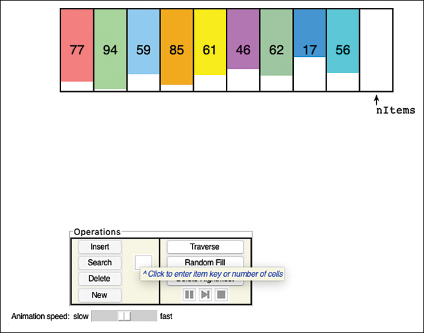

# 附录

运行可视化
在本附录 A 中

- 对于开发人员：运行和更改可视化
- 对于经理：下载和运行可视化
- 对于其他人：在 Internet 上查看可视化效果
- 使用可视化

我们相信主动学习是掌握新材料的最佳方式。 阅读书籍和参加讲座提供了关键概念，但通过解决实践问题和进行实验来应用这些知识可以使抽象概念更加具体。
要理解数据结构和算法，有助于了解它们的实际应用。 为此，我们开发了本书中描述的大多数数据结构和算法的交互式可视化。 这些程序显示了每个结构中数据的逐步处理，让你看到所有关键操作。 你可以使用自己的数据尝试这些结构，看看它们是如何处理的。 各个章节建议你尝试使用可视化进行练习，以确保你看到每个结构和算法的重要行为。
你可以通过多种方式运行可视化程序。 对每个读者来说最好的方法取决于你打算做多少编程。 对于计划或已经成为软件开发人员的读者，我们鼓励你下载源代码并在带有编辑器或其他集成开发环境的计算机上运行程序。 你甚至可以通过为可视化的开源软件项目做出贡献来帮助未来的学生。 你的经验可以帮助提出新的方法，使复杂的想法更容易被其他人理解。 按照"开发人员：运行和更改可视化效果"中的说明进行操作。
如果你不打算进行大量编程，但仍想尝试在你自己的数据上运行可视化，你可以下载它们并在个人计算机上运行。 对于管理或分析软件开发的人来说，这种方法是一个不错的选择，而无需自己编写太多代码。 如果这适合你的需要，请按照"对于经理：下载和运行可视化"中的说明进行操作。
如果你不打算进行任何编程并且可以连接到 Internet，则可以在 Web 浏览器中运行可视化。 这些程序是用 Python 编写的，并使用 Tk 显示它们的可视化，这意味着它们不在浏览器中执行。 这增加了额外的界面层，在某种程度上限制了你可以做什么和看到什么。 然而，对于无法使用计算机进行软件开发的人来说，这可能是唯一的选择。 如果是这种情况，请按照"对于其他人：在 Internet 上查看可视化效果"中的说明进行操作。
在你能够启动可视化后，请务必阅读最后的"使用可视化"部分。 本节解释所有可视化及其用户界面的一些关键特性，包括可视化中的一些限制，这些限制不一定存在于数据结构的实际实现中。

## 对于开发人员：运行和更改可视化

为了最大限度地提高你运行程序并为你自己的实验修改它们或为开源软件项目做出贡献的能力，你需要在计划进行开发的计算机上至少安装三个软件：

- Python
- Git
- 可视化软件

前两个有不同的版本，具体取决于你计算机的操作系统。

### 获取 Python

要获得 Python 编程语言，你有很多选择。 首先，检查它是否已在你的系统上可用。 如果你已经熟悉 Windows Power Shell、Windows 命令解释器或 macOS 和 Linux 终端等命令行界面，请尝试启动这些界面之一并键入命令：

```
python3
```

如果安装了 Python 第 3 版，这应该会生成一些类似于以下内容的行：

```python
Python 3.7.5 (default, Nov  4 2019, 10:26:32)
[Clang 9.0.0 (clang-900.0.39.2)] on darwin
Type "help", "copyright", "credits" or "license" for more information.
>>>
```

如果这段代码没有出现，那么你可能需要安装 Python。 网上有很多地方可以获取Python。 第一个是 www.python.org/downloads，拥有 Python 的所有版本和许多针对不同操作系统的预配置下载。 它也是有关编程语言、不同版本、文档和未来提议更改的所有信息的官方来源。 可视化是使用 Python 第 3 版制作的。你需要一个以"3"开头的版本； 不要使用以"2"开头的。 或更低。 如果这是你第一次使用 Python，你可能需要点击文档链接阅读初学者指南。

### 获取 ```Git```

第二个工具 ```git``` 管理软件及其不同版本的集合。 它特别适合管理源代码，因为它提供了多种方式来跟踪文本文件中的更改。 ```Git``` 成为 ```Linux``` 操作系统开发人员的首选工具。 它的一个关键特性是它管理的软件集合（称为存储库）的分布式特性。 虽然 github.com 维护了大部分这些存储库的副本，但每个开发人员都在他们的本地存储库副本中获得了他们自己的完整存储库，包括所有更改历史记录。
```git``` 命令行工具非常强大，而且非常复杂也就不足为奇了。 它是由软件专业人员发明的，供软件专业人员使用。 然而，它的复杂性可能成为新手的障碍。 许多用户只需要基础知识，而图形用户界面可以使这一切变得容易得多。 ```GitHub Desktop``` 工具提供了一个简单的图形界面来处理存储库、它们的分支以及对这些分支的提交（更改）。
学习如何使用 ```git``` 命令行工具超出了本书的范围。 相反，我们描述了如何使用 ```GitHub Desktop```。 但是，如果你已经熟悉 ```git``` 命令行工具，请继续使用它，因为它可以完成 ```GitHub Desktop``` 所做的一切，甚至更多。
使用你的 Web 浏览器访问 https://desktop.github.com。 它应该会自动检测你计算机的操作系统并提供下载选项。 在撰写本文时，仅支持 Windows 和 macOS（在 Linux 上，你需要使用 git 命令行工具，它通常与 Linux 发行版捆绑在一起）。 按照下载说明安装 GitHub Desktop。
```GitHub Desktop``` 和 ```git``` 命令行工具都允许你查看存储库中的更改历史并对其中包含的文件进行新更改。 在下一节中，我们将讨论如何获取包含本书可视化效果的存储库。 如果你打算为开源可视化项目做出贡献，你还需要在 GitHub.com 网站上拥有一个帐户。 那是存储项目存储库的地方，你的用户帐户允许你为许多不同的项目做出贡献。 转到 https://github.com 并选择"注册"按钮以创建一个新帐户。

### 获取可视化

你需要的第三个软件是可视化代码本身，它捆绑在 https://github.com/JMCanning78/datastructures-visualization 上的 git 存储库中。 下载 git 存储库的过程称为克隆存储库。 如果你使用的是 ```Github Desktop```，请转到"文件">"克隆存储库"对话框。 选择 GitHub.com 选项卡，然后开始输入存储库名称 ```JMCanning78/datastructures-visualization```。 存储库应该作为你可以选择的选项弹出。 该对话框允许你在计算机上指定一个本地路径，它将存储克隆。 在 GitHub.com 上选择存储库并指定本地路径后，选择"克隆"按钮进行克隆。
如果你使用的是命令行版本的 ```git```，获取可视化软件的最佳方法是将你的一个命令行窗口放入你要存储该软件的父目录中，然后运行 ```git clone``` 命令。 例如，如果你想将存储库存储在 ```/Users/Me/myrepositories``` 中，命令将如下所示：

```sh
cd /Users/Me/myrepositories
git clone https://github.com/JMCanning78/datastructures-visualization
```

cd 命令是更改目录的缩写。 你的命令行工具可能对更改目录命令有不同的名称。 ```git clone``` 命令创建一个名为 ```datastructures-visualization``` 的子目录，其中包含 ```git``` 存储库的克隆。 你可以再次使用 ```cd``` 命令将当前工作目录更改为该子目录。 从该目录中，你可以通过运行来启动可视化

```sh
python3 DatastructureVisualizations.py
```

如果你收到有关缺少必需模块的消息，你可能需要将一些模块添加到你的 Python 环境中。 尝试运行 Python 安装程序 (```pip3```)，如下所示：

```sh
pip3 install -r requuirements.txt
```

如果你发现你的计算机没有 pip，可以在 https://pip.pypa.io/en/stable/ 获得有关安装方法的帮助。 当 pip3 成功运行时，尝试前面的命令来运行可视化。
如果你更喜欢使用集成开发环境 (IDE) 进行 Python 开发工作，则需要在 IDE 中注册克隆的存储库。 从那里，你应该能够运行 DatastructureVisualizations.py 或任何其他 Python 程序。

## 对于经理：下载和运行可视化

如果你有 macOS 或 Windows 台式计算机，则可以下载所有可视化效果的预打包集合。 它运行与前面描述的 ```DatastructureVisualizations.py``` 基本相同的程序。 浏览 https://datastructures.live/ 并查找与下载相关的链接。
软件包经过加密签名，有助于确保软件的完整性。 你的计算机及其恶意软件防护软件可能会在允许你运行之前询问你是否信任下载的可视化软件。

## 对于其他人：在 Internet 上查看可视化效果

你可以通过在 Web 浏览器中访问 https://datastructures.live/view/ 来查看可视化效果。 选择"运行"按钮时，网站会在服务器上运行可视化并将输出复制到 Web 浏览器窗口的窗格中。 初始屏幕类似于图 A-1。


图 A-1 在 Web 浏览器中查看可视化时的初始屏幕
选择顶部的"选择可视化"按钮以获取包含所有可以显示的可视化的菜单。
在 Web 浏览器中查看可视化有一些限制。 尤其是：

- 尽管你可以通过调整 Web 浏览器窗口的大小并将分隔栏拖动到"Powered by trinket"文本正上方来增加上部窗格的大小，但无法调整窗口的大小。
- 屏幕正在通过 Internet 复制，因此响应交互可能会出现断断续续或缓慢的更新。 发生这种情况时，请尝试使用可视化工具的较低动画速度或步进模式。
- 在带有鼠标和键盘的计算机上查看效果最佳。 在只有触摸屏的设备上查看 trinket.io 支持的网站可能不允许你输入操作参数的文本。 选择文本输入区域不会将键盘焦点放在该区域。

## 使用可视化

可视化是通常一次显示一种数据结构的小程序。 它们都具有类似的结构，顶部是一个绘图区，底部是一组控件（见图 A-2）。 在每一章中都有关于如何使用可视化的具体说明，以及所有章节通用的一些通用指南。



图 A-2 顶部的绘图区域和底部的一组控件
可视化在顶部的绘图区域中显示数据，如图 A-2 所示。 左下角的操作框是你启动数据结构操作的地方。 当按钮不适用时，它们会变灰并被禁用。 特别是，采用参数（如要插入的键）的操作位于"操作"框的左侧。 它们与一个文本输入区域组合在一起，在启用之前必须输入一个值。 蓝色文本的提示解释了可以在文本输入区域中为不同的操作参数键入的内容。 不带参数的操作，如遍历和随机填充，在右边。
操作框下方是一个滑块。 可以调整此控件以减慢或加快操作动画。 在动画期间，启用右下角的三个小按钮以提供精细控制。 三个按钮中最左边的按钮要么是用于恢复播放的三角形，要么是用于暂停动画的两个垂直条，具体取决于当前状态。 第二个按钮（带有一个指向垂直条的三角形）在动画中向前移动一个"步"。 该按钮仅在显示代码时启用，因为步骤由代码定义。 方形按钮停止当前操作并启用其他操作。 在操作完成之前停止操作会使数据结构处于奇怪的状态，例如留下数据项的额外副本或不对所有项进行排序。
在大多数操作过程中，代码框会出现在右下角（见图 A-3）。 它显示了书中描述的相同程序，突出显示了正在执行的程序部分。 在图中，正在对数组中的项目进行排序。 各种局部变量与数据结构一起显示在顶部的图中。 排序操作运行时仅启用三个动画按钮。 单步按钮周围的突出显示表示键盘焦点位于该按钮上。 当按钮具有键盘焦点时按空格键"按下"按钮。 按下按钮时，操作通常会在"播放"模式下开始运行。 按下按钮时按住 Shift 键，可以以步进模式开始操作（如果显示代码）。


图 A-3 右下方的代码框
每次操作完成后，代码和局部变量将保留在显示屏上，直到下一次操作开始。 状态或错误消息可以出现在窗口底部，滑动速度控件和代码框之间。 这些消息通常在操作完成时出现。 图 A-4 显示了在数组中成功搜索键 62 后的显示。


图 A-4 在数组中搜索键 62 的结果
在大多数可视化中，你可以单击数据项以将其选中并将其值复制到文本输入区域。 这使得拼写错误不太可能阻止搜索或删除现有值。
有关控件的提示消息可以出现在文本输入框和操作按钮旁边。 将鼠标指针悬停在其中一个上会显示一个简短提示，说明可以在该框中输入哪些值或按钮的作用。 当你第一次启动其中一个可视化时，它会显示一条消息，告诉你可以在所有文本输入框中输入的各种内容，如图 A-2 中的消息。
根据你运行可视化的方式，你可以调整窗口大小。 当数据量变得太大或代码行很宽时，此功能有时很有用。 代码文本框不会垂直增长，但可以为较长的程序滚动。 一些可视化需要更多的显示空间并提供滚动条来移动。 至少一种可视化还可以让用户放大和缩小特定区域。